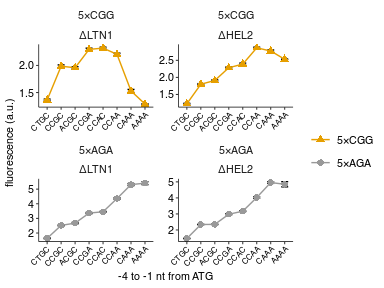

Fluorescence of PGK1 reporters with 5xCGG / 5xAGA inserts and varying Kozak in LTN1, HEL2 KO backgrounds
================
rasi
30 July, 2019

-   [Import libraries and analysis specific parameters](#import-libraries-and-analysis-specific-parameters)
-   [Read data](#read-data)
-   [Read annotations](#read-annotations)
-   [Rename and calculate average values of fluorescence channels in each well](#rename-and-calculate-average-values-of-fluorescence-channels-in-each-well)
-   [Calculate mean and standard error over replicates](#calculate-mean-and-standard-error-over-replicates)
-   [Plot mean YFP / RFP ratio as a function of initiation codon](#plot-mean-yfp-rfp-ratio-as-a-function-of-initiation-codon)
-   [Source data for S4 Fig panel A, left and middle columns](#source-data-for-s4-fig-panel-a-left-and-middle-columns)

Import libraries and analysis specific parameters
=================================================

``` r
# standard analysis and plotting functions, includes dplyr, ggplot2 
library(tidyverse)
# loads lab default ggplot2 theme and provides color-blind friendly palette
library(rasilabRtemplates)
# standard error
library(plotrix)

# initiation sites are arranged in this order
initiationmutation_order <- seq(1,8)
names(initiationmutation_order) <- toupper(c( 'ctgc', 'ccgc', 
                              'acgc', 'ccga', 'ccac', 'ccaa', 'caaa', 'aaaa'))

# this folder contains the data and annotations
fcs_file_folder <- "../../data/flow/5xcgg_3ko/"
```

Read data
=========

``` r
flowdata  <- read_tsv(paste0(fcs_file_folder, '/data.tsv.xz')) %>% 
  print()
```

    ## # A tibble: 2,318,900 x 7
    ##    plate well   FSC.A   SSC.A FITC.A PE.Texas.Red.A  Time
    ##    <int> <chr>  <int>   <int>  <int>          <int> <dbl>
    ##  1     1 B2     85888   54355    124             59  3.02
    ##  2     1 B2     73963   36519    159             46  3.04
    ##  3     1 B2     53515    -106    -62             -8  3.07
    ##  4     1 B2     89061   63773    115            -23  3.07
    ##  5     1 B2    118493  110589    449            170  3.08
    ##  6     1 B2     37302    -255   -119            109  3.08
    ##  7     1 B2     60404   41760     85             37  3.09
    ##  8     1 B2     45708   19942     72             89  3.10
    ##  9     1 B2     44316   35642    -18           -106  3.11
    ## 10     1 B2     53772   44921     15            -29  3.11
    ## # ... with 2,318,890 more rows

Read annotations
================

``` r
annotations  <- read_tsv(paste0(fcs_file_folder, '/annotations.tsv')) %>% 
  print()
```

    ## # A tibble: 232 x 8
    ##    plate well  strain replicate initiationmutat… codonmutation gene 
    ##    <int> <chr> <chr>      <int> <chr>            <chr>         <chr>
    ##  1     1 B2    by4741         1 CAAA             <NA>          <NA> 
    ##  2     1 B3    schp15         1 CAAA             <NA>          <NA> 
    ##  3     1 B4    schp19         1 CAAA             cgg           maxh…
    ##  4     1 B5    schp20         1 CAAA             aga           maxh…
    ##  5     1 B9    schp5…         1 CAAA             aga           pgk1 
    ##  6     1 B10   schp5…         1 CAAA             cgg           pgk1 
    ##  7     1 B11   schp5…         1 CCGA             cgg           pgk1 
    ##  8     1 C2    schp5…         1 CCGC             cgg           pgk1 
    ##  9     1 C3    schp5…         1 CCAA             cgg           pgk1 
    ## 10     1 C4    schp5…         1 CCAC             cgg           pgk1 
    ## # ... with 222 more rows, and 1 more variable: knockout <chr>

Rename and calculate average values of fluorescence channels in each well
=========================================================================

``` r
by_file <- flowdata  %>% 
  # group by each plate and well
  group_by(plate, well) %>% 
  select(FITC.A, PE.Texas.Red.A) %>% 
  # calculate mean
  summarise_all(mean) %>% 
  # rename
  rename('yfp' = FITC.A, 'rfp' = PE.Texas.Red.A) %>% 
  # join annotations
  left_join(annotations, by = c('plate', 'well')) %>% 
  print()
```

    ## # A tibble: 232 x 10
    ## # Groups:   plate [?]
    ##    plate well     yfp    rfp strain replicate initiationmutat…
    ##    <int> <chr>  <dbl>  <dbl> <chr>      <int> <chr>           
    ##  1     1 B10   5.92e3 1.78e4 schp5…         1 CAAA            
    ##  2     1 B11   9.16e3 1.87e4 schp5…         1 CCGA            
    ##  3     1 B2    9.02e1 2.11e1 by4741         1 CAAA            
    ##  4     1 B3    3.59e2 1.65e4 schp15         1 CAAA            
    ##  5     1 B4    3.55e3 1.54e4 schp19         1 CAAA            
    ##  6     1 B5    3.09e4 1.52e4 schp20         1 CAAA            
    ##  7     1 B9    2.12e4 1.91e4 schp5…         1 CAAA            
    ##  8     1 C10   1.78e4 1.91e4 schp5…         1 CCAA            
    ##  9     1 C11   1.40e4 1.91e4 schp5…         1 CCAC            
    ## 10     1 C2    7.76e3 1.80e4 schp5…         1 CCGC            
    ## # ... with 222 more rows, and 3 more variables: codonmutation <chr>,
    ## #   gene <chr>, knockout <chr>

Calculate mean and standard error over replicates
=================================================

``` r
avg_data  <- by_file %>% 
  # anti_join(bad_wells) %>% 
  # strain is used to get replicates
  group_by(strain) %>% 
  # calculate mean and std.err
  mutate(mean_yfp = mean(yfp), 
         mean_rfp = mean(rfp)) %>% 
  ungroup() %>% 
  mutate(yfp = yfp - mean_yfp[strain == "schp15" & replicate == 1], 
         rfp = rfp - mean_rfp[strain == "by4741" & replicate == 1]) %>% 
  mutate(yfp_rfp_ratio = yfp / rfp) %>% 
  # calculate mean and standard error
  group_by(strain) %>% 
  mutate(mean_yfp = mean(yfp), 
         mean_rfp = mean(rfp), 
         mean_ratio = mean(yfp_rfp_ratio), 
         se_yfp = std.error(yfp), 
         se_rfp = std.error(rfp),
         se_ratio = std.error(yfp_rfp_ratio),
         n = n()) %>% 
  slice(1) %>% 
  ungroup() %>% 
  print()
```

    ## # A tibble: 58 x 18
    ##    plate well      yfp     rfp strain replicate initiationmutat…
    ##    <int> <chr>   <dbl>   <dbl> <chr>      <int> <chr>           
    ##  1     1 B2    -2.75e2 -1.17e1 by4741         1 CAAA            
    ##  2     1 B3    -6.11e0  1.65e4 schp15         1 CAAA            
    ##  3     1 B4     3.19e3  1.54e4 schp19         1 CAAA            
    ##  4     1 B5     3.05e4  1.51e4 schp20         1 CAAA            
    ##  5     1 B9     2.08e4  1.90e4 schp5…         1 CAAA            
    ##  6     1 B10    5.55e3  1.78e4 schp5…         1 CAAA            
    ##  7     1 B11    8.79e3  1.86e4 schp5…         1 CCGA            
    ##  8     1 C2     7.40e3  1.80e4 schp5…         1 CCGC            
    ##  9     1 C3     8.32e3  1.80e4 schp5…         1 CCAA            
    ## 10     1 C4     8.73e3  1.82e4 schp5…         1 CCAC            
    ## # ... with 48 more rows, and 11 more variables: codonmutation <chr>,
    ## #   gene <chr>, knockout <chr>, mean_yfp <dbl>, mean_rfp <dbl>,
    ## #   yfp_rfp_ratio <dbl>, mean_ratio <dbl>, se_yfp <dbl>, se_rfp <dbl>,
    ## #   se_ratio <dbl>, n <int>

``` r
normalization <- avg_data %>% 
  filter(strain == "schp19")
```

Plot mean YFP / RFP ratio as a function of initiation codon
===========================================================

``` r
plot_data <- avg_data %>% 
  mutate(mean_ratio = mean_ratio / normalization[[1, "mean_ratio"]]) %>%
  mutate(se_ratio = se_ratio / normalization[[1, "mean_ratio"]]) %>%
  filter(gene == "pgk1", knockout != "ΔASC1") %>% 
  mutate(codonmutation = forcats::fct_rev(paste0("5×", toupper(codonmutation)))) %>%
  mutate(knockout = forcats::fct_relevel(knockout, "ΔLTN1", "ΔHEL2")) %>% 
  filter(initiationmutation != "CTG") %>%
  # arrange initiationmutation in this order
  mutate(initiationmutation = fct_reorder(
      initiationmutation,
      initiationmutation_order[initiationmutation])) %>%
  print()
```

    ## # A tibble: 32 x 18
    ##    plate well     yfp    rfp strain replicate initiationmutat…
    ##    <int> <chr>  <dbl>  <dbl> <chr>      <int> <fct>           
    ##  1     1 B9    20806. 19034. schp5…         1 CAAA            
    ##  2     1 B10    5550. 17789. schp5…         1 CAAA            
    ##  3     1 B11    8793. 18634. schp5…         1 CCGA            
    ##  4     1 C2     7398. 18003. schp5…         1 CCGC            
    ##  5     1 C3     8316. 18028. schp5…         1 CCAA            
    ##  6     1 C4     8728. 18247. schp5…         1 CCAC            
    ##  7     1 C5     4904. 17313. schp5…         1 CTGC            
    ##  8     1 C6     4705. 17798. schp5…         1 AAAA            
    ##  9     1 C7     7419. 18411. schp5…         1 ACGC            
    ## 10     1 C9     9687. 18527. schp5…         1 CCGC            
    ## # ... with 22 more rows, and 11 more variables: codonmutation <fct>,
    ## #   gene <chr>, knockout <fct>, mean_yfp <dbl>, mean_rfp <dbl>,
    ## #   yfp_rfp_ratio <dbl>, mean_ratio <dbl>, se_yfp <dbl>, se_rfp <dbl>,
    ## #   se_ratio <dbl>, n <int>

``` r
plot_data %>%
  ggplot(aes(x = initiationmutation, y = mean_ratio,
             ymin = mean_ratio - se_ratio, ymax = mean_ratio + se_ratio,
             group = codonmutation, color = codonmutation, shape = codonmutation)) +
  geom_errorbar(width = 0.5, color = "black") +
  geom_point(size = 2, height = 0, width = 0.1) +
  geom_line(size = 0.5) +
  facet_wrap(codonmutation ~ knockout, ncol = 2, scales = "free") +
  scale_color_manual(values = cbPalette[c(2,1)]) +
  scale_shape_manual(values = c(17,16)) +
  labs(y = 'fluorescence (a.u.)',
       x = '-4 to -1 nt from ATG', color = "", shape = "") +
  theme(legend.title = element_text(size = 8),
        axis.text.x = element_text(angle = 45, hjust = 1, size = 6)) +
  scale_y_continuous(breaks = scales::pretty_breaks(n=4))
```



``` r
ggsave('figures/5xcgg_3ko.pdf')
```

Source data for S4 Fig panel A, left and middle columns
=======================================================

``` r
plot_data %>% 
  arrange(knockout, codonmutation, initiationmutation) %>% 
  select(knockout, codonmutation, initiationmutation, mean_ratio, se_ratio, n) %>% 
  mutate_if(is.numeric, funs(round(., 3))) %>% 
  knitr::kable()
```

| knockout | codonmutation | initiationmutation |  mean\_ratio|  se\_ratio|    n|
|:---------|:--------------|:-------------------|------------:|----------:|----:|
| ΔLTN1    | 5×CGG         | CTGC               |        1.362|      0.016|    4|
| ΔLTN1    | 5×CGG         | CCGC               |        1.985|      0.025|    4|
| ΔLTN1    | 5×CGG         | ACGC               |        1.957|      0.018|    4|
| ΔLTN1    | 5×CGG         | CCGA               |        2.295|      0.023|    4|
| ΔLTN1    | 5×CGG         | CCAC               |        2.320|      0.017|    4|
| ΔLTN1    | 5×CGG         | CCAA               |        2.204|      0.022|    4|
| ΔLTN1    | 5×CGG         | CAAA               |        1.529|      0.028|    4|
| ΔLTN1    | 5×CGG         | AAAA               |        1.288|      0.004|    4|
| ΔLTN1    | 5×AGA         | CTGC               |        1.639|      0.032|    4|
| ΔLTN1    | 5×AGA         | CCGC               |        2.521|      0.033|    4|
| ΔLTN1    | 5×AGA         | ACGC               |        2.678|      0.044|    4|
| ΔLTN1    | 5×AGA         | CCGA               |        3.363|      0.039|    4|
| ΔLTN1    | 5×AGA         | CCAC               |        3.452|      0.029|    4|
| ΔLTN1    | 5×AGA         | CCAA               |        4.361|      0.049|    4|
| ΔLTN1    | 5×AGA         | CAAA               |        5.309|      0.065|    4|
| ΔLTN1    | 5×AGA         | AAAA               |        5.409|      0.101|    4|
| ΔHEL2    | 5×CGG         | CTGC               |        1.227|      0.014|    4|
| ΔHEL2    | 5×CGG         | CCGC               |        1.799|      0.017|    4|
| ΔHEL2    | 5×CGG         | ACGC               |        1.910|      0.019|    4|
| ΔHEL2    | 5×CGG         | CCGA               |        2.284|      0.018|    4|
| ΔHEL2    | 5×CGG         | CCAC               |        2.389|      0.029|    4|
| ΔHEL2    | 5×CGG         | CCAA               |        2.866|      0.020|    4|
| ΔHEL2    | 5×CGG         | CAAA               |        2.773|      0.030|    4|
| ΔHEL2    | 5×CGG         | AAAA               |        2.530|      0.006|    4|
| ΔHEL2    | 5×AGA         | CTGC               |        1.470|      0.018|    4|
| ΔHEL2    | 5×AGA         | CCGC               |        2.340|      0.016|    4|
| ΔHEL2    | 5×AGA         | ACGC               |        2.352|      0.019|    4|
| ΔHEL2    | 5×AGA         | CCGA               |        2.982|      0.032|    4|
| ΔHEL2    | 5×AGA         | CCAC               |        3.170|      0.017|    4|
| ΔHEL2    | 5×AGA         | CCAA               |        4.023|      0.047|    4|
| ΔHEL2    | 5×AGA         | CAAA               |        4.958|      0.052|    4|
| ΔHEL2    | 5×AGA         | AAAA               |        4.849|      0.161|    4|
