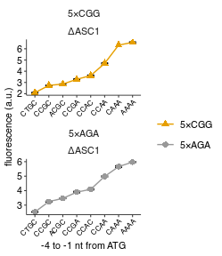

Fluorescence of PGK1 reporters with 5xCGG / 5xAGA inserts and varying Kozak in ASC1 KO background
================
rasi
07 January, 2019

-   [Import libraries and analysis specific parameters](#import-libraries-and-analysis-specific-parameters)
-   [Read data](#read-data)
-   [Read annotations](#read-annotations)
-   [Rename and calculate average values of fluorescence channels in each well](#rename-and-calculate-average-values-of-fluorescence-channels-in-each-well)
-   [Calculate mean and standard error over replicates](#calculate-mean-and-standard-error-over-replicates)
-   [Plot mean YFP / RFP ratio as a function of initiation codon](#plot-mean-yfp-rfp-ratio-as-a-function-of-initiation-codon)

Import libraries and analysis specific parameters
=================================================

``` r
# loads lab default ggplot2 theme and provides color-blind friendly palette
library(rasilabRtemplates)
# standard analysis and plotting functions, includes dplyr, ggplot2 
library(tidyverse)
# standard error
library(plotrix)

# intiiation sites are arranged in this order
initiationmutation_order <- seq(1,8)
names(initiationmutation_order) <- toupper(c( 'ctgc', 'ccgc', 
                              'acgc', 'ccga', 'ccac', 'ccaa', 'caaa', 'aaaa'))

# bad wells that had zero or abnormal signals. These are excluded from analysis.
bad_wells <- list(
    list('strain' = 'schp539' , 'replicate' = 1),
    list('strain' = 'schp550' , 'replicate' = 3),
    list('strain' = 'schp551' , 'replicate' = 2),
    list('strain' = 'schp540' , 'replicate' = 1),
    list('strain' = 'schp540' , 'replicate' = 3),
    list('strain' = 'schp540' , 'replicate' = 4)
) %>% 
  bind_rows()

# this folder contains the data and annotations
fcs_file_folder <- "../../data/flow/5xcgg_asc1ko/"
```

Read data
=========

``` r
flowdata  <- read_tsv(paste0(fcs_file_folder, '/data.tsv.xz')) %>% 
  print()
```

    ## # A tibble: 880,000 x 7
    ##    plate well   FSC.A  SSC.A FITC.A PE.Texas.Red.A  Time
    ##    <int> <chr>  <int>  <int>  <int>          <int> <dbl>
    ##  1     1 B2     79751  57828    107            -43  3.02
    ##  2     1 B2     35978  30375    127            -66  3.02
    ##  3     1 B2    130616 135580    261            157  3.02
    ##  4     1 B2     42434  19568    -43             97  3.04
    ##  5     1 B2     49975  31281     65            136  3.04
    ##  6     1 B2     45023  44547    140           -107  3.06
    ##  7     1 B2     47264  24246    113            -95  3.06
    ##  8     1 B2     39360  35348     72             65  3.07
    ##  9     1 B2     55517  50396    119            114  3.07
    ## 10     1 B2     51899  41092    196             28  3.08
    ## # ... with 879,990 more rows

Read annotations
================

``` r
annotations  <- read_tsv(paste0(fcs_file_folder, '/annotations.tsv')) %>% 
  print()
```

    ## # A tibble: 88 x 8
    ##    plate well  strain  replicate initiationmutation codonmutation gene   
    ##    <int> <chr> <chr>       <int> <chr>              <chr>         <chr>  
    ##  1     1 B2    by4741          1 CAAA               <NA>          <NA>   
    ##  2     1 B3    schp15          1 CAAA               <NA>          <NA>   
    ##  3     1 B4    schp19          1 CAAA               cgg           maxhis3
    ##  4     1 B5    schp20          1 CAAA               aga           maxhis3
    ##  5     1 B7    schp539         1 CAAA               aga           pgk1   
    ##  6     1 B8    schp540         1 CAAA               cgg           pgk1   
    ##  7     1 B9    schp541         1 CCGA               cgg           pgk1   
    ##  8     1 B10   schp542         1 CCGC               cgg           pgk1   
    ##  9     1 B11   schp543         1 CCAA               cgg           pgk1   
    ## 10     1 C2    schp544         1 CCAC               cgg           pgk1   
    ## # ... with 78 more rows, and 1 more variable: knockout <chr>

Rename and calculate average values of fluorescence channels in each well
=========================================================================

``` r
by_file <- flowdata  %>% 
  # group by each plate and well
  group_by(plate, well) %>% 
  select(FITC.A, PE.Texas.Red.A) %>% 
  # calculate mean
  summarise_all(mean) %>% 
  # rename
  rename('yfp' = FITC.A, 'rfp' = PE.Texas.Red.A) %>% 
  # join annotations
  left_join(annotations, by = c('plate', 'well')) %>% 
  print()
```

    ## # A tibble: 88 x 10
    ## # Groups:   plate [?]
    ##    plate well     yfp     rfp strain  replicate initiationmutation
    ##    <int> <chr>  <dbl>   <dbl> <chr>       <int> <chr>             
    ##  1     1 B10   11445. 20151.  schp542         1 CCGC              
    ##  2     1 B11   20449. 21159.  schp543         1 CCAA              
    ##  3     1 B2      115.    29.7 by4741          1 CAAA              
    ##  4     1 B3      370. 16351.  schp15          1 CAAA              
    ##  5     1 B4     3637. 16261.  schp19          1 CAAA              
    ##  6     1 B5    29386. 15557.  schp20          1 CAAA              
    ##  7     1 B7    19270. 31498.  schp539         1 CAAA              
    ##  8     1 B8    19190. 30629.  schp540         1 CAAA              
    ##  9     1 B9    12528. 19049.  schp541         1 CCGA              
    ## 10     1 C10   15749. 20293.  schp552         1 CCGA              
    ## # ... with 78 more rows, and 3 more variables: codonmutation <chr>,
    ## #   gene <chr>, knockout <chr>

Calculate mean and standard error over replicates
=================================================

``` r
avg_data  <- by_file %>% 
  anti_join(bad_wells) %>%
  # strain is used to get replicates
  group_by(strain) %>% 
  # calculate mean and std.err
  mutate(mean_yfp = mean(yfp), 
         mean_rfp = mean(rfp)) %>% 
  ungroup() %>% 
  mutate(yfp = yfp - mean_yfp[strain == "schp15" & replicate == 1], 
         rfp = rfp - mean_rfp[strain == "by4741" & replicate == 1]) %>% 
  mutate(yfp_rfp_ratio = yfp / rfp) %>% 
  # calculate mean and standard error
  group_by(strain) %>% 
  mutate(mean_yfp = mean(yfp), 
         mean_rfp = mean(rfp), 
         mean_ratio = mean(yfp_rfp_ratio), 
         se_yfp = std.error(yfp), 
         se_rfp = std.error(rfp),
         se_ratio = std.error(yfp_rfp_ratio),
         n = n()) %>% 
  slice(1) %>% 
  ungroup() %>% 
  print()
```

    ## # A tibble: 22 x 18
    ##    plate well       yfp       rfp strain  replicate initiationmutation
    ##    <int> <chr>    <dbl>     <dbl> <chr>       <int> <chr>             
    ##  1     1 B2      -234.      -8.47 by4741          1 CAAA              
    ##  2     1 B3        21.3  16313.   schp15          1 CAAA              
    ##  3     1 B4      3289.   16223.   schp19          1 CAAA              
    ##  4     1 B5     29037.   15519.   schp20          1 CAAA              
    ##  5     2 B7     24005.   20883.   schp539         2 CAAA              
    ##  6     2 B8     26844.   21250.   schp540         2 CAAA              
    ##  7     1 B9     12179.   19010.   schp541         1 CCGA              
    ##  8     1 B10    11097.   20112.   schp542         1 CCGC              
    ##  9     1 B11    20100.   21121.   schp543         1 CCAA              
    ## 10     1 C2     13911.   19262.   schp544         1 CCAC              
    ## # ... with 12 more rows, and 11 more variables: codonmutation <chr>,
    ## #   gene <chr>, knockout <chr>, mean_yfp <dbl>, mean_rfp <dbl>,
    ## #   yfp_rfp_ratio <dbl>, mean_ratio <dbl>, se_yfp <dbl>, se_rfp <dbl>,
    ## #   se_ratio <dbl>, n <int>

``` r
normalization <- avg_data %>% 
  filter(strain == "schp19")
```

Plot mean YFP / RFP ratio as a function of initiation codon
===========================================================

``` r
plot_data <- avg_data %>% 
  mutate(mean_ratio = mean_ratio / normalization[[1, "mean_ratio"]]) %>%
  mutate(se_ratio = se_ratio / normalization[[1, "mean_ratio"]]) %>%
  filter(gene == "pgk1") %>% 
  mutate(codonmutation = forcats::fct_rev(paste0("5×", toupper(codonmutation)))) %>%
  mutate(knockout = forcats::fct_relevel(knockout, "ΔASC1")) %>% 
  filter(initiationmutation != "CTG") %>%
  # arrange initiationmutation in this order
  mutate(initiationmutation = fct_reorder(
      initiationmutation,
      initiationmutation_order[initiationmutation])) %>%
  print()
```

    ## # A tibble: 16 x 18
    ##    plate well     yfp    rfp strain  replicate initiationmutation
    ##    <int> <chr>  <dbl>  <dbl> <chr>       <int> <fct>             
    ##  1     2 B7    24005. 20883. schp539         2 CAAA              
    ##  2     2 B8    26844. 21250. schp540         2 CAAA              
    ##  3     1 B9    12179. 19010. schp541         1 CCGA              
    ##  4     1 B10   11097. 20112. schp542         1 CCGC              
    ##  5     1 B11   20100. 21121. schp543         1 CCAA              
    ##  6     1 C2    13911. 19262. schp544         1 CCAC              
    ##  7     1 C3     7574. 18178. schp545         1 CTGC              
    ##  8     1 C4    25619. 19437. schp546         1 AAAA              
    ##  9     1 C5    11110. 19328. schp547         1 ACGC              
    ## 10     1 C7    12886. 19857. schp549         1 CCGC              
    ## 11     1 C8    19544. 19903. schp550         1 CCAA              
    ## 12     1 C9    16654. 20377. schp551         1 CCAC              
    ## 13     1 C10   15400. 20255. schp552         1 CCGA              
    ## 14     1 C11   10080. 20091. schp553         1 CTGC              
    ## 15     1 D2    24573. 20527. schp554         1 AAAA              
    ## 16     1 D3    14061. 20470. schp555         1 ACGC              
    ## # ... with 11 more variables: codonmutation <fct>, gene <chr>,
    ## #   knockout <fct>, mean_yfp <dbl>, mean_rfp <dbl>, yfp_rfp_ratio <dbl>,
    ## #   mean_ratio <dbl>, se_yfp <dbl>, se_rfp <dbl>, se_ratio <dbl>, n <int>

``` r
plot_data %>%
  ggplot(aes(x = initiationmutation, y = mean_ratio,
             ymin = mean_ratio - se_ratio, ymax = mean_ratio + se_ratio,
             group = codonmutation, color = codonmutation, shape = codonmutation)) +
  geom_errorbar(width = 0.5, color = "black") +
  geom_point(size = 2, height = 0, width = 0.1) +
  geom_line(size = 0.5) +
  facet_wrap(codonmutation ~ knockout, ncol = 1, scales = "free") +
  scale_color_manual(values = cbPalette[c(2,1)]) +
  scale_shape_manual(values = c(17,16)) +
  labs(y = 'fluorescence (a.u.)',
       x = '-4 to -1 nt from ATG', color = "", shape = "") +
  theme(legend.title = element_text(size = 8),
        axis.text.x = element_text(angle = 45, hjust = 1, size = 6)) +
  scale_y_continuous(breaks = scales::pretty_breaks(n=4))
```



``` r
ggsave('figures/5xcgg_asc1ko.pdf')

plot_data %>% 
  arrange(knockout, codonmutation, initiationmutation) %>% 
  select(knockout, codonmutation, initiationmutation, mean_ratio, se_ratio, n) %>% 
  mutate_if(is.numeric, funs(round(., 3))) %>% 
  knitr::kable()
```

| knockout | codonmutation | initiationmutation |  mean\_ratio|  se\_ratio|    n|
|:---------|:--------------|:-------------------|------------:|----------:|----:|
| ΔASC1    | 5×CGG         | CTGC               |        2.094|      0.002|    4|
| ΔASC1    | 5×CGG         | CCGC               |        2.736|      0.017|    4|
| ΔASC1    | 5×CGG         | ACGC               |        2.859|      0.010|    4|
| ΔASC1    | 5×CGG         | CCGA               |        3.280|      0.036|    4|
| ΔASC1    | 5×CGG         | CCAC               |        3.619|      0.032|    4|
| ΔASC1    | 5×CGG         | CCAA               |        4.698|      0.036|    4|
| ΔASC1    | 5×CGG         | CAAA               |        6.327|         NA|    1|
| ΔASC1    | 5×CGG         | AAAA               |        6.567|      0.042|    4|
| ΔASC1    | 5×AGA         | CTGC               |        2.526|      0.018|    4|
| ΔASC1    | 5×AGA         | CCGC               |        3.244|      0.025|    4|
| ΔASC1    | 5×AGA         | ACGC               |        3.468|      0.018|    4|
| ΔASC1    | 5×AGA         | CCGA               |        3.898|      0.048|    4|
| ΔASC1    | 5×AGA         | CCAC               |        4.092|      0.039|    3|
| ΔASC1    | 5×AGA         | CCAA               |        4.984|      0.038|    3|
| ΔASC1    | 5×AGA         | CAAA               |        5.660|      0.051|    3|
| ΔASC1    | 5×AGA         | AAAA               |        5.976|      0.037|    4|
