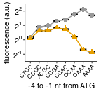

Fluorescence of PGK1 WT reporters with 8xCCG / 8xCCA inserts and varying 5'UTR mutations
================
rasi
02 January, 2019

-   [Import libraries and analysis specific parameters](#import-libraries-and-analysis-specific-parameters)
-   [Read data](#read-data)
-   [Read annotations](#read-annotations)
-   [Rename and calculate average values of fluorescence channels in each well](#rename-and-calculate-average-values-of-fluorescence-channels-in-each-well)
-   [Calculate mean and standard error over replicates](#calculate-mean-and-standard-error-over-replicates)
-   [Plot and tabulate background subtracted and normalized YFP/RFP ratio as a function of initiation codon](#plot-and-tabulate-background-subtracted-and-normalized-yfprfp-ratio-as-a-function-of-initiation-codon)

Import libraries and analysis specific parameters
=================================================

``` r
# standard analysis and plotting functions, includes dplyr, ggplot2 
library(tidyverse)
# loads lab default ggplot2 theme and provides color-blind friendly palette
library(rasilabRtemplates)
# standard error
library(plotrix)

# initiation sites are arranged in this order
initiationmutation_order <- seq(1,8)
names(initiationmutation_order) <- toupper(c( 'ctgc', 'ccgc', 
                              'acgc', 'ccga', 'ccac', 'ccaa', 'caaa', 'aaaa'))

# this folder contains the data and annotations
fcs_file_folder <- "../../data/flow/8xccg_wt/"
```

Read data
=========

``` r
flowdata  <- read_tsv(paste0(fcs_file_folder, '/data.tsv')) %>% 
  print()
```

    ## # A tibble: 1,760,000 x 7
    ##    plate well  FSC.A SSC.A FITC.A PE.Texas.Red.A  Time
    ##    <int> <chr> <int> <int>  <int>          <int> <dbl>
    ##  1     1 B2    40984 27612    106            -60  3.03
    ##  2     1 B2    39139 25996     21            -44  3.04
    ##  3     1 B2    31477 31845     24             25  3.04
    ##  4     1 B2    50164 28411     54             49  3.04
    ##  5     1 B2    43336 53994     81             98  3.05
    ##  6     1 B2    46767 37968     76            145  3.05
    ##  7     1 B2    82223 38427    150            110  3.06
    ##  8     1 B2    41407 34166     51            -97  3.06
    ##  9     1 B2    74408 85217     57            120  3.07
    ## 10     1 B2    96767 46185    184            121  3.09
    ## # ... with 1,759,990 more rows

Read annotations
================

``` r
annotations  <- read_tsv(paste0(fcs_file_folder, '/annotations.tsv')) %>% 
  print()
```

    ## # A tibble: 176 x 7
    ##    plate well  strain  replicate initiationmutation codonmutation gene   
    ##    <int> <chr> <chr>       <int> <chr>              <chr>         <chr>  
    ##  1     1 B2    by4741          1 CAAA               <NA>          <NA>   
    ##  2     1 B3    schp15          1 CAAA               <NA>          <NA>   
    ##  3     1 B4    schp19          1 CAAA               cgg           maxhis3
    ##  4     1 B5    schp20          1 CAAA               aga           maxhis3
    ##  5     1 B8    schp617         1 CAAA               cca           pgk1   
    ##  6     1 B9    schp618         1 CCGC               cca           pgk1   
    ##  7     1 B10   schp619         1 CCAA               cca           pgk1   
    ##  8     1 B11   schp620         1 CCAC               cca           pgk1   
    ##  9     1 C2    schp621         1 CCGA               cca           pgk1   
    ## 10     1 C3    schp622         1 CTGC               cca           pgk1   
    ## # ... with 166 more rows

Rename and calculate average values of fluorescence channels in each well
=========================================================================

``` r
by_file <- flowdata  %>% 
  # group by each plate and well
  group_by(plate, well) %>% 
  select(FITC.A, PE.Texas.Red.A) %>% 
  # calculate mean
  summarise_all(mean) %>% 
  # rename
  rename('yfp' = FITC.A, 'rfp' = PE.Texas.Red.A) %>% 
  # join annotations
  left_join(annotations, by = c('plate', 'well')) %>% 
  print()
```

    ## # A tibble: 176 x 9
    ## # Groups:   plate [?]
    ##    plate well      yfp     rfp strain  replicate initiationmutation
    ##    <int> <chr>   <dbl>   <dbl> <chr>       <int> <chr>             
    ##  1     1 B10   10425.  22526.  schp619         1 CCAA              
    ##  2     1 B11    8421.  23356.  schp620         1 CCAC              
    ##  3     1 B2       56.8    22.5 by4741          1 CAAA              
    ##  4     1 B3      218.  21641.  schp15          1 CAAA              
    ##  5     1 B4     2964.  21404.  schp19          1 CAAA              
    ##  6     1 B5    22643.  19820.  schp20          1 CAAA              
    ##  7     1 B8    12417.  21590.  schp617         1 CAAA              
    ##  8     1 B9     6083.  23476.  schp618         1 CCGC              
    ##  9     1 C10    5493.  25341.  schp629         1 CCAC              
    ## 10     1 C11    5724.  24444.  schp630         1 CCGA              
    ## # ... with 166 more rows, and 2 more variables: codonmutation <chr>,
    ## #   gene <chr>

Calculate mean and standard error over replicates
=================================================

``` r
avg_data  <- by_file %>% 
  # anti_join(bad_wells) %>% 
  # strain is used to get replicates
  group_by(strain) %>% 
  # calculate mean and std.err
  mutate(mean_yfp = mean(yfp), 
         mean_rfp = mean(rfp)) %>% 
  ungroup() %>% 
  mutate(yfp = yfp - mean_yfp[strain == "schp15" & replicate == 1], 
         rfp = rfp - mean_rfp[strain == "by4741" & replicate == 1]) %>% 
  mutate(yfp_rfp_ratio = yfp / rfp) %>% 
  # calculate mean and standard error
  group_by(strain) %>% 
  mutate(mean_yfp = mean(yfp), 
         mean_rfp = mean(rfp), 
         mean_ratio = mean(yfp_rfp_ratio), 
         se_yfp = std.error(yfp), 
         se_rfp = std.error(rfp),
         se_ratio = std.error(yfp_rfp_ratio),
         n = n()) %>% 
  slice(1) %>% 
  ungroup() %>% 
  print()
```

    ## # A tibble: 22 x 17
    ##    plate well       yfp       rfp strain  replicate initiationmutation
    ##    <int> <chr>    <dbl>     <dbl> <chr>       <int> <chr>             
    ##  1     1 B2      -182.      -6.81 by4741          1 CAAA              
    ##  2     1 B3       -20.5  21611.   schp15          1 CAAA              
    ##  3     1 B4      2725.   21375.   schp19          1 CAAA              
    ##  4     1 B5     22405.   19791.   schp20          1 CAAA              
    ##  5     1 B8     12179.   21560.   schp617         1 CAAA              
    ##  6     1 B9      5844.   23447.   schp618         1 CCGC              
    ##  7     1 B10    10187.   22497.   schp619         1 CCAA              
    ##  8     1 B11     8182.   23327.   schp620         1 CCAC              
    ##  9     1 C2      8009.   23528.   schp621         1 CCGA              
    ## 10     1 C3      3445.   22145.   schp622         1 CTGC              
    ## # ... with 12 more rows, and 10 more variables: codonmutation <chr>,
    ## #   gene <chr>, mean_yfp <dbl>, mean_rfp <dbl>, yfp_rfp_ratio <dbl>,
    ## #   mean_ratio <dbl>, se_yfp <dbl>, se_rfp <dbl>, se_ratio <dbl>, n <int>

``` r
normalization <- avg_data %>% 
  filter(strain == "schp19")
```

Plot and tabulate background subtracted and normalized YFP/RFP ratio as a function of initiation codon
======================================================================================================

``` r
plot_data <- avg_data %>% 
  mutate(mean_ratio = mean_ratio / normalization[[1, "mean_ratio"]]) %>% 
  mutate(se_ratio = se_ratio / normalization[[1, "mean_ratio"]]) %>% 
  filter(initiationmutation != "CTG") %>%
  # arrange initiationmutation in this order
  mutate(initiationmutation = fct_reorder(
      initiationmutation,
      initiationmutation_order[initiationmutation])) %>%
  filter(gene == "pgk1") %>% 
  mutate(codonmutation = paste0("8×", toupper(codonmutation)))

plot_data %>% 
  ggplot(aes(x = initiationmutation, y = mean_ratio, 
             ymin = mean_ratio - se_ratio, ymax = mean_ratio + se_ratio,
             group = codonmutation)) +
  geom_point(size = 1.5) +
  geom_line() +
  geom_errorbar(width = 0.75) +
  facet_wrap(~fct_rev(codonmutation), ncol = 1, scales = "free") + 
  labs(y = 'fluorscence (a.u.)',
       x = '-4 to -1 from ATG') +
  theme(legend.title = element_text(size = 8),
        axis.text.x = element_text(angle = 45, hjust = 1, size = 6)) +
  scale_y_continuous(breaks = scales::pretty_breaks(n=4))
```



``` r
ggsave('figures/initiation_pgk1_ccg_flow.pdf')

plot_data %>% 
  arrange(codonmutation, initiationmutation) %>% 
  select(codonmutation, initiationmutation, mean_ratio, se_ratio, n) %>% 
  mutate_if(is.numeric, funs(round(., 3))) %>% 
  knitr::kable()
```

| codonmutation | initiationmutation |  mean\_ratio|  se\_ratio|    n|
|:--------------|:-------------------|------------:|----------:|----:|
| 8×CCA         | CTGC               |        1.139|      0.022|    8|
| 8×CCA         | CCGC               |        1.870|      0.023|    8|
| 8×CCA         | ACGC               |        1.973|      0.030|    8|
| 8×CCA         | CCGA               |        2.470|      0.036|    8|
| 8×CCA         | CCAC               |        2.641|      0.033|    8|
| 8×CCA         | CCAA               |        3.416|      0.041|    8|
| 8×CCA         | CAAA               |        4.305|      0.038|    8|
| 8×CCA         | AAAA               |        3.244|      0.055|    8|
| 8×CCG         | CTGC               |        1.075|      0.017|    8|
| 8×CCG         | CCGC               |        1.548|      0.027|    8|
| 8×CCG         | ACGC               |        1.541|      0.034|    8|
| 8×CCG         | CCGA               |        1.769|      0.034|    8|
| 8×CCG         | CCAC               |        1.667|      0.028|    8|
| 8×CCG         | CCAA               |        1.168|      0.013|    8|
| 8×CCG         | CAAA               |        0.619|      0.015|    8|
| 8×CCG         | AAAA               |        0.549|      0.015|    8|
