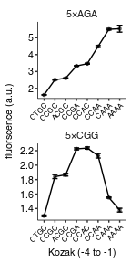
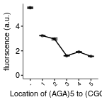

Fluorescence of PGK1 WT reporters with 5xCGG inserts at various locations and varying 5'UTR mutations
================
rasi
02 January, 2019

-   [Import libraries and analysis specific parameters](#import-libraries-and-analysis-specific-parameters)
-   [Read data](#read-data)
-   [Read annotations](#read-annotations)
-   [Rename and calculate average values of fluorescence channels in each well](#rename-and-calculate-average-values-of-fluorescence-channels-in-each-well)
-   [Calculate mean and standard error over replicates](#calculate-mean-and-standard-error-over-replicates)
-   [Plot and tabulate mean YFP / RFP ratio as a function of initiation codon](#plot-and-tabulate-mean-yfp-rfp-ratio-as-a-function-of-initiation-codon)
-   [Plot and tabulate mean YFP / RFP ratio as a function of stall location](#plot-and-tabulate-mean-yfp-rfp-ratio-as-a-function-of-stall-location)

Import libraries and analysis specific parameters
=================================================

``` r
# standard analysis and plotting functions, includes dplyr, ggplot2 
library(tidyverse)
# loads lab default ggplot2 theme and provides color-blind friendly palette
library(rasilabRtemplates)
# standard error
library(plotrix)

# initiation sites are arranged in this order
initiationmutation_order <- seq(1,8)
names(initiationmutation_order) <- toupper(c( 'ctgc', 'ccgc', 
                              'acgc', 'ccga', 'ccac', 'ccaa', 'caaa', 'aaaa'))

# this folder contains the data and annotations
fcs_file_folder <- "../../data/flow/cgg_position_number/"

# bad wells that had zero or abnormal signals. These are excluded from analysis.
bad_wells <- list(
  # this strain had an abnormally high RFP signal
  list("strain" = "schp281", "replicate" = 3),
  list("strain" = "schp307", "replicate" = 1)
) %>% 
  bind_rows()

# intiiation sites are arranged in this order
initiationmutation_order <- seq(1,8)
names(initiationmutation_order) <- toupper(c( 'ctgc', 'ccgc', 
                              'acgc', 'ccga', 'ccac', 'ccaa', 'caaa', 'aaaa'))
```

Read data
=========

``` r
flowdata  <- read_tsv(paste0(fcs_file_folder, '/data.tsv')) %>% 
  print()
```

    ## # A tibble: 960,000 x 7
    ##    plate well   FSC.A  SSC.A FITC.A PE.Texas.Red.A  Time
    ##    <int> <chr>  <int>  <int>  <int>          <int> <dbl>
    ##  1     1 B2     45525  37513      0           9906  3.03
    ##  2     1 B2     56178  27069      0          14479  3.05
    ##  3     1 B2    108310 110442      0          27619  3.10
    ##  4     1 B2     43568  40939      0          22695  3.27
    ##  5     1 B2     67495  59680      0          14446  3.33
    ##  6     1 B2     47252  41388      0          10573  3.35
    ##  7     1 B2     71405  50011      0          11321  3.36
    ##  8     1 B2     24110  26203      0           8581  3.39
    ##  9     1 B2     54332  31787      0           8973  3.40
    ## 10     1 B2     36466  30372      0          12573  3.44
    ## # ... with 959,990 more rows

Read annotations
================

``` r
annotations  <- read_tsv(paste0(fcs_file_folder, '/annotations.tsv')) %>% 
  print()
```

    ## # A tibble: 96 x 8
    ##    plate well  strain  replicate initiationmutat… codonmutation stallsites
    ##    <int> <chr> <chr>       <int> <chr>            <chr>         <chr>     
    ##  1     1 B2    schp15          1 CAAA             <NA>          -         
    ##  2     1 B3    schp19          1 CAAA             cgg           -         
    ##  3     1 B4    schp20          1 CAAA             aga           -         
    ##  4     1 B5    schp76          1 CAAA             aga           -         
    ##  5     1 B10   schp266         1 CCGA             cgg           5         
    ##  6     1 C5    schp271         1 CCGC             cgg           5         
    ##  7     1 C10   schp276         1 CCAA             cgg           5         
    ##  8     1 D5    schp281         1 CCAC             cgg           5         
    ##  9     1 D10   schp286         1 CTGC             cgg           5         
    ## 10     1 E5    schp291         1 AAAA             cgg           5         
    ## # ... with 86 more rows, and 1 more variable: gene <chr>

Rename and calculate average values of fluorescence channels in each well
=========================================================================

``` r
by_file <- flowdata  %>% 
  # group by each plate and well
  group_by(plate, well) %>% 
  select(FITC.A, PE.Texas.Red.A) %>% 
  # calculate mean
  summarise_all(mean) %>% 
  # rename
  rename('yfp' = FITC.A, 'rfp' = PE.Texas.Red.A) %>% 
  # join annotations
  left_join(annotations, by = c('plate', 'well')) %>% 
  print()
```

    ## # A tibble: 96 x 10
    ## # Groups:   plate [?]
    ##    plate well     yfp    rfp strain  replicate initiationmutation
    ##    <int> <chr>  <dbl>  <dbl> <chr>       <int> <chr>             
    ##  1     1 B10    8641. 19609. schp266         1 CCGA              
    ##  2     1 B2      470. 17840. schp15          1 CAAA              
    ##  3     1 B3     3585. 17445. schp19          1 CAAA              
    ##  4     1 B4    31805. 16912. schp20          1 CAAA              
    ##  5     1 B5    21821. 20724. schp76          1 CAAA              
    ##  6     1 C10    8424. 19496. schp276         1 CCAA              
    ##  7     1 C5     7112. 19692. schp271         1 CCGC              
    ##  8     1 D10    4966. 18804. schp286         1 CTGC              
    ##  9     1 D5     8536. 19519. schp281         1 CCAC              
    ## 10     1 E10    7598. 20053. schp296         1 ACGC              
    ## # ... with 86 more rows, and 3 more variables: codonmutation <chr>,
    ## #   stallsites <chr>, gene <chr>

Calculate mean and standard error over replicates
=================================================

``` r
avg_data  <- by_file %>% 
  anti_join(bad_wells) %>%
  # strain is used to get replicates
  group_by(strain) %>% 
  # calculate mean and std.err
  mutate(mean_yfp = mean(yfp), 
         mean_rfp = mean(rfp)) %>% 
  ungroup() %>% 
  mutate(yfp = yfp - mean_yfp[strain == "schp15" & replicate == 1], 
         rfp = rfp - mean_rfp[strain == "by4741" & replicate == 1]) %>% 
  mutate(yfp_rfp_ratio = yfp / rfp) %>% 
  # calculate mean and standard error
  group_by(strain) %>% 
  mutate(mean_yfp = mean(yfp), 
         mean_rfp = mean(rfp), 
         mean_ratio = mean(yfp_rfp_ratio), 
         se_yfp = std.error(yfp), 
         se_rfp = std.error(rfp),
         se_ratio = std.error(yfp_rfp_ratio),
         n = n()) %>% 
  slice(1) %>% 
  ungroup() %>% 
  print()
```

    ## # A tibble: 24 x 18
    ##    plate well        yfp      rfp strain  replicate initiationmutation
    ##    <int> <chr>     <dbl>    <dbl> <chr>       <int> <chr>             
    ##  1     1 H2      -304.       1.10 by4741          1 CAAA              
    ##  2     1 B2        -3.40 17690.   schp15          1 CAAA              
    ##  3     1 B3      3112.   17294.   schp19          1 CAAA              
    ##  4     1 B4     31332.   16761.   schp20          1 CAAA              
    ##  5     1 B10     8167.   19459.   schp266         1 CCGA              
    ##  6     1 C5      6639.   19541.   schp271         1 CCGC              
    ##  7     1 C10     7950.   19345.   schp276         1 CCAA              
    ##  8     1 D5      8063.   19369.   schp281         1 CCAC              
    ##  9     1 D10     4492.   18653.   schp286         1 CTGC              
    ## 10     1 E5      4802.   18882.   schp291         1 AAAA              
    ## # ... with 14 more rows, and 11 more variables: codonmutation <chr>,
    ## #   stallsites <chr>, gene <chr>, mean_yfp <dbl>, mean_rfp <dbl>,
    ## #   yfp_rfp_ratio <dbl>, mean_ratio <dbl>, se_yfp <dbl>, se_rfp <dbl>,
    ## #   se_ratio <dbl>, n <int>

``` r
normalization <- avg_data %>% 
  filter(strain == "schp19")
```

Plot and tabulate mean YFP / RFP ratio as a function of initiation codon
========================================================================

``` r
plot_data <- avg_data %>% 
  mutate(mean_ratio = mean_ratio / normalization[[1, "mean_ratio"]]) %>% 
  mutate(se_ratio = se_ratio / normalization[[1, "mean_ratio"]]) %>% 
  filter(gene == "pgk1") %>% 
  filter(stallsites == 5 | stallsites == "-") %>% 
  # arrange initiationmutation in this order
  mutate(initiationmutation = fct_reorder(
      initiationmutation,
      initiationmutation_order[initiationmutation])) %>%
  mutate(codonmutation = paste0("5×", toupper(codonmutation)))

plot_data %>% 
  ggplot(aes(x = initiationmutation, y = mean_ratio, 
             ymin = mean_ratio - se_ratio, ymax = mean_ratio + se_ratio,
             group = codonmutation)) +
  geom_point(size = 1, height = 0, width = 0.1, alpha = 0.5) +
  geom_line() +
  geom_errorbar(width = 0.5) +
  facet_wrap(~codonmutation, ncol = 1, scales = "free") + 
  labs(y = 'fluorscence (a.u.)',
       x = 'Kozak (-4 to -1)') +
  theme(legend.title = element_text(size = 8),
        axis.text.x = element_text(angle = 45, hjust = 1, size = 6)) +
  scale_y_continuous(breaks = scales::pretty_breaks(n=4))
```



``` r
ggsave('figures/5xcgg_wt.pdf')

plot_data %>% 
  arrange(codonmutation, initiationmutation) %>% 
  select(codonmutation, initiationmutation, mean_ratio, se_ratio, n) %>% 
  knitr::kable()
```

| codonmutation | initiationmutation |  mean\_ratio|  se\_ratio|    n|
|:--------------|:-------------------|------------:|----------:|----:|
| 5×AGA         | CTGC               |     1.616818|  0.0060804|    4|
| 5×AGA         | CCGC               |     2.516727|  0.0256822|    4|
| 5×AGA         | ACGC               |     2.610104|  0.0182263|    4|
| 5×AGA         | CCGA               |     3.331025|  0.0223068|    4|
| 5×AGA         | CCAC               |     3.465894|  0.0309015|    4|
| 5×AGA         | CCAA               |     4.483857|  0.0560538|    4|
| 5×AGA         | CAAA               |     5.502353|  0.0474452|    4|
| 5×AGA         | AAAA               |     5.532274|  0.2008679|    4|
| 5×CGG         | CTGC               |     1.298411|  0.0108483|    4|
| 5×CGG         | CCGC               |     1.841687|  0.0277132|    4|
| 5×CGG         | ACGC               |     1.867982|  0.0185796|    4|
| 5×CGG         | CCGA               |     2.225407|  0.0137366|    4|
| 5×CGG         | CCAC               |     2.236342|  0.0151843|    3|
| 5×CGG         | CCAA               |     2.129805|  0.0311760|    4|
| 5×CGG         | CAAA               |     1.551113|  0.0076931|    4|
| 5×CGG         | AAAA               |     1.377644|  0.0257912|    4|

Plot and tabulate mean YFP / RFP ratio as a function of stall location
======================================================================

``` r
plot_data <- avg_data %>% 
  mutate(mean_ratio = mean_ratio / normalization[[1, "mean_ratio"]]) %>% 
  mutate(se_ratio = se_ratio / normalization[[1, "mean_ratio"]]) %>% 
  filter(gene == "pgk1") %>% 
  filter(initiationmutation == "CAAA") %>%
  mutate(codonmutation = paste0("5×", toupper(codonmutation)))

plot_data %>% 
  ggplot(aes(x = stallsites, y = mean_ratio, 
             ymin = mean_ratio - se_ratio, ymax = mean_ratio + se_ratio,
             group = codonmutation)) +
  geom_point(size = 1, height = 0, width = 0.1, alpha = 0.5) +
  geom_line() +
  geom_errorbar(width = 0.5) +
  labs(y = 'fluorscence (a.u.)',
       x = 'Location of (AGA)5 to (CGG)5') +
  theme(legend.title = element_text(size = 8),
        axis.text.x = element_text(angle = 45, hjust = 1, size = 6)) +
  scale_y_continuous(limits = c(0, NA), breaks = scales::pretty_breaks(n=4))
```



``` r
ggsave('figures/stall_position_pgk1_cgg.pdf')

plot_data %>% 
  arrange(stallsites) %>% 
  select(stallsites, mean_ratio, se_ratio, n) %>% 
  mutate_if(is.numeric, funs(round(., 3))) %>% 
  knitr::kable()
```

| stallsites |  mean\_ratio|  se\_ratio|    n|
|:-----------|------------:|----------:|----:|
| -          |        5.502|      0.047|    4|
| 1          |        3.228|      0.008|    4|
| 2          |        2.959|      0.073|    4|
| 3          |        1.595|      0.009|    4|
| 4          |        1.910|      0.016|    4|
| 5          |        1.551|      0.008|    4|
