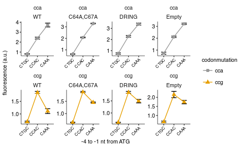
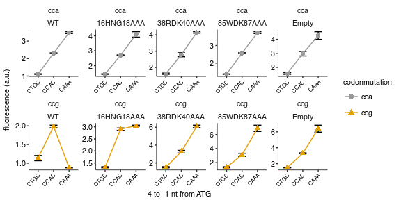

Fluorescence of PGK1 constructs with 8xCCG / 8xCCA inserts and varying Kozak, complementation by HEL2 and ASC1 mutants
================
rasi
07 January, 2019

-   [Import libraries and analysis specific parameters](#import-libraries-and-analysis-specific-parameters)
-   [Read data](#read-data)
-   [Read annotations](#read-annotations)
-   [Rename and calculate average values of fluorescence channels in each well](#rename-and-calculate-average-values-of-fluorescence-channels-in-each-well)
-   [Calculate mean and standard error over replicates](#calculate-mean-and-standard-error-over-replicates)
-   [Rescue of protein expression at high initiation rate by HEL2 mutants](#rescue-of-protein-expression-at-high-initiation-rate-by-hel2-mutants)
-   [Two-sided `t` test for difference in means between Empty and HEL2 mutants for a given 5'UTR mutant (8xCCG only)](#two-sided-t-test-for-difference-in-means-between-empty-and-hel2-mutants-for-a-given-5utr-mutant-8xccg-only)
-   [Rescue of protein expression at high initiation rate by ASC1 mutants](#rescue-of-protein-expression-at-high-initiation-rate-by-asc1-mutants)
-   [Two-sided `t` test for difference in means between Empty and ASC1 mutants for a given 5'UTR mutant (8xCCG only)](#two-sided-t-test-for-difference-in-means-between-empty-and-asc1-mutants-for-a-given-5utr-mutant-8xccg-only)

Import libraries and analysis specific parameters
=================================================

``` r
# loads lab default ggplot2 theme and provides color-blind friendly palette
library(rasilabRtemplates)
# standard analysis and plotting functions, includes dplyr, ggplot2 
library(tidyverse)
# standard error
library(plotrix)

# intiiation sites are arranged in this order
initiationmutation_order <- seq(1,8)
names(initiationmutation_order) <- toupper(c( 'ctgc', 'ccgc',
                              'acgc', 'ccga', 'ccac', 'ccaa', 'caaa', 'aaaa'))
# 
# bad wells that had zero or abnormal signals. These are excluded from analysis.
bad_wells <- list(
  list('strain' = 'schp771', 'replicate' = 2)
) %>%
  bind_rows()

# this folder contains the data and annotations
fcs_file_folder <- "../../data/flow/hel2_asc1_mutants/"
 
strain_names <- c(
  'asc1_h16' = '16HNG18AAA',
  'asc1' = 'WT',
  'asc1_r38' = '38RDK40AAA',
  'asc1_w85' = '85WDK87AAA',
  'hel2_delring' = 'DRING',
  'hel2_c64a' = 'C64A,C67A',
  'hel2' = 'WT')
```

Read data
=========

``` r
flowdata  <- read_tsv(paste0(fcs_file_folder, '/data.tsv.xz')) %>% 
  # get only values greater than 0
  filter(FITC.A > 0 & PE.Texas.Red.A > 0) %>% 
  print()
```

    ## # A tibble: 2,174,211 x 7
    ##    plate well   FSC.A  SSC.A FITC.A PE.Texas.Red.A   Time
    ##    <int> <chr>  <int>  <int>  <int>          <int>  <int>
    ##  1     1 B2    113821 133920   2791           1062   5336
    ##  2     1 B2     23621   6990     78             44 262144
    ##  3     1 B3     21284   9063    170          13794 262144
    ##  4     1 B3     26157   7297     70          11360 262144
    ##  5     1 B3     19049   6756     93           9516 262144
    ##  6     1 B3     30939   9588    181          14556 262144
    ##  7     1 B3     31802   8719    183          13015 262144
    ##  8     1 B3     21915   5956    149           8505 262144
    ##  9     1 B3     25700   7164    134          13682 262144
    ## 10     1 B3     22643   9429    160          14758 262144
    ## # ... with 2,174,201 more rows

Read annotations
================

``` r
annotations  <- read_tsv(paste0(fcs_file_folder, '/annotations.tsv')) %>% 
  print()
```

    ## # A tibble: 232 x 9
    ##    plate well  strain  replicate initiationmutation codonmutation gene   
    ##    <int> <chr> <chr>       <int> <chr>              <chr>         <chr>  
    ##  1     1 B2    by4741          1 CAAA               <NA>          <NA>   
    ##  2     1 B3    schp15          1 CAAA               <NA>          <NA>   
    ##  3     1 B4    schp19          1 CAAA               cgg           maxhis3
    ##  4     1 B5    schp20          1 CAAA               aga           maxhis3
    ##  5     1 B8    schp771         1 CAAA               cca           pgk1   
    ##  6     1 B9    schp772         1 CCAC               cca           pgk1   
    ##  7     1 B10   schp773         1 CTGC               cca           pgk1   
    ##  8     1 B11   schp774         1 CAAA               ccg           pgk1   
    ##  9     1 C2    schp775         1 CCAC               ccg           pgk1   
    ## 10     1 C3    schp776         1 CTGC               ccg           pgk1   
    ## # ... with 222 more rows, and 2 more variables: knockout <chr>,
    ## #   complement <chr>

Rename and calculate average values of fluorescence channels in each well
=========================================================================

``` r
by_file <- flowdata  %>% 
  # group by each plate and well
  group_by(plate, well) %>% 
  select(FITC.A, PE.Texas.Red.A) %>% 
  # calculate mean
  summarise_all(mean) %>% 
  # rename
  rename('yfp' = FITC.A, 'rfp' = PE.Texas.Red.A) %>% 
  # join annotations
  left_join(annotations, by = c('plate', 'well')) %>% 
  print()
```

    ## # A tibble: 232 x 11
    ## # Groups:   plate [?]
    ##    plate well    yfp    rfp strain   replicate initiationmutation
    ##    <int> <chr> <dbl>  <dbl> <chr>        <int> <chr>             
    ##  1     1 B10   1807. 28779. schp773          1 CTGC              
    ##  2     1 B11   5309.  9006. schp774          1 CAAA              
    ##  3     1 B2    1434.   553. by4741           1 CAAA              
    ##  4     1 B3     115. 23894. schp15           1 CAAA              
    ##  5     1 B4     628. 21794. schp19           1 CAAA              
    ##  6     1 B5    6473. 22040. schp20           1 CAAA              
    ##  7     1 B8    4017. 25736. schp771          1 CAAA              
    ##  8     1 B9    2867. 26282. schp772          1 CCAC              
    ##  9     1 C10   3862.  6242. schp1137         1 CAAA              
    ## 10     1 C11   2556. 11583. schp1138         1 CCAC              
    ## # ... with 222 more rows, and 4 more variables: codonmutation <chr>,
    ## #   gene <chr>, knockout <chr>, complement <chr>

Calculate mean and standard error over replicates
=================================================

``` r
avg_data  <- by_file %>% 
  anti_join(bad_wells) %>% 
  # strain is used to get replicates
  group_by(strain) %>% 
  # calculate mean and std.err
  mutate(mean_yfp = mean(yfp), 
         mean_rfp = mean(rfp)) %>% 
  ungroup() %>% 
  mutate(yfp = yfp - mean_yfp[strain == "schp15" & replicate == 1], 
         rfp = rfp - mean_rfp[strain == "by4741" & replicate == 1]) %>% 
  mutate(yfp_rfp_ratio = yfp / rfp) %>% 
  # calculate mean and standard error
  group_by(strain) %>% 
  mutate(mean_yfp = mean(yfp), 
         mean_rfp = mean(rfp), 
         mean_ratio = mean(yfp_rfp_ratio), 
         se_yfp = std.error(yfp), 
         se_rfp = std.error(rfp),
         se_ratio = std.error(yfp_rfp_ratio),
         n = n()) %>% 
  ungroup() %>% 
  # normalize by an arbitrary number for plotting
  mutate(mean_yfp = mean_yfp / 1000, se_yfp = se_yfp / 1000)
```

Rescue of protein expression at high initiation rate by HEL2 mutants
====================================================================

``` r
plot_data <- avg_data %>% 
  filter(knockout == "hel2") %>% 
  # arrange initiationmutation in this order
  mutate(initiationmutation = fct_reorder(
      initiationmutation,
      initiationmutation_order[initiationmutation])) %>%
  mutate(complement = if_else(!is.na(complement), strain_names[complement], "Empty")) %>% 
  mutate(complement = fct_relevel(complement, "WT"))

plot_data %>% 
  filter(replicate == 1) %>% 
  ggplot(aes(x = initiationmutation, y = mean_yfp, group = codonmutation, 
             color = codonmutation, shape = codonmutation,
             ymin = mean_yfp - se_yfp, ymax = mean_yfp + se_yfp)) +
  facet_wrap(~ codonmutation + complement, ncol = 4, scales = "free") +
  geom_errorbar(width = 0.5, color = "black") +
  geom_point(size = 2) +
  geom_line() +
  scale_color_manual(values = cbPalette) +
  labs(y = 'fluorescence (a.u.)',
       x = '-4 to -1 nt from ATG') +
  theme(legend.title = element_text(size = 8),
        axis.text.x = element_text(angle = 45, hjust = 1, size = 6)) +
  scale_y_continuous(breaks = scales::pretty_breaks(n=3))
```



``` r
ggsave('figures/hel2_rescue.pdf')

plot_data %>% 
  filter(replicate == 1) %>% 
  arrange(complement, codonmutation, initiationmutation) %>% 
  select(complement, codonmutation, initiationmutation, mean_yfp, se_yfp, n) %>% 
  mutate_if(is.numeric, funs(round(., 3))) %>% 
  knitr::kable()
```

| complement | codonmutation | initiationmutation |  mean\_yfp|  se\_yfp|    n|
|:-----------|:--------------|:-------------------|----------:|--------:|----:|
| WT         | cca           | CTGC               |      0.808|    0.031|    4|
| WT         | cca           | CCAC               |      2.401|    0.097|    4|
| WT         | cca           | CAAA               |      3.720|    0.192|    4|
| WT         | ccg           | CTGC               |      0.684|    0.028|    4|
| WT         | ccg           | CCAC               |      1.856|    0.041|    4|
| WT         | ccg           | CAAA               |      1.112|    0.096|    4|
| C64A,C67A  | cca           | CTGC               |      0.637|    0.016|    4|
| C64A,C67A  | cca           | CCAC               |      2.077|    0.034|    4|
| C64A,C67A  | cca           | CAAA               |      3.289|    0.030|    4|
| C64A,C67A  | ccg           | CTGC               |      0.644|    0.006|    4|
| C64A,C67A  | ccg           | CCAC               |      1.877|    0.024|    4|
| C64A,C67A  | ccg           | CAAA               |      1.451|    0.020|    4|
| DRING      | cca           | CTGC               |      0.747|    0.066|    4|
| DRING      | cca           | CCAC               |      2.284|    0.078|    4|
| DRING      | cca           | CAAA               |      3.382|    0.089|    4|
| DRING      | ccg           | CTGC               |      0.608|    0.006|    4|
| DRING      | ccg           | CCAC               |      1.856|    0.039|    4|
| DRING      | ccg           | CAAA               |      1.490|    0.072|    4|
| Empty      | cca           | CTGC               |      0.735|    0.090|    4|
| Empty      | cca           | CCAC               |      2.118|    0.060|    4|
| Empty      | cca           | CAAA               |      3.219|    0.059|    4|
| Empty      | ccg           | CTGC               |      0.649|    0.040|    4|
| Empty      | ccg           | CCAC               |      2.155|    0.173|    4|
| Empty      | ccg           | CAAA               |      1.738|    0.095|    4|

Two-sided `t` test for difference in means between Empty and HEL2 mutants for a given 5'UTR mutant (8xCCG only)
===============================================================================================================

``` r
test <- plot_data %>% 
  filter(codonmutation == "ccg") %>% 
  group_by(complement, initiationmutation) %>% 
  select(yfp, replicate) %>% 
  arrange(initiationmutation, complement)

ctrl <- test %>% 
  ungroup() %>% 
  filter(complement == "Empty") %>% 
  select(-complement)
  
test %>% 
  full_join(ctrl, by = c("initiationmutation", "replicate")) %>% 
  group_by(complement, initiationmutation) %>% 
  nest() %>% 
  mutate(t_test = map(data, function(df) broom::tidy(t.test(df[['yfp.x']], df[['yfp.y']])))) %>% 
  unnest(t_test) %>% 
  select(complement, initiationmutation, p.value) %>% 
  knitr::kable()
```

| complement | initiationmutation |    p.value|
|:-----------|:-------------------|----------:|
| WT         | CTGC               |  0.5002226|
| C64A,C67A  | CTGC               |  0.8998704|
| DRING      | CTGC               |  0.3792340|
| Empty      | CTGC               |  1.0000000|
| WT         | CCAC               |  0.1823603|
| C64A,C67A  | CCAC               |  0.2064796|
| DRING      | CCAC               |  0.1823997|
| Empty      | CCAC               |  1.0000000|
| WT         | CAAA               |  0.0035040|
| C64A,C67A  | CAAA               |  0.0535571|
| DRING      | CAAA               |  0.0858063|
| Empty      | CAAA               |  1.0000000|

Rescue of protein expression at high initiation rate by ASC1 mutants
====================================================================

``` r
plot_data <- avg_data %>% 
  filter(knockout == "asc1" & !is.na(gene)) %>% 
  # arrange initiationmutation in this order
  mutate(initiationmutation = fct_reorder(
      initiationmutation,
      initiationmutation_order[initiationmutation])) %>%
  mutate(complement = if_else(!is.na(complement), strain_names[complement], "Empty")) %>% 
  mutate(complement = fct_relevel(complement, "WT"))

plot_data %>% 
  filter(replicate == 1) %>% 
  ggplot(aes(x = initiationmutation, y = mean_yfp, group = codonmutation, 
             color = codonmutation, shape = codonmutation,
             ymin = mean_yfp - se_yfp, ymax = mean_yfp + se_yfp)) +
  facet_wrap(~ codonmutation + complement, ncol = 5, scales = "free") +
  geom_errorbar(width = 0.5, color = "black") +
  geom_point(size = 2) +
  geom_line() +
  scale_color_manual(values = cbPalette) +
  labs(y = 'fluorescence (a.u.)',
       x = '-4 to -1 nt from ATG') +
  theme(legend.title = element_text(size = 8),
        axis.text.x = element_text(angle = 45, hjust = 1, size = 6)) +
  scale_y_continuous(breaks = scales::pretty_breaks(n=3))
```



``` r
ggsave('figures/asc1_rescue.pdf')

plot_data %>% 
  filter(replicate == 1) %>% 
  arrange(complement, codonmutation, initiationmutation) %>% 
  select(complement, codonmutation, initiationmutation, mean_yfp, se_yfp, n) %>% 
  mutate_if(is.numeric, funs(round(., 3))) %>% 
  knitr::kable()
```

| complement | codonmutation | initiationmutation |  mean\_yfp|  se\_yfp|    n|
|:-----------|:--------------|:-------------------|----------:|--------:|----:|
| WT         | cca           | CTGC               |      1.114|    0.015|    4|
| WT         | cca           | CCAC               |      2.306|    0.019|    4|
| WT         | cca           | CAAA               |      3.483|    0.053|    4|
| WT         | ccg           | CTGC               |      1.136|    0.071|    4|
| WT         | ccg           | CCAC               |      1.983|    0.034|    4|
| WT         | ccg           | CAAA               |      0.884|    0.009|    4|
| 16HNG18AAA | cca           | CTGC               |      1.437|    0.017|    4|
| 16HNG18AAA | cca           | CCAC               |      2.697|    0.022|    4|
| 16HNG18AAA | cca           | CAAA               |      4.093|    0.182|    4|
| 16HNG18AAA | ccg           | CTGC               |      1.319|    0.024|    4|
| 16HNG18AAA | ccg           | CCAC               |      2.904|    0.049|    4|
| 16HNG18AAA | ccg           | CAAA               |      3.047|    0.022|    4|
| 38RDK40AAA | cca           | CTGC               |      1.620|    0.039|    4|
| 38RDK40AAA | cca           | CCAC               |      2.781|    0.122|    4|
| 38RDK40AAA | cca           | CAAA               |      4.150|    0.045|    4|
| 38RDK40AAA | ccg           | CTGC               |      1.511|    0.066|    4|
| 38RDK40AAA | ccg           | CCAC               |      3.264|    0.148|    4|
| 38RDK40AAA | ccg           | CAAA               |      6.103|    0.132|    4|
| 85WDK87AAA | cca           | CTGC               |      1.374|    0.013|    4|
| 85WDK87AAA | cca           | CCAC               |      2.565|    0.026|    4|
| 85WDK87AAA | cca           | CAAA               |      3.733|    0.053|    4|
| 85WDK87AAA | ccg           | CTGC               |      1.331|    0.077|    4|
| 85WDK87AAA | ccg           | CCAC               |      3.104|    0.226|    4|
| 85WDK87AAA | ccg           | CAAA               |      6.872|    0.443|    4|
| Empty      | cca           | CTGC               |      1.560|    0.058|    4|
| Empty      | cca           | CCAC               |      2.977|    0.159|    4|
| Empty      | cca           | CAAA               |      4.274|    0.273|    3|
| Empty      | ccg           | CTGC               |      1.500|    0.028|    4|
| Empty      | ccg           | CCAC               |      3.302|    0.051|    4|
| Empty      | ccg           | CAAA               |      6.398|    0.435|    4|

Two-sided `t` test for difference in means between Empty and ASC1 mutants for a given 5'UTR mutant (8xCCG only)
===============================================================================================================

``` r
test <- plot_data %>% 
  filter(codonmutation == "ccg") %>% 
  group_by(complement, initiationmutation) %>% 
  select(yfp, replicate) %>% 
  arrange(initiationmutation, complement)

ctrl <- test %>% 
  ungroup() %>% 
  filter(complement == "Empty") %>% 
  select(-complement)
  
test %>% 
  full_join(ctrl, by = c("initiationmutation", "replicate")) %>% 
  group_by(complement, initiationmutation) %>% 
  nest() %>% 
  mutate(t_test = map(data, function(df) broom::tidy(t.test(df[['yfp.x']], df[['yfp.y']])))) %>% 
  unnest(t_test) %>% 
  select(complement, initiationmutation, p.value) %>% 
  knitr::kable()
```

| complement | initiationmutation |    p.value|
|:-----------|:-------------------|----------:|
| WT         | CTGC               |  0.0093040|
| 16HNG18AAA | CTGC               |  0.0029271|
| 38RDK40AAA | CTGC               |  0.8891477|
| 85WDK87AAA | CTGC               |  0.1124820|
| Empty      | CTGC               |  1.0000000|
| WT         | CCAC               |  0.0000028|
| 16HNG18AAA | CCAC               |  0.0014072|
| 38RDK40AAA | CCAC               |  0.8174149|
| 85WDK87AAA | CCAC               |  0.4500597|
| Empty      | CCAC               |  1.0000000|
| WT         | CAAA               |  0.0010550|
| 16HNG18AAA | CAAA               |  0.0044832|
| 38RDK40AAA | CAAA               |  0.5556789|
| 85WDK87AAA | CAAA               |  0.4740690|
| Empty      | CAAA               |  1.0000000|
