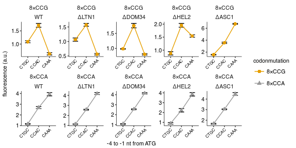

Fluorescence of PGK1 constructs with 8xCCG / 8xCCA inserts and varying Kozak in different quality control genetic backgrounds
================
rasi
02 January, 2019

-   [Import libraries and analysis specific parameters](#import-libraries-and-analysis-specific-parameters)
-   [Read data](#read-data)
-   [Read annotations](#read-annotations)
-   [Rename and calculate average values of fluorescence channels in each well](#rename-and-calculate-average-values-of-fluorescence-channels-in-each-well)
-   [Calculate mean and standard error over replicates](#calculate-mean-and-standard-error-over-replicates)
-   [Plot mean YFP / RFP ratio as a function of initiation codon](#plot-mean-yfp-rfp-ratio-as-a-function-of-initiation-codon)

Import libraries and analysis specific parameters
=================================================

``` r
# standard analysis and plotting functions, includes dplyr, ggplot2 
library(tidyverse)
# loads lab default ggplot2 theme and provides color-blind friendly palette
library(rasilabRtemplates)
# standard error
library(plotrix)

# initiation sites are arranged in this order
initiationmutation_order <- seq(1,8)
names(initiationmutation_order) <- toupper(c( 'ctgc', 'ccgc', 
                              'acgc', 'ccga', 'ccac', 'ccaa', 'caaa', 'aaaa'))

# this folder contains the data and annotations
fcs_file_folder <- "../../data/flow/lowmedhigh_pgk1_8xccg_4ko_wt/"
 

# bad wells that had zero or abnormal signals. These are excluded from analysis.
bad_wells <- list(
  list('strain' = 'schp774', 'replicate' = 1),
  list('strain' = 'schp777', 'replicate' = 2),
  list('strain' = 'schp780', 'replicate' = 2),
  list('strain' = 'schp781', 'replicate' = 2)
) %>% 
  bind_rows() 
```

Read data
=========

``` r
flowdata  <- read_tsv(paste0(fcs_file_folder, '/data.tsv')) %>% 
  print()
```

    ## # A tibble: 1,360,000 x 7
    ##    plate well    FSC.A   SSC.A FITC.A PE.Texas.Red.A  Time
    ##    <int> <chr>   <int>   <int>  <int>          <int> <dbl>
    ##  1     1 B2     130834      -2     55            -10 0.168
    ##  2     1 B2      87315     -81   -103              0 0.216
    ##  3     1 B2      73016      22     73             23 0.222
    ##  4     1 B2      48764     -49    -47             41 1.19 
    ##  5     1 B2      76180      43    117             77 4.13 
    ##  6     1 B2      64323    1223    740            409 5.91 
    ##  7     1 B2     262144  262144    104           -100 5.94 
    ##  8     1 B2    -175928 -311715   1301            -60 5.96 
    ##  9     1 B2      31074   25985   -536           -398 6.03 
    ## 10     1 B2      19801   15723   -610           -395 6.06 
    ## # ... with 1,359,990 more rows

Read annotations
================

``` r
annotations  <- read_tsv(paste0(fcs_file_folder, '/annotations.tsv')) %>% 
  print()
```

    ## # A tibble: 136 x 8
    ##    plate well  strain  replicate initiationmutation codonmutation gene   
    ##    <int> <chr> <chr>       <int> <chr>              <chr>         <chr>  
    ##  1     1 B2    by4741          1 CAAA               <NA>          <NA>   
    ##  2     1 B3    schp15          1 CAAA               <NA>          <NA>   
    ##  3     1 B4    schp19          1 CAAA               cgg           maxhis3
    ##  4     1 B5    schp20          1 CAAA               aga           maxhis3
    ##  5     1 B11   schp747         1 CAAA               cca           pgk1   
    ##  6     1 C2    schp748         1 CCAC               cca           pgk1   
    ##  7     1 C3    schp749         1 CTGC               cca           pgk1   
    ##  8     1 C4    schp750         1 CAAA               ccg           pgk1   
    ##  9     1 C5    schp751         1 CCAC               ccg           pgk1   
    ## 10     1 C6    schp752         1 CTGC               ccg           pgk1   
    ## # ... with 126 more rows, and 1 more variable: knockout <chr>

Rename and calculate average values of fluorescence channels in each well
=========================================================================

``` r
by_file <- flowdata  %>% 
  # group by each plate and well
  group_by(plate, well) %>% 
  select(FITC.A, PE.Texas.Red.A) %>% 
  # calculate mean
  summarise_all(mean) %>% 
  # rename
  rename('yfp' = FITC.A, 'rfp' = PE.Texas.Red.A) %>% 
  # join annotations
  left_join(annotations, by = c('plate', 'well')) %>% 
  print()
```

    ## # A tibble: 136 x 10
    ## # Groups:   plate [?]
    ##    plate well      yfp     rfp strain  replicate initiationmutation
    ##    <int> <chr>   <dbl>   <dbl> <chr>       <int> <chr>             
    ##  1     1 B11   14237.  24419.  schp747         1 CAAA              
    ##  2     1 B2       33.1    11.6 by4741          1 CAAA              
    ##  3     1 B3      333.  25174.  schp15          1 CAAA              
    ##  4     1 B4     3367.  22062.  schp19          1 CAAA              
    ##  5     1 B5    24583.  20618.  schp20          1 CAAA              
    ##  6     1 C10    2178.  25143.  schp762         1 CAAA              
    ##  7     1 C11    6102.  25950.  schp763         1 CCAC              
    ##  8     1 C2    10621.  26237.  schp748         1 CCAC              
    ##  9     1 C3     4449.  26890.  schp749         1 CTGC              
    ## 10     1 C4     2756.  25370.  schp750         1 CAAA              
    ## # ... with 126 more rows, and 3 more variables: codonmutation <chr>,
    ## #   gene <chr>, knockout <chr>

Calculate mean and standard error over replicates
=================================================

``` r
avg_data  <- by_file %>% 
  anti_join(bad_wells) %>% 
  # strain is used to get replicates
  group_by(strain) %>% 
  # calculate mean and std.err
  mutate(mean_yfp = mean(yfp), 
         mean_rfp = mean(rfp)) %>% 
  ungroup() %>% 
  mutate(yfp = yfp - mean_yfp[strain == "schp15" & replicate == 1], 
         rfp = rfp - mean_rfp[strain == "by4741" & replicate == 1]) %>% 
  mutate(yfp_rfp_ratio = yfp / rfp) %>% 
  # calculate mean and standard error
  group_by(strain) %>% 
  mutate(mean_yfp = mean(yfp), 
         mean_rfp = mean(rfp), 
         mean_ratio = mean(yfp_rfp_ratio), 
         se_yfp = std.error(yfp), 
         se_rfp = std.error(rfp),
         se_ratio = std.error(yfp_rfp_ratio),
         n = n()) %>% 
  slice(1) %>% 
  ungroup() %>% 
  print()
```

    ## # A tibble: 34 x 18
    ##    plate well       yfp      rfp strain  replicate initiationmutation
    ##    <int> <chr>    <dbl>    <dbl> <chr>       <int> <chr>             
    ##  1     1 B2      -278.     -31.7 by4741          1 CAAA              
    ##  2     1 B3        22.0  25130.  schp15          1 CAAA              
    ##  3     1 B4      3056.   22019.  schp19          1 CAAA              
    ##  4     1 B5     24272.   20574.  schp20          1 CAAA              
    ##  5     1 B11    13926.   24375.  schp747         1 CAAA              
    ##  6     1 C2     10309.   26194.  schp748         1 CCAC              
    ##  7     1 C3      4138.   26846.  schp749         1 CTGC              
    ##  8     1 C4      2444.   25327.  schp750         1 CAAA              
    ##  9     1 C5      6289.   25997.  schp751         1 CCAC              
    ## 10     1 C6      3846.   25420.  schp752         1 CTGC              
    ## # ... with 24 more rows, and 11 more variables: codonmutation <chr>,
    ## #   gene <chr>, knockout <chr>, mean_yfp <dbl>, mean_rfp <dbl>,
    ## #   yfp_rfp_ratio <dbl>, mean_ratio <dbl>, se_yfp <dbl>, se_rfp <dbl>,
    ## #   se_ratio <dbl>, n <int>

``` r
normalization <- avg_data %>% 
  filter(strain == "schp19")
```

Plot mean YFP / RFP ratio as a function of initiation codon
===========================================================

``` r
plot_data <- avg_data %>% 
  mutate(mean_ratio = mean_ratio / normalization[[1, "mean_ratio"]]) %>% 
  mutate(se_ratio = se_ratio / normalization[[1, "mean_ratio"]]) %>% 
  filter(gene == "pgk1") %>% 
  mutate(codonmutation = forcats::fct_rev(paste0("8×", toupper(codonmutation)))) %>% 
  # arrange initiationmutation in this order
  mutate(initiationmutation = fct_reorder(
      initiationmutation,
      initiationmutation_order[initiationmutation])) %>%
  mutate(knockout = forcats::fct_relevel(knockout, "WT", "ΔLTN1", "ΔDOM34", "ΔHEL2", "ΔASC1"))

plot_data %>% 
  ggplot(aes(x = initiationmutation, y = mean_ratio, 
             ymin = mean_ratio - se_ratio, ymax = mean_ratio + se_ratio,
             group = codonmutation, color = codonmutation, shape = codonmutation)) +
  geom_errorbar(width = 0.5, color = "black") +
  geom_point(size = 2, height = 0, width = 0.1) +
  geom_line(size = 0.5) +
  facet_wrap(codonmutation ~ knockout, ncol = 5, scales = "free") + 
  scale_color_manual(values = cbPalette[c(2,1)]) +
  labs(y = 'fluorescence (a.u.)',
       x = '-4 to -1 nt from ATG') +
  theme(legend.title = element_text(size = 8),
        axis.text.x = element_text(angle = 45, hjust = 1, size = 6)) +
  scale_y_continuous(breaks = scales::pretty_breaks(n=4))
```



``` r
ggsave('figures/lowmedhigh_ccg_4ko_wt.pdf')

plot_data %>% 
  arrange(knockout, codonmutation, initiationmutation) %>% 
  select(knockout, codonmutation, initiationmutation, mean_ratio, se_ratio, n) %>% 
  mutate_if(is.numeric, funs(round(., 3))) %>% 
  knitr::kable()
```

| knockout | codonmutation | initiationmutation |  mean\_ratio|  se\_ratio|    n|
|:---------|:--------------|:-------------------|------------:|----------:|----:|
| WT       | 8×CCG         | CTGC               |        1.085|      0.038|    4|
| WT       | 8×CCG         | CCAC               |        1.711|      0.072|    4|
| WT       | 8×CCG         | CAAA               |        0.628|      0.044|    4|
| WT       | 8×CCA         | CTGC               |        1.161|      0.029|    4|
| WT       | 8×CCA         | CCAC               |        2.681|      0.098|    4|
| WT       | 8×CCA         | CAAA               |        3.927|      0.150|    4|
| ΔLTN1    | 8×CCG         | CTGC               |        1.065|      0.056|    4|
| ΔLTN1    | 8×CCG         | CCAC               |        1.573|      0.048|    4|
| ΔLTN1    | 8×CCG         | CAAA               |        0.562|      0.027|    4|
| ΔLTN1    | 8×CCA         | CTGC               |        1.140|      0.011|    4|
| ΔLTN1    | 8×CCA         | CCAC               |        2.579|      0.039|    4|
| ΔLTN1    | 8×CCA         | CAAA               |        4.173|      0.097|    4|
| ΔDOM34   | 8×CCG         | CTGC               |        0.985|      0.010|    4|
| ΔDOM34   | 8×CCG         | CCAC               |        1.759|      0.074|    4|
| ΔDOM34   | 8×CCG         | CAAA               |        0.805|      0.022|    4|
| ΔDOM34   | 8×CCA         | CTGC               |        1.073|      0.024|    4|
| ΔDOM34   | 8×CCA         | CCAC               |        2.545|      0.040|    4|
| ΔDOM34   | 8×CCA         | CAAA               |        4.148|      0.063|    4|
| ΔHEL2    | 8×CCG         | CTGC               |        0.877|      0.064|    4|
| ΔHEL2    | 8×CCG         | CCAC               |        1.956|      0.072|    3|
| ΔHEL2    | 8×CCG         | CAAA               |        1.544|      0.046|    3|
| ΔHEL2    | 8×CCA         | CTGC               |        0.900|      0.083|    4|
| ΔHEL2    | 8×CCA         | CCAC               |        2.226|      0.173|    4|
| ΔHEL2    | 8×CCA         | CAAA               |        3.846|      0.172|    3|
| ΔASC1    | 8×CCG         | CTGC               |        1.578|      0.055|    4|
| ΔASC1    | 8×CCG         | CCAC               |        3.566|      0.108|    4|
| ΔASC1    | 8×CCG         | CAAA               |        6.740|      0.070|    3|
| ΔASC1    | 8×CCA         | CTGC               |        1.667|      0.042|    4|
| ΔASC1    | 8×CCA         | CCAC               |        3.041|      0.027|    4|
| ΔASC1    | 8×CCA         | CAAA               |        4.481|      0.128|    4|
