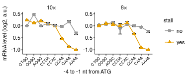

Analyze initiation codon pair mRNA levels
================
rasi
30 July, 2019

-   [Load libraries and define analysis-specific parameters](#load-libraries-and-define-analysis-specific-parameters)
-   [Read barcode and strain annotations](#read-barcode-and-strain-annotations)
-   [Read count data and join with barcode and strain annotations](#read-count-data-and-join-with-barcode-and-strain-annotations)
-   [Calculate log2 fold mRNA levels median normalized within each initiation set](#calculate-log2-fold-mrna-levels-median-normalized-within-each-initiation-set)
-   [Plot mRNA level of PGK1-YFP with different codons, wild-type cells](#plot-mrna-level-of-pgk1-yfp-with-different-codons-wild-type-cells)
-   [Source data for Fig. 2C](#source-data-for-fig.-2c)
-   [Plot mRNA level of PGK1-YFP, no insert](#plot-mrna-level-of-pgk1-yfp-no-insert)
-   [Source data for Fig. 2B](#source-data-for-fig.-2b)
-   [Plot mRNA levels of KO codon mutants for paper](#plot-mrna-levels-of-ko-codon-mutants-for-paper)
-   [Source data for Fig. 5C](#source-data-for-fig.-5c)

Load libraries and define analysis-specific parameters
======================================================

``` r
library(glue)
library(tidyverse)
library(rasilabRtemplates)

codonnames <- c(
  "AAG" = "10xAAG",
  "AGA" = "10xAGA",
  "CCG" = "8xCCG",
  "CCA" = "8xCCA",
  "AGT" = "PGK1_wt",
  "TCC" = "PGK1_5xAGA5")

initiationmutation_order <- seq(1,9)
names(initiationmutation_order) <- c('CTG', 'CTGC', 'CCGC', 
                              'ACGC', 'CCGA', 'CCAC', 'CCAA', 'CAAA', 'AAAA')
```

Read barcode and strain annotations
===================================

``` r
r2_annotations <- read_tsv("../../data/htseq/r2_barcode_annotations.tsv") %>% 
  print()
```

    ## # A tibble: 12 x 5
    ##    strain_num strain type  barcode primer
    ##    <chr>      <chr>  <chr> <chr>   <chr> 
    ##  1 scHP1124   BY4741 cdna  GCGGAC  oAS121
    ##  2 scHP1125   scHP15 cdna  TTTCAC  oAS122
    ##  3 scHP1126   LTN1Δ  cdna  GGCCAC  oAS123
    ##  4 scHP1127   DOM34Δ cdna  CGAAAC  oAS124
    ##  5 scHP1128   ASC1Δ  cdna  CGTACG  oAS125
    ##  6 scHP1129   HEL2Δ  cdna  CCACTC  oAS126
    ##  7 scHP1124   BY4741 gdna  AAGCTA  oAS129
    ##  8 scHP1125   scHP15 gdna  GTAGCC  oAS130
    ##  9 scHP1126   LTN1Δ  gdna  TACAAG  oAS131
    ## 10 scHP1127   DOM34Δ gdna  TTGACT  oAS132
    ## 11 scHP1128   ASC1Δ  gdna  GGAACT  oAS133
    ## 12 scHP1129   HEL2Δ  gdna  TGACAT  oAS134

``` r
strain_annotations <- read_tsv("../../data/htseq/strain_annotations.tsv") %>% 
  print()
```

    ## # A tibble: 54 x 6
    ##      row plasmid    init  codon  gene  label 
    ##    <int> <chr>      <chr> <chr>  <chr> <chr> 
    ##  1     1 phpsc354-1 CAAA  aagaag pgk1  10×aag
    ##  2     2 phpsc355-1 CCGC  aagaag pgk1  10×aag
    ##  3     3 phpsc356-1 CCAA  aagaag pgk1  10×aag
    ##  4     4 phpsc357-1 CCAC  aagaag pgk1  10×aag
    ##  5     5 phpsc358-1 CCGA  aagaag pgk1  10×aag
    ##  6     6 phpsc359-1 CTGC  aagaag pgk1  10×aag
    ##  7     7 phpsc360-1 AAAA  aagaag pgk1  10×aag
    ##  8     8 phpsc361-1 ACGC  aagaag pgk1  10×aag
    ##  9     9 phpsc362-1 CTG   aagaag pgk1  10×aag
    ## 10    10 phpsc363-1 CAAA  agaaga pgk1  10×aga
    ## # ... with 44 more rows

``` r
barcode_annotations <- read_tsv("../../data/htseq/barcode_annotations.tsv") %>% 
  print()
```

    ## # A tibble: 210 x 4
    ##    plate  well  primer_name      barcode 
    ##    <chr>  <chr> <chr>            <chr>   
    ##  1 plate1 A1    cyc1_rep1_bc1_R  GTTTGTTT
    ##  2 plate1 B1    cyc1_rep1_bc2_R  CCGTGTTT
    ##  3 plate1 C1    cyc1_rep1_bc3_R  TAGTGTTT
    ##  4 plate1 D1    cyc1_rep1_bc4_R  GGCGGTTT
    ##  5 plate1 E1    cyc1_rep1_bc5_R  GATCGTTT
    ##  6 plate1 F1    cyc1_rep1_bc6_R  TCACGTTT
    ##  7 plate1 G1    cyc1_rep1_bc7_R  TGTAGTTT
    ##  8 plate1 H1    cyc1_rep1_bc8_R  CACAGTTT
    ##  9 plate1 A2    cyc1_rep1_bc9_R  CTTTCTTT
    ## 10 plate1 B2    cyc1_rep1_bc10_R GCCTCTTT
    ## # ... with 200 more rows

``` r
strain_barcode_annotations <- read_tsv("../../data/htseq/strain_barcode_annotations.tsv") %>% 
  # get rid of plasmid well and Description, we don't need it
  select(-Description, -well) %>% 
  # combine plate and well location into 1
  mutate(oligo1 = paste0(plate1, "_", well1), 
         oligo2 = paste0(plate2, "_", well2),
         oligo3 = paste0(plate3, "_", well3), 
         oligo4 = paste0(plate4, "_", well4)) %>% 
  # get ride of plate and well columns
  select(-matches("^plate|^well")) %>% 
  # gather all oligos into single well
  gather(oligo, location, -plasmid) %>% 
  # separate again into plate and well
  separate(location, c("plate", "well")) %>% 
  select(-oligo) %>% 
  # clean up A01 to A1, B02 to B2 etc.
  mutate(well = str_replace(well, "([A-Z])0(\\d)", "\\1\\2")) %>% 
  # remove empty wells  
  filter(well != "NA") %>% 
  print()
```

    ## # A tibble: 210 x 3
    ##    plasmid    plate  well 
    ##    <chr>      <chr>  <chr>
    ##  1 phpsc354-1 plate1 A1   
    ##  2 phpsc355-1 plate1 B1   
    ##  3 phpsc356-1 plate1 C1   
    ##  4 phpsc357-1 plate1 D1   
    ##  5 phpsc358-1 plate1 E1   
    ##  6 phpsc359-1 plate1 F1   
    ##  7 phpsc360-1 plate1 G1   
    ##  8 phpsc361-1 plate1 H1   
    ##  9 phpsc363-1 plate1 A2   
    ## 10 phpsc364-1 plate1 B2   
    ## # ... with 200 more rows

Read count data and join with barcode and strain annotations
============================================================

``` r
count_data <- list.files("tables/", pattern = "barcode_counts.tsv",
                         full.names = T) %>% 
  enframe("sno", "file") %>% 
  # extract R2 barcode
  mutate(barcode = str_extract(file, "(?<=/)[ACTG]{6}")) %>% 
  # read data
  mutate(data = map(file, read_tsv)) %>% 
  # expand to a single dataframe
  unnest() %>% 
  # join by R2 barcode
  left_join(r2_annotations, by = "barcode") %>% 
  # keep only columns of interest
  select(-sno, -file, -index, -barcode, -strain_num, -primer) %>%
  rename(barcode = r1_barcode) %>% 
  left_join(barcode_annotations, by = "barcode") %>% 
  # keep only columns of interest
  select(-primer_name) %>% 
  left_join(strain_barcode_annotations, by = c("plate", "well")) %>% 
  # keep only columns of interest
  select(-plate, -well) %>% 
  left_join(strain_annotations, by = "plasmid") %>% 
  # keep only columns of interest
  select(-row) %>% 
  arrange(count) %>%
  print()
```

    ## # A tibble: 2,518 x 9
    ##    count barcode  strain type  plasmid    init  codon  gene  label 
    ##    <int> <chr>    <chr>  <chr> <chr>      <chr> <chr>  <chr> <chr> 
    ##  1     1 TTATAGCC scHP15 gdna  phpsc361-1 ACGC  aagaag pgk1  10×aag
    ##  2     1 AGGCAACG scHP15 gdna  phpsc316-2 CCAA  ccacca pgk1  8×cca 
    ##  3     1 AGGCAACG DOM34Δ gdna  phpsc316-2 CCAA  ccacca pgk1  8×cca 
    ##  4     2 TTATAGCC BY4741 cdna  phpsc361-1 ACGC  aagaag pgk1  10×aag
    ##  5     2 AGGCAACG BY4741 cdna  phpsc316-2 CCAA  ccacca pgk1  8×cca 
    ##  6     2 TTATAGCC LTN1Δ  cdna  phpsc361-1 ACGC  aagaag pgk1  10×aag
    ##  7     2 TTATAGCC LTN1Δ  gdna  phpsc361-1 ACGC  aagaag pgk1  10×aag
    ##  8     3 AGGCAACG BY4741 gdna  phpsc316-2 CCAA  ccacca pgk1  8×cca 
    ##  9     3 TTATAGCC ASC1Δ  cdna  phpsc361-1 ACGC  aagaag pgk1  10×aag
    ## 10     3 AGGCAACG ASC1Δ  gdna  phpsc316-2 CCAA  ccacca pgk1  8×cca 
    ## # ... with 2,508 more rows

Calculate log2 fold mRNA levels median normalized within each initiation set
============================================================================

``` r
lfc_data <- count_data %>% 
  # get rid of low counts
  filter(count >= 100) %>% 
  # spread cdna and gdna counts for each barcode to adjacent columns
  spread(type, count) %>%
  # calculate log2 fold change cdna / gdna
  mutate(lfc = log2(cdna)-log2(gdna)) %>%
  # get rid of NA
  filter(!is.na(lfc)) %>%
  # median normalize each group
  group_by(label, strain, init) %>%
  summarize(mean_lfc = mean(lfc), se_lfc = var(lfc) / sqrt(n() - 1), n = n()) %>%
  ungroup() %>%
  group_by(label, strain) %>%
  mutate(mean_lfc = mean_lfc - median(mean_lfc)) %>%
  ungroup() %>%
  # arrange init_mutation in correct_order
  mutate(init = fct_reorder(init, initiationmutation_order[init])) %>%
  print()
```

    ## # A tibble: 324 x 6
    ##    label  strain init  mean_lfc  se_lfc     n
    ##    <chr>  <chr>  <fct>    <dbl>   <dbl> <int>
    ##  1 10×aag ASC1Δ  AAAA   -0.198  0.0777      4
    ##  2 10×aag ASC1Δ  ACGC    0.0668 0.00600     3
    ##  3 10×aag ASC1Δ  CAAA    0      0.0123      4
    ##  4 10×aag ASC1Δ  CCAA   -0.410  0.0146      4
    ##  5 10×aag ASC1Δ  CCAC    0.357  0.0839      3
    ##  6 10×aag ASC1Δ  CCGA    0.312  0.0213      4
    ##  7 10×aag ASC1Δ  CCGC   -0.0598 0.0398      4
    ##  8 10×aag ASC1Δ  CTG    -1.71   0.0168      3
    ##  9 10×aag ASC1Δ  CTGC    0.241  0.00870     4
    ## 10 10×aag BY4741 AAAA   -0.579  0.00278     4
    ## # ... with 314 more rows

Plot mRNA level of PGK1-YFP with different codons, wild-type cells
==================================================================

``` r
plot_data <- lfc_data %>% 
  filter(strain == "scHP15" & !str_detect(label, "pgk1")) %>% 
  mutate(codon_group = substr(label, 1, nchar(label)-3)) %>% 
  mutate(stall = if_else(str_detect(label, "aag|ccg"), "yes", "no")) 

plot_data %>% 
  # exclude the mutated start codon since this will be shown in previous panel
  filter(init != "CTG") %>% 
  ggplot(aes(x = init, y = mean_lfc, group = label, shape = stall, color = stall)) +
  facet_wrap(~ codon_group, ncol = 2, scales = "free_y") +
  geom_errorbar(aes(ymin = mean_lfc - se_lfc, ymax = mean_lfc + se_lfc),
                width = 0.5, color = "black") +
  geom_line() +
  geom_point(size = 2) +
  scale_color_manual(values = cbPalette) +
  # scale_shape_manual(values = c(21, 24, 22, 25)) +
  theme(axis.text.x = element_text(angle = 45, hjust = 1, size = 6)) +
  scale_y_continuous(limits = c(-1.1, +0.5)) +
  labs(x = "-4 to -1 nt from ATG", y = "mRNA level (log2, a.u.)")
```


``` r
ggsave("figures/mrna_level_wt_4_codons.pdf")
```

Source data for Fig. 2C
=======================

``` r
plot_data %>% 
  # exclude the mutated start codon since this will be shown in previous panel
  filter(init != "CTG") %>% 
  select(label, init, mean_lfc, se_lfc, n) %>% 
  arrange(label, init) %>% 
  mutate_if(is.numeric, funs(round(., 3))) %>% 
  knitr::kable()
```

| label  | init |  mean\_lfc|  se\_lfc|    n|
|:-------|:-----|----------:|--------:|----:|
| 10×aag | CTGC |      0.237|    0.006|    4|
| 10×aag | CCGC |      0.124|    0.010|    4|
| 10×aag | ACGC |      0.207|    0.001|    2|
| 10×aag | CCGA |      0.089|    0.056|    4|
| 10×aag | CCAC |      0.000|    0.019|    4|
| 10×aag | CCAA |     -0.522|    0.002|    4|
| 10×aag | CAAA |     -0.873|    0.007|    4|
| 10×aag | AAAA |     -1.003|    0.010|    4|
| 10×aga | CTGC |      0.000|    0.002|    4|
| 10×aga | CCGC |      0.470|    0.028|    4|
| 10×aga | ACGC |     -0.002|    0.027|    4|
| 10×aga | CCGA |      0.097|    0.044|    4|
| 10×aga | CCAC |      0.007|    0.045|    4|
| 10×aga | CCAA |     -0.027|    0.027|    4|
| 10×aga | CAAA |      0.174|    0.051|    4|
| 10×aga | AAAA |     -0.313|    0.054|    4|
| 8×cca  | CTGC |      0.033|    0.029|    4|
| 8×cca  | CCGC |      0.072|    0.042|    4|
| 8×cca  | ACGC |      0.149|    0.026|    4|
| 8×cca  | CCGA |     -0.118|    0.224|    4|
| 8×cca  | CCAC |      0.058|    0.012|    4|
| 8×cca  | CCAA |      0.000|    0.036|    3|
| 8×cca  | CAAA |     -0.052|    0.036|    3|
| 8×cca  | AAAA |     -0.229|    0.049|    4|
| 8×ccg  | CTGC |      0.000|    0.037|    4|
| 8×ccg  | CCGC |      0.100|    0.008|    4|
| 8×ccg  | ACGC |      0.062|    0.033|    4|
| 8×ccg  | CCGA |      0.008|    0.066|    4|
| 8×ccg  | CCAC |      0.127|    0.041|    4|
| 8×ccg  | CCAA |     -0.343|    0.017|    4|
| 8×ccg  | CAAA |     -0.909|    0.004|    4|
| 8×ccg  | AAAA |     -0.994|    0.017|    4|

Plot mRNA level of PGK1-YFP, no insert
======================================

``` r
plot_data <- lfc_data %>% 
  filter(strain == "scHP15" & str_detect(label, "pgk1, no insert"))

plot_data %>% 
  ggplot(aes(x = init, y = mean_lfc, group = label)) +
  geom_errorbar(aes(ymin = mean_lfc - se_lfc, ymax = mean_lfc + se_lfc),
                width = 0.5, color = "black") +
  geom_line() +
  geom_point(size = 2) +
  scale_color_manual(values = cbPalette) +
  theme(axis.text.x = element_text(angle = 45, hjust = 1, size = 6)) +
  # scale_y_continuous(limits = c(-1.1, +0.5)) +
  labs(x = "-4 to -1 nt from ATG", y = "mRNA level (log2, a.u.)")
```



``` r
ggsave("figures/mrna_level_wt_pgk1_no_insert.pdf")
```

Source data for Fig. 2B
=======================

``` r
plot_data %>% 
  select(init, mean_lfc, se_lfc, n) %>% 
  arrange(init) %>% 
  mutate_if(is.numeric, funs(round(., 3))) %>% 
  knitr::kable()
```

| init |  mean\_lfc|  se\_lfc|    n|
|:-----|----------:|--------:|----:|
| CTG  |     -1.997|    0.035|    3|
| CTGC |      0.077|    0.610|    4|
| CCGC |     -0.223|    0.005|    4|
| ACGC |     -0.025|    0.013|    4|
| CCGA |      0.047|    0.009|    4|
| CCAC |     -0.217|    0.001|    4|
| CCAA |      0.100|    0.032|    4|
| CAAA |      0.000|    0.030|    4|
| AAAA |      0.036|    0.047|    4|

Plot mRNA levels of KO codon mutants for paper
==============================================

``` r
plot_data <- lfc_data %>% 
  filter(str_detect(strain, "Δ") & !str_detect(label, "pgk1")) %>% 
  mutate(codon_group = substr(label, 1, 1)) %>% 
  filter(codon_group == "8") %>% 
  mutate(stall = if_else(str_detect(label, "aag|ccg"), "yes", "no")) %>% 
  mutate(strain = str_replace(strain, "(.+)(.)", "\\2\\1")) %>% 
  mutate(strain = fct_relevel(strain, "ΔLTN1", "ΔDOM34", "ΔHEL2", "ΔASC1"))

plot_data %>% 
  # exclude the mutated start codon since this will be shown in previous panel
  filter(init != "CTG") %>% 
  ggplot(aes(x = init, y = mean_lfc, group = label, shape = stall, color = stall)) +
  facet_wrap(~ strain, ncol = 4, scales = "fixed") +
  geom_errorbar(aes(ymin = mean_lfc - se_lfc, ymax = mean_lfc + se_lfc),
                width = 0.5, color = "black") +
  geom_line() +
  geom_point(size = 2) +
  scale_color_manual(values = cbPalette) +
  # scale_shape_manual(values = c(21, 24, 22, 25)) +
  theme(axis.text.x = element_text(angle = 45, hjust = 1, size = 6)) +
  scale_y_continuous(limits = c(-1.1, +0.5)) +
  labs(x = "-4 to -1 nt from ATG", y = "mRNA level (log2, a.u.)")
```


``` r
ggsave("figures/mrna_level_ko_2_codons.pdf")
```

Source data for Fig. 5C
=======================

``` r
plot_data %>% 
  select(strain, label, init, mean_lfc, se_lfc, n) %>% 
  arrange(strain, label, init) %>% 
  mutate_if(is.numeric, funs(round(., 3))) %>% 
  knitr::kable()
```

| strain | label | init |  mean\_lfc|  se\_lfc|    n|
|:-------|:------|:-----|----------:|--------:|----:|
| ΔLTN1  | 8×cca | CTG  |     -1.334|    0.324|    3|
| ΔLTN1  | 8×cca | CTGC |     -0.025|    0.013|    4|
| ΔLTN1  | 8×cca | CCGC |     -0.456|    0.403|    4|
| ΔLTN1  | 8×cca | ACGC |      0.177|    0.006|    4|
| ΔLTN1  | 8×cca | CCGA |      0.149|    0.093|    4|
| ΔLTN1  | 8×cca | CCAC |      0.134|    0.047|    4|
| ΔLTN1  | 8×cca | CCAA |      0.000|    0.080|    3|
| ΔLTN1  | 8×cca | CAAA |      0.043|    0.044|    4|
| ΔLTN1  | 8×cca | AAAA |     -0.062|    0.017|    2|
| ΔLTN1  | 8×ccg | CTG  |     -1.417|    0.014|    3|
| ΔLTN1  | 8×ccg | CTGC |      0.031|    0.020|    4|
| ΔLTN1  | 8×ccg | CCGC |      0.121|    0.025|    4|
| ΔLTN1  | 8×ccg | ACGC |      0.114|    0.031|    4|
| ΔLTN1  | 8×ccg | CCGA |      0.000|    0.060|    4|
| ΔLTN1  | 8×ccg | CCAC |      0.024|    0.061|    4|
| ΔLTN1  | 8×ccg | CCAA |     -0.276|    0.013|    4|
| ΔLTN1  | 8×ccg | CAAA |     -0.751|    0.088|    4|
| ΔLTN1  | 8×ccg | AAAA |     -1.052|    0.010|    4|
| ΔDOM34 | 8×cca | CTG  |     -2.034|    0.014|    3|
| ΔDOM34 | 8×cca | CTGC |      0.000|    0.020|    4|
| ΔDOM34 | 8×cca | CCGC |      0.017|    0.051|    4|
| ΔDOM34 | 8×cca | ACGC |      0.275|    0.005|    4|
| ΔDOM34 | 8×cca | CCGA |      0.070|    0.148|    4|
| ΔDOM34 | 8×cca | CCAC |      0.021|    0.070|    4|
| ΔDOM34 | 8×cca | CCAA |     -0.013|    0.001|    3|
| ΔDOM34 | 8×cca | CAAA |     -0.018|    0.049|    4|
| ΔDOM34 | 8×cca | AAAA |     -0.025|    0.001|    4|
| ΔDOM34 | 8×ccg | CTG  |     -1.899|    0.010|    3|
| ΔDOM34 | 8×ccg | CTGC |      0.000|    0.036|    4|
| ΔDOM34 | 8×ccg | CCGC |      0.231|    0.020|    4|
| ΔDOM34 | 8×ccg | ACGC |      0.180|    0.032|    4|
| ΔDOM34 | 8×ccg | CCGA |      0.007|    0.061|    4|
| ΔDOM34 | 8×ccg | CCAC |      0.206|    0.058|    4|
| ΔDOM34 | 8×ccg | CCAA |     -0.176|    0.011|    4|
| ΔDOM34 | 8×ccg | CAAA |     -0.707|    0.000|    4|
| ΔDOM34 | 8×ccg | AAAA |     -0.911|    0.010|    4|
| ΔHEL2  | 8×cca | CTG  |     -1.759|    0.002|    3|
| ΔHEL2  | 8×cca | CTGC |     -0.007|    0.007|    4|
| ΔHEL2  | 8×cca | CCGC |     -0.111|    0.039|    4|
| ΔHEL2  | 8×cca | ACGC |      0.172|    0.013|    4|
| ΔHEL2  | 8×cca | CCGA |      0.217|    0.034|    4|
| ΔHEL2  | 8×cca | CCAC |     -0.145|    0.070|    3|
| ΔHEL2  | 8×cca | CCAA |      0.146|    0.045|    3|
| ΔHEL2  | 8×cca | CAAA |      0.042|    0.066|    3|
| ΔHEL2  | 8×cca | AAAA |      0.000|    0.080|    4|
| ΔHEL2  | 8×ccg | CTG  |     -1.277|    0.022|    3|
| ΔHEL2  | 8×ccg | CTGC |      0.000|    0.066|    4|
| ΔHEL2  | 8×ccg | CCGC |      0.192|    0.021|    4|
| ΔHEL2  | 8×ccg | ACGC |      0.219|    0.017|    4|
| ΔHEL2  | 8×ccg | CCGA |      0.133|    0.081|    4|
| ΔHEL2  | 8×ccg | CCAC |      0.206|    0.078|    4|
| ΔHEL2  | 8×ccg | CCAA |     -0.008|    0.047|    4|
| ΔHEL2  | 8×ccg | CAAA |     -0.026|    0.123|    4|
| ΔHEL2  | 8×ccg | AAAA |     -0.340|    0.010|    4|
| ΔASC1  | 8×cca | CTG  |     -1.681|    0.168|    3|
| ΔASC1  | 8×cca | CTGC |     -0.059|    0.054|    4|
| ΔASC1  | 8×cca | CCGC |     -0.306|    0.051|    4|
| ΔASC1  | 8×cca | ACGC |      0.022|    0.030|    4|
| ΔASC1  | 8×cca | CCGA |      0.099|    0.093|    4|
| ΔASC1  | 8×cca | CCAC |     -0.211|    0.075|    4|
| ΔASC1  | 8×cca | CCAA |      0.000|    0.006|    3|
| ΔASC1  | 8×cca | CAAA |      0.417|    0.418|    4|
| ΔASC1  | 8×cca | AAAA |      0.063|    0.027|    4|
| ΔASC1  | 8×ccg | CTG  |     -1.721|    0.002|    3|
| ΔASC1  | 8×ccg | CTGC |     -0.277|    0.030|    4|
| ΔASC1  | 8×ccg | CCGC |      0.000|    0.023|    4|
| ΔASC1  | 8×ccg | ACGC |      0.048|    0.044|    4|
| ΔASC1  | 8×ccg | CCGA |     -0.005|    0.069|    4|
| ΔASC1  | 8×ccg | CCAC |      0.267|    0.061|    4|
| ΔASC1  | 8×ccg | CCAA |      0.144|    0.033|    4|
| ΔASC1  | 8×ccg | CAAA |      0.085|    0.065|    4|
| ΔASC1  | 8×ccg | AAAA |     -0.140|    0.036|    4|
