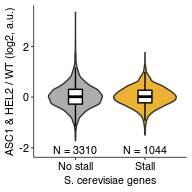

Analyze changes in gene ribosome density between WT and HEL2/ASC1 mutants
================
rasi
17 July, 2019

-   [Import libraries](#import-libraries)
-   [Load SGD annotations](#load-sgd-annotations)
-   [Get transcript annotations](#get-transcript-annotations)
-   [Load RQC stalls](#load-rqc-stalls)
-   [Read count data](#read-count-data)
-   [Check that the genotypes are correct](#check-that-the-genotypes-are-correct)
-   [Sum only read counts for gene that have &gt; `count_threshold` reads in all samples](#sum-only-read-counts-for-gene-that-have-count_threshold-reads-in-all-samples)
-   [Prepare column data for DESeq 2 input](#prepare-column-data-for-deseq-2-input)
-   [Run DESeq2](#run-deseq2)
-   [Calculate log2 fold-changes between WT and mutant strains](#calculate-log2-fold-changes-between-wt-and-mutant-strains)
-   [Look at genes that are up-regulated in asc1 and hel2 KO](#look-at-genes-that-are-up-regulated-in-asc1-and-hel2-ko)
-   [Join fold-change with RQC stall presence](#join-fold-change-with-rqc-stall-presence)
-   [Plot log2 fold-change ASC1 / HEL2 vs WT as a function of stall strength](#plot-log2-fold-change-asc1-hel2-vs-wt-as-a-function-of-stall-strength)
-   [Test if stall-containing genes have lower or higher Log2 fold change between ASC1+HEL2 KO vs WT](#test-if-stall-containing-genes-have-lower-or-higher-log2-fold-change-between-asc1hel2-ko-vs-wt)

Import libraries
================

``` r
library(data.table)
library(TxDb.Scerevisiae.UCSC.sacCer3.sgdGene)
library(org.Sc.sgd.db)
library(biobroom)
library(DESeq2)
library(tidyverse)
library(rasilabRtemplates)

# genes having below these counts in any sample are discarded
count_threshold <- 100
```

Load SGD annotations
====================

``` r
gene_annotations <- "/fh/fast/subramaniam_a/db/rasi/genomes/yeast/Saccharomyces_cerevisiae/sgd/S288C_reference_genome_R64-1-1_20110203/saccharomyces_cerevisiae_R64-1-1_20110208.gff" %>% 
  rtracklayer::readGFF() %>% 
  as_tibble() %>% 
  filter(type == "gene" & orf_classification == "Verified") %>% 
  select(gene, ID, Note) %>%
  print()
```

    ## # A tibble: 4,896 x 3
    ##    gene  ID      Note     
    ##    <chr> <chr>   <I(list)>
    ##  1 PAU8  YAL068C <chr [1]>
    ##  2 SEO1  YAL067C <chr [1]>
    ##  3 <NA>  YAL064W <chr [1]>
    ##  4 FLO9  YAL063C <chr [1]>
    ##  5 GDH3  YAL062W <chr [1]>
    ##  6 BDH1  YAL060W <chr [1]>
    ##  7 ECM1  YAL059W <chr [1]>
    ##  8 CNE1  YAL058W <chr [1]>
    ##  9 GPB2  YAL056W <chr [1]>
    ## 10 PEX22 YAL055W <chr [1]>
    ## # ... with 4,886 more rows

Get transcript annotations
==========================

``` r
tx <- transcripts(TxDb.Scerevisiae.UCSC.sacCer3.sgdGene)

tx_annotations <- org.Sc.sgd.db %>% 
  AnnotationDbi::select(keys = keys(., keytype = "ENSEMBLTRANS"), 
         keytype = "ENSEMBLTRANS", 
         columns = c("ENSEMBLTRANS", "GENENAME", "DESCRIPTION")) %>% 
  as_tibble() %>% 
  magrittr::set_colnames(tolower(colnames(.))) %>% 
  right_join(tidy(tx) %>% dplyr::select(tx_id, tx_name, strand), 
             by = c("ensembltrans" = "tx_name")) %>% 
  group_by(tx_id) %>% 
  slice(1) %>% 
  ungroup() %>% 
  print()
```

    ## # A tibble: 6,692 x 5
    ##    ensembltrans genename description                          tx_id strand
    ##    <chr>        <chr>    <chr>                                <int> <chr> 
    ##  1 YAL069W      <NA>     <NA>                                     1 +     
    ##  2 YAL068W-A    <NA>     <NA>                                     2 +     
    ##  3 YAL067W-A    <NA>     Putative protein of unknown functio…     3 +     
    ##  4 YAL066W      <NA>     <NA>                                     4 +     
    ##  5 YAL064W-B    <NA>     Fungal-specific protein of unknown …     5 +     
    ##  6 YAL064W      <NA>     Protein of unknown function; may in…     6 +     
    ##  7 YAL062W      GDH3     NADP(+)-dependent glutamate dehydro…     7 +     
    ##  8 YAL061W      BDH2     Putative medium-chain alcohol dehyd…     8 +     
    ##  9 YAL060W      BDH1     NAD-dependent (R,R)-butanediol dehy…     9 +     
    ## 10 YAL059W      ECM1     Pre-ribosomal factor involved in 60…    10 +     
    ## # ... with 6,682 more rows

Load RQC stalls
===============

``` r
rqc_stalls <- read_tsv("../../rqc_stalls_in_yeast_orfs/tables/ngrams_annotated.tsv") %>% 
  select(id, pos, ngram_weight, ngram) %>%
  print()
```

    ## # A tibble: 1,251 x 4
    ##    id        pos ngram_weight ngram     
    ##    <chr>   <int>        <int> <chr>     
    ##  1 YHR131C   321           10 RRRRRRRRRR
    ##  2 YIL159W   768           10 PPPPPPPPPP
    ##  3 YNL271C  1238           10 PPPPPPPPPP
    ##  4 YOR019W   712           10 KKKKKKKKKK
    ##  5 YBL091C    40            9 KKKKNKKKKK
    ##  6 YDL146W   473            9 APPPPPPPPP
    ##  7 YDL173W   273            9 KEKKKKKKKK
    ##  8 YDR174W   227            9 KKKKKKKKDK
    ##  9 YDR334W   231            9 KKKRGRKKKK
    ## 10 YHL019C   174            9 KRKDKKKKRK
    ## # ... with 1,241 more rows

Read count data
===============

``` r
counts <- list.files("../processeddata/", pattern = "tx_read_counts.tsv", 
                    recursive = T, full.names = T) %>% 
  enframe("sno", "file") %>% 
  mutate(sample = str_extract(file, "[^/]+(?=/+tx_read_counts.tsv)")) %>% 
  separate(sample, c("genotype", "reporter", "sampletype"), remove = F) %>% 
  mutate(data = map(file, read_tsv)) %>%
  select(-sno, -file) %>% 
  unnest() %>% 
  print()
```

    ## # A tibble: 25,964 x 7
    ##    sample             genotype reporter sampletype txHit strand alncount
    ##    <chr>              <chr>    <chr>    <chr>      <int> <chr>     <int>
    ##  1 asc1_nonstall_mrna asc1     nonstall mrna          NA -       2043844
    ##  2 asc1_nonstall_mrna asc1     nonstall mrna          NA +       1084530
    ##  3 asc1_nonstall_mrna asc1     nonstall mrna        4146 +         79313
    ##  4 asc1_nonstall_mrna asc1     nonstall mrna        6337 +         71829
    ##  5 asc1_nonstall_mrna asc1     nonstall mrna        5576 +         71317
    ##  6 asc1_nonstall_mrna asc1     nonstall mrna         235 +         70537
    ##  7 asc1_nonstall_mrna asc1     nonstall mrna        4643 +         70498
    ##  8 asc1_nonstall_mrna asc1     nonstall mrna        3383 +         69837
    ##  9 asc1_nonstall_mrna asc1     nonstall mrna        4640 +         69526
    ## 10 asc1_nonstall_mrna asc1     nonstall mrna        3385 +         68613
    ## # ... with 25,954 more rows

Check that the genotypes are correct
====================================

We see that the genes that are deleted have very low counts as expected.

``` r
genotype_genes <- c(
  "HEL2" = "YDR266C",
  "ASC1" = "YMR116C",
  "SLH1" = "YGR271W")

counts %>% 
  left_join(tx_annotations, by = c("txHit" = "tx_id")) %>%
  filter(ensembltrans %in% genotype_genes) %>%
  arrange(desc(genename)) %>% 
  select(genename, sample, genotype, alncount) %>%
  knitr::kable()
```

| genename | sample               | genotype |  alncount|
|:---------|:---------------------|:---------|---------:|
| SLH1     | asc1\_nonstall\_mrna | asc1     |      1353|
| SLH1     | hel2\_nonstall\_mrna | hel2     |      1214|
| SLH1     | slh1\_nonstall\_mrna | slh1     |         7|
| SLH1     | wt\_nonstall\_mrna   | wt       |      1268|
| HEL2     | asc1\_nonstall\_mrna | asc1     |      1096|
| HEL2     | hel2\_nonstall\_mrna | hel2     |         9|
| HEL2     | slh1\_nonstall\_mrna | slh1     |      1110|
| HEL2     | wt\_nonstall\_mrna   | wt       |       799|
| ASC1     | asc1\_nonstall\_mrna | asc1     |        32|
| ASC1     | hel2\_nonstall\_mrna | hel2     |      4174|
| ASC1     | slh1\_nonstall\_mrna | slh1     |      4951|
| ASC1     | wt\_nonstall\_mrna   | wt       |      3728|

Sum only read counts for gene that have &gt; `count_threshold` reads in all samples
===================================================================================

``` r
count_data <- counts %>% 
  group_by(txHit, sample) %>%
  summarize(count = sum(alncount)) %>%
  ungroup() %>%
  filter(!is.na(txHit)) %>%
  filter(count > count_threshold) %>% 
  filter(str_detect(sample, "nonstall")) %>%
  filter(str_detect(sample, "mrna")) %>%
  select(sample, txHit, count) %>%
  spread(sample, count) %>%
  filter_all(all_vars(!is.na(.))) %>%
  inner_join(tx_annotations %>% select(tx_id, ensembltrans), by = c("txHit" = "tx_id")) %>%
  inner_join(gene_annotations %>% select(ID), by = c("ensembltrans" = "ID")) %>%
  select(-ensembltrans) %>% 
  as.data.frame() %>%
  column_to_rownames(var = "txHit")

as_tibble(count_data)
```

    ## # A tibble: 4,354 x 4
    ##    asc1_nonstall_mrna hel2_nonstall_mr… slh1_nonstall_mr… wt_nonstall_mrna
    ##  *              <int>             <int>             <int>            <int>
    ##  1                723               546               455              649
    ##  2                704              1282              2028              922
    ##  3                630               453               594              431
    ##  4               1205              1024              1292             1304
    ##  5                247               131               156              228
    ##  6               1290              2040              2134             1067
    ##  7                908               849               885              768
    ##  8               4027              2958              3796             3418
    ##  9               1406              1197              1414             1160
    ## 10              48431             37266             41673            29905
    ## # ... with 4,344 more rows

Prepare column data for DESeq 2 input
=====================================

``` r
col_data <- colnames(count_data) %>% 
  enframe("sno", "sample") %>% 
  separate(sample, c("genotype", "reporter", "sampletype"), remove = F) %>% 
  mutate(genotype = if_else(genotype %in% c("asc1", "hel2"), "asc1hel2", genotype)) %>%
  select(-sno) %>% 
  as.data.frame() %>% 
  column_to_rownames(var = "sample") %>% 
  # set WT to be the reference level for log2 fold-changes in DESeq2
  mutate(genotype = relevel(factor(genotype), ref = "wt"))

col_data
```

    ##   genotype reporter sampletype
    ## 1 asc1hel2 nonstall       mrna
    ## 2 asc1hel2 nonstall       mrna
    ## 3     slh1 nonstall       mrna
    ## 4       wt nonstall       mrna

Run DESeq2
==========

``` r
dds <- DESeqDataSetFromMatrix(count_data, col_data, ~ genotype)
dds <- DESeq(dds)
```

Calculate log2 fold-changes between WT and mutant strains
=========================================================

``` r
# skip the Intercept column
lfc <- resultsNames(dds)[2:3] %>% 
  enframe() %>% 
  mutate(deseq_results = map(value, function(x) DESeq2::results(dds, contrast = list(x)))) %>%
  mutate(lfc = map(deseq_results, function(res)
    res[c('log2FoldChange', 'baseMean')] %>% as.data.frame() %>% rownames_to_column("tx_id"))) %>%
  mutate(samplepair = str_extract(value, "(?<=genotype_).+")) %>%
  select(-deseq_results, -name, -value) %>%
  unnest() %>%
  rename(lfc = log2FoldChange) %>%
  spread(samplepair, lfc) %>%
  mutate(tx_id = as.integer(tx_id)) %>% 
  left_join(tx_annotations, by = c("tx_id")) %>%
  rename(id = ensembltrans) %>% 
  print()  
```

    ## # A tibble: 4,354 x 8
    ##    tx_id baseMean asc1hel2_vs_wt slh1_vs_wt id    genename description
    ##    <int>    <dbl>          <dbl>      <dbl> <chr> <chr>    <chr>      
    ##  1    10    1245.         0.127      0.958  YAL0… ECM1     Pre-riboso…
    ##  2   100     469.         0.446      0.0724 YAL0… SYN8     Endosomal …
    ##  3  1000     493.        -0.445     -0.638  YDR2… COQ4     Protein wi…
    ##  4  1001     503.         0.428      0.449  YDR2… MSC2     Endoplasmi…
    ##  5  1002    1556.         0.437      0.636  YDR2… EBS1     Protein in…
    ##  6  1003    1592.         0.255      0.419  YDR2… MSS4     Phosphatid…
    ##  7  1007    3415.        -0.0275     0.206  YDR2… GCD6     Catalytic …
    ##  8  1008    2877.        -0.252     -0.237  YDR2… TCP1     Alpha subu…
    ##  9  1009     794.        -0.0714     0.185  YDR2… UPC2     Sterol reg…
    ## 10   101     334.         0.354      0.558  YAL0… MDM10    Subunit of…
    ## # ... with 4,344 more rows, and 1 more variable: strand <chr>

Look at genes that are up-regulated in asc1 and hel2 KO
=======================================================

``` r
lfc %>% 
  arrange(desc(asc1hel2_vs_wt)) %>%
  select(asc1hel2_vs_wt, genename, everything(), -tx_id, description, -strand) %>%
  print()
```

    ## # A tibble: 4,354 x 6
    ##    asc1hel2_vs_wt genename baseMean slh1_vs_wt id     description         
    ##             <dbl> <chr>       <dbl>      <dbl> <chr>  <chr>               
    ##  1           3.36 PRM7        1745.      3.62  YDL03… Pheromone-regulated…
    ##  2           2.96 FLR1        1187.      2.17  YBR00… Plasma membrane tra…
    ##  3           2.68 AGA1         709.      2.37  YNR04… Anchorage subunit o…
    ##  4           2.51 GRE2        1919.      2.03  YOL15… 3-methylbutanal red…
    ##  5           2.31 CHA1        1251.      2.58  YCL06… Catabolic L-serine …
    ##  6           2.19 HMS2         650.      1.75  YJR14… Protein with simila…
    ##  7           2.18 HSP12       1218.      0.155 YFL01… Plasma membrane pro…
    ##  8           2.14 SPI1         496.      0.596 YER15… GPI-anchored cell w…
    ##  9           2.03 <NA>         681.      1.68  YOR30… CPA1 uORF; Arginine…
    ## 10           1.91 BUD31        356.      1.52  YCR06… Component of the SF…
    ## # ... with 4,344 more rows

Join fold-change with RQC stall presence
========================================

``` r
lfc_stall_data <- lfc %>% 
  left_join(rqc_stalls, by = "id") %>% 
  arrange(desc(asc1hel2_vs_wt)) %>% 
  print()
```

    ## # A tibble: 4,354 x 11
    ##    tx_id baseMean asc1hel2_vs_wt slh1_vs_wt id    genename description
    ##    <int>    <dbl>          <dbl>      <dbl> <chr> <chr>    <chr>      
    ##  1  1295    1745.           3.36      3.62  YDL0… PRM7     Pheromone-…
    ##  2   406    1187.           2.96      2.17  YBR0… FLR1     Plasma mem…
    ##  3  5321     709.           2.68      2.37  YNR0… AGA1     Anchorage …
    ##  4  5550    1919.           2.51      2.03  YOL1… GRE2     3-methylbu…
    ##  5   667    1251.           2.31      2.58  YCL0… CHA1     Catabolic …
    ##  6  3452     650.           2.19      1.75  YJR1… HMS2     Protein wi…
    ##  7  1975    1218.           2.18      0.155 YFL0… HSP12    Plasma mem…
    ##  8  1758     496.           2.14      0.596 YER1… SPI1     GPI-anchor…
    ##  9  5803     681.           2.03      1.68  YOR3… <NA>     CPA1 uORF;…
    ## 10   637     356.           1.91      1.52  YCR0… BUD31    Component …
    ## # ... with 4,344 more rows, and 4 more variables: strand <chr>, pos <int>,
    ## #   ngram_weight <int>, ngram <chr>

Plot log2 fold-change ASC1 / HEL2 vs WT as a function of stall strength
=======================================================================

``` r
plot_data <- lfc_stall_data %>% 
  mutate(ngram_weight = as.factor(if_else(is.na(ngram_weight), 0, 1))) %>% 
  group_by(ngram_weight) %>% 
  mutate(`n` = paste0("N = ", dplyr::n())) %>% 
  ungroup() %>% 
  mutate(ngram_weight = fct_recode(ngram_weight, `No stall` = "0", `Stall` = "1"))
  
plot_data %>% 
  ggplot(aes(x = ngram_weight, y = asc1hel2_vs_wt, fill = ngram_weight)) +
  geom_violin(alpha = 0.8) +
  geom_boxplot(width = 0.2, fill = "white", color = "black", outlier.shape = NA) +
  labs(x = "S. cerevisiae genes", y = "ASC1 & HEL2 / WT (log2, a.u.)") +
  geom_text(aes(x = ngram_weight, label = n),
            data = plot_data %>% group_by(ngram_weight) %>% slice(1),
            y = -2.1, size = 2.8) +
  scale_y_continuous(limits = c(-2.1, NA)) +
  scale_fill_manual(values = cbPalette, guide = 'none') + 
  NULL
```



``` r
ggsave("../figures/distribution_of_asc1hel2ko_lfc_for_rqc_stall_containing_saccer_genes.pdf")
```

Test if stall-containing genes have lower or higher Log2 fold change between ASC1+HEL2 KO vs WT
===============================================================================================

``` r
wilcox.test(asc1hel2_vs_wt ~ ngram_weight, data = plot_data, alternative = "two.sided")
```

    ## 
    ##  Wilcoxon rank sum test with continuity correction
    ## 
    ## data:  asc1hel2_vs_wt by ngram_weight
    ## W = 1714200, p-value = 0.7003
    ## alternative hypothesis: true location shift is not equal to 0
