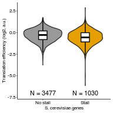

Analyze TE of yeast genes with or without stalls
================
rasi
13 August, 2021

-   [Load libraries](#load-libraries)
-   [Load genome and annotations](#load-genome-and-annotations)
-   [Load RQC stalls for joining with high TE
    genes](#load-rqc-stalls-for-joining-with-high-te-genes)
-   [Calculate TE as log2 ratio of RPF to RNA RPKM in Weinberg
    2016](#calculate-te-as-log2-ratio-of-rpf-to-rna-rpkm-in-weinberg-2016)
-   [Look at high TE genes with potential RQC
    stalls](#look-at-high-te-genes-with-potential-rqc-stalls)
-   [Plot TE as a function of stall
    strength](#plot-te-as-a-function-of-stall-strength)
-   [Test if stall-containing genes have lower or higher
    TE](#test-if-stall-containing-genes-have-lower-or-higher-te)
-   [Avg TE of stall-containing and other
    genes](#avg-te-of-stall-containing-and-other-genes)
-   [Session Info](#session-info)
-   [Source data for Fig 6C](#source-data-for-fig-6c)

# Load libraries

``` r
library(tidyverse)
library(rasilabRtemplates)
# disable scientific notation
options(scipen=3)
```

# Load genome and annotations

``` r
annotations <- "/fh/fast/subramaniam_a/db/rasi/genomes/yeast/Saccharomyces_cerevisiae/sgd/S288C_reference_genome_R64-1-1_20110203/saccharomyces_cerevisiae_R64-1-1_20110208.gff" %>% 
  rtracklayer::readGFF() %>% 
  as_tibble()
```

# Load RQC stalls for joining with high TE genes

``` r
rqc_stalls <- read_tsv("../../rqc_stalls_in_yeast_orfs/tables/ngrams_annotated.tsv") %>% 
  select(id, pos, ngram_weight, ngram) %>%
  print()
```

    ## # A tibble: 1,251 x 4
    ##    id        pos ngram_weight ngram     
    ##    <chr>   <dbl>        <dbl> <chr>     
    ##  1 YHR131C   321           10 RRRRRRRRRR
    ##  2 YIL159W   768           10 PPPPPPPPPP
    ##  3 YNL271C  1238           10 PPPPPPPPPP
    ##  4 YOR019W   712           10 KKKKKKKKKK
    ##  5 YBL091C    40            9 KKKKNKKKKK
    ##  6 YDL146W   473            9 APPPPPPPPP
    ##  7 YDL173W   273            9 KEKKKKKKKK
    ##  8 YDR174W   227            9 KKKKKKKKDK
    ##  9 YDR334W   231            9 KKKRGRKKKK
    ## 10 YHL019C   174            9 KRKDKKKKRK
    ## # … with 1,241 more rows

# Calculate TE as log2 ratio of RPF to RNA RPKM in Weinberg 2016

``` r
te_data <- list.files("../annotations/", pattern = "RPKMs.txt.gz", full.names = T) %>% 
  enframe("sno", "file") %>% 
  mutate(sample = str_extract(file, "RPF|RiboZero")) %>% 
  mutate(data = map(file, . %>% read_tsv(col_names = F))) %>% 
  select(-sno, -file) %>% 
  unnest() %>% 
  magrittr::set_colnames(c("sampletype", "id", "rpkm")) %>% 
  spread(sampletype, rpkm) %>% 
  dplyr::rename(ribo = RPF, rna = RiboZero) %>% 
  mutate(te = log2(ribo / rna)) %>% 
  filter(!is.na(te) & ribo > 5 & rna > 5) %>%
  left_join(annotations %>% select(gene, ID, Note), by = c("id" = "ID")) %>%
  mutate(Note = as.character(Note)) %>% 
  print()
```

    ## # A tibble: 4,507 x 6
    ##    id         rna   ribo      te gene  Note                                     
    ##    <chr>    <dbl>  <dbl>   <dbl> <chr> <chr>                                    
    ##  1 YAL001C   37.8 1.81e1 -1.06   TFC3  Largest of six subunits of the RNA polym…
    ##  2 YAL002W   22.2 5.73e0 -1.95   VPS8  Membrane-associated protein that interac…
    ##  3 YAL003W 4622.  7.07e3  0.612  EFB1  Translation elongation factor 1 beta; st…
    ##  4 YAL007C  212.  2.09e2 -0.0202 ERP2  Protein that forms a heterotrimeric comp…
    ##  5 YAL008W   50.0 9.56e1  0.935  FUN14 Mitochondrial protein of unknown function
    ##  6 YAL009W   35.0 1.89e1 -0.888  SPO7  Putative regulatory subunit of Nem1p-Spo…
    ##  7 YAL010C   16.7 1.10e1 -0.593  MDM10 Subunit of both the ERMES complex that l…
    ##  8 YAL011W   17.4 1.05e1 -0.729  SWC3  Protein of unknown function, component o…
    ##  9 YAL012W  568.  1.09e3  0.945  CYS3  Cystathionine gamma-lyase, catalyzes one…
    ## 10 YAL013W   25.5 4.07e1  0.673  DEP1  Transcriptional modulator involved in re…
    ## # … with 4,497 more rows

# Look at high TE genes with potential RQC stalls

``` r
te_stall_data <- te_data %>% 
  left_join(rqc_stalls, by = "id") %>% 
  arrange(desc(te)) %>% 
  select(te, gene, pos, ngram, ngram_weight, everything()) %>% 
  print()
```

    ## # A tibble: 4,507 x 9
    ##       te gene     pos ngram  ngram_weight id       rna   ribo Note              
    ##    <dbl> <chr>  <dbl> <chr>         <dbl> <chr>  <dbl>  <dbl> <chr>             
    ##  1  2.89 TMA23    157 KKKKK…            9 YMR2… 7.46e0   55.3 Nucleolar protein…
    ##  2  1.75 MFA1      NA <NA>             NA YDR4… 4.74e2 1596.  Mating pheromone …
    ##  3  1.69 VPS24     NA <NA>             NA YKL0… 1.96e1   63.3 One of four subun…
    ##  4  1.65 NOP16    215 KRRLL…            7 YER0… 6.71e1  211.  Constituent of 66…
    ##  5  1.65 TMA10     NA <NA>             NA YLR3… 4.35e1  136.  Protein of unknow…
    ##  6  1.59 TIM17     NA <NA>             NA YJL1… 9.38e1  283.  Essential subunit…
    ##  7  1.56 <NA>      NA <NA>             NA YDL0… 7.31e1  216.  Tail-anchored pla…
    ##  8  1.52 RPS29A    NA <NA>             NA YLR3… 2.75e3 7897.  Protein component…
    ##  9  1.47 MFA2      NA <NA>             NA YNL1… 6.44e2 1781.  Mating pheromone …
    ## 10  1.47 CIS3      NA <NA>             NA YJL1… 6.93e2 1918.  Mannose-containin…
    ## # … with 4,497 more rows

# Plot TE as a function of stall strength

``` r
plot_data <- te_stall_data %>% 
  mutate(ngram_weight = as.factor(if_else(is.na(ngram_weight), 0, 1))) %>% 
  group_by(ngram_weight) %>% 
  mutate(`n` = paste0("N = ", dplyr::n())) %>% 
  ungroup() %>% 
  mutate(ngram_weight = fct_recode(ngram_weight, `No stall` = "0", `Stall` = "1"))
  
plot_data %>% 
  ggplot(aes(x = ngram_weight, y = te, fill = ngram_weight)) +
  geom_violin() +
  geom_boxplot(width = 0.2, fill = "white", color = "black", outlier.shape = NA) +
  labs(x = "S. cerevisiae genes", y = "Translation efficiency (log2, a.u.)") +
  geom_text(aes(x = ngram_weight, label = n),
            data = plot_data %>% group_by(ngram_weight) %>% slice(1),
            y = -7, size = 2.8) +
  scale_y_continuous(limits = c(-7.2, 3)) +
  scale_fill_manual(values = cbPalette, guide = "none") +
  NULL
```

<!-- -->

``` r
ggsave("../figures/distribution_of_translation_efficiency_for_rqc_stall_containing_saccer_genes.pdf")
```

# Test if stall-containing genes have lower or higher TE

``` r
wilcox.test(te ~ ngram_weight, data = plot_data, alternative = "two.sided") %>% 
  broom::tidy()
```

    ## # A tibble: 1 x 4
    ##   statistic  p.value method                                          alternative
    ##       <dbl>    <dbl> <chr>                                           <chr>      
    ## 1  2111726. 2.07e-18 Wilcoxon rank sum test with continuity correct… two.sided

# Avg TE of stall-containing and other genes

``` r
plot_data %>% 
  group_by(ngram_weight) %>% 
  summarize(te = mean(te), n = dplyr::n()) %>% 
  knitr::kable()
```

| ngram\_weight |         te |    n |
|:--------------|-----------:|-----:|
| No stall      | -0.3292908 | 3477 |
| Stall         | -0.5665720 | 1030 |

# Session Info

``` r
sessionInfo()
```

    ## R version 4.0.3 (2020-10-10)
    ## Platform: x86_64-conda-linux-gnu (64-bit)
    ## Running under: Ubuntu 20.04.2 LTS
    ## 
    ## Matrix products: default
    ## BLAS/LAPACK: /home/rasi/lib/miniconda3/envs/r/lib/libopenblasp-r0.3.10.so
    ## 
    ## locale:
    ##  [1] LC_CTYPE=en_US.UTF-8       LC_NUMERIC=C              
    ##  [3] LC_TIME=en_US.UTF-8        LC_COLLATE=en_US.UTF-8    
    ##  [5] LC_MONETARY=en_US.UTF-8    LC_MESSAGES=en_US.UTF-8   
    ##  [7] LC_PAPER=en_US.UTF-8       LC_NAME=C                 
    ##  [9] LC_ADDRESS=C               LC_TELEPHONE=C            
    ## [11] LC_MEASUREMENT=en_US.UTF-8 LC_IDENTIFICATION=C       
    ## 
    ## attached base packages:
    ## [1] stats     graphics  grDevices datasets  utils     methods   base     
    ## 
    ## other attached packages:
    ##  [1] rasilabRtemplates_0.1.0 forcats_0.5.0           stringr_1.4.0          
    ##  [4] dplyr_1.0.2             purrr_0.3.4             readr_1.4.0            
    ##  [7] tidyr_1.1.2             tibble_3.0.4            ggplot2_3.3.2          
    ## [10] tidyverse_1.3.0        
    ## 
    ## loaded via a namespace (and not attached):
    ##  [1] MatrixGenerics_1.2.0        Biobase_2.50.0             
    ##  [3] httr_1.4.2                  jsonlite_1.7.1             
    ##  [5] modelr_0.1.8                assertthat_0.2.1           
    ##  [7] highr_0.8                   stats4_4.0.3               
    ##  [9] GenomeInfoDbData_1.2.4      cellranger_1.1.0           
    ## [11] Rsamtools_2.6.0             yaml_2.2.1                 
    ## [13] lattice_0.20-41             pillar_1.4.7               
    ## [15] backports_1.2.0             glue_1.4.2                 
    ## [17] digest_0.6.27               GenomicRanges_1.42.0       
    ## [19] XVector_0.30.0              rvest_0.3.6                
    ## [21] colorspace_2.0-0            htmltools_0.5.0            
    ## [23] Matrix_1.2-18               XML_3.99-0.3               
    ## [25] pkgconfig_2.0.3             broom_0.7.4                
    ## [27] haven_2.3.1                 zlibbioc_1.36.0            
    ## [29] scales_1.1.1                BiocParallel_1.24.0        
    ## [31] farver_2.0.3                generics_0.1.0             
    ## [33] IRanges_2.24.0              ellipsis_0.3.1             
    ## [35] withr_2.3.0                 SummarizedExperiment_1.20.0
    ## [37] BiocGenerics_0.36.0         cli_2.2.0                  
    ## [39] magrittr_2.0.1              crayon_1.3.4               
    ## [41] readxl_1.3.1                evaluate_0.14              
    ## [43] fs_1.5.0                    fansi_0.4.1                
    ## [45] xml2_1.3.2                  tools_4.0.3                
    ## [47] hms_0.5.3                   lifecycle_0.2.0            
    ## [49] matrixStats_0.57.0          S4Vectors_0.28.0           
    ## [51] munsell_0.5.0               reprex_0.3.0               
    ## [53] DelayedArray_0.16.0         Biostrings_2.58.0          
    ## [55] compiler_4.0.3              GenomeInfoDb_1.26.0        
    ## [57] rlang_0.4.11                grid_4.0.3                 
    ## [59] RCurl_1.98-1.2              rstudioapi_0.13            
    ## [61] labeling_0.4.2              bitops_1.0-6               
    ## [63] rmarkdown_2.5               gtable_0.3.0               
    ## [65] DBI_1.1.0                   R6_2.5.0                   
    ## [67] GenomicAlignments_1.26.0    lubridate_1.7.9.2          
    ## [69] knitr_1.30                  rtracklayer_1.50.0         
    ## [71] utf8_1.1.4                  stringi_1.5.3              
    ## [73] parallel_4.0.3              Rcpp_1.0.5                 
    ## [75] vctrs_0.3.5                 dbplyr_2.0.0               
    ## [77] tidyselect_1.1.0            xfun_0.19

# Source data for Fig 6C

``` r
plot_data %>% 
  rename(x = ngram_weight, y = te) %>% 
  select(gene, id, x, y) %>%
  mutate_if(is.numeric, funs(round(., 3))) %>% 
  write_tsv('../tables/source_data_fig_6c.tsv') %>% 
  knitr::kable()
```

| gene    | id      | x        |      y |
|:--------|:--------|:---------|-------:|
| TMA23   | YMR269W | Stall    |  2.891 |
| MFA1    | YDR461W | No stall |  1.750 |
| VPS24   | YKL041W | No stall |  1.694 |
| NOP16   | YER002W | Stall    |  1.650 |
| TMA10   | YLR327C | No stall |  1.649 |
| TIM17   | YJL143W | No stall |  1.595 |
| NA      | YDL012C | No stall |  1.562 |
| RPS29A  | YLR388W | No stall |  1.523 |
| MFA2    | YNL145W | No stall |  1.469 |
| CIS3    | YJL158C | No stall |  1.468 |
| NA      | YBR016W | No stall |  1.467 |
| SBA1    | YKL117W | No stall |  1.455 |
| FYV7    | YLR068W | Stall    |  1.453 |
| TOS6    | YNL300W | No stall |  1.412 |
| GAR1    | YHR089C | Stall    |  1.365 |
| CDC31   | YOR257W | No stall |  1.361 |
| ASF1    | YJL115W | No stall |  1.351 |
| IES2    | YNL215W | Stall    |  1.318 |
| COX7    | YMR256C | No stall |  1.318 |
| STF2    | YGR008C | No stall |  1.317 |
| URM1    | YIL008W | No stall |  1.284 |
| COX9    | YDL067C | No stall |  1.281 |
| INH1    | YDL181W | No stall |  1.275 |
| UBC4    | YBR082C | No stall |  1.272 |
| FCY1    | YPR062W | No stall |  1.271 |
| TOM7    | YNL070W | No stall |  1.236 |
| COX12   | YLR038C | No stall |  1.225 |
| HTB1    | YDR224C | Stall    |  1.224 |
| WWM1    | YFL010C | No stall |  1.220 |
| QCR8    | YJL166W | No stall |  1.217 |
| SNF7    | YLR025W | No stall |  1.209 |
| MAK16   | YAL025C | Stall    |  1.204 |
| GRX1    | YCL035C | No stall |  1.203 |
| SML1    | YML058W | No stall |  1.201 |
| CYC1    | YJR048W | No stall |  1.195 |
| CWC15   | YDR163W | No stall |  1.179 |
| COX14   | YML129C | No stall |  1.172 |
| UMP1    | YBR173C | No stall |  1.171 |
| COX17   | YLL009C | No stall |  1.142 |
| CGR1    | YGL029W | Stall    |  1.141 |
| TSR2    | YLR435W | Stall    |  1.134 |
| ATP20   | YPR020W | No stall |  1.131 |
| SBP1    | YHL034C | No stall |  1.127 |
| HYR1    | YIR037W | No stall |  1.122 |
| SMD3    | YLR147C | No stall |  1.116 |
| COX8    | YLR395C | No stall |  1.113 |
| ACB1    | YGR037C | No stall |  1.111 |
| TIP1    | YBR067C | No stall |  1.106 |
| PXR1    | YGR280C | Stall    |  1.088 |
| VPS21   | YOR089C | No stall |  1.086 |
| ACP1    | YKL192C | No stall |  1.086 |
| TPM1    | YNL079C | No stall |  1.069 |
| NBP2    | YDR162C | No stall |  1.064 |
| DAP1    | YPL170W | No stall |  1.063 |
| ZEO1    | YOL109W | No stall |  1.060 |
| TMA16   | YOR252W | Stall    |  1.054 |
| NA      | YNL122C | No stall |  1.054 |
| RPF1    | YHR088W | Stall    |  1.043 |
| YMR31   | YFR049W | No stall |  1.041 |
| CYB5    | YNL111C | No stall |  1.032 |
| EGD2    | YHR193C | No stall |  1.028 |
| HAM1    | YJR069C | No stall |  1.025 |
| NPL3    | YDR432W | Stall    |  1.023 |
| NA      | YJR085C | No stall |  1.022 |
| RPB11   | YOL005C | No stall |  1.021 |
| RPS28B  | YLR264W | No stall |  1.019 |
| YPT52   | YKR014C | No stall |  1.017 |
| SMD2    | YLR275W | No stall |  1.014 |
| PET117  | YER058W | Stall    |  1.011 |
| SME1    | YOR159C | No stall |  1.005 |
| RRP17   | YDR412W | Stall    |  1.001 |
| SIS1    | YNL007C | Stall    |  1.000 |
| UBC6    | YER100W | No stall |  0.999 |
| RPL39   | YJL189W | Stall    |  0.990 |
| PBI2    | YNL015W | No stall |  0.989 |
| VMA4    | YOR332W | No stall |  0.988 |
| RPS27B  | YHR021C | No stall |  0.988 |
| NA      | YPR063C | No stall |  0.988 |
| HYP2    | YEL034W | No stall |  0.985 |
| RBL2    | YOR265W | No stall |  0.982 |
| CYC3    | YAL039C | No stall |  0.981 |
| RPS27A  | YKL156W | No stall |  0.980 |
| AHP1    | YLR109W | No stall |  0.979 |
| NA      | YDR210W | No stall |  0.970 |
| PRY1    | YJL079C | No stall |  0.967 |
| MSA2    | YKR077W | No stall |  0.959 |
| PST2    | YDR032C | No stall |  0.953 |
| CHZ1    | YER030W | Stall    |  0.952 |
| TLG1    | YDR468C | No stall |  0.948 |
| CYS3    | YAL012W | No stall |  0.945 |
| MIC17   | YMR002W | No stall |  0.943 |
| NA      | YLR042C | No stall |  0.943 |
| RTS3    | YGR161C | No stall |  0.942 |
| HSP12   | YFL014W | No stall |  0.942 |
| RNQ1    | YCL028W | No stall |  0.941 |
| NA      | YKR043C | No stall |  0.937 |
| FUN14   | YAL008W | No stall |  0.935 |
| TMA22   | YJR014W | Stall    |  0.934 |
| NOP1    | YDL014W | No stall |  0.934 |
| APA1    | YCL050C | No stall |  0.932 |
| FIT2    | YOR382W | No stall |  0.926 |
| PAI3    | YMR174C | No stall |  0.920 |
| YKE2    | YLR200W | No stall |  0.916 |
| YGP1    | YNL160W | No stall |  0.915 |
| SNC2    | YOR327C | No stall |  0.915 |
| DPM1    | YPR183W | No stall |  0.911 |
| ATG8    | YBL078C | No stall |  0.906 |
| NA      | YMR295C | Stall    |  0.905 |
| NA      | YGL242C | No stall |  0.904 |
| COX5A   | YNL052W | No stall |  0.901 |
| NA      | YNR014W | No stall |  0.900 |
| TOM6    | YOR045W | No stall |  0.899 |
| MZM1    | YDR493W | No stall |  0.897 |
| ABF2    | YMR072W | No stall |  0.890 |
| SMT3    | YDR510W | No stall |  0.890 |
| DEF1    | YKL054C | No stall |  0.886 |
| SVS1    | YPL163C | No stall |  0.883 |
| EGD1    | YPL037C | No stall |  0.882 |
| FIT3    | YOR383C | No stall |  0.874 |
| CMD1    | YBR109C | No stall |  0.873 |
| SOD1    | YJR104C | No stall |  0.871 |
| MMF1    | YIL051C | No stall |  0.865 |
| RPL38   | YLR325C | No stall |  0.864 |
| HTB2    | YBL002W | Stall    |  0.863 |
| NA      | YOR052C | Stall    |  0.862 |
| PFD1    | YJL179W | No stall |  0.862 |
| LSM7    | YNL147W | No stall |  0.861 |
| RPL22A  | YLR061W | No stall |  0.856 |
| PMP3    | YDR276C | No stall |  0.854 |
| MLC1    | YGL106W | No stall |  0.853 |
| GLC8    | YMR311C | No stall |  0.850 |
| AIM13   | YFR011C | No stall |  0.849 |
| RNA15   | YGL044C | No stall |  0.847 |
| APS1    | YLR170C | No stall |  0.847 |
| CCW12   | YLR110C | No stall |  0.845 |
| EMI5    | YOL071W | No stall |  0.845 |
| PRY2    | YKR013W | No stall |  0.843 |
| NA      | YBL028C | No stall |  0.842 |
| TRM112  | YNR046W | No stall |  0.841 |
| RTF1    | YGL244W | Stall    |  0.839 |
| SDH4    | YDR178W | No stall |  0.839 |
| GIS2    | YNL255C | No stall |  0.836 |
| YAE1    | YJR067C | No stall |  0.836 |
| SFA1    | YDL168W | No stall |  0.830 |
| GRX2    | YDR513W | No stall |  0.830 |
| RPL37A  | YLR185W | No stall |  0.829 |
| MGR2    | YPL098C | No stall |  0.828 |
| ORM2    | YLR350W | No stall |  0.827 |
| ATO3    | YDR384C | No stall |  0.826 |
| RPB9    | YGL070C | No stall |  0.826 |
| UBC13   | YDR092W | No stall |  0.824 |
| POR1    | YNL055C | No stall |  0.824 |
| SCS2    | YER120W | No stall |  0.824 |
| YNK1    | YKL067W | No stall |  0.824 |
| FAP7    | YDL166C | No stall |  0.822 |
| CWP1    | YKL096W | No stall |  0.822 |
| FYV4    | YHR059W | No stall |  0.819 |
| TSA1    | YML028W | No stall |  0.818 |
| SAS10   | YDL153C | Stall    |  0.817 |
| EDC2    | YER035W | Stall    |  0.813 |
| VMA21   | YGR105W | No stall |  0.811 |
| LRP1    | YHR081W | Stall    |  0.809 |
| CBF1    | YJR060W | No stall |  0.807 |
| UBC1    | YDR177W | No stall |  0.803 |
| RPS20   | YHL015W | No stall |  0.802 |
| MSL1    | YIR009W | No stall |  0.801 |
| TRX2    | YGR209C | No stall |  0.798 |
| MMS2    | YGL087C | Stall    |  0.796 |
| RTC3    | YHR087W | No stall |  0.795 |
| TMA17   | YDL110C | No stall |  0.794 |
| RMR1    | YGL250W | No stall |  0.794 |
| COX6    | YHR051W | No stall |  0.793 |
| SRX1    | YKL086W | No stall |  0.790 |
| COX4    | YGL187C | No stall |  0.789 |
| HHO1    | YPL127C | No stall |  0.789 |
| HSP26   | YBR072W | No stall |  0.786 |
| SMB1    | YER029C | Stall    |  0.784 |
| HCR1    | YLR192C | Stall    |  0.784 |
| NCE103  | YNL036W | No stall |  0.783 |
| TAF10   | YDR167W | No stall |  0.782 |
| PET191  | YJR034W | No stall |  0.782 |
| MDY2    | YOL111C | No stall |  0.779 |
| CPR1    | YDR155C | No stall |  0.779 |
| TRM10   | YOL093W | Stall    |  0.779 |
| HGH1    | YGR187C | No stall |  0.779 |
| SHG1    | YBR258C | No stall |  0.777 |
| VPS51   | YKR020W | No stall |  0.775 |
| MRPL28  | YDR462W | No stall |  0.774 |
| RPL30   | YGL030W | No stall |  0.771 |
| LYS1    | YIR034C | No stall |  0.767 |
| NA      | YHR138C | No stall |  0.767 |
| SPT4    | YGR063C | No stall |  0.764 |
| COX13   | YGL191W | No stall |  0.763 |
| QCR9    | YGR183C | No stall |  0.761 |
| ACM1    | YPL267W | No stall |  0.760 |
| ATP14   | YLR295C | No stall |  0.757 |
| NA      | YLR040C | No stall |  0.755 |
| ABP1    | YCR088W | Stall    |  0.754 |
| SUB1    | YMR039C | Stall    |  0.748 |
| CDC26   | YFR036W | No stall |  0.747 |
| NA      | YNL208W | No stall |  0.743 |
| ATP15   | YPL271W | No stall |  0.743 |
| CYT2    | YKL087C | No stall |  0.741 |
| GLO2    | YDR272W | No stall |  0.740 |
| RDI1    | YDL135C | No stall |  0.739 |
| CLC1    | YGR167W | No stall |  0.738 |
| FPR1    | YNL135C | No stall |  0.737 |
| PET9    | YBL030C | No stall |  0.734 |
| ARF3    | YOR094W | No stall |  0.732 |
| GPD1    | YDL022W | No stall |  0.732 |
| SCW4    | YGR279C | No stall |  0.731 |
| TRR1    | YDR353W | No stall |  0.729 |
| NA      | YBR071W | No stall |  0.729 |
| NKP2    | YLR315W | No stall |  0.727 |
| MTC3    | YGL226W | No stall |  0.727 |
| PET100  | YDR079W | Stall    |  0.727 |
| NA      | YER034W | No stall |  0.724 |
| OPI10   | YOL032W | No stall |  0.724 |
| YRB1    | YDR002W | No stall |  0.721 |
| EMI1    | YDR512C | No stall |  0.721 |
| NOP15   | YNL110C | No stall |  0.720 |
| SOL1    | YNR034W | Stall    |  0.720 |
| ARC15   | YIL062C | No stall |  0.720 |
| ESF2    | YNR054C | No stall |  0.720 |
| IDI1    | YPL117C | No stall |  0.719 |
| OM45    | YIL136W | No stall |  0.718 |
| SIM1    | YIL123W | No stall |  0.716 |
| STM1    | YLR150W | No stall |  0.715 |
| NA      | YKR011C | No stall |  0.714 |
| RIB4    | YOL143C | No stall |  0.712 |
| MRT4    | YKL009W | No stall |  0.711 |
| RTT102  | YGR275W | No stall |  0.709 |
| HOM2    | YDR158W | No stall |  0.707 |
| CPR3    | YML078W | No stall |  0.707 |
| RPS22A  | YJL190C | No stall |  0.705 |
| FPR3    | YML074C | Stall    |  0.699 |
| GOS1    | YHL031C | No stall |  0.697 |
| ENT3    | YJR125C | Stall    |  0.697 |
| GIM5    | YML094W | No stall |  0.696 |
| LSM4    | YER112W | No stall |  0.695 |
| RPL43A  | YPR043W | No stall |  0.694 |
| PAA1    | YDR071C | No stall |  0.694 |
| NA      | YPL225W | No stall |  0.694 |
| RPS28A  | YOR167C | No stall |  0.691 |
| ILV5    | YLR355C | No stall |  0.689 |
| RPS22B  | YLR367W | No stall |  0.687 |
| GRX3    | YDR098C | No stall |  0.687 |
| RPS21B  | YJL136C | No stall |  0.686 |
| RPL31B  | YLR406C | Stall    |  0.685 |
| RPS10A  | YOR293W | No stall |  0.683 |
| RPS25B  | YLR333C | Stall    |  0.683 |
| PEX19   | YDL065C | No stall |  0.682 |
| SRO9    | YCL037C | No stall |  0.680 |
| PNC1    | YGL037C | No stall |  0.680 |
| BUD23   | YCR047C | Stall    |  0.679 |
| HMF1    | YER057C | No stall |  0.678 |
| YRA1    | YDR381W | Stall    |  0.678 |
| YPT31   | YER031C | No stall |  0.678 |
| LIA1    | YJR070C | No stall |  0.676 |
| NA      | YJL144W | No stall |  0.676 |
| FMP21   | YBR269C | No stall |  0.674 |
| YPT6    | YLR262C | No stall |  0.673 |
| DEP1    | YAL013W | No stall |  0.673 |
| VAM7    | YGL212W | No stall |  0.672 |
| INO4    | YOL108C | Stall    |  0.672 |
| RPL31A  | YDL075W | Stall    |  0.671 |
| DYN2    | YDR424C | No stall |  0.671 |
| NOP6    | YDL213C | Stall    |  0.671 |
| RPC11   | YDR045C | No stall |  0.670 |
| NA      | YGR035C | No stall |  0.669 |
| STI1    | YOR027W | No stall |  0.669 |
| TWF1    | YGR080W | Stall    |  0.669 |
| RPB5    | YBR154C | No stall |  0.667 |
| BUD20   | YLR074C | Stall    |  0.666 |
| LOC1    | YFR001W | Stall    |  0.666 |
| COF1    | YLL050C | No stall |  0.665 |
| NA      | YKL063C | No stall |  0.664 |
| SAP30   | YMR263W | Stall    |  0.664 |
| YDJ1    | YNL064C | No stall |  0.664 |
| NA      | YBR137W | No stall |  0.663 |
| POL30   | YBR088C | No stall |  0.662 |
| RPA14   | YDR156W | No stall |  0.661 |
| RPL37B  | YDR500C | No stall |  0.661 |
| MRPL25  | YGR076C | No stall |  0.661 |
| RPB10   | YOR210W | No stall |  0.660 |
| CSM1    | YCR086W | Stall    |  0.657 |
| EBP2    | YKL172W | Stall    |  0.657 |
| TAF7    | YMR227C | Stall    |  0.656 |
| NA      | YOR021C | No stall |  0.656 |
| MRP8    | YKL142W | No stall |  0.655 |
| ZTA1    | YBR046C | No stall |  0.654 |
| TOM22   | YNL131W | No stall |  0.654 |
| SEC13   | YLR208W | No stall |  0.653 |
| RSR1    | YGR152C | No stall |  0.651 |
| DDI1    | YER143W | No stall |  0.650 |
| YAR1    | YPL239W | No stall |  0.650 |
| RPC19   | YNL113W | No stall |  0.650 |
| NA      | YPL229W | No stall |  0.649 |
| RSM27   | YGR215W | Stall    |  0.648 |
| NA      | YPL108W | No stall |  0.648 |
| RRP14   | YKL082C | Stall    |  0.647 |
| RPS15   | YOL040C | No stall |  0.646 |
| FCF2    | YLR051C | Stall    |  0.645 |
| MIC14   | YDR031W | No stall |  0.644 |
| GCV3    | YAL044C | No stall |  0.643 |
| HXK1    | YFR053C | No stall |  0.642 |
| YPT7    | YML001W | No stall |  0.637 |
| CMC1    | YKL137W | No stall |  0.636 |
| RPL32   | YBL092W | Stall    |  0.636 |
| SHM2    | YLR058C | No stall |  0.634 |
| IPP1    | YBR011C | No stall |  0.632 |
| UTH1    | YKR042W | No stall |  0.630 |
| BUG1    | YDL099W | Stall    |  0.630 |
| YPI1    | YFR003C | Stall    |  0.629 |
| RPS13   | YDR064W | No stall |  0.628 |
| SEC4    | YFL005W | No stall |  0.626 |
| BTT1    | YDR252W | No stall |  0.626 |
| TVP18   | YMR071C | No stall |  0.626 |
| ARC18   | YLR370C | No stall |  0.624 |
| PDS1    | YDR113C | No stall |  0.622 |
| ECM33   | YBR078W | No stall |  0.621 |
| GSP1    | YLR293C | No stall |  0.618 |
| NA      | YNL134C | No stall |  0.618 |
| CAR1    | YPL111W | No stall |  0.617 |
| SPO12   | YHR152W | Stall    |  0.616 |
| OST2    | YOR103C | No stall |  0.615 |
| SKP1    | YDR328C | No stall |  0.615 |
| PST1    | YDR055W | No stall |  0.613 |
| VTC1    | YER072W | No stall |  0.613 |
| NA      | YLR301W | No stall |  0.613 |
| PGC1    | YPL206C | No stall |  0.612 |
| EFB1    | YAL003W | No stall |  0.612 |
| MRPL33  | YMR286W | No stall |  0.612 |
| CRP1    | YHR146W | Stall    |  0.606 |
| RPA34   | YJL148W | Stall    |  0.606 |
| ARL1    | YBR164C | No stall |  0.603 |
| JAC1    | YGL018C | No stall |  0.601 |
| IST3    | YIR005W | No stall |  0.600 |
| RPN11   | YFR004W | No stall |  0.600 |
| TIM13   | YGR181W | No stall |  0.598 |
| BNA1    | YJR025C | No stall |  0.597 |
| TPS1    | YBR126C | No stall |  0.595 |
| DIF1    | YLR437C | No stall |  0.595 |
| RRS1    | YOR294W | Stall    |  0.593 |
| MRPL37  | YBR268W | Stall    |  0.593 |
| TEM1    | YML064C | No stall |  0.593 |
| BFR1    | YOR198C | Stall    |  0.592 |
| SMX3    | YPR182W | No stall |  0.591 |
| OYE2    | YHR179W | No stall |  0.591 |
| NTC20   | YBR188C | No stall |  0.590 |
| PRP11   | YDL043C | No stall |  0.590 |
| RSM18   | YER050C | No stall |  0.588 |
| RPC37   | YKR025W | No stall |  0.588 |
| EDC1    | YGL222C | No stall |  0.588 |
| RFA2    | YNL312W | No stall |  0.586 |
| DSK2    | YMR276W | No stall |  0.583 |
| MRP2    | YPR166C | No stall |  0.582 |
| NA      | YOR283W | No stall |  0.582 |
| MAM33   | YIL070C | No stall |  0.580 |
| RPN13   | YLR421C | No stall |  0.580 |
| GIC2    | YDR309C | No stall |  0.580 |
| YCP4    | YCR004C | No stall |  0.579 |
| RRF1    | YHR038W | No stall |  0.577 |
| RRP36   | YOR287C | Stall    |  0.577 |
| HSP10   | YOR020C | No stall |  0.577 |
| FSH2    | YMR222C | No stall |  0.576 |
| TPM2    | YIL138C | No stall |  0.576 |
| NA      | YBL036C | No stall |  0.574 |
| NA      | YGR251W | Stall    |  0.574 |
| TIF5    | YPR041W | No stall |  0.573 |
| RLP24   | YLR009W | Stall    |  0.572 |
| ICY2    | YPL250C | No stall |  0.572 |
| IMP3    | YHR148W | No stall |  0.571 |
| OM14    | YBR230C | No stall |  0.570 |
| TAF14   | YPL129W | No stall |  0.570 |
| RPF2    | YKR081C | No stall |  0.568 |
| RIP1    | YEL024W | No stall |  0.567 |
| HNT1    | YDL125C | No stall |  0.566 |
| TIR3    | YIL011W | No stall |  0.566 |
| PDX3    | YBR035C | No stall |  0.565 |
| IMP2’   | YIL154C | Stall    |  0.564 |
| LEO1    | YOR123C | Stall    |  0.564 |
| MRPL39  | YML009C | Stall    |  0.564 |
| ATG3    | YNR007C | Stall    |  0.564 |
| YPR1    | YDR368W | No stall |  0.564 |
| THO1    | YER063W | No stall |  0.563 |
| NA      | YIR024C | No stall |  0.560 |
| GPX2    | YBR244W | No stall |  0.558 |
| SRP14   | YDL092W | Stall    |  0.558 |
| SSS1    | YDR086C | No stall |  0.557 |
| RPL33A  | YPL143W | No stall |  0.557 |
| SFH1    | YLR321C | Stall    |  0.557 |
| TPI1    | YDR050C | No stall |  0.556 |
| SEC17   | YBL050W | No stall |  0.556 |
| FMP37   | YGL080W | No stall |  0.556 |
| BUR6    | YER159C | No stall |  0.555 |
| CDC73   | YLR418C | No stall |  0.555 |
| NA      | YOR223W | No stall |  0.554 |
| RNR4    | YGR180C | No stall |  0.554 |
| OTU2    | YHL013C | Stall    |  0.554 |
| PRP21   | YJL203W | Stall    |  0.553 |
| ATP17   | YDR377W | No stall |  0.552 |
| RRP15   | YPR143W | Stall    |  0.551 |
| RPL17A  | YKL180W | No stall |  0.550 |
| GLN1    | YPR035W | Stall    |  0.550 |
| MRPS16  | YPL013C | No stall |  0.549 |
| RHO1    | YPR165W | Stall    |  0.548 |
| MXR1    | YER042W | No stall |  0.546 |
| ADK1    | YDR226W | No stall |  0.544 |
| CAJ1    | YER048C | No stall |  0.543 |
| SNN1    | YNL086W | Stall    |  0.543 |
| NHP2    | YDL208W | No stall |  0.543 |
| HIT1    | YJR055W | No stall |  0.541 |
| NTF2    | YER009W | No stall |  0.539 |
| GRX5    | YPL059W | No stall |  0.538 |
| ATP16   | YDL004W | No stall |  0.537 |
| CIA1    | YDR267C | No stall |  0.535 |
| PAC10   | YGR078C | No stall |  0.534 |
| CCS1    | YMR038C | No stall |  0.531 |
| NA      | YBR053C | No stall |  0.530 |
| CDC19   | YAL038W | No stall |  0.530 |
| RAD23   | YEL037C | No stall |  0.529 |
| RPL6A   | YML073C | Stall    |  0.528 |
| RPS25A  | YGR027C | Stall    |  0.528 |
| CHA1    | YCL064C | No stall |  0.527 |
| NSA2    | YER126C | Stall    |  0.527 |
| ADH1    | YOL086C | No stall |  0.526 |
| NA      | YLR194C | No stall |  0.526 |
| NA      | YJL068C | No stall |  0.525 |
| CSE4    | YKL049C | Stall    |  0.525 |
| DHH1    | YDL160C | No stall |  0.524 |
| RCN2    | YOR220W | No stall |  0.524 |
| NA      | YOR302W | No stall |  0.524 |
| URA1    | YKL216W | No stall |  0.524 |
| FPR4    | YLR449W | Stall    |  0.524 |
| GRX7    | YBR014C | No stall |  0.523 |
| FMC1    | YIL098C | No stall |  0.521 |
| CKS1    | YBR135W | No stall |  0.521 |
| HAP2    | YGL237C | No stall |  0.521 |
| VTI1    | YMR197C | No stall |  0.520 |
| NA      | YLR179C | No stall |  0.520 |
| SRL1    | YOR247W | No stall |  0.518 |
| SCM4    | YGR049W | No stall |  0.516 |
| ISU1    | YPL135W | No stall |  0.515 |
| ADO1    | YJR105W | No stall |  0.514 |
| BCY1    | YIL033C | No stall |  0.514 |
| HAP3    | YBL021C | No stall |  0.514 |
| RPS9B   | YBR189W | No stall |  0.513 |
| TOM40   | YMR203W | No stall |  0.512 |
| RRT14   | YIL127C | Stall    |  0.512 |
| TRX1    | YLR043C | No stall |  0.511 |
| ENT1    | YDL161W | Stall    |  0.510 |
| YPT35   | YHR105W | No stall |  0.509 |
| IES4    | YOR189W | No stall |  0.509 |
| SEC65   | YML105C | No stall |  0.509 |
| ALD6    | YPL061W | No stall |  0.506 |
| DUT1    | YBR252W | No stall |  0.506 |
| NA      | YBR062C | No stall |  0.505 |
| CRH1    | YGR189C | No stall |  0.504 |
| TOM20   | YGR082W | No stall |  0.500 |
| IES6    | YEL044W | No stall |  0.500 |
| NCE102  | YPR149W | No stall |  0.499 |
| NA      | YJL218W | No stall |  0.498 |
| MRPL24  | YMR193W | Stall    |  0.498 |
| DCS1    | YLR270W | No stall |  0.497 |
| PHO13   | YDL236W | No stall |  0.497 |
| RPP2A   | YOL039W | No stall |  0.497 |
| NA      | YHR097C | Stall    |  0.496 |
| CPR5    | YDR304C | No stall |  0.493 |
| LEA1    | YPL213W | No stall |  0.493 |
| GAL83   | YER027C | No stall |  0.493 |
| CAR2    | YLR438W | No stall |  0.493 |
| GTS1    | YGL181W | No stall |  0.493 |
| MED11   | YMR112C | No stall |  0.493 |
| UME1    | YPL139C | No stall |  0.492 |
| SGN1    | YIR001C | No stall |  0.492 |
| PRP38   | YGR075C | No stall |  0.491 |
| LTP1    | YPR073C | No stall |  0.491 |
| PRE8    | YML092C | No stall |  0.491 |
| ROX1    | YPR065W | Stall    |  0.490 |
| ERV14   | YGL054C | No stall |  0.490 |
| RPL33B  | YOR234C | No stall |  0.490 |
| UGP1    | YKL035W | No stall |  0.487 |
| PUB1    | YNL016W | No stall |  0.487 |
| SAM2    | YDR502C | No stall |  0.487 |
| CWC21   | YDR482C | No stall |  0.486 |
| RPL5    | YPL131W | No stall |  0.485 |
| AGA2    | YGL032C | No stall |  0.484 |
| RPL27B  | YDR471W | Stall    |  0.484 |
| RHO3    | YIL118W | No stall |  0.484 |
| SNU13   | YEL026W | No stall |  0.483 |
| RHR2    | YIL053W | No stall |  0.482 |
| ERG20   | YJL167W | No stall |  0.481 |
| NA      | YDR415C | No stall |  0.480 |
| RPS5    | YJR123W | No stall |  0.479 |
| RPT2    | YDL007W | Stall    |  0.479 |
| APC9    | YLR102C | No stall |  0.478 |
| RPL27A  | YHR010W | Stall    |  0.478 |
| PRE3    | YJL001W | No stall |  0.477 |
| MDH1    | YKL085W | No stall |  0.476 |
| RTT105  | YER104W | Stall    |  0.476 |
| HIS3    | YOR202W | No stall |  0.474 |
| NOP8    | YOL144W | Stall    |  0.474 |
| LIP1    | YMR298W | No stall |  0.473 |
| NA      | YML053C | No stall |  0.472 |
| FAF1    | YIL019W | Stall    |  0.472 |
| MRPL44  | YMR225C | No stall |  0.471 |
| RPP2B   | YDR382W | No stall |  0.471 |
| ARG1    | YOL058W | No stall |  0.471 |
| NRM1    | YNR009W | No stall |  0.471 |
| SPC29   | YPL124W | No stall |  0.469 |
| NSR1    | YGR159C | No stall |  0.469 |
| NA      | YMR226C | No stall |  0.469 |
| RPL17B  | YJL177W | No stall |  0.468 |
| COA4    | YLR218C | No stall |  0.468 |
| CAF20   | YOR276W | No stall |  0.467 |
| SRP21   | YKL122C | Stall    |  0.466 |
| RUB1    | YDR139C | No stall |  0.465 |
| SAM1    | YLR180W | No stall |  0.464 |
| GND1    | YHR183W | No stall |  0.464 |
| LSM8    | YJR022W | No stall |  0.463 |
| TRS23   | YDR246W | No stall |  0.463 |
| LSB1    | YGR136W | No stall |  0.463 |
| SOD2    | YHR008C | No stall |  0.463 |
| NPC2    | YDL046W | No stall |  0.463 |
| SNA3    | YJL151C | No stall |  0.462 |
| RPS21A  | YKR057W | No stall |  0.462 |
| URE2    | YNL229C | No stall |  0.462 |
| LSM12   | YHR121W | No stall |  0.461 |
| ADK2    | YER170W | No stall |  0.461 |
| TRP2    | YER090W | No stall |  0.461 |
| GRX8    | YLR364W | No stall |  0.461 |
| MRPS17  | YMR188C | No stall |  0.460 |
| TVP15   | YDR100W | No stall |  0.459 |
| NA      | YGL108C | Stall    |  0.459 |
| VMA3    | YEL027W | No stall |  0.459 |
| SEC11   | YIR022W | No stall |  0.459 |
| RPB8    | YOR224C | No stall |  0.457 |
| RKI1    | YOR095C | No stall |  0.456 |
| TIF3    | YPR163C | No stall |  0.456 |
| PRE7    | YBL041W | No stall |  0.455 |
| FAR7    | YFR008W | No stall |  0.455 |
| NA      | YPR172W | No stall |  0.455 |
| BMH1    | YER177W | No stall |  0.455 |
| HRT1    | YOL133W | Stall    |  0.454 |
| ZUO1    | YGR285C | Stall    |  0.453 |
| ATP23   | YNR020C | No stall |  0.453 |
| SSP120  | YLR250W | No stall |  0.450 |
| SWS2    | YNL081C | No stall |  0.450 |
| RPC17   | YJL011C | No stall |  0.449 |
| MTC1    | YJL123C | No stall |  0.448 |
| NA      | YCR016W | No stall |  0.447 |
| GON7    | YJL184W | No stall |  0.447 |
| TSR3    | YOR006C | No stall |  0.447 |
| MAP1    | YLR244C | Stall    |  0.445 |
| SEC72   | YLR292C | No stall |  0.445 |
| NA      | YDL241W | No stall |  0.445 |
| SYF2    | YGR129W | Stall    |  0.445 |
| RPP1A   | YDL081C | No stall |  0.444 |
| SUI2    | YJR007W | No stall |  0.444 |
| YJU2    | YKL095W | No stall |  0.443 |
| HTZ1    | YOL012C | No stall |  0.442 |
| RRP1    | YDR087C | No stall |  0.441 |
| YPT1    | YFL038C | No stall |  0.441 |
| MRPL27  | YBR282W | No stall |  0.440 |
| RPS2    | YGL123W | No stall |  0.440 |
| GLR1    | YPL091W | No stall |  0.439 |
| RPL26B  | YGR034W | No stall |  0.439 |
| PFY1    | YOR122C | No stall |  0.439 |
| CTF8    | YHR191C | No stall |  0.438 |
| PRE6    | YOL038W | No stall |  0.438 |
| POB3    | YML069W | No stall |  0.438 |
| TYE7    | YOR344C | Stall    |  0.438 |
| RPL16B  | YNL069C | No stall |  0.437 |
| APS3    | YJL024C | No stall |  0.436 |
| RDL1    | YOR285W | No stall |  0.434 |
| HLJ1    | YMR161W | No stall |  0.434 |
| RPL10   | YLR075W | No stall |  0.432 |
| SEC53   | YFL045C | No stall |  0.431 |
| BCD1    | YHR040W | No stall |  0.431 |
| SPL2    | YHR136C | No stall |  0.431 |
| PMI40   | YER003C | No stall |  0.431 |
| FPR2    | YDR519W | No stall |  0.429 |
| LSP1    | YPL004C | No stall |  0.429 |
| PAM16   | YJL104W | No stall |  0.428 |
| SSC1    | YJR045C | No stall |  0.428 |
| HIS6    | YIL020C | No stall |  0.428 |
| MXR2    | YCL033C | No stall |  0.427 |
| ECM15   | YBL001C | No stall |  0.427 |
| MRPL32  | YCR003W | Stall    |  0.426 |
| SUI1    | YNL244C | No stall |  0.425 |
| ENT5    | YDR153C | Stall    |  0.425 |
| LSM2    | YBL026W | No stall |  0.425 |
| RPS26B  | YER131W | No stall |  0.425 |
| CDC28   | YBR160W | No stall |  0.425 |
| ATP7    | YKL016C | No stall |  0.423 |
| HOR2    | YER062C | No stall |  0.422 |
| IST1    | YNL265C | Stall    |  0.422 |
| RGI1    | YER067W | No stall |  0.422 |
| KRI1    | YNL308C | Stall    |  0.422 |
| UTP11   | YKL099C | Stall    |  0.421 |
| RPB3    | YIL021W | No stall |  0.419 |
| NCE101  | YJL205C | No stall |  0.419 |
| NA      | YGR235C | No stall |  0.419 |
| PDR16   | YNL231C | No stall |  0.418 |
| TOA1    | YOR194C | No stall |  0.418 |
| NHP10   | YDL002C | Stall    |  0.418 |
| PKR1    | YMR123W | No stall |  0.416 |
| TAL1    | YLR354C | No stall |  0.416 |
| DDP1    | YOR163W | No stall |  0.416 |
| VPS55   | YJR044C | No stall |  0.415 |
| COX23   | YHR116W | No stall |  0.414 |
| YAH1    | YPL252C | No stall |  0.414 |
| AIM19   | YIL087C | No stall |  0.413 |
| DST1    | YGL043W | No stall |  0.413 |
| HIS7    | YBR248C | No stall |  0.412 |
| FRS2    | YFL022C | No stall |  0.412 |
| LSC1    | YOR142W | No stall |  0.411 |
| DBP2    | YNL112W | No stall |  0.411 |
| PBP4    | YDL053C | No stall |  0.411 |
| UBC9    | YDL064W | No stall |  0.410 |
| GCD11   | YER025W | No stall |  0.410 |
| ACN9    | YDR511W | No stall |  0.409 |
| AIM17   | YHL021C | No stall |  0.409 |
| SAH1    | YER043C | No stall |  0.406 |
| IDH2    | YOR136W | No stall |  0.406 |
| DPS1    | YLL018C | No stall |  0.405 |
| TAF13   | YML098W | No stall |  0.405 |
| JJJ3    | YJR097W | No stall |  0.404 |
| MOB1    | YIL106W | No stall |  0.403 |
| RDL2    | YOR286W | No stall |  0.403 |
| GPM1    | YKL152C | No stall |  0.403 |
| RPL25   | YOL127W | No stall |  0.403 |
| ADE1    | YAR015W | No stall |  0.403 |
| RPL28   | YGL103W | No stall |  0.402 |
| MDH3    | YDL078C | No stall |  0.401 |
| ADH6    | YMR318C | No stall |  0.401 |
| IES5    | YER092W | No stall |  0.400 |
| LOT6    | YLR011W | No stall |  0.399 |
| CBP6    | YBR120C | No stall |  0.398 |
| BNI5    | YNL166C | No stall |  0.397 |
| PAM17   | YKR065C | No stall |  0.396 |
| RNR2    | YJL026W | No stall |  0.395 |
| NA      | YMR315W | No stall |  0.394 |
| PPX1    | YHR201C | No stall |  0.394 |
| SRP40   | YKR092C | No stall |  0.394 |
| MRP49   | YKL167C | No stall |  0.393 |
| ROT1    | YMR200W | No stall |  0.392 |
| AIM2    | YAL049C | No stall |  0.391 |
| NA      | YNL260C | Stall    |  0.391 |
| STE18   | YJR086W | No stall |  0.391 |
| DSE2    | YHR143W | No stall |  0.390 |
| PGK1    | YCR012W | No stall |  0.390 |
| IMP4    | YNL075W | No stall |  0.389 |
| RET3    | YPL010W | No stall |  0.389 |
| TIF34   | YMR146C | No stall |  0.388 |
| ARO4    | YBR249C | No stall |  0.388 |
| GRX6    | YDL010W | No stall |  0.386 |
| PRE4    | YFR050C | No stall |  0.383 |
| APT1    | YML022W | No stall |  0.383 |
| PUP1    | YOR157C | No stall |  0.383 |
| ABP140  | YOR239W | Stall    |  0.382 |
| NA      | YHR122W | No stall |  0.381 |
| CDC36   | YDL165W | No stall |  0.381 |
| GLY1    | YEL046C | No stall |  0.380 |
| RRN10   | YBL025W | No stall |  0.379 |
| IXR1    | YKL032C | Stall    |  0.379 |
| POM33   | YLL023C | No stall |  0.379 |
| PBP2    | YBR233W | No stall |  0.379 |
| IDH1    | YNL037C | No stall |  0.379 |
| CSE2    | YNR010W | No stall |  0.378 |
| RVB2    | YPL235W | No stall |  0.378 |
| ATX1    | YNL259C | No stall |  0.377 |
| DRE2    | YKR071C | Stall    |  0.377 |
| MCR1    | YKL150W | No stall |  0.377 |
| AGA1    | YNR044W | No stall |  0.376 |
| GIM3    | YNL153C | No stall |  0.376 |
| POA1    | YBR022W | No stall |  0.375 |
| SED5    | YLR026C | No stall |  0.375 |
| MRPS8   | YMR158W | No stall |  0.375 |
| ADD37   | YMR184W | Stall    |  0.374 |
| QCR7    | YDR529C | No stall |  0.373 |
| NA      | YDR115W | Stall    |  0.373 |
| PSA1    | YDL055C | No stall |  0.372 |
| HSP42   | YDR171W | No stall |  0.371 |
| RDS3    | YPR094W | No stall |  0.371 |
| GUK1    | YDR454C | No stall |  0.369 |
| FSH1    | YHR049W | No stall |  0.369 |
| NFU1    | YKL040C | No stall |  0.369 |
| NA      | YOR131C | No stall |  0.368 |
| RFA3    | YJL173C | No stall |  0.368 |
| SAC6    | YDR129C | No stall |  0.368 |
| RNY1    | YPL123C | No stall |  0.368 |
| EAP1    | YKL204W | Stall    |  0.368 |
| TIM22   | YDL217C | No stall |  0.367 |
| FUR1    | YHR128W | No stall |  0.367 |
| RFC4    | YOL094C | No stall |  0.367 |
| CPR6    | YLR216C | No stall |  0.367 |
| ALB1    | YJL122W | Stall    |  0.366 |
| RIB1    | YBL033C | No stall |  0.366 |
| MRPL38  | YKL170W | No stall |  0.365 |
| RPL16A  | YIL133C | No stall |  0.365 |
| CDC42   | YLR229C | No stall |  0.364 |
| AIM41   | YOR215C | No stall |  0.364 |
| BDH2    | YAL061W | No stall |  0.363 |
| SSE1    | YPL106C | No stall |  0.363 |
| MRPL40  | YPL173W | No stall |  0.363 |
| MGE1    | YOR232W | No stall |  0.362 |
| PSH1    | YOL054W | No stall |  0.362 |
| MRPL8   | YJL063C | No stall |  0.362 |
| TRP5    | YGL026C | No stall |  0.361 |
| HSP31   | YDR533C | No stall |  0.361 |
| UBC7    | YMR022W | No stall |  0.360 |
| NIP7    | YPL211W | No stall |  0.359 |
| PEP12   | YOR036W | No stall |  0.359 |
| YHB1    | YGR234W | No stall |  0.358 |
| REE1    | YJL217W | No stall |  0.357 |
| YKT6    | YKL196C | No stall |  0.356 |
| RPS3    | YNL178W | No stall |  0.356 |
| RPA12   | YJR063W | No stall |  0.356 |
| MAK3    | YPR051W | No stall |  0.354 |
| ELC1    | YPL046C | No stall |  0.354 |
| RAD10   | YML095C | No stall |  0.354 |
| RPS0A   | YGR214W | No stall |  0.353 |
| ACT1    | YFL039C | No stall |  0.353 |
| ETR1    | YBR026C | No stall |  0.353 |
| QRI1    | YDL103C | No stall |  0.352 |
| ZIM17   | YNL310C | No stall |  0.352 |
| SMD1    | YGR074W | No stall |  0.350 |
| SSO2    | YMR183C | Stall    |  0.349 |
| RPS7A   | YOR096W | No stall |  0.348 |
| BLI1    | YKL061W | No stall |  0.348 |
| SWM1    | YDR260C | No stall |  0.348 |
| SPE3    | YPR069C | No stall |  0.347 |
| ATP3    | YBR039W | No stall |  0.346 |
| CDC21   | YOR074C | No stall |  0.346 |
| NAT3    | YPR131C | No stall |  0.344 |
| RRP45   | YDR280W | No stall |  0.343 |
| CDC37   | YDR168W | No stall |  0.343 |
| GSP2    | YOR185C | No stall |  0.343 |
| ATP5    | YDR298C | No stall |  0.342 |
| TRM7    | YBR061C | No stall |  0.342 |
| PRM5    | YIL117C | No stall |  0.341 |
| AIM7    | YDR063W | No stall |  0.341 |
| YRA2    | YKL214C | No stall |  0.340 |
| ERG28   | YER044C | No stall |  0.340 |
| RPL3    | YOR063W | No stall |  0.339 |
| DTD1    | YDL219W | No stall |  0.339 |
| SDH2    | YLL041C | No stall |  0.337 |
| PRO2    | YOR323C | No stall |  0.337 |
| ORM1    | YGR038W | No stall |  0.337 |
| ACS2    | YLR153C | No stall |  0.336 |
| MRP21   | YBL090W | No stall |  0.336 |
| MFT1    | YML062C | Stall    |  0.336 |
| NA      | YPL067C | No stall |  0.335 |
| ERG6    | YML008C | No stall |  0.335 |
| PRY3    | YJL078C | No stall |  0.331 |
| GOR1    | YNL274C | No stall |  0.330 |
| MPP6    | YNR024W | Stall    |  0.330 |
| RTS2    | YOR077W | Stall    |  0.330 |
| MAK11   | YKL021C | Stall    |  0.329 |
| KRE9    | YJL174W | No stall |  0.328 |
| GRE3    | YHR104W | No stall |  0.328 |
| ISU2    | YOR226C | No stall |  0.328 |
| QRI5    | YLR204W | Stall    |  0.328 |
| NA      | YNL050C | Stall    |  0.328 |
| MLC2    | YPR188C | No stall |  0.327 |
| ERG1    | YGR175C | No stall |  0.326 |
| NOP12   | YOL041C | Stall    |  0.325 |
| OXR1    | YPL196W | No stall |  0.325 |
| GPI11   | YDR302W | Stall    |  0.325 |
| SAR1    | YPL218W | No stall |  0.325 |
| SEC14   | YMR079W | No stall |  0.325 |
| RPE1    | YJL121C | No stall |  0.324 |
| SCM3    | YDL139C | Stall    |  0.324 |
| LAT1    | YNL071W | No stall |  0.323 |
| TIF6    | YPR016C | No stall |  0.323 |
| DAK1    | YML070W | No stall |  0.322 |
| NA      | YDR056C | No stall |  0.322 |
| NOP58   | YOR310C | Stall    |  0.322 |
| NA      | YCR061W | No stall |  0.321 |
| NOP13   | YNL175C | Stall    |  0.320 |
| THR4    | YCR053W | No stall |  0.319 |
| ALO1    | YML086C | Stall    |  0.319 |
| BCP1    | YDR361C | Stall    |  0.318 |
| PRS2    | YER099C | No stall |  0.318 |
| PDX1    | YGR193C | No stall |  0.317 |
| CNB1    | YKL190W | No stall |  0.317 |
| RPP1B   | YDL130W | No stall |  0.316 |
| PUS4    | YNL292W | Stall    |  0.314 |
| HXT1    | YHR094C | No stall |  0.314 |
| RFA1    | YAR007C | No stall |  0.314 |
| AHA1    | YDR214W | No stall |  0.313 |
| MET28   | YIR017C | Stall    |  0.313 |
| VPS60   | YDR486C | No stall |  0.313 |
| RTR1    | YER139C | No stall |  0.313 |
| ILM1    | YJR118C | No stall |  0.312 |
| SLX9    | YGR081C | Stall    |  0.312 |
| GET1    | YGL020C | No stall |  0.312 |
| VPS62   | YGR141W | No stall |  0.310 |
| BFR2    | YDR299W | No stall |  0.310 |
| EMC2    | YJR088C | No stall |  0.309 |
| TIM12   | YBR091C | No stall |  0.309 |
| TIF35   | YDR429C | No stall |  0.308 |
| SDH3    | YKL141W | No stall |  0.308 |
| CAB3    | YKL088W | No stall |  0.308 |
| MVD1    | YNR043W | No stall |  0.308 |
| HOM6    | YJR139C | No stall |  0.307 |
| IOC4    | YMR044W | Stall    |  0.307 |
| SCD6    | YPR129W | No stall |  0.307 |
| SHS1    | YDL225W | Stall    |  0.307 |
| FMP52   | YER004W | No stall |  0.305 |
| TUM1    | YOR251C | No stall |  0.304 |
| REI1    | YBR267W | Stall    |  0.303 |
| SES1    | YDR023W | No stall |  0.303 |
| CIC1    | YHR052W | Stall    |  0.302 |
| HSP60   | YLR259C | No stall |  0.301 |
| FIS1    | YIL065C | No stall |  0.300 |
| DPB4    | YDR121W | No stall |  0.300 |
| RSM24   | YDR175C | Stall    |  0.300 |
| RPN7    | YPR108W | No stall |  0.298 |
| MRP20   | YDR405W | No stall |  0.297 |
| EMC4    | YGL231C | No stall |  0.297 |
| ERG13   | YML126C | No stall |  0.297 |
| FBA1    | YKL060C | No stall |  0.296 |
| RFS1    | YBR052C | No stall |  0.296 |
| NA      | YMR134W | No stall |  0.296 |
| ERG10   | YPL028W | No stall |  0.295 |
| GRE2    | YOL151W | No stall |  0.293 |
| CDC3    | YLR314C | No stall |  0.293 |
| NHP6A   | YPR052C | Stall    |  0.291 |
| HEM13   | YDR044W | No stall |  0.291 |
| RPA43   | YOR340C | No stall |  0.291 |
| NA      | YCR051W | No stall |  0.291 |
| SNA4    | YDL123W | No stall |  0.291 |
| COA1    | YIL157C | No stall |  0.291 |
| BET1    | YIL004C | No stall |  0.291 |
| AIM31   | YML030W | No stall |  0.290 |
| ARD1    | YHR013C | No stall |  0.289 |
| IZH1    | YDR492W | No stall |  0.289 |
| BGL2    | YGR282C | No stall |  0.289 |
| NRG1    | YDR043C | No stall |  0.289 |
| FAR3    | YMR052W | No stall |  0.289 |
| CDC12   | YHR107C | No stall |  0.289 |
| HSP104  | YLL026W | No stall |  0.288 |
| SOL4    | YGR248W | No stall |  0.288 |
| PRE2    | YPR103W | No stall |  0.287 |
| ICY1    | YMR195W | No stall |  0.287 |
| SSU72   | YNL222W | No stall |  0.286 |
| SRP1    | YNL189W | No stall |  0.285 |
| ERG9    | YHR190W | No stall |  0.285 |
| SCW11   | YGL028C | No stall |  0.284 |
| YIP1    | YGR172C | No stall |  0.284 |
| MET22   | YOL064C | No stall |  0.284 |
| KGD2    | YDR148C | No stall |  0.284 |
| CDC33   | YOL139C | No stall |  0.283 |
| SUP35   | YDR172W | No stall |  0.283 |
| EMP46   | YLR080W | No stall |  0.283 |
| MRPL49  | YJL096W | Stall    |  0.282 |
| ECM14   | YHR132C | No stall |  0.282 |
| FSH3    | YOR280C | No stall |  0.282 |
| ARG4    | YHR018C | No stall |  0.281 |
| CNS1    | YBR155W | No stall |  0.280 |
| OST4    | YDL232W | No stall |  0.280 |
| BSD2    | YBR290W | No stall |  0.277 |
| ZPR1    | YGR211W | No stall |  0.277 |
| MNP1    | YGL068W | No stall |  0.277 |
| NA      | YNL108C | Stall    |  0.276 |
| ARO8    | YGL202W | No stall |  0.276 |
| NRG2    | YBR066C | Stall    |  0.275 |
| TFG2    | YGR005C | Stall    |  0.274 |
| PDC1    | YLR044C | No stall |  0.274 |
| VPS1    | YKR001C | No stall |  0.272 |
| STR3    | YGL184C | No stall |  0.271 |
| FCF1    | YDR339C | No stall |  0.270 |
| CAM1    | YPL048W | No stall |  0.270 |
| YIF1    | YNL263C | No stall |  0.270 |
| FMP43   | YGR243W | No stall |  0.270 |
| HXK2    | YGL253W | No stall |  0.270 |
| ADE12   | YNL220W | No stall |  0.270 |
| NA      | YJR142W | No stall |  0.269 |
| EMG1    | YLR186W | No stall |  0.269 |
| POP6    | YGR030C | No stall |  0.268 |
| IWR1    | YDL115C | No stall |  0.267 |
| AIM38   | YNR018W | No stall |  0.266 |
| ERG25   | YGR060W | No stall |  0.266 |
| PHS1    | YJL097W | No stall |  0.265 |
| CDC10   | YCR002C | No stall |  0.265 |
| VOA1    | YGR106C | No stall |  0.265 |
| SPT3    | YDR392W | No stall |  0.265 |
| NA      | YDL124W | No stall |  0.264 |
| POP7    | YBR167C | No stall |  0.263 |
| NA      | YMR099C | No stall |  0.263 |
| XPT1    | YJR133W | No stall |  0.263 |
| NA      | YOR111W | No stall |  0.263 |
| RBG2    | YGR173W | No stall |  0.262 |
| ERD2    | YBL040C | No stall |  0.262 |
| RVB1    | YDR190C | No stall |  0.262 |
| LSM6    | YDR378C | No stall |  0.261 |
| HIS5    | YIL116W | No stall |  0.260 |
| RTN1    | YDR233C | No stall |  0.260 |
| DOT5    | YIL010W | No stall |  0.260 |
| TIF11   | YMR260C | Stall    |  0.259 |
| MRPL16  | YBL038W | No stall |  0.259 |
| HEM2    | YGL040C | No stall |  0.258 |
| GAS5    | YOL030W | Stall    |  0.258 |
| MCM1    | YMR043W | No stall |  0.258 |
| ARA1    | YBR149W | No stall |  0.257 |
| UPS1    | YLR193C | No stall |  0.257 |
| SQT1    | YIR012W | No stall |  0.256 |
| IRC6    | YFR043C | No stall |  0.256 |
| NA      | YNL305C | No stall |  0.256 |
| ACF4    | YJR083C | No stall |  0.256 |
| ARC19   | YKL013C | No stall |  0.255 |
| ADI1    | YMR009W | No stall |  0.255 |
| ARC1    | YGL105W | No stall |  0.255 |
| SPI1    | YER150W | No stall |  0.254 |
| UTP23   | YOR004W | Stall    |  0.254 |
| NUP42   | YDR192C | No stall |  0.254 |
| SFH5    | YJL145W | No stall |  0.254 |
| LSM5    | YER146W | No stall |  0.253 |
| SDS24   | YBR214W | No stall |  0.251 |
| RFM1    | YOR279C | Stall    |  0.251 |
| RBG1    | YAL036C | No stall |  0.251 |
| GCS1    | YDL226C | No stall |  0.250 |
| FIP1    | YJR093C | Stall    |  0.250 |
| RIO2    | YNL207W | Stall    |  0.248 |
| PRE9    | YGR135W | No stall |  0.248 |
| FMP10   | YER182W | No stall |  0.247 |
| YPT32   | YGL210W | No stall |  0.247 |
| HAS1    | YMR290C | No stall |  0.246 |
| PRE1    | YER012W | No stall |  0.245 |
| SDS22   | YKL193C | No stall |  0.245 |
| EMI2    | YDR516C | No stall |  0.243 |
| SKI8    | YGL213C | No stall |  0.243 |
| SPC42   | YKL042W | Stall    |  0.243 |
| ENP1    | YBR247C | No stall |  0.242 |
| GDH1    | YOR375C | No stall |  0.242 |
| GPI19   | YDR437W | No stall |  0.242 |
| NA      | YKL151C | No stall |  0.241 |
| BLS1    | YLR408C | No stall |  0.241 |
| KRS1    | YDR037W | No stall |  0.240 |
| YCH1    | YGR203W | No stall |  0.240 |
| THR1    | YHR025W | No stall |  0.240 |
| RPB4    | YJL140W | Stall    |  0.240 |
| NPA3    | YJR072C | Stall    |  0.240 |
| NA      | YGR001C | No stall |  0.240 |
| VMA22   | YHR060W | No stall |  0.239 |
| CAP1    | YKL007W | No stall |  0.239 |
| RSA3    | YLR221C | Stall    |  0.238 |
| NA      | YML131W | No stall |  0.238 |
| NA      | YER128W | No stall |  0.237 |
| IRC24   | YIR036C | No stall |  0.237 |
| NA      | YHL018W | No stall |  0.237 |
| SRB7    | YDR308C | No stall |  0.236 |
| NA      | YER071C | No stall |  0.235 |
| NA      | YLR065C | Stall    |  0.234 |
| MRPL4   | YLR439W | No stall |  0.234 |
| RLP7    | YNL002C | Stall    |  0.233 |
| YLH47   | YPR125W | No stall |  0.233 |
| NA      | YER156C | No stall |  0.232 |
| AOS1    | YPR180W | No stall |  0.232 |
| ALG13   | YGL047W | No stall |  0.231 |
| DBP3    | YGL078C | Stall    |  0.231 |
| GGC1    | YDL198C | No stall |  0.231 |
| PAB1    | YER165W | No stall |  0.231 |
| MGR1    | YCL044C | No stall |  0.231 |
| RPO26   | YPR187W | No stall |  0.231 |
| PGI1    | YBR196C | No stall |  0.230 |
| RTT103  | YDR289C | No stall |  0.230 |
| NA      | YGL101W | No stall |  0.230 |
| MRPL11  | YDL202W | No stall |  0.229 |
| RPN6    | YDL097C | No stall |  0.229 |
| NUP53   | YMR153W | No stall |  0.228 |
| GIM4    | YEL003W | No stall |  0.228 |
| PLP1    | YDR183W | No stall |  0.226 |
| DET1    | YDR051C | No stall |  0.226 |
| OLA1    | YBR025C | No stall |  0.225 |
| URA6    | YKL024C | No stall |  0.225 |
| YTH1    | YPR107C | No stall |  0.224 |
| NA      | YPR098C | No stall |  0.224 |
| NA      | YDL157C | No stall |  0.224 |
| YHP1    | YDR451C | Stall    |  0.223 |
| ECO1    | YFR027W | No stall |  0.223 |
| ATP1    | YBL099W | No stall |  0.222 |
| DED81   | YHR019C | No stall |  0.221 |
| HPT1    | YDR399W | No stall |  0.221 |
| NUP49   | YGL172W | No stall |  0.220 |
| TLG2    | YOL018C | No stall |  0.220 |
| SEC9    | YGR009C | Stall    |  0.219 |
| ERV29   | YGR284C | No stall |  0.219 |
| TMA19   | YKL056C | No stall |  0.219 |
| MOT2    | YER068W | Stall    |  0.218 |
| FAA1    | YOR317W | No stall |  0.217 |
| TIS11   | YLR136C | No stall |  0.216 |
| SEC22   | YLR268W | No stall |  0.216 |
| TYR1    | YBR166C | No stall |  0.215 |
| PEX14   | YGL153W | No stall |  0.215 |
| PWP1    | YLR196W | Stall    |  0.215 |
| RPC25   | YKL144C | No stall |  0.214 |
| RHO4    | YKR055W | No stall |  0.214 |
| CHO1    | YER026C | No stall |  0.214 |
| YTM1    | YOR272W | Stall    |  0.214 |
| RVS161  | YCR009C | No stall |  0.213 |
| GGA1    | YDR358W | No stall |  0.213 |
| DED1    | YOR204W | No stall |  0.212 |
| CDC34   | YDR054C | No stall |  0.211 |
| SHP1    | YBL058W | No stall |  0.211 |
| SPN1    | YPR133C | Stall    |  0.211 |
| GCD14   | YJL125C | No stall |  0.210 |
| YHI9    | YHR029C | No stall |  0.209 |
| GET4    | YOR164C | No stall |  0.209 |
| UBP6    | YFR010W | Stall    |  0.208 |
| USE1    | YGL098W | No stall |  0.208 |
| TRM8    | YDL201W | Stall    |  0.208 |
| MAD2    | YJL030W | No stall |  0.208 |
| GPM3    | YOL056W | No stall |  0.207 |
| MRPL51  | YPR100W | No stall |  0.207 |
| SRV2    | YNL138W | Stall    |  0.206 |
| PUP3    | YER094C | No stall |  0.206 |
| MSO1    | YNR049C | No stall |  0.206 |
| AIM43   | YPL099C | No stall |  0.206 |
| SCW10   | YMR305C | No stall |  0.206 |
| VPS25   | YJR102C | No stall |  0.205 |
| RPT4    | YOR259C | No stall |  0.205 |
| LYS9    | YNR050C | No stall |  0.204 |
| CDC11   | YJR076C | Stall    |  0.203 |
| RPT1    | YKL145W | No stall |  0.202 |
| RPN12   | YFR052W | No stall |  0.202 |
| LTV1    | YKL143W | Stall    |  0.201 |
| NA      | YGR026W | Stall    |  0.201 |
| HIP1    | YGR191W | No stall |  0.200 |
| VMA7    | YGR020C | No stall |  0.200 |
| GLO1    | YML004C | No stall |  0.198 |
| RRP46   | YGR095C | No stall |  0.198 |
| SLM4    | YBR077C | No stall |  0.198 |
| NOP53   | YPL146C | Stall    |  0.198 |
| MRPS28  | YDR337W | Stall    |  0.198 |
| ARC35   | YNR035C | No stall |  0.198 |
| RSA4    | YCR072C | No stall |  0.197 |
| PEF1    | YGR058W | No stall |  0.196 |
| PNO1    | YOR145C | No stall |  0.195 |
| FRA2    | YGL220W | No stall |  0.194 |
| NA      | YNL010W | No stall |  0.194 |
| GLC7    | YER133W | No stall |  0.193 |
| RER1    | YCL001W | No stall |  0.193 |
| NA      | YPL199C | No stall |  0.193 |
| PRS3    | YHL011C | No stall |  0.192 |
| LPD1    | YFL018C | No stall |  0.192 |
| PEX11   | YOL147C | No stall |  0.192 |
| NA      | YGR130C | No stall |  0.192 |
| NA      | YLR243W | No stall |  0.191 |
| MPD1    | YOR288C | No stall |  0.191 |
| THP2    | YHR167W | No stall |  0.191 |
| NA      | YKR023W | Stall    |  0.191 |
| ARO7    | YPR060C | No stall |  0.191 |
| ATP4    | YPL078C | No stall |  0.190 |
| TVP23   | YDR084C | No stall |  0.190 |
| BNA6    | YFR047C | No stall |  0.190 |
| HRP1    | YOL123W | No stall |  0.189 |
| MRPS5   | YBR251W | No stall |  0.188 |
| MIG2    | YGL209W | No stall |  0.188 |
| RPN10   | YHR200W | No stall |  0.187 |
| NA      | YLR257W | Stall    |  0.187 |
| PRX1    | YBL064C | No stall |  0.186 |
| EMP24   | YGL200C | No stall |  0.186 |
| PSP2    | YML017W | No stall |  0.185 |
| ADE17   | YMR120C | No stall |  0.185 |
| CTK3    | YML112W | No stall |  0.184 |
| PRE10   | YOR362C | No stall |  0.184 |
| BNS1    | YGR230W | No stall |  0.184 |
| WRS1    | YOL097C | No stall |  0.184 |
| PGM1    | YKL127W | No stall |  0.183 |
| NUG1    | YER006W | Stall    |  0.183 |
| RSM25   | YIL093C | No stall |  0.183 |
| IKI1    | YHR187W | No stall |  0.183 |
| HXT2    | YMR011W | No stall |  0.182 |
| HRB1    | YNL004W | No stall |  0.182 |
| NA      | YKL023W | Stall    |  0.182 |
| MET6    | YER091C | No stall |  0.182 |
| NA      | YNL200C | No stall |  0.181 |
| NBA1    | YOL070C | Stall    |  0.181 |
| ASP1    | YDR321W | No stall |  0.181 |
| PGA2    | YNL149C | Stall    |  0.181 |
| BUD22   | YMR014W | Stall    |  0.181 |
| SCL1    | YGL011C | No stall |  0.181 |
| PHO85   | YPL031C | No stall |  0.180 |
| AYR1    | YIL124W | No stall |  0.179 |
| MRH1    | YDR033W | Stall    |  0.179 |
| CKI1    | YLR133W | No stall |  0.179 |
| AST1    | YBL069W | No stall |  0.179 |
| NA      | YMR027W | No stall |  0.178 |
| PIL1    | YGR086C | No stall |  0.176 |
| NA      | YMR031C | No stall |  0.175 |
| MBA1    | YBR185C | No stall |  0.175 |
| YRB2    | YIL063C | No stall |  0.174 |
| PSY4    | YBL046W | Stall    |  0.174 |
| NA      | YPL260W | No stall |  0.174 |
| OAC1    | YKL120W | No stall |  0.173 |
| GTT1    | YIR038C | No stall |  0.173 |
| TAE1    | YBR261C | No stall |  0.172 |
| RRP3    | YHR065C | Stall    |  0.172 |
| MRPL1   | YDR116C | No stall |  0.172 |
| LAP4    | YKL103C | No stall |  0.172 |
| MRPL31  | YKL138C | Stall    |  0.171 |
| YIP3    | YNL044W | No stall |  0.171 |
| FYV6    | YNL133C | Stall    |  0.170 |
| ACH1    | YBL015W | No stall |  0.170 |
| COQ3    | YOL096C | No stall |  0.170 |
| KRR1    | YCL059C | Stall    |  0.169 |
| MIR1    | YJR077C | No stall |  0.169 |
| UPF3    | YGR072W | Stall    |  0.169 |
| AST2    | YER101C | No stall |  0.168 |
| NA      | YLR118C | No stall |  0.167 |
| FES1    | YBR101C | No stall |  0.167 |
| CSM3    | YMR048W | No stall |  0.166 |
| NA      | YGR207C | No stall |  0.166 |
| BNA2    | YJR078W | No stall |  0.164 |
| IRC22   | YEL001C | No stall |  0.164 |
| MET8    | YBR213W | No stall |  0.163 |
| RAD6    | YGL058W | Stall    |  0.163 |
| SWC5    | YBR231C | No stall |  0.162 |
| MIM1    | YOL026C | No stall |  0.160 |
| RPN5    | YDL147W | No stall |  0.160 |
| IMG2    | YCR071C | No stall |  0.160 |
| NA      | YML108W | No stall |  0.160 |
| NA      | YJL055W | No stall |  0.160 |
| CDC48   | YDL126C | No stall |  0.160 |
| GLO3    | YER122C | No stall |  0.160 |
| HOT13   | YKL084W | No stall |  0.159 |
| NPL6    | YMR091C | Stall    |  0.159 |
| TSC13   | YDL015C | Stall    |  0.158 |
| UBX7    | YBR273C | No stall |  0.158 |
| UBS1    | YBR165W | No stall |  0.157 |
| DLD3    | YEL071W | No stall |  0.157 |
| PLB1    | YMR008C | No stall |  0.156 |
| ARO3    | YDR035W | Stall    |  0.156 |
| HEM15   | YOR176W | No stall |  0.155 |
| GDI1    | YER136W | No stall |  0.154 |
| NUP60   | YAR002W | No stall |  0.154 |
| TOS1    | YBR162C | No stall |  0.154 |
| NA      | YJR111C | No stall |  0.153 |
| CYS4    | YGR155W | No stall |  0.153 |
| SEC66   | YBR171W | No stall |  0.152 |
| RPC34   | YNR003C | No stall |  0.151 |
| KAR4    | YCL055W | No stall |  0.151 |
| NYV1    | YLR093C | No stall |  0.151 |
| YSA1    | YBR111C | No stall |  0.150 |
| MRP17   | YKL003C | No stall |  0.150 |
| ERG5    | YMR015C | No stall |  0.149 |
| ROX3    | YBL093C | No stall |  0.149 |
| SCO2    | YBR024W | Stall    |  0.149 |
| SEC28   | YIL076W | No stall |  0.148 |
| SEC12   | YNR026C | No stall |  0.148 |
| OPI3    | YJR073C | No stall |  0.148 |
| MRL1    | YPR079W | No stall |  0.147 |
| END3    | YNL084C | Stall    |  0.147 |
| ISA1    | YLL027W | Stall    |  0.147 |
| TYW3    | YGL050W | Stall    |  0.147 |
| NA      | YLR407W | No stall |  0.146 |
| SDS23   | YGL056C | No stall |  0.146 |
| LRO1    | YNR008W | Stall    |  0.146 |
| MPM1    | YJL066C | No stall |  0.146 |
| ATG33   | YLR356W | No stall |  0.145 |
| IZH4    | YOL101C | No stall |  0.145 |
| TRM9    | YML014W | No stall |  0.145 |
| ATG27   | YJL178C | No stall |  0.144 |
| SHE2    | YKL130C | No stall |  0.144 |
| VMA2    | YBR127C | No stall |  0.143 |
| CPR7    | YJR032W | No stall |  0.143 |
| CTS1    | YLR286C | No stall |  0.142 |
| SNT309  | YPR101W | Stall    |  0.141 |
| ECM19   | YLR390W | Stall    |  0.141 |
| NA      | YOL092W | No stall |  0.141 |
| PUP2    | YGR253C | No stall |  0.141 |
| PCT1    | YGR202C | Stall    |  0.140 |
| SSZ1    | YHR064C | No stall |  0.140 |
| GET3    | YDL100C | No stall |  0.140 |
| PFK1    | YGR240C | No stall |  0.139 |
| YIM1    | YMR152W | No stall |  0.139 |
| PRT1    | YOR361C | Stall    |  0.139 |
| BUD32   | YGR262C | No stall |  0.139 |
| MED6    | YHR058C | No stall |  0.139 |
| ADH3    | YMR083W | No stall |  0.138 |
| UBC8    | YEL012W | No stall |  0.137 |
| MCA1    | YOR197W | Stall    |  0.137 |
| ADE2    | YOR128C | No stall |  0.137 |
| RPA49   | YNL248C | No stall |  0.137 |
| UGA1    | YGR019W | No stall |  0.136 |
| NA      | YGR079W | Stall    |  0.136 |
| RPT3    | YDR394W | No stall |  0.135 |
| RCL1    | YOL010W | No stall |  0.134 |
| MRPL13  | YKR006C | Stall    |  0.134 |
| LCL2    | YLR104W | No stall |  0.134 |
| MDG1    | YNL173C | Stall    |  0.134 |
| SDS3    | YIL084C | Stall    |  0.132 |
| REH1    | YLR387C | Stall    |  0.132 |
| SPE2    | YOL052C | No stall |  0.131 |
| DAD2    | YKR083C | No stall |  0.131 |
| NA      | YOR352W | No stall |  0.131 |
| SER2    | YGR208W | No stall |  0.131 |
| PRB1    | YEL060C | Stall    |  0.130 |
| MTR3    | YGR158C | No stall |  0.129 |
| PRO3    | YER023W | No stall |  0.128 |
| CPR2    | YHR057C | No stall |  0.128 |
| GPI12   | YMR281W | No stall |  0.128 |
| ERG26   | YGL001C | No stall |  0.128 |
| GUA1    | YMR217W | No stall |  0.128 |
| DCW1    | YKL046C | No stall |  0.128 |
| ALD4    | YOR374W | No stall |  0.127 |
| MED7    | YOL135C | No stall |  0.127 |
| TMA46   | YOR091W | Stall    |  0.126 |
| NA      | YGR016W | No stall |  0.126 |
| ASC1    | YMR116C | No stall |  0.126 |
| RAD51   | YER095W | No stall |  0.124 |
| NAT5    | YOR253W | No stall |  0.124 |
| NA      | YHR162W | No stall |  0.124 |
| NA      | YLR326W | Stall    |  0.123 |
| GVP36   | YIL041W | No stall |  0.123 |
| TEF4    | YKL081W | No stall |  0.123 |
| YRO2    | YBR054W | Stall    |  0.122 |
| FSF1    | YOR271C | No stall |  0.122 |
| PET20   | YPL159C | Stall    |  0.122 |
| PGM2    | YMR105C | No stall |  0.121 |
| BUD13   | YGL174W | Stall    |  0.121 |
| RPT5    | YOR117W | No stall |  0.121 |
| ADE8    | YDR408C | No stall |  0.120 |
| INM1    | YHR046C | No stall |  0.120 |
| GPD2    | YOL059W | No stall |  0.120 |
| YOX1    | YML027W | Stall    |  0.120 |
| PDI1    | YCL043C | No stall |  0.120 |
| YOP1    | YPR028W | No stall |  0.118 |
| WTM1    | YOR230W | No stall |  0.117 |
| YRB30   | YGL164C | No stall |  0.116 |
| RPP0    | YLR340W | No stall |  0.116 |
| ERG12   | YMR208W | No stall |  0.116 |
| YSC84   | YHR016C | Stall    |  0.115 |
| RAP1    | YNL216W | No stall |  0.115 |
| ECM31   | YBR176W | No stall |  0.115 |
| URA4    | YLR420W | No stall |  0.115 |
| MHR1    | YDR296W | Stall    |  0.114 |
| ARC40   | YBR234C | No stall |  0.114 |
| TFS1    | YLR178C | No stall |  0.113 |
| TPD3    | YAL016W | No stall |  0.113 |
| NA      | YER134C | No stall |  0.113 |
| GET2    | YER083C | Stall    |  0.113 |
| DOS2    | YDR068W | No stall |  0.112 |
| NA      | YKL077W | Stall    |  0.112 |
| NMT1    | YLR195C | No stall |  0.112 |
| TRM5    | YHR070W | No stall |  0.111 |
| YML6    | YML025C | No stall |  0.111 |
| RRP40   | YOL142W | No stall |  0.110 |
| ERB1    | YMR049C | No stall |  0.110 |
| NNT1    | YLR285W | No stall |  0.109 |
| LAS17   | YOR181W | Stall    |  0.108 |
| CCC1    | YLR220W | No stall |  0.107 |
| COX16   | YJL003W | No stall |  0.106 |
| AIM1    | YAL046C | No stall |  0.106 |
| RPC31   | YNL151C | No stall |  0.106 |
| PTC7    | YHR076W | No stall |  0.106 |
| NA      | YLR225C | No stall |  0.106 |
| ERP4    | YOR016C | No stall |  0.106 |
| CCT3    | YJL014W | No stall |  0.104 |
| ARO2    | YGL148W | No stall |  0.104 |
| TPN1    | YGL186C | Stall    |  0.104 |
| PHM6    | YDR281C | No stall |  0.104 |
| AIM29   | YKR074W | No stall |  0.104 |
| ASG7    | YJL170C | No stall |  0.103 |
| VPS68   | YOL129W | No stall |  0.103 |
| NA      | YMR181C | No stall |  0.102 |
| YUH1    | YJR099W | No stall |  0.102 |
| SSA4    | YER103W | No stall |  0.102 |
| MIG1    | YGL035C | Stall    |  0.102 |
| SCP160  | YJL080C | No stall |  0.102 |
| PUF6    | YDR496C | No stall |  0.102 |
| YAP3    | YHL009C | No stall |  0.101 |
| GCN3    | YKR026C | No stall |  0.101 |
| NIF3    | YGL221C | No stall |  0.100 |
| BAT2    | YJR148W | No stall |  0.097 |
| ARI1    | YGL157W | No stall |  0.094 |
| MLF3    | YNL074C | No stall |  0.093 |
| MTR2    | YKL186C | No stall |  0.093 |
| SCJ1    | YMR214W | No stall |  0.093 |
| NRD1    | YNL251C | Stall    |  0.093 |
| YET3    | YDL072C | No stall |  0.092 |
| VPH2    | YKL119C | Stall    |  0.091 |
| NA      | YML079W | No stall |  0.091 |
| NA      | YFR006W | No stall |  0.090 |
| POS5    | YPL188W | No stall |  0.090 |
| EMC6    | YLL014W | No stall |  0.090 |
| MRPL22  | YNL177C | No stall |  0.089 |
| BET3    | YKR068C | No stall |  0.088 |
| NBP35   | YGL091C | No stall |  0.088 |
| DAD1    | YDR016C | No stall |  0.086 |
| OGG1    | YML060W | No stall |  0.085 |
| MRPL6   | YHR147C | No stall |  0.084 |
| TRP3    | YKL211C | No stall |  0.083 |
| RPS12   | YOR369C | No stall |  0.082 |
| PGD1    | YGL025C | Stall    |  0.081 |
| AAT2    | YLR027C | No stall |  0.081 |
| CWC25   | YNL245C | No stall |  0.081 |
| SNC1    | YAL030W | No stall |  0.081 |
| CSL4    | YNL232W | No stall |  0.081 |
| ISY1    | YJR050W | Stall    |  0.080 |
| HMX1    | YLR205C | No stall |  0.080 |
| COR1    | YBL045C | No stall |  0.079 |
| BUD31   | YCR063W | No stall |  0.079 |
| UBC5    | YDR059C | No stall |  0.079 |
| SUP45   | YBR143C | No stall |  0.079 |
| SPC19   | YDR201W | Stall    |  0.079 |
| NA      | YKL069W | No stall |  0.078 |
| TAP42   | YMR028W | No stall |  0.077 |
| DCP1    | YOL149W | No stall |  0.077 |
| ILV2    | YMR108W | No stall |  0.076 |
| PBA1    | YLR199C | No stall |  0.076 |
| TIP41   | YPR040W | No stall |  0.075 |
| DAT1    | YML113W | Stall    |  0.075 |
| CSI2    | YOL007C | No stall |  0.074 |
| DBP5    | YOR046C | No stall |  0.074 |
| MAP2    | YBL091C | Stall    |  0.074 |
| PDB1    | YBR221C | No stall |  0.073 |
| VRG4    | YGL225W | No stall |  0.071 |
| HTS1    | YPR033C | No stall |  0.071 |
| RCN1    | YKL159C | No stall |  0.071 |
| QCR2    | YPR191W | No stall |  0.071 |
| APQ12   | YIL040W | No stall |  0.070 |
| NA      | YCR076C | No stall |  0.068 |
| PAM18   | YLR008C | Stall    |  0.067 |
| FRS1    | YLR060W | No stall |  0.067 |
| RPT6    | YGL048C | No stall |  0.067 |
| CAF16   | YFL028C | No stall |  0.067 |
| NA      | YGR054W | Stall    |  0.066 |
| MRPL36  | YBR122C | Stall    |  0.066 |
| CGI121  | YML036W | No stall |  0.066 |
| PRE5    | YMR314W | No stall |  0.065 |
| NA      | YCR043C | No stall |  0.065 |
| YIP5    | YGL161C | No stall |  0.065 |
| CCT7    | YJL111W | No stall |  0.065 |
| PHO88   | YBR106W | No stall |  0.065 |
| AAH1    | YNL141W | No stall |  0.065 |
| FRQ1    | YDR373W | No stall |  0.065 |
| LSM1    | YJL124C | No stall |  0.064 |
| PNP1    | YLR209C | No stall |  0.064 |
| ARE2    | YNR019W | No stall |  0.063 |
| MOG1    | YJR074W | No stall |  0.063 |
| TAF9    | YMR236W | No stall |  0.063 |
| UBA1    | YKL210W | No stall |  0.062 |
| HEK2    | YBL032W | No stall |  0.062 |
| SSO1    | YPL232W | Stall    |  0.062 |
| TYS1    | YGR185C | Stall    |  0.062 |
| UIP3    | YAR027W | No stall |  0.061 |
| ADE5,7  | YGL234W | No stall |  0.061 |
| SPS19   | YNL202W | No stall |  0.061 |
| SRM1    | YGL097W | No stall |  0.061 |
| RPB7    | YDR404C | No stall |  0.061 |
| DUG1    | YFR044C | No stall |  0.060 |
| MRPL19  | YNL185C | No stall |  0.059 |
| ECM1    | YAL059W | Stall    |  0.059 |
| NA      | YLR063W | No stall |  0.058 |
| SPC2    | YML055W | No stall |  0.058 |
| CRN1    | YLR429W | No stall |  0.058 |
| FUN12   | YAL035W | Stall    |  0.057 |
| VMA13   | YPR036W | No stall |  0.057 |
| NA      | YGR205W | No stall |  0.057 |
| VMA11   | YPL234C | No stall |  0.056 |
| BET2    | YPR176C | No stall |  0.055 |
| UPS3    | YDR185C | No stall |  0.055 |
| NA      | YPR174C | No stall |  0.055 |
| ADE13   | YLR359W | No stall |  0.055 |
| PAN6    | YIL145C | No stall |  0.054 |
| CYT1    | YOR065W | No stall |  0.054 |
| GTR2    | YGR163W | No stall |  0.054 |
| FIT1    | YDR534C | No stall |  0.053 |
| PRI2    | YKL045W | No stall |  0.052 |
| BAR1    | YIL015W | No stall |  0.051 |
| NA      | YCL047C | No stall |  0.051 |
| YPT10   | YBR264C | No stall |  0.051 |
| SCO1    | YBR037C | No stall |  0.051 |
| RTR2    | YDR066C | No stall |  0.050 |
| RSM10   | YDR041W | No stall |  0.048 |
| STP1    | YDR463W | Stall    |  0.048 |
| NA      | YDL086W | No stall |  0.048 |
| NA      | YHR127W | No stall |  0.046 |
| BRX1    | YOL077C | No stall |  0.044 |
| URA7    | YBL039C | No stall |  0.044 |
| CET1    | YPL228W | No stall |  0.044 |
| CBP4    | YGR174C | No stall |  0.043 |
| BNA5    | YLR231C | No stall |  0.042 |
| BBC1    | YJL020C | Stall    |  0.042 |
| POP4    | YBR257W | Stall    |  0.041 |
| NA      | YNL181W | Stall    |  0.041 |
| DRS1    | YLL008W | Stall    |  0.040 |
| FCY2    | YER056C | No stall |  0.040 |
| NOP4    | YPL043W | Stall    |  0.040 |
| TIM23   | YNR017W | No stall |  0.040 |
| RPS1A   | YLR441C | Stall    |  0.040 |
| IAH1    | YOR126C | No stall |  0.040 |
| KRE27   | YIL027C | No stall |  0.040 |
| CEG1    | YGL130W | No stall |  0.039 |
| SNX3    | YOR357C | Stall    |  0.039 |
| NA      | YBR242W | No stall |  0.038 |
| ROK1    | YGL171W | Stall    |  0.037 |
| LYP1    | YNL268W | No stall |  0.036 |
| SOH1    | YGL127C | No stall |  0.036 |
| MEU1    | YLR017W | No stall |  0.036 |
| DPH5    | YLR172C | No stall |  0.036 |
| RSC8    | YFR037C | No stall |  0.036 |
| NA      | YDR341C | No stall |  0.036 |
| MRPL17  | YNL252C | No stall |  0.034 |
| NA      | YMR074C | No stall |  0.034 |
| GUS1    | YGL245W | No stall |  0.034 |
| SDO1    | YLR022C | Stall    |  0.033 |
| ARF1    | YDL192W | No stall |  0.033 |
| UTR4    | YEL038W | No stall |  0.032 |
| PSF3    | YOL146W | No stall |  0.031 |
| NCL1    | YBL024W | Stall    |  0.031 |
| TRS20   | YBR254C | No stall |  0.030 |
| MCD1    | YDL003W | No stall |  0.030 |
| MET14   | YKL001C | No stall |  0.029 |
| NA      | YMR147W | Stall    |  0.028 |
| AIP1    | YMR092C | No stall |  0.027 |
| NMD4    | YLR363C | No stall |  0.025 |
| ATX2    | YOR079C | No stall |  0.025 |
| NA      | YDR348C | Stall    |  0.025 |
| HIF1    | YLL022C | No stall |  0.024 |
| GAS3    | YMR215W | No stall |  0.023 |
| NAF1    | YNL124W | Stall    |  0.023 |
| AAC3    | YBR085W | No stall |  0.023 |
| TPP1    | YMR156C | No stall |  0.023 |
| TRS31   | YDR472W | No stall |  0.022 |
| PSF2    | YJL072C | No stall |  0.022 |
| PEP4    | YPL154C | No stall |  0.022 |
| LHP1    | YDL051W | Stall    |  0.021 |
| CBC2    | YPL178W | No stall |  0.021 |
| SYC1    | YOR179C | No stall |  0.020 |
| APN1    | YKL114C | Stall    |  0.020 |
| ARL3    | YPL051W | No stall |  0.019 |
| SRL2    | YLR082C | No stall |  0.019 |
| ENT4    | YLL038C | No stall |  0.018 |
| LGE1    | YPL055C | No stall |  0.018 |
| RSM19   | YNR037C | No stall |  0.018 |
| PAR32   | YDL173W | Stall    |  0.018 |
| BAT1    | YHR208W | No stall |  0.017 |
| EUG1    | YDR518W | No stall |  0.017 |
| VPS28   | YPL065W | No stall |  0.016 |
| YAF9    | YNL107W | No stall |  0.016 |
| HCH1    | YNL281W | No stall |  0.015 |
| DID4    | YKL002W | No stall |  0.015 |
| NA      | YMR178W | No stall |  0.012 |
| VRP1    | YLR337C | Stall    |  0.012 |
| CTH1    | YDR151C | Stall    |  0.012 |
| NA      | YHR140W | No stall |  0.011 |
| ASN1    | YPR145W | No stall |  0.011 |
| CBF5    | YLR175W | Stall    |  0.011 |
| AIR2    | YDL175C | No stall |  0.010 |
| HAT1    | YPL001W | No stall |  0.010 |
| TPT1    | YOL102C | No stall |  0.009 |
| SCS7    | YMR272C | No stall |  0.009 |
| IME1    | YJR094C | No stall |  0.008 |
| DOM34   | YNL001W | No stall |  0.007 |
| OTU1    | YFL044C | No stall |  0.006 |
| MDH2    | YOL126C | No stall |  0.006 |
| SGF73   | YGL066W | Stall    |  0.005 |
| CCT6    | YDR188W | Stall    |  0.005 |
| NOP14   | YDL148C | Stall    |  0.005 |
| RSM28   | YDR494W | No stall |  0.004 |
| SRN2    | YLR119W | Stall    |  0.004 |
| RPN8    | YOR261C | No stall |  0.003 |
| SUB2    | YDL084W | No stall |  0.003 |
| WBP1    | YEL002C | No stall |  0.002 |
| SER33   | YIL074C | No stall |  0.002 |
| NA      | YJR015W | No stall |  0.002 |
| GFD1    | YMR255W | No stall |  0.002 |
| MRPL35  | YDR322W | No stall |  0.001 |
| RMT2    | YDR465C | No stall |  0.001 |
| RPS1B   | YML063W | Stall    |  0.001 |
| NA      | YJR056C | No stall |  0.001 |
| NA      | YOL107W | No stall |  0.000 |
| TIM50   | YPL063W | Stall    |  0.000 |
| UTP14   | YML093W | Stall    | -0.001 |
| NDI1    | YML120C | No stall | -0.002 |
| RPC40   | YPR110C | No stall | -0.002 |
| TFA2    | YKR062W | Stall    | -0.003 |
| NUS1    | YDL193W | No stall | -0.003 |
| UTP18   | YJL069C | No stall | -0.003 |
| PHO4    | YFR034C | No stall | -0.004 |
| FMP32   | YFL046W | No stall | -0.004 |
| ERV25   | YML012W | No stall | -0.004 |
| NAS6    | YGR232W | No stall | -0.004 |
| VMA8    | YEL051W | No stall | -0.004 |
| SKI6    | YGR195W | No stall | -0.004 |
| VMA1    | YDL185W | No stall | -0.005 |
| ESS1    | YJR017C | No stall | -0.005 |
| CCT2    | YIL142W | No stall | -0.005 |
| UBX4    | YMR067C | No stall | -0.005 |
| YET1    | YKL065C | No stall | -0.005 |
| HUA1    | YGR268C | No stall | -0.006 |
| KIN28   | YDL108W | No stall | -0.006 |
| YHM2    | YMR241W | No stall | -0.006 |
| CAP2    | YIL034C | No stall | -0.008 |
| MRPL50  | YNR022C | No stall | -0.009 |
| SPT15   | YER148W | No stall | -0.009 |
| NA      | YOR385W | No stall | -0.009 |
| RRP43   | YCR035C | No stall | -0.009 |
| TAD3    | YLR316C | No stall | -0.009 |
| YPD1    | YDL235C | No stall | -0.009 |
| TKL1    | YPR074C | No stall | -0.009 |
| KRE1    | YNL322C | No stall | -0.010 |
| SUI3    | YPL237W | Stall    | -0.010 |
| ECI1    | YLR284C | No stall | -0.011 |
| SLU7    | YDR088C | Stall    | -0.012 |
| ADE4    | YMR300C | No stall | -0.012 |
| MRPS12  | YNR036C | No stall | -0.012 |
| PYK2    | YOR347C | No stall | -0.012 |
| PHO84   | YML123C | No stall | -0.012 |
| DUS1    | YML080W | No stall | -0.013 |
| PET10   | YKR046C | No stall | -0.013 |
| GAT2    | YMR136W | Stall    | -0.013 |
| NAP1    | YKR048C | No stall | -0.013 |
| HPA3    | YEL066W | No stall | -0.014 |
| NA      | YDL119C | No stall | -0.014 |
| FMP41   | YNL168C | No stall | -0.014 |
| NA      | YPL107W | Stall    | -0.015 |
| YHC1    | YLR298C | Stall    | -0.015 |
| RPN14   | YGL004C | No stall | -0.015 |
| JLP2    | YMR132C | Stall    | -0.015 |
| VPS27   | YNR006W | Stall    | -0.016 |
| POP2    | YNR052C | No stall | -0.016 |
| GOT1    | YMR292W | No stall | -0.016 |
| CPS1    | YJL172W | No stall | -0.017 |
| EPT1    | YHR123W | No stall | -0.017 |
| VTA1    | YLR181C | No stall | -0.018 |
| PEX22   | YAL055W | Stall    | -0.019 |
| NUP2    | YLR335W | Stall    | -0.020 |
| GSF2    | YML048W | No stall | -0.020 |
| ERP2    | YAL007C | No stall | -0.020 |
| UBX5    | YDR330W | No stall | -0.021 |
| IFA38   | YBR159W | No stall | -0.021 |
| COQ10   | YOL008W | No stall | -0.021 |
| NOP9    | YJL010C | Stall    | -0.022 |
| CKA2    | YOR061W | No stall | -0.023 |
| TUB2    | YFL037W | No stall | -0.023 |
| TIM44   | YIL022W | Stall    | -0.023 |
| KES1    | YPL145C | No stall | -0.024 |
| HOM3    | YER052C | No stall | -0.024 |
| NA      | YBL010C | Stall    | -0.025 |
| CCP1    | YKR066C | No stall | -0.025 |
| VPS5    | YOR069W | No stall | -0.026 |
| SEC18   | YBR080C | No stall | -0.026 |
| NA      | YNR061C | No stall | -0.026 |
| ELP6    | YMR312W | No stall | -0.026 |
| VPS75   | YNL246W | No stall | -0.027 |
| OSH7    | YHR001W | No stall | -0.027 |
| SPB1    | YCL054W | Stall    | -0.028 |
| TSA2    | YDR453C | No stall | -0.028 |
| NA      | YBR141C | No stall | -0.029 |
| TRX3    | YCR083W | No stall | -0.029 |
| GYP5    | YPL249C | No stall | -0.029 |
| PAN5    | YHR063C | No stall | -0.030 |
| COT1    | YOR316C | No stall | -0.030 |
| FUS3    | YBL016W | No stall | -0.030 |
| NA      | YGR283C | Stall    | -0.031 |
| VPS20   | YMR077C | No stall | -0.031 |
| TSR4    | YOL022C | No stall | -0.032 |
| NA      | YJL171C | No stall | -0.032 |
| UGA2    | YBR006W | No stall | -0.033 |
| PCL1    | YNL289W | No stall | -0.034 |
| LSG1    | YGL099W | Stall    | -0.034 |
| ASN2    | YGR124W | No stall | -0.034 |
| CTR1    | YPR124W | No stall | -0.035 |
| YMC2    | YBR104W | No stall | -0.035 |
| NOP2    | YNL061W | Stall    | -0.036 |
| PFK2    | YMR205C | No stall | -0.037 |
| NA      | YHR020W | No stall | -0.037 |
| GIR2    | YDR152W | No stall | -0.038 |
| NAS2    | YIL007C | No stall | -0.038 |
| AIM37   | YNL100W | No stall | -0.038 |
| SLF1    | YDR515W | Stall    | -0.039 |
| HYM1    | YKL189W | No stall | -0.039 |
| NA      | YBR139W | Stall    | -0.039 |
| PHA2    | YNL316C | No stall | -0.039 |
| EDC3    | YEL015W | No stall | -0.039 |
| NOT3    | YIL038C | No stall | -0.040 |
| NOT5    | YPR072W | Stall    | -0.040 |
| ERG27   | YLR100W | No stall | -0.041 |
| IMG1    | YCR046C | Stall    | -0.041 |
| GTT3    | YEL017W | No stall | -0.042 |
| CIN5    | YOR028C | No stall | -0.042 |
| SAC1    | YKL212W | No stall | -0.043 |
| MTD1    | YKR080W | No stall | -0.043 |
| CSR1    | YLR380W | No stall | -0.044 |
| TIM18   | YOR297C | No stall | -0.044 |
| VHS2    | YIL135C | No stall | -0.045 |
| NA      | YEL047C | No stall | -0.045 |
| RSC4    | YKR008W | No stall | -0.045 |
| VAN1    | YML115C | No stall | -0.046 |
| RAS1    | YOR101W | No stall | -0.046 |
| SUR7    | YML052W | No stall | -0.047 |
| MAE1    | YKL029C | No stall | -0.047 |
| CAB4    | YGR277C | No stall | -0.048 |
| DIM1    | YPL266W | No stall | -0.048 |
| NA      | YPL077C | No stall | -0.050 |
| SET5    | YHR207C | No stall | -0.050 |
| PRI1    | YIR008C | No stall | -0.050 |
| STB1    | YNL309W | No stall | -0.051 |
| MRD1    | YPR112C | Stall    | -0.051 |
| NA      | YFR017C | No stall | -0.051 |
| ERV2    | YPR037C | No stall | -0.052 |
| YFH1    | YDL120W | No stall | -0.052 |
| LEU1    | YGL009C | No stall | -0.052 |
| PHB1    | YGR132C | No stall | -0.053 |
| SPC3    | YLR066W | No stall | -0.054 |
| HSE1    | YHL002W | No stall | -0.054 |
| CKB1    | YGL019W | No stall | -0.055 |
| CPA2    | YJR109C | No stall | -0.055 |
| UTP30   | YKR060W | No stall | -0.056 |
| BIG1    | YHR101C | No stall | -0.056 |
| FMP23   | YBR047W | No stall | -0.056 |
| TAH1    | YCR060W | No stall | -0.057 |
| YOS9    | YDR057W | No stall | -0.058 |
| BUD27   | YFL023W | Stall    | -0.059 |
| RRP4    | YHR069C | No stall | -0.059 |
| SNP1    | YIL061C | No stall | -0.059 |
| DPP1    | YDR284C | No stall | -0.060 |
| UBA4    | YHR111W | No stall | -0.060 |
| ARG3    | YJL088W | No stall | -0.060 |
| ORC6    | YHR118C | No stall | -0.061 |
| OST3    | YOR085W | No stall | -0.063 |
| NCB2    | YDR397C | No stall | -0.063 |
| PHO86   | YJL117W | Stall    | -0.063 |
| PHO2    | YDL106C | Stall    | -0.064 |
| TOM70   | YNL121C | No stall | -0.064 |
| NOC3    | YLR002C | Stall    | -0.064 |
| CWC24   | YLR323C | No stall | -0.064 |
| ADE3    | YGR204W | No stall | -0.066 |
| ERV15   | YBR210W | No stall | -0.067 |
| SPC24   | YMR117C | No stall | -0.068 |
| MVB12   | YGR206W | No stall | -0.068 |
| MSN4    | YKL062W | No stall | -0.068 |
| SNX4    | YJL036W | No stall | -0.068 |
| GLE2    | YER107C | No stall | -0.068 |
| NA      | YGR266W | No stall | -0.069 |
| PLP2    | YOR281C | No stall | -0.069 |
| DYS1    | YHR068W | No stall | -0.070 |
| UFD1    | YGR048W | Stall    | -0.070 |
| TRM11   | YOL124C | No stall | -0.070 |
| SSQ1    | YLR369W | No stall | -0.071 |
| CBP3    | YPL215W | No stall | -0.072 |
| SEE1    | YIL064W | No stall | -0.073 |
| IRC7    | YFR055W | No stall | -0.073 |
| MCH4    | YOL119C | No stall | -0.073 |
| RCR2    | YDR003W | No stall | -0.074 |
| TES1    | YJR019C | No stall | -0.074 |
| PRP43   | YGL120C | Stall    | -0.074 |
| CUE4    | YML101C | No stall | -0.075 |
| NA      | YFR045W | No stall | -0.075 |
| DBP7    | YKR024C | Stall    | -0.075 |
| CAC2    | YML102W | No stall | -0.075 |
| PCS60   | YBR222C | No stall | -0.077 |
| YVH1    | YIR026C | No stall | -0.077 |
| IBD2    | YNL164C | No stall | -0.078 |
| CMS1    | YLR003C | Stall    | -0.078 |
| RMD1    | YDL001W | No stall | -0.078 |
| RNH203  | YLR154C | No stall | -0.079 |
| PNG1    | YPL096W | No stall | -0.080 |
| RIM101  | YHL027W | No stall | -0.081 |
| NA      | YPL113C | No stall | -0.081 |
| NA      | YOR012W | No stall | -0.082 |
| PGA1    | YNL158W | No stall | -0.082 |
| UTP7    | YER082C | No stall | -0.082 |
| EHT1    | YBR177C | No stall | -0.082 |
| CIT1    | YNR001C | No stall | -0.082 |
| APE3    | YBR286W | No stall | -0.083 |
| PIH1    | YHR034C | No stall | -0.083 |
| TPO1    | YLL028W | No stall | -0.083 |
| AXL2    | YIL140W | No stall | -0.084 |
| SDH1    | YKL148C | No stall | -0.084 |
| NA      | YKR045C | No stall | -0.084 |
| SIP2    | YGL208W | No stall | -0.084 |
| NUT2    | YPR168W | No stall | -0.085 |
| NA      | YGL082W | Stall    | -0.085 |
| NOP56   | YLR197W | Stall    | -0.087 |
| NA      | YDR476C | No stall | -0.087 |
| SIT4    | YDL047W | No stall | -0.087 |
| NA      | YDL057W | No stall | -0.087 |
| CMK2    | YOL016C | No stall | -0.088 |
| RNA1    | YMR235C | No stall | -0.088 |
| POC4    | YPL144W | No stall | -0.088 |
| DNM1    | YLL001W | No stall | -0.088 |
| SLG1    | YOR008C | No stall | -0.089 |
| HMT1    | YBR034C | No stall | -0.090 |
| HO      | YDL227C | No stall | -0.091 |
| NA      | YLR050C | No stall | -0.091 |
| HIS4    | YCL030C | No stall | -0.091 |
| FZF1    | YGL254W | No stall | -0.092 |
| POP8    | YBL018C | No stall | -0.092 |
| GAS1    | YMR307W | No stall | -0.092 |
| NA      | YCL012C | No stall | -0.092 |
| AIM21   | YIR003W | Stall    | -0.093 |
| CCT8    | YJL008C | No stall | -0.093 |
| EAF5    | YEL018W | No stall | -0.094 |
| NA      | YCR090C | No stall | -0.094 |
| NA      | YER064C | Stall    | -0.095 |
| HFD1    | YMR110C | No stall | -0.095 |
| MEX67   | YPL169C | No stall | -0.095 |
| NA      | YOR262W | No stall | -0.095 |
| REX4    | YOL080C | No stall | -0.095 |
| TEC1    | YBR083W | No stall | -0.097 |
| APE2    | YKL157W | No stall | -0.097 |
| NPT1    | YOR209C | No stall | -0.097 |
| CKB2    | YOR039W | No stall | -0.098 |
| BDH1    | YAL060W | No stall | -0.098 |
| ETT1    | YOR051C | Stall    | -0.099 |
| NA      | YOR114W | No stall | -0.099 |
| ERJ5    | YFR041C | No stall | -0.099 |
| NA      | YKL091C | No stall | -0.099 |
| RLF2    | YPR018W | Stall    | -0.100 |
| SCP1    | YOR367W | No stall | -0.101 |
| PEP8    | YJL053W | No stall | -0.102 |
| ELO1    | YJL196C | No stall | -0.102 |
| SHR3    | YDL212W | No stall | -0.103 |
| TRL1    | YJL087C | No stall | -0.103 |
| FUM1    | YPL262W | No stall | -0.103 |
| EMP47   | YFL048C | No stall | -0.104 |
| RPN9    | YDR427W | No stall | -0.104 |
| TAN1    | YGL232W | No stall | -0.104 |
| RFC3    | YNL290W | No stall | -0.104 |
| SRP68   | YPL243W | Stall    | -0.104 |
| NFS1    | YCL017C | No stall | -0.104 |
| KEX1    | YGL203C | Stall    | -0.105 |
| BNA3    | YJL060W | No stall | -0.105 |
| NA      | YGL081W | Stall    | -0.105 |
| DUO1    | YGL061C | No stall | -0.105 |
| RIO1    | YOR119C | Stall    | -0.106 |
| NPL4    | YBR170C | No stall | -0.107 |
| CLB6    | YGR109C | No stall | -0.107 |
| IDP1    | YDL066W | No stall | -0.107 |
| VPS71   | YML041C | No stall | -0.108 |
| HBS1    | YKR084C | Stall    | -0.108 |
| FOL2    | YGR267C | No stall | -0.108 |
| FTR1    | YER145C | No stall | -0.108 |
| THS1    | YIL078W | No stall | -0.108 |
| MMS21   | YEL019C | No stall | -0.109 |
| PTI1    | YGR156W | Stall    | -0.109 |
| PPH3    | YDR075W | No stall | -0.111 |
| NGR1    | YBR212W | No stall | -0.111 |
| NA      | YBL086C | No stall | -0.112 |
| PRS5    | YOL061W | No stall | -0.112 |
| NOB1    | YOR056C | Stall    | -0.113 |
| PET123  | YOR158W | No stall | -0.113 |
| LCP5    | YER127W | Stall    | -0.113 |
| GPM2    | YDL021W | No stall | -0.114 |
| NA      | YAR028W | No stall | -0.114 |
| SRP54   | YPR088C | No stall | -0.114 |
| ERO1    | YML130C | No stall | -0.114 |
| PAF1    | YBR279W | Stall    | -0.114 |
| NA      | YDR161W | No stall | -0.115 |
| TPK2    | YPL203W | No stall | -0.115 |
| GLN4    | YOR168W | Stall    | -0.115 |
| ERG3    | YLR056W | No stall | -0.116 |
| EXG1    | YLR300W | No stall | -0.116 |
| INM2    | YDR287W | No stall | -0.116 |
| PIG2    | YIL045W | Stall    | -0.116 |
| NRK1    | YNL129W | Stall    | -0.116 |
| SUR4    | YLR372W | Stall    | -0.117 |
| SNM1    | YDR478W | Stall    | -0.118 |
| REF2    | YDR195W | No stall | -0.119 |
| POP5    | YAL033W | No stall | -0.119 |
| CTR2    | YHR175W | No stall | -0.120 |
| YIP4    | YGL198W | No stall | -0.120 |
| RET2    | YFR051C | Stall    | -0.120 |
| TCP1    | YDR212W | Stall    | -0.120 |
| KAP123  | YER110C | No stall | -0.120 |
| CDC8    | YJR057W | No stall | -0.120 |
| RTG1    | YOL067C | Stall    | -0.121 |
| CAB2    | YIL083C | No stall | -0.121 |
| CAX4    | YGR036C | No stall | -0.121 |
| AGE2    | YIL044C | No stall | -0.123 |
| DLD2    | YDL178W | No stall | -0.123 |
| HST4    | YDR191W | Stall    | -0.124 |
| MID2    | YLR332W | No stall | -0.124 |
| FEN1    | YCR034W | No stall | -0.125 |
| STS1    | YIR011C | No stall | -0.126 |
| PTR2    | YKR093W | No stall | -0.126 |
| GCV1    | YDR019C | No stall | -0.126 |
| CDD1    | YLR245C | No stall | -0.127 |
| TMA64   | YDR117C | Stall    | -0.128 |
| PUT2    | YHR037W | No stall | -0.128 |
| NA      | YNR029C | No stall | -0.128 |
| DCC1    | YCL016C | Stall    | -0.128 |
| MRPS18  | YNL306W | No stall | -0.129 |
| NA      | YOR289W | No stall | -0.129 |
| MUM2    | YBR057C | No stall | -0.130 |
| REB1    | YBR049C | Stall    | -0.131 |
| SEN15   | YMR059W | No stall | -0.131 |
| URA8    | YJR103W | No stall | -0.132 |
| MCX1    | YBR227C | No stall | -0.132 |
| MND2    | YIR025W | Stall    | -0.132 |
| LAC1    | YKL008C | Stall    | -0.133 |
| IPI1    | YHR085W | Stall    | -0.133 |
| NA      | YBR096W | No stall | -0.134 |
| GMH1    | YKR030W | No stall | -0.134 |
| TAF4    | YMR005W | Stall    | -0.134 |
| DFG5    | YMR238W | No stall | -0.135 |
| RBK1    | YCR036W | No stall | -0.135 |
| TFB3    | YDR460W | Stall    | -0.135 |
| PCL9    | YDL179W | No stall | -0.136 |
| UTP8    | YGR128C | No stall | -0.137 |
| BSC6    | YOL137W | No stall | -0.137 |
| TOA2    | YKL058W | No stall | -0.137 |
| DIB1    | YPR082C | No stall | -0.138 |
| ERP3    | YDL018C | Stall    | -0.138 |
| LEM3    | YNL323W | Stall    | -0.138 |
| TUB1    | YML085C | No stall | -0.138 |
| DIP5    | YPL265W | No stall | -0.139 |
| CUP9    | YPL177C | No stall | -0.139 |
| LSC2    | YGR244C | No stall | -0.139 |
| NA      | YMR291W | No stall | -0.140 |
| PPT1    | YGR123C | No stall | -0.140 |
| DMA2    | YNL116W | No stall | -0.141 |
| DCN1    | YLR128W | No stall | -0.141 |
| SHM1    | YBR263W | No stall | -0.142 |
| MET2    | YNL277W | No stall | -0.142 |
| NA      | YNL320W | No stall | -0.143 |
| NA      | YHR113W | No stall | -0.143 |
| TOD6    | YBL054W | No stall | -0.144 |
| PRO1    | YDR300C | No stall | -0.144 |
| RVS167  | YDR388W | No stall | -0.144 |
| ARB1    | YER036C | Stall    | -0.145 |
| SWD2    | YKL018W | No stall | -0.146 |
| POL32   | YJR043C | No stall | -0.146 |
| MUD1    | YBR119W | Stall    | -0.148 |
| IES1    | YFL013C | Stall    | -0.148 |
| YPS1    | YLR120C | No stall | -0.148 |
| CTI6    | YPL181W | Stall    | -0.148 |
| NA      | YHR112C | No stall | -0.148 |
| HPC2    | YBR215W | No stall | -0.149 |
| GCD10   | YNL062C | No stall | -0.149 |
| CDC60   | YPL160W | No stall | -0.149 |
| UTP5    | YDR398W | Stall    | -0.150 |
| PCD1    | YLR151C | No stall | -0.151 |
| SVP26   | YHR181W | No stall | -0.152 |
| NA      | YMR310C | No stall | -0.152 |
| SNL1    | YIL016W | Stall    | -0.152 |
| PSR1    | YLL010C | No stall | -0.152 |
| PRS4    | YBL068W | No stall | -0.153 |
| FAL1    | YDR021W | No stall | -0.153 |
| ERV41   | YML067C | No stall | -0.153 |
| PHM8    | YER037W | Stall    | -0.154 |
| NA      | YNL155W | Stall    | -0.154 |
| GGA2    | YHR108W | No stall | -0.155 |
| CSG2    | YBR036C | No stall | -0.155 |
| ATG29   | YPL166W | No stall | -0.155 |
| NA      | YNL035C | Stall    | -0.155 |
| MGM101  | YJR144W | Stall    | -0.155 |
| SPE1    | YKL184W | No stall | -0.155 |
| FBP26   | YJL155C | Stall    | -0.157 |
| IVY1    | YDR229W | No stall | -0.157 |
| ILV6    | YCL009C | No stall | -0.157 |
| ABM1    | YJR108W | No stall | -0.157 |
| ALA1    | YOR335C | No stall | -0.158 |
| FYV8    | YGR196C | No stall | -0.158 |
| PEX17   | YNL214W | No stall | -0.158 |
| FAD1    | YDL045C | No stall | -0.158 |
| OLE1    | YGL055W | Stall    | -0.159 |
| GNA1    | YFL017C | No stall | -0.159 |
| CAB5    | YDR196C | No stall | -0.159 |
| NA      | YDL183C | No stall | -0.161 |
| EGT2    | YNL327W | No stall | -0.161 |
| PTC1    | YDL006W | No stall | -0.161 |
| COX20   | YDR231C | No stall | -0.161 |
| PEX21   | YGR239C | No stall | -0.162 |
| HCA4    | YJL033W | Stall    | -0.162 |
| TSC10   | YBR265W | No stall | -0.163 |
| MNS1    | YJR131W | No stall | -0.163 |
| GCD2    | YGR083C | Stall    | -0.164 |
| TPS2    | YDR074W | No stall | -0.164 |
| ERV1    | YGR029W | Stall    | -0.165 |
| VMA16   | YHR026W | No stall | -0.166 |
| SGE1    | YPR198W | No stall | -0.166 |
| SWP1    | YMR149W | No stall | -0.166 |
| NIP1    | YMR309C | No stall | -0.167 |
| PMA1    | YGL008C | No stall | -0.169 |
| NA      | YLR281C | Stall    | -0.171 |
| ALF1    | YNL148C | No stall | -0.171 |
| YEA4    | YEL004W | No stall | -0.171 |
| LOT5    | YKL183W | No stall | -0.172 |
| SEC62   | YPL094C | Stall    | -0.172 |
| YNG2    | YHR090C | Stall    | -0.172 |
| NA      | YNL247W | No stall | -0.173 |
| MRPL10  | YNL284C | No stall | -0.173 |
| YTP1    | YNL237W | No stall | -0.173 |
| INO2    | YDR123C | No stall | -0.174 |
| PUS1    | YPL212C | Stall    | -0.174 |
| TIF4632 | YGL049C | Stall    | -0.174 |
| HSP78   | YDR258C | No stall | -0.175 |
| RLI1    | YDR091C | No stall | -0.175 |
| TMT1    | YER175C | No stall | -0.175 |
| NA      | YIR035C | No stall | -0.175 |
| COQ9    | YLR201C | No stall | -0.176 |
| LSB5    | YCL034W | No stall | -0.177 |
| NA      | YJL107C | Stall    | -0.177 |
| MUD2    | YKL074C | No stall | -0.178 |
| COX5B   | YIL111W | No stall | -0.178 |
| SRP102  | YKL154W | No stall | -0.178 |
| MPD2    | YOL088C | No stall | -0.179 |
| COQ2    | YNR041C | No stall | -0.179 |
| NA      | YPL068C | No stall | -0.179 |
| GRS1    | YBR121C | Stall    | -0.179 |
| HMRA1   | YCR097W | No stall | -0.179 |
| SPT16   | YGL207W | No stall | -0.180 |
| VPS29   | YHR012W | No stall | -0.181 |
| CAF40   | YNL288W | No stall | -0.182 |
| DSE3    | YOR264W | No stall | -0.184 |
| LAP3    | YNL239W | No stall | -0.184 |
| NA      | YLR346C | Stall    | -0.184 |
| NA      | YER137C | Stall    | -0.184 |
| SWI5    | YDR146C | Stall    | -0.184 |
| HMO1    | YDR174W | Stall    | -0.184 |
| TRM2    | YKR056W | Stall    | -0.185 |
| CUE5    | YOR042W | Stall    | -0.186 |
| NA      | YDR222W | No stall | -0.186 |
| UTR2    | YEL040W | No stall | -0.186 |
| ADD66   | YKL206C | No stall | -0.187 |
| LCB3    | YJL134W | No stall | -0.188 |
| NA      | YMR144W | No stall | -0.188 |
| DBF2    | YGR092W | Stall    | -0.188 |
| LAP2    | YNL045W | No stall | -0.188 |
| CUS1    | YMR240C | Stall    | -0.188 |
| PCP1    | YGR101W | No stall | -0.188 |
| NGL2    | YMR285C | Stall    | -0.189 |
| AIM36   | YMR157C | No stall | -0.189 |
| ADE16   | YLR028C | No stall | -0.190 |
| INP54   | YOL065C | No stall | -0.190 |
| CHS7    | YHR142W | No stall | -0.190 |
| RTG3    | YBL103C | Stall    | -0.190 |
| KTR1    | YOR099W | No stall | -0.191 |
| YCK2    | YNL154C | No stall | -0.192 |
| ELF1    | YKL160W | Stall    | -0.193 |
| SRL3    | YKR091W | No stall | -0.193 |
| AIM32   | YML050W | No stall | -0.193 |
| RPC53   | YDL150W | Stall    | -0.194 |
| IDS2    | YJL146W | No stall | -0.194 |
| GFA1    | YKL104C | No stall | -0.195 |
| MHT1    | YLL062C | No stall | -0.195 |
| PRP3    | YDR473C | Stall    | -0.195 |
| PGM3    | YMR278W | No stall | -0.196 |
| DJP1    | YIR004W | No stall | -0.196 |
| ZWF1    | YNL241C | No stall | -0.196 |
| SIC1    | YLR079W | No stall | -0.196 |
| TPK3    | YKL166C | No stall | -0.196 |
| ECM16   | YMR128W | Stall    | -0.197 |
| SEC23   | YPR181C | No stall | -0.198 |
| ARO10   | YDR380W | No stall | -0.198 |
| NA      | YNL115C | No stall | -0.198 |
| MOD5    | YOR274W | No stall | -0.200 |
| SPT5    | YML010W | Stall    | -0.200 |
| SPT2    | YER161C | Stall    | -0.201 |
| NA      | YNL022C | No stall | -0.202 |
| NA      | YGR126W | No stall | -0.202 |
| EAF7    | YNL136W | Stall    | -0.202 |
| SGT2    | YOR007C | No stall | -0.202 |
| MET3    | YJR010W | No stall | -0.203 |
| STP2    | YHR006W | Stall    | -0.204 |
| KTI12   | YKL110C | No stall | -0.204 |
| MNN5    | YJL186W | No stall | -0.204 |
| SPO16   | YHR153C | No stall | -0.204 |
| NSG1    | YHR133C | No stall | -0.205 |
| VMA6    | YLR447C | No stall | -0.205 |
| MED8    | YBR193C | No stall | -0.205 |
| NA      | YLL058W | No stall | -0.206 |
| SVF1    | YDR346C | No stall | -0.206 |
| SUN4    | YNL066W | No stall | -0.206 |
| ARP9    | YMR033W | No stall | -0.206 |
| UTP6    | YDR449C | Stall    | -0.206 |
| NA      | YDL121C | Stall    | -0.208 |
| UTP4    | YDR324C | Stall    | -0.208 |
| CWC23   | YGL128C | No stall | -0.208 |
| TUF1    | YOR187W | No stall | -0.208 |
| NA      | YGL039W | No stall | -0.209 |
| ABF1    | YKL112W | Stall    | -0.210 |
| STE24   | YJR117W | No stall | -0.210 |
| CDC20   | YGL116W | No stall | -0.210 |
| WHI3    | YNL197C | No stall | -0.210 |
| ELP3    | YPL086C | No stall | -0.210 |
| NSA1    | YGL111W | Stall    | -0.211 |
| MRPL7   | YDR237W | No stall | -0.211 |
| FAA4    | YMR246W | No stall | -0.211 |
| MCM16   | YPR046W | No stall | -0.212 |
| NOG2    | YNR053C | Stall    | -0.212 |
| ALT1    | YLR089C | No stall | -0.213 |
| CRD1    | YDL142C | No stall | -0.214 |
| NOC2    | YOR206W | Stall    | -0.214 |
| AIM27   | YKL207W | No stall | -0.214 |
| VTC4    | YJL012C | No stall | -0.215 |
| LIN1    | YHR156C | Stall    | -0.215 |
| TPA1    | YER049W | No stall | -0.215 |
| HNT2    | YDR305C | No stall | -0.215 |
| CUP2    | YGL166W | Stall    | -0.216 |
| GPI8    | YDR331W | No stall | -0.216 |
| URA5    | YML106W | No stall | -0.217 |
| SEN34   | YAR008W | No stall | -0.218 |
| LEU4    | YNL104C | No stall | -0.219 |
| PIS1    | YPR113W | No stall | -0.220 |
| ECM38   | YLR299W | No stall | -0.221 |
| ENP2    | YGR145W | Stall    | -0.221 |
| PCM1    | YEL058W | No stall | -0.222 |
| NA      | YDR286C | No stall | -0.222 |
| SSH1    | YBR283C | No stall | -0.223 |
| NA      | YML119W | No stall | -0.224 |
| RFC5    | YBR087W | No stall | -0.224 |
| PLB2    | YMR006C | No stall | -0.224 |
| REX2    | YLR059C | No stall | -0.224 |
| MRPL9   | YGR220C | No stall | -0.226 |
| RXT3    | YDL076C | No stall | -0.226 |
| MCK1    | YNL307C | No stall | -0.227 |
| NA      | YCL049C | No stall | -0.227 |
| RPN1    | YHR027C | No stall | -0.229 |
| ARP3    | YJR065C | No stall | -0.229 |
| CBT1    | YKL208W | No stall | -0.230 |
| NMD3    | YHR170W | Stall    | -0.231 |
| NA      | YNR021W | Stall    | -0.231 |
| ATP10   | YLR393W | No stall | -0.232 |
| PER33   | YLR064W | No stall | -0.232 |
| CCT5    | YJR064W | No stall | -0.232 |
| PRP4    | YPR178W | No stall | -0.232 |
| NIT2    | YJL126W | No stall | -0.233 |
| SLY1    | YDR189W | No stall | -0.234 |
| MRP4    | YHL004W | No stall | -0.234 |
| SEC27   | YGL137W | No stall | -0.234 |
| NUP57   | YGR119C | No stall | -0.234 |
| NA      | YLR413W | No stall | -0.236 |
| GCN20   | YFR009W | No stall | -0.236 |
| DFM1    | YDR411C | No stall | -0.237 |
| NA      | YDR514C | No stall | -0.237 |
| GDA1    | YEL042W | No stall | -0.237 |
| NA      | YHR192W | No stall | -0.237 |
| NA      | YBL107C | No stall | -0.238 |
| NA      | YIR014W | No stall | -0.239 |
| NIT3    | YLR351C | No stall | -0.239 |
| RNH201  | YNL072W | Stall    | -0.240 |
| PHO8    | YDR481C | Stall    | -0.241 |
| MTR4    | YJL050W | Stall    | -0.242 |
| MPE1    | YKL059C | No stall | -0.242 |
| NA      | YPL014W | Stall    | -0.243 |
| QCR6    | YFR033C | No stall | -0.243 |
| CHC1    | YGL206C | No stall | -0.243 |
| MAS1    | YLR163C | No stall | -0.244 |
| MCM2    | YBL023C | Stall    | -0.245 |
| AME1    | YBR211C | No stall | -0.245 |
| DCG1    | YIR030C | No stall | -0.245 |
| AIM18   | YHR198C | No stall | -0.245 |
| RAD14   | YMR201C | Stall    | -0.246 |
| YMC1    | YPR058W | No stall | -0.246 |
| EAF6    | YJR082C | No stall | -0.247 |
| SAM37   | YMR060C | No stall | -0.248 |
| CKA1    | YIL035C | Stall    | -0.248 |
| MRPL20  | YKR085C | Stall    | -0.248 |
| SOP4    | YJL192C | No stall | -0.248 |
| ATG21   | YPL100W | No stall | -0.248 |
| HIM1    | YDR317W | No stall | -0.249 |
| PCL6    | YER059W | No stall | -0.249 |
| SUR2    | YDR297W | No stall | -0.249 |
| SPP381  | YBR152W | No stall | -0.250 |
| PDA1    | YER178W | No stall | -0.250 |
| ARP7    | YPR034W | No stall | -0.250 |
| CAT5    | YOR125C | No stall | -0.250 |
| SWA2    | YDR320C | No stall | -0.251 |
| FAU1    | YER183C | No stall | -0.251 |
| CRG1    | YHR209W | No stall | -0.251 |
| CPR8    | YNR028W | No stall | -0.252 |
| BIK1    | YCL029C | No stall | -0.252 |
| RRP9    | YPR137W | Stall    | -0.253 |
| DFR1    | YOR236W | No stall | -0.254 |
| NA      | YLR126C | No stall | -0.255 |
| PHO89   | YBR296C | No stall | -0.255 |
| MUP1    | YGR055W | No stall | -0.255 |
| NA      | YNR040W | No stall | -0.256 |
| SHO1    | YER118C | No stall | -0.256 |
| RSM26   | YJR101W | No stall | -0.256 |
| BIO2    | YGR286C | No stall | -0.256 |
| BRF1    | YGR246C | Stall    | -0.256 |
| MRPS9   | YBR146W | Stall    | -0.257 |
| CNA1    | YLR433C | No stall | -0.257 |
| NMA1    | YLR328W | Stall    | -0.257 |
| THI80   | YOR143C | No stall | -0.258 |
| NA      | YGR021W | No stall | -0.259 |
| SUA7    | YPR086W | No stall | -0.259 |
| DSS4    | YPR017C | No stall | -0.259 |
| SAY1    | YGR263C | No stall | -0.261 |
| NA      | YKL027W | Stall    | -0.261 |
| SQS1    | YNL224C | Stall    | -0.261 |
| GRX4    | YER174C | No stall | -0.261 |
| DBP8    | YHR169W | Stall    | -0.261 |
| KEG1    | YFR042W | No stall | -0.262 |
| SMI1    | YGR229C | No stall | -0.262 |
| LAG1    | YHL003C | No stall | -0.263 |
| VPS9    | YML097C | No stall | -0.263 |
| RSC58   | YLR033W | Stall    | -0.263 |
| SYS1    | YJL004C | No stall | -0.265 |
| MIA40   | YKL195W | No stall | -0.265 |
| BET5    | YML077W | No stall | -0.265 |
| MRP13   | YGR084C | No stall | -0.265 |
| PDR17   | YNL264C | No stall | -0.265 |
| SLC1    | YDL052C | No stall | -0.266 |
| TRM44   | YPL030W | No stall | -0.266 |
| NA      | YMR130W | No stall | -0.266 |
| STB3    | YDR169C | No stall | -0.267 |
| DPH1    | YIL103W | No stall | -0.267 |
| ARX1    | YDR101C | No stall | -0.267 |
| SNF1    | YDR477W | No stall | -0.267 |
| MDM38   | YOL027C | No stall | -0.268 |
| DIG2    | YDR480W | No stall | -0.269 |
| GPA2    | YER020W | No stall | -0.269 |
| RRP7    | YCL031C | Stall    | -0.269 |
| SHQ1    | YIL104C | No stall | -0.270 |
| PTM1    | YKL039W | No stall | -0.270 |
| RHO2    | YNL090W | No stall | -0.271 |
| CIT2    | YCR005C | No stall | -0.271 |
| CTF4    | YPR135W | No stall | -0.271 |
| VCX1    | YDL128W | No stall | -0.271 |
| RPP1    | YHR062C | No stall | -0.272 |
| FET5    | YFL041W | No stall | -0.272 |
| SET3    | YKR029C | Stall    | -0.272 |
| SFT2    | YBL102W | No stall | -0.273 |
| RAD27   | YKL113C | No stall | -0.273 |
| ACO1    | YLR304C | No stall | -0.273 |
| AIM3    | YBR108W | Stall    | -0.273 |
| NA      | YKR070W | No stall | -0.274 |
| IPL1    | YPL209C | No stall | -0.274 |
| MTF2    | YDL044C | No stall | -0.274 |
| SIW14   | YNL032W | No stall | -0.274 |
| MES1    | YGR264C | No stall | -0.275 |
| YKE4    | YIL023C | No stall | -0.275 |
| GDT1    | YBR187W | No stall | -0.275 |
| ARP2    | YDL029W | No stall | -0.277 |
| PTP1    | YDL230W | No stall | -0.278 |
| RSF1    | YMR030W | Stall    | -0.278 |
| MIF2    | YKL089W | Stall    | -0.278 |
| PIN2    | YOR104W | Stall    | -0.279 |
| BNA7    | YDR428C | No stall | -0.280 |
| AHC1    | YOR023C | Stall    | -0.281 |
| NDL1    | YLR254C | No stall | -0.281 |
| UNG1    | YML021C | No stall | -0.282 |
| PTH2    | YBL057C | No stall | -0.282 |
| IZH2    | YOL002C | Stall    | -0.282 |
| NA      | YJR116W | No stall | -0.283 |
| DGK1    | YOR311C | No stall | -0.283 |
| NA      | YLR287C | No stall | -0.283 |
| NAM9    | YNL137C | No stall | -0.283 |
| AIM34   | YMR003W | No stall | -0.284 |
| HEM12   | YDR047W | No stall | -0.284 |
| POL3    | YDL102W | Stall    | -0.284 |
| RNH70   | YGR276C | Stall    | -0.285 |
| SFK1    | YKL051W | No stall | -0.285 |
| ADH5    | YBR145W | No stall | -0.285 |
| HRR25   | YPL204W | No stall | -0.286 |
| MRPS35  | YGR165W | No stall | -0.286 |
| LDB7    | YBL006C | Stall    | -0.287 |
| SRY1    | YKL218C | No stall | -0.288 |
| KAP95   | YLR347C | No stall | -0.289 |
| POP3    | YNL282W | No stall | -0.289 |
| EPS1    | YIL005W | Stall    | -0.289 |
| SNF12   | YNR023W | No stall | -0.289 |
| URN1    | YPR152C | No stall | -0.289 |
| NA      | YGR111W | No stall | -0.290 |
| LCB4    | YOR171C | No stall | -0.290 |
| PAP1    | YKR002W | Stall    | -0.291 |
| TAF12   | YDR145W | No stall | -0.291 |
| TMA108  | YIL137C | No stall | -0.291 |
| RAD59   | YDL059C | No stall | -0.291 |
| ATP11   | YNL315C | No stall | -0.292 |
| ILV1    | YER086W | No stall | -0.293 |
| TAF11   | YML015C | No stall | -0.294 |
| BNA4    | YBL098W | No stall | -0.294 |
| AIM10   | YER087W | No stall | -0.295 |
| NA      | YGR210C | No stall | -0.295 |
| PLM2    | YDR501W | Stall    | -0.295 |
| CCT4    | YDL143W | No stall | -0.295 |
| OSM1    | YJR051W | No stall | -0.295 |
| SGD1    | YLR336C | Stall    | -0.296 |
| UBX2    | YML013W | No stall | -0.296 |
| OMA1    | YKR087C | No stall | -0.297 |
| EMC1    | YCL045C | No stall | -0.297 |
| NA      | YOL159C | No stall | -0.298 |
| SPT8    | YLR055C | No stall | -0.298 |
| YEF3    | YLR249W | Stall    | -0.298 |
| YJU3    | YKL094W | No stall | -0.298 |
| COG8    | YML071C | No stall | -0.299 |
| RCE1    | YMR274C | No stall | -0.300 |
| NA      | YDR352W | No stall | -0.301 |
| NA      | YGL185C | No stall | -0.301 |
| DLS1    | YJL065C | No stall | -0.302 |
| CMP2    | YML057W | No stall | -0.303 |
| NA      | YKR075C | No stall | -0.303 |
| AGP1    | YCL025C | No stall | -0.303 |
| ALG2    | YGL065C | No stall | -0.305 |
| SYP1    | YCR030C | Stall    | -0.305 |
| SWC7    | YLR385C | No stall | -0.305 |
| HOC1    | YJR075W | No stall | -0.305 |
| VID27   | YNL212W | No stall | -0.306 |
| SEH1    | YGL100W | No stall | -0.307 |
| CPR4    | YCR069W | No stall | -0.310 |
| PIC2    | YER053C | No stall | -0.310 |
| AVT6    | YER119C | No stall | -0.310 |
| ASI2    | YNL159C | No stall | -0.311 |
| NA      | YJR096W | No stall | -0.311 |
| NDE1    | YMR145C | No stall | -0.311 |
| FTH1    | YBR207W | No stall | -0.311 |
| CDC7    | YDL017W | No stall | -0.312 |
| AIM9    | YER080W | No stall | -0.313 |
| UBC12   | YLR306W | No stall | -0.314 |
| YCK1    | YHR135C | No stall | -0.314 |
| TOS4    | YLR183C | No stall | -0.314 |
| MVP1    | YMR004W | No stall | -0.314 |
| HAP5    | YOR358W | No stall | -0.315 |
| MDJ1    | YFL016C | No stall | -0.315 |
| UTP15   | YMR093W | Stall    | -0.315 |
| UTP25   | YIL091C | Stall    | -0.316 |
| NA      | YMR253C | No stall | -0.317 |
| RME1    | YGR044C | No stall | -0.317 |
| FIN1    | YDR130C | No stall | -0.317 |
| SNU23   | YDL098C | No stall | -0.318 |
| PRC1    | YMR297W | No stall | -0.318 |
| TNA1    | YGR260W | No stall | -0.318 |
| SSL1    | YLR005W | Stall    | -0.319 |
| TRI1    | YMR233W | Stall    | -0.319 |
| PIN4    | YBL051C | Stall    | -0.319 |
| PRP45   | YAL032C | No stall | -0.320 |
| CEX1    | YOR112W | No stall | -0.320 |
| MEF1    | YLR069C | No stall | -0.320 |
| SEC63   | YOR254C | No stall | -0.320 |
| NA      | YBR138C | Stall    | -0.320 |
| CCL1    | YPR025C | No stall | -0.320 |
| HIS1    | YER055C | No stall | -0.321 |
| CIN4    | YMR138W | No stall | -0.321 |
| GLO4    | YOR040W | No stall | -0.322 |
| AAP1    | YHR047C | No stall | -0.323 |
| APC11   | YDL008W | No stall | -0.323 |
| RHB1    | YCR027C | No stall | -0.324 |
| RIM2    | YBR192W | No stall | -0.325 |
| MCH1    | YDL054C | No stall | -0.325 |
| RPG1    | YBR079C | Stall    | -0.326 |
| TRM82   | YDR165W | No stall | -0.326 |
| SNU66   | YOR308C | Stall    | -0.326 |
| NA      | YOL057W | No stall | -0.327 |
| DPB3    | YBR278W | No stall | -0.327 |
| DAS1    | YJL149W | No stall | -0.327 |
| AFG2    | YLR397C | No stall | -0.328 |
| BIM1    | YER016W | No stall | -0.329 |
| SMY2    | YBR172C | Stall    | -0.330 |
| CDC1    | YDR182W | Stall    | -0.331 |
| VMS1    | YDR049W | No stall | -0.332 |
| DAS2    | YDR020C | No stall | -0.332 |
| IES3    | YLR052W | Stall    | -0.332 |
| MET32   | YDR253C | No stall | -0.333 |
| PMU1    | YKL128C | No stall | -0.333 |
| VTS1    | YOR359W | No stall | -0.333 |
| AFT2    | YPL202C | No stall | -0.333 |
| TSR1    | YDL060W | No stall | -0.333 |
| MRI1    | YPR118W | No stall | -0.335 |
| GNP1    | YDR508C | No stall | -0.336 |
| NA      | YKL162C | No stall | -0.336 |
| EDE1    | YBL047C | No stall | -0.336 |
| RSM23   | YGL129C | No stall | -0.337 |
| BMS1    | YPL217C | Stall    | -0.338 |
| NA      | YJL049W | No stall | -0.338 |
| TEX1    | YNL253W | No stall | -0.339 |
| TPS3    | YMR261C | Stall    | -0.339 |
| CUE3    | YGL110C | Stall    | -0.340 |
| VMA5    | YKL080W | No stall | -0.340 |
| SIL1    | YOL031C | No stall | -0.340 |
| RAD33   | YML011C | No stall | -0.340 |
| NUC1    | YJL208C | No stall | -0.340 |
| RFC2    | YJR068W | No stall | -0.341 |
| NNF1    | YJR112W | No stall | -0.342 |
| ERG2    | YMR202W | No stall | -0.342 |
| FDC1    | YDR539W | No stall | -0.342 |
| NA      | YIL161W | Stall    | -0.342 |
| SEC24   | YIL109C | Stall    | -0.343 |
| GYL1    | YMR192W | Stall    | -0.343 |
| CTR86   | YCR054C | No stall | -0.343 |
| NA      | YGR250C | No stall | -0.344 |
| DUS3    | YLR401C | Stall    | -0.344 |
| KTR6    | YPL053C | No stall | -0.344 |
| PPA2    | YMR267W | No stall | -0.344 |
| MSI1    | YBR195C | No stall | -0.344 |
| MRPL23  | YOR150W | No stall | -0.345 |
| TRP4    | YDR354W | No stall | -0.345 |
| MET12   | YPL023C | No stall | -0.345 |
| VAM3    | YOR106W | No stall | -0.345 |
| SNX41   | YDR425W | No stall | -0.345 |
| ARP8    | YOR141C | Stall    | -0.346 |
| EHD3    | YDR036C | No stall | -0.346 |
| VPS66   | YPR139C | Stall    | -0.347 |
| SMF3    | YLR034C | No stall | -0.348 |
| MEH1    | YKR007W | No stall | -0.348 |
| TOP1    | YOL006C | Stall    | -0.348 |
| CTF19   | YPL018W | No stall | -0.348 |
| CDC9    | YDL164C | No stall | -0.348 |
| SDC1    | YDR469W | No stall | -0.349 |
| RSC6    | YCR052W | No stall | -0.349 |
| SAM3    | YPL274W | No stall | -0.350 |
| FUS1    | YCL027W | Stall    | -0.350 |
| HSM3    | YBR272C | No stall | -0.351 |
| NA      | YBR056W | No stall | -0.351 |
| PML39   | YML107C | No stall | -0.352 |
| URH1    | YDR400W | No stall | -0.353 |
| PCL7    | YIL050W | No stall | -0.353 |
| STE4    | YOR212W | No stall | -0.353 |
| BZZ1    | YHR114W | No stall | -0.354 |
| PGA3    | YML125C | No stall | -0.354 |
| ERG11   | YHR007C | No stall | -0.354 |
| AIM23   | YJL131C | Stall    | -0.355 |
| ISW1    | YBR245C | No stall | -0.355 |
| BRL1    | YHR036W | No stall | -0.356 |
| KRE28   | YDR532C | No stall | -0.356 |
| HSP30   | YCR021C | No stall | -0.357 |
| CRM1    | YGR218W | No stall | -0.357 |
| BDP1    | YNL039W | Stall    | -0.358 |
| KRE6    | YPR159W | No stall | -0.359 |
| MOT3    | YMR070W | No stall | -0.360 |
| RMP1    | YLR145W | Stall    | -0.361 |
| TAF5    | YBR198C | No stall | -0.361 |
| SHE10   | YGL228W | Stall    | -0.361 |
| SLS1    | YLR139C | No stall | -0.362 |
| AIR1    | YIL079C | No stall | -0.362 |
| CTK2    | YJL006C | No stall | -0.362 |
| NCP1    | YHR042W | No stall | -0.363 |
| MGT1    | YDL200C | No stall | -0.363 |
| SLX8    | YER116C | Stall    | -0.364 |
| ERG4    | YGL012W | No stall | -0.364 |
| RIM11   | YMR139W | No stall | -0.364 |
| PHB2    | YGR231C | No stall | -0.364 |
| RPN3    | YER021W | No stall | -0.366 |
| YFH7    | YFR007W | No stall | -0.366 |
| SRP72   | YPL210C | Stall    | -0.366 |
| SSE2    | YBR169C | No stall | -0.367 |
| SEC26   | YDR238C | Stall    | -0.367 |
| HEM3    | YDL205C | No stall | -0.367 |
| AIM45   | YPR004C | No stall | -0.368 |
| DIG1    | YPL049C | No stall | -0.369 |
| NA      | YDL144C | No stall | -0.369 |
| YPS3    | YLR121C | No stall | -0.370 |
| TAF6    | YGL112C | No stall | -0.370 |
| PRS1    | YKL181W | No stall | -0.371 |
| SEC31   | YDL195W | No stall | -0.371 |
| TIF4631 | YGR162W | Stall    | -0.372 |
| AIM5    | YBR262C | No stall | -0.372 |
| ATG17   | YLR423C | No stall | -0.372 |
| RAD4    | YER162C | Stall    | -0.372 |
| CUR1    | YPR158W | No stall | -0.373 |
| VPS74   | YDR372C | No stall | -0.374 |
| THP3    | YPR045C | Stall    | -0.374 |
| SLK19   | YOR195W | Stall    | -0.374 |
| ATF2    | YGR177C | No stall | -0.375 |
| DOA1    | YKL213C | No stall | -0.376 |
| GIC1    | YHR061C | No stall | -0.376 |
| FET3    | YMR058W | No stall | -0.376 |
| RAI1    | YGL246C | No stall | -0.376 |
| MCM5    | YLR274W | No stall | -0.376 |
| NA      | YMR087W | No stall | -0.377 |
| QRI7    | YDL104C | No stall | -0.377 |
| BRE2    | YLR015W | Stall    | -0.377 |
| WHI5    | YOR083W | No stall | -0.378 |
| ATG16   | YMR159C | No stall | -0.378 |
| ATP2    | YJR121W | No stall | -0.378 |
| NOC4    | YPR144C | No stall | -0.378 |
| TVP38   | YKR088C | No stall | -0.378 |
| COG2    | YGR120C | No stall | -0.379 |
| PPM2    | YOL141W | Stall    | -0.379 |
| NA      | YDR391C | No stall | -0.379 |
| RPN2    | YIL075C | Stall    | -0.380 |
| SRB5    | YGR104C | No stall | -0.380 |
| KTR3    | YBR205W | No stall | -0.381 |
| CMK1    | YFR014C | No stall | -0.383 |
| STE11   | YLR362W | No stall | -0.383 |
| SXM1    | YDR395W | No stall | -0.384 |
| TFB4    | YPR056W | Stall    | -0.385 |
| LYS2    | YBR115C | No stall | -0.385 |
| MRPL3   | YMR024W | No stall | -0.386 |
| NA      | YLR036C | No stall | -0.386 |
| DSE4    | YNR067C | No stall | -0.387 |
| CRZ1    | YNL027W | Stall    | -0.387 |
| IRC25   | YLR021W | No stall | -0.388 |
| OXP1    | YKL215C | No stall | -0.388 |
| NA      | YOR097C | No stall | -0.388 |
| DBP9    | YLR276C | Stall    | -0.389 |
| SAW1    | YAL027W | No stall | -0.389 |
| RSB1    | YOR049C | No stall | -0.390 |
| ALK2    | YBL009W | No stall | -0.391 |
| PUS7    | YOR243C | No stall | -0.392 |
| MUK1    | YPL070W | No stall | -0.392 |
| DER1    | YBR201W | No stall | -0.393 |
| RUD3    | YOR216C | Stall    | -0.394 |
| NA      | YBL059W | Stall    | -0.394 |
| RPR2    | YIR015W | No stall | -0.397 |
| TFC1    | YBR123C | No stall | -0.397 |
| KEL3    | YPL263C | Stall    | -0.397 |
| NA      | YKL047W | No stall | -0.397 |
| TUB3    | YML124C | No stall | -0.398 |
| FMP46   | YKR049C | No stall | -0.399 |
| PEX25   | YPL112C | No stall | -0.400 |
| RER2    | YBR002C | No stall | -0.400 |
| RCK2    | YLR248W | No stall | -0.402 |
| ABD1    | YBR236C | No stall | -0.402 |
| SLD5    | YDR489W | No stall | -0.402 |
| SPC34   | YKR037C | No stall | -0.402 |
| ATG18   | YFR021W | No stall | -0.402 |
| PAT1    | YCR077C | Stall    | -0.403 |
| MPP10   | YJR002W | Stall    | -0.403 |
| SPE4    | YLR146C | No stall | -0.403 |
| SEC39   | YLR440C | No stall | -0.403 |
| NA      | YDR319C | No stall | -0.403 |
| OCH1    | YGL038C | No stall | -0.403 |
| CWC2    | YDL209C | No stall | -0.404 |
| CDS1    | YBR029C | No stall | -0.404 |
| CAN1    | YEL063C | No stall | -0.404 |
| YDC1    | YPL087W | No stall | -0.405 |
| PHO23   | YNL097C | Stall    | -0.406 |
| TPK1    | YJL164C | No stall | -0.406 |
| SNF6    | YHL025W | No stall | -0.407 |
| DIS3    | YOL021C | No stall | -0.407 |
| STE50   | YCL032W | No stall | -0.408 |
| LHS1    | YKL073W | Stall    | -0.408 |
| SDA1    | YGR245C | Stall    | -0.408 |
| TED1    | YIL039W | No stall | -0.408 |
| SWC4    | YGR002C | No stall | -0.408 |
| ELP4    | YPL101W | No stall | -0.408 |
| NA      | YDL156W | No stall | -0.409 |
| SWP82   | YFL049W | Stall    | -0.409 |
| PEX13   | YLR191W | No stall | -0.409 |
| NMA111  | YNL123W | No stall | -0.409 |
| GAD1    | YMR250W | No stall | -0.409 |
| YAP7    | YOL028C | Stall    | -0.410 |
| NA      | YJR124C | No stall | -0.410 |
| BOS1    | YLR078C | No stall | -0.410 |
| NA      | YDL233W | Stall    | -0.410 |
| AIM4    | YBR194W | No stall | -0.410 |
| NA      | YMR210W | Stall    | -0.411 |
| HPM1    | YIL110W | No stall | -0.412 |
| TBF1    | YPL128C | No stall | -0.412 |
| SKG3    | YLR187W | No stall | -0.412 |
| CAK1    | YFL029C | Stall    | -0.412 |
| CLP1    | YOR250C | No stall | -0.412 |
| PEX15   | YOL044W | No stall | -0.413 |
| TFG1    | YGR186W | Stall    | -0.413 |
| TGL1    | YKL140W | No stall | -0.414 |
| GRH1    | YDR517W | Stall    | -0.415 |
| CWC22   | YGR278W | No stall | -0.415 |
| DBP1    | YPL119C | No stall | -0.416 |
| URK1    | YNR012W | No stall | -0.416 |
| VHS3    | YOR054C | No stall | -0.417 |
| PRM4    | YPL156C | No stall | -0.417 |
| CYC2    | YOR037W | No stall | -0.418 |
| DUG3    | YNL191W | No stall | -0.419 |
| NA      | YPR147C | No stall | -0.419 |
| NA      | YMR090W | No stall | -0.419 |
| DOT6    | YER088C | No stall | -0.420 |
| CBR1    | YIL043C | No stall | -0.421 |
| ASK1    | YKL052C | No stall | -0.423 |
| CHS2    | YBR038W | No stall | -0.424 |
| ARG7    | YMR062C | No stall | -0.424 |
| MSN2    | YMR037C | Stall    | -0.424 |
| ENT2    | YLR206W | Stall    | -0.424 |
| ELP2    | YGR200C | No stall | -0.425 |
| COQ5    | YML110C | No stall | -0.425 |
| CCA1    | YER168C | No stall | -0.425 |
| PEX5    | YDR244W | No stall | -0.426 |
| APS2    | YJR058C | No stall | -0.427 |
| KAR3    | YPR141C | No stall | -0.427 |
| FLC2    | YAL053W | No stall | -0.427 |
| NA      | YGR031W | No stall | -0.427 |
| CEF1    | YMR213W | Stall    | -0.428 |
| BUR2    | YLR226W | No stall | -0.428 |
| MET31   | YPL038W | No stall | -0.428 |
| ARO9    | YHR137W | No stall | -0.428 |
| NA      | YDR248C | No stall | -0.428 |
| NA      | YLR290C | Stall    | -0.429 |
| UFE1    | YOR075W | No stall | -0.430 |
| SLM1    | YIL105C | No stall | -0.430 |
| GIS3    | YLR094C | Stall    | -0.430 |
| HDA1    | YNL021W | Stall    | -0.430 |
| RSC9    | YML127W | No stall | -0.430 |
| ASH1    | YKL185W | Stall    | -0.431 |
| SHY1    | YGR112W | No stall | -0.431 |
| TIP20   | YGL145W | No stall | -0.432 |
| LCB1    | YMR296C | No stall | -0.432 |
| RPD3    | YNL330C | No stall | -0.433 |
| TFC7    | YOR110W | No stall | -0.434 |
| NA      | YLR143W | No stall | -0.434 |
| NOP7    | YGR103W | Stall    | -0.434 |
| EXO84   | YBR102C | No stall | -0.435 |
| OST1    | YJL002C | No stall | -0.436 |
| LUC7    | YDL087C | Stall    | -0.436 |
| UTP13   | YLR222C | No stall | -0.437 |
| HOS2    | YGL194C | No stall | -0.437 |
| GWT1    | YJL091C | No stall | -0.437 |
| PAC2    | YER007W | Stall    | -0.437 |
| RRD2    | YPL152W | No stall | -0.438 |
| SUA5    | YGL169W | No stall | -0.438 |
| NA      | YDR090C | No stall | -0.438 |
| LYS12   | YIL094C | No stall | -0.439 |
| NA      | YPL257W | No stall | -0.439 |
| SOF1    | YLL011W | Stall    | -0.439 |
| RNR1    | YER070W | No stall | -0.440 |
| NTH1    | YDR001C | No stall | -0.440 |
| RTG2    | YGL252C | No stall | -0.440 |
| SPA2    | YLL021W | No stall | -0.441 |
| PRP9    | YDL030W | Stall    | -0.441 |
| NA      | YDR307W | No stall | -0.442 |
| ADE6    | YGR061C | No stall | -0.442 |
| LIP2    | YLR239C | No stall | -0.443 |
| FOL3    | YMR113W | No stall | -0.443 |
| TRM1    | YDR120C | Stall    | -0.444 |
| GPI17   | YDR434W | No stall | -0.445 |
| RPN4    | YDL020C | No stall | -0.446 |
| DBP10   | YDL031W | Stall    | -0.446 |
| NA      | YER130C | No stall | -0.446 |
| HEM1    | YDR232W | No stall | -0.447 |
| KGD1    | YIL125W | No stall | -0.447 |
| NA      | YGR153W | Stall    | -0.447 |
| CFD1    | YIL003W | No stall | -0.448 |
| SLA2    | YNL243W | No stall | -0.448 |
| SGV1    | YPR161C | No stall | -0.448 |
| MCT1    | YOR221C | No stall | -0.449 |
| MAS2    | YHR024C | No stall | -0.449 |
| DSD1    | YGL196W | No stall | -0.451 |
| PEX30   | YLR324W | Stall    | -0.451 |
| SSY5    | YJL156C | No stall | -0.451 |
| SNU56   | YDR240C | No stall | -0.453 |
| SEY1    | YOR165W | No stall | -0.453 |
| AIM24   | YJR080C | No stall | -0.453 |
| CWH41   | YGL027C | No stall | -0.453 |
| MSA1    | YOR066W | No stall | -0.454 |
| VTC2    | YFL004W | Stall    | -0.454 |
| PMT6    | YGR199W | No stall | -0.454 |
| GPH1    | YPR160W | Stall    | -0.455 |
| TRS33   | YOR115C | No stall | -0.455 |
| NA      | YGR102C | No stall | -0.455 |
| UTP9    | YHR196W | No stall | -0.456 |
| NA      | YIL108W | No stall | -0.456 |
| PSF1    | YDR013W | No stall | -0.456 |
| POL12   | YBL035C | No stall | -0.457 |
| IRC4    | YDR540C | Stall    | -0.457 |
| SEC61   | YLR378C | No stall | -0.457 |
| GPI14   | YJR013W | No stall | -0.458 |
| CSH1    | YBR161W | No stall | -0.459 |
| NAT1    | YDL040C | No stall | -0.461 |
| GAB1    | YLR459W | No stall | -0.461 |
| QNS1    | YHR074W | No stall | -0.462 |
| IRC23   | YOR044W | No stall | -0.462 |
| KRE33   | YNL132W | Stall    | -0.463 |
| MRP51   | YPL118W | No stall | -0.464 |
| TGS1    | YPL157W | Stall    | -0.464 |
| NA      | YOL019W | No stall | -0.465 |
| MTF1    | YMR228W | No stall | -0.465 |
| RSM7    | YJR113C | No stall | -0.465 |
| SNU71   | YGR013W | No stall | -0.465 |
| ILV3    | YJR016C | No stall | -0.465 |
| KTR4    | YBR199W | No stall | -0.465 |
| COG1    | YGL223C | No stall | -0.466 |
| PCL8    | YPL219W | No stall | -0.467 |
| NCA2    | YPR155C | No stall | -0.467 |
| NEW1    | YPL226W | Stall    | -0.468 |
| NA      | YKL075C | Stall    | -0.468 |
| RXT2    | YBR095C | No stall | -0.469 |
| VTC3    | YPL019C | Stall    | -0.469 |
| PBY1    | YBR094W | No stall | -0.470 |
| CDC123  | YLR215C | No stall | -0.471 |
| ALD5    | YER073W | No stall | -0.472 |
| SAM50   | YNL026W | No stall | -0.473 |
| NSG2    | YNL156C | No stall | -0.473 |
| DSE1    | YER124C | Stall    | -0.474 |
| ERG24   | YNL280C | No stall | -0.474 |
| BTN2    | YGR142W | No stall | -0.475 |
| RRP42   | YDL111C | No stall | -0.475 |
| PEX3    | YDR329C | No stall | -0.475 |
| GPI2    | YPL076W | No stall | -0.475 |
| UGO1    | YDR470C | No stall | -0.477 |
| RFC1    | YOR217W | Stall    | -0.479 |
| SMM1    | YNR015W | No stall | -0.479 |
| NA      | YLR446W | No stall | -0.480 |
| PFS2    | YNL317W | No stall | -0.480 |
| NA      | YBR241C | No stall | -0.480 |
| THI20   | YOL055C | No stall | -0.481 |
| APD1    | YBR151W | No stall | -0.481 |
| ADA2    | YDR448W | No stall | -0.481 |
| DOC1    | YGL240W | No stall | -0.481 |
| FCJ1    | YKR016W | No stall | -0.481 |
| UBP14   | YBR058C | No stall | -0.482 |
| ATC1    | YDR184C | No stall | -0.482 |
| ATP12   | YJL180C | No stall | -0.483 |
| NA      | YMR086W | Stall    | -0.483 |
| NA      | YIL096C | No stall | -0.484 |
| SGT1    | YOR057W | Stall    | -0.484 |
| LIP5    | YOR196C | Stall    | -0.485 |
| UBP3    | YER151C | Stall    | -0.487 |
| BET4    | YJL031C | No stall | -0.488 |
| SWI3    | YJL176C | No stall | -0.489 |
| SNF5    | YBR289W | Stall    | -0.489 |
| UTP21   | YLR409C | Stall    | -0.489 |
| MRS4    | YKR052C | No stall | -0.489 |
| ANP1    | YEL036C | No stall | -0.489 |
| MNN1    | YER001W | No stall | -0.489 |
| YPK1    | YKL126W | No stall | -0.490 |
| OCA1    | YNL099C | No stall | -0.490 |
| EMP70   | YLR083C | No stall | -0.490 |
| NA      | YDR266C | Stall    | -0.491 |
| CBK1    | YNL161W | No stall | -0.491 |
| RBD2    | YPL246C | No stall | -0.492 |
| SMF1    | YOL122C | No stall | -0.493 |
| DUS4    | YLR405W | No stall | -0.493 |
| RSC2    | YLR357W | Stall    | -0.493 |
| NKP1    | YDR383C | No stall | -0.493 |
| UBA3    | YPR066W | No stall | -0.494 |
| PRP18   | YGR006W | No stall | -0.494 |
| TUP1    | YCR084C | No stall | -0.495 |
| NA      | YPR148C | No stall | -0.495 |
| NA      | YOR238W | No stall | -0.496 |
| AMS1    | YGL156W | No stall | -0.496 |
| CDC50   | YCR094W | No stall | -0.497 |
| SKI3    | YPR189W | No stall | -0.497 |
| NA      | YNR048W | No stall | -0.498 |
| PMT1    | YDL095W | No stall | -0.498 |
| ESC8    | YOL017W | Stall    | -0.499 |
| BEM4    | YPL161C | No stall | -0.499 |
| PCL2    | YDL127W | No stall | -0.499 |
| RNH202  | YDR279W | No stall | -0.500 |
| SUC2    | YIL162W | No stall | -0.500 |
| OKP1    | YGR179C | Stall    | -0.500 |
| FAS2    | YPL231W | No stall | -0.501 |
| AHC2    | YCR082W | No stall | -0.503 |
| CST6    | YIL036W | No stall | -0.503 |
| ISN1    | YOR155C | No stall | -0.503 |
| FMN1    | YDR236C | No stall | -0.503 |
| MNN2    | YBR015C | Stall    | -0.503 |
| RIA1    | YNL163C | No stall | -0.503 |
| HNM1    | YGL077C | No stall | -0.503 |
| NA      | YBR204C | No stall | -0.504 |
| AVT5    | YBL089W | No stall | -0.504 |
| CSN9    | YDR179C | No stall | -0.504 |
| SET2    | YJL168C | Stall    | -0.505 |
| MTQ2    | YDR140W | No stall | -0.505 |
| SRB4    | YER022W | No stall | -0.505 |
| GTR1    | YML121W | No stall | -0.506 |
| GYP7    | YDL234C | No stall | -0.507 |
| GPA1    | YHR005C | No stall | -0.508 |
| NAN1    | YPL126W | Stall    | -0.508 |
| NA      | YHR003C | Stall    | -0.509 |
| CLB4    | YLR210W | Stall    | -0.509 |
| COQ4    | YDR204W | Stall    | -0.509 |
| SIT1    | YEL065W | No stall | -0.510 |
| CIN2    | YPL241C | No stall | -0.510 |
| KAR2    | YJL034W | No stall | -0.510 |
| NA      | YBR197C | Stall    | -0.511 |
| MFB1    | YDR219C | No stall | -0.512 |
| SEC21   | YNL287W | No stall | -0.512 |
| MDE1    | YJR024C | No stall | -0.513 |
| AIM44   | YPL158C | Stall    | -0.514 |
| DGA1    | YOR245C | No stall | -0.514 |
| PPM1    | YDR435C | No stall | -0.515 |
| CPD1    | YGR247W | No stall | -0.515 |
| MAF1    | YDR005C | No stall | -0.516 |
| FKH1    | YIL131C | No stall | -0.517 |
| IPI3    | YNL182C | No stall | -0.517 |
| BNI4    | YNL233W | Stall    | -0.520 |
| DAM1    | YGR113W | No stall | -0.522 |
| NA      | YGR237C | Stall    | -0.522 |
| YPT11   | YNL304W | Stall    | -0.523 |
| GUP1    | YGL084C | No stall | -0.523 |
| ATG7    | YHR171W | No stall | -0.524 |
| MET7    | YOR241W | No stall | -0.526 |
| SOL3    | YHR163W | No stall | -0.527 |
| URA2    | YJL130C | No stall | -0.527 |
| TFB1    | YDR311W | No stall | -0.527 |
| BOI2    | YER114C | Stall    | -0.527 |
| VID24   | YBR105C | No stall | -0.529 |
| FMP33   | YJL161W | No stall | -0.530 |
| TRP1    | YDR007W | No stall | -0.530 |
| UAF30   | YOR295W | No stall | -0.531 |
| ARG82   | YDR173C | No stall | -0.531 |
| TUL1    | YKL034W | No stall | -0.533 |
| SRP101  | YDR292C | Stall    | -0.533 |
| YLF2    | YHL014C | No stall | -0.534 |
| HAT2    | YEL056W | No stall | -0.534 |
| MET16   | YPR167C | No stall | -0.534 |
| FMP16   | YDR070C | No stall | -0.534 |
| MCD4    | YKL165C | No stall | -0.535 |
| LYS4    | YDR234W | No stall | -0.535 |
| MRP7    | YNL005C | No stall | -0.535 |
| NA      | YJR098C | No stall | -0.536 |
| DUG2    | YBR281C | No stall | -0.536 |
| MCM7    | YBR202W | No stall | -0.536 |
| MAG1    | YER142C | Stall    | -0.536 |
| PXL1    | YKR090W | No stall | -0.536 |
| MSW1    | YDR268W | No stall | -0.537 |
| LAS21   | YJL062W | No stall | -0.538 |
| PEP3    | YLR148W | No stall | -0.539 |
| SIS2    | YKR072C | No stall | -0.539 |
| RRN3    | YKL125W | No stall | -0.539 |
| CDC55   | YGL190C | No stall | -0.540 |
| SGF11   | YPL047W | No stall | -0.540 |
| SKG6    | YHR149C | No stall | -0.540 |
| SVL3    | YPL032C | Stall    | -0.540 |
| ISC1    | YER019W | No stall | -0.540 |
| NA      | YDR506C | No stall | -0.540 |
| AMD1    | YML035C | No stall | -0.542 |
| CPT1    | YNL130C | No stall | -0.542 |
| MTH1    | YDR277C | No stall | -0.542 |
| APM3    | YBR288C | No stall | -0.543 |
| NA      | YGL159W | No stall | -0.543 |
| ATE1    | YGL017W | No stall | -0.543 |
| UBA2    | YDR390C | No stall | -0.544 |
| ALG14   | YBR070C | No stall | -0.544 |
| ERG8    | YMR220W | No stall | -0.545 |
| CUS2    | YNL286W | No stall | -0.545 |
| SED4    | YCR067C | Stall    | -0.545 |
| EAF3    | YPR023C | No stall | -0.545 |
| PHO91   | YNR013C | No stall | -0.546 |
| NA      | YDR262W | No stall | -0.546 |
| CLB2    | YPR119W | No stall | -0.546 |
| GAA1    | YLR088W | No stall | -0.547 |
| SPC110  | YDR356W | No stall | -0.547 |
| CHS5    | YLR330W | Stall    | -0.547 |
| MNN10   | YDR245W | No stall | -0.548 |
| TSL1    | YML100W | No stall | -0.548 |
| DUN1    | YDL101C | No stall | -0.548 |
| NA      | YGR012W | No stall | -0.548 |
| MMT1    | YMR177W | No stall | -0.549 |
| TPO4    | YOR273C | Stall    | -0.550 |
| DCP2    | YNL118C | No stall | -0.550 |
| OST6    | YML019W | No stall | -0.550 |
| DCD1    | YHR144C | No stall | -0.551 |
| IRC21   | YMR073C | No stall | -0.551 |
| RPC82   | YPR190C | No stall | -0.552 |
| COG5    | YNL051W | No stall | -0.552 |
| CTR9    | YOL145C | Stall    | -0.552 |
| MGR3    | YMR115W | No stall | -0.552 |
| GSY2    | YLR258W | No stall | -0.553 |
| PMS1    | YNL082W | No stall | -0.553 |
| MED4    | YOR174W | No stall | -0.553 |
| SRO7    | YPR032W | No stall | -0.553 |
| GCD7    | YLR291C | No stall | -0.554 |
| GIN4    | YDR507C | Stall    | -0.554 |
| YVC1    | YOR087W | Stall    | -0.554 |
| SMC3    | YJL074C | No stall | -0.555 |
| ALG12   | YNR030W | No stall | -0.555 |
| PBP1    | YGR178C | No stall | -0.555 |
| ACO2    | YJL200C | No stall | -0.555 |
| WHI4    | YDL224C | No stall | -0.555 |
| FRE1    | YLR214W | No stall | -0.555 |
| BAP2    | YBR068C | No stall | -0.555 |
| ARA2    | YMR041C | No stall | -0.556 |
| DIE2    | YGR227W | Stall    | -0.556 |
| INN1    | YNL152W | No stall | -0.557 |
| RCY1    | YJL204C | No stall | -0.558 |
| NA      | YPL245W | No stall | -0.558 |
| NA      | YLR049C | No stall | -0.558 |
| GAP1    | YKR039W | No stall | -0.559 |
| MSH6    | YDR097C | No stall | -0.559 |
| ARP6    | YLR085C | No stall | -0.560 |
| ORC4    | YPR162C | No stall | -0.562 |
| STE2    | YFL026W | No stall | -0.562 |
| KRE2    | YDR483W | No stall | -0.562 |
| YCK3    | YER123W | No stall | -0.562 |
| RTT109  | YLL002W | No stall | -0.562 |
| ICS2    | YBR157C | No stall | -0.563 |
| ARO1    | YDR127W | No stall | -0.563 |
| RIX7    | YLL034C | Stall    | -0.563 |
| PRD1    | YCL057W | Stall    | -0.564 |
| NA      | YJR129C | No stall | -0.564 |
| MSS2    | YDL107W | No stall | -0.564 |
| GBP2    | YCL011C | Stall    | -0.564 |
| AIM39   | YOL053W | No stall | -0.564 |
| OAR1    | YKL055C | No stall | -0.564 |
| RCR1    | YBR005W | Stall    | -0.565 |
| NPY1    | YGL067W | No stall | -0.565 |
| BEM1    | YBR200W | No stall | -0.566 |
| BRN1    | YBL097W | Stall    | -0.566 |
| VAS1    | YGR094W | Stall    | -0.567 |
| ALG7    | YBR243C | No stall | -0.567 |
| SEC20   | YDR498C | No stall | -0.569 |
| PAN3    | YKL025C | Stall    | -0.569 |
| POM34   | YLR018C | No stall | -0.569 |
| ANT1    | YPR128C | No stall | -0.569 |
| YBP1    | YBR216C | No stall | -0.570 |
| MAK5    | YBR142W | Stall    | -0.570 |
| SFG1    | YOR315W | No stall | -0.571 |
| SWI6    | YLR182W | No stall | -0.571 |
| SPP1    | YPL138C | Stall    | -0.572 |
| FMT1    | YBL013W | No stall | -0.573 |
| ABZ2    | YMR289W | No stall | -0.573 |
| DIP2    | YLR129W | Stall    | -0.573 |
| STE7    | YDL159W | Stall    | -0.573 |
| NSL1    | YPL233W | No stall | -0.574 |
| NA      | YJL163C | No stall | -0.574 |
| NMA2    | YGR010W | No stall | -0.574 |
| HSH155  | YMR288W | Stall    | -0.574 |
| HUA2    | YOR284W | No stall | -0.576 |
| RNT1    | YMR239C | No stall | -0.576 |
| NA      | YLR345W | Stall    | -0.577 |
| MED2    | YDL005C | No stall | -0.577 |
| CSN12   | YJR084W | Stall    | -0.577 |
| NOG1    | YPL093W | No stall | -0.578 |
| AIF1    | YNR074C | No stall | -0.579 |
| COQ8    | YGL119W | No stall | -0.580 |
| GAT1    | YFL021W | Stall    | -0.580 |
| MSS51   | YLR203C | Stall    | -0.580 |
| NUP116  | YMR047C | No stall | -0.580 |
| VPS72   | YDR485C | Stall    | -0.581 |
| SSL2    | YIL143C | Stall    | -0.581 |
| GSY1    | YFR015C | No stall | -0.581 |
| PBS2    | YJL128C | No stall | -0.581 |
| PRP19   | YLL036C | No stall | -0.581 |
| SAF1    | YBR280C | No stall | -0.583 |
| ACF2    | YLR144C | No stall | -0.583 |
| SEC16   | YPL085W | Stall    | -0.585 |
| ECM32   | YER176W | Stall    | -0.585 |
| ECM4    | YKR076W | No stall | -0.586 |
| SLA1    | YBL007C | Stall    | -0.586 |
| NA      | YER163C | No stall | -0.587 |
| PEX7    | YDR142C | No stall | -0.587 |
| VPS17   | YOR132W | No stall | -0.587 |
| PMT3    | YOR321W | No stall | -0.588 |
| BRO1    | YPL084W | No stall | -0.588 |
| NA      | YML037C | Stall    | -0.589 |
| MSL5    | YLR116W | No stall | -0.589 |
| SWM2    | YNR004W | No stall | -0.590 |
| ZRT3    | YKL175W | No stall | -0.590 |
| CLB5    | YPR120C | No stall | -0.590 |
| AVT3    | YKL146W | No stall | -0.590 |
| NA      | YGR149W | No stall | -0.591 |
| NA      | YFL042C | No stall | -0.591 |
| ORC3    | YLL004W | No stall | -0.593 |
| WTM2    | YOR229W | No stall | -0.593 |
| CAB1    | YDR531W | No stall | -0.593 |
| NA      | YDR282C | No stall | -0.593 |
| MDM10   | YAL010C | No stall | -0.593 |
| KEL1    | YHR158C | No stall | -0.593 |
| MRH4    | YGL064C | Stall    | -0.594 |
| PMT2    | YAL023C | No stall | -0.594 |
| RAM1    | YDL090C | No stall | -0.594 |
| NA      | YOR342C | Stall    | -0.594 |
| UFD2    | YDL190C | No stall | -0.595 |
| NA      | YOR356W | No stall | -0.595 |
| MAK21   | YDR060W | Stall    | -0.595 |
| NA      | YGR017W | No stall | -0.595 |
| HDA2    | YDR295C | Stall    | -0.595 |
| SAP1    | YER047C | Stall    | -0.596 |
| NPR1    | YNL183C | No stall | -0.597 |
| NTA1    | YJR062C | No stall | -0.598 |
| SNF4    | YGL115W | No stall | -0.598 |
| POR2    | YIL114C | No stall | -0.599 |
| JEM1    | YJL073W | No stall | -0.600 |
| VPH1    | YOR270C | No stall | -0.600 |
| GDE1    | YPL110C | No stall | -0.600 |
| NA      | YOR292C | No stall | -0.601 |
| NAT2    | YGR147C | Stall    | -0.601 |
| DPL1    | YDR294C | No stall | -0.601 |
| BAP3    | YDR046C | No stall | -0.602 |
| VIP1    | YLR410W | Stall    | -0.602 |
| KEI1    | YDR367W | No stall | -0.603 |
| STE20   | YHL007C | Stall    | -0.603 |
| SPB4    | YFL002C | Stall    | -0.604 |
| NA      | YBR271W | No stall | -0.605 |
| ASR1    | YPR093C | No stall | -0.605 |
| YEH1    | YLL012W | No stall | -0.605 |
| HDA3    | YPR179C | Stall    | -0.606 |
| MSF1    | YPR047W | No stall | -0.606 |
| RBA50   | YDR527W | Stall    | -0.606 |
| NA      | YGR093W | No stall | -0.606 |
| CCR4    | YAL021C | No stall | -0.607 |
| PEX31   | YGR004W | Stall    | -0.607 |
| PRP31   | YGR091W | Stall    | -0.608 |
| MDM12   | YOL009C | No stall | -0.608 |
| RML2    | YEL050C | Stall    | -0.608 |
| COG7    | YGL005C | No stall | -0.608 |
| NA      | YPR127W | No stall | -0.608 |
| NA      | YKR018C | No stall | -0.609 |
| FUI1    | YBL042C | No stall | -0.610 |
| NA      | YER010C | No stall | -0.610 |
| ZRC1    | YMR243C | No stall | -0.612 |
| ERV46   | YAL042W | No stall | -0.612 |
| JJJ1    | YNL227C | Stall    | -0.613 |
| ESF1    | YDR365C | Stall    | -0.614 |
| NBP1    | YLR457C | Stall    | -0.614 |
| NUP84   | YDL116W | No stall | -0.615 |
| RTT10   | YPL183C | No stall | -0.615 |
| EXO70   | YJL085W | No stall | -0.616 |
| SHU1    | YHL006C | No stall | -0.617 |
| YAP1    | YML007W | Stall    | -0.618 |
| NA      | YJR012C | No stall | -0.619 |
| ORT1    | YOR130C | No stall | -0.619 |
| SIF2    | YBR103W | No stall | -0.620 |
| DBP6    | YNR038W | No stall | -0.620 |
| CUE1    | YMR264W | No stall | -0.620 |
| MKC7    | YDR144C | No stall | -0.620 |
| MCM6    | YGL201C | No stall | -0.621 |
| ESC1    | YMR219W | Stall    | -0.621 |
| UTR1    | YJR049C | No stall | -0.621 |
| FRE7    | YOL152W | No stall | -0.622 |
| PBN1    | YCL052C | Stall    | -0.622 |
| GLE1    | YDL207W | Stall    | -0.622 |
| UBX6    | YJL048C | No stall | -0.623 |
| MPS2    | YGL075C | No stall | -0.623 |
| YAP1802 | YGR241C | No stall | -0.624 |
| STO1    | YMR125W | No stall | -0.624 |
| GEP7    | YGL057C | No stall | -0.625 |
| NA      | YDL129W | Stall    | -0.626 |
| RSP5    | YER125W | No stall | -0.626 |
| STE14   | YDR410C | No stall | -0.628 |
| RSC1    | YGR056W | Stall    | -0.628 |
| VBA4    | YDR119W | Stall    | -0.630 |
| NA      | YJR011C | No stall | -0.630 |
| SKI2    | YLR398C | No stall | -0.631 |
| NUP85   | YJR042W | No stall | -0.631 |
| NA      | YMR124W | No stall | -0.631 |
| RRP5    | YMR229C | Stall    | -0.632 |
| BSP1    | YPR171W | Stall    | -0.632 |
| TCA17   | YEL048C | No stall | -0.632 |
| SOK2    | YMR016C | No stall | -0.633 |
| GPI18   | YBR004C | No stall | -0.633 |
| ADP1    | YCR011C | No stall | -0.634 |
| PZF1    | YPR186C | Stall    | -0.634 |
| RUP1    | YOR138C | Stall    | -0.635 |
| MNN9    | YPL050C | No stall | -0.635 |
| RAD17   | YOR368W | No stall | -0.635 |
| PML1    | YLR016C | No stall | -0.635 |
| AIM6    | YDL237W | No stall | -0.635 |
| BUB2    | YMR055C | No stall | -0.636 |
| LEU9    | YOR108W | No stall | -0.636 |
| GCR2    | YNL199C | No stall | -0.636 |
| PMT5    | YDL093W | No stall | -0.637 |
| APM1    | YPL259C | Stall    | -0.638 |
| HOG1    | YLR113W | No stall | -0.638 |
| YAP1801 | YHR161C | No stall | -0.638 |
| CLN2    | YPL256C | No stall | -0.638 |
| PEX4    | YGR133W | No stall | -0.640 |
| ZRT1    | YGL255W | No stall | -0.640 |
| MMM1    | YLL006W | No stall | -0.642 |
| IOC2    | YLR095C | Stall    | -0.643 |
| NA      | YPL191C | Stall    | -0.643 |
| DBR1    | YKL149C | No stall | -0.644 |
| AAR2    | YBL074C | No stall | -0.645 |
| TAD2    | YJL035C | No stall | -0.645 |
| NA      | YJR003C | No stall | -0.645 |
| SWD3    | YBR175W | No stall | -0.645 |
| VPS41   | YDR080W | Stall    | -0.645 |
| OMS1    | YDR316W | Stall    | -0.646 |
| BUD6    | YLR319C | No stall | -0.646 |
| STU2    | YLR045C | No stall | -0.648 |
| NA      | YPL071C | No stall | -0.648 |
| EMW1    | YNL313C | No stall | -0.649 |
| VPS45   | YGL095C | No stall | -0.650 |
| NUP159  | YIL115C | No stall | -0.652 |
| RRP12   | YPL012W | Stall    | -0.652 |
| PRP24   | YMR268C | No stall | -0.652 |
| OSW5    | YMR148W | No stall | -0.653 |
| VAC8    | YEL013W | No stall | -0.653 |
| BUD4    | YJR092W | No stall | -0.653 |
| MSC3    | YLR219W | Stall    | -0.653 |
| DMA1    | YHR115C | No stall | -0.654 |
| GDH2    | YDL215C | No stall | -0.655 |
| ERC1    | YHR032W | No stall | -0.656 |
| GLC3    | YEL011W | No stall | -0.656 |
| RIB2    | YOL066C | No stall | -0.656 |
| PPZ1    | YML016C | No stall | -0.658 |
| APT2    | YDR441C | No stall | -0.658 |
| UME6    | YDR207C | Stall    | -0.658 |
| MSH2    | YOL090W | Stall    | -0.659 |
| MAM3    | YOL060C | No stall | -0.659 |
| PAN1    | YIR006C | Stall    | -0.660 |
| ALG5    | YPL227C | No stall | -0.660 |
| RPI1    | YIL119C | Stall    | -0.661 |
| PRK1    | YIL095W | Stall    | -0.662 |
| GCN5    | YGR252W | No stall | -0.662 |
| PRP28   | YDR243C | No stall | -0.662 |
| FMP30   | YPL103C | No stall | -0.663 |
| NA      | YLL007C | No stall | -0.663 |
| PWP2    | YCR057C | No stall | -0.665 |
| KAP114  | YGL241W | No stall | -0.665 |
| BUD17   | YNR027W | No stall | -0.665 |
| ROD1    | YOR018W | No stall | -0.666 |
| LST8    | YNL006W | No stall | -0.666 |
| DHR2    | YKL078W | No stall | -0.668 |
| APJ1    | YNL077W | Stall    | -0.668 |
| RPA135  | YPR010C | No stall | -0.669 |
| KEM1    | YGL173C | Stall    | -0.669 |
| DIA4    | YHR011W | No stall | -0.669 |
| APA2    | YDR530C | No stall | -0.669 |
| GLG2    | YJL137C | No stall | -0.670 |
| HFI1    | YPL254W | No stall | -0.670 |
| NA      | YIR007W | No stall | -0.670 |
| IMD4    | YML056C | No stall | -0.671 |
| HIS2    | YFR025C | No stall | -0.672 |
| PHR1    | YOR386W | No stall | -0.672 |
| SLT2    | YHR030C | No stall | -0.672 |
| NA      | YPR153W | No stall | -0.673 |
| ESA1    | YOR244W | Stall    | -0.674 |
| CAD1    | YDR423C | Stall    | -0.674 |
| MSN1    | YOL116W | No stall | -0.674 |
| RIB5    | YBR256C | No stall | -0.675 |
| FAS1    | YKL182W | No stall | -0.675 |
| BDF1    | YLR399C | Stall    | -0.676 |
| DIC1    | YLR348C | No stall | -0.676 |
| RAD18   | YCR066W | Stall    | -0.677 |
| ARH1    | YDR376W | No stall | -0.677 |
| SCH9    | YHR205W | No stall | -0.677 |
| ZDS2    | YML109W | Stall    | -0.678 |
| GYP1    | YOR070C | No stall | -0.678 |
| MSC1    | YML128C | No stall | -0.680 |
| HEM14   | YER014W | No stall | -0.680 |
| MCM21   | YDR318W | Stall    | -0.680 |
| NA      | YCR015C | No stall | -0.680 |
| NA      | YDR333C | Stall    | -0.681 |
| NA      | YDL177C | No stall | -0.681 |
| ALK1    | YGL021W | No stall | -0.681 |
| MDM20   | YOL076W | No stall | -0.681 |
| RHO5    | YNL180C | Stall    | -0.682 |
| CDC23   | YHR166C | No stall | -0.682 |
| CTP1    | YBR291C | No stall | -0.682 |
| RBS1    | YDL189W | Stall    | -0.682 |
| AVT1    | YJR001W | No stall | -0.682 |
| GID7    | YCL039W | No stall | -0.682 |
| POL31   | YJR006W | No stall | -0.683 |
| NA      | YIL077C | No stall | -0.683 |
| PDS5    | YMR076C | Stall    | -0.683 |
| GCD1    | YOR260W | No stall | -0.686 |
| RKM2    | YDR198C | No stall | -0.686 |
| POL5    | YEL055C | Stall    | -0.686 |
| NA      | YBR013C | No stall | -0.686 |
| NA      | YPL162C | No stall | -0.687 |
| ECL1    | YGR146C | No stall | -0.687 |
| SIP5    | YMR140W | No stall | -0.687 |
| PTC4    | YBR125C | No stall | -0.687 |
| FUR4    | YBR021W | No stall | -0.687 |
| SRC1    | YML034W | Stall    | -0.688 |
| CBP2    | YHL038C | No stall | -0.689 |
| CHD1    | YER164W | Stall    | -0.691 |
| HEH2    | YDR458C | Stall    | -0.693 |
| FOB1    | YDR110W | Stall    | -0.695 |
| GCD6    | YDR211W | Stall    | -0.695 |
| CLF1    | YLR117C | Stall    | -0.697 |
| PTC2    | YER089C | No stall | -0.698 |
| ILS1    | YBL076C | Stall    | -0.699 |
| TRF5    | YNL299W | Stall    | -0.700 |
| NA      | YLR132C | No stall | -0.700 |
| HUL5    | YGL141W | Stall    | -0.701 |
| NA      | YDR132C | No stall | -0.702 |
| VPS4    | YPR173C | No stall | -0.702 |
| MCM10   | YIL150C | Stall    | -0.703 |
| CDC53   | YDL132W | No stall | -0.703 |
| JJJ2    | YJL162C | Stall    | -0.704 |
| NUP1    | YOR098C | No stall | -0.704 |
| ALG8    | YOR067C | No stall | -0.705 |
| SHE3    | YBR130C | No stall | -0.707 |
| OPT1    | YJL212C | No stall | -0.708 |
| MSB3    | YNL293W | Stall    | -0.708 |
| UBP2    | YOR124C | No stall | -0.709 |
| NA      | YKL105C | Stall    | -0.709 |
| DPB2    | YPR175W | No stall | -0.710 |
| CNL1    | YDR357C | No stall | -0.711 |
| PER1    | YCR044C | No stall | -0.711 |
| NA      | YOL073C | No stall | -0.711 |
| ACE2    | YLR131C | No stall | -0.712 |
| SKS1    | YPL026C | No stall | -0.712 |
| TRM12   | YML005W | No stall | -0.714 |
| GPT2    | YKR067W | No stall | -0.715 |
| IPT1    | YDR072C | Stall    | -0.716 |
| VAC14   | YLR386W | No stall | -0.717 |
| SIR2    | YDL042C | No stall | -0.717 |
| NA      | YGL010W | No stall | -0.717 |
| FAR1    | YJL157C | No stall | -0.717 |
| ALG11   | YNL048W | No stall | -0.717 |
| CLU1    | YMR012W | No stall | -0.719 |
| NA      | YLR456W | No stall | -0.719 |
| LPP1    | YDR503C | Stall    | -0.720 |
| TOM71   | YHR117W | Stall    | -0.720 |
| TAH18   | YPR048W | No stall | -0.720 |
| NUP82   | YJL061W | No stall | -0.722 |
| YUR1    | YJL139C | No stall | -0.722 |
| EXG2    | YDR261C | No stall | -0.722 |
| ACC1    | YNR016C | No stall | -0.722 |
| YKU80   | YMR106C | No stall | -0.722 |
| RIX1    | YHR197W | No stall | -0.722 |
| FEN2    | YCR028C | No stall | -0.723 |
| DEG1    | YFL001W | Stall    | -0.723 |
| XKS1    | YGR194C | No stall | -0.723 |
| RKM4    | YDR257C | No stall | -0.724 |
| JNM1    | YMR294W | No stall | -0.724 |
| MTR10   | YOR160W | No stall | -0.725 |
| ASM4    | YDL088C | No stall | -0.725 |
| HIR2    | YOR038C | No stall | -0.726 |
| NA      | YMR221C | No stall | -0.726 |
| SUR1    | YPL057C | No stall | -0.726 |
| FLD1    | YLR404W | No stall | -0.726 |
| NA      | YDR089W | Stall    | -0.727 |
| RRI1    | YDL216C | No stall | -0.727 |
| NA      | YLR271W | No stall | -0.727 |
| BCH1    | YMR237W | No stall | -0.728 |
| MET13   | YGL125W | No stall | -0.728 |
| CYM1    | YDR430C | No stall | -0.728 |
| SWC3    | YAL011W | Stall    | -0.729 |
| SRB6    | YBR253W | No stall | -0.729 |
| GCY1    | YOR120W | No stall | -0.729 |
| TPO5    | YKL174C | No stall | -0.731 |
| GTB1    | YDR221W | Stall    | -0.731 |
| SLD2    | YKL108W | Stall    | -0.732 |
| VPS52   | YDR484W | No stall | -0.734 |
| PUF3    | YLL013C | Stall    | -0.734 |
| XDJ1    | YLR090W | No stall | -0.734 |
| MDM34   | YGL219C | Stall    | -0.734 |
| EFM1    | YHL039W | No stall | -0.735 |
| SDT1    | YGL224C | No stall | -0.735 |
| HEM4    | YOR278W | No stall | -0.735 |
| HCM1    | YCR065W | No stall | -0.735 |
| SLM5    | YCR024C | No stall | -0.735 |
| MYO3    | YKL129C | Stall    | -0.735 |
| NA      | YHR202W | No stall | -0.735 |
| SAN1    | YDR143C | No stall | -0.736 |
| EKI1    | YDR147W | No stall | -0.736 |
| RAM2    | YKL019W | No stall | -0.736 |
| JIP5    | YPR169W | Stall    | -0.736 |
| FRA1    | YLL029W | Stall    | -0.736 |
| NA      | YMR196W | Stall    | -0.737 |
| KAP104  | YBR017C | No stall | -0.738 |
| OPI1    | YHL020C | No stall | -0.738 |
| MSP1    | YGR028W | No stall | -0.739 |
| VIK1    | YPL253C | No stall | -0.739 |
| RCO1    | YMR075W | Stall    | -0.739 |
| RMD9    | YGL107C | No stall | -0.739 |
| TRE1    | YPL176C | Stall    | -0.740 |
| SPC25   | YER018C | No stall | -0.742 |
| YSC83   | YHR017W | No stall | -0.743 |
| COP1    | YDL145C | No stall | -0.744 |
| MPS3    | YJL019W | No stall | -0.744 |
| SKG1    | YKR100C | No stall | -0.744 |
| CCC2    | YDR270W | No stall | -0.745 |
| MNN11   | YJL183W | No stall | -0.745 |
| FUN26   | YAL022C | No stall | -0.746 |
| ALE1    | YOR175C | No stall | -0.747 |
| NA      | YHL017W | No stall | -0.748 |
| CDC5    | YMR001C | No stall | -0.748 |
| NA      | YKL100C | Stall    | -0.748 |
| URB2    | YJR041C | No stall | -0.748 |
| COY1    | YKL179C | No stall | -0.750 |
| IMP1    | YMR150C | No stall | -0.750 |
| NUP100  | YKL068W | No stall | -0.750 |
| APL2    | YKL135C | No stall | -0.751 |
| HCS1    | YKL017C | Stall    | -0.751 |
| SMY1    | YKL079W | No stall | -0.752 |
| LRS4    | YDR439W | Stall    | -0.752 |
| FPS1    | YLL043W | Stall    | -0.752 |
| CDC14   | YFR028C | Stall    | -0.753 |
| LCB2    | YDR062W | No stall | -0.753 |
| SNF8    | YPL002C | No stall | -0.755 |
| SCY1    | YGL083W | No stall | -0.755 |
| AIM25   | YJR100C | No stall | -0.755 |
| KIP2    | YPL155C | No stall | -0.755 |
| TAF2    | YCR042C | Stall    | -0.756 |
| FAR10   | YLR238W | Stall    | -0.757 |
| IML2    | YJL082W | No stall | -0.758 |
| ICL2    | YPR006C | No stall | -0.758 |
| RAD5    | YLR032W | No stall | -0.758 |
| PCF11   | YDR228C | No stall | -0.758 |
| TAT1    | YBR069C | No stall | -0.759 |
| MSY1    | YPL097W | No stall | -0.760 |
| MCM4    | YPR019W | No stall | -0.761 |
| NGL1    | YOL042W | No stall | -0.761 |
| PFA4    | YOL003C | No stall | -0.761 |
| ALG1    | YBR110W | No stall | -0.761 |
| NA      | YDL063C | No stall | -0.762 |
| TMN2    | YDR107C | No stall | -0.763 |
| YEL1    | YBL060W | No stall | -0.763 |
| ARK1    | YNL020C | No stall | -0.763 |
| COX11   | YPL132W | Stall    | -0.763 |
| PDR5    | YOR153W | Stall    | -0.764 |
| VHS1    | YDR247W | No stall | -0.765 |
| MAK32   | YCR019W | No stall | -0.765 |
| SNG1    | YGR197C | No stall | -0.766 |
| NPP1    | YCR026C | No stall | -0.767 |
| YAP5    | YIR018W | No stall | -0.767 |
| MRN1    | YPL184C | No stall | -0.767 |
| ECT1    | YGR007W | No stall | -0.767 |
| GUT2    | YIL155C | No stall | -0.767 |
| FAT1    | YBR041W | No stall | -0.767 |
| CIS1    | YDR022C | No stall | -0.768 |
| BUD14   | YAR014C | No stall | -0.768 |
| MMP1    | YLL061W | No stall | -0.769 |
| NA      | YPL039W | No stall | -0.769 |
| SPF1    | YEL031W | No stall | -0.770 |
| NA      | YLR137W | Stall    | -0.770 |
| UBX3    | YDL091C | No stall | -0.771 |
| RGD1    | YBR260C | No stall | -0.772 |
| SPT6    | YGR116W | Stall    | -0.772 |
| KAE1    | YKR038C | No stall | -0.773 |
| DML1    | YMR211W | No stall | -0.774 |
| ECM25   | YJL201W | No stall | -0.774 |
| SRB2    | YHR041C | No stall | -0.776 |
| TIM21   | YGR033C | No stall | -0.776 |
| PDC2    | YDR081C | Stall    | -0.777 |
| PEP1    | YBL017C | Stall    | -0.777 |
| NUP133  | YKR082W | No stall | -0.778 |
| HRD3    | YLR207W | No stall | -0.779 |
| SEC1    | YDR164C | Stall    | -0.779 |
| RIM8    | YGL045W | No stall | -0.779 |
| AQR1    | YNL065W | No stall | -0.780 |
| NA      | YBL055C | No stall | -0.780 |
| UFD4    | YKL010C | Stall    | -0.781 |
| CSM2    | YIL132C | Stall    | -0.782 |
| NA      | YOL098C | No stall | -0.783 |
| NA      | YPR114W | No stall | -0.783 |
| ERP5    | YHR110W | No stall | -0.784 |
| NTG1    | YAL015C | No stall | -0.784 |
| ARG80   | YMR042W | No stall | -0.784 |
| NA      | YOR022C | No stall | -0.785 |
| RTS1    | YOR014W | Stall    | -0.785 |
| FZO1    | YBR179C | Stall    | -0.785 |
| SMF2    | YHR050W | No stall | -0.786 |
| CNM67   | YNL225C | No stall | -0.786 |
| RRP6    | YOR001W | Stall    | -0.786 |
| ORC1    | YML065W | Stall    | -0.787 |
| NA      | YBR287W | No stall | -0.787 |
| SSH4    | YKL124W | Stall    | -0.787 |
| SKT5    | YBL061C | Stall    | -0.787 |
| UBP8    | YMR223W | No stall | -0.788 |
| MGS1    | YNL218W | No stall | -0.788 |
| SKO1    | YNL167C | Stall    | -0.788 |
| BFA1    | YJR053W | No stall | -0.788 |
| FHL1    | YPR104C | Stall    | -0.788 |
| DBF20   | YPR111W | Stall    | -0.789 |
| PTC3    | YBL056W | No stall | -0.789 |
| ISR1    | YPR106W | No stall | -0.790 |
| GID8    | YMR135C | No stall | -0.790 |
| TGL2    | YDR058C | No stall | -0.791 |
| NA      | YDR239C | No stall | -0.791 |
| TCB1    | YOR086C | Stall    | -0.791 |
| NIC96   | YFR002W | No stall | -0.792 |
| PPZ2    | YDR436W | No stall | -0.792 |
| GZF3    | YJL110C | No stall | -0.792 |
| NA      | YLL032C | No stall | -0.792 |
| BPL1    | YDL141W | No stall | -0.793 |
| TFA1    | YKL028W | No stall | -0.794 |
| AKL1    | YBR059C | No stall | -0.795 |
| MIS1    | YBR084W | No stall | -0.796 |
| CNN1    | YFR046C | No stall | -0.797 |
| CDC6    | YJL194W | Stall    | -0.797 |
| GCV2    | YMR189W | No stall | -0.798 |
| HAL5    | YJL165C | No stall | -0.798 |
| ATG34   | YOL083W | No stall | -0.799 |
| TMS1    | YDR105C | No stall | -0.800 |
| ALY2    | YJL084C | No stall | -0.802 |
| VAC17   | YCL063W | No stall | -0.802 |
| HAA1    | YPR008W | Stall    | -0.802 |
| IRC19   | YLL033W | No stall | -0.806 |
| MSC2    | YDR205W | No stall | -0.807 |
| RET1    | YOR207C | No stall | -0.808 |
| CAF120  | YNL278W | No stall | -0.808 |
| ARP5    | YNL059C | Stall    | -0.808 |
| MMT2    | YPL224C | No stall | -0.808 |
| USA1    | YML029W | No stall | -0.809 |
| VPS73   | YGL104C | No stall | -0.810 |
| SNU114  | YKL173W | Stall    | -0.811 |
| NA      | YOR062C | Stall    | -0.812 |
| YBP2    | YGL060W | No stall | -0.812 |
| MSS18   | YPR134W | No stall | -0.812 |
| NA      | YLR419W | Stall    | -0.813 |
| MRE11   | YMR224C | Stall    | -0.813 |
| TCO89   | YPL180W | No stall | -0.815 |
| ROT2    | YBR229C | No stall | -0.815 |
| ATG22   | YCL038C | No stall | -0.815 |
| HNT3    | YOR258W | No stall | -0.817 |
| ARP4    | YJL081C | No stall | -0.821 |
| DLD1    | YDL174C | Stall    | -0.821 |
| ARE1    | YCR048W | No stall | -0.821 |
| ERS1    | YCR075C | No stall | -0.822 |
| NA      | YNL165W | No stall | -0.823 |
| STE12   | YHR084W | No stall | -0.824 |
| PPE1    | YHR075C | No stall | -0.825 |
| NA      | YDR061W | No stall | -0.825 |
| NA      | YMR114C | Stall    | -0.826 |
| HSH49   | YOR319W | No stall | -0.826 |
| PKH1    | YDR490C | No stall | -0.826 |
| APL4    | YPR029C | No stall | -0.826 |
| YME1    | YPR024W | No stall | -0.826 |
| HOS1    | YPR068C | No stall | -0.826 |
| OSH6    | YKR003W | No stall | -0.826 |
| NA      | YNL040W | No stall | -0.828 |
| HER2    | YMR293C | No stall | -0.828 |
| NSE4    | YDL105W | Stall    | -0.828 |
| NA      | YMR111C | Stall    | -0.828 |
| OCA4    | YCR095C | No stall | -0.828 |
| SMC1    | YFL008W | Stall    | -0.828 |
| NA      | YPL041C | Stall    | -0.829 |
| GEF1    | YJR040W | No stall | -0.830 |
| MLH1    | YMR167W | No stall | -0.830 |
| CLA4    | YNL298W | No stall | -0.830 |
| HAP4    | YKL109W | Stall    | -0.831 |
| NAR1    | YNL240C | No stall | -0.831 |
| SRD1    | YCR018C | Stall    | -0.831 |
| SPG5    | YMR191W | No stall | -0.832 |
| PSD1    | YNL169C | Stall    | -0.832 |
| SPP382  | YLR424W | Stall    | -0.832 |
| MSC7    | YHR039C | No stall | -0.833 |
| MET4    | YNL103W | Stall    | -0.834 |
| TUB4    | YLR212C | No stall | -0.834 |
| PTC5    | YOR090C | No stall | -0.834 |
| AGP2    | YBR132C | No stall | -0.834 |
| PEA2    | YER149C | No stall | -0.834 |
| ENB1    | YOL158C | No stall | -0.835 |
| CDC45   | YLR103C | Stall    | -0.835 |
| SAS5    | YOR213C | No stall | -0.836 |
| RFX1    | YLR176C | No stall | -0.836 |
| SEC5    | YDR166C | No stall | -0.836 |
| MSH3    | YCR092C | Stall    | -0.837 |
| PRP22   | YER013W | Stall    | -0.838 |
| NQM1    | YGR043C | No stall | -0.840 |
| NDC1    | YML031W | No stall | -0.841 |
| CHS1    | YNL192W | No stall | -0.841 |
| HOF1    | YMR032W | No stall | -0.841 |
| KAP120  | YPL125W | No stall | -0.842 |
| PSR2    | YLR019W | No stall | -0.842 |
| SYH1    | YPL105C | Stall    | -0.842 |
| RAD7    | YJR052W | Stall    | -0.842 |
| THP1    | YOL072W | No stall | -0.843 |
| FKH2    | YNL068C | No stall | -0.843 |
| SAS4    | YDR181C | Stall    | -0.844 |
| MRF1    | YGL143C | Stall    | -0.845 |
| CSI1    | YMR025W | No stall | -0.845 |
| ALG3    | YBL082C | No stall | -0.845 |
| DSF2    | YBR007C | No stall | -0.846 |
| HOS3    | YPL116W | No stall | -0.846 |
| REX3    | YLR107W | No stall | -0.847 |
| NA      | YFR039C | No stall | -0.847 |
| SPC72   | YAL047C | No stall | -0.848 |
| POL1    | YNL102W | Stall    | -0.849 |
| PNT1    | YOR266W | No stall | -0.851 |
| SFL1    | YOR140W | No stall | -0.852 |
| GPI13   | YLL031C | No stall | -0.852 |
| AIM20   | YIL158W | No stall | -0.852 |
| PUS6    | YGR169C | No stall | -0.853 |
| NIS1    | YNL078W | Stall    | -0.853 |
| SKI7    | YOR076C | No stall | -0.853 |
| UTP22   | YGR090W | No stall | -0.854 |
| GSH2    | YOL049W | No stall | -0.854 |
| TOP2    | YNL088W | Stall    | -0.856 |
| RRT2    | YBR246W | No stall | -0.856 |
| NA      | YNL193W | No stall | -0.858 |
| CST26   | YBR042C | No stall | -0.859 |
| NA      | YMR155W | No stall | -0.859 |
| SHE4    | YOR035C | No stall | -0.859 |
| MKK2    | YPL140C | Stall    | -0.860 |
| IMH1    | YLR309C | Stall    | -0.860 |
| MGM1    | YOR211C | No stall | -0.860 |
| NMD5    | YJR132W | No stall | -0.860 |
| YIH1    | YCR059C | No stall | -0.860 |
| NA      | YLR072W | No stall | -0.862 |
| PAD1    | YDR538W | No stall | -0.862 |
| IKI3    | YLR384C | Stall    | -0.863 |
| IFH1    | YLR223C | Stall    | -0.863 |
| PTA1    | YAL043C | No stall | -0.864 |
| BIT61   | YJL058C | No stall | -0.864 |
| MDJ2    | YNL328C | Stall    | -0.864 |
| PET8    | YNL003C | No stall | -0.865 |
| NA      | YPL247C | No stall | -0.865 |
| VPS30   | YPL120W | No stall | -0.866 |
| PIM1    | YBL022C | No stall | -0.868 |
| ATG4    | YNL223W | No stall | -0.868 |
| PDE2    | YOR360C | No stall | -0.868 |
| SFP1    | YLR403W | No stall | -0.868 |
| RAD3    | YER171W | No stall | -0.868 |
| FET4    | YMR319C | No stall | -0.869 |
| TID3    | YIL144W | No stall | -0.869 |
| SSM4    | YIL030C | No stall | -0.869 |
| INP1    | YMR204C | No stall | -0.869 |
| PHO90   | YJL198W | No stall | -0.870 |
| GLN3    | YER040W | Stall    | -0.870 |
| OCA2    | YNL056W | No stall | -0.871 |
| ZRG17   | YNR039C | Stall    | -0.872 |
| SFB3    | YHR098C | No stall | -0.872 |
| GPI16   | YHR188C | No stall | -0.872 |
| NA      | YOR228C | No stall | -0.874 |
| ALG9    | YNL219C | No stall | -0.874 |
| RNA14   | YMR061W | No stall | -0.875 |
| RTC5    | YOR118W | No stall | -0.876 |
| MRP1    | YDR347W | No stall | -0.876 |
| NA      | YER077C | Stall    | -0.876 |
| ABZ1    | YNR033W | No stall | -0.876 |
| NA      | YKR078W | Stall    | -0.876 |
| RAV2    | YDR202C | No stall | -0.878 |
| GIS1    | YDR096W | Stall    | -0.878 |
| APL3    | YBL037W | No stall | -0.879 |
| NA      | YLR455W | Stall    | -0.880 |
| PPG1    | YNR032W | No stall | -0.880 |
| MKS1    | YNL076W | No stall | -0.880 |
| STE23   | YLR389C | No stall | -0.882 |
| VHT1    | YGR065C | No stall | -0.882 |
| NA      | YPL236C | No stall | -0.882 |
| NA      | YJR008W | No stall | -0.884 |
| NA      | YGR122W | No stall | -0.884 |
| CDC16   | YKL022C | No stall | -0.884 |
| NA      | YBR074W | No stall | -0.884 |
| PAP2    | YOL115W | Stall    | -0.885 |
| APL5    | YPL195W | Stall    | -0.886 |
| TFC4    | YGR047C | Stall    | -0.887 |
| SIR3    | YLR442C | Stall    | -0.887 |
| SPO7    | YAL009W | No stall | -0.888 |
| NA      | YLR001C | No stall | -0.889 |
| ECM29   | YHL030W | No stall | -0.890 |
| VPS3    | YDR495C | No stall | -0.891 |
| CHS6    | YJL099W | No stall | -0.893 |
| MFM1    | YPL060W | No stall | -0.893 |
| NA      | YDR131C | No stall | -0.894 |
| IMP2    | YMR035W | No stall | -0.894 |
| OCA6    | YDR067C | Stall    | -0.895 |
| DSN1    | YIR010W | Stall    | -0.895 |
| SAD1    | YFR005C | No stall | -0.895 |
| MBP1    | YDL056W | Stall    | -0.895 |
| AIM14   | YGL160W | No stall | -0.895 |
| NA      | YBR028C | Stall    | -0.896 |
| NVJ1    | YHR195W | No stall | -0.896 |
| SPT23   | YKL020C | Stall    | -0.896 |
| RAD53   | YPL153C | No stall | -0.896 |
| MTG1    | YMR097C | No stall | -0.897 |
| FIR1    | YER032W | Stall    | -0.897 |
| TRM3    | YDL112W | No stall | -0.898 |
| SPT14   | YPL175W | No stall | -0.899 |
| SSU1    | YPL092W | No stall | -0.899 |
| IRR1    | YIL026C | Stall    | -0.900 |
| STP22   | YCL008C | Stall    | -0.900 |
| FAR8    | YMR029C | No stall | -0.901 |
| SBE2    | YDR351W | No stall | -0.902 |
| ATS1    | YAL020C | No stall | -0.902 |
| UPC2    | YDR213W | Stall    | -0.902 |
| STD1    | YOR047C | No stall | -0.903 |
| OPY2    | YPR075C | Stall    | -0.904 |
| ECM2    | YBR065C | Stall    | -0.904 |
| NA      | YIL001W | No stall | -0.904 |
| DSL1    | YNL258C | No stall | -0.904 |
| APN2    | YBL019W | No stall | -0.904 |
| NA      | YML082W | Stall    | -0.906 |
| ATM1    | YMR301C | No stall | -0.907 |
| SUT1    | YGL162W | No stall | -0.909 |
| SAP185  | YJL098W | No stall | -0.910 |
| VID30   | YGL227W | No stall | -0.911 |
| NA      | YPR071W | No stall | -0.911 |
| URC2    | YDR520C | Stall    | -0.911 |
| MUS81   | YDR386W | Stall    | -0.911 |
| CLN1    | YMR199W | No stall | -0.912 |
| AZF1    | YOR113W | No stall | -0.913 |
| NUR1    | YDL089W | Stall    | -0.913 |
| NA      | YMR160W | No stall | -0.914 |
| YTA6    | YPL074W | No stall | -0.916 |
| NA      | YNL217W | No stall | -0.916 |
| NA      | YPR097W | Stall    | -0.916 |
| PRR1    | YKL116C | No stall | -0.916 |
| RPO21   | YDL140C | Stall    | -0.916 |
| BOI1    | YBL085W | No stall | -0.917 |
| JID1    | YPR061C | Stall    | -0.921 |
| NA      | YNR063W | Stall    | -0.921 |
| NA      | YJL193W | No stall | -0.923 |
| NA      | YLR241W | No stall | -0.923 |
| ICP55   | YER078C | No stall | -0.925 |
| INP53   | YOR109W | Stall    | -0.926 |
| NAM8    | YHR086W | No stall | -0.926 |
| MIG3    | YER028C | Stall    | -0.926 |
| COQ1    | YBR003W | No stall | -0.927 |
| MSB2    | YGR014W | No stall | -0.928 |
| MIH1    | YMR036C | No stall | -0.931 |
| NA      | YLR211C | No stall | -0.932 |
| TTI2    | YJR136C | No stall | -0.933 |
| IKS1    | YJL057C | Stall    | -0.933 |
| VBA1    | YMR088C | No stall | -0.933 |
| NRP1    | YDL167C | No stall | -0.933 |
| OPY1    | YBR129C | Stall    | -0.935 |
| NCS2    | YNL119W | No stall | -0.935 |
| ATG13   | YPR185W | No stall | -0.936 |
| AVT2    | YEL064C | No stall | -0.937 |
| SPT20   | YOL148C | Stall    | -0.937 |
| BYE1    | YKL005C | Stall    | -0.939 |
| PAH1    | YMR165C | No stall | -0.939 |
| NA      | YMR187C | No stall | -0.940 |
| PRP2    | YNR011C | No stall | -0.940 |
| QDR2    | YIL121W | No stall | -0.940 |
| AVT7    | YIL088C | No stall | -0.940 |
| NA      | YDL180W | No stall | -0.940 |
| BUD16   | YEL029C | No stall | -0.941 |
| CEM1    | YER061C | No stall | -0.942 |
| CTM1    | YHR109W | No stall | -0.942 |
| VPS36   | YLR417W | No stall | -0.943 |
| SCC4    | YER147C | No stall | -0.943 |
| UBP15   | YMR304W | No stall | -0.943 |
| PET112  | YBL080C | No stall | -0.944 |
| MAC1    | YMR021C | No stall | -0.944 |
| GRC3    | YLL035W | No stall | -0.945 |
| FOL1    | YNL256W | No stall | -0.945 |
| SIN3    | YOL004W | No stall | -0.946 |
| GEM1    | YAL048C | Stall    | -0.946 |
| OCT1    | YKL134C | No stall | -0.946 |
| YPK2    | YMR104C | No stall | -0.947 |
| NA      | YNL046W | No stall | -0.947 |
| IRS4    | YKR019C | Stall    | -0.948 |
| NA      | YPR089W | Stall    | -0.948 |
| SKN7    | YHR206W | No stall | -0.950 |
| NCS6    | YGL211W | No stall | -0.950 |
| SLI1    | YGR212W | No stall | -0.950 |
| PTK2    | YJR059W | No stall | -0.951 |
| MCM3    | YEL032W | Stall    | -0.951 |
| BCS1    | YDR375C | No stall | -0.952 |
| SYF1    | YDR416W | No stall | -0.952 |
| PDE1    | YGL248W | No stall | -0.953 |
| OSH2    | YDL019C | Stall    | -0.953 |
| GLT1    | YDL171C | No stall | -0.953 |
| CCE1    | YKL011C | No stall | -0.953 |
| CCZ1    | YBR131W | No stall | -0.954 |
| PMT4    | YJR143C | No stall | -0.955 |
| KSS1    | YGR040W | No stall | -0.956 |
| RRD1    | YIL153W | No stall | -0.956 |
| CNE1    | YAL058W | No stall | -0.957 |
| HOS4    | YIL112W | Stall    | -0.958 |
| CTS2    | YDR371W | No stall | -0.958 |
| XRS2    | YDR369C | Stall    | -0.959 |
| ERP6    | YGL002W | No stall | -0.961 |
| SAM35   | YHR083W | No stall | -0.961 |
| CDC24   | YAL041W | No stall | -0.962 |
| NTH2    | YBR001C | No stall | -0.962 |
| TAF1    | YGR274C | Stall    | -0.963 |
| STV1    | YMR054W | No stall | -0.963 |
| KIC1    | YHR102W | No stall | -0.963 |
| IOC3    | YFR013W | Stall    | -0.963 |
| PFK26   | YIL107C | Stall    | -0.963 |
| RPB2    | YOR151C | No stall | -0.964 |
| LAG2    | YOL025W | No stall | -0.964 |
| PUS9    | YDL036C | Stall    | -0.967 |
| DBF4    | YDR052C | Stall    | -0.967 |
| BRE5    | YNR051C | No stall | -0.968 |
| FMP40   | YPL222W | No stall | -0.968 |
| GRS2    | YPR081C | No stall | -0.969 |
| BTS1    | YPL069C | No stall | -0.969 |
| ATG20   | YDL113C | No stall | -0.971 |
| DCS2    | YOR173W | No stall | -0.972 |
| TGL5    | YOR081C | No stall | -0.972 |
| MKT1    | YNL085W | No stall | -0.972 |
| PSY2    | YNL201C | No stall | -0.973 |
| PSP1    | YDR505C | No stall | -0.974 |
| APC4    | YDR118W | No stall | -0.975 |
| SSD1    | YDR293C | Stall    | -0.977 |
| GNT1    | YOR320C | No stall | -0.977 |
| TFC8    | YPL007C | No stall | -0.978 |
| NUP120  | YKL057C | No stall | -0.978 |
| AIM46   | YHR199C | No stall | -0.978 |
| ALT2    | YDR111C | No stall | -0.978 |
| DOT1    | YDR440W | Stall    | -0.979 |
| YSH1    | YLR277C | No stall | -0.979 |
| PEP5    | YMR231W | No stall | -0.980 |
| MRC1    | YCL061C | Stall    | -0.980 |
| APL1    | YJR005W | No stall | -0.980 |
| FCP1    | YMR277W | No stall | -0.981 |
| KXD1    | YGL079W | No stall | -0.982 |
| FYV10   | YIL097W | No stall | -0.982 |
| NA      | YMR262W | No stall | -0.984 |
| HST3    | YOR025W | No stall | -0.984 |
| TCB2    | YNL087W | No stall | -0.985 |
| VAC7    | YNL054W | No stall | -0.985 |
| SEC10   | YLR166C | No stall | -0.985 |
| YKU70   | YMR284W | Stall    | -0.985 |
| NA      | YMR265C | Stall    | -0.986 |
| NA      | YFR018C | No stall | -0.986 |
| KEX2    | YNL238W | Stall    | -0.987 |
| OAF1    | YAL051W | No stall | -0.987 |
| NA      | YPR011C | No stall | -0.988 |
| CUL3    | YGR003W | No stall | -0.989 |
| RAD30   | YDR419W | No stall | -0.989 |
| SST2    | YLR452C | No stall | -0.990 |
| SLX5    | YDL013W | Stall    | -0.990 |
| ORC2    | YBR060C | Stall    | -0.991 |
| RAT1    | YOR048C | Stall    | -0.991 |
| VID22   | YLR373C | No stall | -0.991 |
| USO1    | YDL058W | No stall | -0.992 |
| TAM41   | YGR046W | No stall | -0.993 |
| RTT107  | YHR154W | No stall | -0.994 |
| ERG7    | YHR072W | No stall | -0.994 |
| PSE1    | YMR308C | No stall | -0.995 |
| SEC8    | YPR055W | No stall | -0.996 |
| VHR1    | YIL056W | Stall    | -0.996 |
| NA      | YNL176C | Stall    | -0.997 |
| GCN1    | YGL195W | No stall | -0.997 |
| RSM22   | YKL155C | Stall    | -0.998 |
| PEX29   | YDR479C | No stall | -0.998 |
| ERD1    | YDR414C | No stall | -0.998 |
| SPC97   | YHR172W | No stall | -0.999 |
| BRE1    | YDL074C | No stall | -1.000 |
| KIN3    | YAR018C | No stall | -1.001 |
| MET18   | YIL128W | No stall | -1.003 |
| TRM13   | YOL125W | Stall    | -1.003 |
| STE5    | YDR103W | No stall | -1.003 |
| TFC6    | YDR362C | Stall    | -1.005 |
| NA      | YDR338C | No stall | -1.006 |
| MMR1    | YLR190W | No stall | -1.006 |
| MSN5    | YDR335W | No stall | -1.006 |
| ODC2    | YOR222W | No stall | -1.007 |
| RSA1    | YPL193W | Stall    | -1.008 |
| COS9    | YKL219W | No stall | -1.008 |
| RIB7    | YBR153W | No stall | -1.008 |
| AKR1    | YDR264C | No stall | -1.009 |
| NAB6    | YML117W | Stall    | -1.009 |
| NA      | YOL114C | Stall    | -1.011 |
| FLC3    | YGL139W | No stall | -1.011 |
| LCB5    | YLR260W | Stall    | -1.012 |
| MED1    | YPR070W | No stall | -1.012 |
| PPN1    | YDR452W | Stall    | -1.012 |
| NA      | YMR209C | No stall | -1.013 |
| MRS3    | YJL133W | No stall | -1.014 |
| LAS1    | YKR063C | Stall    | -1.014 |
| MAD1    | YGL086W | No stall | -1.014 |
| CLB3    | YDL155W | No stall | -1.015 |
| UBP1    | YDL122W | Stall    | -1.015 |
| RPH1    | YER169W | Stall    | -1.016 |
| ETP1    | YHL010C | Stall    | -1.017 |
| REG1    | YDR028C | Stall    | -1.019 |
| DAP2    | YHR028C | No stall | -1.020 |
| CDH1    | YGL003C | No stall | -1.021 |
| RKM1    | YPL208W | No stall | -1.021 |
| NA      | YLR173W | No stall | -1.021 |
| ARN1    | YHL040C | No stall | -1.021 |
| NA      | YMR259C | No stall | -1.022 |
| PMR1    | YGL167C | Stall    | -1.023 |
| VNX1    | YNL321W | No stall | -1.023 |
| ESC2    | YDR363W | No stall | -1.024 |
| MEF2    | YJL102W | No stall | -1.027 |
| RMD8    | YFR048W | No stall | -1.027 |
| MSS4    | YDR208W | Stall    | -1.027 |
| CLB1    | YGR108W | No stall | -1.028 |
| NA      | YBR238C | No stall | -1.028 |
| ICT1    | YLR099C | No stall | -1.028 |
| AAT1    | YKL106W | No stall | -1.028 |
| MSB1    | YOR188W | No stall | -1.029 |
| ITC1    | YGL133W | Stall    | -1.029 |
| TYW1    | YPL207W | Stall    | -1.030 |
| ITR1    | YDR497C | No stall | -1.030 |
| HSF1    | YGL073W | No stall | -1.032 |
| MST1    | YKL194C | No stall | -1.032 |
| MCM22   | YJR135C | No stall | -1.032 |
| RRI2    | YOL117W | No stall | -1.033 |
| AFG1    | YEL052W | No stall | -1.033 |
| SGF29   | YCL010C | No stall | -1.033 |
| RTT106  | YNL206C | No stall | -1.033 |
| CBS2    | YDR197W | No stall | -1.033 |
| LDB16   | YCL005W | No stall | -1.034 |
| SPC105  | YGL093W | No stall | -1.034 |
| MAG2    | YLR427W | Stall    | -1.035 |
| NA      | YHL044W | No stall | -1.035 |
| FUN30   | YAL019W | No stall | -1.036 |
| ART5    | YGR068C | No stall | -1.036 |
| SFB2    | YNL049C | No stall | -1.036 |
| RRG8    | YPR116W | No stall | -1.038 |
| EFR3    | YMR212C | No stall | -1.039 |
| STE6    | YKL209C | No stall | -1.039 |
| NA      | YNL095C | No stall | -1.039 |
| DIA1    | YMR316W | Stall    | -1.039 |
| TAZ1    | YPR140W | No stall | -1.039 |
| TCB3    | YML072C | Stall    | -1.040 |
| PIF1    | YML061C | Stall    | -1.040 |
| NA      | YNL011C | No stall | -1.043 |
| MTG2    | YHR168W | No stall | -1.043 |
| NA      | YHR045W | No stall | -1.044 |
| ATF1    | YOR377W | No stall | -1.044 |
| RGD2    | YFL047W | No stall | -1.044 |
| UBP10   | YNL186W | Stall    | -1.045 |
| GEP5    | YLR091W | No stall | -1.046 |
| FMP25   | YLR077W | No stall | -1.046 |
| CSE1    | YGL238W | No stall | -1.048 |
| NA      | YGL114W | No stall | -1.049 |
| MRS1    | YIR021W | No stall | -1.049 |
| COG6    | YNL041C | No stall | -1.050 |
| MRM1    | YOR201C | No stall | -1.050 |
| IST2    | YBR086C | No stall | -1.051 |
| KKQ8    | YKL168C | No stall | -1.051 |
| SIR1    | YKR101W | Stall    | -1.052 |
| SOK1    | YDR006C | No stall | -1.053 |
| NA      | YDR306C | Stall    | -1.053 |
| NA      | YIL152W | No stall | -1.053 |
| NA      | YBR220C | No stall | -1.054 |
| RFU1    | YLR073C | No stall | -1.056 |
| PUS5    | YLR165C | No stall | -1.056 |
| SAP155  | YFR040W | Stall    | -1.056 |
| PHO81   | YGR233C | No stall | -1.056 |
| TFB2    | YPL122C | Stall    | -1.057 |
| SPT21   | YMR179W | No stall | -1.058 |
| TRS65   | YGR166W | No stall | -1.059 |
| PIB2    | YGL023C | No stall | -1.059 |
| TFC3    | YAL001C | Stall    | -1.061 |
| YPC1    | YBR183W | No stall | -1.061 |
| PTH1    | YHR189W | No stall | -1.062 |
| RKR1    | YMR247C | No stall | -1.062 |
| YEH2    | YLR020C | Stall    | -1.062 |
| SCD5    | YOR329C | Stall    | -1.062 |
| PFA3    | YNL326C | No stall | -1.062 |
| SAL1    | YNL083W | No stall | -1.062 |
| NA      | YMR010W | No stall | -1.063 |
| POM152  | YMR129W | No stall | -1.063 |
| WHI2    | YOR043W | Stall    | -1.063 |
| NAM7    | YMR080C | No stall | -1.063 |
| NA      | YGR015C | No stall | -1.066 |
| CHL4    | YDR254W | No stall | -1.067 |
| RSN1    | YMR266W | Stall    | -1.067 |
| ODC1    | YPL134C | No stall | -1.068 |
| VPS33   | YLR396C | No stall | -1.070 |
| ISW2    | YOR304W | No stall | -1.070 |
| TRS85   | YDR108W | No stall | -1.071 |
| ATG12   | YBR217W | No stall | -1.071 |
| IBA57   | YJR122W | No stall | -1.071 |
| STH1    | YIL126W | Stall    | -1.072 |
| MPA43   | YNL249C | No stall | -1.073 |
| RNH1    | YMR234W | No stall | -1.073 |
| VPS35   | YJL154C | No stall | -1.073 |
| NA      | YNL295W | No stall | -1.075 |
| NA      | YML096W | No stall | -1.075 |
| STE13   | YOR219C | No stall | -1.075 |
| MGA2    | YIR033W | Stall    | -1.076 |
| NA      | YJL185C | No stall | -1.077 |
| SEC6    | YIL068C | No stall | -1.077 |
| POG1    | YIL122W | No stall | -1.077 |
| NA      | YML020W | No stall | -1.077 |
| RIC1    | YLR039C | No stall | -1.078 |
| NA      | YHR009C | No stall | -1.078 |
| NA      | YMR166C | Stall    | -1.079 |
| LRE1    | YCL051W | Stall    | -1.080 |
| ISA2    | YPR067W | No stall | -1.080 |
| SHE1    | YBL031W | Stall    | -1.080 |
| TOS3    | YGL179C | No stall | -1.080 |
| SYN8    | YAL014C | No stall | -1.082 |
| CBF2    | YGR140W | Stall    | -1.082 |
| HMG1    | YML075C | No stall | -1.083 |
| RPA190  | YOR341W | Stall    | -1.084 |
| NA      | YNL211C | Stall    | -1.085 |
| GDS1    | YOR355W | No stall | -1.085 |
| MMS4    | YBR098W | No stall | -1.086 |
| MON1    | YGL124C | No stall | -1.086 |
| PRP46   | YPL151C | No stall | -1.088 |
| SHR5    | YOL110W | No stall | -1.088 |
| ARG5,6  | YER069W | No stall | -1.090 |
| FIG4    | YNL325C | No stall | -1.090 |
| SWD1    | YAR003W | No stall | -1.090 |
| HRD1    | YOL013C | Stall    | -1.091 |
| ASI3    | YNL008C | Stall    | -1.091 |
| SPP2    | YOR148C | Stall    | -1.091 |
| FKS1    | YLR342W | Stall    | -1.092 |
| RGA2    | YDR379W | No stall | -1.092 |
| NA      | YEL020C | No stall | -1.092 |
| TAF8    | YML114C | No stall | -1.093 |
| BDF2    | YDL070W | Stall    | -1.094 |
| PFK27   | YOL136C | No stall | -1.094 |
| DPH2    | YKL191W | No stall | -1.094 |
| NA      | YGR125W | Stall    | -1.096 |
| MSC6    | YOR354C | No stall | -1.096 |
| NA      | YMR102C | Stall    | -1.096 |
| ULP1    | YPL020C | Stall    | -1.097 |
| HMG2    | YLR450W | No stall | -1.097 |
| UFO1    | YML088W | Stall    | -1.097 |
| DCR2    | YLR361C | No stall | -1.097 |
| RLM1    | YPL089C | No stall | -1.098 |
| HAL9    | YOL089C | Stall    | -1.098 |
| ECM3    | YOR092W | No stall | -1.098 |
| SKN1    | YGR143W | No stall | -1.099 |
| APL6    | YGR261C | Stall    | -1.100 |
| ACA1    | YER045C | No stall | -1.102 |
| YGK3    | YOL128C | No stall | -1.103 |
| PET494  | YNR045W | No stall | -1.104 |
| SPO73   | YER046W | No stall | -1.105 |
| MSG5    | YNL053W | No stall | -1.107 |
| RSC3    | YDR303C | No stall | -1.108 |
| MYO5    | YMR109W | Stall    | -1.109 |
| OCA5    | YHL029C | No stall | -1.109 |
| STT3    | YGL022W | No stall | -1.112 |
| KCS1    | YDR017C | No stall | -1.112 |
| COX10   | YPL172C | No stall | -1.113 |
| SLI15   | YBR156C | Stall    | -1.115 |
| PRP40   | YKL012W | No stall | -1.117 |
| RPO31   | YOR116C | No stall | -1.118 |
| APM2    | YHL019C | Stall    | -1.119 |
| NA      | YFL034W | Stall    | -1.119 |
| HIR1    | YBL008W | No stall | -1.120 |
| SEC3    | YER008C | Stall    | -1.120 |
| RTC4    | YNL254C | No stall | -1.121 |
| DFG10   | YIL049W | No stall | -1.122 |
| RIT1    | YMR283C | No stall | -1.123 |
| NA      | YKR017C | No stall | -1.124 |
| MSS116  | YDR194C | No stall | -1.124 |
| MDR1    | YGR100W | No stall | -1.124 |
| ART10   | YLR392C | No stall | -1.124 |
| PAM1    | YDR251W | Stall    | -1.125 |
| PTR3    | YFR029W | Stall    | -1.128 |
| SKY1    | YMR216C | Stall    | -1.128 |
| RAD54   | YGL163C | No stall | -1.128 |
| BUL2    | YML111W | Stall    | -1.129 |
| TAF3    | YPL011C | No stall | -1.129 |
| KIN2    | YLR096W | No stall | -1.130 |
| YHC3    | YJL059W | No stall | -1.131 |
| UPS2    | YLR168C | No stall | -1.131 |
| NUT1    | YGL151W | No stall | -1.133 |
| ACK1    | YDL203C | No stall | -1.133 |
| ORC5    | YNL261W | Stall    | -1.134 |
| PNS1    | YOR161C | Stall    | -1.135 |
| ATG19   | YOL082W | No stall | -1.135 |
| NA      | YJL147C | No stall | -1.138 |
| STR2    | YJR130C | No stall | -1.138 |
| AVL9    | YLR114C | No stall | -1.138 |
| OAZ1    | YPL052W | No stall | -1.139 |
| COQ6    | YGR255C | No stall | -1.140 |
| VPS54   | YDR027C | No stall | -1.140 |
| NUP188  | YML103C | No stall | -1.140 |
| KIN4    | YOR233W | Stall    | -1.140 |
| WAR1    | YML076C | Stall    | -1.142 |
| NUP145  | YGL092W | No stall | -1.142 |
| SOG2    | YOR353C | No stall | -1.142 |
| NHX1    | YDR456W | No stall | -1.143 |
| GSH1    | YJL101C | No stall | -1.145 |
| MAK10   | YEL053C | No stall | -1.145 |
| PKP1    | YIL042C | No stall | -1.146 |
| NUP192  | YJL039C | No stall | -1.148 |
| YPP1    | YGR198W | No stall | -1.148 |
| NA      | YIL067C | No stall | -1.148 |
| NUF2    | YOL069W | No stall | -1.150 |
| MET5    | YJR137C | Stall    | -1.151 |
| RAD9    | YDR217C | Stall    | -1.152 |
| NSE3    | YDR288W | No stall | -1.153 |
| NEO1    | YIL048W | No stall | -1.154 |
| NA      | YDL211C | No stall | -1.154 |
| MET10   | YFR030W | No stall | -1.154 |
| RPO41   | YFL036W | No stall | -1.155 |
| SKP2    | YNL311C | No stall | -1.157 |
| ATR1    | YML116W | No stall | -1.157 |
| CIK1    | YMR198W | Stall    | -1.159 |
| RAD52   | YML032C | No stall | -1.159 |
| KIN1    | YDR122W | Stall    | -1.160 |
| CHS3    | YBR023C | No stall | -1.161 |
| ATG2    | YNL242W | No stall | -1.162 |
| INP52   | YNL106C | No stall | -1.163 |
| SIP1    | YDR422C | No stall | -1.163 |
| BUL1    | YMR275C | Stall    | -1.164 |
| RTK1    | YDL025C | Stall    | -1.165 |
| NA      | YPR091C | Stall    | -1.165 |
| SSK1    | YLR006C | No stall | -1.165 |
| NA      | YLR352W | No stall | -1.166 |
| YEA6    | YEL006W | No stall | -1.168 |
| PKC1    | YBL105C | Stall    | -1.169 |
| NA      | YGR117C | Stall    | -1.169 |
| CWH43   | YCR017C | No stall | -1.170 |
| STB5    | YHR178W | Stall    | -1.171 |
| SSN8    | YNL025C | No stall | -1.172 |
| NA      | YBR225W | No stall | -1.173 |
| LEU3    | YLR451W | Stall    | -1.174 |
| VAB2    | YEL005C | No stall | -1.174 |
| NA      | YCL056C | No stall | -1.175 |
| NA      | YLR108C | No stall | -1.175 |
| UGA3    | YDL170W | No stall | -1.175 |
| BPT1    | YLL015W | No stall | -1.175 |
| BAS1    | YKR099W | Stall    | -1.176 |
| PIK1    | YNL267W | No stall | -1.176 |
| COG3    | YER157W | No stall | -1.176 |
| TOF2    | YKR010C | Stall    | -1.176 |
| MDM36   | YPR083W | Stall    | -1.178 |
| CFT2    | YLR115W | Stall    | -1.179 |
| PHD1    | YKL043W | No stall | -1.180 |
| HPR1    | YDR138W | Stall    | -1.181 |
| SWT1    | YOR166C | No stall | -1.184 |
| NA      | YLR283W | No stall | -1.184 |
| NRT1    | YOR071C | No stall | -1.185 |
| NCR1    | YPL006W | No stall | -1.185 |
| MPT5    | YGL178W | No stall | -1.185 |
| STB6    | YKL072W | Stall    | -1.185 |
| GIP4    | YAL031C | Stall    | -1.186 |
| RGP1    | YDR137W | No stall | -1.188 |
| NA      | YER076C | No stall | -1.189 |
| SEN2    | YLR105C | No stall | -1.190 |
| SNQ2    | YDR011W | Stall    | -1.196 |
| BST1    | YFL025C | No stall | -1.200 |
| MSE1    | YOL033W | No stall | -1.202 |
| THO2    | YNL139C | No stall | -1.202 |
| MTC4    | YBR255W | Stall    | -1.203 |
| MNT3    | YIL014W | No stall | -1.203 |
| PET130  | YJL023C | No stall | -1.203 |
| DOP1    | YDR141C | Stall    | -1.203 |
| CWC27   | YPL064C | No stall | -1.204 |
| LOS1    | YKL205W | No stall | -1.205 |
| RIM9    | YMR063W | No stall | -1.205 |
| SLY41   | YOR307C | No stall | -1.205 |
| CPA1    | YOR303W | No stall | -1.205 |
| NA      | YML018C | No stall | -1.205 |
| RPM2    | YML091C | No stall | -1.206 |
| PIB1    | YDR313C | No stall | -1.207 |
| ALY1    | YKR021W | Stall    | -1.208 |
| ICE2    | YIL090W | No stall | -1.209 |
| PTP3    | YER075C | No stall | -1.209 |
| GEA2    | YEL022W | No stall | -1.210 |
| KHA1    | YJL094C | No stall | -1.210 |
| SMC4    | YLR086W | Stall    | -1.212 |
| JHD1    | YER051W | Stall    | -1.213 |
| HOT1    | YMR172W | Stall    | -1.213 |
| BCH2    | YKR027W | Stall    | -1.213 |
| VPS16   | YPL045W | No stall | -1.216 |
| LCL3    | YGL085W | No stall | -1.216 |
| NA      | YGR042W | No stall | -1.216 |
| RAD2    | YGR258C | Stall    | -1.216 |
| HOL1    | YNR055C | No stall | -1.217 |
| RAX2    | YLR084C | Stall    | -1.219 |
| NA      | YDR109C | No stall | -1.222 |
| RRM3    | YHR031C | No stall | -1.222 |
| MSM1    | YGR171C | No stall | -1.223 |
| AUR1    | YKL004W | No stall | -1.224 |
| NEJ1    | YLR265C | Stall    | -1.224 |
| NST1    | YNL091W | Stall    | -1.224 |
| KIP3    | YGL216W | No stall | -1.225 |
| IRC5    | YFR038W | Stall    | -1.225 |
| BUD9    | YGR041W | No stall | -1.226 |
| NA      | YLR426W | No stall | -1.228 |
| BUD3    | YCL014W | No stall | -1.228 |
| OXA1    | YER154W | No stall | -1.228 |
| ALG6    | YOR002W | No stall | -1.229 |
| ATG15   | YCR068W | No stall | -1.230 |
| ATP25   | YMR098C | Stall    | -1.231 |
| DAL82   | YNL314W | No stall | -1.232 |
| VPS64   | YDR200C | No stall | -1.233 |
| SLX4    | YLR135W | Stall    | -1.233 |
| PSK2    | YOL045W | No stall | -1.233 |
| ARV1    | YLR242C | No stall | -1.234 |
| TAT2    | YOL020W | No stall | -1.234 |
| STU1    | YBL034C | No stall | -1.237 |
| MSD1    | YPL104W | No stall | -1.237 |
| GYP6    | YJL044C | No stall | -1.238 |
| ATG23   | YLR431C | No stall | -1.238 |
| MYO2    | YOR326W | Stall    | -1.241 |
| NA      | YPR003C | No stall | -1.242 |
| MPS1    | YDL028C | No stall | -1.242 |
| CBS1    | YDL069C | No stall | -1.242 |
| PAC11   | YDR488C | No stall | -1.245 |
| NET1    | YJL076W | Stall    | -1.245 |
| NA      | YGR127W | No stall | -1.245 |
| YME2    | YMR302C | No stall | -1.246 |
| BRR6    | YGL247W | No stall | -1.249 |
| NA      | YLR057W | No stall | -1.249 |
| ASE1    | YOR058C | No stall | -1.249 |
| YCF1    | YDR135C | No stall | -1.249 |
| TRE2    | YOR256C | No stall | -1.250 |
| THG1    | YGR024C | No stall | -1.250 |
| AFT1    | YGL071W | Stall    | -1.250 |
| LYS14   | YDR034C | Stall    | -1.250 |
| SPT7    | YBR081C | Stall    | -1.252 |
| CDC39   | YCR093W | No stall | -1.253 |
| STP3    | YLR375W | Stall    | -1.254 |
| RMI1    | YPL024W | No stall | -1.256 |
| SWH1    | YAR042W | No stall | -1.256 |
| MHP1    | YJL042W | No stall | -1.257 |
| GFD2    | YCL036W | No stall | -1.260 |
| MRS6    | YOR370C | No stall | -1.261 |
| RAD16   | YBR114W | Stall    | -1.262 |
| GIS4    | YML006C | No stall | -1.263 |
| NGG1    | YDR176W | Stall    | -1.263 |
| UBP12   | YJL197W | Stall    | -1.265 |
| ZRG8    | YER033C | Stall    | -1.267 |
| SAC7    | YDR389W | Stall    | -1.267 |
| KAP122  | YGL016W | No stall | -1.267 |
| NA      | YMR258C | No stall | -1.268 |
| RGR1    | YLR071C | No stall | -1.269 |
| NA      | YLR253W | No stall | -1.270 |
| BUD7    | YOR299W | No stall | -1.270 |
| NA      | YDL027C | No stall | -1.271 |
| VPS13   | YLL040C | Stall    | -1.275 |
| RTT101  | YJL047C | No stall | -1.276 |
| ULA1    | YPL003W | No stall | -1.277 |
| SPT10   | YJL127C | Stall    | -1.277 |
| JSN1    | YJR091C | No stall | -1.279 |
| NA      | YGR071C | No stall | -1.279 |
| HSV2    | YGR223C | No stall | -1.279 |
| EEB1    | YPL095C | No stall | -1.279 |
| YTA12   | YMR089C | Stall    | -1.282 |
| LST7    | YGR057C | No stall | -1.282 |
| NA      | YOR246C | No stall | -1.282 |
| HTD2    | YHR067W | No stall | -1.282 |
| APC5    | YOR249C | No stall | -1.283 |
| TGL3    | YMR313C | No stall | -1.285 |
| NA      | YPR084W | No stall | -1.285 |
| PRP42   | YDR235W | Stall    | -1.286 |
| CFT1    | YDR301W | Stall    | -1.286 |
| RRN5    | YLR141W | No stall | -1.288 |
| RAV1    | YJR033C | No stall | -1.289 |
| FRK1    | YPL141C | Stall    | -1.291 |
| TDP1    | YBR223C | No stall | -1.291 |
| CIN8    | YEL061C | No stall | -1.292 |
| MKK1    | YOR231W | No stall | -1.293 |
| NSE1    | YLR007W | No stall | -1.294 |
| SPP41   | YDR464W | Stall    | -1.294 |
| RDH54   | YBR073W | No stall | -1.295 |
| PRP39   | YML046W | No stall | -1.297 |
| BOR1    | YNL275W | No stall | -1.298 |
| SLM2    | YNL047C | No stall | -1.299 |
| TRR2    | YHR106W | No stall | -1.299 |
| ERT1    | YBR239C | Stall    | -1.300 |
| POP1    | YNL221C | Stall    | -1.302 |
| PUF4    | YGL014W | Stall    | -1.302 |
| MTC2    | YKL098W | No stall | -1.304 |
| COX18   | YGR062C | Stall    | -1.305 |
| RAD61   | YDR014W | Stall    | -1.306 |
| NA      | YJL070C | No stall | -1.308 |
| REC107  | YJR021C | Stall    | -1.309 |
| MID1    | YNL291C | No stall | -1.310 |
| PPQ1    | YPL179W | Stall    | -1.310 |
| YNG1    | YOR064C | Stall    | -1.310 |
| NUP157  | YER105C | No stall | -1.312 |
| PEX1    | YKL197C | No stall | -1.313 |
| ECM21   | YBL101C | No stall | -1.314 |
| SLP1    | YOR154W | No stall | -1.317 |
| VPS70   | YJR126C | No stall | -1.317 |
| LEU5    | YHR002W | No stall | -1.320 |
| TOP3    | YLR234W | No stall | -1.320 |
| PSK1    | YAL017W | Stall    | -1.320 |
| MDV1    | YJL112W | Stall    | -1.322 |
| HRT3    | YLR097C | No stall | -1.323 |
| BCK2    | YER167W | Stall    | -1.324 |
| TRS130  | YMR218C | Stall    | -1.324 |
| THI7    | YLR237W | No stall | -1.324 |
| SEC59   | YMR013C | No stall | -1.326 |
| NAM2    | YLR382C | No stall | -1.326 |
| KRE5    | YOR336W | No stall | -1.326 |
| SCS3    | YGL126W | No stall | -1.326 |
| YCG1    | YDR325W | Stall    | -1.327 |
| PKH3    | YDR466W | Stall    | -1.327 |
| MEP1    | YGR121C | No stall | -1.327 |
| TIM54   | YJL054W | No stall | -1.331 |
| CDC40   | YDR364C | Stall    | -1.331 |
| RSE1    | YML049C | No stall | -1.335 |
| SYM1    | YLR251W | No stall | -1.335 |
| RFT1    | YBL020W | No stall | -1.335 |
| ARG2    | YJL071W | Stall    | -1.336 |
| VPS53   | YJL029C | No stall | -1.337 |
| NA      | YPR022C | No stall | -1.338 |
| FPK1    | YNR047W | Stall    | -1.338 |
| YPS7    | YDR349C | No stall | -1.339 |
| VPS34   | YLR240W | No stall | -1.340 |
| GPI1    | YGR216C | No stall | -1.340 |
| SIN4    | YNL236W | No stall | -1.341 |
| RAD26   | YJR035W | Stall    | -1.343 |
| WSC4    | YHL028W | No stall | -1.343 |
| YND1    | YER005W | Stall    | -1.344 |
| AIM22   | YJL046W | No stall | -1.344 |
| NA      | YER140W | No stall | -1.345 |
| GPI10   | YGL142C | No stall | -1.347 |
| ALR1    | YOL130W | No stall | -1.347 |
| RKM3    | YBR030W | No stall | -1.348 |
| NA      | YOL087C | Stall    | -1.349 |
| NTR2    | YKR022C | No stall | -1.349 |
| MNR2    | YKL064W | Stall    | -1.350 |
| TGL4    | YKR089C | No stall | -1.350 |
| ATG1    | YGL180W | No stall | -1.351 |
| SIR4    | YDR227W | No stall | -1.352 |
| NA      | YDR186C | No stall | -1.353 |
| GYP8    | YFL027C | No stall | -1.353 |
| POL2    | YNL262W | Stall    | -1.356 |
| GUF1    | YLR289W | Stall    | -1.356 |
| SLH1    | YGR271W | No stall | -1.357 |
| TEL2    | YGR099W | No stall | -1.358 |
| RRT8    | YOL048C | No stall | -1.358 |
| FMS1    | YMR020W | No stall | -1.359 |
| FAA3    | YIL009W | Stall    | -1.359 |
| NA      | YGL117W | No stall | -1.359 |
| PEP7    | YDR323C | No stall | -1.359 |
| GPB1    | YOR371C | No stall | -1.360 |
| CDC43   | YGL155W | No stall | -1.360 |
| PEX12   | YMR026C | No stall | -1.361 |
| SHE9    | YDR393W | No stall | -1.361 |
| DOA4    | YDR069C | No stall | -1.361 |
| EPL1    | YFL024C | Stall    | -1.362 |
| AFG3    | YER017C | No stall | -1.364 |
| SLX1    | YBR228W | No stall | -1.368 |
| IRC8    | YJL051W | No stall | -1.372 |
| NMD2    | YHR077C | No stall | -1.372 |
| YMD8    | YML038C | No stall | -1.372 |
| BRR1    | YPR057W | No stall | -1.373 |
| BOP3    | YNL042W | Stall    | -1.373 |
| TEN1    | YLR010C | No stall | -1.374 |
| CYK3    | YDL117W | Stall    | -1.376 |
| DYN3    | YMR299C | No stall | -1.377 |
| SAS2    | YMR127C | No stall | -1.378 |
| MSB4    | YOL112W | Stall    | -1.379 |
| TOF1    | YNL273W | Stall    | -1.379 |
| NA      | YJL181W | No stall | -1.379 |
| ARN2    | YHL047C | No stall | -1.380 |
| ASK10   | YGR097W | No stall | -1.381 |
| SNF11   | YDR073W | No stall | -1.384 |
| MLP1    | YKR095W | No stall | -1.384 |
| YAK1    | YJL141C | No stall | -1.387 |
| TPC1    | YGR096W | No stall | -1.388 |
| NA      | YPL168W | Stall    | -1.388 |
| NNF2    | YGR089W | Stall    | -1.390 |
| RRG1    | YDR065W | No stall | -1.391 |
| NPR2    | YEL062W | No stall | -1.394 |
| AVO1    | YOL078W | No stall | -1.397 |
| CHK1    | YBR274W | No stall | -1.398 |
| NA      | YHR159W | Stall    | -1.398 |
| MET30   | YIL046W | No stall | -1.398 |
| ECM9    | YKR004C | No stall | -1.399 |
| TEA1    | YOR337W | No stall | -1.400 |
| NTO1    | YPR031W | No stall | -1.400 |
| OSH3    | YHR073W | Stall    | -1.401 |
| ARP1    | YHR129C | No stall | -1.402 |
| HLR1    | YDR528W | Stall    | -1.403 |
| NA      | YJR030C | No stall | -1.403 |
| FAP1    | YNL023C | No stall | -1.404 |
| DUR1,2  | YBR208C | Stall    | -1.406 |
| RDS2    | YPL133C | No stall | -1.407 |
| SBE22   | YHR103W | No stall | -1.407 |
| TMN3    | YER113C | No stall | -1.408 |
| NTE1    | YML059C | No stall | -1.408 |
| COS10   | YNR075W | No stall | -1.409 |
| BBP1    | YPL255W | No stall | -1.410 |
| NA      | YER152C | No stall | -1.411 |
| YMR1    | YJR110W | No stall | -1.412 |
| TAX4    | YJL083W | Stall    | -1.413 |
| NA      | YDR249C | No stall | -1.414 |
| SOV1    | YMR066W | Stall    | -1.415 |
| LSB6    | YJL100W | No stall | -1.416 |
| URB1    | YKL014C | No stall | -1.416 |
| HSL1    | YKL101W | No stall | -1.417 |
| PRP6    | YBR055C | Stall    | -1.419 |
| DDC1    | YPL194W | No stall | -1.419 |
| RMD5    | YDR255C | Stall    | -1.419 |
| RAX1    | YOR301W | No stall | -1.420 |
| FAR11   | YNL127W | No stall | -1.421 |
| PKP2    | YGL059W | No stall | -1.422 |
| SEC15   | YGL233W | No stall | -1.430 |
| ADR1    | YDR216W | Stall    | -1.433 |
| PDR12   | YPL058C | No stall | -1.433 |
| BUB3    | YOR026W | No stall | -1.433 |
| MON2    | YNL297C | No stall | -1.434 |
| UTP10   | YJL109C | Stall    | -1.435 |
| BER1    | YLR412W | Stall    | -1.436 |
| BEM3    | YPL115C | Stall    | -1.436 |
| ELG1    | YOR144C | No stall | -1.437 |
| ECM22   | YLR228C | No stall | -1.438 |
| IZH3    | YLR023C | No stall | -1.438 |
| UIP5    | YKR044W | Stall    | -1.441 |
| VAM6    | YDL077C | No stall | -1.441 |
| YPK9    | YOR291W | Stall    | -1.442 |
| FCY21   | YER060W | No stall | -1.442 |
| TRZ1    | YKR079C | No stall | -1.443 |
| CTF18   | YMR078C | Stall    | -1.443 |
| BRR2    | YER172C | No stall | -1.444 |
| NA      | YMR185W | No stall | -1.445 |
| JIP4    | YDR475C | Stall    | -1.446 |
| MDM32   | YOR147W | No stall | -1.448 |
| HST2    | YPL015C | No stall | -1.450 |
| DAL81   | YIR023W | No stall | -1.452 |
| SCT1    | YBL011W | Stall    | -1.453 |
| NA      | YLR297W | No stall | -1.457 |
| BUD2    | YKL092C | Stall    | -1.459 |
| TAD1    | YGL243W | No stall | -1.459 |
| SUM1    | YDR310C | Stall    | -1.462 |
| LCD1    | YDR499W | No stall | -1.462 |
| LDB19   | YOR322C | No stall | -1.468 |
| THI6    | YPL214C | No stall | -1.469 |
| ATG11   | YPR049C | No stall | -1.470 |
| NA      | YDL133W | Stall    | -1.471 |
| YOR1    | YGR281W | Stall    | -1.473 |
| SLM3    | YDL033C | No stall | -1.475 |
| FLC1    | YPL221W | No stall | -1.475 |
| YBT1    | YLL048C | No stall | -1.475 |
| NA      | YMR252C | No stall | -1.476 |
| GEA1    | YJR031C | No stall | -1.476 |
| IFM1    | YOL023W | No stall | -1.478 |
| MRS2    | YOR334W | Stall    | -1.478 |
| KIP1    | YBL063W | No stall | -1.480 |
| DNF1    | YER166W | Stall    | -1.480 |
| SWI4    | YER111C | Stall    | -1.483 |
| PET54   | YGR222W | No stall | -1.488 |
| ELA1    | YNL230C | Stall    | -1.489 |
| MAD3    | YJL013C | No stall | -1.489 |
| NA      | YDR370C | Stall    | -1.493 |
| KOG1    | YHR186C | No stall | -1.496 |
| WSC2    | YNL283C | No stall | -1.497 |
| VPS38   | YLR360W | No stall | -1.497 |
| GPI15   | YNL038W | No stall | -1.498 |
| SNF2    | YOR290C | Stall    | -1.499 |
| EAR1    | YMR171C | No stall | -1.500 |
| MTO1    | YGL236C | No stall | -1.501 |
| CEP3    | YMR168C | No stall | -1.504 |
| SAP190  | YKR028W | No stall | -1.504 |
| MYO1    | YHR023W | No stall | -1.506 |
| MTQ1    | YNL063W | No stall | -1.507 |
| LRG1    | YDL240W | No stall | -1.508 |
| ARR1    | YPR199C | Stall    | -1.508 |
| APM4    | YOL062C | No stall | -1.510 |
| MEC3    | YLR288C | No stall | -1.510 |
| SEC2    | YNL272C | Stall    | -1.511 |
| GSC2    | YGR032W | Stall    | -1.512 |
| INO80   | YGL150C | Stall    | -1.513 |
| WSS1    | YHR134W | No stall | -1.515 |
| GDB1    | YPR184W | No stall | -1.515 |
| HMI1    | YOL095C | No stall | -1.518 |
| RRG9    | YNL213C | Stall    | -1.518 |
| NA      | YBL104C | Stall    | -1.519 |
| SCC2    | YDR180W | Stall    | -1.526 |
| NA      | YIL024C | No stall | -1.527 |
| RAD57   | YDR004W | No stall | -1.528 |
| PCI8    | YIL071C | No stall | -1.529 |
| PEX10   | YDR265W | No stall | -1.529 |
| PTK1    | YKL198C | Stall    | -1.530 |
| MUB1    | YMR100W | Stall    | -1.532 |
| ESBP6   | YNL125C | No stall | -1.537 |
| DSS1    | YMR287C | Stall    | -1.537 |
| PDR1    | YGL013C | Stall    | -1.537 |
| DNF2    | YDR093W | Stall    | -1.540 |
| SMC2    | YFR031C | No stall | -1.540 |
| PMC1    | YGL006W | Stall    | -1.542 |
| KNS1    | YLL019C | Stall    | -1.542 |
| SMC5    | YOL034W | No stall | -1.545 |
| UBP7    | YIL156W | Stall    | -1.545 |
| SUV3    | YPL029W | No stall | -1.546 |
| RIF1    | YBR275C | Stall    | -1.549 |
| FLX1    | YIL134W | Stall    | -1.552 |
| NA      | YDR336W | No stall | -1.552 |
| SPC98   | YNL126W | No stall | -1.554 |
| NA      | YGL036W | No stall | -1.555 |
| ECM27   | YJR106W | No stall | -1.559 |
| BLM10   | YFL007W | Stall    | -1.561 |
| HIR3    | YJR140C | No stall | -1.561 |
| TTI1    | YKL033W | No stall | -1.563 |
| MCH5    | YOR306C | No stall | -1.564 |
| SRO77   | YBL106C | No stall | -1.566 |
| PAC1    | YOR269W | No stall | -1.566 |
| DRS2    | YAL026C | No stall | -1.570 |
| TAH11   | YJR046W | No stall | -1.570 |
| YCS4    | YLR272C | No stall | -1.570 |
| DGR2    | YKL121W | No stall | -1.572 |
| RAD50   | YNL250W | No stall | -1.574 |
| HUT1    | YPL244C | No stall | -1.580 |
| SSN3    | YPL042C | No stall | -1.581 |
| AGE1    | YDR524C | No stall | -1.582 |
| NUP170  | YBL079W | No stall | -1.587 |
| CDC13   | YDL220C | No stall | -1.589 |
| UBP5    | YER144C | No stall | -1.591 |
| UBR1    | YGR184C | Stall    | -1.592 |
| PET127  | YOR017W | No stall | -1.593 |
| MDL2    | YPL270W | No stall | -1.594 |
| PKH2    | YOL100W | Stall    | -1.605 |
| FRT1    | YOR324C | No stall | -1.610 |
| ATH1    | YPR026W | No stall | -1.614 |
| NA      | YDR541C | No stall | -1.615 |
| LYS5    | YGL154C | No stall | -1.618 |
| NA      | YKR096W | Stall    | -1.620 |
| PEX2    | YJL210W | No stall | -1.622 |
| MDL1    | YLR188W | No stall | -1.625 |
| CAF130  | YGR134W | No stall | -1.626 |
| EOS1    | YNL080C | Stall    | -1.627 |
| PEX8    | YGR077C | No stall | -1.627 |
| BIR1    | YJR089W | Stall    | -1.630 |
| KCC4    | YCL024W | Stall    | -1.632 |
| MPH1    | YIR002C | Stall    | -1.633 |
| REV7    | YIL139C | No stall | -1.634 |
| PDR15   | YDR406W | No stall | -1.635 |
| NA      | YPR109W | No stall | -1.636 |
| IQG1    | YPL242C | No stall | -1.637 |
| NA      | YHL008C | No stall | -1.641 |
| MSH1    | YHR120W | No stall | -1.641 |
| ASI1    | YMR119W | No stall | -1.642 |
| IML3    | YBR107C | No stall | -1.643 |
| SPO14   | YKR031C | Stall    | -1.644 |
| ZRT2    | YLR130C | No stall | -1.645 |
| PEX28   | YHR150W | No stall | -1.646 |
| NA      | YHR182W | No stall | -1.646 |
| LDB17   | YDL146W | Stall    | -1.647 |
| AKR2    | YOR034C | No stall | -1.648 |
| AVT4    | YNL101W | No stall | -1.649 |
| TCM62   | YBR044C | No stall | -1.649 |
| NA      | YPL150W | No stall | -1.649 |
| NA      | YOL036W | No stall | -1.650 |
| RGA1    | YOR127W | Stall    | -1.651 |
| NHA1    | YLR138W | Stall    | -1.656 |
| GRR1    | YJR090C | No stall | -1.658 |
| AEP2    | YMR282C | No stall | -1.659 |
| SET1    | YHR119W | Stall    | -1.661 |
| CHO2    | YGR157W | No stall | -1.662 |
| AMN1    | YBR158W | No stall | -1.667 |
| COG4    | YPR105C | No stall | -1.669 |
| MRM2    | YGL136C | No stall | -1.670 |
| AXL1    | YPR122W | Stall    | -1.671 |
| YSP2    | YDR326C | Stall    | -1.672 |
| PEX32   | YBR168W | Stall    | -1.673 |
| NA      | YJR141W | No stall | -1.674 |
| CLN3    | YAL040C | No stall | -1.675 |
| SER3    | YER081W | No stall | -1.679 |
| APC2    | YLR127C | No stall | -1.682 |
| SRB8    | YCR081W | No stall | -1.686 |
| KAR1    | YNL188W | No stall | -1.686 |
| GPR1    | YDL035C | Stall    | -1.688 |
| IML1    | YJR138W | Stall    | -1.694 |
| KRE29   | YER038C | No stall | -1.694 |
| SAE2    | YGL175C | Stall    | -1.696 |
| SUT2    | YPR009W | Stall    | -1.697 |
| NA      | YLR278C | Stall    | -1.697 |
| VPS15   | YBR097W | No stall | -1.701 |
| NA      | YDR444W | Stall    | -1.701 |
| ISM1    | YPL040C | No stall | -1.702 |
| NA      | YBR235W | No stall | -1.709 |
| NA      | YDR026C | Stall    | -1.711 |
| NA      | YOL075C | Stall    | -1.713 |
| PRP16   | YKR086W | Stall    | -1.714 |
| INP51   | YIL002C | No stall | -1.714 |
| MNT2    | YGL257C | No stall | -1.719 |
| RIM20   | YOR275C | No stall | -1.722 |
| UBP13   | YBL067C | Stall    | -1.723 |
| FRE6    | YLL051C | No stall | -1.725 |
| LTE1    | YAL024C | No stall | -1.725 |
| SMC6    | YLR383W | No stall | -1.729 |
| PRP5    | YBR237W | Stall    | -1.729 |
| ELM1    | YKL048C | Stall    | -1.732 |
| YTA7    | YGR270W | Stall    | -1.732 |
| CAF4    | YKR036C | No stall | -1.736 |
| NPR3    | YHL023C | Stall    | -1.737 |
| ZAP1    | YJL056C | No stall | -1.744 |
| KTR5    | YNL029C | Stall    | -1.750 |
| ECM7    | YLR443W | No stall | -1.751 |
| LAA1    | YJL207C | Stall    | -1.753 |
| SNT1    | YCR033W | Stall    | -1.755 |
| DNA2    | YHR164C | Stall    | -1.755 |
| SMP3    | YOR149C | No stall | -1.760 |
| NA      | YGL140C | No stall | -1.763 |
| TOM1    | YDR457W | Stall    | -1.772 |
| RTC1    | YOL138C | No stall | -1.772 |
| MDN1    | YLR106C | Stall    | -1.773 |
| GIP3    | YPL137C | No stall | -1.774 |
| ROM2    | YLR371W | No stall | -1.776 |
| NEM1    | YHR004C | No stall | -1.780 |
| MDS3    | YGL197W | Stall    | -1.783 |
| ARG8    | YOL140W | No stall | -1.783 |
| NA      | YKR051W | No stall | -1.784 |
| ATG26   | YLR189C | Stall    | -1.789 |
| MNE1    | YOR350C | No stall | -1.790 |
| STT4    | YLR305C | Stall    | -1.792 |
| KSP1    | YHR082C | Stall    | -1.795 |
| MSK1    | YNL073W | No stall | -1.795 |
| GCN2    | YDR283C | Stall    | -1.795 |
| CTL1    | YMR180C | No stall | -1.796 |
| ARG81   | YML099C | Stall    | -1.800 |
| NA      | YEL043W | No stall | -1.803 |
| SEF1    | YBL066C | No stall | -1.806 |
| HSL7    | YBR133C | No stall | -1.806 |
| REV1    | YOR346W | No stall | -1.808 |
| NA      | YOR152C | No stall | -1.809 |
| UTP20   | YBL004W | Stall    | -1.811 |
| ULS1    | YOR191W | Stall    | -1.812 |
| NA      | YOR296W | Stall    | -1.816 |
| CHA4    | YLR098C | Stall    | -1.817 |
| NA      | YCR023C | No stall | -1.821 |
| SEN1    | YLR430W | Stall    | -1.822 |
| PDR3    | YBL005W | Stall    | -1.832 |
| BUD8    | YLR353W | No stall | -1.834 |
| NA      | YDL176W | No stall | -1.835 |
| TSC11   | YER093C | No stall | -1.837 |
| INP2    | YMR163C | No stall | -1.847 |
| MEP3    | YPR138C | No stall | -1.848 |
| NA      | YLR177W | No stall | -1.852 |
| HRQ1    | YDR291W | Stall    | -1.863 |
| SGO1    | YOR073W | Stall    | -1.869 |
| CCM1    | YGR150C | No stall | -1.871 |
| CYR1    | YJL005W | Stall    | -1.873 |
| STB4    | YMR019W | Stall    | -1.882 |
| NA      | YOR093C | No stall | -1.895 |
| RRN9    | YMR270C | Stall    | -1.896 |
| EBS1    | YDR206W | No stall | -1.897 |
| RRG7    | YOR305W | No stall | -1.902 |
| RRN11   | YML043C | Stall    | -1.911 |
| TUS1    | YLR425W | Stall    | -1.920 |
| NA      | YHR078W | No stall | -1.922 |
| DNF3    | YMR162C | No stall | -1.927 |
| ITT1    | YML068W | No stall | -1.934 |
| PCL10   | YGL134W | No stall | -1.935 |
| TRS120  | YDR407C | No stall | -1.937 |
| SSN2    | YDR443C | No stall | -1.941 |
| SAT4    | YCR008W | No stall | -1.947 |
| NA      | YOL014W | No stall | -1.947 |
| NPP2    | YEL016C | No stall | -1.948 |
| VID28   | YIL017C | No stall | -1.948 |
| IRC20   | YLR247C | Stall    | -1.951 |
| VPS8    | YAL002W | No stall | -1.952 |
| ECM30   | YLR436C | No stall | -1.952 |
| NA      | YJR054W | No stall | -1.954 |
| EAF1    | YDR359C | No stall | -1.955 |
| SHU2    | YDR078C | No stall | -1.956 |
| TRA1    | YHR099W | Stall    | -1.956 |
| SAC3    | YDR159W | No stall | -1.959 |
| LDB18   | YLL049W | No stall | -1.960 |
| PEX27   | YOR193W | No stall | -1.960 |
| MYO4    | YAL029C | Stall    | -1.963 |
| CRT10   | YOL063C | No stall | -1.967 |
| CDC25   | YLR310C | Stall    | -1.968 |
| BEM2    | YER155C | Stall    | -1.969 |
| SYG1    | YIL047C | Stall    | -1.971 |
| LIF1    | YGL090W | Stall    | -1.977 |
| MMS1    | YPR164W | No stall | -1.978 |
| MTC6    | YHR151C | No stall | -1.981 |
| PLC1    | YPL268W | Stall    | -1.981 |
| MIP1    | YOR330C | Stall    | -1.984 |
| NA      | YGR201C | No stall | -1.985 |
| GUD1    | YDL238C | No stall | -1.987 |
| THI3    | YDL080C | No stall | -1.988 |
| NA      | YOR060C | No stall | -2.000 |
| MDM30   | YLR368W | No stall | -2.001 |
| CCH1    | YGR217W | No stall | -2.003 |
| MSR1    | YHR091C | No stall | -2.003 |
| PHO80   | YOL001W | No stall | -2.006 |
| OAF3    | YKR064W | Stall    | -2.010 |
| TOR1    | YJR066W | No stall | -2.013 |
| EXO1    | YOR033C | Stall    | -2.020 |
| APC1    | YNL172W | No stall | -2.021 |
| AGC1    | YPR021C | Stall    | -2.028 |
| FRE8    | YLR047C | No stall | -2.028 |
| MTC5    | YDR128W | No stall | -2.043 |
| MLP2    | YIL149C | No stall | -2.044 |
| ASA1    | YPR085C | No stall | -2.049 |
| RGT1    | YKL038W | Stall    | -2.052 |
| SSK2    | YNR031C | No stall | -2.053 |
| NA      | YDR387C | Stall    | -2.059 |
| MOT1    | YPL082C | Stall    | -2.065 |
| SYT1    | YPR095C | Stall    | -2.069 |
| NA      | YJL016W | No stall | -2.074 |
| PSD2    | YGR170W | Stall    | -2.078 |
| MNL1    | YHR204W | No stall | -2.080 |
| TAO3    | YIL129C | No stall | -2.080 |
| BCK1    | YJL095W | No stall | -2.082 |
| TOR2    | YKL203C | No stall | -2.083 |
| BNI1    | YNL271C | Stall    | -2.091 |
| NA      | YCL002C | No stall | -2.098 |
| YSP1    | YHR155W | No stall | -2.098 |
| DLT1    | YMR126C | No stall | -2.102 |
| AEP1    | YMR064W | No stall | -2.104 |
| NA      | YLR224W | No stall | -2.115 |
| PAN2    | YGL094C | No stall | -2.119 |
| PSO2    | YMR137C | Stall    | -2.121 |
| PET122  | YER153C | No stall | -2.126 |
| ARO80   | YDR421W | No stall | -2.130 |
| SLD3    | YGL113W | Stall    | -2.131 |
| UBR2    | YLR024C | Stall    | -2.133 |
| SWE1    | YJL187C | Stall    | -2.137 |
| NA      | YHR131C | Stall    | -2.148 |
| SIP3    | YNL257C | No stall | -2.156 |
| SRS2    | YJL092W | Stall    | -2.163 |
| RSF2    | YJR127C | Stall    | -2.176 |
| NA      | YLR422W | Stall    | -2.184 |
| PHO87   | YCR037C | Stall    | -2.185 |
| ADH4    | YGL256W | No stall | -2.189 |
| DIA2    | YOR080W | Stall    | -2.189 |
| GPB2    | YAL056W | No stall | -2.202 |
| SAK1    | YER129W | No stall | -2.206 |
| NA      | YPL066W | Stall    | -2.213 |
| PRP8    | YHR165C | Stall    | -2.219 |
| ITR2    | YOL103W | No stall | -2.236 |
| NSE5    | YML023C | No stall | -2.236 |
| PEX6    | YNL329C | No stall | -2.237 |
| QDR3    | YBR043C | No stall | -2.240 |
| MTM1    | YGR257C | No stall | -2.241 |
| SLN1    | YIL147C | No stall | -2.244 |
| GEP3    | YOR205C | No stall | -2.249 |
| NA      | YDL073W | No stall | -2.250 |
| HER1    | YOR227W | Stall    | -2.268 |
| IRE1    | YHR079C | Stall    | -2.280 |
| RAD1    | YPL022W | Stall    | -2.295 |
| NA      | YBL095W | No stall | -2.303 |
| RIM21   | YNL294C | Stall    | -2.305 |
| YRM1    | YOR172W | Stall    | -2.320 |
| IRA1    | YBR140C | No stall | -2.342 |
| ATG5    | YPL149W | No stall | -2.345 |
| NA      | YPL034W | No stall | -2.349 |
| RGC1    | YPR115W | No stall | -2.351 |
| NA      | YML081W | No stall | -2.375 |
| CBP1    | YJL209W | No stall | -2.390 |
| PLB3    | YOL011W | No stall | -2.418 |
| SWR1    | YDR334W | Stall    | -2.427 |
| ECM5    | YMR176W | No stall | -2.441 |
| TOK1    | YJL093C | No stall | -2.449 |
| SGS1    | YMR190C | Stall    | -2.457 |
| ULP2    | YIL031W | No stall | -2.475 |
| ESP1    | YGR098C | Stall    | -2.485 |
| SPR6    | YER115C | Stall    | -2.485 |
| APP1    | YNL094W | Stall    | -2.488 |
| HMS2    | YJR147W | No stall | -2.515 |
| CLG1    | YGL215W | No stall | -2.524 |
| PUT3    | YKL015W | No stall | -2.539 |
| PMD1    | YER132C | Stall    | -2.636 |
| NA      | YEL025C | No stall | -2.641 |
| FMP27   | YLR454W | Stall    | -2.649 |
| EXO5    | YBR163W | No stall | -2.651 |
| RRN6    | YBL014C | Stall    | -2.777 |
| SAS3    | YBL052C | Stall    | -2.783 |
| NA      | YIL151C | Stall    | -2.784 |
| GCR1    | YPL075W | No stall | -2.790 |
| IRA2    | YOL081W | No stall | -2.832 |
| MDM1    | YML104C | No stall | -2.842 |
| NA      | YJR120W | No stall | -2.910 |
| PCL5    | YHR071W | No stall | -2.937 |
| TRK1    | YJL129C | Stall    | -2.972 |
| LST4    | YKL176C | No stall | -3.115 |
| PPS1    | YBR276C | No stall | -3.117 |
| GAL80   | YML051W | No stall | -3.752 |
| GCN4    | YEL009C | Stall    | -5.009 |
| HAC1    | YFL031W | Stall    | -6.135 |
