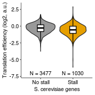

Analyze TE of yeast genes with or without stalls
================
rasi
30 July, 2019

-   [Load libraries](#load-libraries)
-   [Load genome and annotations](#load-genome-and-annotations)
-   [Load RQC stalls for joining with high TE genes](#load-rqc-stalls-for-joining-with-high-te-genes)
-   [Calculate TE as log2 ratio of RPF to RNA RPKM in Weinberg 2016](#calculate-te-as-log2-ratio-of-rpf-to-rna-rpkm-in-weinberg-2016)
-   [Look at high TE genes with potential RQC stalls](#look-at-high-te-genes-with-potential-rqc-stalls)
-   [Plot TE as a function of stall strength](#plot-te-as-a-function-of-stall-strength)
-   [Test if stall-containing genes have lower or higher TE](#test-if-stall-containing-genes-have-lower-or-higher-te)
-   [Avg TE of stall-containing and other genes](#avg-te-of-stall-containing-and-other-genes)
-   [Session Info](#session-info)
-   [Source data for Fig. 6C](#source-data-for-fig.-6c)

Load libraries
==============

``` r
library(topGO)
library(tidyverse)
library(rasilabRtemplates)
# disable scientific notation
options(scipen=3)
```

Load genome and annotations
===========================

``` r
annotations <- "/fh/fast/subramaniam_a/db/rasi/genomes/yeast/Saccharomyces_cerevisiae/sgd/S288C_reference_genome_R64-1-1_20110203/saccharomyces_cerevisiae_R64-1-1_20110208.gff" %>% 
  rtracklayer::readGFF() %>% 
  as_tibble()
```

Load RQC stalls for joining with high TE genes
==============================================

``` r
rqc_stalls <- read_tsv("../../rqc_stalls_in_yeast_orfs/tables/ngrams_annotated.tsv") %>% 
  select(id, pos, ngram_weight, ngram) %>%
  print()
```

    ## # A tibble: 1,251 x 4
    ##    id        pos ngram_weight ngram     
    ##    <chr>   <int>        <int> <chr>     
    ##  1 YHR131C   321           10 RRRRRRRRRR
    ##  2 YIL159W   768           10 PPPPPPPPPP
    ##  3 YNL271C  1238           10 PPPPPPPPPP
    ##  4 YOR019W   712           10 KKKKKKKKKK
    ##  5 YBL091C    40            9 KKKKNKKKKK
    ##  6 YDL146W   473            9 APPPPPPPPP
    ##  7 YDL173W   273            9 KEKKKKKKKK
    ##  8 YDR174W   227            9 KKKKKKKKDK
    ##  9 YDR334W   231            9 KKKRGRKKKK
    ## 10 YHL019C   174            9 KRKDKKKKRK
    ## # ... with 1,241 more rows

Calculate TE as log2 ratio of RPF to RNA RPKM in Weinberg 2016
==============================================================

``` r
te_data <- list.files("../annotations/", pattern = "RPKMs.txt.gz", full.names = T) %>% 
  enframe("sno", "file") %>% 
  mutate(sample = str_extract(file, "RPF|RiboZero")) %>% 
  mutate(data = map(file, . %>% read_tsv(col_names = F))) %>% 
  select(-sno, -file) %>% 
  unnest() %>% 
  magrittr::set_colnames(c("sampletype", "id", "rpkm")) %>% 
  spread(sampletype, rpkm) %>% 
  dplyr::rename(ribo = RPF, rna = RiboZero) %>% 
  mutate(te = log2(ribo / rna)) %>% 
  filter(!is.na(te) & ribo > 5 & rna > 5) %>%
  left_join(annotations %>% select(gene, ID, Note), by = c("id" = "ID")) %>%
  mutate(Note = as.character(Note)) %>% 
  print()
```

    ## # A tibble: 4,507 x 6
    ##    id        rna    ribo      te gene  Note                               
    ##    <chr>   <dbl>   <dbl>   <dbl> <chr> <chr>                              
    ##  1 YAL00…   37.8   18.1  -1.06   TFC3  Largest of six subunits of the RNA…
    ##  2 YAL00…   22.2    5.73 -1.95   VPS8  Membrane-associated protein that i…
    ##  3 YAL00… 4622.  7065.    0.612  EFB1  Translation elongation factor 1 be…
    ##  4 YAL00…  212.   209.   -0.0202 ERP2  Protein that forms a heterotrimeri…
    ##  5 YAL00…   50.0   95.6   0.935  FUN14 Mitochondrial protein of unknown f…
    ##  6 YAL00…   35.0   18.9  -0.888  SPO7  Putative regulatory subunit of Nem…
    ##  7 YAL01…   16.7   11.0  -0.593  MDM10 Subunit of both the ERMES complex …
    ##  8 YAL01…   17.4   10.5  -0.729  SWC3  Protein of unknown function, compo…
    ##  9 YAL01…  568.  1094.    0.945  CYS3  Cystathionine gamma-lyase, catalyz…
    ## 10 YAL01…   25.5   40.7   0.673  DEP1  Transcriptional modulator involved…
    ## # ... with 4,497 more rows

Look at high TE genes with potential RQC stalls
===============================================

``` r
te_stall_data <- te_data %>% 
  left_join(rqc_stalls, by = "id") %>% 
  arrange(desc(te)) %>% 
  select(te, gene, pos, ngram, ngram_weight, everything()) %>% 
  print()
```

    ## # A tibble: 4,507 x 9
    ##       te gene     pos ngram  ngram_weight id       rna   ribo Note        
    ##    <dbl> <chr>  <int> <chr>         <int> <chr>  <dbl>  <dbl> <chr>       
    ##  1  2.89 TMA23    157 KKKKK…            9 YMR2… 7.46e0   55.3 Nucleolar p…
    ##  2  1.75 MFA1      NA <NA>             NA YDR4… 4.74e2 1596.  Mating pher…
    ##  3  1.69 VPS24     NA <NA>             NA YKL0… 1.96e1   63.3 One of four…
    ##  4  1.65 NOP16    215 KRRLL…            7 YER0… 6.71e1  211.  Constituent…
    ##  5  1.65 TMA10     NA <NA>             NA YLR3… 4.35e1  136.  Protein of …
    ##  6  1.59 TIM17     NA <NA>             NA YJL1… 9.38e1  283.  Essential s…
    ##  7  1.56 <NA>      NA <NA>             NA YDL0… 7.31e1  216.  Tail-anchor…
    ##  8  1.52 RPS29A    NA <NA>             NA YLR3… 2.75e3 7897.  Protein com…
    ##  9  1.47 MFA2      NA <NA>             NA YNL1… 6.44e2 1781.  Mating pher…
    ## 10  1.47 CIS3      NA <NA>             NA YJL1… 6.93e2 1918.  Mannose-con…
    ## # ... with 4,497 more rows

Plot TE as a function of stall strength
=======================================

``` r
plot_data <- te_stall_data %>% 
  mutate(ngram_weight = as.factor(if_else(is.na(ngram_weight), 0, 1))) %>% 
  group_by(ngram_weight) %>% 
  mutate(`n` = paste0("N = ", dplyr::n())) %>% 
  ungroup() %>% 
  mutate(ngram_weight = fct_recode(ngram_weight, `No stall` = "0", `Stall` = "1"))
  
plot_data %>% 
  ggplot(aes(x = ngram_weight, y = te, fill = ngram_weight)) +
  geom_violin() +
  geom_boxplot(width = 0.2, fill = "white", color = "black", outlier.shape = NA) +
  labs(x = "S. cerevisiae genes", y = "Translation efficiency (log2, a.u.)") +
  geom_text(aes(x = ngram_weight, label = n),
            data = plot_data %>% group_by(ngram_weight) %>% slice(1),
            y = -7, size = 2.8) +
  scale_y_continuous(limits = c(-7.2, 3)) +
  scale_fill_manual(values = cbPalette, guide = "none") +
  NULL
```



``` r
ggsave("../figures/distribution_of_translation_efficiency_for_rqc_stall_containing_saccer_genes.pdf")
```

Test if stall-containing genes have lower or higher TE
======================================================

``` r
wilcox.test(te ~ ngram_weight, data = plot_data, alternative = "two.sided")
```

    ## 
    ##  Wilcoxon rank sum test with continuity correction
    ## 
    ## data:  te by ngram_weight
    ## W = 2111700, p-value < 2.2e-16
    ## alternative hypothesis: true location shift is not equal to 0

Avg TE of stall-containing and other genes
==========================================

``` r
plot_data %>% 
  group_by(ngram_weight) %>% 
  summarize(te = mean(te), n = dplyr::n()) %>% 
  knitr::kable()
```

| ngram\_weight |          te|     n|
|:--------------|-----------:|-----:|
| No stall      |  -0.3292908|  3477|
| Stall         |  -0.5665720|  1030|

Session Info
============

``` r
sessionInfo()
```

    ## R version 3.5.1 (2018-07-02)
    ## Platform: x86_64-pc-linux-gnu (64-bit)
    ## Running under: Ubuntu 18.04.1 LTS
    ## 
    ## Matrix products: default
    ## BLAS: /home/rasi/lib/R-3.5.1/lib/R/lib/libRblas.so
    ## LAPACK: /home/rasi/lib/R-3.5.1/lib/R/lib/libRlapack.so
    ## 
    ## locale:
    ##  [1] LC_CTYPE=en_US.UTF-8       LC_NUMERIC=C              
    ##  [3] LC_TIME=en_US.UTF-8        LC_COLLATE=en_US.UTF-8    
    ##  [5] LC_MONETARY=en_US.UTF-8    LC_MESSAGES=en_US.UTF-8   
    ##  [7] LC_PAPER=en_US.UTF-8       LC_NAME=C                 
    ##  [9] LC_ADDRESS=C               LC_TELEPHONE=C            
    ## [11] LC_MEASUREMENT=en_US.UTF-8 LC_IDENTIFICATION=C       
    ## 
    ## attached base packages:
    ## [1] stats4    parallel  stats     graphics  grDevices datasets  utils    
    ## [8] methods   base     
    ## 
    ## other attached packages:
    ##  [1] bindrcpp_0.2.2          rasilabRtemplates_0.1.0
    ##  [3] forcats_0.3.0           stringr_1.3.1          
    ##  [5] dplyr_0.7.6             purrr_0.2.5            
    ##  [7] readr_1.1.1             tidyr_0.8.1            
    ##  [9] tibble_1.4.2            ggplot2_3.0.0          
    ## [11] tidyverse_1.2.1         topGO_2.32.0           
    ## [13] SparseM_1.77            GO.db_3.6.0            
    ## [15] AnnotationDbi_1.42.1    IRanges_2.14.10        
    ## [17] S4Vectors_0.18.3        Biobase_2.40.0         
    ## [19] graph_1.58.0            BiocGenerics_0.26.0    
    ## 
    ## loaded via a namespace (and not attached):
    ##  [1] nlme_3.1-137                bitops_1.0-6               
    ##  [3] matrixStats_0.54.0          lubridate_1.7.4            
    ##  [5] bit64_0.9-7                 httr_1.3.1                 
    ##  [7] rprojroot_1.3-2             GenomeInfoDb_1.16.0        
    ##  [9] tools_3.5.1                 backports_1.1.2            
    ## [11] utf8_1.1.4                  R6_2.2.2                   
    ## [13] DBI_1.0.0                   lazyeval_0.2.1             
    ## [15] colorspace_1.3-2            withr_2.1.2                
    ## [17] tidyselect_0.2.4            bit_1.1-14                 
    ## [19] compiler_3.5.1              cli_1.0.0                  
    ## [21] rvest_0.3.2                 xml2_1.2.0                 
    ## [23] DelayedArray_0.6.2          labeling_0.3               
    ## [25] rtracklayer_1.40.3          scales_0.5.0               
    ## [27] digest_0.6.15               Rsamtools_1.32.2           
    ## [29] rmarkdown_1.10              XVector_0.20.0             
    ## [31] pkgconfig_2.0.1             htmltools_0.3.6            
    ## [33] highr_0.7                   rlang_0.2.1                
    ## [35] readxl_1.1.0                rstudioapi_0.7             
    ## [37] RSQLite_2.1.1               bindr_0.1.1                
    ## [39] jsonlite_1.5                BiocParallel_1.14.2        
    ## [41] RCurl_1.95-4.11             magrittr_1.5               
    ## [43] GenomeInfoDbData_1.1.0      Matrix_1.2-14              
    ## [45] fansi_0.2.3                 Rcpp_0.12.18               
    ## [47] munsell_0.5.0               stringi_1.2.4              
    ## [49] yaml_2.2.0                  SummarizedExperiment_1.10.1
    ## [51] zlibbioc_1.26.0             plyr_1.8.4                 
    ## [53] grid_3.5.1                  blob_1.1.1                 
    ## [55] crayon_1.3.4                lattice_0.20-35            
    ## [57] Biostrings_2.48.0           haven_1.1.2                
    ## [59] hms_0.4.2                   knitr_1.20                 
    ## [61] pillar_1.3.0                GenomicRanges_1.32.6       
    ## [63] XML_3.98-1.12               glue_1.3.0                 
    ## [65] evaluate_0.11               modelr_0.1.2               
    ## [67] cellranger_1.1.0            gtable_0.2.0               
    ## [69] assertthat_0.2.0            broom_0.5.0                
    ## [71] GenomicAlignments_1.16.0    memoise_1.1.0

Source data for Fig. 6C
=======================

``` r
plot_data %>% 
  rename(x = ngram_weight, y = te) %>% 
  select(gene, x, y) %>% 
  mutate_if(is.numeric, funs(round(., 3))) %>% 
  knitr::kable()
```

| gene    | x        |       y|
|:--------|:---------|-------:|
| TMA23   | Stall    |   2.891|
| MFA1    | No stall |   1.750|
| VPS24   | No stall |   1.694|
| NOP16   | Stall    |   1.650|
| TMA10   | No stall |   1.649|
| TIM17   | No stall |   1.595|
| NA      | No stall |   1.562|
| RPS29A  | No stall |   1.523|
| MFA2    | No stall |   1.469|
| CIS3    | No stall |   1.468|
| NA      | No stall |   1.467|
| SBA1    | No stall |   1.455|
| FYV7    | Stall    |   1.453|
| TOS6    | No stall |   1.412|
| GAR1    | Stall    |   1.365|
| CDC31   | No stall |   1.361|
| ASF1    | No stall |   1.351|
| IES2    | Stall    |   1.318|
| COX7    | No stall |   1.318|
| STF2    | No stall |   1.317|
| URM1    | No stall |   1.284|
| COX9    | No stall |   1.281|
| INH1    | No stall |   1.275|
| UBC4    | No stall |   1.272|
| FCY1    | No stall |   1.271|
| TOM7    | No stall |   1.236|
| COX12   | No stall |   1.225|
| HTB1    | Stall    |   1.224|
| WWM1    | No stall |   1.220|
| QCR8    | No stall |   1.217|
| SNF7    | No stall |   1.209|
| MAK16   | Stall    |   1.204|
| GRX1    | No stall |   1.203|
| SML1    | No stall |   1.201|
| CYC1    | No stall |   1.195|
| CWC15   | No stall |   1.179|
| COX14   | No stall |   1.172|
| UMP1    | No stall |   1.171|
| COX17   | No stall |   1.142|
| CGR1    | Stall    |   1.141|
| TSR2    | Stall    |   1.134|
| ATP20   | No stall |   1.131|
| SBP1    | No stall |   1.127|
| HYR1    | No stall |   1.122|
| SMD3    | No stall |   1.116|
| COX8    | No stall |   1.113|
| ACB1    | No stall |   1.111|
| TIP1    | No stall |   1.106|
| PXR1    | Stall    |   1.088|
| VPS21   | No stall |   1.086|
| ACP1    | No stall |   1.086|
| TPM1    | No stall |   1.069|
| NBP2    | No stall |   1.064|
| DAP1    | No stall |   1.063|
| ZEO1    | No stall |   1.060|
| TMA16   | Stall    |   1.054|
| NA      | No stall |   1.054|
| RPF1    | Stall    |   1.043|
| YMR31   | No stall |   1.041|
| CYB5    | No stall |   1.032|
| EGD2    | No stall |   1.028|
| HAM1    | No stall |   1.025|
| NPL3    | Stall    |   1.023|
| NA      | No stall |   1.022|
| RPB11   | No stall |   1.021|
| RPS28B  | No stall |   1.019|
| YPT52   | No stall |   1.017|
| SMD2    | No stall |   1.014|
| PET117  | Stall    |   1.011|
| SME1    | No stall |   1.005|
| RRP17   | Stall    |   1.001|
| SIS1    | Stall    |   1.000|
| UBC6    | No stall |   0.999|
| RPL39   | Stall    |   0.990|
| PBI2    | No stall |   0.989|
| VMA4    | No stall |   0.988|
| RPS27B  | No stall |   0.988|
| NA      | No stall |   0.988|
| HYP2    | No stall |   0.985|
| RBL2    | No stall |   0.982|
| CYC3    | No stall |   0.981|
| RPS27A  | No stall |   0.980|
| AHP1    | No stall |   0.979|
| NA      | No stall |   0.970|
| PRY1    | No stall |   0.967|
| MSA2    | No stall |   0.959|
| PST2    | No stall |   0.953|
| CHZ1    | Stall    |   0.952|
| TLG1    | No stall |   0.948|
| CYS3    | No stall |   0.945|
| MIC17   | No stall |   0.943|
| NA      | No stall |   0.943|
| RTS3    | No stall |   0.942|
| HSP12   | No stall |   0.942|
| RNQ1    | No stall |   0.941|
| NA      | No stall |   0.937|
| FUN14   | No stall |   0.935|
| TMA22   | Stall    |   0.934|
| NOP1    | No stall |   0.934|
| APA1    | No stall |   0.932|
| FIT2    | No stall |   0.926|
| PAI3    | No stall |   0.920|
| YKE2    | No stall |   0.916|
| YGP1    | No stall |   0.915|
| SNC2    | No stall |   0.915|
| DPM1    | No stall |   0.911|
| ATG8    | No stall |   0.906|
| NA      | Stall    |   0.905|
| NA      | No stall |   0.904|
| COX5A   | No stall |   0.901|
| NA      | No stall |   0.900|
| TOM6    | No stall |   0.899|
| MZM1    | No stall |   0.897|
| ABF2    | No stall |   0.890|
| SMT3    | No stall |   0.890|
| DEF1    | No stall |   0.886|
| SVS1    | No stall |   0.883|
| EGD1    | No stall |   0.882|
| FIT3    | No stall |   0.874|
| CMD1    | No stall |   0.873|
| SOD1    | No stall |   0.871|
| MMF1    | No stall |   0.865|
| RPL38   | No stall |   0.864|
| HTB2    | Stall    |   0.863|
| NA      | Stall    |   0.862|
| PFD1    | No stall |   0.862|
| LSM7    | No stall |   0.861|
| RPL22A  | No stall |   0.856|
| PMP3    | No stall |   0.854|
| MLC1    | No stall |   0.853|
| GLC8    | No stall |   0.850|
| AIM13   | No stall |   0.849|
| RNA15   | No stall |   0.847|
| APS1    | No stall |   0.847|
| CCW12   | No stall |   0.845|
| EMI5    | No stall |   0.845|
| PRY2    | No stall |   0.843|
| NA      | No stall |   0.842|
| TRM112  | No stall |   0.841|
| RTF1    | Stall    |   0.839|
| SDH4    | No stall |   0.839|
| GIS2    | No stall |   0.836|
| YAE1    | No stall |   0.836|
| SFA1    | No stall |   0.830|
| GRX2    | No stall |   0.830|
| RPL37A  | No stall |   0.829|
| MGR2    | No stall |   0.828|
| ORM2    | No stall |   0.827|
| ATO3    | No stall |   0.826|
| RPB9    | No stall |   0.826|
| UBC13   | No stall |   0.824|
| POR1    | No stall |   0.824|
| SCS2    | No stall |   0.824|
| YNK1    | No stall |   0.824|
| FAP7    | No stall |   0.822|
| CWP1    | No stall |   0.822|
| FYV4    | No stall |   0.819|
| TSA1    | No stall |   0.818|
| SAS10   | Stall    |   0.817|
| EDC2    | Stall    |   0.813|
| VMA21   | No stall |   0.811|
| LRP1    | Stall    |   0.809|
| CBF1    | No stall |   0.807|
| UBC1    | No stall |   0.803|
| RPS20   | No stall |   0.802|
| MSL1    | No stall |   0.801|
| TRX2    | No stall |   0.798|
| MMS2    | Stall    |   0.796|
| RTC3    | No stall |   0.795|
| TMA17   | No stall |   0.794|
| RMR1    | No stall |   0.794|
| COX6    | No stall |   0.793|
| SRX1    | No stall |   0.790|
| COX4    | No stall |   0.789|
| HHO1    | No stall |   0.789|
| HSP26   | No stall |   0.786|
| SMB1    | Stall    |   0.784|
| HCR1    | Stall    |   0.784|
| NCE103  | No stall |   0.783|
| TAF10   | No stall |   0.782|
| PET191  | No stall |   0.782|
| MDY2    | No stall |   0.779|
| CPR1    | No stall |   0.779|
| TRM10   | Stall    |   0.779|
| HGH1    | No stall |   0.779|
| SHG1    | No stall |   0.777|
| VPS51   | No stall |   0.775|
| MRPL28  | No stall |   0.774|
| RPL30   | No stall |   0.771|
| LYS1    | No stall |   0.767|
| NA      | No stall |   0.767|
| SPT4    | No stall |   0.764|
| COX13   | No stall |   0.763|
| QCR9    | No stall |   0.761|
| ACM1    | No stall |   0.760|
| ATP14   | No stall |   0.757|
| NA      | No stall |   0.755|
| ABP1    | Stall    |   0.754|
| SUB1    | Stall    |   0.748|
| CDC26   | No stall |   0.747|
| NA      | No stall |   0.743|
| ATP15   | No stall |   0.743|
| CYT2    | No stall |   0.741|
| GLO2    | No stall |   0.740|
| RDI1    | No stall |   0.739|
| CLC1    | No stall |   0.738|
| FPR1    | No stall |   0.737|
| PET9    | No stall |   0.734|
| ARF3    | No stall |   0.732|
| GPD1    | No stall |   0.732|
| SCW4    | No stall |   0.731|
| TRR1    | No stall |   0.729|
| NA      | No stall |   0.729|
| NKP2    | No stall |   0.727|
| MTC3    | No stall |   0.727|
| PET100  | Stall    |   0.727|
| NA      | No stall |   0.724|
| OPI10   | No stall |   0.724|
| YRB1    | No stall |   0.721|
| EMI1    | No stall |   0.721|
| NOP15   | No stall |   0.720|
| SOL1    | Stall    |   0.720|
| ARC15   | No stall |   0.720|
| ESF2    | No stall |   0.720|
| IDI1    | No stall |   0.719|
| OM45    | No stall |   0.718|
| SIM1    | No stall |   0.716|
| STM1    | No stall |   0.715|
| NA      | No stall |   0.714|
| RIB4    | No stall |   0.712|
| MRT4    | No stall |   0.711|
| RTT102  | No stall |   0.709|
| HOM2    | No stall |   0.707|
| CPR3    | No stall |   0.707|
| RPS22A  | No stall |   0.705|
| FPR3    | Stall    |   0.699|
| GOS1    | No stall |   0.697|
| ENT3    | Stall    |   0.697|
| GIM5    | No stall |   0.696|
| LSM4    | No stall |   0.695|
| RPL43A  | No stall |   0.694|
| PAA1    | No stall |   0.694|
| NA      | No stall |   0.694|
| RPS28A  | No stall |   0.691|
| ILV5    | No stall |   0.689|
| RPS22B  | No stall |   0.687|
| GRX3    | No stall |   0.687|
| RPS21B  | No stall |   0.686|
| RPL31B  | Stall    |   0.685|
| RPS10A  | No stall |   0.683|
| RPS25B  | Stall    |   0.683|
| PEX19   | No stall |   0.682|
| SRO9    | No stall |   0.680|
| PNC1    | No stall |   0.680|
| BUD23   | Stall    |   0.679|
| HMF1    | No stall |   0.678|
| YRA1    | Stall    |   0.678|
| YPT31   | No stall |   0.678|
| LIA1    | No stall |   0.676|
| NA      | No stall |   0.676|
| FMP21   | No stall |   0.674|
| YPT6    | No stall |   0.673|
| DEP1    | No stall |   0.673|
| VAM7    | No stall |   0.672|
| INO4    | Stall    |   0.672|
| RPL31A  | Stall    |   0.671|
| DYN2    | No stall |   0.671|
| NOP6    | Stall    |   0.671|
| RPC11   | No stall |   0.670|
| NA      | No stall |   0.669|
| STI1    | No stall |   0.669|
| TWF1    | Stall    |   0.669|
| RPB5    | No stall |   0.667|
| BUD20   | Stall    |   0.666|
| LOC1    | Stall    |   0.666|
| COF1    | No stall |   0.665|
| NA      | No stall |   0.664|
| SAP30   | Stall    |   0.664|
| YDJ1    | No stall |   0.664|
| NA      | No stall |   0.663|
| POL30   | No stall |   0.662|
| RPA14   | No stall |   0.661|
| RPL37B  | No stall |   0.661|
| MRPL25  | No stall |   0.661|
| RPB10   | No stall |   0.660|
| CSM1    | Stall    |   0.657|
| EBP2    | Stall    |   0.657|
| TAF7    | Stall    |   0.656|
| NA      | No stall |   0.656|
| MRP8    | No stall |   0.655|
| ZTA1    | No stall |   0.654|
| TOM22   | No stall |   0.654|
| SEC13   | No stall |   0.653|
| RSR1    | No stall |   0.651|
| DDI1    | No stall |   0.650|
| YAR1    | No stall |   0.650|
| RPC19   | No stall |   0.650|
| NA      | No stall |   0.649|
| RSM27   | Stall    |   0.648|
| NA      | No stall |   0.648|
| RRP14   | Stall    |   0.647|
| RPS15   | No stall |   0.646|
| FCF2    | Stall    |   0.645|
| MIC14   | No stall |   0.644|
| GCV3    | No stall |   0.643|
| HXK1    | No stall |   0.642|
| YPT7    | No stall |   0.637|
| CMC1    | No stall |   0.636|
| RPL32   | Stall    |   0.636|
| SHM2    | No stall |   0.634|
| IPP1    | No stall |   0.632|
| UTH1    | No stall |   0.630|
| BUG1    | Stall    |   0.630|
| YPI1    | Stall    |   0.629|
| RPS13   | No stall |   0.628|
| SEC4    | No stall |   0.626|
| BTT1    | No stall |   0.626|
| TVP18   | No stall |   0.626|
| ARC18   | No stall |   0.624|
| PDS1    | No stall |   0.622|
| ECM33   | No stall |   0.621|
| GSP1    | No stall |   0.618|
| NA      | No stall |   0.618|
| CAR1    | No stall |   0.617|
| SPO12   | Stall    |   0.616|
| OST2    | No stall |   0.615|
| SKP1    | No stall |   0.615|
| PST1    | No stall |   0.613|
| VTC1    | No stall |   0.613|
| NA      | No stall |   0.613|
| PGC1    | No stall |   0.612|
| EFB1    | No stall |   0.612|
| MRPL33  | No stall |   0.612|
| CRP1    | Stall    |   0.606|
| RPA34   | Stall    |   0.606|
| ARL1    | No stall |   0.603|
| JAC1    | No stall |   0.601|
| IST3    | No stall |   0.600|
| RPN11   | No stall |   0.600|
| TIM13   | No stall |   0.598|
| BNA1    | No stall |   0.597|
| TPS1    | No stall |   0.595|
| DIF1    | No stall |   0.595|
| RRS1    | Stall    |   0.593|
| MRPL37  | Stall    |   0.593|
| TEM1    | No stall |   0.593|
| BFR1    | Stall    |   0.592|
| SMX3    | No stall |   0.591|
| OYE2    | No stall |   0.591|
| NTC20   | No stall |   0.590|
| PRP11   | No stall |   0.590|
| RSM18   | No stall |   0.588|
| RPC37   | No stall |   0.588|
| EDC1    | No stall |   0.588|
| RFA2    | No stall |   0.586|
| DSK2    | No stall |   0.583|
| MRP2    | No stall |   0.582|
| NA      | No stall |   0.582|
| MAM33   | No stall |   0.580|
| RPN13   | No stall |   0.580|
| GIC2    | No stall |   0.580|
| YCP4    | No stall |   0.579|
| RRF1    | No stall |   0.577|
| RRP36   | Stall    |   0.577|
| HSP10   | No stall |   0.577|
| FSH2    | No stall |   0.576|
| TPM2    | No stall |   0.576|
| NA      | No stall |   0.574|
| NA      | Stall    |   0.574|
| TIF5    | No stall |   0.573|
| RLP24   | Stall    |   0.572|
| ICY2    | No stall |   0.572|
| IMP3    | No stall |   0.571|
| OM14    | No stall |   0.570|
| TAF14   | No stall |   0.570|
| RPF2    | No stall |   0.568|
| RIP1    | No stall |   0.567|
| HNT1    | No stall |   0.566|
| TIR3    | No stall |   0.566|
| PDX3    | No stall |   0.565|
| IMP2'   | Stall    |   0.564|
| LEO1    | Stall    |   0.564|
| MRPL39  | Stall    |   0.564|
| ATG3    | Stall    |   0.564|
| YPR1    | No stall |   0.564|
| THO1    | No stall |   0.563|
| NA      | No stall |   0.560|
| GPX2    | No stall |   0.558|
| SRP14   | Stall    |   0.558|
| SSS1    | No stall |   0.557|
| RPL33A  | No stall |   0.557|
| SFH1    | Stall    |   0.557|
| TPI1    | No stall |   0.556|
| SEC17   | No stall |   0.556|
| FMP37   | No stall |   0.556|
| BUR6    | No stall |   0.555|
| CDC73   | No stall |   0.555|
| NA      | No stall |   0.554|
| RNR4    | No stall |   0.554|
| OTU2    | Stall    |   0.554|
| PRP21   | Stall    |   0.553|
| ATP17   | No stall |   0.552|
| RRP15   | Stall    |   0.551|
| RPL17A  | No stall |   0.550|
| GLN1    | Stall    |   0.550|
| MRPS16  | No stall |   0.549|
| RHO1    | Stall    |   0.548|
| MXR1    | No stall |   0.546|
| ADK1    | No stall |   0.544|
| CAJ1    | No stall |   0.543|
| SNN1    | Stall    |   0.543|
| NHP2    | No stall |   0.543|
| HIT1    | No stall |   0.541|
| NTF2    | No stall |   0.539|
| GRX5    | No stall |   0.538|
| ATP16   | No stall |   0.537|
| CIA1    | No stall |   0.535|
| PAC10   | No stall |   0.534|
| CCS1    | No stall |   0.531|
| NA      | No stall |   0.530|
| CDC19   | No stall |   0.530|
| RAD23   | No stall |   0.529|
| RPL6A   | Stall    |   0.528|
| RPS25A  | Stall    |   0.528|
| CHA1    | No stall |   0.527|
| NSA2    | Stall    |   0.527|
| ADH1    | No stall |   0.526|
| NA      | No stall |   0.526|
| NA      | No stall |   0.525|
| CSE4    | Stall    |   0.525|
| DHH1    | No stall |   0.524|
| RCN2    | No stall |   0.524|
| NA      | No stall |   0.524|
| URA1    | No stall |   0.524|
| FPR4    | Stall    |   0.524|
| GRX7    | No stall |   0.523|
| FMC1    | No stall |   0.521|
| CKS1    | No stall |   0.521|
| HAP2    | No stall |   0.521|
| VTI1    | No stall |   0.520|
| NA      | No stall |   0.520|
| SRL1    | No stall |   0.518|
| SCM4    | No stall |   0.516|
| ISU1    | No stall |   0.515|
| ADO1    | No stall |   0.514|
| BCY1    | No stall |   0.514|
| HAP3    | No stall |   0.514|
| RPS9B   | No stall |   0.513|
| TOM40   | No stall |   0.512|
| RRT14   | Stall    |   0.512|
| TRX1    | No stall |   0.511|
| ENT1    | Stall    |   0.510|
| YPT35   | No stall |   0.509|
| IES4    | No stall |   0.509|
| SEC65   | No stall |   0.509|
| ALD6    | No stall |   0.506|
| DUT1    | No stall |   0.506|
| NA      | No stall |   0.505|
| CRH1    | No stall |   0.504|
| TOM20   | No stall |   0.500|
| IES6    | No stall |   0.500|
| NCE102  | No stall |   0.499|
| NA      | No stall |   0.498|
| MRPL24  | Stall    |   0.498|
| DCS1    | No stall |   0.497|
| PHO13   | No stall |   0.497|
| RPP2A   | No stall |   0.497|
| NA      | Stall    |   0.496|
| CPR5    | No stall |   0.493|
| LEA1    | No stall |   0.493|
| GAL83   | No stall |   0.493|
| CAR2    | No stall |   0.493|
| GTS1    | No stall |   0.493|
| MED11   | No stall |   0.493|
| UME1    | No stall |   0.492|
| SGN1    | No stall |   0.492|
| PRP38   | No stall |   0.491|
| LTP1    | No stall |   0.491|
| PRE8    | No stall |   0.491|
| ROX1    | Stall    |   0.490|
| ERV14   | No stall |   0.490|
| RPL33B  | No stall |   0.490|
| UGP1    | No stall |   0.487|
| PUB1    | No stall |   0.487|
| SAM2    | No stall |   0.487|
| CWC21   | No stall |   0.486|
| RPL5    | No stall |   0.485|
| AGA2    | No stall |   0.484|
| RPL27B  | Stall    |   0.484|
| RHO3    | No stall |   0.484|
| SNU13   | No stall |   0.483|
| RHR2    | No stall |   0.482|
| ERG20   | No stall |   0.481|
| NA      | No stall |   0.480|
| RPS5    | No stall |   0.479|
| RPT2    | Stall    |   0.479|
| APC9    | No stall |   0.478|
| RPL27A  | Stall    |   0.478|
| PRE3    | No stall |   0.477|
| MDH1    | No stall |   0.476|
| RTT105  | Stall    |   0.476|
| HIS3    | No stall |   0.474|
| NOP8    | Stall    |   0.474|
| LIP1    | No stall |   0.473|
| NA      | No stall |   0.472|
| FAF1    | Stall    |   0.472|
| MRPL44  | No stall |   0.471|
| RPP2B   | No stall |   0.471|
| ARG1    | No stall |   0.471|
| NRM1    | No stall |   0.471|
| SPC29   | No stall |   0.469|
| NSR1    | No stall |   0.469|
| NA      | No stall |   0.469|
| RPL17B  | No stall |   0.468|
| COA4    | No stall |   0.468|
| CAF20   | No stall |   0.467|
| SRP21   | Stall    |   0.466|
| RUB1    | No stall |   0.465|
| SAM1    | No stall |   0.464|
| GND1    | No stall |   0.464|
| LSM8    | No stall |   0.463|
| TRS23   | No stall |   0.463|
| LSB1    | No stall |   0.463|
| SOD2    | No stall |   0.463|
| NPC2    | No stall |   0.463|
| SNA3    | No stall |   0.462|
| RPS21A  | No stall |   0.462|
| URE2    | No stall |   0.462|
| LSM12   | No stall |   0.461|
| ADK2    | No stall |   0.461|
| TRP2    | No stall |   0.461|
| GRX8    | No stall |   0.461|
| MRPS17  | No stall |   0.460|
| TVP15   | No stall |   0.459|
| NA      | Stall    |   0.459|
| VMA3    | No stall |   0.459|
| SEC11   | No stall |   0.459|
| RPB8    | No stall |   0.457|
| RKI1    | No stall |   0.456|
| TIF3    | No stall |   0.456|
| PRE7    | No stall |   0.455|
| FAR7    | No stall |   0.455|
| NA      | No stall |   0.455|
| BMH1    | No stall |   0.455|
| HRT1    | Stall    |   0.454|
| ZUO1    | Stall    |   0.453|
| ATP23   | No stall |   0.453|
| SSP120  | No stall |   0.450|
| SWS2    | No stall |   0.450|
| RPC17   | No stall |   0.449|
| MTC1    | No stall |   0.448|
| NA      | No stall |   0.447|
| GON7    | No stall |   0.447|
| TSR3    | No stall |   0.447|
| MAP1    | Stall    |   0.445|
| SEC72   | No stall |   0.445|
| NA      | No stall |   0.445|
| SYF2    | Stall    |   0.445|
| RPP1A   | No stall |   0.444|
| SUI2    | No stall |   0.444|
| YJU2    | No stall |   0.443|
| HTZ1    | No stall |   0.442|
| RRP1    | No stall |   0.441|
| YPT1    | No stall |   0.441|
| MRPL27  | No stall |   0.440|
| RPS2    | No stall |   0.440|
| GLR1    | No stall |   0.439|
| RPL26B  | No stall |   0.439|
| PFY1    | No stall |   0.439|
| CTF8    | No stall |   0.438|
| PRE6    | No stall |   0.438|
| POB3    | No stall |   0.438|
| TYE7    | Stall    |   0.438|
| RPL16B  | No stall |   0.437|
| APS3    | No stall |   0.436|
| RDL1    | No stall |   0.434|
| HLJ1    | No stall |   0.434|
| RPL10   | No stall |   0.432|
| SEC53   | No stall |   0.431|
| BCD1    | No stall |   0.431|
| SPL2    | No stall |   0.431|
| PMI40   | No stall |   0.431|
| FPR2    | No stall |   0.429|
| LSP1    | No stall |   0.429|
| PAM16   | No stall |   0.428|
| SSC1    | No stall |   0.428|
| HIS6    | No stall |   0.428|
| MXR2    | No stall |   0.427|
| ECM15   | No stall |   0.427|
| MRPL32  | Stall    |   0.426|
| SUI1    | No stall |   0.425|
| ENT5    | Stall    |   0.425|
| LSM2    | No stall |   0.425|
| RPS26B  | No stall |   0.425|
| CDC28   | No stall |   0.425|
| ATP7    | No stall |   0.423|
| HOR2    | No stall |   0.422|
| IST1    | Stall    |   0.422|
| RGI1    | No stall |   0.422|
| KRI1    | Stall    |   0.422|
| UTP11   | Stall    |   0.421|
| RPB3    | No stall |   0.419|
| NCE101  | No stall |   0.419|
| NA      | No stall |   0.419|
| PDR16   | No stall |   0.418|
| TOA1    | No stall |   0.418|
| NHP10   | Stall    |   0.418|
| PKR1    | No stall |   0.416|
| TAL1    | No stall |   0.416|
| DDP1    | No stall |   0.416|
| VPS55   | No stall |   0.415|
| COX23   | No stall |   0.414|
| YAH1    | No stall |   0.414|
| AIM19   | No stall |   0.413|
| DST1    | No stall |   0.413|
| HIS7    | No stall |   0.412|
| FRS2    | No stall |   0.412|
| LSC1    | No stall |   0.411|
| DBP2    | No stall |   0.411|
| PBP4    | No stall |   0.411|
| UBC9    | No stall |   0.410|
| GCD11   | No stall |   0.410|
| ACN9    | No stall |   0.409|
| AIM17   | No stall |   0.409|
| SAH1    | No stall |   0.406|
| IDH2    | No stall |   0.406|
| DPS1    | No stall |   0.405|
| TAF13   | No stall |   0.405|
| JJJ3    | No stall |   0.404|
| MOB1    | No stall |   0.403|
| RDL2    | No stall |   0.403|
| GPM1    | No stall |   0.403|
| RPL25   | No stall |   0.403|
| ADE1    | No stall |   0.403|
| RPL28   | No stall |   0.402|
| MDH3    | No stall |   0.401|
| ADH6    | No stall |   0.401|
| IES5    | No stall |   0.400|
| LOT6    | No stall |   0.399|
| CBP6    | No stall |   0.398|
| BNI5    | No stall |   0.397|
| PAM17   | No stall |   0.396|
| RNR2    | No stall |   0.395|
| NA      | No stall |   0.394|
| PPX1    | No stall |   0.394|
| SRP40   | No stall |   0.394|
| MRP49   | No stall |   0.393|
| ROT1    | No stall |   0.392|
| AIM2    | No stall |   0.391|
| NA      | Stall    |   0.391|
| STE18   | No stall |   0.391|
| DSE2    | No stall |   0.390|
| PGK1    | No stall |   0.390|
| IMP4    | No stall |   0.389|
| RET3    | No stall |   0.389|
| TIF34   | No stall |   0.388|
| ARO4    | No stall |   0.388|
| GRX6    | No stall |   0.386|
| PRE4    | No stall |   0.383|
| APT1    | No stall |   0.383|
| PUP1    | No stall |   0.383|
| ABP140  | Stall    |   0.382|
| NA      | No stall |   0.381|
| CDC36   | No stall |   0.381|
| GLY1    | No stall |   0.380|
| RRN10   | No stall |   0.379|
| IXR1    | Stall    |   0.379|
| POM33   | No stall |   0.379|
| PBP2    | No stall |   0.379|
| IDH1    | No stall |   0.379|
| CSE2    | No stall |   0.378|
| RVB2    | No stall |   0.378|
| ATX1    | No stall |   0.377|
| DRE2    | Stall    |   0.377|
| MCR1    | No stall |   0.377|
| AGA1    | No stall |   0.376|
| GIM3    | No stall |   0.376|
| POA1    | No stall |   0.375|
| SED5    | No stall |   0.375|
| MRPS8   | No stall |   0.375|
| ADD37   | Stall    |   0.374|
| QCR7    | No stall |   0.373|
| NA      | Stall    |   0.373|
| PSA1    | No stall |   0.372|
| HSP42   | No stall |   0.371|
| RDS3    | No stall |   0.371|
| GUK1    | No stall |   0.369|
| FSH1    | No stall |   0.369|
| NFU1    | No stall |   0.369|
| NA      | No stall |   0.368|
| RFA3    | No stall |   0.368|
| SAC6    | No stall |   0.368|
| RNY1    | No stall |   0.368|
| EAP1    | Stall    |   0.368|
| TIM22   | No stall |   0.367|
| FUR1    | No stall |   0.367|
| RFC4    | No stall |   0.367|
| CPR6    | No stall |   0.367|
| ALB1    | Stall    |   0.366|
| RIB1    | No stall |   0.366|
| MRPL38  | No stall |   0.365|
| RPL16A  | No stall |   0.365|
| CDC42   | No stall |   0.364|
| AIM41   | No stall |   0.364|
| BDH2    | No stall |   0.363|
| SSE1    | No stall |   0.363|
| MRPL40  | No stall |   0.363|
| MGE1    | No stall |   0.362|
| PSH1    | No stall |   0.362|
| MRPL8   | No stall |   0.362|
| TRP5    | No stall |   0.361|
| HSP31   | No stall |   0.361|
| UBC7    | No stall |   0.360|
| NIP7    | No stall |   0.359|
| PEP12   | No stall |   0.359|
| YHB1    | No stall |   0.358|
| REE1    | No stall |   0.357|
| YKT6    | No stall |   0.356|
| RPS3    | No stall |   0.356|
| RPA12   | No stall |   0.356|
| MAK3    | No stall |   0.354|
| ELC1    | No stall |   0.354|
| RAD10   | No stall |   0.354|
| RPS0A   | No stall |   0.353|
| ACT1    | No stall |   0.353|
| ETR1    | No stall |   0.353|
| QRI1    | No stall |   0.352|
| ZIM17   | No stall |   0.352|
| SMD1    | No stall |   0.350|
| SSO2    | Stall    |   0.349|
| RPS7A   | No stall |   0.348|
| BLI1    | No stall |   0.348|
| SWM1    | No stall |   0.348|
| SPE3    | No stall |   0.347|
| ATP3    | No stall |   0.346|
| CDC21   | No stall |   0.346|
| NAT3    | No stall |   0.344|
| RRP45   | No stall |   0.343|
| CDC37   | No stall |   0.343|
| GSP2    | No stall |   0.343|
| ATP5    | No stall |   0.342|
| TRM7    | No stall |   0.342|
| PRM5    | No stall |   0.341|
| AIM7    | No stall |   0.341|
| YRA2    | No stall |   0.340|
| ERG28   | No stall |   0.340|
| RPL3    | No stall |   0.339|
| DTD1    | No stall |   0.339|
| SDH2    | No stall |   0.337|
| PRO2    | No stall |   0.337|
| ORM1    | No stall |   0.337|
| ACS2    | No stall |   0.336|
| MRP21   | No stall |   0.336|
| MFT1    | Stall    |   0.336|
| NA      | No stall |   0.335|
| ERG6    | No stall |   0.335|
| PRY3    | No stall |   0.331|
| GOR1    | No stall |   0.330|
| MPP6    | Stall    |   0.330|
| RTS2    | Stall    |   0.330|
| MAK11   | Stall    |   0.329|
| KRE9    | No stall |   0.328|
| GRE3    | No stall |   0.328|
| ISU2    | No stall |   0.328|
| QRI5    | Stall    |   0.328|
| NA      | Stall    |   0.328|
| MLC2    | No stall |   0.327|
| ERG1    | No stall |   0.326|
| NOP12   | Stall    |   0.325|
| OXR1    | No stall |   0.325|
| GPI11   | Stall    |   0.325|
| SAR1    | No stall |   0.325|
| SEC14   | No stall |   0.325|
| RPE1    | No stall |   0.324|
| SCM3    | Stall    |   0.324|
| LAT1    | No stall |   0.323|
| TIF6    | No stall |   0.323|
| DAK1    | No stall |   0.322|
| NA      | No stall |   0.322|
| NOP58   | Stall    |   0.322|
| NA      | No stall |   0.321|
| NOP13   | Stall    |   0.320|
| THR4    | No stall |   0.319|
| ALO1    | Stall    |   0.319|
| BCP1    | Stall    |   0.318|
| PRS2    | No stall |   0.318|
| PDX1    | No stall |   0.317|
| CNB1    | No stall |   0.317|
| RPP1B   | No stall |   0.316|
| PUS4    | Stall    |   0.314|
| HXT1    | No stall |   0.314|
| RFA1    | No stall |   0.314|
| AHA1    | No stall |   0.313|
| MET28   | Stall    |   0.313|
| VPS60   | No stall |   0.313|
| RTR1    | No stall |   0.313|
| ILM1    | No stall |   0.312|
| SLX9    | Stall    |   0.312|
| GET1    | No stall |   0.312|
| VPS62   | No stall |   0.310|
| BFR2    | No stall |   0.310|
| EMC2    | No stall |   0.309|
| TIM12   | No stall |   0.309|
| TIF35   | No stall |   0.308|
| SDH3    | No stall |   0.308|
| CAB3    | No stall |   0.308|
| MVD1    | No stall |   0.308|
| HOM6    | No stall |   0.307|
| IOC4    | Stall    |   0.307|
| SCD6    | No stall |   0.307|
| SHS1    | Stall    |   0.307|
| FMP52   | No stall |   0.305|
| TUM1    | No stall |   0.304|
| REI1    | Stall    |   0.303|
| SES1    | No stall |   0.303|
| CIC1    | Stall    |   0.302|
| HSP60   | No stall |   0.301|
| FIS1    | No stall |   0.300|
| DPB4    | No stall |   0.300|
| RSM24   | Stall    |   0.300|
| RPN7    | No stall |   0.298|
| MRP20   | No stall |   0.297|
| EMC4    | No stall |   0.297|
| ERG13   | No stall |   0.297|
| FBA1    | No stall |   0.296|
| RFS1    | No stall |   0.296|
| NA      | No stall |   0.296|
| ERG10   | No stall |   0.295|
| GRE2    | No stall |   0.293|
| CDC3    | No stall |   0.293|
| NHP6A   | Stall    |   0.291|
| HEM13   | No stall |   0.291|
| RPA43   | No stall |   0.291|
| NA      | No stall |   0.291|
| SNA4    | No stall |   0.291|
| COA1    | No stall |   0.291|
| BET1    | No stall |   0.291|
| AIM31   | No stall |   0.290|
| ARD1    | No stall |   0.289|
| IZH1    | No stall |   0.289|
| BGL2    | No stall |   0.289|
| NRG1    | No stall |   0.289|
| FAR3    | No stall |   0.289|
| CDC12   | No stall |   0.289|
| HSP104  | No stall |   0.288|
| SOL4    | No stall |   0.288|
| PRE2    | No stall |   0.287|
| ICY1    | No stall |   0.287|
| SSU72   | No stall |   0.286|
| SRP1    | No stall |   0.285|
| ERG9    | No stall |   0.285|
| SCW11   | No stall |   0.284|
| YIP1    | No stall |   0.284|
| MET22   | No stall |   0.284|
| KGD2    | No stall |   0.284|
| CDC33   | No stall |   0.283|
| SUP35   | No stall |   0.283|
| EMP46   | No stall |   0.283|
| MRPL49  | Stall    |   0.282|
| ECM14   | No stall |   0.282|
| FSH3    | No stall |   0.282|
| ARG4    | No stall |   0.281|
| CNS1    | No stall |   0.280|
| OST4    | No stall |   0.280|
| BSD2    | No stall |   0.277|
| ZPR1    | No stall |   0.277|
| MNP1    | No stall |   0.277|
| NA      | Stall    |   0.276|
| ARO8    | No stall |   0.276|
| NRG2    | Stall    |   0.275|
| TFG2    | Stall    |   0.274|
| PDC1    | No stall |   0.274|
| VPS1    | No stall |   0.272|
| STR3    | No stall |   0.271|
| FCF1    | No stall |   0.270|
| CAM1    | No stall |   0.270|
| YIF1    | No stall |   0.270|
| FMP43   | No stall |   0.270|
| HXK2    | No stall |   0.270|
| ADE12   | No stall |   0.270|
| NA      | No stall |   0.269|
| EMG1    | No stall |   0.269|
| POP6    | No stall |   0.268|
| IWR1    | No stall |   0.267|
| AIM38   | No stall |   0.266|
| ERG25   | No stall |   0.266|
| PHS1    | No stall |   0.265|
| CDC10   | No stall |   0.265|
| VOA1    | No stall |   0.265|
| SPT3    | No stall |   0.265|
| NA      | No stall |   0.264|
| POP7    | No stall |   0.263|
| NA      | No stall |   0.263|
| XPT1    | No stall |   0.263|
| NA      | No stall |   0.263|
| RBG2    | No stall |   0.262|
| ERD2    | No stall |   0.262|
| RVB1    | No stall |   0.262|
| LSM6    | No stall |   0.261|
| HIS5    | No stall |   0.260|
| RTN1    | No stall |   0.260|
| DOT5    | No stall |   0.260|
| TIF11   | Stall    |   0.259|
| MRPL16  | No stall |   0.259|
| HEM2    | No stall |   0.258|
| GAS5    | Stall    |   0.258|
| MCM1    | No stall |   0.258|
| ARA1    | No stall |   0.257|
| UPS1    | No stall |   0.257|
| SQT1    | No stall |   0.256|
| IRC6    | No stall |   0.256|
| NA      | No stall |   0.256|
| ACF4    | No stall |   0.256|
| ARC19   | No stall |   0.255|
| ADI1    | No stall |   0.255|
| ARC1    | No stall |   0.255|
| SPI1    | No stall |   0.254|
| UTP23   | Stall    |   0.254|
| NUP42   | No stall |   0.254|
| SFH5    | No stall |   0.254|
| LSM5    | No stall |   0.253|
| SDS24   | No stall |   0.251|
| RFM1    | Stall    |   0.251|
| RBG1    | No stall |   0.251|
| GCS1    | No stall |   0.250|
| FIP1    | Stall    |   0.250|
| RIO2    | Stall    |   0.248|
| PRE9    | No stall |   0.248|
| FMP10   | No stall |   0.247|
| YPT32   | No stall |   0.247|
| HAS1    | No stall |   0.246|
| PRE1    | No stall |   0.245|
| SDS22   | No stall |   0.245|
| EMI2    | No stall |   0.243|
| SKI8    | No stall |   0.243|
| SPC42   | Stall    |   0.243|
| ENP1    | No stall |   0.242|
| GDH1    | No stall |   0.242|
| GPI19   | No stall |   0.242|
| NA      | No stall |   0.241|
| BLS1    | No stall |   0.241|
| KRS1    | No stall |   0.240|
| YCH1    | No stall |   0.240|
| THR1    | No stall |   0.240|
| RPB4    | Stall    |   0.240|
| NPA3    | Stall    |   0.240|
| NA      | No stall |   0.240|
| VMA22   | No stall |   0.239|
| CAP1    | No stall |   0.239|
| RSA3    | Stall    |   0.238|
| NA      | No stall |   0.238|
| NA      | No stall |   0.237|
| IRC24   | No stall |   0.237|
| NA      | No stall |   0.237|
| SRB7    | No stall |   0.236|
| NA      | No stall |   0.235|
| NA      | Stall    |   0.234|
| MRPL4   | No stall |   0.234|
| RLP7    | Stall    |   0.233|
| YLH47   | No stall |   0.233|
| NA      | No stall |   0.232|
| AOS1    | No stall |   0.232|
| ALG13   | No stall |   0.231|
| DBP3    | Stall    |   0.231|
| GGC1    | No stall |   0.231|
| PAB1    | No stall |   0.231|
| MGR1    | No stall |   0.231|
| RPO26   | No stall |   0.231|
| PGI1    | No stall |   0.230|
| RTT103  | No stall |   0.230|
| NA      | No stall |   0.230|
| MRPL11  | No stall |   0.229|
| RPN6    | No stall |   0.229|
| NUP53   | No stall |   0.228|
| GIM4    | No stall |   0.228|
| PLP1    | No stall |   0.226|
| DET1    | No stall |   0.226|
| OLA1    | No stall |   0.225|
| URA6    | No stall |   0.225|
| YTH1    | No stall |   0.224|
| NA      | No stall |   0.224|
| NA      | No stall |   0.224|
| YHP1    | Stall    |   0.223|
| ECO1    | No stall |   0.223|
| ATP1    | No stall |   0.222|
| DED81   | No stall |   0.221|
| HPT1    | No stall |   0.221|
| NUP49   | No stall |   0.220|
| TLG2    | No stall |   0.220|
| SEC9    | Stall    |   0.219|
| ERV29   | No stall |   0.219|
| TMA19   | No stall |   0.219|
| MOT2    | Stall    |   0.218|
| FAA1    | No stall |   0.217|
| TIS11   | No stall |   0.216|
| SEC22   | No stall |   0.216|
| TYR1    | No stall |   0.215|
| PEX14   | No stall |   0.215|
| PWP1    | Stall    |   0.215|
| RPC25   | No stall |   0.214|
| RHO4    | No stall |   0.214|
| CHO1    | No stall |   0.214|
| YTM1    | Stall    |   0.214|
| RVS161  | No stall |   0.213|
| GGA1    | No stall |   0.213|
| DED1    | No stall |   0.212|
| CDC34   | No stall |   0.211|
| SHP1    | No stall |   0.211|
| SPN1    | Stall    |   0.211|
| GCD14   | No stall |   0.210|
| YHI9    | No stall |   0.209|
| GET4    | No stall |   0.209|
| UBP6    | Stall    |   0.208|
| USE1    | No stall |   0.208|
| TRM8    | Stall    |   0.208|
| MAD2    | No stall |   0.208|
| GPM3    | No stall |   0.207|
| MRPL51  | No stall |   0.207|
| SRV2    | Stall    |   0.206|
| PUP3    | No stall |   0.206|
| MSO1    | No stall |   0.206|
| AIM43   | No stall |   0.206|
| SCW10   | No stall |   0.206|
| VPS25   | No stall |   0.205|
| RPT4    | No stall |   0.205|
| LYS9    | No stall |   0.204|
| CDC11   | Stall    |   0.203|
| RPT1    | No stall |   0.202|
| RPN12   | No stall |   0.202|
| LTV1    | Stall    |   0.201|
| NA      | Stall    |   0.201|
| HIP1    | No stall |   0.200|
| VMA7    | No stall |   0.200|
| GLO1    | No stall |   0.198|
| RRP46   | No stall |   0.198|
| SLM4    | No stall |   0.198|
| NOP53   | Stall    |   0.198|
| MRPS28  | Stall    |   0.198|
| ARC35   | No stall |   0.198|
| RSA4    | No stall |   0.197|
| PEF1    | No stall |   0.196|
| PNO1    | No stall |   0.195|
| FRA2    | No stall |   0.194|
| NA      | No stall |   0.194|
| GLC7    | No stall |   0.193|
| RER1    | No stall |   0.193|
| NA      | No stall |   0.193|
| PRS3    | No stall |   0.192|
| LPD1    | No stall |   0.192|
| PEX11   | No stall |   0.192|
| NA      | No stall |   0.192|
| NA      | No stall |   0.191|
| MPD1    | No stall |   0.191|
| THP2    | No stall |   0.191|
| NA      | Stall    |   0.191|
| ARO7    | No stall |   0.191|
| ATP4    | No stall |   0.190|
| TVP23   | No stall |   0.190|
| BNA6    | No stall |   0.190|
| HRP1    | No stall |   0.189|
| MRPS5   | No stall |   0.188|
| MIG2    | No stall |   0.188|
| RPN10   | No stall |   0.187|
| NA      | Stall    |   0.187|
| PRX1    | No stall |   0.186|
| EMP24   | No stall |   0.186|
| PSP2    | No stall |   0.185|
| ADE17   | No stall |   0.185|
| CTK3    | No stall |   0.184|
| PRE10   | No stall |   0.184|
| BNS1    | No stall |   0.184|
| WRS1    | No stall |   0.184|
| PGM1    | No stall |   0.183|
| NUG1    | Stall    |   0.183|
| RSM25   | No stall |   0.183|
| IKI1    | No stall |   0.183|
| HXT2    | No stall |   0.182|
| HRB1    | No stall |   0.182|
| NA      | Stall    |   0.182|
| MET6    | No stall |   0.182|
| NA      | No stall |   0.181|
| NBA1    | Stall    |   0.181|
| ASP1    | No stall |   0.181|
| PGA2    | Stall    |   0.181|
| BUD22   | Stall    |   0.181|
| SCL1    | No stall |   0.181|
| PHO85   | No stall |   0.180|
| AYR1    | No stall |   0.179|
| MRH1    | Stall    |   0.179|
| CKI1    | No stall |   0.179|
| AST1    | No stall |   0.179|
| NA      | No stall |   0.178|
| PIL1    | No stall |   0.176|
| NA      | No stall |   0.175|
| MBA1    | No stall |   0.175|
| YRB2    | No stall |   0.174|
| PSY4    | Stall    |   0.174|
| NA      | No stall |   0.174|
| OAC1    | No stall |   0.173|
| GTT1    | No stall |   0.173|
| TAE1    | No stall |   0.172|
| RRP3    | Stall    |   0.172|
| MRPL1   | No stall |   0.172|
| LAP4    | No stall |   0.172|
| MRPL31  | Stall    |   0.171|
| YIP3    | No stall |   0.171|
| FYV6    | Stall    |   0.170|
| ACH1    | No stall |   0.170|
| COQ3    | No stall |   0.170|
| KRR1    | Stall    |   0.169|
| MIR1    | No stall |   0.169|
| UPF3    | Stall    |   0.169|
| AST2    | No stall |   0.168|
| NA      | No stall |   0.167|
| FES1    | No stall |   0.167|
| CSM3    | No stall |   0.166|
| NA      | No stall |   0.166|
| BNA2    | No stall |   0.164|
| IRC22   | No stall |   0.164|
| MET8    | No stall |   0.163|
| RAD6    | Stall    |   0.163|
| SWC5    | No stall |   0.162|
| MIM1    | No stall |   0.160|
| RPN5    | No stall |   0.160|
| IMG2    | No stall |   0.160|
| NA      | No stall |   0.160|
| NA      | No stall |   0.160|
| CDC48   | No stall |   0.160|
| GLO3    | No stall |   0.160|
| HOT13   | No stall |   0.159|
| NPL6    | Stall    |   0.159|
| TSC13   | Stall    |   0.158|
| UBX7    | No stall |   0.158|
| UBS1    | No stall |   0.157|
| DLD3    | No stall |   0.157|
| PLB1    | No stall |   0.156|
| ARO3    | Stall    |   0.156|
| HEM15   | No stall |   0.155|
| GDI1    | No stall |   0.154|
| NUP60   | No stall |   0.154|
| TOS1    | No stall |   0.154|
| NA      | No stall |   0.153|
| CYS4    | No stall |   0.153|
| SEC66   | No stall |   0.152|
| RPC34   | No stall |   0.151|
| KAR4    | No stall |   0.151|
| NYV1    | No stall |   0.151|
| YSA1    | No stall |   0.150|
| MRP17   | No stall |   0.150|
| ERG5    | No stall |   0.149|
| ROX3    | No stall |   0.149|
| SCO2    | Stall    |   0.149|
| SEC28   | No stall |   0.148|
| SEC12   | No stall |   0.148|
| OPI3    | No stall |   0.148|
| MRL1    | No stall |   0.147|
| END3    | Stall    |   0.147|
| ISA1    | Stall    |   0.147|
| TYW3    | Stall    |   0.147|
| NA      | No stall |   0.146|
| SDS23   | No stall |   0.146|
| LRO1    | Stall    |   0.146|
| MPM1    | No stall |   0.146|
| ATG33   | No stall |   0.145|
| IZH4    | No stall |   0.145|
| TRM9    | No stall |   0.145|
| ATG27   | No stall |   0.144|
| SHE2    | No stall |   0.144|
| VMA2    | No stall |   0.143|
| CPR7    | No stall |   0.143|
| CTS1    | No stall |   0.142|
| SNT309  | Stall    |   0.141|
| ECM19   | Stall    |   0.141|
| NA      | No stall |   0.141|
| PUP2    | No stall |   0.141|
| PCT1    | Stall    |   0.140|
| SSZ1    | No stall |   0.140|
| GET3    | No stall |   0.140|
| PFK1    | No stall |   0.139|
| YIM1    | No stall |   0.139|
| PRT1    | Stall    |   0.139|
| BUD32   | No stall |   0.139|
| MED6    | No stall |   0.139|
| ADH3    | No stall |   0.138|
| UBC8    | No stall |   0.137|
| MCA1    | Stall    |   0.137|
| ADE2    | No stall |   0.137|
| RPA49   | No stall |   0.137|
| UGA1    | No stall |   0.136|
| NA      | Stall    |   0.136|
| RPT3    | No stall |   0.135|
| RCL1    | No stall |   0.134|
| MRPL13  | Stall    |   0.134|
| LCL2    | No stall |   0.134|
| MDG1    | Stall    |   0.134|
| SDS3    | Stall    |   0.132|
| REH1    | Stall    |   0.132|
| SPE2    | No stall |   0.131|
| DAD2    | No stall |   0.131|
| NA      | No stall |   0.131|
| SER2    | No stall |   0.131|
| PRB1    | Stall    |   0.130|
| MTR3    | No stall |   0.129|
| PRO3    | No stall |   0.128|
| CPR2    | No stall |   0.128|
| GPI12   | No stall |   0.128|
| ERG26   | No stall |   0.128|
| GUA1    | No stall |   0.128|
| DCW1    | No stall |   0.128|
| ALD4    | No stall |   0.127|
| MED7    | No stall |   0.127|
| TMA46   | Stall    |   0.126|
| NA      | No stall |   0.126|
| ASC1    | No stall |   0.126|
| RAD51   | No stall |   0.124|
| NAT5    | No stall |   0.124|
| NA      | No stall |   0.124|
| NA      | Stall    |   0.123|
| GVP36   | No stall |   0.123|
| TEF4    | No stall |   0.123|
| YRO2    | Stall    |   0.122|
| FSF1    | No stall |   0.122|
| PET20   | Stall    |   0.122|
| PGM2    | No stall |   0.121|
| BUD13   | Stall    |   0.121|
| RPT5    | No stall |   0.121|
| ADE8    | No stall |   0.120|
| INM1    | No stall |   0.120|
| GPD2    | No stall |   0.120|
| YOX1    | Stall    |   0.120|
| PDI1    | No stall |   0.120|
| YOP1    | No stall |   0.118|
| WTM1    | No stall |   0.117|
| YRB30   | No stall |   0.116|
| RPP0    | No stall |   0.116|
| ERG12   | No stall |   0.116|
| YSC84   | Stall    |   0.115|
| RAP1    | No stall |   0.115|
| ECM31   | No stall |   0.115|
| URA4    | No stall |   0.115|
| MHR1    | Stall    |   0.114|
| ARC40   | No stall |   0.114|
| TFS1    | No stall |   0.113|
| TPD3    | No stall |   0.113|
| NA      | No stall |   0.113|
| GET2    | Stall    |   0.113|
| DOS2    | No stall |   0.112|
| NA      | Stall    |   0.112|
| NMT1    | No stall |   0.112|
| TRM5    | No stall |   0.111|
| YML6    | No stall |   0.111|
| RRP40   | No stall |   0.110|
| ERB1    | No stall |   0.110|
| NNT1    | No stall |   0.109|
| LAS17   | Stall    |   0.108|
| CCC1    | No stall |   0.107|
| COX16   | No stall |   0.106|
| AIM1    | No stall |   0.106|
| RPC31   | No stall |   0.106|
| PTC7    | No stall |   0.106|
| NA      | No stall |   0.106|
| ERP4    | No stall |   0.106|
| CCT3    | No stall |   0.104|
| ARO2    | No stall |   0.104|
| TPN1    | Stall    |   0.104|
| PHM6    | No stall |   0.104|
| AIM29   | No stall |   0.104|
| ASG7    | No stall |   0.103|
| VPS68   | No stall |   0.103|
| NA      | No stall |   0.102|
| YUH1    | No stall |   0.102|
| SSA4    | No stall |   0.102|
| MIG1    | Stall    |   0.102|
| SCP160  | No stall |   0.102|
| PUF6    | No stall |   0.102|
| YAP3    | No stall |   0.101|
| GCN3    | No stall |   0.101|
| NIF3    | No stall |   0.100|
| BAT2    | No stall |   0.097|
| ARI1    | No stall |   0.094|
| MLF3    | No stall |   0.093|
| MTR2    | No stall |   0.093|
| SCJ1    | No stall |   0.093|
| NRD1    | Stall    |   0.093|
| YET3    | No stall |   0.092|
| VPH2    | Stall    |   0.091|
| NA      | No stall |   0.091|
| NA      | No stall |   0.090|
| POS5    | No stall |   0.090|
| EMC6    | No stall |   0.090|
| MRPL22  | No stall |   0.089|
| BET3    | No stall |   0.088|
| NBP35   | No stall |   0.088|
| DAD1    | No stall |   0.086|
| OGG1    | No stall |   0.085|
| MRPL6   | No stall |   0.084|
| TRP3    | No stall |   0.083|
| RPS12   | No stall |   0.082|
| PGD1    | Stall    |   0.081|
| AAT2    | No stall |   0.081|
| CWC25   | No stall |   0.081|
| SNC1    | No stall |   0.081|
| CSL4    | No stall |   0.081|
| ISY1    | Stall    |   0.080|
| HMX1    | No stall |   0.080|
| COR1    | No stall |   0.079|
| BUD31   | No stall |   0.079|
| UBC5    | No stall |   0.079|
| SUP45   | No stall |   0.079|
| SPC19   | Stall    |   0.079|
| NA      | No stall |   0.078|
| TAP42   | No stall |   0.077|
| DCP1    | No stall |   0.077|
| ILV2    | No stall |   0.076|
| PBA1    | No stall |   0.076|
| TIP41   | No stall |   0.075|
| DAT1    | Stall    |   0.075|
| CSI2    | No stall |   0.074|
| DBP5    | No stall |   0.074|
| MAP2    | Stall    |   0.074|
| PDB1    | No stall |   0.073|
| VRG4    | No stall |   0.071|
| HTS1    | No stall |   0.071|
| RCN1    | No stall |   0.071|
| QCR2    | No stall |   0.071|
| APQ12   | No stall |   0.070|
| NA      | No stall |   0.068|
| PAM18   | Stall    |   0.067|
| FRS1    | No stall |   0.067|
| RPT6    | No stall |   0.067|
| CAF16   | No stall |   0.067|
| NA      | Stall    |   0.066|
| MRPL36  | Stall    |   0.066|
| CGI121  | No stall |   0.066|
| PRE5    | No stall |   0.065|
| NA      | No stall |   0.065|
| YIP5    | No stall |   0.065|
| CCT7    | No stall |   0.065|
| PHO88   | No stall |   0.065|
| AAH1    | No stall |   0.065|
| FRQ1    | No stall |   0.065|
| LSM1    | No stall |   0.064|
| PNP1    | No stall |   0.064|
| ARE2    | No stall |   0.063|
| MOG1    | No stall |   0.063|
| TAF9    | No stall |   0.063|
| UBA1    | No stall |   0.062|
| HEK2    | No stall |   0.062|
| SSO1    | Stall    |   0.062|
| TYS1    | Stall    |   0.062|
| UIP3    | No stall |   0.061|
| ADE5,7  | No stall |   0.061|
| SPS19   | No stall |   0.061|
| SRM1    | No stall |   0.061|
| RPB7    | No stall |   0.061|
| DUG1    | No stall |   0.060|
| MRPL19  | No stall |   0.059|
| ECM1    | Stall    |   0.059|
| NA      | No stall |   0.058|
| SPC2    | No stall |   0.058|
| CRN1    | No stall |   0.058|
| FUN12   | Stall    |   0.057|
| VMA13   | No stall |   0.057|
| NA      | No stall |   0.057|
| VMA11   | No stall |   0.056|
| BET2    | No stall |   0.055|
| UPS3    | No stall |   0.055|
| NA      | No stall |   0.055|
| ADE13   | No stall |   0.055|
| PAN6    | No stall |   0.054|
| CYT1    | No stall |   0.054|
| GTR2    | No stall |   0.054|
| FIT1    | No stall |   0.053|
| PRI2    | No stall |   0.052|
| BAR1    | No stall |   0.051|
| NA      | No stall |   0.051|
| YPT10   | No stall |   0.051|
| SCO1    | No stall |   0.051|
| RTR2    | No stall |   0.050|
| RSM10   | No stall |   0.048|
| STP1    | Stall    |   0.048|
| NA      | No stall |   0.048|
| NA      | No stall |   0.046|
| BRX1    | No stall |   0.044|
| URA7    | No stall |   0.044|
| CET1    | No stall |   0.044|
| CBP4    | No stall |   0.043|
| BNA5    | No stall |   0.042|
| BBC1    | Stall    |   0.042|
| POP4    | Stall    |   0.041|
| NA      | Stall    |   0.041|
| DRS1    | Stall    |   0.040|
| FCY2    | No stall |   0.040|
| NOP4    | Stall    |   0.040|
| TIM23   | No stall |   0.040|
| RPS1A   | Stall    |   0.040|
| IAH1    | No stall |   0.040|
| KRE27   | No stall |   0.040|
| CEG1    | No stall |   0.039|
| SNX3    | Stall    |   0.039|
| NA      | No stall |   0.038|
| ROK1    | Stall    |   0.037|
| LYP1    | No stall |   0.036|
| SOH1    | No stall |   0.036|
| MEU1    | No stall |   0.036|
| DPH5    | No stall |   0.036|
| RSC8    | No stall |   0.036|
| NA      | No stall |   0.036|
| MRPL17  | No stall |   0.034|
| NA      | No stall |   0.034|
| GUS1    | No stall |   0.034|
| SDO1    | Stall    |   0.033|
| ARF1    | No stall |   0.033|
| UTR4    | No stall |   0.032|
| PSF3    | No stall |   0.031|
| NCL1    | Stall    |   0.031|
| TRS20   | No stall |   0.030|
| MCD1    | No stall |   0.030|
| MET14   | No stall |   0.029|
| NA      | Stall    |   0.028|
| AIP1    | No stall |   0.027|
| NMD4    | No stall |   0.025|
| ATX2    | No stall |   0.025|
| NA      | Stall    |   0.025|
| HIF1    | No stall |   0.024|
| GAS3    | No stall |   0.023|
| NAF1    | Stall    |   0.023|
| AAC3    | No stall |   0.023|
| TPP1    | No stall |   0.023|
| TRS31   | No stall |   0.022|
| PSF2    | No stall |   0.022|
| PEP4    | No stall |   0.022|
| LHP1    | Stall    |   0.021|
| CBC2    | No stall |   0.021|
| SYC1    | No stall |   0.020|
| APN1    | Stall    |   0.020|
| ARL3    | No stall |   0.019|
| SRL2    | No stall |   0.019|
| ENT4    | No stall |   0.018|
| LGE1    | No stall |   0.018|
| RSM19   | No stall |   0.018|
| PAR32   | Stall    |   0.018|
| BAT1    | No stall |   0.017|
| EUG1    | No stall |   0.017|
| VPS28   | No stall |   0.016|
| YAF9    | No stall |   0.016|
| HCH1    | No stall |   0.015|
| DID4    | No stall |   0.015|
| NA      | No stall |   0.012|
| VRP1    | Stall    |   0.012|
| CTH1    | Stall    |   0.012|
| NA      | No stall |   0.011|
| ASN1    | No stall |   0.011|
| CBF5    | Stall    |   0.011|
| AIR2    | No stall |   0.010|
| HAT1    | No stall |   0.010|
| TPT1    | No stall |   0.009|
| SCS7    | No stall |   0.009|
| IME1    | No stall |   0.008|
| DOM34   | No stall |   0.007|
| OTU1    | No stall |   0.006|
| MDH2    | No stall |   0.006|
| SGF73   | Stall    |   0.005|
| CCT6    | Stall    |   0.005|
| NOP14   | Stall    |   0.005|
| RSM28   | No stall |   0.004|
| SRN2    | Stall    |   0.004|
| RPN8    | No stall |   0.003|
| SUB2    | No stall |   0.003|
| WBP1    | No stall |   0.002|
| SER33   | No stall |   0.002|
| NA      | No stall |   0.002|
| GFD1    | No stall |   0.002|
| MRPL35  | No stall |   0.001|
| RMT2    | No stall |   0.001|
| RPS1B   | Stall    |   0.001|
| NA      | No stall |   0.001|
| NA      | No stall |   0.000|
| TIM50   | Stall    |   0.000|
| UTP14   | Stall    |  -0.001|
| NDI1    | No stall |  -0.002|
| RPC40   | No stall |  -0.002|
| TFA2    | Stall    |  -0.003|
| NUS1    | No stall |  -0.003|
| UTP18   | No stall |  -0.003|
| PHO4    | No stall |  -0.004|
| FMP32   | No stall |  -0.004|
| ERV25   | No stall |  -0.004|
| NAS6    | No stall |  -0.004|
| VMA8    | No stall |  -0.004|
| SKI6    | No stall |  -0.004|
| VMA1    | No stall |  -0.005|
| ESS1    | No stall |  -0.005|
| CCT2    | No stall |  -0.005|
| UBX4    | No stall |  -0.005|
| YET1    | No stall |  -0.005|
| HUA1    | No stall |  -0.006|
| KIN28   | No stall |  -0.006|
| YHM2    | No stall |  -0.006|
| CAP2    | No stall |  -0.008|
| MRPL50  | No stall |  -0.009|
| SPT15   | No stall |  -0.009|
| NA      | No stall |  -0.009|
| RRP43   | No stall |  -0.009|
| TAD3    | No stall |  -0.009|
| YPD1    | No stall |  -0.009|
| TKL1    | No stall |  -0.009|
| KRE1    | No stall |  -0.010|
| SUI3    | Stall    |  -0.010|
| ECI1    | No stall |  -0.011|
| SLU7    | Stall    |  -0.012|
| ADE4    | No stall |  -0.012|
| MRPS12  | No stall |  -0.012|
| PYK2    | No stall |  -0.012|
| PHO84   | No stall |  -0.012|
| DUS1    | No stall |  -0.013|
| PET10   | No stall |  -0.013|
| GAT2    | Stall    |  -0.013|
| NAP1    | No stall |  -0.013|
| HPA3    | No stall |  -0.014|
| NA      | No stall |  -0.014|
| FMP41   | No stall |  -0.014|
| NA      | Stall    |  -0.015|
| YHC1    | Stall    |  -0.015|
| RPN14   | No stall |  -0.015|
| JLP2    | Stall    |  -0.015|
| VPS27   | Stall    |  -0.016|
| POP2    | No stall |  -0.016|
| GOT1    | No stall |  -0.016|
| CPS1    | No stall |  -0.017|
| EPT1    | No stall |  -0.017|
| VTA1    | No stall |  -0.018|
| PEX22   | Stall    |  -0.019|
| NUP2    | Stall    |  -0.020|
| GSF2    | No stall |  -0.020|
| ERP2    | No stall |  -0.020|
| UBX5    | No stall |  -0.021|
| IFA38   | No stall |  -0.021|
| COQ10   | No stall |  -0.021|
| NOP9    | Stall    |  -0.022|
| CKA2    | No stall |  -0.023|
| TUB2    | No stall |  -0.023|
| TIM44   | Stall    |  -0.023|
| KES1    | No stall |  -0.024|
| HOM3    | No stall |  -0.024|
| NA      | Stall    |  -0.025|
| CCP1    | No stall |  -0.025|
| VPS5    | No stall |  -0.026|
| SEC18   | No stall |  -0.026|
| NA      | No stall |  -0.026|
| ELP6    | No stall |  -0.026|
| VPS75   | No stall |  -0.027|
| OSH7    | No stall |  -0.027|
| SPB1    | Stall    |  -0.028|
| TSA2    | No stall |  -0.028|
| NA      | No stall |  -0.029|
| TRX3    | No stall |  -0.029|
| GYP5    | No stall |  -0.029|
| PAN5    | No stall |  -0.030|
| COT1    | No stall |  -0.030|
| FUS3    | No stall |  -0.030|
| NA      | Stall    |  -0.031|
| VPS20   | No stall |  -0.031|
| TSR4    | No stall |  -0.032|
| NA      | No stall |  -0.032|
| UGA2    | No stall |  -0.033|
| PCL1    | No stall |  -0.034|
| LSG1    | Stall    |  -0.034|
| ASN2    | No stall |  -0.034|
| CTR1    | No stall |  -0.035|
| YMC2    | No stall |  -0.035|
| NOP2    | Stall    |  -0.036|
| PFK2    | No stall |  -0.037|
| NA      | No stall |  -0.037|
| GIR2    | No stall |  -0.038|
| NAS2    | No stall |  -0.038|
| AIM37   | No stall |  -0.038|
| SLF1    | Stall    |  -0.039|
| HYM1    | No stall |  -0.039|
| NA      | Stall    |  -0.039|
| PHA2    | No stall |  -0.039|
| EDC3    | No stall |  -0.039|
| NOT3    | No stall |  -0.040|
| NOT5    | Stall    |  -0.040|
| ERG27   | No stall |  -0.041|
| IMG1    | Stall    |  -0.041|
| GTT3    | No stall |  -0.042|
| CIN5    | No stall |  -0.042|
| SAC1    | No stall |  -0.043|
| MTD1    | No stall |  -0.043|
| CSR1    | No stall |  -0.044|
| TIM18   | No stall |  -0.044|
| VHS2    | No stall |  -0.045|
| NA      | No stall |  -0.045|
| RSC4    | No stall |  -0.045|
| VAN1    | No stall |  -0.046|
| RAS1    | No stall |  -0.046|
| SUR7    | No stall |  -0.047|
| MAE1    | No stall |  -0.047|
| CAB4    | No stall |  -0.048|
| DIM1    | No stall |  -0.048|
| NA      | No stall |  -0.050|
| SET5    | No stall |  -0.050|
| PRI1    | No stall |  -0.050|
| STB1    | No stall |  -0.051|
| MRD1    | Stall    |  -0.051|
| NA      | No stall |  -0.051|
| ERV2    | No stall |  -0.052|
| YFH1    | No stall |  -0.052|
| LEU1    | No stall |  -0.052|
| PHB1    | No stall |  -0.053|
| SPC3    | No stall |  -0.054|
| HSE1    | No stall |  -0.054|
| CKB1    | No stall |  -0.055|
| CPA2    | No stall |  -0.055|
| UTP30   | No stall |  -0.056|
| BIG1    | No stall |  -0.056|
| FMP23   | No stall |  -0.056|
| TAH1    | No stall |  -0.057|
| YOS9    | No stall |  -0.058|
| BUD27   | Stall    |  -0.059|
| RRP4    | No stall |  -0.059|
| SNP1    | No stall |  -0.059|
| DPP1    | No stall |  -0.060|
| UBA4    | No stall |  -0.060|
| ARG3    | No stall |  -0.060|
| ORC6    | No stall |  -0.061|
| OST3    | No stall |  -0.063|
| NCB2    | No stall |  -0.063|
| PHO86   | Stall    |  -0.063|
| PHO2    | Stall    |  -0.064|
| TOM70   | No stall |  -0.064|
| NOC3    | Stall    |  -0.064|
| CWC24   | No stall |  -0.064|
| ADE3    | No stall |  -0.066|
| ERV15   | No stall |  -0.067|
| SPC24   | No stall |  -0.068|
| MVB12   | No stall |  -0.068|
| MSN4    | No stall |  -0.068|
| SNX4    | No stall |  -0.068|
| GLE2    | No stall |  -0.068|
| NA      | No stall |  -0.069|
| PLP2    | No stall |  -0.069|
| DYS1    | No stall |  -0.070|
| UFD1    | Stall    |  -0.070|
| TRM11   | No stall |  -0.070|
| SSQ1    | No stall |  -0.071|
| CBP3    | No stall |  -0.072|
| SEE1    | No stall |  -0.073|
| IRC7    | No stall |  -0.073|
| MCH4    | No stall |  -0.073|
| RCR2    | No stall |  -0.074|
| TES1    | No stall |  -0.074|
| PRP43   | Stall    |  -0.074|
| CUE4    | No stall |  -0.075|
| NA      | No stall |  -0.075|
| DBP7    | Stall    |  -0.075|
| CAC2    | No stall |  -0.075|
| PCS60   | No stall |  -0.077|
| YVH1    | No stall |  -0.077|
| IBD2    | No stall |  -0.078|
| CMS1    | Stall    |  -0.078|
| RMD1    | No stall |  -0.078|
| RNH203  | No stall |  -0.079|
| PNG1    | No stall |  -0.080|
| RIM101  | No stall |  -0.081|
| NA      | No stall |  -0.081|
| NA      | No stall |  -0.082|
| PGA1    | No stall |  -0.082|
| UTP7    | No stall |  -0.082|
| EHT1    | No stall |  -0.082|
| CIT1    | No stall |  -0.082|
| APE3    | No stall |  -0.083|
| PIH1    | No stall |  -0.083|
| TPO1    | No stall |  -0.083|
| AXL2    | No stall |  -0.084|
| SDH1    | No stall |  -0.084|
| NA      | No stall |  -0.084|
| SIP2    | No stall |  -0.084|
| NUT2    | No stall |  -0.085|
| NA      | Stall    |  -0.085|
| NOP56   | Stall    |  -0.087|
| NA      | No stall |  -0.087|
| SIT4    | No stall |  -0.087|
| NA      | No stall |  -0.087|
| CMK2    | No stall |  -0.088|
| RNA1    | No stall |  -0.088|
| POC4    | No stall |  -0.088|
| DNM1    | No stall |  -0.088|
| SLG1    | No stall |  -0.089|
| HMT1    | No stall |  -0.090|
| HO      | No stall |  -0.091|
| NA      | No stall |  -0.091|
| HIS4    | No stall |  -0.091|
| FZF1    | No stall |  -0.092|
| POP8    | No stall |  -0.092|
| GAS1    | No stall |  -0.092|
| NA      | No stall |  -0.092|
| AIM21   | Stall    |  -0.093|
| CCT8    | No stall |  -0.093|
| EAF5    | No stall |  -0.094|
| NA      | No stall |  -0.094|
| NA      | Stall    |  -0.095|
| HFD1    | No stall |  -0.095|
| MEX67   | No stall |  -0.095|
| NA      | No stall |  -0.095|
| REX4    | No stall |  -0.095|
| TEC1    | No stall |  -0.097|
| APE2    | No stall |  -0.097|
| NPT1    | No stall |  -0.097|
| CKB2    | No stall |  -0.098|
| BDH1    | No stall |  -0.098|
| ETT1    | Stall    |  -0.099|
| NA      | No stall |  -0.099|
| ERJ5    | No stall |  -0.099|
| NA      | No stall |  -0.099|
| RLF2    | Stall    |  -0.100|
| SCP1    | No stall |  -0.101|
| PEP8    | No stall |  -0.102|
| ELO1    | No stall |  -0.102|
| SHR3    | No stall |  -0.103|
| TRL1    | No stall |  -0.103|
| FUM1    | No stall |  -0.103|
| EMP47   | No stall |  -0.104|
| RPN9    | No stall |  -0.104|
| TAN1    | No stall |  -0.104|
| RFC3    | No stall |  -0.104|
| SRP68   | Stall    |  -0.104|
| NFS1    | No stall |  -0.104|
| KEX1    | Stall    |  -0.105|
| BNA3    | No stall |  -0.105|
| NA      | Stall    |  -0.105|
| DUO1    | No stall |  -0.105|
| RIO1    | Stall    |  -0.106|
| NPL4    | No stall |  -0.107|
| CLB6    | No stall |  -0.107|
| IDP1    | No stall |  -0.107|
| VPS71   | No stall |  -0.108|
| HBS1    | Stall    |  -0.108|
| FOL2    | No stall |  -0.108|
| FTR1    | No stall |  -0.108|
| THS1    | No stall |  -0.108|
| MMS21   | No stall |  -0.109|
| PTI1    | Stall    |  -0.109|
| PPH3    | No stall |  -0.111|
| NGR1    | No stall |  -0.111|
| NA      | No stall |  -0.112|
| PRS5    | No stall |  -0.112|
| NOB1    | Stall    |  -0.113|
| PET123  | No stall |  -0.113|
| LCP5    | Stall    |  -0.113|
| GPM2    | No stall |  -0.114|
| NA      | No stall |  -0.114|
| SRP54   | No stall |  -0.114|
| ERO1    | No stall |  -0.114|
| PAF1    | Stall    |  -0.114|
| NA      | No stall |  -0.115|
| TPK2    | No stall |  -0.115|
| GLN4    | Stall    |  -0.115|
| ERG3    | No stall |  -0.116|
| EXG1    | No stall |  -0.116|
| INM2    | No stall |  -0.116|
| PIG2    | Stall    |  -0.116|
| NRK1    | Stall    |  -0.116|
| SUR4    | Stall    |  -0.117|
| SNM1    | Stall    |  -0.118|
| REF2    | No stall |  -0.119|
| POP5    | No stall |  -0.119|
| CTR2    | No stall |  -0.120|
| YIP4    | No stall |  -0.120|
| RET2    | Stall    |  -0.120|
| TCP1    | Stall    |  -0.120|
| KAP123  | No stall |  -0.120|
| CDC8    | No stall |  -0.120|
| RTG1    | Stall    |  -0.121|
| CAB2    | No stall |  -0.121|
| CAX4    | No stall |  -0.121|
| AGE2    | No stall |  -0.123|
| DLD2    | No stall |  -0.123|
| HST4    | Stall    |  -0.124|
| MID2    | No stall |  -0.124|
| FEN1    | No stall |  -0.125|
| STS1    | No stall |  -0.126|
| PTR2    | No stall |  -0.126|
| GCV1    | No stall |  -0.126|
| CDD1    | No stall |  -0.127|
| TMA64   | Stall    |  -0.128|
| PUT2    | No stall |  -0.128|
| NA      | No stall |  -0.128|
| DCC1    | Stall    |  -0.128|
| MRPS18  | No stall |  -0.129|
| NA      | No stall |  -0.129|
| MUM2    | No stall |  -0.130|
| REB1    | Stall    |  -0.131|
| SEN15   | No stall |  -0.131|
| URA8    | No stall |  -0.132|
| MCX1    | No stall |  -0.132|
| MND2    | Stall    |  -0.132|
| LAC1    | Stall    |  -0.133|
| IPI1    | Stall    |  -0.133|
| NA      | No stall |  -0.134|
| GMH1    | No stall |  -0.134|
| TAF4    | Stall    |  -0.134|
| DFG5    | No stall |  -0.135|
| RBK1    | No stall |  -0.135|
| TFB3    | Stall    |  -0.135|
| PCL9    | No stall |  -0.136|
| UTP8    | No stall |  -0.137|
| BSC6    | No stall |  -0.137|
| TOA2    | No stall |  -0.137|
| DIB1    | No stall |  -0.138|
| ERP3    | Stall    |  -0.138|
| LEM3    | Stall    |  -0.138|
| TUB1    | No stall |  -0.138|
| DIP5    | No stall |  -0.139|
| CUP9    | No stall |  -0.139|
| LSC2    | No stall |  -0.139|
| NA      | No stall |  -0.140|
| PPT1    | No stall |  -0.140|
| DMA2    | No stall |  -0.141|
| DCN1    | No stall |  -0.141|
| SHM1    | No stall |  -0.142|
| MET2    | No stall |  -0.142|
| NA      | No stall |  -0.143|
| NA      | No stall |  -0.143|
| TOD6    | No stall |  -0.144|
| PRO1    | No stall |  -0.144|
| RVS167  | No stall |  -0.144|
| ARB1    | Stall    |  -0.145|
| SWD2    | No stall |  -0.146|
| POL32   | No stall |  -0.146|
| MUD1    | Stall    |  -0.148|
| IES1    | Stall    |  -0.148|
| YPS1    | No stall |  -0.148|
| CTI6    | Stall    |  -0.148|
| NA      | No stall |  -0.148|
| HPC2    | No stall |  -0.149|
| GCD10   | No stall |  -0.149|
| CDC60   | No stall |  -0.149|
| UTP5    | Stall    |  -0.150|
| PCD1    | No stall |  -0.151|
| SVP26   | No stall |  -0.152|
| NA      | No stall |  -0.152|
| SNL1    | Stall    |  -0.152|
| PSR1    | No stall |  -0.152|
| PRS4    | No stall |  -0.153|
| FAL1    | No stall |  -0.153|
| ERV41   | No stall |  -0.153|
| PHM8    | Stall    |  -0.154|
| NA      | Stall    |  -0.154|
| GGA2    | No stall |  -0.155|
| CSG2    | No stall |  -0.155|
| ATG29   | No stall |  -0.155|
| NA      | Stall    |  -0.155|
| MGM101  | Stall    |  -0.155|
| SPE1    | No stall |  -0.155|
| FBP26   | Stall    |  -0.157|
| IVY1    | No stall |  -0.157|
| ILV6    | No stall |  -0.157|
| ABM1    | No stall |  -0.157|
| ALA1    | No stall |  -0.158|
| FYV8    | No stall |  -0.158|
| PEX17   | No stall |  -0.158|
| FAD1    | No stall |  -0.158|
| OLE1    | Stall    |  -0.159|
| GNA1    | No stall |  -0.159|
| CAB5    | No stall |  -0.159|
| NA      | No stall |  -0.161|
| EGT2    | No stall |  -0.161|
| PTC1    | No stall |  -0.161|
| COX20   | No stall |  -0.161|
| PEX21   | No stall |  -0.162|
| HCA4    | Stall    |  -0.162|
| TSC10   | No stall |  -0.163|
| MNS1    | No stall |  -0.163|
| GCD2    | Stall    |  -0.164|
| TPS2    | No stall |  -0.164|
| ERV1    | Stall    |  -0.165|
| VMA16   | No stall |  -0.166|
| SGE1    | No stall |  -0.166|
| SWP1    | No stall |  -0.166|
| NIP1    | No stall |  -0.167|
| PMA1    | No stall |  -0.169|
| NA      | Stall    |  -0.171|
| ALF1    | No stall |  -0.171|
| YEA4    | No stall |  -0.171|
| LOT5    | No stall |  -0.172|
| SEC62   | Stall    |  -0.172|
| YNG2    | Stall    |  -0.172|
| NA      | No stall |  -0.173|
| MRPL10  | No stall |  -0.173|
| YTP1    | No stall |  -0.173|
| INO2    | No stall |  -0.174|
| PUS1    | Stall    |  -0.174|
| TIF4632 | Stall    |  -0.174|
| HSP78   | No stall |  -0.175|
| RLI1    | No stall |  -0.175|
| TMT1    | No stall |  -0.175|
| NA      | No stall |  -0.175|
| COQ9    | No stall |  -0.176|
| LSB5    | No stall |  -0.177|
| NA      | Stall    |  -0.177|
| MUD2    | No stall |  -0.178|
| COX5B   | No stall |  -0.178|
| SRP102  | No stall |  -0.178|
| MPD2    | No stall |  -0.179|
| COQ2    | No stall |  -0.179|
| NA      | No stall |  -0.179|
| GRS1    | Stall    |  -0.179|
| HMRA1   | No stall |  -0.179|
| SPT16   | No stall |  -0.180|
| VPS29   | No stall |  -0.181|
| CAF40   | No stall |  -0.182|
| DSE3    | No stall |  -0.184|
| LAP3    | No stall |  -0.184|
| NA      | Stall    |  -0.184|
| NA      | Stall    |  -0.184|
| SWI5    | Stall    |  -0.184|
| HMO1    | Stall    |  -0.184|
| TRM2    | Stall    |  -0.185|
| CUE5    | Stall    |  -0.186|
| NA      | No stall |  -0.186|
| UTR2    | No stall |  -0.186|
| ADD66   | No stall |  -0.187|
| LCB3    | No stall |  -0.188|
| NA      | No stall |  -0.188|
| DBF2    | Stall    |  -0.188|
| LAP2    | No stall |  -0.188|
| CUS1    | Stall    |  -0.188|
| PCP1    | No stall |  -0.188|
| NGL2    | Stall    |  -0.189|
| AIM36   | No stall |  -0.189|
| ADE16   | No stall |  -0.190|
| INP54   | No stall |  -0.190|
| CHS7    | No stall |  -0.190|
| RTG3    | Stall    |  -0.190|
| KTR1    | No stall |  -0.191|
| YCK2    | No stall |  -0.192|
| ELF1    | Stall    |  -0.193|
| SRL3    | No stall |  -0.193|
| AIM32   | No stall |  -0.193|
| RPC53   | Stall    |  -0.194|
| IDS2    | No stall |  -0.194|
| GFA1    | No stall |  -0.195|
| MHT1    | No stall |  -0.195|
| PRP3    | Stall    |  -0.195|
| PGM3    | No stall |  -0.196|
| DJP1    | No stall |  -0.196|
| ZWF1    | No stall |  -0.196|
| SIC1    | No stall |  -0.196|
| TPK3    | No stall |  -0.196|
| ECM16   | Stall    |  -0.197|
| SEC23   | No stall |  -0.198|
| ARO10   | No stall |  -0.198|
| NA      | No stall |  -0.198|
| MOD5    | No stall |  -0.200|
| SPT5    | Stall    |  -0.200|
| SPT2    | Stall    |  -0.201|
| NA      | No stall |  -0.202|
| NA      | No stall |  -0.202|
| EAF7    | Stall    |  -0.202|
| SGT2    | No stall |  -0.202|
| MET3    | No stall |  -0.203|
| STP2    | Stall    |  -0.204|
| KTI12   | No stall |  -0.204|
| MNN5    | No stall |  -0.204|
| SPO16   | No stall |  -0.204|
| NSG1    | No stall |  -0.205|
| VMA6    | No stall |  -0.205|
| MED8    | No stall |  -0.205|
| NA      | No stall |  -0.206|
| SVF1    | No stall |  -0.206|
| SUN4    | No stall |  -0.206|
| ARP9    | No stall |  -0.206|
| UTP6    | Stall    |  -0.206|
| NA      | Stall    |  -0.208|
| UTP4    | Stall    |  -0.208|
| CWC23   | No stall |  -0.208|
| TUF1    | No stall |  -0.208|
| NA      | No stall |  -0.209|
| ABF1    | Stall    |  -0.210|
| STE24   | No stall |  -0.210|
| CDC20   | No stall |  -0.210|
| WHI3    | No stall |  -0.210|
| ELP3    | No stall |  -0.210|
| NSA1    | Stall    |  -0.211|
| MRPL7   | No stall |  -0.211|
| FAA4    | No stall |  -0.211|
| MCM16   | No stall |  -0.212|
| NOG2    | Stall    |  -0.212|
| ALT1    | No stall |  -0.213|
| CRD1    | No stall |  -0.214|
| NOC2    | Stall    |  -0.214|
| AIM27   | No stall |  -0.214|
| VTC4    | No stall |  -0.215|
| LIN1    | Stall    |  -0.215|
| TPA1    | No stall |  -0.215|
| HNT2    | No stall |  -0.215|
| CUP2    | Stall    |  -0.216|
| GPI8    | No stall |  -0.216|
| URA5    | No stall |  -0.217|
| SEN34   | No stall |  -0.218|
| LEU4    | No stall |  -0.219|
| PIS1    | No stall |  -0.220|
| ECM38   | No stall |  -0.221|
| ENP2    | Stall    |  -0.221|
| PCM1    | No stall |  -0.222|
| NA      | No stall |  -0.222|
| SSH1    | No stall |  -0.223|
| NA      | No stall |  -0.224|
| RFC5    | No stall |  -0.224|
| PLB2    | No stall |  -0.224|
| REX2    | No stall |  -0.224|
| MRPL9   | No stall |  -0.226|
| RXT3    | No stall |  -0.226|
| MCK1    | No stall |  -0.227|
| NA      | No stall |  -0.227|
| RPN1    | No stall |  -0.229|
| ARP3    | No stall |  -0.229|
| CBT1    | No stall |  -0.230|
| NMD3    | Stall    |  -0.231|
| NA      | Stall    |  -0.231|
| ATP10   | No stall |  -0.232|
| PER33   | No stall |  -0.232|
| CCT5    | No stall |  -0.232|
| PRP4    | No stall |  -0.232|
| NIT2    | No stall |  -0.233|
| SLY1    | No stall |  -0.234|
| MRP4    | No stall |  -0.234|
| SEC27   | No stall |  -0.234|
| NUP57   | No stall |  -0.234|
| NA      | No stall |  -0.236|
| GCN20   | No stall |  -0.236|
| DFM1    | No stall |  -0.237|
| NA      | No stall |  -0.237|
| GDA1    | No stall |  -0.237|
| NA      | No stall |  -0.237|
| NA      | No stall |  -0.238|
| NA      | No stall |  -0.239|
| NIT3    | No stall |  -0.239|
| RNH201  | Stall    |  -0.240|
| PHO8    | Stall    |  -0.241|
| MTR4    | Stall    |  -0.242|
| MPE1    | No stall |  -0.242|
| NA      | Stall    |  -0.243|
| QCR6    | No stall |  -0.243|
| CHC1    | No stall |  -0.243|
| MAS1    | No stall |  -0.244|
| MCM2    | Stall    |  -0.245|
| AME1    | No stall |  -0.245|
| DCG1    | No stall |  -0.245|
| AIM18   | No stall |  -0.245|
| RAD14   | Stall    |  -0.246|
| YMC1    | No stall |  -0.246|
| EAF6    | No stall |  -0.247|
| SAM37   | No stall |  -0.248|
| CKA1    | Stall    |  -0.248|
| MRPL20  | Stall    |  -0.248|
| SOP4    | No stall |  -0.248|
| ATG21   | No stall |  -0.248|
| HIM1    | No stall |  -0.249|
| PCL6    | No stall |  -0.249|
| SUR2    | No stall |  -0.249|
| SPP381  | No stall |  -0.250|
| PDA1    | No stall |  -0.250|
| ARP7    | No stall |  -0.250|
| CAT5    | No stall |  -0.250|
| SWA2    | No stall |  -0.251|
| FAU1    | No stall |  -0.251|
| CRG1    | No stall |  -0.251|
| CPR8    | No stall |  -0.252|
| BIK1    | No stall |  -0.252|
| RRP9    | Stall    |  -0.253|
| DFR1    | No stall |  -0.254|
| NA      | No stall |  -0.255|
| PHO89   | No stall |  -0.255|
| MUP1    | No stall |  -0.255|
| NA      | No stall |  -0.256|
| SHO1    | No stall |  -0.256|
| RSM26   | No stall |  -0.256|
| BIO2    | No stall |  -0.256|
| BRF1    | Stall    |  -0.256|
| MRPS9   | Stall    |  -0.257|
| CNA1    | No stall |  -0.257|
| NMA1    | Stall    |  -0.257|
| THI80   | No stall |  -0.258|
| NA      | No stall |  -0.259|
| SUA7    | No stall |  -0.259|
| DSS4    | No stall |  -0.259|
| SAY1    | No stall |  -0.261|
| NA      | Stall    |  -0.261|
| SQS1    | Stall    |  -0.261|
| GRX4    | No stall |  -0.261|
| DBP8    | Stall    |  -0.261|
| KEG1    | No stall |  -0.262|
| SMI1    | No stall |  -0.262|
| LAG1    | No stall |  -0.263|
| VPS9    | No stall |  -0.263|
| RSC58   | Stall    |  -0.263|
| SYS1    | No stall |  -0.265|
| MIA40   | No stall |  -0.265|
| BET5    | No stall |  -0.265|
| MRP13   | No stall |  -0.265|
| PDR17   | No stall |  -0.265|
| SLC1    | No stall |  -0.266|
| TRM44   | No stall |  -0.266|
| NA      | No stall |  -0.266|
| STB3    | No stall |  -0.267|
| DPH1    | No stall |  -0.267|
| ARX1    | No stall |  -0.267|
| SNF1    | No stall |  -0.267|
| MDM38   | No stall |  -0.268|
| DIG2    | No stall |  -0.269|
| GPA2    | No stall |  -0.269|
| RRP7    | Stall    |  -0.269|
| SHQ1    | No stall |  -0.270|
| PTM1    | No stall |  -0.270|
| RHO2    | No stall |  -0.271|
| CIT2    | No stall |  -0.271|
| CTF4    | No stall |  -0.271|
| VCX1    | No stall |  -0.271|
| RPP1    | No stall |  -0.272|
| FET5    | No stall |  -0.272|
| SET3    | Stall    |  -0.272|
| SFT2    | No stall |  -0.273|
| RAD27   | No stall |  -0.273|
| ACO1    | No stall |  -0.273|
| AIM3    | Stall    |  -0.273|
| NA      | No stall |  -0.274|
| IPL1    | No stall |  -0.274|
| MTF2    | No stall |  -0.274|
| SIW14   | No stall |  -0.274|
| MES1    | No stall |  -0.275|
| YKE4    | No stall |  -0.275|
| GDT1    | No stall |  -0.275|
| ARP2    | No stall |  -0.277|
| PTP1    | No stall |  -0.278|
| RSF1    | Stall    |  -0.278|
| MIF2    | Stall    |  -0.278|
| PIN2    | Stall    |  -0.279|
| BNA7    | No stall |  -0.280|
| AHC1    | Stall    |  -0.281|
| NDL1    | No stall |  -0.281|
| UNG1    | No stall |  -0.282|
| PTH2    | No stall |  -0.282|
| IZH2    | Stall    |  -0.282|
| NA      | No stall |  -0.283|
| DGK1    | No stall |  -0.283|
| NA      | No stall |  -0.283|
| NAM9    | No stall |  -0.283|
| AIM34   | No stall |  -0.284|
| HEM12   | No stall |  -0.284|
| POL3    | Stall    |  -0.284|
| RNH70   | Stall    |  -0.285|
| SFK1    | No stall |  -0.285|
| ADH5    | No stall |  -0.285|
| HRR25   | No stall |  -0.286|
| MRPS35  | No stall |  -0.286|
| LDB7    | Stall    |  -0.287|
| SRY1    | No stall |  -0.288|
| KAP95   | No stall |  -0.289|
| POP3    | No stall |  -0.289|
| EPS1    | Stall    |  -0.289|
| SNF12   | No stall |  -0.289|
| URN1    | No stall |  -0.289|
| NA      | No stall |  -0.290|
| LCB4    | No stall |  -0.290|
| PAP1    | Stall    |  -0.291|
| TAF12   | No stall |  -0.291|
| TMA108  | No stall |  -0.291|
| RAD59   | No stall |  -0.291|
| ATP11   | No stall |  -0.292|
| ILV1    | No stall |  -0.293|
| TAF11   | No stall |  -0.294|
| BNA4    | No stall |  -0.294|
| AIM10   | No stall |  -0.295|
| NA      | No stall |  -0.295|
| PLM2    | Stall    |  -0.295|
| CCT4    | No stall |  -0.295|
| OSM1    | No stall |  -0.295|
| SGD1    | Stall    |  -0.296|
| UBX2    | No stall |  -0.296|
| OMA1    | No stall |  -0.297|
| EMC1    | No stall |  -0.297|
| NA      | No stall |  -0.298|
| SPT8    | No stall |  -0.298|
| YEF3    | Stall    |  -0.298|
| YJU3    | No stall |  -0.298|
| COG8    | No stall |  -0.299|
| RCE1    | No stall |  -0.300|
| NA      | No stall |  -0.301|
| NA      | No stall |  -0.301|
| DLS1    | No stall |  -0.302|
| CMP2    | No stall |  -0.303|
| NA      | No stall |  -0.303|
| AGP1    | No stall |  -0.303|
| ALG2    | No stall |  -0.305|
| SYP1    | Stall    |  -0.305|
| SWC7    | No stall |  -0.305|
| HOC1    | No stall |  -0.305|
| VID27   | No stall |  -0.306|
| SEH1    | No stall |  -0.307|
| CPR4    | No stall |  -0.310|
| PIC2    | No stall |  -0.310|
| AVT6    | No stall |  -0.310|
| ASI2    | No stall |  -0.311|
| NA      | No stall |  -0.311|
| NDE1    | No stall |  -0.311|
| FTH1    | No stall |  -0.311|
| CDC7    | No stall |  -0.312|
| AIM9    | No stall |  -0.313|
| UBC12   | No stall |  -0.314|
| YCK1    | No stall |  -0.314|
| TOS4    | No stall |  -0.314|
| MVP1    | No stall |  -0.314|
| HAP5    | No stall |  -0.315|
| MDJ1    | No stall |  -0.315|
| UTP15   | Stall    |  -0.315|
| UTP25   | Stall    |  -0.316|
| NA      | No stall |  -0.317|
| RME1    | No stall |  -0.317|
| FIN1    | No stall |  -0.317|
| SNU23   | No stall |  -0.318|
| PRC1    | No stall |  -0.318|
| TNA1    | No stall |  -0.318|
| SSL1    | Stall    |  -0.319|
| TRI1    | Stall    |  -0.319|
| PIN4    | Stall    |  -0.319|
| PRP45   | No stall |  -0.320|
| CEX1    | No stall |  -0.320|
| MEF1    | No stall |  -0.320|
| SEC63   | No stall |  -0.320|
| NA      | Stall    |  -0.320|
| CCL1    | No stall |  -0.320|
| HIS1    | No stall |  -0.321|
| CIN4    | No stall |  -0.321|
| GLO4    | No stall |  -0.322|
| AAP1    | No stall |  -0.323|
| APC11   | No stall |  -0.323|
| RHB1    | No stall |  -0.324|
| RIM2    | No stall |  -0.325|
| MCH1    | No stall |  -0.325|
| RPG1    | Stall    |  -0.326|
| TRM82   | No stall |  -0.326|
| SNU66   | Stall    |  -0.326|
| NA      | No stall |  -0.327|
| DPB3    | No stall |  -0.327|
| DAS1    | No stall |  -0.327|
| AFG2    | No stall |  -0.328|
| BIM1    | No stall |  -0.329|
| SMY2    | Stall    |  -0.330|
| CDC1    | Stall    |  -0.331|
| VMS1    | No stall |  -0.332|
| DAS2    | No stall |  -0.332|
| IES3    | Stall    |  -0.332|
| MET32   | No stall |  -0.333|
| PMU1    | No stall |  -0.333|
| VTS1    | No stall |  -0.333|
| AFT2    | No stall |  -0.333|
| TSR1    | No stall |  -0.333|
| MRI1    | No stall |  -0.335|
| GNP1    | No stall |  -0.336|
| NA      | No stall |  -0.336|
| EDE1    | No stall |  -0.336|
| RSM23   | No stall |  -0.337|
| BMS1    | Stall    |  -0.338|
| NA      | No stall |  -0.338|
| TEX1    | No stall |  -0.339|
| TPS3    | Stall    |  -0.339|
| CUE3    | Stall    |  -0.340|
| VMA5    | No stall |  -0.340|
| SIL1    | No stall |  -0.340|
| RAD33   | No stall |  -0.340|
| NUC1    | No stall |  -0.340|
| RFC2    | No stall |  -0.341|
| NNF1    | No stall |  -0.342|
| ERG2    | No stall |  -0.342|
| FDC1    | No stall |  -0.342|
| NA      | Stall    |  -0.342|
| SEC24   | Stall    |  -0.343|
| GYL1    | Stall    |  -0.343|
| CTR86   | No stall |  -0.343|
| NA      | No stall |  -0.344|
| DUS3    | Stall    |  -0.344|
| KTR6    | No stall |  -0.344|
| PPA2    | No stall |  -0.344|
| MSI1    | No stall |  -0.344|
| MRPL23  | No stall |  -0.345|
| TRP4    | No stall |  -0.345|
| MET12   | No stall |  -0.345|
| VAM3    | No stall |  -0.345|
| SNX41   | No stall |  -0.345|
| ARP8    | Stall    |  -0.346|
| EHD3    | No stall |  -0.346|
| VPS66   | Stall    |  -0.347|
| SMF3    | No stall |  -0.348|
| MEH1    | No stall |  -0.348|
| TOP1    | Stall    |  -0.348|
| CTF19   | No stall |  -0.348|
| CDC9    | No stall |  -0.348|
| SDC1    | No stall |  -0.349|
| RSC6    | No stall |  -0.349|
| SAM3    | No stall |  -0.350|
| FUS1    | Stall    |  -0.350|
| HSM3    | No stall |  -0.351|
| NA      | No stall |  -0.351|
| PML39   | No stall |  -0.352|
| URH1    | No stall |  -0.353|
| PCL7    | No stall |  -0.353|
| STE4    | No stall |  -0.353|
| BZZ1    | No stall |  -0.354|
| PGA3    | No stall |  -0.354|
| ERG11   | No stall |  -0.354|
| AIM23   | Stall    |  -0.355|
| ISW1    | No stall |  -0.355|
| BRL1    | No stall |  -0.356|
| KRE28   | No stall |  -0.356|
| HSP30   | No stall |  -0.357|
| CRM1    | No stall |  -0.357|
| BDP1    | Stall    |  -0.358|
| KRE6    | No stall |  -0.359|
| MOT3    | No stall |  -0.360|
| RMP1    | Stall    |  -0.361|
| TAF5    | No stall |  -0.361|
| SHE10   | Stall    |  -0.361|
| SLS1    | No stall |  -0.362|
| AIR1    | No stall |  -0.362|
| CTK2    | No stall |  -0.362|
| NCP1    | No stall |  -0.363|
| MGT1    | No stall |  -0.363|
| SLX8    | Stall    |  -0.364|
| ERG4    | No stall |  -0.364|
| RIM11   | No stall |  -0.364|
| PHB2    | No stall |  -0.364|
| RPN3    | No stall |  -0.366|
| YFH7    | No stall |  -0.366|
| SRP72   | Stall    |  -0.366|
| SSE2    | No stall |  -0.367|
| SEC26   | Stall    |  -0.367|
| HEM3    | No stall |  -0.367|
| AIM45   | No stall |  -0.368|
| DIG1    | No stall |  -0.369|
| NA      | No stall |  -0.369|
| YPS3    | No stall |  -0.370|
| TAF6    | No stall |  -0.370|
| PRS1    | No stall |  -0.371|
| SEC31   | No stall |  -0.371|
| TIF4631 | Stall    |  -0.372|
| AIM5    | No stall |  -0.372|
| ATG17   | No stall |  -0.372|
| RAD4    | Stall    |  -0.372|
| CUR1    | No stall |  -0.373|
| VPS74   | No stall |  -0.374|
| THP3    | Stall    |  -0.374|
| SLK19   | Stall    |  -0.374|
| ATF2    | No stall |  -0.375|
| DOA1    | No stall |  -0.376|
| GIC1    | No stall |  -0.376|
| FET3    | No stall |  -0.376|
| RAI1    | No stall |  -0.376|
| MCM5    | No stall |  -0.376|
| NA      | No stall |  -0.377|
| QRI7    | No stall |  -0.377|
| BRE2    | Stall    |  -0.377|
| WHI5    | No stall |  -0.378|
| ATG16   | No stall |  -0.378|
| ATP2    | No stall |  -0.378|
| NOC4    | No stall |  -0.378|
| TVP38   | No stall |  -0.378|
| COG2    | No stall |  -0.379|
| PPM2    | Stall    |  -0.379|
| NA      | No stall |  -0.379|
| RPN2    | Stall    |  -0.380|
| SRB5    | No stall |  -0.380|
| KTR3    | No stall |  -0.381|
| CMK1    | No stall |  -0.383|
| STE11   | No stall |  -0.383|
| SXM1    | No stall |  -0.384|
| TFB4    | Stall    |  -0.385|
| LYS2    | No stall |  -0.385|
| MRPL3   | No stall |  -0.386|
| NA      | No stall |  -0.386|
| DSE4    | No stall |  -0.387|
| CRZ1    | Stall    |  -0.387|
| IRC25   | No stall |  -0.388|
| OXP1    | No stall |  -0.388|
| NA      | No stall |  -0.388|
| DBP9    | Stall    |  -0.389|
| SAW1    | No stall |  -0.389|
| RSB1    | No stall |  -0.390|
| ALK2    | No stall |  -0.391|
| PUS7    | No stall |  -0.392|
| MUK1    | No stall |  -0.392|
| DER1    | No stall |  -0.393|
| RUD3    | Stall    |  -0.394|
| NA      | Stall    |  -0.394|
| RPR2    | No stall |  -0.397|
| TFC1    | No stall |  -0.397|
| KEL3    | Stall    |  -0.397|
| NA      | No stall |  -0.397|
| TUB3    | No stall |  -0.398|
| FMP46   | No stall |  -0.399|
| PEX25   | No stall |  -0.400|
| RER2    | No stall |  -0.400|
| RCK2    | No stall |  -0.402|
| ABD1    | No stall |  -0.402|
| SLD5    | No stall |  -0.402|
| SPC34   | No stall |  -0.402|
| ATG18   | No stall |  -0.402|
| PAT1    | Stall    |  -0.403|
| MPP10   | Stall    |  -0.403|
| SPE4    | No stall |  -0.403|
| SEC39   | No stall |  -0.403|
| NA      | No stall |  -0.403|
| OCH1    | No stall |  -0.403|
| CWC2    | No stall |  -0.404|
| CDS1    | No stall |  -0.404|
| CAN1    | No stall |  -0.404|
| YDC1    | No stall |  -0.405|
| PHO23   | Stall    |  -0.406|
| TPK1    | No stall |  -0.406|
| SNF6    | No stall |  -0.407|
| DIS3    | No stall |  -0.407|
| STE50   | No stall |  -0.408|
| LHS1    | Stall    |  -0.408|
| SDA1    | Stall    |  -0.408|
| TED1    | No stall |  -0.408|
| SWC4    | No stall |  -0.408|
| ELP4    | No stall |  -0.408|
| NA      | No stall |  -0.409|
| SWP82   | Stall    |  -0.409|
| PEX13   | No stall |  -0.409|
| NMA111  | No stall |  -0.409|
| GAD1    | No stall |  -0.409|
| YAP7    | Stall    |  -0.410|
| NA      | No stall |  -0.410|
| BOS1    | No stall |  -0.410|
| NA      | Stall    |  -0.410|
| AIM4    | No stall |  -0.410|
| NA      | Stall    |  -0.411|
| HPM1    | No stall |  -0.412|
| TBF1    | No stall |  -0.412|
| SKG3    | No stall |  -0.412|
| CAK1    | Stall    |  -0.412|
| CLP1    | No stall |  -0.412|
| PEX15   | No stall |  -0.413|
| TFG1    | Stall    |  -0.413|
| TGL1    | No stall |  -0.414|
| GRH1    | Stall    |  -0.415|
| CWC22   | No stall |  -0.415|
| DBP1    | No stall |  -0.416|
| URK1    | No stall |  -0.416|
| VHS3    | No stall |  -0.417|
| PRM4    | No stall |  -0.417|
| CYC2    | No stall |  -0.418|
| DUG3    | No stall |  -0.419|
| NA      | No stall |  -0.419|
| NA      | No stall |  -0.419|
| DOT6    | No stall |  -0.420|
| CBR1    | No stall |  -0.421|
| ASK1    | No stall |  -0.423|
| CHS2    | No stall |  -0.424|
| ARG7    | No stall |  -0.424|
| MSN2    | Stall    |  -0.424|
| ENT2    | Stall    |  -0.424|
| ELP2    | No stall |  -0.425|
| COQ5    | No stall |  -0.425|
| CCA1    | No stall |  -0.425|
| PEX5    | No stall |  -0.426|
| APS2    | No stall |  -0.427|
| KAR3    | No stall |  -0.427|
| FLC2    | No stall |  -0.427|
| NA      | No stall |  -0.427|
| CEF1    | Stall    |  -0.428|
| BUR2    | No stall |  -0.428|
| MET31   | No stall |  -0.428|
| ARO9    | No stall |  -0.428|
| NA      | No stall |  -0.428|
| NA      | Stall    |  -0.429|
| UFE1    | No stall |  -0.430|
| SLM1    | No stall |  -0.430|
| GIS3    | Stall    |  -0.430|
| HDA1    | Stall    |  -0.430|
| RSC9    | No stall |  -0.430|
| ASH1    | Stall    |  -0.431|
| SHY1    | No stall |  -0.431|
| TIP20   | No stall |  -0.432|
| LCB1    | No stall |  -0.432|
| RPD3    | No stall |  -0.433|
| TFC7    | No stall |  -0.434|
| NA      | No stall |  -0.434|
| NOP7    | Stall    |  -0.434|
| EXO84   | No stall |  -0.435|
| OST1    | No stall |  -0.436|
| LUC7    | Stall    |  -0.436|
| UTP13   | No stall |  -0.437|
| HOS2    | No stall |  -0.437|
| GWT1    | No stall |  -0.437|
| PAC2    | Stall    |  -0.437|
| RRD2    | No stall |  -0.438|
| SUA5    | No stall |  -0.438|
| NA      | No stall |  -0.438|
| LYS12   | No stall |  -0.439|
| NA      | No stall |  -0.439|
| SOF1    | Stall    |  -0.439|
| RNR1    | No stall |  -0.440|
| NTH1    | No stall |  -0.440|
| RTG2    | No stall |  -0.440|
| SPA2    | No stall |  -0.441|
| PRP9    | Stall    |  -0.441|
| NA      | No stall |  -0.442|
| ADE6    | No stall |  -0.442|
| LIP2    | No stall |  -0.443|
| FOL3    | No stall |  -0.443|
| TRM1    | Stall    |  -0.444|
| GPI17   | No stall |  -0.445|
| RPN4    | No stall |  -0.446|
| DBP10   | Stall    |  -0.446|
| NA      | No stall |  -0.446|
| HEM1    | No stall |  -0.447|
| KGD1    | No stall |  -0.447|
| NA      | Stall    |  -0.447|
| CFD1    | No stall |  -0.448|
| SLA2    | No stall |  -0.448|
| SGV1    | No stall |  -0.448|
| MCT1    | No stall |  -0.449|
| MAS2    | No stall |  -0.449|
| DSD1    | No stall |  -0.451|
| PEX30   | Stall    |  -0.451|
| SSY5    | No stall |  -0.451|
| SNU56   | No stall |  -0.453|
| SEY1    | No stall |  -0.453|
| AIM24   | No stall |  -0.453|
| CWH41   | No stall |  -0.453|
| MSA1    | No stall |  -0.454|
| VTC2    | Stall    |  -0.454|
| PMT6    | No stall |  -0.454|
| GPH1    | Stall    |  -0.455|
| TRS33   | No stall |  -0.455|
| NA      | No stall |  -0.455|
| UTP9    | No stall |  -0.456|
| NA      | No stall |  -0.456|
| PSF1    | No stall |  -0.456|
| POL12   | No stall |  -0.457|
| IRC4    | Stall    |  -0.457|
| SEC61   | No stall |  -0.457|
| GPI14   | No stall |  -0.458|
| CSH1    | No stall |  -0.459|
| NAT1    | No stall |  -0.461|
| GAB1    | No stall |  -0.461|
| QNS1    | No stall |  -0.462|
| IRC23   | No stall |  -0.462|
| KRE33   | Stall    |  -0.463|
| MRP51   | No stall |  -0.464|
| TGS1    | Stall    |  -0.464|
| NA      | No stall |  -0.465|
| MTF1    | No stall |  -0.465|
| RSM7    | No stall |  -0.465|
| SNU71   | No stall |  -0.465|
| ILV3    | No stall |  -0.465|
| KTR4    | No stall |  -0.465|
| COG1    | No stall |  -0.466|
| PCL8    | No stall |  -0.467|
| NCA2    | No stall |  -0.467|
| NEW1    | Stall    |  -0.468|
| NA      | Stall    |  -0.468|
| RXT2    | No stall |  -0.469|
| VTC3    | Stall    |  -0.469|
| PBY1    | No stall |  -0.470|
| CDC123  | No stall |  -0.471|
| ALD5    | No stall |  -0.472|
| SAM50   | No stall |  -0.473|
| NSG2    | No stall |  -0.473|
| DSE1    | Stall    |  -0.474|
| ERG24   | No stall |  -0.474|
| BTN2    | No stall |  -0.475|
| RRP42   | No stall |  -0.475|
| PEX3    | No stall |  -0.475|
| GPI2    | No stall |  -0.475|
| UGO1    | No stall |  -0.477|
| RFC1    | Stall    |  -0.479|
| SMM1    | No stall |  -0.479|
| NA      | No stall |  -0.480|
| PFS2    | No stall |  -0.480|
| NA      | No stall |  -0.480|
| THI20   | No stall |  -0.481|
| APD1    | No stall |  -0.481|
| ADA2    | No stall |  -0.481|
| DOC1    | No stall |  -0.481|
| FCJ1    | No stall |  -0.481|
| UBP14   | No stall |  -0.482|
| ATC1    | No stall |  -0.482|
| ATP12   | No stall |  -0.483|
| NA      | Stall    |  -0.483|
| NA      | No stall |  -0.484|
| SGT1    | Stall    |  -0.484|
| LIP5    | Stall    |  -0.485|
| UBP3    | Stall    |  -0.487|
| BET4    | No stall |  -0.488|
| SWI3    | No stall |  -0.489|
| SNF5    | Stall    |  -0.489|
| UTP21   | Stall    |  -0.489|
| MRS4    | No stall |  -0.489|
| ANP1    | No stall |  -0.489|
| MNN1    | No stall |  -0.489|
| YPK1    | No stall |  -0.490|
| OCA1    | No stall |  -0.490|
| EMP70   | No stall |  -0.490|
| NA      | Stall    |  -0.491|
| CBK1    | No stall |  -0.491|
| RBD2    | No stall |  -0.492|
| SMF1    | No stall |  -0.493|
| DUS4    | No stall |  -0.493|
| RSC2    | Stall    |  -0.493|
| NKP1    | No stall |  -0.493|
| UBA3    | No stall |  -0.494|
| PRP18   | No stall |  -0.494|
| TUP1    | No stall |  -0.495|
| NA      | No stall |  -0.495|
| NA      | No stall |  -0.496|
| AMS1    | No stall |  -0.496|
| CDC50   | No stall |  -0.497|
| SKI3    | No stall |  -0.497|
| NA      | No stall |  -0.498|
| PMT1    | No stall |  -0.498|
| ESC8    | Stall    |  -0.499|
| BEM4    | No stall |  -0.499|
| PCL2    | No stall |  -0.499|
| RNH202  | No stall |  -0.500|
| SUC2    | No stall |  -0.500|
| OKP1    | Stall    |  -0.500|
| FAS2    | No stall |  -0.501|
| AHC2    | No stall |  -0.503|
| CST6    | No stall |  -0.503|
| ISN1    | No stall |  -0.503|
| FMN1    | No stall |  -0.503|
| MNN2    | Stall    |  -0.503|
| RIA1    | No stall |  -0.503|
| HNM1    | No stall |  -0.503|
| NA      | No stall |  -0.504|
| AVT5    | No stall |  -0.504|
| CSN9    | No stall |  -0.504|
| SET2    | Stall    |  -0.505|
| MTQ2    | No stall |  -0.505|
| SRB4    | No stall |  -0.505|
| GTR1    | No stall |  -0.506|
| GYP7    | No stall |  -0.507|
| GPA1    | No stall |  -0.508|
| NAN1    | Stall    |  -0.508|
| NA      | Stall    |  -0.509|
| CLB4    | Stall    |  -0.509|
| COQ4    | Stall    |  -0.509|
| SIT1    | No stall |  -0.510|
| CIN2    | No stall |  -0.510|
| KAR2    | No stall |  -0.510|
| NA      | Stall    |  -0.511|
| MFB1    | No stall |  -0.512|
| SEC21   | No stall |  -0.512|
| MDE1    | No stall |  -0.513|
| AIM44   | Stall    |  -0.514|
| DGA1    | No stall |  -0.514|
| PPM1    | No stall |  -0.515|
| CPD1    | No stall |  -0.515|
| MAF1    | No stall |  -0.516|
| FKH1    | No stall |  -0.517|
| IPI3    | No stall |  -0.517|
| BNI4    | Stall    |  -0.520|
| DAM1    | No stall |  -0.522|
| NA      | Stall    |  -0.522|
| YPT11   | Stall    |  -0.523|
| GUP1    | No stall |  -0.523|
| ATG7    | No stall |  -0.524|
| MET7    | No stall |  -0.526|
| SOL3    | No stall |  -0.527|
| URA2    | No stall |  -0.527|
| TFB1    | No stall |  -0.527|
| BOI2    | Stall    |  -0.527|
| VID24   | No stall |  -0.529|
| FMP33   | No stall |  -0.530|
| TRP1    | No stall |  -0.530|
| UAF30   | No stall |  -0.531|
| ARG82   | No stall |  -0.531|
| TUL1    | No stall |  -0.533|
| SRP101  | Stall    |  -0.533|
| YLF2    | No stall |  -0.534|
| HAT2    | No stall |  -0.534|
| MET16   | No stall |  -0.534|
| FMP16   | No stall |  -0.534|
| MCD4    | No stall |  -0.535|
| LYS4    | No stall |  -0.535|
| MRP7    | No stall |  -0.535|
| NA      | No stall |  -0.536|
| DUG2    | No stall |  -0.536|
| MCM7    | No stall |  -0.536|
| MAG1    | Stall    |  -0.536|
| PXL1    | No stall |  -0.536|
| MSW1    | No stall |  -0.537|
| LAS21   | No stall |  -0.538|
| PEP3    | No stall |  -0.539|
| SIS2    | No stall |  -0.539|
| RRN3    | No stall |  -0.539|
| CDC55   | No stall |  -0.540|
| SGF11   | No stall |  -0.540|
| SKG6    | No stall |  -0.540|
| SVL3    | Stall    |  -0.540|
| ISC1    | No stall |  -0.540|
| NA      | No stall |  -0.540|
| AMD1    | No stall |  -0.542|
| CPT1    | No stall |  -0.542|
| MTH1    | No stall |  -0.542|
| APM3    | No stall |  -0.543|
| NA      | No stall |  -0.543|
| ATE1    | No stall |  -0.543|
| UBA2    | No stall |  -0.544|
| ALG14   | No stall |  -0.544|
| ERG8    | No stall |  -0.545|
| CUS2    | No stall |  -0.545|
| SED4    | Stall    |  -0.545|
| EAF3    | No stall |  -0.545|
| PHO91   | No stall |  -0.546|
| NA      | No stall |  -0.546|
| CLB2    | No stall |  -0.546|
| GAA1    | No stall |  -0.547|
| SPC110  | No stall |  -0.547|
| CHS5    | Stall    |  -0.547|
| MNN10   | No stall |  -0.548|
| TSL1    | No stall |  -0.548|
| DUN1    | No stall |  -0.548|
| NA      | No stall |  -0.548|
| MMT1    | No stall |  -0.549|
| TPO4    | Stall    |  -0.550|
| DCP2    | No stall |  -0.550|
| OST6    | No stall |  -0.550|
| DCD1    | No stall |  -0.551|
| IRC21   | No stall |  -0.551|
| RPC82   | No stall |  -0.552|
| COG5    | No stall |  -0.552|
| CTR9    | Stall    |  -0.552|
| MGR3    | No stall |  -0.552|
| GSY2    | No stall |  -0.553|
| PMS1    | No stall |  -0.553|
| MED4    | No stall |  -0.553|
| SRO7    | No stall |  -0.553|
| GCD7    | No stall |  -0.554|
| GIN4    | Stall    |  -0.554|
| YVC1    | Stall    |  -0.554|
| SMC3    | No stall |  -0.555|
| ALG12   | No stall |  -0.555|
| PBP1    | No stall |  -0.555|
| ACO2    | No stall |  -0.555|
| WHI4    | No stall |  -0.555|
| FRE1    | No stall |  -0.555|
| BAP2    | No stall |  -0.555|
| ARA2    | No stall |  -0.556|
| DIE2    | Stall    |  -0.556|
| INN1    | No stall |  -0.557|
| RCY1    | No stall |  -0.558|
| NA      | No stall |  -0.558|
| NA      | No stall |  -0.558|
| GAP1    | No stall |  -0.559|
| MSH6    | No stall |  -0.559|
| ARP6    | No stall |  -0.560|
| ORC4    | No stall |  -0.562|
| STE2    | No stall |  -0.562|
| KRE2    | No stall |  -0.562|
| YCK3    | No stall |  -0.562|
| RTT109  | No stall |  -0.562|
| ICS2    | No stall |  -0.563|
| ARO1    | No stall |  -0.563|
| RIX7    | Stall    |  -0.563|
| PRD1    | Stall    |  -0.564|
| NA      | No stall |  -0.564|
| MSS2    | No stall |  -0.564|
| GBP2    | Stall    |  -0.564|
| AIM39   | No stall |  -0.564|
| OAR1    | No stall |  -0.564|
| RCR1    | Stall    |  -0.565|
| NPY1    | No stall |  -0.565|
| BEM1    | No stall |  -0.566|
| BRN1    | Stall    |  -0.566|
| VAS1    | Stall    |  -0.567|
| ALG7    | No stall |  -0.567|
| SEC20   | No stall |  -0.569|
| PAN3    | Stall    |  -0.569|
| POM34   | No stall |  -0.569|
| ANT1    | No stall |  -0.569|
| YBP1    | No stall |  -0.570|
| MAK5    | Stall    |  -0.570|
| SFG1    | No stall |  -0.571|
| SWI6    | No stall |  -0.571|
| SPP1    | Stall    |  -0.572|
| FMT1    | No stall |  -0.573|
| ABZ2    | No stall |  -0.573|
| DIP2    | Stall    |  -0.573|
| STE7    | Stall    |  -0.573|
| NSL1    | No stall |  -0.574|
| NA      | No stall |  -0.574|
| NMA2    | No stall |  -0.574|
| HSH155  | Stall    |  -0.574|
| HUA2    | No stall |  -0.576|
| RNT1    | No stall |  -0.576|
| NA      | Stall    |  -0.577|
| MED2    | No stall |  -0.577|
| CSN12   | Stall    |  -0.577|
| NOG1    | No stall |  -0.578|
| AIF1    | No stall |  -0.579|
| COQ8    | No stall |  -0.580|
| GAT1    | Stall    |  -0.580|
| MSS51   | Stall    |  -0.580|
| NUP116  | No stall |  -0.580|
| VPS72   | Stall    |  -0.581|
| SSL2    | Stall    |  -0.581|
| GSY1    | No stall |  -0.581|
| PBS2    | No stall |  -0.581|
| PRP19   | No stall |  -0.581|
| SAF1    | No stall |  -0.583|
| ACF2    | No stall |  -0.583|
| SEC16   | Stall    |  -0.585|
| ECM32   | Stall    |  -0.585|
| ECM4    | No stall |  -0.586|
| SLA1    | Stall    |  -0.586|
| NA      | No stall |  -0.587|
| PEX7    | No stall |  -0.587|
| VPS17   | No stall |  -0.587|
| PMT3    | No stall |  -0.588|
| BRO1    | No stall |  -0.588|
| NA      | Stall    |  -0.589|
| MSL5    | No stall |  -0.589|
| SWM2    | No stall |  -0.590|
| ZRT3    | No stall |  -0.590|
| CLB5    | No stall |  -0.590|
| AVT3    | No stall |  -0.590|
| NA      | No stall |  -0.591|
| NA      | No stall |  -0.591|
| ORC3    | No stall |  -0.593|
| WTM2    | No stall |  -0.593|
| CAB1    | No stall |  -0.593|
| NA      | No stall |  -0.593|
| MDM10   | No stall |  -0.593|
| KEL1    | No stall |  -0.593|
| MRH4    | Stall    |  -0.594|
| PMT2    | No stall |  -0.594|
| RAM1    | No stall |  -0.594|
| NA      | Stall    |  -0.594|
| UFD2    | No stall |  -0.595|
| NA      | No stall |  -0.595|
| MAK21   | Stall    |  -0.595|
| NA      | No stall |  -0.595|
| HDA2    | Stall    |  -0.595|
| SAP1    | Stall    |  -0.596|
| NPR1    | No stall |  -0.597|
| NTA1    | No stall |  -0.598|
| SNF4    | No stall |  -0.598|
| POR2    | No stall |  -0.599|
| JEM1    | No stall |  -0.600|
| VPH1    | No stall |  -0.600|
| GDE1    | No stall |  -0.600|
| NA      | No stall |  -0.601|
| NAT2    | Stall    |  -0.601|
| DPL1    | No stall |  -0.601|
| BAP3    | No stall |  -0.602|
| VIP1    | Stall    |  -0.602|
| KEI1    | No stall |  -0.603|
| STE20   | Stall    |  -0.603|
| SPB4    | Stall    |  -0.604|
| NA      | No stall |  -0.605|
| ASR1    | No stall |  -0.605|
| YEH1    | No stall |  -0.605|
| HDA3    | Stall    |  -0.606|
| MSF1    | No stall |  -0.606|
| RBA50   | Stall    |  -0.606|
| NA      | No stall |  -0.606|
| CCR4    | No stall |  -0.607|
| PEX31   | Stall    |  -0.607|
| PRP31   | Stall    |  -0.608|
| MDM12   | No stall |  -0.608|
| RML2    | Stall    |  -0.608|
| COG7    | No stall |  -0.608|
| NA      | No stall |  -0.608|
| NA      | No stall |  -0.609|
| FUI1    | No stall |  -0.610|
| NA      | No stall |  -0.610|
| ZRC1    | No stall |  -0.612|
| ERV46   | No stall |  -0.612|
| JJJ1    | Stall    |  -0.613|
| ESF1    | Stall    |  -0.614|
| NBP1    | Stall    |  -0.614|
| NUP84   | No stall |  -0.615|
| RTT10   | No stall |  -0.615|
| EXO70   | No stall |  -0.616|
| SHU1    | No stall |  -0.617|
| YAP1    | Stall    |  -0.618|
| NA      | No stall |  -0.619|
| ORT1    | No stall |  -0.619|
| SIF2    | No stall |  -0.620|
| DBP6    | No stall |  -0.620|
| CUE1    | No stall |  -0.620|
| MKC7    | No stall |  -0.620|
| MCM6    | No stall |  -0.621|
| ESC1    | Stall    |  -0.621|
| UTR1    | No stall |  -0.621|
| FRE7    | No stall |  -0.622|
| PBN1    | Stall    |  -0.622|
| GLE1    | Stall    |  -0.622|
| UBX6    | No stall |  -0.623|
| MPS2    | No stall |  -0.623|
| YAP1802 | No stall |  -0.624|
| STO1    | No stall |  -0.624|
| GEP7    | No stall |  -0.625|
| NA      | Stall    |  -0.626|
| RSP5    | No stall |  -0.626|
| STE14   | No stall |  -0.628|
| RSC1    | Stall    |  -0.628|
| VBA4    | Stall    |  -0.630|
| NA      | No stall |  -0.630|
| SKI2    | No stall |  -0.631|
| NUP85   | No stall |  -0.631|
| NA      | No stall |  -0.631|
| RRP5    | Stall    |  -0.632|
| BSP1    | Stall    |  -0.632|
| TCA17   | No stall |  -0.632|
| SOK2    | No stall |  -0.633|
| GPI18   | No stall |  -0.633|
| ADP1    | No stall |  -0.634|
| PZF1    | Stall    |  -0.634|
| RUP1    | Stall    |  -0.635|
| MNN9    | No stall |  -0.635|
| RAD17   | No stall |  -0.635|
| PML1    | No stall |  -0.635|
| AIM6    | No stall |  -0.635|
| BUB2    | No stall |  -0.636|
| LEU9    | No stall |  -0.636|
| GCR2    | No stall |  -0.636|
| PMT5    | No stall |  -0.637|
| APM1    | Stall    |  -0.638|
| HOG1    | No stall |  -0.638|
| YAP1801 | No stall |  -0.638|
| CLN2    | No stall |  -0.638|
| PEX4    | No stall |  -0.640|
| ZRT1    | No stall |  -0.640|
| MMM1    | No stall |  -0.642|
| IOC2    | Stall    |  -0.643|
| NA      | Stall    |  -0.643|
| DBR1    | No stall |  -0.644|
| AAR2    | No stall |  -0.645|
| TAD2    | No stall |  -0.645|
| NA      | No stall |  -0.645|
| SWD3    | No stall |  -0.645|
| VPS41   | Stall    |  -0.645|
| OMS1    | Stall    |  -0.646|
| BUD6    | No stall |  -0.646|
| STU2    | No stall |  -0.648|
| NA      | No stall |  -0.648|
| EMW1    | No stall |  -0.649|
| VPS45   | No stall |  -0.650|
| NUP159  | No stall |  -0.652|
| RRP12   | Stall    |  -0.652|
| PRP24   | No stall |  -0.652|
| OSW5    | No stall |  -0.653|
| VAC8    | No stall |  -0.653|
| BUD4    | No stall |  -0.653|
| MSC3    | Stall    |  -0.653|
| DMA1    | No stall |  -0.654|
| GDH2    | No stall |  -0.655|
| ERC1    | No stall |  -0.656|
| GLC3    | No stall |  -0.656|
| RIB2    | No stall |  -0.656|
| PPZ1    | No stall |  -0.658|
| APT2    | No stall |  -0.658|
| UME6    | Stall    |  -0.658|
| MSH2    | Stall    |  -0.659|
| MAM3    | No stall |  -0.659|
| PAN1    | Stall    |  -0.660|
| ALG5    | No stall |  -0.660|
| RPI1    | Stall    |  -0.661|
| PRK1    | Stall    |  -0.662|
| GCN5    | No stall |  -0.662|
| PRP28   | No stall |  -0.662|
| FMP30   | No stall |  -0.663|
| NA      | No stall |  -0.663|
| PWP2    | No stall |  -0.665|
| KAP114  | No stall |  -0.665|
| BUD17   | No stall |  -0.665|
| ROD1    | No stall |  -0.666|
| LST8    | No stall |  -0.666|
| DHR2    | No stall |  -0.668|
| APJ1    | Stall    |  -0.668|
| RPA135  | No stall |  -0.669|
| KEM1    | Stall    |  -0.669|
| DIA4    | No stall |  -0.669|
| APA2    | No stall |  -0.669|
| GLG2    | No stall |  -0.670|
| HFI1    | No stall |  -0.670|
| NA      | No stall |  -0.670|
| IMD4    | No stall |  -0.671|
| HIS2    | No stall |  -0.672|
| PHR1    | No stall |  -0.672|
| SLT2    | No stall |  -0.672|
| NA      | No stall |  -0.673|
| ESA1    | Stall    |  -0.674|
| CAD1    | Stall    |  -0.674|
| MSN1    | No stall |  -0.674|
| RIB5    | No stall |  -0.675|
| FAS1    | No stall |  -0.675|
| BDF1    | Stall    |  -0.676|
| DIC1    | No stall |  -0.676|
| RAD18   | Stall    |  -0.677|
| ARH1    | No stall |  -0.677|
| SCH9    | No stall |  -0.677|
| ZDS2    | Stall    |  -0.678|
| GYP1    | No stall |  -0.678|
| MSC1    | No stall |  -0.680|
| HEM14   | No stall |  -0.680|
| MCM21   | Stall    |  -0.680|
| NA      | No stall |  -0.680|
| NA      | Stall    |  -0.681|
| NA      | No stall |  -0.681|
| ALK1    | No stall |  -0.681|
| MDM20   | No stall |  -0.681|
| RHO5    | Stall    |  -0.682|
| CDC23   | No stall |  -0.682|
| CTP1    | No stall |  -0.682|
| RBS1    | Stall    |  -0.682|
| AVT1    | No stall |  -0.682|
| GID7    | No stall |  -0.682|
| POL31   | No stall |  -0.683|
| NA      | No stall |  -0.683|
| PDS5    | Stall    |  -0.683|
| GCD1    | No stall |  -0.686|
| RKM2    | No stall |  -0.686|
| POL5    | Stall    |  -0.686|
| NA      | No stall |  -0.686|
| NA      | No stall |  -0.687|
| ECL1    | No stall |  -0.687|
| SIP5    | No stall |  -0.687|
| PTC4    | No stall |  -0.687|
| FUR4    | No stall |  -0.687|
| SRC1    | Stall    |  -0.688|
| CBP2    | No stall |  -0.689|
| CHD1    | Stall    |  -0.691|
| HEH2    | Stall    |  -0.693|
| FOB1    | Stall    |  -0.695|
| GCD6    | Stall    |  -0.695|
| CLF1    | Stall    |  -0.697|
| PTC2    | No stall |  -0.698|
| ILS1    | Stall    |  -0.699|
| TRF5    | Stall    |  -0.700|
| NA      | No stall |  -0.700|
| HUL5    | Stall    |  -0.701|
| NA      | No stall |  -0.702|
| VPS4    | No stall |  -0.702|
| MCM10   | Stall    |  -0.703|
| CDC53   | No stall |  -0.703|
| JJJ2    | Stall    |  -0.704|
| NUP1    | No stall |  -0.704|
| ALG8    | No stall |  -0.705|
| SHE3    | No stall |  -0.707|
| OPT1    | No stall |  -0.708|
| MSB3    | Stall    |  -0.708|
| UBP2    | No stall |  -0.709|
| NA      | Stall    |  -0.709|
| DPB2    | No stall |  -0.710|
| CNL1    | No stall |  -0.711|
| PER1    | No stall |  -0.711|
| NA      | No stall |  -0.711|
| ACE2    | No stall |  -0.712|
| SKS1    | No stall |  -0.712|
| TRM12   | No stall |  -0.714|
| GPT2    | No stall |  -0.715|
| IPT1    | Stall    |  -0.716|
| VAC14   | No stall |  -0.717|
| SIR2    | No stall |  -0.717|
| NA      | No stall |  -0.717|
| FAR1    | No stall |  -0.717|
| ALG11   | No stall |  -0.717|
| CLU1    | No stall |  -0.719|
| NA      | No stall |  -0.719|
| LPP1    | Stall    |  -0.720|
| TOM71   | Stall    |  -0.720|
| TAH18   | No stall |  -0.720|
| NUP82   | No stall |  -0.722|
| YUR1    | No stall |  -0.722|
| EXG2    | No stall |  -0.722|
| ACC1    | No stall |  -0.722|
| YKU80   | No stall |  -0.722|
| RIX1    | No stall |  -0.722|
| FEN2    | No stall |  -0.723|
| DEG1    | Stall    |  -0.723|
| XKS1    | No stall |  -0.723|
| RKM4    | No stall |  -0.724|
| JNM1    | No stall |  -0.724|
| MTR10   | No stall |  -0.725|
| ASM4    | No stall |  -0.725|
| HIR2    | No stall |  -0.726|
| NA      | No stall |  -0.726|
| SUR1    | No stall |  -0.726|
| FLD1    | No stall |  -0.726|
| NA      | Stall    |  -0.727|
| RRI1    | No stall |  -0.727|
| NA      | No stall |  -0.727|
| BCH1    | No stall |  -0.728|
| MET13   | No stall |  -0.728|
| CYM1    | No stall |  -0.728|
| SWC3    | Stall    |  -0.729|
| SRB6    | No stall |  -0.729|
| GCY1    | No stall |  -0.729|
| TPO5    | No stall |  -0.731|
| GTB1    | Stall    |  -0.731|
| SLD2    | Stall    |  -0.732|
| VPS52   | No stall |  -0.734|
| PUF3    | Stall    |  -0.734|
| XDJ1    | No stall |  -0.734|
| MDM34   | Stall    |  -0.734|
| EFM1    | No stall |  -0.735|
| SDT1    | No stall |  -0.735|
| HEM4    | No stall |  -0.735|
| HCM1    | No stall |  -0.735|
| SLM5    | No stall |  -0.735|
| MYO3    | Stall    |  -0.735|
| NA      | No stall |  -0.735|
| SAN1    | No stall |  -0.736|
| EKI1    | No stall |  -0.736|
| RAM2    | No stall |  -0.736|
| JIP5    | Stall    |  -0.736|
| FRA1    | Stall    |  -0.736|
| NA      | Stall    |  -0.737|
| KAP104  | No stall |  -0.738|
| OPI1    | No stall |  -0.738|
| MSP1    | No stall |  -0.739|
| VIK1    | No stall |  -0.739|
| RCO1    | Stall    |  -0.739|
| RMD9    | No stall |  -0.739|
| TRE1    | Stall    |  -0.740|
| SPC25   | No stall |  -0.742|
| YSC83   | No stall |  -0.743|
| COP1    | No stall |  -0.744|
| MPS3    | No stall |  -0.744|
| SKG1    | No stall |  -0.744|
| CCC2    | No stall |  -0.745|
| MNN11   | No stall |  -0.745|
| FUN26   | No stall |  -0.746|
| ALE1    | No stall |  -0.747|
| NA      | No stall |  -0.748|
| CDC5    | No stall |  -0.748|
| NA      | Stall    |  -0.748|
| URB2    | No stall |  -0.748|
| COY1    | No stall |  -0.750|
| IMP1    | No stall |  -0.750|
| NUP100  | No stall |  -0.750|
| APL2    | No stall |  -0.751|
| HCS1    | Stall    |  -0.751|
| SMY1    | No stall |  -0.752|
| LRS4    | Stall    |  -0.752|
| FPS1    | Stall    |  -0.752|
| CDC14   | Stall    |  -0.753|
| LCB2    | No stall |  -0.753|
| SNF8    | No stall |  -0.755|
| SCY1    | No stall |  -0.755|
| AIM25   | No stall |  -0.755|
| KIP2    | No stall |  -0.755|
| TAF2    | Stall    |  -0.756|
| FAR10   | Stall    |  -0.757|
| IML2    | No stall |  -0.758|
| ICL2    | No stall |  -0.758|
| RAD5    | No stall |  -0.758|
| PCF11   | No stall |  -0.758|
| TAT1    | No stall |  -0.759|
| MSY1    | No stall |  -0.760|
| MCM4    | No stall |  -0.761|
| NGL1    | No stall |  -0.761|
| PFA4    | No stall |  -0.761|
| ALG1    | No stall |  -0.761|
| NA      | No stall |  -0.762|
| TMN2    | No stall |  -0.763|
| YEL1    | No stall |  -0.763|
| ARK1    | No stall |  -0.763|
| COX11   | Stall    |  -0.763|
| PDR5    | Stall    |  -0.764|
| VHS1    | No stall |  -0.765|
| MAK32   | No stall |  -0.765|
| SNG1    | No stall |  -0.766|
| NPP1    | No stall |  -0.767|
| YAP5    | No stall |  -0.767|
| MRN1    | No stall |  -0.767|
| ECT1    | No stall |  -0.767|
| GUT2    | No stall |  -0.767|
| FAT1    | No stall |  -0.767|
| CIS1    | No stall |  -0.768|
| BUD14   | No stall |  -0.768|
| MMP1    | No stall |  -0.769|
| NA      | No stall |  -0.769|
| SPF1    | No stall |  -0.770|
| NA      | Stall    |  -0.770|
| UBX3    | No stall |  -0.771|
| RGD1    | No stall |  -0.772|
| SPT6    | Stall    |  -0.772|
| KAE1    | No stall |  -0.773|
| DML1    | No stall |  -0.774|
| ECM25   | No stall |  -0.774|
| SRB2    | No stall |  -0.776|
| TIM21   | No stall |  -0.776|
| PDC2    | Stall    |  -0.777|
| PEP1    | Stall    |  -0.777|
| NUP133  | No stall |  -0.778|
| HRD3    | No stall |  -0.779|
| SEC1    | Stall    |  -0.779|
| RIM8    | No stall |  -0.779|
| AQR1    | No stall |  -0.780|
| NA      | No stall |  -0.780|
| UFD4    | Stall    |  -0.781|
| CSM2    | Stall    |  -0.782|
| NA      | No stall |  -0.783|
| NA      | No stall |  -0.783|
| ERP5    | No stall |  -0.784|
| NTG1    | No stall |  -0.784|
| ARG80   | No stall |  -0.784|
| NA      | No stall |  -0.785|
| RTS1    | Stall    |  -0.785|
| FZO1    | Stall    |  -0.785|
| SMF2    | No stall |  -0.786|
| CNM67   | No stall |  -0.786|
| RRP6    | Stall    |  -0.786|
| ORC1    | Stall    |  -0.787|
| NA      | No stall |  -0.787|
| SSH4    | Stall    |  -0.787|
| SKT5    | Stall    |  -0.787|
| UBP8    | No stall |  -0.788|
| MGS1    | No stall |  -0.788|
| SKO1    | Stall    |  -0.788|
| BFA1    | No stall |  -0.788|
| FHL1    | Stall    |  -0.788|
| DBF20   | Stall    |  -0.789|
| PTC3    | No stall |  -0.789|
| ISR1    | No stall |  -0.790|
| GID8    | No stall |  -0.790|
| TGL2    | No stall |  -0.791|
| NA      | No stall |  -0.791|
| TCB1    | Stall    |  -0.791|
| NIC96   | No stall |  -0.792|
| PPZ2    | No stall |  -0.792|
| GZF3    | No stall |  -0.792|
| NA      | No stall |  -0.792|
| BPL1    | No stall |  -0.793|
| TFA1    | No stall |  -0.794|
| AKL1    | No stall |  -0.795|
| MIS1    | No stall |  -0.796|
| CNN1    | No stall |  -0.797|
| CDC6    | Stall    |  -0.797|
| GCV2    | No stall |  -0.798|
| HAL5    | No stall |  -0.798|
| ATG34   | No stall |  -0.799|
| TMS1    | No stall |  -0.800|
| ALY2    | No stall |  -0.802|
| VAC17   | No stall |  -0.802|
| HAA1    | Stall    |  -0.802|
| IRC19   | No stall |  -0.806|
| MSC2    | No stall |  -0.807|
| RET1    | No stall |  -0.808|
| CAF120  | No stall |  -0.808|
| ARP5    | Stall    |  -0.808|
| MMT2    | No stall |  -0.808|
| USA1    | No stall |  -0.809|
| VPS73   | No stall |  -0.810|
| SNU114  | Stall    |  -0.811|
| NA      | Stall    |  -0.812|
| YBP2    | No stall |  -0.812|
| MSS18   | No stall |  -0.812|
| NA      | Stall    |  -0.813|
| MRE11   | Stall    |  -0.813|
| TCO89   | No stall |  -0.815|
| ROT2    | No stall |  -0.815|
| ATG22   | No stall |  -0.815|
| HNT3    | No stall |  -0.817|
| ARP4    | No stall |  -0.821|
| DLD1    | Stall    |  -0.821|
| ARE1    | No stall |  -0.821|
| ERS1    | No stall |  -0.822|
| NA      | No stall |  -0.823|
| STE12   | No stall |  -0.824|
| PPE1    | No stall |  -0.825|
| NA      | No stall |  -0.825|
| NA      | Stall    |  -0.826|
| HSH49   | No stall |  -0.826|
| PKH1    | No stall |  -0.826|
| APL4    | No stall |  -0.826|
| YME1    | No stall |  -0.826|
| HOS1    | No stall |  -0.826|
| OSH6    | No stall |  -0.826|
| NA      | No stall |  -0.828|
| HER2    | No stall |  -0.828|
| NSE4    | Stall    |  -0.828|
| NA      | Stall    |  -0.828|
| OCA4    | No stall |  -0.828|
| SMC1    | Stall    |  -0.828|
| NA      | Stall    |  -0.829|
| GEF1    | No stall |  -0.830|
| MLH1    | No stall |  -0.830|
| CLA4    | No stall |  -0.830|
| HAP4    | Stall    |  -0.831|
| NAR1    | No stall |  -0.831|
| SRD1    | Stall    |  -0.831|
| SPG5    | No stall |  -0.832|
| PSD1    | Stall    |  -0.832|
| SPP382  | Stall    |  -0.832|
| MSC7    | No stall |  -0.833|
| MET4    | Stall    |  -0.834|
| TUB4    | No stall |  -0.834|
| PTC5    | No stall |  -0.834|
| AGP2    | No stall |  -0.834|
| PEA2    | No stall |  -0.834|
| ENB1    | No stall |  -0.835|
| CDC45   | Stall    |  -0.835|
| SAS5    | No stall |  -0.836|
| RFX1    | No stall |  -0.836|
| SEC5    | No stall |  -0.836|
| MSH3    | Stall    |  -0.837|
| PRP22   | Stall    |  -0.838|
| NQM1    | No stall |  -0.840|
| NDC1    | No stall |  -0.841|
| CHS1    | No stall |  -0.841|
| HOF1    | No stall |  -0.841|
| KAP120  | No stall |  -0.842|
| PSR2    | No stall |  -0.842|
| SYH1    | Stall    |  -0.842|
| RAD7    | Stall    |  -0.842|
| THP1    | No stall |  -0.843|
| FKH2    | No stall |  -0.843|
| SAS4    | Stall    |  -0.844|
| MRF1    | Stall    |  -0.845|
| CSI1    | No stall |  -0.845|
| ALG3    | No stall |  -0.845|
| DSF2    | No stall |  -0.846|
| HOS3    | No stall |  -0.846|
| REX3    | No stall |  -0.847|
| NA      | No stall |  -0.847|
| SPC72   | No stall |  -0.848|
| POL1    | Stall    |  -0.849|
| PNT1    | No stall |  -0.851|
| SFL1    | No stall |  -0.852|
| GPI13   | No stall |  -0.852|
| AIM20   | No stall |  -0.852|
| PUS6    | No stall |  -0.853|
| NIS1    | Stall    |  -0.853|
| SKI7    | No stall |  -0.853|
| UTP22   | No stall |  -0.854|
| GSH2    | No stall |  -0.854|
| TOP2    | Stall    |  -0.856|
| RRT2    | No stall |  -0.856|
| NA      | No stall |  -0.858|
| CST26   | No stall |  -0.859|
| NA      | No stall |  -0.859|
| SHE4    | No stall |  -0.859|
| MKK2    | Stall    |  -0.860|
| IMH1    | Stall    |  -0.860|
| MGM1    | No stall |  -0.860|
| NMD5    | No stall |  -0.860|
| YIH1    | No stall |  -0.860|
| NA      | No stall |  -0.862|
| PAD1    | No stall |  -0.862|
| IKI3    | Stall    |  -0.863|
| IFH1    | Stall    |  -0.863|
| PTA1    | No stall |  -0.864|
| BIT61   | No stall |  -0.864|
| MDJ2    | Stall    |  -0.864|
| PET8    | No stall |  -0.865|
| NA      | No stall |  -0.865|
| VPS30   | No stall |  -0.866|
| PIM1    | No stall |  -0.868|
| ATG4    | No stall |  -0.868|
| PDE2    | No stall |  -0.868|
| SFP1    | No stall |  -0.868|
| RAD3    | No stall |  -0.868|
| FET4    | No stall |  -0.869|
| TID3    | No stall |  -0.869|
| SSM4    | No stall |  -0.869|
| INP1    | No stall |  -0.869|
| PHO90   | No stall |  -0.870|
| GLN3    | Stall    |  -0.870|
| OCA2    | No stall |  -0.871|
| ZRG17   | Stall    |  -0.872|
| SFB3    | No stall |  -0.872|
| GPI16   | No stall |  -0.872|
| NA      | No stall |  -0.874|
| ALG9    | No stall |  -0.874|
| RNA14   | No stall |  -0.875|
| RTC5    | No stall |  -0.876|
| MRP1    | No stall |  -0.876|
| NA      | Stall    |  -0.876|
| ABZ1    | No stall |  -0.876|
| NA      | Stall    |  -0.876|
| RAV2    | No stall |  -0.878|
| GIS1    | Stall    |  -0.878|
| APL3    | No stall |  -0.879|
| NA      | Stall    |  -0.880|
| PPG1    | No stall |  -0.880|
| MKS1    | No stall |  -0.880|
| STE23   | No stall |  -0.882|
| VHT1    | No stall |  -0.882|
| NA      | No stall |  -0.882|
| NA      | No stall |  -0.884|
| NA      | No stall |  -0.884|
| CDC16   | No stall |  -0.884|
| NA      | No stall |  -0.884|
| PAP2    | Stall    |  -0.885|
| APL5    | Stall    |  -0.886|
| TFC4    | Stall    |  -0.887|
| SIR3    | Stall    |  -0.887|
| SPO7    | No stall |  -0.888|
| NA      | No stall |  -0.889|
| ECM29   | No stall |  -0.890|
| VPS3    | No stall |  -0.891|
| CHS6    | No stall |  -0.893|
| MFM1    | No stall |  -0.893|
| NA      | No stall |  -0.894|
| IMP2    | No stall |  -0.894|
| OCA6    | Stall    |  -0.895|
| DSN1    | Stall    |  -0.895|
| SAD1    | No stall |  -0.895|
| MBP1    | Stall    |  -0.895|
| AIM14   | No stall |  -0.895|
| NA      | Stall    |  -0.896|
| NVJ1    | No stall |  -0.896|
| SPT23   | Stall    |  -0.896|
| RAD53   | No stall |  -0.896|
| MTG1    | No stall |  -0.897|
| FIR1    | Stall    |  -0.897|
| TRM3    | No stall |  -0.898|
| SPT14   | No stall |  -0.899|
| SSU1    | No stall |  -0.899|
| IRR1    | Stall    |  -0.900|
| STP22   | Stall    |  -0.900|
| FAR8    | No stall |  -0.901|
| SBE2    | No stall |  -0.902|
| ATS1    | No stall |  -0.902|
| UPC2    | Stall    |  -0.902|
| STD1    | No stall |  -0.903|
| OPY2    | Stall    |  -0.904|
| ECM2    | Stall    |  -0.904|
| NA      | No stall |  -0.904|
| DSL1    | No stall |  -0.904|
| APN2    | No stall |  -0.904|
| NA      | Stall    |  -0.906|
| ATM1    | No stall |  -0.907|
| SUT1    | No stall |  -0.909|
| SAP185  | No stall |  -0.910|
| VID30   | No stall |  -0.911|
| NA      | No stall |  -0.911|
| URC2    | Stall    |  -0.911|
| MUS81   | Stall    |  -0.911|
| CLN1    | No stall |  -0.912|
| AZF1    | No stall |  -0.913|
| NUR1    | Stall    |  -0.913|
| NA      | No stall |  -0.914|
| YTA6    | No stall |  -0.916|
| NA      | No stall |  -0.916|
| NA      | Stall    |  -0.916|
| PRR1    | No stall |  -0.916|
| RPO21   | Stall    |  -0.916|
| BOI1    | No stall |  -0.917|
| JID1    | Stall    |  -0.921|
| NA      | Stall    |  -0.921|
| NA      | No stall |  -0.923|
| NA      | No stall |  -0.923|
| ICP55   | No stall |  -0.925|
| INP53   | Stall    |  -0.926|
| NAM8    | No stall |  -0.926|
| MIG3    | Stall    |  -0.926|
| COQ1    | No stall |  -0.927|
| MSB2    | No stall |  -0.928|
| MIH1    | No stall |  -0.931|
| NA      | No stall |  -0.932|
| TTI2    | No stall |  -0.933|
| IKS1    | Stall    |  -0.933|
| VBA1    | No stall |  -0.933|
| NRP1    | No stall |  -0.933|
| OPY1    | Stall    |  -0.935|
| NCS2    | No stall |  -0.935|
| ATG13   | No stall |  -0.936|
| AVT2    | No stall |  -0.937|
| SPT20   | Stall    |  -0.937|
| BYE1    | Stall    |  -0.939|
| PAH1    | No stall |  -0.939|
| NA      | No stall |  -0.940|
| PRP2    | No stall |  -0.940|
| QDR2    | No stall |  -0.940|
| AVT7    | No stall |  -0.940|
| NA      | No stall |  -0.940|
| BUD16   | No stall |  -0.941|
| CEM1    | No stall |  -0.942|
| CTM1    | No stall |  -0.942|
| VPS36   | No stall |  -0.943|
| SCC4    | No stall |  -0.943|
| UBP15   | No stall |  -0.943|
| PET112  | No stall |  -0.944|
| MAC1    | No stall |  -0.944|
| GRC3    | No stall |  -0.945|
| FOL1    | No stall |  -0.945|
| SIN3    | No stall |  -0.946|
| GEM1    | Stall    |  -0.946|
| OCT1    | No stall |  -0.946|
| YPK2    | No stall |  -0.947|
| NA      | No stall |  -0.947|
| IRS4    | Stall    |  -0.948|
| NA      | Stall    |  -0.948|
| SKN7    | No stall |  -0.950|
| NCS6    | No stall |  -0.950|
| SLI1    | No stall |  -0.950|
| PTK2    | No stall |  -0.951|
| MCM3    | Stall    |  -0.951|
| BCS1    | No stall |  -0.952|
| SYF1    | No stall |  -0.952|
| PDE1    | No stall |  -0.953|
| OSH2    | Stall    |  -0.953|
| GLT1    | No stall |  -0.953|
| CCE1    | No stall |  -0.953|
| CCZ1    | No stall |  -0.954|
| PMT4    | No stall |  -0.955|
| KSS1    | No stall |  -0.956|
| RRD1    | No stall |  -0.956|
| CNE1    | No stall |  -0.957|
| HOS4    | Stall    |  -0.958|
| CTS2    | No stall |  -0.958|
| XRS2    | Stall    |  -0.959|
| ERP6    | No stall |  -0.961|
| SAM35   | No stall |  -0.961|
| CDC24   | No stall |  -0.962|
| NTH2    | No stall |  -0.962|
| TAF1    | Stall    |  -0.963|
| STV1    | No stall |  -0.963|
| KIC1    | No stall |  -0.963|
| IOC3    | Stall    |  -0.963|
| PFK26   | Stall    |  -0.963|
| RPB2    | No stall |  -0.964|
| LAG2    | No stall |  -0.964|
| PUS9    | Stall    |  -0.967|
| DBF4    | Stall    |  -0.967|
| BRE5    | No stall |  -0.968|
| FMP40   | No stall |  -0.968|
| GRS2    | No stall |  -0.969|
| BTS1    | No stall |  -0.969|
| ATG20   | No stall |  -0.971|
| DCS2    | No stall |  -0.972|
| TGL5    | No stall |  -0.972|
| MKT1    | No stall |  -0.972|
| PSY2    | No stall |  -0.973|
| PSP1    | No stall |  -0.974|
| APC4    | No stall |  -0.975|
| SSD1    | Stall    |  -0.977|
| GNT1    | No stall |  -0.977|
| TFC8    | No stall |  -0.978|
| NUP120  | No stall |  -0.978|
| AIM46   | No stall |  -0.978|
| ALT2    | No stall |  -0.978|
| DOT1    | Stall    |  -0.979|
| YSH1    | No stall |  -0.979|
| PEP5    | No stall |  -0.980|
| MRC1    | Stall    |  -0.980|
| APL1    | No stall |  -0.980|
| FCP1    | No stall |  -0.981|
| KXD1    | No stall |  -0.982|
| FYV10   | No stall |  -0.982|
| NA      | No stall |  -0.984|
| HST3    | No stall |  -0.984|
| TCB2    | No stall |  -0.985|
| VAC7    | No stall |  -0.985|
| SEC10   | No stall |  -0.985|
| YKU70   | Stall    |  -0.985|
| NA      | Stall    |  -0.986|
| NA      | No stall |  -0.986|
| KEX2    | Stall    |  -0.987|
| OAF1    | No stall |  -0.987|
| NA      | No stall |  -0.988|
| CUL3    | No stall |  -0.989|
| RAD30   | No stall |  -0.989|
| SST2    | No stall |  -0.990|
| SLX5    | Stall    |  -0.990|
| ORC2    | Stall    |  -0.991|
| RAT1    | Stall    |  -0.991|
| VID22   | No stall |  -0.991|
| USO1    | No stall |  -0.992|
| TAM41   | No stall |  -0.993|
| RTT107  | No stall |  -0.994|
| ERG7    | No stall |  -0.994|
| PSE1    | No stall |  -0.995|
| SEC8    | No stall |  -0.996|
| VHR1    | Stall    |  -0.996|
| NA      | Stall    |  -0.997|
| GCN1    | No stall |  -0.997|
| RSM22   | Stall    |  -0.998|
| PEX29   | No stall |  -0.998|
| ERD1    | No stall |  -0.998|
| SPC97   | No stall |  -0.999|
| BRE1    | No stall |  -1.000|
| KIN3    | No stall |  -1.001|
| MET18   | No stall |  -1.003|
| TRM13   | Stall    |  -1.003|
| STE5    | No stall |  -1.003|
| TFC6    | Stall    |  -1.005|
| NA      | No stall |  -1.006|
| MMR1    | No stall |  -1.006|
| MSN5    | No stall |  -1.006|
| ODC2    | No stall |  -1.007|
| RSA1    | Stall    |  -1.008|
| COS9    | No stall |  -1.008|
| RIB7    | No stall |  -1.008|
| AKR1    | No stall |  -1.009|
| NAB6    | Stall    |  -1.009|
| NA      | Stall    |  -1.011|
| FLC3    | No stall |  -1.011|
| LCB5    | Stall    |  -1.012|
| MED1    | No stall |  -1.012|
| PPN1    | Stall    |  -1.012|
| NA      | No stall |  -1.013|
| MRS3    | No stall |  -1.014|
| LAS1    | Stall    |  -1.014|
| MAD1    | No stall |  -1.014|
| CLB3    | No stall |  -1.015|
| UBP1    | Stall    |  -1.015|
| RPH1    | Stall    |  -1.016|
| ETP1    | Stall    |  -1.017|
| REG1    | Stall    |  -1.019|
| DAP2    | No stall |  -1.020|
| CDH1    | No stall |  -1.021|
| RKM1    | No stall |  -1.021|
| NA      | No stall |  -1.021|
| ARN1    | No stall |  -1.021|
| NA      | No stall |  -1.022|
| PMR1    | Stall    |  -1.023|
| VNX1    | No stall |  -1.023|
| ESC2    | No stall |  -1.024|
| MEF2    | No stall |  -1.027|
| RMD8    | No stall |  -1.027|
| MSS4    | Stall    |  -1.027|
| CLB1    | No stall |  -1.028|
| NA      | No stall |  -1.028|
| ICT1    | No stall |  -1.028|
| AAT1    | No stall |  -1.028|
| MSB1    | No stall |  -1.029|
| ITC1    | Stall    |  -1.029|
| TYW1    | Stall    |  -1.030|
| ITR1    | No stall |  -1.030|
| HSF1    | No stall |  -1.032|
| MST1    | No stall |  -1.032|
| MCM22   | No stall |  -1.032|
| RRI2    | No stall |  -1.033|
| AFG1    | No stall |  -1.033|
| SGF29   | No stall |  -1.033|
| RTT106  | No stall |  -1.033|
| CBS2    | No stall |  -1.033|
| LDB16   | No stall |  -1.034|
| SPC105  | No stall |  -1.034|
| MAG2    | Stall    |  -1.035|
| NA      | No stall |  -1.035|
| FUN30   | No stall |  -1.036|
| ART5    | No stall |  -1.036|
| SFB2    | No stall |  -1.036|
| RRG8    | No stall |  -1.038|
| EFR3    | No stall |  -1.039|
| STE6    | No stall |  -1.039|
| NA      | No stall |  -1.039|
| DIA1    | Stall    |  -1.039|
| TAZ1    | No stall |  -1.039|
| TCB3    | Stall    |  -1.040|
| PIF1    | Stall    |  -1.040|
| NA      | No stall |  -1.043|
| MTG2    | No stall |  -1.043|
| NA      | No stall |  -1.044|
| ATF1    | No stall |  -1.044|
| RGD2    | No stall |  -1.044|
| UBP10   | Stall    |  -1.045|
| GEP5    | No stall |  -1.046|
| FMP25   | No stall |  -1.046|
| CSE1    | No stall |  -1.048|
| NA      | No stall |  -1.049|
| MRS1    | No stall |  -1.049|
| COG6    | No stall |  -1.050|
| MRM1    | No stall |  -1.050|
| IST2    | No stall |  -1.051|
| KKQ8    | No stall |  -1.051|
| SIR1    | Stall    |  -1.052|
| SOK1    | No stall |  -1.053|
| NA      | Stall    |  -1.053|
| NA      | No stall |  -1.053|
| NA      | No stall |  -1.054|
| RFU1    | No stall |  -1.056|
| PUS5    | No stall |  -1.056|
| SAP155  | Stall    |  -1.056|
| PHO81   | No stall |  -1.056|
| TFB2    | Stall    |  -1.057|
| SPT21   | No stall |  -1.058|
| TRS65   | No stall |  -1.059|
| PIB2    | No stall |  -1.059|
| TFC3    | Stall    |  -1.061|
| YPC1    | No stall |  -1.061|
| PTH1    | No stall |  -1.062|
| RKR1    | No stall |  -1.062|
| YEH2    | Stall    |  -1.062|
| SCD5    | Stall    |  -1.062|
| PFA3    | No stall |  -1.062|
| SAL1    | No stall |  -1.062|
| NA      | No stall |  -1.063|
| POM152  | No stall |  -1.063|
| WHI2    | Stall    |  -1.063|
| NAM7    | No stall |  -1.063|
| NA      | No stall |  -1.066|
| CHL4    | No stall |  -1.067|
| RSN1    | Stall    |  -1.067|
| ODC1    | No stall |  -1.068|
| VPS33   | No stall |  -1.070|
| ISW2    | No stall |  -1.070|
| TRS85   | No stall |  -1.071|
| ATG12   | No stall |  -1.071|
| IBA57   | No stall |  -1.071|
| STH1    | Stall    |  -1.072|
| MPA43   | No stall |  -1.073|
| RNH1    | No stall |  -1.073|
| VPS35   | No stall |  -1.073|
| NA      | No stall |  -1.075|
| NA      | No stall |  -1.075|
| STE13   | No stall |  -1.075|
| MGA2    | Stall    |  -1.076|
| NA      | No stall |  -1.077|
| SEC6    | No stall |  -1.077|
| POG1    | No stall |  -1.077|
| NA      | No stall |  -1.077|
| RIC1    | No stall |  -1.078|
| NA      | No stall |  -1.078|
| NA      | Stall    |  -1.079|
| LRE1    | Stall    |  -1.080|
| ISA2    | No stall |  -1.080|
| SHE1    | Stall    |  -1.080|
| TOS3    | No stall |  -1.080|
| SYN8    | No stall |  -1.082|
| CBF2    | Stall    |  -1.082|
| HMG1    | No stall |  -1.083|
| RPA190  | Stall    |  -1.084|
| NA      | Stall    |  -1.085|
| GDS1    | No stall |  -1.085|
| MMS4    | No stall |  -1.086|
| MON1    | No stall |  -1.086|
| PRP46   | No stall |  -1.088|
| SHR5    | No stall |  -1.088|
| ARG5,6  | No stall |  -1.090|
| FIG4    | No stall |  -1.090|
| SWD1    | No stall |  -1.090|
| HRD1    | Stall    |  -1.091|
| ASI3    | Stall    |  -1.091|
| SPP2    | Stall    |  -1.091|
| FKS1    | Stall    |  -1.092|
| RGA2    | No stall |  -1.092|
| NA      | No stall |  -1.092|
| TAF8    | No stall |  -1.093|
| BDF2    | Stall    |  -1.094|
| PFK27   | No stall |  -1.094|
| DPH2    | No stall |  -1.094|
| NA      | Stall    |  -1.096|
| MSC6    | No stall |  -1.096|
| NA      | Stall    |  -1.096|
| ULP1    | Stall    |  -1.097|
| HMG2    | No stall |  -1.097|
| UFO1    | Stall    |  -1.097|
| DCR2    | No stall |  -1.097|
| RLM1    | No stall |  -1.098|
| HAL9    | Stall    |  -1.098|
| ECM3    | No stall |  -1.098|
| SKN1    | No stall |  -1.099|
| APL6    | Stall    |  -1.100|
| ACA1    | No stall |  -1.102|
| YGK3    | No stall |  -1.103|
| PET494  | No stall |  -1.104|
| SPO73   | No stall |  -1.105|
| MSG5    | No stall |  -1.107|
| RSC3    | No stall |  -1.108|
| MYO5    | Stall    |  -1.109|
| OCA5    | No stall |  -1.109|
| STT3    | No stall |  -1.112|
| KCS1    | No stall |  -1.112|
| COX10   | No stall |  -1.113|
| SLI15   | Stall    |  -1.115|
| PRP40   | No stall |  -1.117|
| RPO31   | No stall |  -1.118|
| APM2    | Stall    |  -1.119|
| NA      | Stall    |  -1.119|
| HIR1    | No stall |  -1.120|
| SEC3    | Stall    |  -1.120|
| RTC4    | No stall |  -1.121|
| DFG10   | No stall |  -1.122|
| RIT1    | No stall |  -1.123|
| NA      | No stall |  -1.124|
| MSS116  | No stall |  -1.124|
| MDR1    | No stall |  -1.124|
| ART10   | No stall |  -1.124|
| PAM1    | Stall    |  -1.125|
| PTR3    | Stall    |  -1.128|
| SKY1    | Stall    |  -1.128|
| RAD54   | No stall |  -1.128|
| BUL2    | Stall    |  -1.129|
| TAF3    | No stall |  -1.129|
| KIN2    | No stall |  -1.130|
| YHC3    | No stall |  -1.131|
| UPS2    | No stall |  -1.131|
| NUT1    | No stall |  -1.133|
| ACK1    | No stall |  -1.133|
| ORC5    | Stall    |  -1.134|
| PNS1    | Stall    |  -1.135|
| ATG19   | No stall |  -1.135|
| NA      | No stall |  -1.138|
| STR2    | No stall |  -1.138|
| AVL9    | No stall |  -1.138|
| OAZ1    | No stall |  -1.139|
| COQ6    | No stall |  -1.140|
| VPS54   | No stall |  -1.140|
| NUP188  | No stall |  -1.140|
| KIN4    | Stall    |  -1.140|
| WAR1    | Stall    |  -1.142|
| NUP145  | No stall |  -1.142|
| SOG2    | No stall |  -1.142|
| NHX1    | No stall |  -1.143|
| GSH1    | No stall |  -1.145|
| MAK10   | No stall |  -1.145|
| PKP1    | No stall |  -1.146|
| NUP192  | No stall |  -1.148|
| YPP1    | No stall |  -1.148|
| NA      | No stall |  -1.148|
| NUF2    | No stall |  -1.150|
| MET5    | Stall    |  -1.151|
| RAD9    | Stall    |  -1.152|
| NSE3    | No stall |  -1.153|
| NEO1    | No stall |  -1.154|
| NA      | No stall |  -1.154|
| MET10   | No stall |  -1.154|
| RPO41   | No stall |  -1.155|
| SKP2    | No stall |  -1.157|
| ATR1    | No stall |  -1.157|
| CIK1    | Stall    |  -1.159|
| RAD52   | No stall |  -1.159|
| KIN1    | Stall    |  -1.160|
| CHS3    | No stall |  -1.161|
| ATG2    | No stall |  -1.162|
| INP52   | No stall |  -1.163|
| SIP1    | No stall |  -1.163|
| BUL1    | Stall    |  -1.164|
| RTK1    | Stall    |  -1.165|
| NA      | Stall    |  -1.165|
| SSK1    | No stall |  -1.165|
| NA      | No stall |  -1.166|
| YEA6    | No stall |  -1.168|
| PKC1    | Stall    |  -1.169|
| NA      | Stall    |  -1.169|
| CWH43   | No stall |  -1.170|
| STB5    | Stall    |  -1.171|
| SSN8    | No stall |  -1.172|
| NA      | No stall |  -1.173|
| LEU3    | Stall    |  -1.174|
| VAB2    | No stall |  -1.174|
| NA      | No stall |  -1.175|
| NA      | No stall |  -1.175|
| UGA3    | No stall |  -1.175|
| BPT1    | No stall |  -1.175|
| BAS1    | Stall    |  -1.176|
| PIK1    | No stall |  -1.176|
| COG3    | No stall |  -1.176|
| TOF2    | Stall    |  -1.176|
| MDM36   | Stall    |  -1.178|
| CFT2    | Stall    |  -1.179|
| PHD1    | No stall |  -1.180|
| HPR1    | Stall    |  -1.181|
| SWT1    | No stall |  -1.184|
| NA      | No stall |  -1.184|
| NRT1    | No stall |  -1.185|
| NCR1    | No stall |  -1.185|
| MPT5    | No stall |  -1.185|
| STB6    | Stall    |  -1.185|
| GIP4    | Stall    |  -1.186|
| RGP1    | No stall |  -1.188|
| NA      | No stall |  -1.189|
| SEN2    | No stall |  -1.190|
| SNQ2    | Stall    |  -1.196|
| BST1    | No stall |  -1.200|
| MSE1    | No stall |  -1.202|
| THO2    | No stall |  -1.202|
| MTC4    | Stall    |  -1.203|
| MNT3    | No stall |  -1.203|
| PET130  | No stall |  -1.203|
| DOP1    | Stall    |  -1.203|
| CWC27   | No stall |  -1.204|
| LOS1    | No stall |  -1.205|
| RIM9    | No stall |  -1.205|
| SLY41   | No stall |  -1.205|
| CPA1    | No stall |  -1.205|
| NA      | No stall |  -1.205|
| RPM2    | No stall |  -1.206|
| PIB1    | No stall |  -1.207|
| ALY1    | Stall    |  -1.208|
| ICE2    | No stall |  -1.209|
| PTP3    | No stall |  -1.209|
| GEA2    | No stall |  -1.210|
| KHA1    | No stall |  -1.210|
| SMC4    | Stall    |  -1.212|
| JHD1    | Stall    |  -1.213|
| HOT1    | Stall    |  -1.213|
| BCH2    | Stall    |  -1.213|
| VPS16   | No stall |  -1.216|
| LCL3    | No stall |  -1.216|
| NA      | No stall |  -1.216|
| RAD2    | Stall    |  -1.216|
| HOL1    | No stall |  -1.217|
| RAX2    | Stall    |  -1.219|
| NA      | No stall |  -1.222|
| RRM3    | No stall |  -1.222|
| MSM1    | No stall |  -1.223|
| AUR1    | No stall |  -1.224|
| NEJ1    | Stall    |  -1.224|
| NST1    | Stall    |  -1.224|
| KIP3    | No stall |  -1.225|
| IRC5    | Stall    |  -1.225|
| BUD9    | No stall |  -1.226|
| NA      | No stall |  -1.228|
| BUD3    | No stall |  -1.228|
| OXA1    | No stall |  -1.228|
| ALG6    | No stall |  -1.229|
| ATG15   | No stall |  -1.230|
| ATP25   | Stall    |  -1.231|
| DAL82   | No stall |  -1.232|
| VPS64   | No stall |  -1.233|
| SLX4    | Stall    |  -1.233|
| PSK2    | No stall |  -1.233|
| ARV1    | No stall |  -1.234|
| TAT2    | No stall |  -1.234|
| STU1    | No stall |  -1.237|
| MSD1    | No stall |  -1.237|
| GYP6    | No stall |  -1.238|
| ATG23   | No stall |  -1.238|
| MYO2    | Stall    |  -1.241|
| NA      | No stall |  -1.242|
| MPS1    | No stall |  -1.242|
| CBS1    | No stall |  -1.242|
| PAC11   | No stall |  -1.245|
| NET1    | Stall    |  -1.245|
| NA      | No stall |  -1.245|
| YME2    | No stall |  -1.246|
| BRR6    | No stall |  -1.249|
| NA      | No stall |  -1.249|
| ASE1    | No stall |  -1.249|
| YCF1    | No stall |  -1.249|
| TRE2    | No stall |  -1.250|
| THG1    | No stall |  -1.250|
| AFT1    | Stall    |  -1.250|
| LYS14   | Stall    |  -1.250|
| SPT7    | Stall    |  -1.252|
| CDC39   | No stall |  -1.253|
| STP3    | Stall    |  -1.254|
| RMI1    | No stall |  -1.256|
| SWH1    | No stall |  -1.256|
| MHP1    | No stall |  -1.257|
| GFD2    | No stall |  -1.260|
| MRS6    | No stall |  -1.261|
| RAD16   | Stall    |  -1.262|
| GIS4    | No stall |  -1.263|
| NGG1    | Stall    |  -1.263|
| UBP12   | Stall    |  -1.265|
| ZRG8    | Stall    |  -1.267|
| SAC7    | Stall    |  -1.267|
| KAP122  | No stall |  -1.267|
| NA      | No stall |  -1.268|
| RGR1    | No stall |  -1.269|
| NA      | No stall |  -1.270|
| BUD7    | No stall |  -1.270|
| NA      | No stall |  -1.271|
| VPS13   | Stall    |  -1.275|
| RTT101  | No stall |  -1.276|
| ULA1    | No stall |  -1.277|
| SPT10   | Stall    |  -1.277|
| JSN1    | No stall |  -1.279|
| NA      | No stall |  -1.279|
| HSV2    | No stall |  -1.279|
| EEB1    | No stall |  -1.279|
| YTA12   | Stall    |  -1.282|
| LST7    | No stall |  -1.282|
| NA      | No stall |  -1.282|
| HTD2    | No stall |  -1.282|
| APC5    | No stall |  -1.283|
| TGL3    | No stall |  -1.285|
| NA      | No stall |  -1.285|
| PRP42   | Stall    |  -1.286|
| CFT1    | Stall    |  -1.286|
| RRN5    | No stall |  -1.288|
| RAV1    | No stall |  -1.289|
| FRK1    | Stall    |  -1.291|
| TDP1    | No stall |  -1.291|
| CIN8    | No stall |  -1.292|
| MKK1    | No stall |  -1.293|
| NSE1    | No stall |  -1.294|
| SPP41   | Stall    |  -1.294|
| RDH54   | No stall |  -1.295|
| PRP39   | No stall |  -1.297|
| BOR1    | No stall |  -1.298|
| SLM2    | No stall |  -1.299|
| TRR2    | No stall |  -1.299|
| ERT1    | Stall    |  -1.300|
| POP1    | Stall    |  -1.302|
| PUF4    | Stall    |  -1.302|
| MTC2    | No stall |  -1.304|
| COX18   | Stall    |  -1.305|
| RAD61   | Stall    |  -1.306|
| NA      | No stall |  -1.308|
| REC107  | Stall    |  -1.309|
| MID1    | No stall |  -1.310|
| PPQ1    | Stall    |  -1.310|
| YNG1    | Stall    |  -1.310|
| NUP157  | No stall |  -1.312|
| PEX1    | No stall |  -1.313|
| ECM21   | No stall |  -1.314|
| SLP1    | No stall |  -1.317|
| VPS70   | No stall |  -1.317|
| LEU5    | No stall |  -1.320|
| TOP3    | No stall |  -1.320|
| PSK1    | Stall    |  -1.320|
| MDV1    | Stall    |  -1.322|
| HRT3    | No stall |  -1.323|
| BCK2    | Stall    |  -1.324|
| TRS130  | Stall    |  -1.324|
| THI7    | No stall |  -1.324|
| SEC59   | No stall |  -1.326|
| NAM2    | No stall |  -1.326|
| KRE5    | No stall |  -1.326|
| SCS3    | No stall |  -1.326|
| YCG1    | Stall    |  -1.327|
| PKH3    | Stall    |  -1.327|
| MEP1    | No stall |  -1.327|
| TIM54   | No stall |  -1.331|
| CDC40   | Stall    |  -1.331|
| RSE1    | No stall |  -1.335|
| SYM1    | No stall |  -1.335|
| RFT1    | No stall |  -1.335|
| ARG2    | Stall    |  -1.336|
| VPS53   | No stall |  -1.337|
| NA      | No stall |  -1.338|
| FPK1    | Stall    |  -1.338|
| YPS7    | No stall |  -1.339|
| VPS34   | No stall |  -1.340|
| GPI1    | No stall |  -1.340|
| SIN4    | No stall |  -1.341|
| RAD26   | Stall    |  -1.343|
| WSC4    | No stall |  -1.343|
| YND1    | Stall    |  -1.344|
| AIM22   | No stall |  -1.344|
| NA      | No stall |  -1.345|
| GPI10   | No stall |  -1.347|
| ALR1    | No stall |  -1.347|
| RKM3    | No stall |  -1.348|
| NA      | Stall    |  -1.349|
| NTR2    | No stall |  -1.349|
| MNR2    | Stall    |  -1.350|
| TGL4    | No stall |  -1.350|
| ATG1    | No stall |  -1.351|
| SIR4    | No stall |  -1.352|
| NA      | No stall |  -1.353|
| GYP8    | No stall |  -1.353|
| POL2    | Stall    |  -1.356|
| GUF1    | Stall    |  -1.356|
| SLH1    | No stall |  -1.357|
| TEL2    | No stall |  -1.358|
| RRT8    | No stall |  -1.358|
| FMS1    | No stall |  -1.359|
| FAA3    | Stall    |  -1.359|
| NA      | No stall |  -1.359|
| PEP7    | No stall |  -1.359|
| GPB1    | No stall |  -1.360|
| CDC43   | No stall |  -1.360|
| PEX12   | No stall |  -1.361|
| SHE9    | No stall |  -1.361|
| DOA4    | No stall |  -1.361|
| EPL1    | Stall    |  -1.362|
| AFG3    | No stall |  -1.364|
| SLX1    | No stall |  -1.368|
| IRC8    | No stall |  -1.372|
| NMD2    | No stall |  -1.372|
| YMD8    | No stall |  -1.372|
| BRR1    | No stall |  -1.373|
| BOP3    | Stall    |  -1.373|
| TEN1    | No stall |  -1.374|
| CYK3    | Stall    |  -1.376|
| DYN3    | No stall |  -1.377|
| SAS2    | No stall |  -1.378|
| MSB4    | Stall    |  -1.379|
| TOF1    | Stall    |  -1.379|
| NA      | No stall |  -1.379|
| ARN2    | No stall |  -1.380|
| ASK10   | No stall |  -1.381|
| SNF11   | No stall |  -1.384|
| MLP1    | No stall |  -1.384|
| YAK1    | No stall |  -1.387|
| TPC1    | No stall |  -1.388|
| NA      | Stall    |  -1.388|
| NNF2    | Stall    |  -1.390|
| RRG1    | No stall |  -1.391|
| NPR2    | No stall |  -1.394|
| AVO1    | No stall |  -1.397|
| CHK1    | No stall |  -1.398|
| NA      | Stall    |  -1.398|
| MET30   | No stall |  -1.398|
| ECM9    | No stall |  -1.399|
| TEA1    | No stall |  -1.400|
| NTO1    | No stall |  -1.400|
| OSH3    | Stall    |  -1.401|
| ARP1    | No stall |  -1.402|
| HLR1    | Stall    |  -1.403|
| NA      | No stall |  -1.403|
| FAP1    | No stall |  -1.404|
| DUR1,2  | Stall    |  -1.406|
| RDS2    | No stall |  -1.407|
| SBE22   | No stall |  -1.407|
| TMN3    | No stall |  -1.408|
| NTE1    | No stall |  -1.408|
| COS10   | No stall |  -1.409|
| BBP1    | No stall |  -1.410|
| NA      | No stall |  -1.411|
| YMR1    | No stall |  -1.412|
| TAX4    | Stall    |  -1.413|
| NA      | No stall |  -1.414|
| SOV1    | Stall    |  -1.415|
| LSB6    | No stall |  -1.416|
| URB1    | No stall |  -1.416|
| HSL1    | No stall |  -1.417|
| PRP6    | Stall    |  -1.419|
| DDC1    | No stall |  -1.419|
| RMD5    | Stall    |  -1.419|
| RAX1    | No stall |  -1.420|
| FAR11   | No stall |  -1.421|
| PKP2    | No stall |  -1.422|
| SEC15   | No stall |  -1.430|
| ADR1    | Stall    |  -1.433|
| PDR12   | No stall |  -1.433|
| BUB3    | No stall |  -1.433|
| MON2    | No stall |  -1.434|
| UTP10   | Stall    |  -1.435|
| BER1    | Stall    |  -1.436|
| BEM3    | Stall    |  -1.436|
| ELG1    | No stall |  -1.437|
| ECM22   | No stall |  -1.438|
| IZH3    | No stall |  -1.438|
| UIP5    | Stall    |  -1.441|
| VAM6    | No stall |  -1.441|
| YPK9    | Stall    |  -1.442|
| FCY21   | No stall |  -1.442|
| TRZ1    | No stall |  -1.443|
| CTF18   | Stall    |  -1.443|
| BRR2    | No stall |  -1.444|
| NA      | No stall |  -1.445|
| JIP4    | Stall    |  -1.446|
| MDM32   | No stall |  -1.448|
| HST2    | No stall |  -1.450|
| DAL81   | No stall |  -1.452|
| SCT1    | Stall    |  -1.453|
| NA      | No stall |  -1.457|
| BUD2    | Stall    |  -1.459|
| TAD1    | No stall |  -1.459|
| SUM1    | Stall    |  -1.462|
| LCD1    | No stall |  -1.462|
| LDB19   | No stall |  -1.468|
| THI6    | No stall |  -1.469|
| ATG11   | No stall |  -1.470|
| NA      | Stall    |  -1.471|
| YOR1    | Stall    |  -1.473|
| SLM3    | No stall |  -1.475|
| FLC1    | No stall |  -1.475|
| YBT1    | No stall |  -1.475|
| NA      | No stall |  -1.476|
| GEA1    | No stall |  -1.476|
| IFM1    | No stall |  -1.478|
| MRS2    | Stall    |  -1.478|
| KIP1    | No stall |  -1.480|
| DNF1    | Stall    |  -1.480|
| SWI4    | Stall    |  -1.483|
| PET54   | No stall |  -1.488|
| ELA1    | Stall    |  -1.489|
| MAD3    | No stall |  -1.489|
| NA      | Stall    |  -1.493|
| KOG1    | No stall |  -1.496|
| WSC2    | No stall |  -1.497|
| VPS38   | No stall |  -1.497|
| GPI15   | No stall |  -1.498|
| SNF2    | Stall    |  -1.499|
| EAR1    | No stall |  -1.500|
| MTO1    | No stall |  -1.501|
| CEP3    | No stall |  -1.504|
| SAP190  | No stall |  -1.504|
| MYO1    | No stall |  -1.506|
| MTQ1    | No stall |  -1.507|
| LRG1    | No stall |  -1.508|
| ARR1    | Stall    |  -1.508|
| APM4    | No stall |  -1.510|
| MEC3    | No stall |  -1.510|
| SEC2    | Stall    |  -1.511|
| GSC2    | Stall    |  -1.512|
| INO80   | Stall    |  -1.513|
| WSS1    | No stall |  -1.515|
| GDB1    | No stall |  -1.515|
| HMI1    | No stall |  -1.518|
| RRG9    | Stall    |  -1.518|
| NA      | Stall    |  -1.519|
| SCC2    | Stall    |  -1.526|
| NA      | No stall |  -1.527|
| RAD57   | No stall |  -1.528|
| PCI8    | No stall |  -1.529|
| PEX10   | No stall |  -1.529|
| PTK1    | Stall    |  -1.530|
| MUB1    | Stall    |  -1.532|
| ESBP6   | No stall |  -1.537|
| DSS1    | Stall    |  -1.537|
| PDR1    | Stall    |  -1.537|
| DNF2    | Stall    |  -1.540|
| SMC2    | No stall |  -1.540|
| PMC1    | Stall    |  -1.542|
| KNS1    | Stall    |  -1.542|
| SMC5    | No stall |  -1.545|
| UBP7    | Stall    |  -1.545|
| SUV3    | No stall |  -1.546|
| RIF1    | Stall    |  -1.549|
| FLX1    | Stall    |  -1.552|
| NA      | No stall |  -1.552|
| SPC98   | No stall |  -1.554|
| NA      | No stall |  -1.555|
| ECM27   | No stall |  -1.559|
| BLM10   | Stall    |  -1.561|
| HIR3    | No stall |  -1.561|
| TTI1    | No stall |  -1.563|
| MCH5    | No stall |  -1.564|
| SRO77   | No stall |  -1.566|
| PAC1    | No stall |  -1.566|
| DRS2    | No stall |  -1.570|
| TAH11   | No stall |  -1.570|
| YCS4    | No stall |  -1.570|
| DGR2    | No stall |  -1.572|
| RAD50   | No stall |  -1.574|
| HUT1    | No stall |  -1.580|
| SSN3    | No stall |  -1.581|
| AGE1    | No stall |  -1.582|
| NUP170  | No stall |  -1.587|
| CDC13   | No stall |  -1.589|
| UBP5    | No stall |  -1.591|
| UBR1    | Stall    |  -1.592|
| PET127  | No stall |  -1.593|
| MDL2    | No stall |  -1.594|
| PKH2    | Stall    |  -1.605|
| FRT1    | No stall |  -1.610|
| ATH1    | No stall |  -1.614|
| NA      | No stall |  -1.615|
| LYS5    | No stall |  -1.618|
| NA      | Stall    |  -1.620|
| PEX2    | No stall |  -1.622|
| MDL1    | No stall |  -1.625|
| CAF130  | No stall |  -1.626|
| EOS1    | Stall    |  -1.627|
| PEX8    | No stall |  -1.627|
| BIR1    | Stall    |  -1.630|
| KCC4    | Stall    |  -1.632|
| MPH1    | Stall    |  -1.633|
| REV7    | No stall |  -1.634|
| PDR15   | No stall |  -1.635|
| NA      | No stall |  -1.636|
| IQG1    | No stall |  -1.637|
| NA      | No stall |  -1.641|
| MSH1    | No stall |  -1.641|
| ASI1    | No stall |  -1.642|
| IML3    | No stall |  -1.643|
| SPO14   | Stall    |  -1.644|
| ZRT2    | No stall |  -1.645|
| PEX28   | No stall |  -1.646|
| NA      | No stall |  -1.646|
| LDB17   | Stall    |  -1.647|
| AKR2    | No stall |  -1.648|
| AVT4    | No stall |  -1.649|
| TCM62   | No stall |  -1.649|
| NA      | No stall |  -1.649|
| NA      | No stall |  -1.650|
| RGA1    | Stall    |  -1.651|
| NHA1    | Stall    |  -1.656|
| GRR1    | No stall |  -1.658|
| AEP2    | No stall |  -1.659|
| SET1    | Stall    |  -1.661|
| CHO2    | No stall |  -1.662|
| AMN1    | No stall |  -1.667|
| COG4    | No stall |  -1.669|
| MRM2    | No stall |  -1.670|
| AXL1    | Stall    |  -1.671|
| YSP2    | Stall    |  -1.672|
| PEX32   | Stall    |  -1.673|
| NA      | No stall |  -1.674|
| CLN3    | No stall |  -1.675|
| SER3    | No stall |  -1.679|
| APC2    | No stall |  -1.682|
| SRB8    | No stall |  -1.686|
| KAR1    | No stall |  -1.686|
| GPR1    | Stall    |  -1.688|
| IML1    | Stall    |  -1.694|
| KRE29   | No stall |  -1.694|
| SAE2    | Stall    |  -1.696|
| SUT2    | Stall    |  -1.697|
| NA      | Stall    |  -1.697|
| VPS15   | No stall |  -1.701|
| NA      | Stall    |  -1.701|
| ISM1    | No stall |  -1.702|
| NA      | No stall |  -1.709|
| NA      | Stall    |  -1.711|
| NA      | Stall    |  -1.713|
| PRP16   | Stall    |  -1.714|
| INP51   | No stall |  -1.714|
| MNT2    | No stall |  -1.719|
| RIM20   | No stall |  -1.722|
| UBP13   | Stall    |  -1.723|
| FRE6    | No stall |  -1.725|
| LTE1    | No stall |  -1.725|
| SMC6    | No stall |  -1.729|
| PRP5    | Stall    |  -1.729|
| ELM1    | Stall    |  -1.732|
| YTA7    | Stall    |  -1.732|
| CAF4    | No stall |  -1.736|
| NPR3    | Stall    |  -1.737|
| ZAP1    | No stall |  -1.744|
| KTR5    | Stall    |  -1.750|
| ECM7    | No stall |  -1.751|
| LAA1    | Stall    |  -1.753|
| SNT1    | Stall    |  -1.755|
| DNA2    | Stall    |  -1.755|
| SMP3    | No stall |  -1.760|
| NA      | No stall |  -1.763|
| TOM1    | Stall    |  -1.772|
| RTC1    | No stall |  -1.772|
| MDN1    | Stall    |  -1.773|
| GIP3    | No stall |  -1.774|
| ROM2    | No stall |  -1.776|
| NEM1    | No stall |  -1.780|
| MDS3    | Stall    |  -1.783|
| ARG8    | No stall |  -1.783|
| NA      | No stall |  -1.784|
| ATG26   | Stall    |  -1.789|
| MNE1    | No stall |  -1.790|
| STT4    | Stall    |  -1.792|
| KSP1    | Stall    |  -1.795|
| MSK1    | No stall |  -1.795|
| GCN2    | Stall    |  -1.795|
| CTL1    | No stall |  -1.796|
| ARG81   | Stall    |  -1.800|
| NA      | No stall |  -1.803|
| SEF1    | No stall |  -1.806|
| HSL7    | No stall |  -1.806|
| REV1    | No stall |  -1.808|
| NA      | No stall |  -1.809|
| UTP20   | Stall    |  -1.811|
| ULS1    | Stall    |  -1.812|
| NA      | Stall    |  -1.816|
| CHA4    | Stall    |  -1.817|
| NA      | No stall |  -1.821|
| SEN1    | Stall    |  -1.822|
| PDR3    | Stall    |  -1.832|
| BUD8    | No stall |  -1.834|
| NA      | No stall |  -1.835|
| TSC11   | No stall |  -1.837|
| INP2    | No stall |  -1.847|
| MEP3    | No stall |  -1.848|
| NA      | No stall |  -1.852|
| HRQ1    | Stall    |  -1.863|
| SGO1    | Stall    |  -1.869|
| CCM1    | No stall |  -1.871|
| CYR1    | Stall    |  -1.873|
| STB4    | Stall    |  -1.882|
| NA      | No stall |  -1.895|
| RRN9    | Stall    |  -1.896|
| EBS1    | No stall |  -1.897|
| RRG7    | No stall |  -1.902|
| RRN11   | Stall    |  -1.911|
| TUS1    | Stall    |  -1.920|
| NA      | No stall |  -1.922|
| DNF3    | No stall |  -1.927|
| ITT1    | No stall |  -1.934|
| PCL10   | No stall |  -1.935|
| TRS120  | No stall |  -1.937|
| SSN2    | No stall |  -1.941|
| SAT4    | No stall |  -1.947|
| NA      | No stall |  -1.947|
| NPP2    | No stall |  -1.948|
| VID28   | No stall |  -1.948|
| IRC20   | Stall    |  -1.951|
| VPS8    | No stall |  -1.952|
| ECM30   | No stall |  -1.952|
| NA      | No stall |  -1.954|
| EAF1    | No stall |  -1.955|
| SHU2    | No stall |  -1.956|
| TRA1    | Stall    |  -1.956|
| SAC3    | No stall |  -1.959|
| LDB18   | No stall |  -1.960|
| PEX27   | No stall |  -1.960|
| MYO4    | Stall    |  -1.963|
| CRT10   | No stall |  -1.967|
| CDC25   | Stall    |  -1.968|
| BEM2    | Stall    |  -1.969|
| SYG1    | Stall    |  -1.971|
| LIF1    | Stall    |  -1.977|
| MMS1    | No stall |  -1.978|
| MTC6    | No stall |  -1.981|
| PLC1    | Stall    |  -1.981|
| MIP1    | Stall    |  -1.984|
| NA      | No stall |  -1.985|
| GUD1    | No stall |  -1.987|
| THI3    | No stall |  -1.988|
| NA      | No stall |  -2.000|
| MDM30   | No stall |  -2.001|
| CCH1    | No stall |  -2.003|
| MSR1    | No stall |  -2.003|
| PHO80   | No stall |  -2.006|
| OAF3    | Stall    |  -2.010|
| TOR1    | No stall |  -2.013|
| EXO1    | Stall    |  -2.020|
| APC1    | No stall |  -2.021|
| AGC1    | Stall    |  -2.028|
| FRE8    | No stall |  -2.028|
| MTC5    | No stall |  -2.043|
| MLP2    | No stall |  -2.044|
| ASA1    | No stall |  -2.049|
| RGT1    | Stall    |  -2.052|
| SSK2    | No stall |  -2.053|
| NA      | Stall    |  -2.059|
| MOT1    | Stall    |  -2.065|
| SYT1    | Stall    |  -2.069|
| NA      | No stall |  -2.074|
| PSD2    | Stall    |  -2.078|
| MNL1    | No stall |  -2.080|
| TAO3    | No stall |  -2.080|
| BCK1    | No stall |  -2.082|
| TOR2    | No stall |  -2.083|
| BNI1    | Stall    |  -2.091|
| NA      | No stall |  -2.098|
| YSP1    | No stall |  -2.098|
| DLT1    | No stall |  -2.102|
| AEP1    | No stall |  -2.104|
| NA      | No stall |  -2.115|
| PAN2    | No stall |  -2.119|
| PSO2    | Stall    |  -2.121|
| PET122  | No stall |  -2.126|
| ARO80   | No stall |  -2.130|
| SLD3    | Stall    |  -2.131|
| UBR2    | Stall    |  -2.133|
| SWE1    | Stall    |  -2.137|
| NA      | Stall    |  -2.148|
| SIP3    | No stall |  -2.156|
| SRS2    | Stall    |  -2.163|
| RSF2    | Stall    |  -2.176|
| NA      | Stall    |  -2.184|
| PHO87   | Stall    |  -2.185|
| ADH4    | No stall |  -2.189|
| DIA2    | Stall    |  -2.189|
| GPB2    | No stall |  -2.202|
| SAK1    | No stall |  -2.206|
| NA      | Stall    |  -2.213|
| PRP8    | Stall    |  -2.219|
| ITR2    | No stall |  -2.236|
| NSE5    | No stall |  -2.236|
| PEX6    | No stall |  -2.237|
| QDR3    | No stall |  -2.240|
| MTM1    | No stall |  -2.241|
| SLN1    | No stall |  -2.244|
| GEP3    | No stall |  -2.249|
| NA      | No stall |  -2.250|
| HER1    | Stall    |  -2.268|
| IRE1    | Stall    |  -2.280|
| RAD1    | Stall    |  -2.295|
| NA      | No stall |  -2.303|
| RIM21   | Stall    |  -2.305|
| YRM1    | Stall    |  -2.320|
| IRA1    | No stall |  -2.342|
| ATG5    | No stall |  -2.345|
| NA      | No stall |  -2.349|
| RGC1    | No stall |  -2.351|
| NA      | No stall |  -2.375|
| CBP1    | No stall |  -2.390|
| PLB3    | No stall |  -2.418|
| SWR1    | Stall    |  -2.427|
| ECM5    | No stall |  -2.441|
| TOK1    | No stall |  -2.449|
| SGS1    | Stall    |  -2.457|
| ULP2    | No stall |  -2.475|
| ESP1    | Stall    |  -2.485|
| SPR6    | Stall    |  -2.485|
| APP1    | Stall    |  -2.488|
| HMS2    | No stall |  -2.515|
| CLG1    | No stall |  -2.524|
| PUT3    | No stall |  -2.539|
| PMD1    | Stall    |  -2.636|
| NA      | No stall |  -2.641|
| FMP27   | Stall    |  -2.649|
| EXO5    | No stall |  -2.651|
| RRN6    | Stall    |  -2.777|
| SAS3    | Stall    |  -2.783|
| NA      | Stall    |  -2.784|
| GCR1    | No stall |  -2.790|
| IRA2    | No stall |  -2.832|
| MDM1    | No stall |  -2.842|
| NA      | No stall |  -2.910|
| PCL5    | No stall |  -2.937|
| TRK1    | Stall    |  -2.972|
| LST4    | No stall |  -3.115|
| PPS1    | No stall |  -3.117|
| GAL80   | No stall |  -3.752|
| GCN4    | Stall    |  -5.009|
| HAC1    | Stall    |  -6.135|
