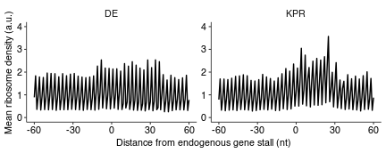

Plot ribosome density around RQC stall in endogenous genes
================
rasi
30 July, 2019

-   [Load libraries](#load-libraries)
-   [Load genome and annotations](#load-genome-and-annotations)
-   [Load RQC stalls for joining with high TE genes](#load-rqc-stalls-for-joining-with-high-te-genes)
-   [Convert RQC stalls to genomic coordinates](#convert-rqc-stalls-to-genomic-coordinates)
-   [Load the alignments](#load-the-alignments)
-   [Trim the alignments to the P-site and calculate coverage separately for + and - strands](#trim-the-alignments-to-the-p-site-and-calculate-coverage-separately-for-and---strands)
-   [Load pre-computed coverage](#load-pre-computed-coverage)
-   [Expand each stall to 61 nt width](#expand-each-stall-to-61-nt-width)
-   [Get the coverage of the 61 nt window arounde each stall](#get-the-coverage-of-the-61-nt-window-arounde-each-stall)
-   [Normalize the cvg within each stall and threshold to stalls with mean cvg &gt;= 1](#normalize-the-cvg-within-each-stall-and-threshold-to-stalls-with-mean-cvg-1)
-   [Plot the mean and standard deviation of normalized cvg around stalls](#plot-the-mean-and-standard-deviation-of-normalized-cvg-around-stalls)
-   [Source data for Fig. 6A and S5 Fig panel A](#source-data-for-fig.-6a-and-s5-fig-panel-a)
-   [Session Info](#session-info)

Load libraries
==============

``` r
library(GenomicAlignments)
library(GenomicFeatures)
library(Biostrings)
library(tidyverse)
library(plyranges)
library(rasilabRtemplates)
```

Load genome and annotations
===========================

``` r
genome <- BSgenome.Scerevisiae.UCSC.sacCer3::BSgenome.Scerevisiae.UCSC.sacCer3
annotations <- "/fh/fast/subramaniam_a/db/rasi/genomes/yeast/Saccharomyces_cerevisiae/sgd/S288C_reference_genome_R64-1-1_20110203/saccharomyces_cerevisiae_R64-1-1_20110208.gff" %>% 
  rtracklayer::readGFF() %>% 
  as_tibble()

tx <- annotations %>% 
  GRanges() %>% 
  filter(type == "CDS") %>% 
  select(Name) %>% 
  split(.$Name) %>% 
  print()
```

    ## GRangesList object of length 6717:
    ## $Q0010 
    ## GRanges object with 1 range and 1 metadata column:
    ##       seqnames    ranges strand |        Name
    ##          <Rle> <IRanges>  <Rle> | <character>
    ##   [1]  chrMito 3952-4338      + |       Q0010
    ## 
    ## $Q0017 
    ## GRanges object with 1 range and 1 metadata column:
    ##       seqnames    ranges strand |  Name
    ##   [1]  chrMito 4254-4415      + | Q0017
    ## 
    ## $Q0032 
    ## GRanges object with 1 range and 1 metadata column:
    ##       seqnames      ranges strand |  Name
    ##   [1]  chrMito 11667-11957      + | Q0032
    ## 
    ## ...
    ## <6714 more elements>
    ## -------
    ## seqinfo: 18 sequences from an unspecified genome; no seqlengths

Load RQC stalls for joining with high TE genes
==============================================

``` r
rqc_stalls <- read_tsv("../../rqc_stalls_in_yeast_orfs/tables/ngrams_annotated.tsv") %>% 
  bind_rows(read_tsv("../../rqc_stalls_in_yeast_orfs/tables/ngram_control_annotated.tsv")) %>%
  mutate(seqname = id, start = pos*3 + 1) %>% 
  mutate(end = start) %>%
  select(seqname, start, end, stall, id) %>% 
  GRanges() %>% 
  mutate(stall = if_else(stall %in% c("KR", "P"), "KPR", stall)) %>% 
  print()
```

    ## GRanges object with 2803 ranges and 2 metadata columns:
    ##          seqnames    ranges strand |       stall          id
    ##             <Rle> <IRanges>  <Rle> | <character> <character>
    ##      [1]  YHR131C       964      * |         KPR     YHR131C
    ##      [2]  YIL159W      2305      * |         KPR     YIL159W
    ##      [3]  YNL271C      3715      * |         KPR     YNL271C
    ##      [4]  YOR019W      2137      * |         KPR     YOR019W
    ##      [5]  YBL091C       121      * |         KPR     YBL091C
    ##      ...      ...       ...    ... .         ...         ...
    ##   [2799]  YPR164W       436      * |          DE     YPR164W
    ##   [2800]  YPR169W      1321      * |          DE     YPR169W
    ##   [2801]  YPR173C       304      * |          DE     YPR173C
    ##   [2802]  YPR180W       601      * |          DE     YPR180W
    ##   [2803]  YPR204W      2281      * |          DE     YPR204W
    ##   -------
    ##   seqinfo: 2244 sequences from an unspecified genome; no seqlengths

Convert RQC stalls to genomic coordinates
=========================================

``` r
rqc_stalls_coords <- mapFromTranscripts(rqc_stalls, tx) %>% 
  # get rid of mitochondrial sequence
  filter(seqnames != "chrMito") %>% 
  mutate(id = seqnames(rqc_stalls)[xHits], stall = rqc_stalls$stall[xHits]) %>% 
  select(-xHits, -transcriptsHits)

# check that the mapping was done correctly
rqc_stalls_coords %>% 
  anchor_5p() %>% 
  stretch(29) %>% 
  getSeq(genome, .) %>% 
  translate()
```

    ##   A AAStringSet instance of length 2802
    ##        width seq
    ##    [1]    10 RRRRRRRRRR
    ##    [2]    10 PPPPPPPPPP
    ##    [3]    10 PPPPPPPPPP
    ##    [4]    10 KKKKKKKKKK
    ##    [5]    10 KKKKNKKKKK
    ##    ...   ... ...
    ## [2798]    10 DDSDIEALDD
    ## [2799]    10 EELLDELDKD
    ## [2800]    10 EEGEDNGGED
    ## [2801]    10 DEEDEKKTYE
    ## [2802]    10 DEEYKEYLED

Load the alignments
===================

We do not run the codecell below after the first time to save time.

``` r
aln <- readGAlignments("../processeddata/mono/accepted_hits.bam") %>% 
  print()
```

Trim the alignments to the P-site and calculate coverage separately for + and - strands
=======================================================================================

We do not run the codecell below after the first time to save time.

``` r
cvg_plus <- aln[strand(aln) == "+"] %>% 
  qnarrow(start = 13, width = 1) %>% 
  coverage() %>% 
  print()

cvg_minus <- aln[strand(aln) == "-"] %>% 
  qnarrow(start = qwidth(.) - 12, width = 1) %>% 
  coverage() %>% 
  print()

rtracklayer::export.bw(cvg_plus, "../processeddata/mono/cvg_plus.bw")
rtracklayer::export.bw(cvg_minus, "../processeddata/mono/cvg_minus.bw")
```

Load pre-computed coverage
==========================

``` r
cvg_plus <- rtracklayer::import.bw("../processeddata/mono/cvg_plus.bw") %>% 
  coverage(weight = "score")
cvg_minus <- rtracklayer::import.bw("../processeddata/mono/cvg_minus.bw") %>% 
  coverage(weight = "score")
```

Expand each stall to 61 nt width
================================

``` r
rqc_flank <- rqc_stalls_coords %>% 
  anchor_5p() %>% 
  stretch(300) %>% 
  shift_upstream(150) %>% 
  mutate(uid = paste0(id, "_", stall)) %>% 
  print()
```

    ## GRanges object with 2802 ranges and 3 metadata columns:
    ##          seqnames        ranges strand |      id       stall         uid
    ##             <Rle>     <IRanges>  <Rle> |   <Rle> <character> <character>
    ##      [1]  chrVIII 366779-367079      - | YHR131C         KPR YHR131C_KPR
    ##      [2]    chrIX   43979-44279      + | YIL159W         KPR YIL159W_KPR
    ##      [3]   chrXIV 131519-131819      - | YNL271C         KPR YNL271C_KPR
    ##      [4]    chrXV 370113-370413      + | YOR019W         KPR YOR019W_KPR
    ##      [5]    chrII   48358-48658      - | YBL091C         KPR YBL091C_KPR
    ##      ...      ...           ...    ... .     ...         ...         ...
    ##   [2798]   chrXVI 870988-871288      + | YPR164W          DE  YPR164W_DE
    ##   [2799]   chrXVI 879860-880160      + | YPR169W          DE  YPR169W_DE
    ##   [2800]   chrXVI 887384-887684      - | YPR173C          DE  YPR173C_DE
    ##   [2801]   chrXVI 896411-896711      + | YPR180W          DE  YPR180W_DE
    ##   [2802]   chrXVI 946733-947033      + | YPR204W          DE  YPR204W_DE
    ##   -------
    ##   seqinfo: 18 sequences from an unspecified genome; no seqlengths

``` r
rqc_flank_plus <- filter(rqc_flank, strand == "+")
rqc_flank_minus <- filter(rqc_flank, strand == "-")
```

Get the coverage of the 61 nt window arounde each stall
=======================================================

``` r
stall_cvg_plus <- cvg_plus[rqc_flank_plus] %>% 
  setNames(rqc_flank_plus$uid) %>% 
  GRanges() %>% 
  as_tibble()

stall_cvg_minus <- cvg_plus[rqc_flank_minus] %>% 
  setNames(rqc_flank_minus$uid) %>% 
  GRanges() %>% 
  as_tibble()

stall_cvg <- bind_rows(stall_cvg_plus, stall_cvg_minus) %>% 
  # create a sequence from start to stop for each range
  mutate(pos = map2(start, end, function(x, y) seq(from = x, to = y))) %>% 
  # expand each range to equal its length
  unnest()  %>% 
  # mutate and unnest to create a single pos for each location
  mutate(start = pos, end = pos) %>% 
  select(-pos, -width) %>% 
  print()
```

    ## # A tibble: 843,402 x 5
    ##    seqnames    start   end strand score
    ##    <chr>       <int> <int> <fct>  <dbl>
    ##  1 YIL159W_KPR     1     1 *          0
    ##  2 YIL159W_KPR     2     2 *          0
    ##  3 YIL159W_KPR     3     3 *          0
    ##  4 YIL159W_KPR     4     4 *          0
    ##  5 YIL159W_KPR     5     5 *          0
    ##  6 YIL159W_KPR     6     6 *          0
    ##  7 YIL159W_KPR     7     7 *          1
    ##  8 YIL159W_KPR     8     8 *          0
    ##  9 YIL159W_KPR     9     9 *          1
    ## 10 YIL159W_KPR    10    10 *          0
    ## # ... with 843,392 more rows

Normalize the cvg within each stall and threshold to stalls with mean cvg &gt;= 1
=================================================================================

``` r
norm_cvg <- stall_cvg %>% 
  group_by(seqnames) %>% 
  mutate(mean_score = mean(score)) %>% 
  mutate(norm_score = score / mean_score) %>%
  ungroup() %>% 
  filter(mean_score >= 1) %>% 
  print()
```

    ## # A tibble: 280,532 x 7
    ##    seqnames    start   end strand score mean_score norm_score
    ##    <chr>       <int> <int> <fct>  <dbl>      <dbl>      <dbl>
    ##  1 YDL173W_KPR     1     1 *         13       4.92      2.64 
    ##  2 YDL173W_KPR     2     2 *          3       4.92      0.610
    ##  3 YDL173W_KPR     3     3 *          8       4.92      1.63 
    ##  4 YDL173W_KPR     4     4 *         37       4.92      7.52 
    ##  5 YDL173W_KPR     5     5 *          5       4.92      1.02 
    ##  6 YDL173W_KPR     6     6 *         10       4.92      2.03 
    ##  7 YDL173W_KPR     7     7 *         18       4.92      3.66 
    ##  8 YDL173W_KPR     8     8 *          1       4.92      0.203
    ##  9 YDL173W_KPR     9     9 *          3       4.92      0.610
    ## 10 YDL173W_KPR    10    10 *          9       4.92      1.83 
    ## # ... with 280,522 more rows

Plot the mean and standard deviation of normalized cvg around stalls
====================================================================

``` r
plot_data <- norm_cvg %>% 
  mutate(stall = str_extract(seqnames, "[^_]+$")) %>% 
  group_by(start, stall) %>% 
  summarize(mean_density = mean(norm_score), sd_density = sd(norm_score))

plot_data %>% 
  ggplot(aes(x = (start - 150), y = mean_density, 
             ymin = mean_density - sd_density, ymax = mean_density + sd_density)) +
  facet_wrap(~ stall, ncol = 3, scales = "free") +
  scale_y_continuous(limits = c(0, 4)) +
  scale_x_continuous(limits = c(-60, 60)) +
  labs(x = "Distance from endogenous gene stall (nt)", y = "Mean ribosome density (a.u.)") +
  geom_line(size = 0.5) 
```



``` r
ggsave("../figures/ribosome_density_around_rqc_stalls_and_controls.pdf")
```

Source data for Fig. 6A and S5 Fig panel A
==========================================

``` r
plot_data %>% 
  ungroup() %>% 
  mutate(start = start - 150) %>% 
  arrange(stall, start) %>% 
  select(stall, start, mean_density, sd_density) %>% 
  mutate_if(is.numeric, funs(round(., 3))) %>% 
  knitr::kable()
```

| stall |  start|  mean\_density|  sd\_density|
|:------|------:|--------------:|------------:|
| DE    |   -149|          1.948|        2.745|
| DE    |   -148|          0.361|        0.729|
| DE    |   -147|          0.844|        1.157|
| DE    |   -146|          1.755|        2.130|
| DE    |   -145|          0.342|        0.523|
| DE    |   -144|          0.921|        1.574|
| DE    |   -143|          1.841|        2.197|
| DE    |   -142|          0.321|        0.569|
| DE    |   -141|          0.902|        1.225|
| DE    |   -140|          1.784|        2.319|
| DE    |   -139|          0.356|        0.535|
| DE    |   -138|          0.763|        1.102|
| DE    |   -137|          1.790|        2.325|
| DE    |   -136|          0.321|        0.565|
| DE    |   -135|          0.877|        1.206|
| DE    |   -134|          1.791|        2.034|
| DE    |   -133|          0.319|        0.613|
| DE    |   -132|          0.829|        1.143|
| DE    |   -131|          1.910|        2.324|
| DE    |   -130|          0.369|        0.606|
| DE    |   -129|          0.945|        1.489|
| DE    |   -128|          2.010|        2.794|
| DE    |   -127|          0.359|        0.681|
| DE    |   -126|          0.934|        1.442|
| DE    |   -125|          1.945|        2.285|
| DE    |   -124|          0.367|        0.590|
| DE    |   -123|          0.920|        1.470|
| DE    |   -122|          1.885|        2.713|
| DE    |   -121|          0.346|        0.630|
| DE    |   -120|          0.898|        1.218|
| DE    |   -119|          1.806|        2.246|
| DE    |   -118|          0.352|        0.539|
| DE    |   -117|          0.901|        1.242|
| DE    |   -116|          1.754|        1.918|
| DE    |   -115|          0.333|        0.472|
| DE    |   -114|          0.924|        1.289|
| DE    |   -113|          1.851|        2.293|
| DE    |   -112|          0.321|        0.513|
| DE    |   -111|          0.863|        1.188|
| DE    |   -110|          1.881|        2.195|
| DE    |   -109|          0.339|        0.576|
| DE    |   -108|          0.959|        1.310|
| DE    |   -107|          1.951|        2.370|
| DE    |   -106|          0.381|        0.567|
| DE    |   -105|          0.883|        1.498|
| DE    |   -104|          1.888|        2.018|
| DE    |   -103|          0.373|        0.538|
| DE    |   -102|          0.922|        1.252|
| DE    |   -101|          1.904|        1.996|
| DE    |   -100|          0.336|        0.468|
| DE    |    -99|          0.925|        1.402|
| DE    |    -98|          1.809|        2.062|
| DE    |    -97|          0.324|        0.460|
| DE    |    -96|          1.013|        1.588|
| DE    |    -95|          1.979|        2.841|
| DE    |    -94|          0.363|        0.542|
| DE    |    -93|          0.881|        1.225|
| DE    |    -92|          1.906|        2.364|
| DE    |    -91|          0.321|        0.520|
| DE    |    -90|          0.816|        1.237|
| DE    |    -89|          1.728|        1.827|
| DE    |    -88|          0.303|        0.437|
| DE    |    -87|          0.949|        1.318|
| DE    |    -86|          1.943|        2.392|
| DE    |    -85|          0.337|        0.514|
| DE    |    -84|          0.784|        0.998|
| DE    |    -83|          1.835|        2.144|
| DE    |    -82|          0.353|        0.632|
| DE    |    -81|          0.892|        1.580|
| DE    |    -80|          1.738|        1.999|
| DE    |    -79|          0.325|        0.569|
| DE    |    -78|          0.803|        1.192|
| DE    |    -77|          1.717|        1.731|
| DE    |    -76|          0.352|        0.600|
| DE    |    -75|          0.893|        1.125|
| DE    |    -74|          1.752|        2.280|
| DE    |    -73|          0.337|        0.512|
| DE    |    -72|          0.871|        1.442|
| DE    |    -71|          1.880|        2.428|
| DE    |    -70|          0.312|        0.487|
| DE    |    -69|          0.858|        1.139|
| DE    |    -68|          1.729|        1.806|
| DE    |    -67|          0.339|        0.486|
| DE    |    -66|          0.934|        1.498|
| DE    |    -65|          1.879|        1.879|
| DE    |    -64|          0.328|        0.452|
| DE    |    -63|          0.947|        1.171|
| DE    |    -62|          1.752|        1.907|
| DE    |    -61|          0.320|        0.524|
| DE    |    -60|          0.889|        1.253|
| DE    |    -59|          1.834|        1.858|
| DE    |    -58|          0.358|        0.526|
| DE    |    -57|          0.951|        1.239|
| DE    |    -56|          1.785|        2.181|
| DE    |    -55|          0.331|        0.488|
| DE    |    -54|          0.931|        1.410|
| DE    |    -53|          1.763|        2.017|
| DE    |    -52|          0.349|        0.521|
| DE    |    -51|          0.886|        1.093|
| DE    |    -50|          1.958|        2.049|
| DE    |    -49|          0.339|        0.504|
| DE    |    -48|          0.958|        1.323|
| DE    |    -47|          1.941|        2.249|
| DE    |    -46|          0.352|        0.514|
| DE    |    -45|          0.974|        1.328|
| DE    |    -44|          1.929|        2.032|
| DE    |    -43|          0.316|        0.444|
| DE    |    -42|          0.871|        1.225|
| DE    |    -41|          1.793|        1.689|
| DE    |    -40|          0.343|        0.570|
| DE    |    -39|          0.828|        1.126|
| DE    |    -38|          1.931|        2.370|
| DE    |    -37|          0.344|        0.495|
| DE    |    -36|          0.930|        1.307|
| DE    |    -35|          1.840|        2.581|
| DE    |    -34|          0.345|        0.553|
| DE    |    -33|          0.942|        1.329|
| DE    |    -32|          1.909|        2.246|
| DE    |    -31|          0.362|        0.543|
| DE    |    -30|          0.906|        1.228|
| DE    |    -29|          1.939|        2.139|
| DE    |    -28|          0.350|        0.551|
| DE    |    -27|          0.927|        1.837|
| DE    |    -26|          1.820|        2.112|
| DE    |    -25|          0.338|        0.507|
| DE    |    -24|          0.864|        1.170|
| DE    |    -23|          1.782|        1.851|
| DE    |    -22|          0.317|        0.479|
| DE    |    -21|          0.863|        1.267|
| DE    |    -20|          1.754|        1.903|
| DE    |    -19|          0.353|        0.559|
| DE    |    -18|          0.850|        1.188|
| DE    |    -17|          1.784|        1.901|
| DE    |    -16|          0.345|        0.440|
| DE    |    -15|          0.859|        1.296|
| DE    |    -14|          1.832|        2.045|
| DE    |    -13|          0.325|        0.492|
| DE    |    -12|          1.108|        2.111|
| DE    |    -11|          2.265|        2.676|
| DE    |    -10|          0.361|        0.462|
| DE    |     -9|          1.094|        1.769|
| DE    |     -8|          2.535|        3.210|
| DE    |     -7|          0.421|        0.642|
| DE    |     -6|          1.050|        1.384|
| DE    |     -5|          2.177|        2.064|
| DE    |     -4|          0.387|        0.538|
| DE    |     -3|          0.982|        1.160|
| DE    |     -2|          2.162|        1.897|
| DE    |     -1|          0.376|        0.491|
| DE    |      0|          0.987|        1.091|
| DE    |      1|          2.136|        1.961|
| DE    |      2|          0.412|        0.561|
| DE    |      3|          0.998|        1.323|
| DE    |      4|          2.145|        2.246|
| DE    |      5|          0.358|        0.551|
| DE    |      6|          1.089|        1.154|
| DE    |      7|          2.043|        1.834|
| DE    |      8|          0.352|        0.477|
| DE    |      9|          0.615|        0.838|
| DE    |     10|          2.374|        2.009|
| DE    |     11|          0.420|        0.498|
| DE    |     12|          0.676|        0.908|
| DE    |     13|          2.262|        1.858|
| DE    |     14|          0.356|        0.455|
| DE    |     15|          0.743|        1.002|
| DE    |     16|          2.457|        2.089|
| DE    |     17|          0.327|        0.437|
| DE    |     18|          0.747|        1.013|
| DE    |     19|          2.306|        2.128|
| DE    |     20|          0.315|        0.478|
| DE    |     21|          0.702|        0.987|
| DE    |     22|          2.175|        1.980|
| DE    |     23|          0.322|        0.454|
| DE    |     24|          0.602|        0.832|
| DE    |     25|          2.095|        1.752|
| DE    |     26|          0.292|        0.402|
| DE    |     27|          0.698|        1.214|
| DE    |     28|          2.533|        3.086|
| DE    |     29|          0.349|        0.510|
| DE    |     30|          0.697|        0.972|
| DE    |     31|          2.197|        2.036|
| DE    |     32|          0.298|        0.412|
| DE    |     33|          0.706|        1.275|
| DE    |     34|          2.537|        3.563|
| DE    |     35|          0.345|        0.571|
| DE    |     36|          0.437|        0.639|
| DE    |     37|          2.457|        2.503|
| DE    |     38|          0.343|        0.506|
| DE    |     39|          1.026|        1.635|
| DE    |     40|          1.889|        3.048|
| DE    |     41|          0.255|        0.522|
| DE    |     42|          0.733|        0.998|
| DE    |     43|          1.652|        1.721|
| DE    |     44|          0.253|        0.432|
| DE    |     45|          0.810|        1.292|
| DE    |     46|          1.861|        2.437|
| DE    |     47|          0.303|        0.489|
| DE    |     48|          0.743|        1.034|
| DE    |     49|          1.757|        2.535|
| DE    |     50|          0.340|        0.671|
| DE    |     51|          0.805|        1.170|
| DE    |     52|          1.672|        1.965|
| DE    |     53|          0.339|        0.510|
| DE    |     54|          0.781|        1.163|
| DE    |     55|          1.747|        1.969|
| DE    |     56|          0.334|        0.533|
| DE    |     57|          0.814|        1.311|
| DE    |     58|          1.859|        2.884|
| DE    |     59|          0.311|        0.612|
| DE    |     60|          0.773|        1.122|
| DE    |     61|          1.597|        1.730|
| DE    |     62|          0.271|        0.469|
| DE    |     63|          0.741|        1.006|
| DE    |     64|          1.699|        2.509|
| DE    |     65|          0.281|        0.473|
| DE    |     66|          0.782|        1.383|
| DE    |     67|          1.684|        2.061|
| DE    |     68|          0.287|        0.490|
| DE    |     69|          0.778|        1.244|
| DE    |     70|          1.733|        2.284|
| DE    |     71|          0.326|        0.672|
| DE    |     72|          0.748|        1.111|
| DE    |     73|          1.446|        1.668|
| DE    |     74|          0.267|        0.438|
| DE    |     75|          0.710|        1.037|
| DE    |     76|          1.658|        1.931|
| DE    |     77|          0.274|        0.443|
| DE    |     78|          0.783|        0.993|
| DE    |     79|          1.624|        1.931|
| DE    |     80|          0.277|        0.472|
| DE    |     81|          0.812|        1.550|
| DE    |     82|          1.734|        2.194|
| DE    |     83|          0.381|        0.922|
| DE    |     84|          0.713|        1.051|
| DE    |     85|          1.558|        1.968|
| DE    |     86|          0.263|        0.399|
| DE    |     87|          0.755|        1.069|
| DE    |     88|          1.632|        1.814|
| DE    |     89|          0.263|        0.413|
| DE    |     90|          0.739|        1.097|
| DE    |     91|          1.609|        1.832|
| DE    |     92|          0.310|        0.586|
| DE    |     93|          0.812|        2.034|
| DE    |     94|          1.677|        2.263|
| DE    |     95|          0.302|        0.487|
| DE    |     96|          0.659|        1.225|
| DE    |     97|          1.431|        1.734|
| DE    |     98|          0.250|        0.438|
| DE    |     99|          0.753|        1.236|
| DE    |    100|          1.501|        1.838|
| DE    |    101|          0.298|        0.589|
| DE    |    102|          0.734|        1.472|
| DE    |    103|          1.741|        3.693|
| DE    |    104|          0.297|        0.549|
| DE    |    105|          0.741|        1.240|
| DE    |    106|          1.559|        2.528|
| DE    |    107|          0.286|        0.544|
| DE    |    108|          0.760|        1.383|
| DE    |    109|          1.394|        2.285|
| DE    |    110|          0.275|        0.596|
| DE    |    111|          0.793|        1.208|
| DE    |    112|          1.673|        2.271|
| DE    |    113|          0.310|        0.576|
| DE    |    114|          0.710|        1.026|
| DE    |    115|          1.488|        1.770|
| DE    |    116|          0.266|        0.437|
| DE    |    117|          0.781|        1.417|
| DE    |    118|          1.563|        2.463|
| DE    |    119|          0.266|        0.476|
| DE    |    120|          0.680|        0.987|
| DE    |    121|          1.597|        2.011|
| DE    |    122|          0.312|        0.625|
| DE    |    123|          0.831|        1.422|
| DE    |    124|          1.606|        2.702|
| DE    |    125|          0.288|        0.482|
| DE    |    126|          0.666|        1.045|
| DE    |    127|          1.480|        1.972|
| DE    |    128|          0.267|        0.422|
| DE    |    129|          0.716|        1.083|
| DE    |    130|          1.564|        1.974|
| DE    |    131|          0.273|        0.451|
| DE    |    132|          0.802|        1.308|
| DE    |    133|          1.658|        2.358|
| DE    |    134|          0.287|        0.530|
| DE    |    135|          0.794|        1.357|
| DE    |    136|          1.563|        1.882|
| DE    |    137|          0.274|        0.517|
| DE    |    138|          0.789|        1.165|
| DE    |    139|          1.853|        2.747|
| DE    |    140|          0.301|        0.530|
| DE    |    141|          0.706|        1.152|
| DE    |    142|          1.411|        1.827|
| DE    |    143|          0.280|        0.485|
| DE    |    144|          0.725|        1.177|
| DE    |    145|          1.415|        1.726|
| DE    |    146|          0.268|        0.472|
| DE    |    147|          0.698|        1.112|
| DE    |    148|          1.368|        1.700|
| DE    |    149|          0.244|        0.416|
| DE    |    150|          0.809|        1.201|
| DE    |    151|          1.641|        2.652|
| KPR   |   -149|          1.454|        1.874|
| KPR   |   -148|          0.250|        0.483|
| KPR   |   -147|          0.831|        1.453|
| KPR   |   -146|          1.639|        2.004|
| KPR   |   -145|          0.315|        0.565|
| KPR   |   -144|          0.750|        1.162|
| KPR   |   -143|          1.510|        1.898|
| KPR   |   -142|          0.304|        0.541|
| KPR   |   -141|          0.765|        1.222|
| KPR   |   -140|          1.490|        1.806|
| KPR   |   -139|          0.282|        0.487|
| KPR   |   -138|          0.754|        1.083|
| KPR   |   -137|          1.533|        1.828|
| KPR   |   -136|          0.267|        0.411|
| KPR   |   -135|          0.767|        1.133|
| KPR   |   -134|          1.528|        1.839|
| KPR   |   -133|          0.298|        0.518|
| KPR   |   -132|          0.872|        1.627|
| KPR   |   -131|          1.635|        2.047|
| KPR   |   -130|          0.290|        0.551|
| KPR   |   -129|          0.708|        1.003|
| KPR   |   -128|          1.567|        2.058|
| KPR   |   -127|          0.282|        0.453|
| KPR   |   -126|          0.852|        1.449|
| KPR   |   -125|          1.513|        2.141|
| KPR   |   -124|          0.258|        0.407|
| KPR   |   -123|          0.780|        1.281|
| KPR   |   -122|          1.630|        2.090|
| KPR   |   -121|          0.327|        0.500|
| KPR   |   -120|          0.850|        1.438|
| KPR   |   -119|          1.635|        2.086|
| KPR   |   -118|          0.316|        0.482|
| KPR   |   -117|          0.709|        1.014|
| KPR   |   -116|          1.461|        1.756|
| KPR   |   -115|          0.286|        0.501|
| KPR   |   -114|          0.815|        1.182|
| KPR   |   -113|          1.661|        2.060|
| KPR   |   -112|          0.276|        0.465|
| KPR   |   -111|          0.879|        1.393|
| KPR   |   -110|          1.796|        3.244|
| KPR   |   -109|          0.351|        0.682|
| KPR   |   -108|          0.853|        1.244|
| KPR   |   -107|          1.795|        2.717|
| KPR   |   -106|          0.360|        0.668|
| KPR   |   -105|          0.818|        1.253|
| KPR   |   -104|          1.672|        1.830|
| KPR   |   -103|          0.300|        0.443|
| KPR   |   -102|          0.700|        0.992|
| KPR   |   -101|          1.542|        1.848|
| KPR   |   -100|          0.267|        0.394|
| KPR   |    -99|          0.783|        1.223|
| KPR   |    -98|          1.559|        1.932|
| KPR   |    -97|          0.310|        0.482|
| KPR   |    -96|          0.931|        1.803|
| KPR   |    -95|          1.708|        3.493|
| KPR   |    -94|          0.327|        0.596|
| KPR   |    -93|          0.704|        1.280|
| KPR   |    -92|          1.738|        2.031|
| KPR   |    -91|          0.341|        0.495|
| KPR   |    -90|          0.915|        1.499|
| KPR   |    -89|          1.780|        2.335|
| KPR   |    -88|          0.318|        0.497|
| KPR   |    -87|          0.878|        1.275|
| KPR   |    -86|          1.691|        2.075|
| KPR   |    -85|          0.313|        0.510|
| KPR   |    -84|          0.997|        1.559|
| KPR   |    -83|          1.716|        1.973|
| KPR   |    -82|          0.354|        0.586|
| KPR   |    -81|          0.955|        1.381|
| KPR   |    -80|          1.766|        1.977|
| KPR   |    -79|          0.346|        0.540|
| KPR   |    -78|          0.897|        1.279|
| KPR   |    -77|          1.822|        2.071|
| KPR   |    -76|          0.320|        0.511|
| KPR   |    -75|          0.835|        1.181|
| KPR   |    -74|          1.808|        2.405|
| KPR   |    -73|          0.301|        0.448|
| KPR   |    -72|          0.969|        1.399|
| KPR   |    -71|          1.877|        2.310|
| KPR   |    -70|          0.365|        0.532|
| KPR   |    -69|          0.906|        1.387|
| KPR   |    -68|          1.783|        2.088|
| KPR   |    -67|          0.326|        0.542|
| KPR   |    -66|          0.911|        1.348|
| KPR   |    -65|          1.767|        2.242|
| KPR   |    -64|          0.306|        0.453|
| KPR   |    -63|          0.814|        1.178|
| KPR   |    -62|          1.723|        2.057|
| KPR   |    -61|          0.319|        0.475|
| KPR   |    -60|          0.790|        1.105|
| KPR   |    -59|          1.698|        2.066|
| KPR   |    -58|          0.324|        0.524|
| KPR   |    -57|          0.822|        1.179|
| KPR   |    -56|          1.693|        2.000|
| KPR   |    -55|          0.299|        0.518|
| KPR   |    -54|          0.881|        1.191|
| KPR   |    -53|          1.672|        1.943|
| KPR   |    -52|          0.324|        0.434|
| KPR   |    -51|          0.855|        1.226|
| KPR   |    -50|          1.729|        2.179|
| KPR   |    -49|          0.336|        0.584|
| KPR   |    -48|          0.965|        1.650|
| KPR   |    -47|          1.813|        2.228|
| KPR   |    -46|          0.307|        0.483|
| KPR   |    -45|          0.804|        1.169|
| KPR   |    -44|          1.833|        2.256|
| KPR   |    -43|          0.352|        0.483|
| KPR   |    -42|          0.878|        1.277|
| KPR   |    -41|          1.882|        2.695|
| KPR   |    -40|          0.341|        0.543|
| KPR   |    -39|          0.817|        1.141|
| KPR   |    -38|          1.838|        2.275|
| KPR   |    -37|          0.327|        0.528|
| KPR   |    -36|          0.833|        1.519|
| KPR   |    -35|          1.634|        2.002|
| KPR   |    -34|          0.284|        0.468|
| KPR   |    -33|          0.844|        1.120|
| KPR   |    -32|          1.608|        1.867|
| KPR   |    -31|          0.307|        0.495|
| KPR   |    -30|          0.760|        1.044|
| KPR   |    -29|          1.668|        1.946|
| KPR   |    -28|          0.342|        0.514|
| KPR   |    -27|          0.850|        1.096|
| KPR   |    -26|          1.899|        2.115|
| KPR   |    -25|          0.358|        0.607|
| KPR   |    -24|          0.887|        1.270|
| KPR   |    -23|          1.787|        2.126|
| KPR   |    -22|          0.334|        0.503|
| KPR   |    -21|          0.964|        1.467|
| KPR   |    -20|          1.717|        2.049|
| KPR   |    -19|          0.368|        0.582|
| KPR   |    -18|          0.881|        1.240|
| KPR   |    -17|          1.607|        1.875|
| KPR   |    -16|          0.306|        0.445|
| KPR   |    -15|          0.932|        1.518|
| KPR   |    -14|          1.749|        1.949|
| KPR   |    -13|          0.310|        0.430|
| KPR   |    -12|          1.036|        1.297|
| KPR   |    -11|          1.927|        1.980|
| KPR   |    -10|          0.386|        0.553|
| KPR   |     -9|          1.069|        1.558|
| KPR   |     -8|          2.155|        2.257|
| KPR   |     -7|          0.351|        0.484|
| KPR   |     -6|          1.053|        1.281|
| KPR   |     -5|          2.042|        2.082|
| KPR   |     -4|          0.380|        0.528|
| KPR   |     -3|          1.048|        1.452|
| KPR   |     -2|          2.355|        2.769|
| KPR   |     -1|          0.504|        0.827|
| KPR   |      0|          1.164|        1.473|
| KPR   |      1|          2.177|        2.192|
| KPR   |      2|          0.505|        0.689|
| KPR   |      3|          1.610|        3.149|
| KPR   |      4|          3.047|        3.689|
| KPR   |      5|          0.589|        0.764|
| KPR   |      6|          1.209|        1.779|
| KPR   |      7|          2.746|        3.562|
| KPR   |      8|          0.516|        0.777|
| KPR   |      9|          1.690|        2.190|
| KPR   |     10|          2.200|        2.547|
| KPR   |     11|          0.469|        0.700|
| KPR   |     12|          1.545|        2.158|
| KPR   |     13|          2.481|        5.146|
| KPR   |     14|          0.553|        0.993|
| KPR   |     15|          1.609|        2.368|
| KPR   |     16|          2.602|        3.221|
| KPR   |     17|          0.539|        0.683|
| KPR   |     18|          1.525|        2.564|
| KPR   |     19|          2.528|        3.322|
| KPR   |     20|          0.563|        0.768|
| KPR   |     21|          1.730|        2.572|
| KPR   |     22|          2.676|        3.923|
| KPR   |     23|          0.649|        0.837|
| KPR   |     24|          2.166|        2.691|
| KPR   |     25|          3.569|        4.721|
| KPR   |     26|          0.694|        0.838|
| KPR   |     27|          1.220|        1.748|
| KPR   |     28|          1.991|        2.328|
| KPR   |     29|          0.469|        0.612|
| KPR   |     30|          1.366|        1.925|
| KPR   |     31|          2.416|        3.730|
| KPR   |     32|          0.427|        0.650|
| KPR   |     33|          0.989|        1.323|
| KPR   |     34|          1.651|        1.731|
| KPR   |     35|          0.394|        0.612|
| KPR   |     36|          1.281|        2.285|
| KPR   |     37|          1.598|        2.118|
| KPR   |     38|          0.353|        0.537|
| KPR   |     39|          0.866|        1.329|
| KPR   |     40|          1.886|        2.908|
| KPR   |     41|          0.375|        0.556|
| KPR   |     42|          0.973|        1.905|
| KPR   |     43|          1.706|        1.921|
| KPR   |     44|          0.346|        0.486|
| KPR   |     45|          0.891|        1.224|
| KPR   |     46|          1.822|        2.305|
| KPR   |     47|          0.332|        0.534|
| KPR   |     48|          0.776|        1.018|
| KPR   |     49|          1.696|        1.915|
| KPR   |     50|          0.290|        0.451|
| KPR   |     51|          0.890|        2.066|
| KPR   |     52|          1.843|        2.497|
| KPR   |     53|          0.355|        0.738|
| KPR   |     54|          0.998|        2.567|
| KPR   |     55|          2.011|        4.553|
| KPR   |     56|          0.363|        0.824|
| KPR   |     57|          0.831|        1.206|
| KPR   |     58|          1.720|        2.119|
| KPR   |     59|          0.318|        0.589|
| KPR   |     60|          0.876|        1.500|
| KPR   |     61|          1.731|        2.003|
| KPR   |     62|          0.342|        0.485|
| KPR   |     63|          0.883|        1.512|
| KPR   |     64|          1.775|        2.721|
| KPR   |     65|          0.286|        0.456|
| KPR   |     66|          0.773|        1.240|
| KPR   |     67|          1.676|        1.912|
| KPR   |     68|          0.361|        0.832|
| KPR   |     69|          0.800|        1.183|
| KPR   |     70|          1.538|        1.787|
| KPR   |     71|          0.334|        0.695|
| KPR   |     72|          0.838|        1.425|
| KPR   |     73|          1.648|        1.972|
| KPR   |     74|          0.294|        0.475|
| KPR   |     75|          0.865|        1.767|
| KPR   |     76|          1.561|        1.968|
| KPR   |     77|          0.315|        0.525|
| KPR   |     78|          0.783|        1.261|
| KPR   |     79|          1.576|        1.962|
| KPR   |     80|          0.299|        0.473|
| KPR   |     81|          0.749|        1.182|
| KPR   |     82|          1.633|        2.446|
| KPR   |     83|          0.331|        0.592|
| KPR   |     84|          0.696|        1.399|
| KPR   |     85|          1.474|        1.925|
| KPR   |     86|          0.292|        0.481|
| KPR   |     87|          0.852|        2.338|
| KPR   |     88|          1.658|        3.345|
| KPR   |     89|          0.261|        0.554|
| KPR   |     90|          0.726|        1.004|
| KPR   |     91|          1.476|        2.124|
| KPR   |     92|          0.306|        0.637|
| KPR   |     93|          0.624|        1.066|
| KPR   |     94|          1.553|        2.107|
| KPR   |     95|          0.295|        0.513|
| KPR   |     96|          0.740|        1.123|
| KPR   |     97|          1.625|        2.493|
| KPR   |     98|          0.322|        0.561|
| KPR   |     99|          0.718|        1.753|
| KPR   |    100|          1.379|        1.827|
| KPR   |    101|          0.243|        0.456|
| KPR   |    102|          0.600|        0.903|
| KPR   |    103|          1.514|        2.017|
| KPR   |    104|          0.249|        0.453|
| KPR   |    105|          0.658|        1.070|
| KPR   |    106|          1.299|        1.549|
| KPR   |    107|          0.250|        0.413|
| KPR   |    108|          0.617|        0.948|
| KPR   |    109|          1.352|        1.678|
| KPR   |    110|          0.246|        0.413|
| KPR   |    111|          0.649|        1.099|
| KPR   |    112|          1.244|        1.825|
| KPR   |    113|          0.250|        0.434|
| KPR   |    114|          0.692|        1.105|
| KPR   |    115|          1.391|        1.883|
| KPR   |    116|          0.261|        0.441|
| KPR   |    117|          0.711|        1.232|
| KPR   |    118|          1.481|        1.941|
| KPR   |    119|          0.303|        0.509|
| KPR   |    120|          0.709|        1.112|
| KPR   |    121|          1.516|        2.136|
| KPR   |    122|          0.245|        0.487|
| KPR   |    123|          0.703|        1.558|
| KPR   |    124|          1.550|        2.588|
| KPR   |    125|          0.304|        0.706|
| KPR   |    126|          0.609|        0.991|
| KPR   |    127|          1.374|        1.610|
| KPR   |    128|          0.246|        0.426|
| KPR   |    129|          0.639|        0.972|
| KPR   |    130|          1.447|        2.215|
| KPR   |    131|          0.283|        0.536|
| KPR   |    132|          0.922|        6.632|
| KPR   |    133|          1.322|        1.706|
| KPR   |    134|          0.236|        0.444|
| KPR   |    135|          0.678|        1.200|
| KPR   |    136|          1.305|        1.993|
| KPR   |    137|          0.249|        0.506|
| KPR   |    138|          0.672|        1.285|
| KPR   |    139|          1.485|        2.030|
| KPR   |    140|          0.270|        0.463|
| KPR   |    141|          0.730|        1.260|
| KPR   |    142|          1.553|        2.851|
| KPR   |    143|          0.244|        0.448|
| KPR   |    144|          0.714|        1.172|
| KPR   |    145|          1.428|        1.888|
| KPR   |    146|          0.250|        0.407|
| KPR   |    147|          0.592|        0.864|
| KPR   |    148|          1.500|        2.407|
| KPR   |    149|          0.257|        0.540|
| KPR   |    150|          0.840|        2.806|
| KPR   |    151|          1.681|        4.880|

Session Info
============

``` r
sessionInfo()
```

    ## R version 3.5.1 (2018-07-02)
    ## Platform: x86_64-pc-linux-gnu (64-bit)
    ## Running under: Ubuntu 18.04.1 LTS
    ## 
    ## Matrix products: default
    ## BLAS: /home/rasi/lib/R-3.5.1/lib/R/lib/libRblas.so
    ## LAPACK: /home/rasi/lib/R-3.5.1/lib/R/lib/libRlapack.so
    ## 
    ## locale:
    ##  [1] LC_CTYPE=en_US.UTF-8       LC_NUMERIC=C              
    ##  [3] LC_TIME=en_US.UTF-8        LC_COLLATE=en_US.UTF-8    
    ##  [5] LC_MONETARY=en_US.UTF-8    LC_MESSAGES=en_US.UTF-8   
    ##  [7] LC_PAPER=en_US.UTF-8       LC_NAME=C                 
    ##  [9] LC_ADDRESS=C               LC_TELEPHONE=C            
    ## [11] LC_MEASUREMENT=en_US.UTF-8 LC_IDENTIFICATION=C       
    ## 
    ## attached base packages:
    ## [1] stats4    parallel  stats     graphics  grDevices datasets  utils    
    ## [8] methods   base     
    ## 
    ## other attached packages:
    ##  [1] bindrcpp_0.2.2              rasilabRtemplates_0.1.0    
    ##  [3] plyranges_1.0.3             forcats_0.3.0              
    ##  [5] stringr_1.3.1               dplyr_0.7.6                
    ##  [7] purrr_0.2.5                 readr_1.1.1                
    ##  [9] tidyr_0.8.1                 tibble_1.4.2               
    ## [11] ggplot2_3.0.0               tidyverse_1.2.1            
    ## [13] GenomicFeatures_1.32.0      AnnotationDbi_1.42.1       
    ## [15] GenomicAlignments_1.16.0    Rsamtools_1.32.2           
    ## [17] Biostrings_2.48.0           XVector_0.20.0             
    ## [19] SummarizedExperiment_1.10.1 DelayedArray_0.6.2         
    ## [21] BiocParallel_1.14.2         matrixStats_0.54.0         
    ## [23] Biobase_2.40.0              GenomicRanges_1.32.6       
    ## [25] GenomeInfoDb_1.16.0         IRanges_2.14.10            
    ## [27] S4Vectors_0.18.3            BiocGenerics_0.26.0        
    ## 
    ## loaded via a namespace (and not attached):
    ##  [1] nlme_3.1-137                           
    ##  [2] bitops_1.0-6                           
    ##  [3] lubridate_1.7.4                        
    ##  [4] bit64_0.9-7                            
    ##  [5] progress_1.2.0                         
    ##  [6] httr_1.3.1                             
    ##  [7] rprojroot_1.3-2                        
    ##  [8] BSgenome.Scerevisiae.UCSC.sacCer3_1.4.0
    ##  [9] tools_3.5.1                            
    ## [10] backports_1.1.2                        
    ## [11] utf8_1.1.4                             
    ## [12] R6_2.2.2                               
    ## [13] DBI_1.0.0                              
    ## [14] lazyeval_0.2.1                         
    ## [15] colorspace_1.3-2                       
    ## [16] withr_2.1.2                            
    ## [17] tidyselect_0.2.4                       
    ## [18] prettyunits_1.0.2                      
    ## [19] bit_1.1-14                             
    ## [20] compiler_3.5.1                         
    ## [21] cli_1.0.0                              
    ## [22] rvest_0.3.2                            
    ## [23] xml2_1.2.0                             
    ## [24] labeling_0.3                           
    ## [25] rtracklayer_1.40.3                     
    ## [26] scales_0.5.0                           
    ## [27] digest_0.6.15                          
    ## [28] rmarkdown_1.10                         
    ## [29] pkgconfig_2.0.1                        
    ## [30] htmltools_0.3.6                        
    ## [31] highr_0.7                              
    ## [32] BSgenome_1.48.0                        
    ## [33] rlang_0.2.1                            
    ## [34] readxl_1.1.0                           
    ## [35] rstudioapi_0.7                         
    ## [36] RSQLite_2.1.1                          
    ## [37] bindr_0.1.1                            
    ## [38] jsonlite_1.5                           
    ## [39] RCurl_1.95-4.11                        
    ## [40] magrittr_1.5                           
    ## [41] GenomeInfoDbData_1.1.0                 
    ## [42] Matrix_1.2-14                          
    ## [43] Rcpp_0.12.18                           
    ## [44] munsell_0.5.0                          
    ## [45] fansi_0.2.3                            
    ## [46] stringi_1.2.4                          
    ## [47] yaml_2.2.0                             
    ## [48] zlibbioc_1.26.0                        
    ## [49] plyr_1.8.4                             
    ## [50] grid_3.5.1                             
    ## [51] blob_1.1.1                             
    ## [52] crayon_1.3.4                           
    ## [53] lattice_0.20-35                        
    ## [54] haven_1.1.2                            
    ## [55] hms_0.4.2                              
    ## [56] knitr_1.20                             
    ## [57] pillar_1.3.0                           
    ## [58] biomaRt_2.36.1                         
    ## [59] XML_3.98-1.12                          
    ## [60] glue_1.3.0                             
    ## [61] evaluate_0.11                          
    ## [62] modelr_0.1.2                           
    ## [63] cellranger_1.1.0                       
    ## [64] gtable_0.2.0                           
    ## [65] assertthat_0.2.0                       
    ## [66] broom_0.5.0                            
    ## [67] memoise_1.1.0
