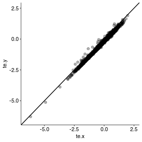
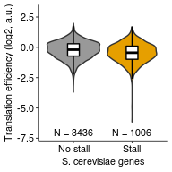
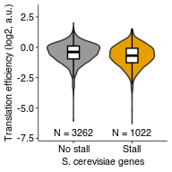
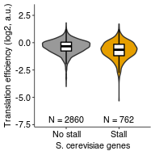

Plot ribosome density around RQC stall in endogenous genes
================
rasi
17 July, 2019

-   [Load libraries](#load-libraries)
-   [Load genome and annotations](#load-genome-and-annotations)
-   [Get TE from the the paper](#get-te-from-the-the-paper)
-   [Load RQC stalls for joining with high TE genes](#load-rqc-stalls-for-joining-with-high-te-genes)
-   [Find typical (median) location of stall for use in control](#find-typical-median-location-of-stall-for-use-in-control)
-   [Convert RQC stalls to genomic coordinates](#convert-rqc-stalls-to-genomic-coordinates)
-   [Load the Ribo-seq alignments](#load-the-ribo-seq-alignments)
-   [Trim the Ribo-seq alignments to the P-site and calculate coverage separately for + and - strands](#trim-the-ribo-seq-alignments-to-the-p-site-and-calculate-coverage-separately-for-and---strands)
-   [Load the RNA-seq alignments](#load-the-rna-seq-alignments)
-   [Trim the RNA-seq alignments to the P-site and calculate coverage separately for + and - strands](#trim-the-rna-seq-alignments-to-the-p-site-and-calculate-coverage-separately-for-and---strands)
-   [Load pre-computed coverage](#load-pre-computed-coverage)
-   [Plot calculated TE vs. TE pre-calculated by Weinberg et al.](#plot-calculated-te-vs.-te-pre-calculated-by-weinberg-et-al.)
-   [Look at high TE (paper) genes with potential RQC stalls](#look-at-high-te-paper-genes-with-potential-rqc-stalls)
-   [Plot TE from paper as a function of stall strength](#plot-te-from-paper-as-a-function-of-stall-strength)
-   [Test if stall-containing genes have lower or higher TE from paper](#test-if-stall-containing-genes-have-lower-or-higher-te-from-paper)
-   [Plot difference in TE between stall-containing and remaining genes](#plot-difference-in-te-between-stall-containing-and-remaining-genes)
-   [Look at high TE (calculated) genes with potential RQC stalls](#look-at-high-te-calculated-genes-with-potential-rqc-stalls)
-   [Plot calculated TE as a function of stall strength](#plot-calculated-te-as-a-function-of-stall-strength)
-   [Test if stall-containing genes have lower or higher calculated TE](#test-if-stall-containing-genes-have-lower-or-higher-calculated-te)
-   [Plot difference in TE between stall-containing and remaining genes](#plot-difference-in-te-between-stall-containing-and-remaining-genes-1)
-   [Calculate TE for only the region preceding each stall](#calculate-te-for-only-the-region-preceding-each-stall)
-   [Look at high TE (calculated only preceding stall) genes with potential RQC stalls](#look-at-high-te-calculated-only-preceding-stall-genes-with-potential-rqc-stalls)
-   [Plot calculated TE for region preceding stalls as a function of stall strength](#plot-calculated-te-for-region-preceding-stalls-as-a-function-of-stall-strength)
-   [Test if stall-containing genes have lower or higher calculated TE preceding stall](#test-if-stall-containing-genes-have-lower-or-higher-calculated-te-preceding-stall)
-   [Plot difference in TE between stall-containing and remaining genes](#plot-difference-in-te-between-stall-containing-and-remaining-genes-2)
-   [Session Info](#session-info)

Load libraries
==============

``` r
library(GenomicAlignments)
library(GenomicFeatures)
library(Biostrings)
library(tidyverse)
library(plyranges)
library(biobroom)
library(rasilabRtemplates)
```

Load genome and annotations
===========================

``` r
genome <- BSgenome.Scerevisiae.UCSC.sacCer3::BSgenome.Scerevisiae.UCSC.sacCer3
annotations <- "/fh/fast/subramaniam_a/db/rasi/genomes/yeast/Saccharomyces_cerevisiae/sgd/S288C_reference_genome_R64-1-1_20110203/saccharomyces_cerevisiae_R64-1-1_20110208.gff" %>% 
  rtracklayer::readGFF() %>% 
  as_tibble()

tx <- annotations %>% 
  GRanges() %>% 
  filter(type == "CDS" & orf_classification == "Verified") %>% 
  select(Name) %>% 
  split(.$Name) %>% 
  print()
```

    ## GRangesList object of length 4896:
    ## $Q0045 
    ## GRanges object with 8 ranges and 1 metadata column:
    ##       seqnames      ranges strand |        Name
    ##          <Rle>   <IRanges>  <Rle> | <character>
    ##   [1]  chrMito 13818-13986      + |       Q0045
    ##   [2]  chrMito 16435-16470      + |       Q0045
    ##   [3]  chrMito 18954-18991      + |       Q0045
    ##   [4]  chrMito 20508-20984      + |       Q0045
    ##   [5]  chrMito 21995-22246      + |       Q0045
    ##   [6]  chrMito 23612-23746      + |       Q0045
    ##   [7]  chrMito 25318-25342      + |       Q0045
    ##   [8]  chrMito 26229-26701      + |       Q0045
    ## 
    ## $Q0050 
    ## GRanges object with 1 range and 1 metadata column:
    ##       seqnames      ranges strand |  Name
    ##   [1]  chrMito 13818-16322      + | Q0050
    ## 
    ## $Q0055 
    ## GRanges object with 2 ranges and 1 metadata column:
    ##       seqnames      ranges strand |  Name
    ##   [1]  chrMito 13818-13986      + | Q0055
    ##   [2]  chrMito 16435-18830      + | Q0055
    ## 
    ## ...
    ## <4893 more elements>
    ## -------
    ## seqinfo: 18 sequences from an unspecified genome; no seqlengths

Get TE from the the paper
=========================

``` r
te_paper <- read_tsv("../annotations/GSE53313_Cerevisiae_RNA_RPF.txt", skip = 2) %>% 
  setNames(c("id", "total", "ribo", "te")) %>% 
  filter(!is.na(te) & ribo > 5 & total > 5) %>%
  print()
```

    ## # A tibble: 4,442 x 4
    ##    id       total    ribo      te
    ##    <chr>    <dbl>   <dbl>   <dbl>
    ##  1 YAL001C   34.5   18.0  -0.942 
    ##  2 YAL002W   19.8    5.37 -1.88  
    ##  3 YAL003W 4168.  6818.    0.710 
    ##  4 YAL007C  193.   195.    0.0135
    ##  5 YAL008W   44.7   85.7   0.941 
    ##  6 YAL009W   31.0   17.5  -0.829 
    ##  7 YAL010C   14.9   10.3  -0.536 
    ##  8 YAL011W   16.3   10.4  -0.652 
    ##  9 YAL012W  518.  1103.    1.09  
    ## 10 YAL013W   23.6   40.2   0.768 
    ## # ... with 4,432 more rows

Load RQC stalls for joining with high TE genes
==============================================

``` r
rqc_stalls <- read_tsv("../../rqc_stalls_in_yeast_orfs/tables/ngrams_annotated.tsv") %>% 
  mutate(stall = if_else(stall %in% c("KR", "P"), "KPR", stall)) %>%
  print()
```

    ## # A tibble: 1,251 x 7
    ##    id     ngram   ngram_weight   pos stall gene  Note                     
    ##    <chr>  <chr>          <int> <int> <chr> <chr> <chr>                    
    ##  1 YHR13… RRRRRR…           10   321 KPR   <NA>  Putative protein of unkn…
    ##  2 YIL15… PPPPPP…           10   768 KPR   BNR1  Formin, nucleates the fo…
    ##  3 YNL27… PPPPPP…           10  1238 KPR   BNI1  Formin, nucleates the fo…
    ##  4 YOR01… KKKKKK…           10   712 KPR   <NA>  Protein of unknown funct…
    ##  5 YBL09… KKKKNK…            9    40 KPR   MAP2  Methionine aminopeptidas…
    ##  6 YDL14… APPPPP…            9   473 KPR   LDB17 Protein involved in the …
    ##  7 YDL17… KEKKKK…            9   273 KPR   PAR32 Putative protein of unkn…
    ##  8 YDR17… KKKKKK…            9   227 KPR   HMO1  Chromatin associated hig…
    ##  9 YDR33… KKKRGR…            9   231 KPR   SWR1  Swi2/Snf2-related ATPase…
    ## 10 YHL01… KRKDKK…            9   174 KPR   APM2  Protein of unknown funct…
    ## # ... with 1,241 more rows

Find typical (median) location of stall for use in control
==========================================================

``` r
median_stall_loc <- median(rqc_stalls[["pos"]]) %>% 
  print()
```

    ## [1] 215

Convert RQC stalls to genomic coordinates
=========================================

``` r
rqc_stalls_coords <- rqc_stalls %>% 
  mutate(seqname = id, start = pos*3 + 1) %>%
  mutate(end = start) %>%
  select(seqname, start, end, stall, id) %>%
  GRanges() %>%
  mapFromTranscripts(tx) %>% 
  # get rid of mitochondrial sequence
  filter(seqnames != "chrMito") %>% 
  mutate(id = rqc_stalls[xHits, "id"], stall = rqc_stalls[xHits, "stall"]) %>%
  select(-xHits, -transcriptsHits)

# check that the mapping was done correctly
rqc_stalls_coords %>% 
  anchor_5p() %>% 
  stretch(29) %>% 
  getSeq(genome, .) %>% 
  translate()
```

    ##   A AAStringSet instance of length 1102
    ##        width seq
    ##    [1]    10 PPPPPPPPPP
    ##    [2]    10 PPPPPPPPPP
    ##    [3]    10 KKKKKKKKKK
    ##    [4]    10 KKKKNKKKKK
    ##    [5]    10 APPPPPPPPP
    ##    ...   ... ...
    ## [1098]    10 KSVKKRKIMK
    ## [1099]    10 KPKPTPPSPP
    ## [1100]    10 NTKKKSRAKK
    ## [1101]    10 KISNRLRKRR
    ## [1102]    10 KPRGRKGGRK

Load the Ribo-seq alignments
============================

We do not run the codecell below after the first time to save time.

``` r
aln <- readGAlignments("../processeddata/mono/accepted_hits.bam") %>% 
  print()
```

Trim the Ribo-seq alignments to the P-site and calculate coverage separately for + and - strands
================================================================================================

We do not run the codecell below after the first time to save time.

``` r
cvg_plus <- aln[strand(aln) == "+"] %>% 
  qnarrow(start = 13, width = 1) %>% 
  coverage() %>% 
  print()

cvg_minus <- aln[strand(aln) == "-"] %>% 
  qnarrow(start = qwidth(.) - 12, width = 1) %>% 
  coverage() %>% 
  print()

rtracklayer::export.bw(cvg_plus, "../processeddata/mono/cvg_plus.bw")
rtracklayer::export.bw(cvg_minus, "../processeddata/mono/cvg_minus.bw")
```

Load the RNA-seq alignments
===========================

We do not run the codecell below after the first time to save time.

``` r
aln <- readGAlignments("../processeddata/totalrz/accepted_hits.bam") %>% 
  print()
```

Trim the RNA-seq alignments to the P-site and calculate coverage separately for + and - strands
===============================================================================================

We do not run the codecell below after the first time to save time.

``` r
cvg_plus <- aln[strand(aln) == "+"] %>% 
  qnarrow(start = 13, width = 1) %>% 
  coverage() %>% 
  print()

cvg_minus <- aln[strand(aln) == "-"] %>% 
  qnarrow(start = qwidth(.) - 12, width = 1) %>% 
  coverage() %>% 
  print()

rtracklayer::export.bw(cvg_plus, "../processeddata/totalrz/cvg_plus.bw")
rtracklayer::export.bw(cvg_minus, "../processeddata/totalrz/cvg_minus.bw")
```

Load pre-computed coverage
==========================

``` r
ribo_cvg_plus <- rtracklayer::import.bw("../processeddata/mono/cvg_plus.bw") %>% 
  coverage(weight = "score")
ribo_cvg_minus <- rtracklayer::import.bw("../processeddata/mono/cvg_minus.bw") %>% 
  coverage(weight = "score")
total_cvg_plus <- rtracklayer::import.bw("../processeddata/totalrz/cvg_plus.bw") %>% 
  coverage(weight = "score")
total_cvg_minus <- rtracklayer::import.bw("../processeddata/totalrz/cvg_minus.bw") %>% 
  coverage(weight = "score")
```

``` r
cvg <- c('ribo' = c(GRanges(ribo_cvg_plus, strand = "+"), GRanges(ribo_cvg_minus, strand = "-")),
  'total' = c(GRanges(total_cvg_plus, strand = "+"), GRanges(total_cvg_minus, strand = "-"))
  ) %>% 
  GRangesList() %>% 
  as_tibble() %>% 
  select(-group) %>% 
  rename(sample = group_name) %>% 
  filter(score > 0) %>% 
  GRanges()
```

``` r
tx_counts <- mapToTranscripts(cvg, tx) %>% 
  GRanges() %>% 
  mutate(sample = cvg$sample[xHits], score = cvg$score[xHits]) %>% 
  as_tibble()
```

``` r
te_calculated <- tx_counts %>% 
  group_by(seqnames, sample) %>% 
  summarize(counts = sum(width * score)) %>% 
  ungroup() %>% 
  spread(sample, counts) %>% 
  filter(ribo > 100 & total > 100) %>%
  mutate(te = log2(ribo / total / sum(ribo) * sum(total))) %>%
  dplyr::rename(id = seqnames) %>% 
  print()
```

    ## # A tibble: 4,284 x 4
    ##    id        ribo total     te
    ##    <fct>    <dbl> <dbl>  <dbl>
    ##  1 YAL001C   3232   867 -1.18 
    ##  2 YAL002W   1122   559 -2.07 
    ##  3 YAL003W 223552 19006  0.478
    ##  4 YAL005C 701880 74785  0.152
    ##  5 YAL007C   6906   892 -0.126
    ##  6 YAL008W   2897   201  0.771
    ##  7 YAL009W    753   181 -1.02 
    ##  8 YAL010C    838   166 -0.743
    ##  9 YAL011W   1015   218 -0.859
    ## 10 YAL012W  66467  4470  0.816
    ## # ... with 4,274 more rows

Plot calculated TE vs. TE pre-calculated by Weinberg et al.
===========================================================

``` r
te_paper %>% 
  select(id, te) %>% 
  inner_join(te_calculated, by = "id") %>% 
  ggplot(aes(x = te.x, y = te.y)) +
  geom_point(alpha = 0.3) +
  scale_x_continuous(limits = c(-6.5, 2.5)) +
  scale_y_continuous(limits = c(-6.5, 2.5)) +
  geom_abline(intercept = 0, slope = 1)
```



Look at high TE (paper) genes with potential RQC stalls
=======================================================

``` r
te_paper_stall_data <- te_paper %>% 
  left_join(rqc_stalls, by = "id") %>%
  arrange(desc(te)) %>%
  select(te, gene, pos, ngram, ngram_weight, everything()) %>%
  print()
```

    ## # A tibble: 4,442 x 10
    ##       te gene    pos ngram  ngram_weight id    total   ribo stall Note    
    ##    <dbl> <chr> <int> <chr>         <int> <chr> <dbl>  <dbl> <chr> <chr>   
    ##  1  1.98 <NA>     NA <NA>             NA YLR4…  80.8  318.  <NA>  <NA>    
    ##  2  1.84 <NA>     NA <NA>             NA YPR0… 363.  1296.  <NA>  <NA>    
    ##  3  1.76 <NA>     NA <NA>             NA YMR1… 913.  3084.  <NA>  <NA>    
    ##  4  1.71 <NA>     NA <NA>             NA YJL1…  62.0  203.  <NA>  <NA>    
    ##  5  1.70 <NA>     NA <NA>             NA YDL0…  68.8  224.  <NA>  <NA>    
    ##  6  1.69 NOP16   215 KRRLL…            7 YER0…  59.9  193.  KPR   Constit…
    ##  7  1.65 <NA>     NA <NA>             NA YKL0…  19.1   60.0 <NA>  <NA>    
    ##  8  1.63 <NA>     NA <NA>             NA YBR0… 123.   382.  <NA>  <NA>    
    ##  9  1.60 <NA>     NA <NA>             NA YKL1… 335.  1016.  <NA>  <NA>    
    ## 10  1.58 <NA>     NA <NA>             NA YOR2…  30.2   90.5 <NA>  <NA>    
    ## # ... with 4,432 more rows

Plot TE from paper as a function of stall strength
==================================================

``` r
plot_data <- te_paper_stall_data %>% 
  mutate(ngram_weight = as.factor(if_else(is.na(ngram_weight), 0, 1))) %>% 
  group_by(ngram_weight) %>% 
  mutate(`n` = paste0("N = ", dplyr::n())) %>% 
  ungroup() %>% 
  mutate(ngram_weight = fct_recode(ngram_weight, `No stall` = "0", `Stall` = "1"))
  
plot_data %>% 
  ggplot(aes(x = ngram_weight, y = te, fill = ngram_weight)) +
  geom_violin() +
  geom_boxplot(width = 0.2, fill = "white", color = "black", outlier.shape = NA) +
  labs(x = "S. cerevisiae genes", y = "Translation efficiency (log2, a.u.)") +
  geom_text(aes(x = ngram_weight, label = n),
            data = plot_data %>% group_by(ngram_weight) %>% slice(1),
            y = -7, size = 2.8) +
  scale_y_continuous(limits = c(-7.2, 3)) +
  scale_fill_manual(values = cbPalette, guide = "none") +
  NULL
```



``` r
ggsave("../figures/distribution_of_te_paper_for_rqc_stall_containing_saccer_genes.pdf")
```

Test if stall-containing genes have lower or higher TE from paper
=================================================================

``` r
wilcox.test(te ~ ngram_weight, data = plot_data, alternative = "two.sided") %>% 
  tidy() %>% 
  gather() %>% 
  knitr::kable()
```

| key         | value                                             |
|:------------|:--------------------------------------------------|
| statistic   | 2031666.5                                         |
| p.value     | 2.2570475508283e-17                               |
| method      | Wilcoxon rank sum test with continuity correction |
| alternative | two.sided                                         |

Plot difference in TE between stall-containing and remaining genes
==================================================================

``` r
plot_data %>% 
  group_by(ngram_weight) %>% 
  summarize(median(te)) %>% 
  knitr::kable()
```

| ngram\_weight |  median(te)|
|:--------------|-----------:|
| No stall      |  -0.1943524|
| Stall         |  -0.4444032|

Look at high TE (calculated) genes with potential RQC stalls
============================================================

``` r
te_calc_stall_data <- te_calculated %>% 
  left_join(rqc_stalls, by = "id") %>%
  arrange(desc(te)) %>%
  select(te, gene, pos, ngram, ngram_weight, everything()) %>%
  print()
```

    ## # A tibble: 4,284 x 10
    ##       te gene    pos ngram  ngram_weight id     ribo total stall Note     
    ##    <dbl> <chr> <int> <chr>         <int> <chr> <dbl> <dbl> <chr> <chr>    
    ##  1  2.02 <NA>     NA <NA>             NA YDL0… 66683  1944 <NA>  <NA>     
    ##  2  1.90 <NA>     NA <NA>             NA YLR4…  4606   146 <NA>  <NA>     
    ##  3  1.65 <NA>     NA <NA>             NA YPR0… 12927   489 <NA>  <NA>     
    ##  4  1.58 <NA>     NA <NA>             NA YDR4…  8761   348 <NA>  <NA>     
    ##  5  1.53 NOP16   215 KRRLL…            7 YER0…  7432   305 KPR   Constitu…
    ##  6  1.51 <NA>     NA <NA>             NA YDR0… 89386  3719 <NA>  <NA>     
    ##  7  1.50 <NA>     NA <NA>             NA YJL1…  6912   289 <NA>  <NA>     
    ##  8  1.45 <NA>     NA <NA>             NA YDL0…  3557   154 <NA>  <NA>     
    ##  9  1.38 <NA>     NA <NA>             NA YLR3… 71326  3240 <NA>  <NA>     
    ## 10  1.38 <NA>     NA <NA>             NA YDR3…  3033   138 <NA>  <NA>     
    ## # ... with 4,274 more rows

Plot calculated TE as a function of stall strength
==================================================

``` r
plot_data <- te_calc_stall_data %>% 
  mutate(ngram_weight = as.factor(if_else(is.na(ngram_weight), 0, 1))) %>% 
  group_by(ngram_weight) %>% 
  mutate(`n` = paste0("N = ", dplyr::n())) %>% 
  ungroup() %>% 
  mutate(ngram_weight = fct_recode(ngram_weight, `No stall` = "0", `Stall` = "1"))
  
plot_data %>% 
  ggplot(aes(x = ngram_weight, y = te, fill = ngram_weight)) +
  geom_violin() +
  geom_boxplot(width = 0.2, fill = "white", color = "black", outlier.shape = NA) +
  labs(x = "S. cerevisiae genes", y = "Translation efficiency (log2, a.u.)") +
  geom_text(aes(x = ngram_weight, label = n),
            data = plot_data %>% group_by(ngram_weight) %>% slice(1),
            y = -7, size = 2.8) +
  scale_y_continuous(limits = c(-7.2, 3)) +
  scale_fill_manual(values = cbPalette, guide = "none") +
  NULL
```



``` r
ggsave("../figures/distribution_of_te_calculated_for_rqc_stall_containing_saccer_genes.pdf")
```

Test if stall-containing genes have lower or higher calculated TE
=================================================================

``` r
wilcox.test(te ~ ngram_weight, data = plot_data, alternative = "two.sided") %>% 
  tidy() %>% 
  gather() %>% 
  knitr::kable()
```

| key         | value                                             |
|:------------|:--------------------------------------------------|
| statistic   | 1956806                                           |
| p.value     | 4.3544146969543e-17                               |
| method      | Wilcoxon rank sum test with continuity correction |
| alternative | two.sided                                         |

Plot difference in TE between stall-containing and remaining genes
==================================================================

``` r
plot_data %>% 
  group_by(ngram_weight) %>% 
  summarize(median(te)) %>% 
  knitr::kable()
```

| ngram\_weight |  median(te)|
|:--------------|-----------:|
| No stall      |  -0.3820747|
| Stall         |  -0.6813425|

Calculate TE for only the region preceding each stall
=====================================================

``` r
te_preceding_stalls <- tx_counts %>% 
  left_join(rqc_stalls %>% select(id, pos), by = c("seqnames" = "id")) %>% 
  mutate(pos = if_else(is.na(pos), median_stall_loc, pos)) %>% 
  filter(start < 3*pos + 1) %>% 
  group_by(seqnames, sample) %>% 
  summarize(counts = sum(width * score)) %>% 
  ungroup() %>% 
  spread(sample, counts) %>% 
  filter(ribo > 100 & total > 100) %>%
  mutate(te = log2(ribo / total / sum(ribo) * sum(total))) %>%
  dplyr::rename(id = seqnames) %>% 
  print()
```

    ## # A tibble: 3,622 x 4
    ##    id        ribo total     te
    ##    <chr>    <dbl> <dbl>  <dbl>
    ##  1 YAL001C    869   203 -1.19 
    ##  2 YAL003W 223552 19006  0.266
    ##  3 YAL005C 208604 19538  0.126
    ##  4 YAL007C   6906   891 -0.336
    ##  5 YAL008W   2897   201  0.559
    ##  6 YAL009W    595   171 -1.49 
    ##  7 YAL012W  32012  2135  0.616
    ##  8 YAL014C    986   270 -1.42 
    ##  9 YAL016W   4722   547 -0.180
    ## 10 YAL017W   1304   266 -0.996
    ## # ... with 3,612 more rows

Look at high TE (calculated only preceding stall) genes with potential RQC stalls
=================================================================================

``` r
te_preceding_stall_data <- te_preceding_stalls %>% 
  left_join(rqc_stalls, by = "id") %>%
  arrange(desc(te)) %>%
  select(te, gene, pos, ngram, ngram_weight, everything()) %>%
  print()
```

    ## # A tibble: 3,622 x 10
    ##       te gene    pos ngram  ngram_weight id     ribo total stall Note     
    ##    <dbl> <chr> <int> <chr>         <int> <chr> <dbl> <dbl> <chr> <chr>    
    ##  1  1.81 <NA>     NA <NA>             NA YDL0… 66683  1944 <NA>  <NA>     
    ##  2  1.70 HTB1     28 DGKKR…            6 YDR2… 10546   331 KPR   Histone …
    ##  3  1.69 <NA>     NA <NA>             NA YLR4…  4606   146 <NA>  <NA>     
    ##  4  1.49 <NA>     NA <NA>             NA YDR0… 60140  2195 <NA>  <NA>     
    ##  5  1.44 NOP16   215 KRRLL…            7 YER0…  6866   259 KPR   Constitu…
    ##  6  1.43 <NA>     NA <NA>             NA YPR0… 12927   489 <NA>  <NA>     
    ##  7  1.36 <NA>     NA <NA>             NA YDR4…  8761   348 <NA>  <NA>     
    ##  8  1.29 <NA>     NA <NA>             NA YJL1…  6912   289 <NA>  <NA>     
    ##  9  1.24 <NA>     NA <NA>             NA YDL0…  3557   154 <NA>  <NA>     
    ## 10  1.21 NPL3     94 PQPYY…            7 YDR4…  8231   363 KPR   RNA-bind…
    ## # ... with 3,612 more rows

Plot calculated TE for region preceding stalls as a function of stall strength
==============================================================================

``` r
plot_data <- te_preceding_stall_data %>% 
  mutate(ngram_weight = as.factor(if_else(is.na(ngram_weight), 0, 1))) %>% 
  group_by(ngram_weight) %>% 
  mutate(`n` = paste0("N = ", dplyr::n())) %>% 
  ungroup() %>% 
  mutate(ngram_weight = fct_recode(ngram_weight, `No stall` = "0", `Stall` = "1"))
  
plot_data %>% 
  ggplot(aes(x = ngram_weight, y = te, fill = ngram_weight)) +
  geom_violin() +
  geom_boxplot(width = 0.2, fill = "white", color = "black", outlier.shape = NA) +
  labs(x = "S. cerevisiae genes", y = "Translation efficiency (log2, a.u.)") +
  geom_text(aes(x = ngram_weight, label = n),
            data = plot_data %>% group_by(ngram_weight) %>% slice(1),
            y = -7, size = 2.8) +
  scale_y_continuous(limits = c(-7.2, 3)) +
  scale_fill_manual(values = cbPalette, guide = "none") +
  NULL
```



``` r
ggsave("../figures/distribution_of_te_preceding_stalls_for_rqc_stall_containing_saccer_genes.pdf")
```

Test if stall-containing genes have lower or higher calculated TE preceding stall
=================================================================================

``` r
wilcox.test(te ~ ngram_weight, data = plot_data, alternative = "two.sided") %>% 
  tidy() %>% 
  gather() %>% 
  knitr::kable()
```

| key         | value                                             |
|:------------|:--------------------------------------------------|
| statistic   | 1362395.5                                         |
| p.value     | 2.10316183148019e-26                              |
| method      | Wilcoxon rank sum test with continuity correction |
| alternative | two.sided                                         |

Plot difference in TE between stall-containing and remaining genes
==================================================================

``` r
plot_data %>% 
  group_by(ngram_weight) %>% 
  summarize(median(te)) %>% 
  knitr::kable()
```

| ngram\_weight |  median(te)|
|:--------------|-----------:|
| No stall      |  -0.3310395|
| Stall         |  -0.6506406|

Session Info
============

``` r
sessionInfo()
```

    ## R version 3.5.1 (2018-07-02)
    ## Platform: x86_64-pc-linux-gnu (64-bit)
    ## Running under: Ubuntu 18.04.1 LTS
    ## 
    ## Matrix products: default
    ## BLAS: /home/rasi/lib/R-3.5.1/lib/R/lib/libRblas.so
    ## LAPACK: /home/rasi/lib/R-3.5.1/lib/R/lib/libRlapack.so
    ## 
    ## locale:
    ##  [1] LC_CTYPE=en_US.UTF-8       LC_NUMERIC=C              
    ##  [3] LC_TIME=en_US.UTF-8        LC_COLLATE=en_US.UTF-8    
    ##  [5] LC_MONETARY=en_US.UTF-8    LC_MESSAGES=en_US.UTF-8   
    ##  [7] LC_PAPER=en_US.UTF-8       LC_NAME=C                 
    ##  [9] LC_ADDRESS=C               LC_TELEPHONE=C            
    ## [11] LC_MEASUREMENT=en_US.UTF-8 LC_IDENTIFICATION=C       
    ## 
    ## attached base packages:
    ## [1] stats4    parallel  stats     graphics  grDevices datasets  utils    
    ## [8] methods   base     
    ## 
    ## other attached packages:
    ##  [1] bindrcpp_0.2.2              rasilabRtemplates_0.1.0    
    ##  [3] biobroom_1.12.1             broom_0.5.0                
    ##  [5] plyranges_1.0.3             forcats_0.3.0              
    ##  [7] stringr_1.3.1               dplyr_0.7.6                
    ##  [9] purrr_0.2.5                 readr_1.1.1                
    ## [11] tidyr_0.8.1                 tibble_1.4.2               
    ## [13] ggplot2_3.0.0               tidyverse_1.2.1            
    ## [15] GenomicFeatures_1.32.0      AnnotationDbi_1.42.1       
    ## [17] GenomicAlignments_1.16.0    Rsamtools_1.32.2           
    ## [19] Biostrings_2.48.0           XVector_0.20.0             
    ## [21] SummarizedExperiment_1.10.1 DelayedArray_0.6.2         
    ## [23] BiocParallel_1.14.2         matrixStats_0.54.0         
    ## [25] Biobase_2.40.0              GenomicRanges_1.32.6       
    ## [27] GenomeInfoDb_1.16.0         IRanges_2.14.10            
    ## [29] S4Vectors_0.18.3            BiocGenerics_0.26.0        
    ## 
    ## loaded via a namespace (and not attached):
    ##  [1] nlme_3.1-137                           
    ##  [2] bitops_1.0-6                           
    ##  [3] lubridate_1.7.4                        
    ##  [4] bit64_0.9-7                            
    ##  [5] progress_1.2.0                         
    ##  [6] httr_1.3.1                             
    ##  [7] rprojroot_1.3-2                        
    ##  [8] BSgenome.Scerevisiae.UCSC.sacCer3_1.4.0
    ##  [9] tools_3.5.1                            
    ## [10] backports_1.1.2                        
    ## [11] utf8_1.1.4                             
    ## [12] R6_2.2.2                               
    ## [13] DBI_1.0.0                              
    ## [14] lazyeval_0.2.1                         
    ## [15] colorspace_1.3-2                       
    ## [16] withr_2.1.2                            
    ## [17] tidyselect_0.2.4                       
    ## [18] prettyunits_1.0.2                      
    ## [19] bit_1.1-14                             
    ## [20] compiler_3.5.1                         
    ## [21] cli_1.0.0                              
    ## [22] rvest_0.3.2                            
    ## [23] xml2_1.2.0                             
    ## [24] labeling_0.3                           
    ## [25] rtracklayer_1.40.3                     
    ## [26] scales_0.5.0                           
    ## [27] digest_0.6.15                          
    ## [28] rmarkdown_1.10                         
    ## [29] pkgconfig_2.0.1                        
    ## [30] htmltools_0.3.6                        
    ## [31] highr_0.7                              
    ## [32] BSgenome_1.48.0                        
    ## [33] rlang_0.2.1                            
    ## [34] readxl_1.1.0                           
    ## [35] rstudioapi_0.7                         
    ## [36] RSQLite_2.1.1                          
    ## [37] bindr_0.1.1                            
    ## [38] jsonlite_1.5                           
    ## [39] RCurl_1.95-4.11                        
    ## [40] magrittr_1.5                           
    ## [41] GenomeInfoDbData_1.1.0                 
    ## [42] Matrix_1.2-14                          
    ## [43] Rcpp_0.12.18                           
    ## [44] munsell_0.5.0                          
    ## [45] fansi_0.2.3                            
    ## [46] stringi_1.2.4                          
    ## [47] yaml_2.2.0                             
    ## [48] zlibbioc_1.26.0                        
    ## [49] plyr_1.8.4                             
    ## [50] grid_3.5.1                             
    ## [51] blob_1.1.1                             
    ## [52] crayon_1.3.4                           
    ## [53] lattice_0.20-35                        
    ## [54] haven_1.1.2                            
    ## [55] hms_0.4.2                              
    ## [56] knitr_1.20                             
    ## [57] pillar_1.3.0                           
    ## [58] biomaRt_2.36.1                         
    ## [59] XML_3.98-1.12                          
    ## [60] glue_1.3.0                             
    ## [61] evaluate_0.11                          
    ## [62] modelr_0.1.2                           
    ## [63] cellranger_1.1.0                       
    ## [64] gtable_0.2.0                           
    ## [65] assertthat_0.2.0                       
    ## [66] memoise_1.1.0
