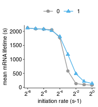
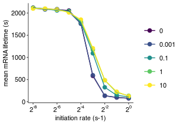
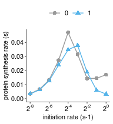
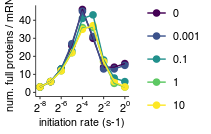
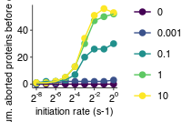

Analyze simulation results
================
rasi
16 May, 2019

-   [Load libraries](#load-libraries)
-   [Read protein count data](#read-protein-count-data)
-   [Read mRNA lifetime data](#read-mrna-lifetime-data)
-   [Read collision data](#read-collision-data)
-   [Read abort data](#read-abort-data)
-   [Read simulation parameters](#read-simulation-parameters)
-   [Combine all data into a single table](#combine-all-data-into-a-single-table)
-   [mRNA lifetime as a function of initiation rate for different rates of premature termination](#mrna-lifetime-as-a-function-of-initiation-rate-for-different-rates-of-premature-termination)
-   [mRNA lifetime as a function of initiation rate for different rates of premature termination, Reviewer response figure](#mrna-lifetime-as-a-function-of-initiation-rate-for-different-rates-of-premature-termination-reviewer-response-figure)
-   [PSR as a function of initiation rate](#psr-as-a-function-of-initiation-rate)
-   [PSR as a function of initiation rate for different rates of premature termination, Reviewer response figure](#psr-as-a-function-of-initiation-rate-for-different-rates-of-premature-termination-reviewer-response-figure)
-   [Abort rate as a function of initiation rate for different rates of premature termination, Reviewer response figure](#abort-rate-as-a-function-of-initiation-rate-for-different-rates-of-premature-termination-reviewer-response-figure)

Load libraries
--------------

``` r
library(tidyverse)
library(rasilabRtemplates)
# disable scientific notation
options(scipen=999)

cleave_model_names <- c(
  "hit5" = "CSEC",
  "simple" = "SEC",
  "trafficjam" = "TJ"
)
```

Read protein count data
=======================

``` r
psr_data <- read_tsv("tables/psr_stats.tsv") %>% 
  print()
```

    ## # A tibble: 180 x 6
    ##    sim_id mean_p_per_m sd_p_per_m total_p total_time     psr
    ##     <int>        <int>      <int>   <int>      <int>   <dbl>
    ##  1      0            3          2    3503     999910 0.00350
    ##  2      1            3          2    3503     999909 0.00350
    ##  3     10            3          2    3392     999785 0.00339
    ##  4    100           47         33   45152     999997 0.0452 
    ##  5    101           50         36   49179     999999 0.0492 
    ##  6    102           61         31   60385     999997 0.0604 
    ##  7    103           48         24   46582     998790 0.0466 
    ##  8    104           49         22   48748     995937 0.0489 
    ##  9    105           30         25   31655     999989 0.0317 
    ## 10    106           31         27   32380     999999 0.0324 
    ## # ... with 170 more rows

Read mRNA lifetime data
=======================

``` r
lifetime_data <- read_tsv("tables/mrna_lifetime_stats.tsv") %>% 
  mutate(se_lifetime = sd_lifetime / sqrt(n_mrna)) %>% 
  print()
```

    ## # A tibble: 180 x 5
    ##    sim_id mean_lifetime sd_lifetime n_mrna se_lifetime
    ##     <int>         <int>       <int>  <int>       <dbl>
    ##  1      0          2121         285    983        9.09
    ##  2      1          2121         285    983        9.09
    ##  3     10          2109         272    980        8.69
    ##  4    100           916         795    945       25.9 
    ##  5    101           945         803    974       25.7 
    ##  6    102          1577         744    987       23.7 
    ##  7    103          1569         733    966       23.6 
    ##  8    104          1647         706    989       22.4 
    ##  9    105           584         650   1030       20.3 
    ## 10    106           598         665   1015       20.9 
    ## # ... with 170 more rows

Read collision data
===================

``` r
collision_data <- read_tsv("tables/collision_stats.tsv") %>% 
  select(-mean_p_per_m, -sd_p_per_m) %>% 
  print()
```

    ## # A tibble: 180 x 4
    ##    sim_id total_collision total_time collision_freq
    ##     <int>           <int>      <int>          <dbl>
    ##  1      0             505     990677        0.00051
    ##  2      1             505     990676        0.00051
    ##  3     10             449     997139        0.00045
    ##  4    100          704271     999997        0.704  
    ##  5    101          698155     999999        0.698  
    ##  6    102          310113     999997        0.310  
    ##  7    103          120441     998790        0.121  
    ##  8    104           52360     999969        0.0524 
    ##  9    105          450921     999989        0.451  
    ## 10    106          431879     999999        0.432  
    ## # ... with 170 more rows

Read abort data
===============

``` r
abort_data <- read_tsv("tables/abort_stats.tsv") %>% 
  filter(str_detect(rxn_type, "intact")) %>% 
  group_by(sim_id) %>%
  summarize(mean_abort_per_m = sum(mean_abort_per_m), abort_freq = sum(abort_freq)) %>%
  ungroup() %>%
  print()
```

    ## # A tibble: 140 x 3
    ##    sim_id mean_abort_per_m abort_freq
    ##     <int>            <int>      <dbl>
    ##  1      2                1   0.000025
    ##  2      3                1   0.000059
    ##  3      4                1   0.000078
    ##  4      7                1   0.000027
    ##  5      8                1   0.000059
    ##  6      9                1   0.000078
    ##  7     12                1   0.000026
    ##  8     13                1   0.000067
    ##  9     14                1   0.000077
    ## 10     17                1   0.000026
    ## # ... with 130 more rows

Read simulation parameters
==========================

``` r
sim_params <- read_tsv("sim.params.tsv") %>% 
  rename(sim_id = X1) %>% 
  mutate(k_elong_stall = str_split(k_elong_stall, ",")) %>%
  mutate(k_elong_stall = map(k_elong_stall, as.numeric)) %>%
  mutate(k_elong_stall = map(k_elong_stall, function(x) unique(x))) %>%
  unnest() %>%
  mutate(x_stall = stringr::str_split(x_stall, ',')) %>%
  mutate(k_stall = round(k_elong_stall / as.numeric(n_stall), 2)) %>%
  select(sim_id, cleave_rate, cleave_model, k_stall, preterm_intact_rate, preterm_intact_model) %>%
  print()
```

    ## # A tibble: 180 x 6
    ##    sim_id cleave_rate cleave_model k_stall preterm_intact_…
    ##     <int>       <dbl> <chr>          <dbl>            <dbl>
    ##  1      0     0.001   hit5             0.1            0    
    ##  2      1     0.00101 hit5             0.1            0.001
    ##  3      2     0.002   hit5             0.1            0.1  
    ##  4      3     0.011   hit5             0.1            1    
    ##  5      4     0.101   hit5             0.1           10    
    ##  6      5     0.002   hit5             0.1            0    
    ##  7      6     0.00202 hit5             0.1            0.001
    ##  8      7     0.004   hit5             0.1            0.1  
    ##  9      8     0.022   hit5             0.1            1    
    ## 10      9     0.202   hit5             0.1           10    
    ## # ... with 170 more rows, and 1 more variable: preterm_intact_model <chr>

``` r
annotations <- list.files("output/", pattern = "params.tsv.gz$", full.names = T) %>%
  enframe("sno", "file") %>%
  mutate(sim_id = str_extract(file, "(?<=tasep_)[[:digit:]]+")) %>%
  mutate(data = map(file, read_tsv)) %>%
  select(-file, -sno) %>%
  unnest() %>%
  type_convert() %>%
  # retain only parameters that are varied, the others are for checking
  group_by(parameter) %>%
  mutate(vary = if_else(length(unique(value)) > 1, T, F)) %>%
  ungroup() %>%
  filter(vary == T) %>%
  select(-vary) %>%
  spread(parameter, value) %>%
  left_join(sim_params, by = "sim_id") %>%
  print()
```

    ## # A tibble: 180 x 11
    ##    sim_id k_cleave_5_hit k_cleave_both_h…  k_init k_preterm_5_hit…
    ##     <int>          <dbl>            <dbl>   <dbl>            <dbl>
    ##  1      0        0.001            0.001   0.00391            0    
    ##  2      1        0.00101          0.00101 0.00391            0.001
    ##  3      2        0.002            0.002   0.00391            0.1  
    ##  4      3        0.011            0.011   0.00391            1    
    ##  5      4        0.101            0.101   0.00391           10    
    ##  6      5        0.002            0.002   0.00391            0    
    ##  7      6        0.00202          0.00202 0.00391            0.001
    ##  8      7        0.004            0.004   0.00391            0.1  
    ##  9      8        0.022            0.022   0.00391            1    
    ## 10      9        0.202            0.202   0.00391           10    
    ## # ... with 170 more rows, and 6 more variables:
    ## #   k_preterm_both_hit_intact <dbl>, cleave_rate <dbl>,
    ## #   cleave_model <chr>, k_stall <dbl>, preterm_intact_rate <dbl>,
    ## #   preterm_intact_model <chr>

Combine all data into a single table
====================================

``` r
data <- annotations %>% 
  left_join(psr_data, by = "sim_id") %>% 
  left_join(lifetime_data, by = "sim_id") %>% 
  left_join(collision_data, by = "sim_id") %>% 
  left_join(abort_data, by = "sim_id") %>% 
  mutate(abort_freq = if_else(is.na(abort_freq), 0, abort_freq)) %>% 
  mutate(mean_abort_per_m = if_else(is.na(mean_abort_per_m), as.integer(0), mean_abort_per_m)) %>% 
  group_by(preterm_intact_rate, k_init) %>% 
  arrange(cleave_rate) %>% 
  mutate(cleave_order = 1:n()) %>% 
  ungroup() %>% 
  mutate(model = cleave_model_names[cleave_model]) %>%
  mutate(preterm_intact_rate = as.factor(preterm_intact_rate)) %>%
  mutate(cleave_order = as.factor(cleave_order)) %>%
  print()
```

    ## # A tibble: 180 x 27
    ##    sim_id k_cleave_5_hit k_cleave_both_h…  k_init k_preterm_5_hit…
    ##     <int>          <dbl>            <dbl>   <dbl>            <dbl>
    ##  1      0        0.001            0.001   0.00391            0    
    ##  2     20        0.001            0.001   0.00781            0    
    ##  3     40        0.001            0.001   0.0156             0    
    ##  4     60        0.001            0.001   0.0312             0    
    ##  5     80        0.001            0.001   0.0625             0    
    ##  6    100        0.001            0.001   0.125              0    
    ##  7    120        0.001            0.001   0.25               0    
    ##  8    140        0.001            0.001   0.5                0    
    ##  9    160        0.001            0.001   1                  0    
    ## 10      1        0.00101          0.00101 0.00391            0.001
    ## # ... with 170 more rows, and 22 more variables:
    ## #   k_preterm_both_hit_intact <dbl>, cleave_rate <dbl>,
    ## #   cleave_model <chr>, k_stall <dbl>, preterm_intact_rate <fct>,
    ## #   preterm_intact_model <chr>, mean_p_per_m <int>, sd_p_per_m <int>,
    ## #   total_p <int>, total_time.x <int>, psr <dbl>, mean_lifetime <int>,
    ## #   sd_lifetime <int>, n_mrna <int>, se_lifetime <dbl>,
    ## #   total_collision <int>, total_time.y <int>, collision_freq <dbl>,
    ## #   mean_abort_per_m <int>, abort_freq <dbl>, cleave_order <fct>,
    ## #   model <chr>

mRNA lifetime as a function of initiation rate for different rates of premature termination
===========================================================================================

``` r
plot_data <- data %>% 
  group_by(cleave_rate, preterm_intact_rate, model) %>% 
  mutate(mean_lifetime = mean_lifetime / max(mean_lifetime)) %>% 
  mutate(psr = psr / max(psr)) %>% 
  ungroup() %>% 
  print()
```

    ## # A tibble: 180 x 27
    ##    sim_id k_cleave_5_hit k_cleave_both_h…  k_init k_preterm_5_hit…
    ##     <int>          <dbl>            <dbl>   <dbl>            <dbl>
    ##  1      0        0.001            0.001   0.00391            0    
    ##  2     20        0.001            0.001   0.00781            0    
    ##  3     40        0.001            0.001   0.0156             0    
    ##  4     60        0.001            0.001   0.0312             0    
    ##  5     80        0.001            0.001   0.0625             0    
    ##  6    100        0.001            0.001   0.125              0    
    ##  7    120        0.001            0.001   0.25               0    
    ##  8    140        0.001            0.001   0.5                0    
    ##  9    160        0.001            0.001   1                  0    
    ## 10      1        0.00101          0.00101 0.00391            0.001
    ## # ... with 170 more rows, and 22 more variables:
    ## #   k_preterm_both_hit_intact <dbl>, cleave_rate <dbl>,
    ## #   cleave_model <chr>, k_stall <dbl>, preterm_intact_rate <fct>,
    ## #   preterm_intact_model <chr>, mean_p_per_m <int>, sd_p_per_m <int>,
    ## #   total_p <int>, total_time.x <int>, psr <dbl>, mean_lifetime <dbl>,
    ## #   sd_lifetime <int>, n_mrna <int>, se_lifetime <dbl>,
    ## #   total_collision <int>, total_time.y <int>, collision_freq <dbl>,
    ## #   mean_abort_per_m <int>, abort_freq <dbl>, cleave_order <fct>,
    ## #   model <chr>

``` r
plot_data %>%
  ggplot(aes(x = k_init, y = mean_lifetime, color = cleave_order, shape = model, group = cleave_order)) +
  facet_wrap(~ preterm_intact_rate, ncol = 3, labeller = label_both) +
  geom_point(size = 2) +
  geom_line() +
  scale_x_continuous(trans = "log2",
                     labels = scales::trans_format("log2", scales::math_format(2^.x)),
                     breaks = 2^(seq(-8,0,2))) +
  # scale_color_manual(values = cbPalette[c(3,2)]) +
  viridis::scale_color_viridis(discrete = T) +
  scale_shape_manual(values = c(19, 17)) +
  labs(x = "initiation rate (s-1)", y = "mean mRNA lifetime (s)", color = "", shape = "") +
  theme(legend.position = "top")
```



``` r
# ggsave("figures/mrna_lifetime_vs_initiation_rate.pdf", width = 1.7, height = 2)
```

mRNA lifetime as a function of initiation rate for different rates of premature termination, Reviewer response figure
=====================================================================================================================

``` r
plot_data <- data %>% 
  filter(cleave_order == 2) %>% 
  print()
```

    ## # A tibble: 45 x 27
    ##    sim_id k_cleave_5_hit k_cleave_both_h…  k_init k_preterm_5_hit…
    ##     <int>          <dbl>            <dbl>   <dbl>            <dbl>
    ##  1      5        0.002            0.002   0.00391            0    
    ##  2     25        0.002            0.002   0.00781            0    
    ##  3     45        0.002            0.002   0.0156             0    
    ##  4     65        0.002            0.002   0.0312             0    
    ##  5     85        0.002            0.002   0.0625             0    
    ##  6    105        0.002            0.002   0.125              0    
    ##  7    125        0.002            0.002   0.25               0    
    ##  8    145        0.002            0.002   0.5                0    
    ##  9    165        0.002            0.002   1                  0    
    ## 10      6        0.00202          0.00202 0.00391            0.001
    ## # ... with 35 more rows, and 22 more variables:
    ## #   k_preterm_both_hit_intact <dbl>, cleave_rate <dbl>,
    ## #   cleave_model <chr>, k_stall <dbl>, preterm_intact_rate <fct>,
    ## #   preterm_intact_model <chr>, mean_p_per_m <int>, sd_p_per_m <int>,
    ## #   total_p <int>, total_time.x <int>, psr <dbl>, mean_lifetime <int>,
    ## #   sd_lifetime <int>, n_mrna <int>, se_lifetime <dbl>,
    ## #   total_collision <int>, total_time.y <int>, collision_freq <dbl>,
    ## #   mean_abort_per_m <int>, abort_freq <dbl>, cleave_order <fct>,
    ## #   model <chr>

``` r
plot_data %>%
  ggplot(aes(x = k_init, y = mean_lifetime/1000, color = preterm_intact_rate, group = preterm_intact_rate)) +
  geom_point(size = 2) +
  geom_line() +
  scale_x_continuous(trans = "log2",
                     labels = scales::trans_format("log2", scales::math_format(2^.x)),
                     breaks = 2^(seq(-8,0,2))) +
  labs(x = "initiation rate (s-1)", y = "mean mRNA lifetime (x 10^3 s)", color = "", shape = "") +
  viridis::scale_color_viridis(discrete = T)
```



``` r
ggsave("figures/mrna_lifetime_vs_initiation_rate.pdf")
```

PSR as a function of initiation rate
====================================

``` r
plot_data <- data %>% 
  group_by(cleave_rate, preterm_intact_rate, model) %>% 
  mutate(mean_lifetime = mean_lifetime / max(mean_lifetime)) %>% 
  mutate(psr = psr / max(psr)) %>% 
  ungroup() %>% 
  print()
```

    ## # A tibble: 180 x 27
    ##    sim_id k_cleave_5_hit k_cleave_both_h…  k_init k_preterm_5_hit…
    ##     <int>          <dbl>            <dbl>   <dbl>            <dbl>
    ##  1      0        0.001            0.001   0.00391            0    
    ##  2     20        0.001            0.001   0.00781            0    
    ##  3     40        0.001            0.001   0.0156             0    
    ##  4     60        0.001            0.001   0.0312             0    
    ##  5     80        0.001            0.001   0.0625             0    
    ##  6    100        0.001            0.001   0.125              0    
    ##  7    120        0.001            0.001   0.25               0    
    ##  8    140        0.001            0.001   0.5                0    
    ##  9    160        0.001            0.001   1                  0    
    ## 10      1        0.00101          0.00101 0.00391            0.001
    ## # ... with 170 more rows, and 22 more variables:
    ## #   k_preterm_both_hit_intact <dbl>, cleave_rate <dbl>,
    ## #   cleave_model <chr>, k_stall <dbl>, preterm_intact_rate <fct>,
    ## #   preterm_intact_model <chr>, mean_p_per_m <int>, sd_p_per_m <int>,
    ## #   total_p <int>, total_time.x <int>, psr <dbl>, mean_lifetime <dbl>,
    ## #   sd_lifetime <int>, n_mrna <int>, se_lifetime <dbl>,
    ## #   total_collision <int>, total_time.y <int>, collision_freq <dbl>,
    ## #   mean_abort_per_m <int>, abort_freq <dbl>, cleave_order <fct>,
    ## #   model <chr>

``` r
plot_data %>%
  ggplot(aes(x = k_init, y = psr, color = cleave_order, shape = model, group = cleave_order)) +
  facet_wrap(~ preterm_intact_rate, ncol = 3, labeller = label_both) +
  geom_point(size = 2) +
  geom_line() +
  scale_x_continuous(trans = "log2",
                     labels = scales::trans_format("log2", scales::math_format(2^.x)),
                     breaks = 2^(seq(-8,0,2))) +
  # scale_color_manual(values = cbPalette[c(3,2)]) +
  viridis::scale_color_viridis(discrete = T) +
  scale_shape_manual(values = c(19, 17)) +
  labs(x = "initiation rate (s-1)", y = "protein synthesis rate (s-1)", color = "", shape = "") +
  theme(legend.position = "top")
```



PSR as a function of initiation rate for different rates of premature termination, Reviewer response figure
===========================================================================================================

``` r
plot_data <- data %>% 
  filter(cleave_order == 2) %>% 
  print()
```

    ## # A tibble: 45 x 27
    ##    sim_id k_cleave_5_hit k_cleave_both_h…  k_init k_preterm_5_hit…
    ##     <int>          <dbl>            <dbl>   <dbl>            <dbl>
    ##  1      5        0.002            0.002   0.00391            0    
    ##  2     25        0.002            0.002   0.00781            0    
    ##  3     45        0.002            0.002   0.0156             0    
    ##  4     65        0.002            0.002   0.0312             0    
    ##  5     85        0.002            0.002   0.0625             0    
    ##  6    105        0.002            0.002   0.125              0    
    ##  7    125        0.002            0.002   0.25               0    
    ##  8    145        0.002            0.002   0.5                0    
    ##  9    165        0.002            0.002   1                  0    
    ## 10      6        0.00202          0.00202 0.00391            0.001
    ## # ... with 35 more rows, and 22 more variables:
    ## #   k_preterm_both_hit_intact <dbl>, cleave_rate <dbl>,
    ## #   cleave_model <chr>, k_stall <dbl>, preterm_intact_rate <fct>,
    ## #   preterm_intact_model <chr>, mean_p_per_m <int>, sd_p_per_m <int>,
    ## #   total_p <int>, total_time.x <int>, psr <dbl>, mean_lifetime <int>,
    ## #   sd_lifetime <int>, n_mrna <int>, se_lifetime <dbl>,
    ## #   total_collision <int>, total_time.y <int>, collision_freq <dbl>,
    ## #   mean_abort_per_m <int>, abort_freq <dbl>, cleave_order <fct>,
    ## #   model <chr>

``` r
plot_data %>%
  ggplot(aes(x = k_init, y = mean_p_per_m, color = preterm_intact_rate, group = preterm_intact_rate)) +
  geom_point(size = 2) +
  geom_line() +
  scale_x_continuous(trans = "log2",
                     labels = scales::trans_format("log2", scales::math_format(2^.x)),
                     breaks = 2^(seq(-8,0,2))) +
  scale_y_continuous(limits = c(0, NA)) +
  viridis::scale_color_viridis(discrete = T) +
  labs(x = "initiation rate (s-1)", y = "num. full proteins / mRNA", color = "", shape = "")
```



``` r
ggsave("figures/psr_vs_initiation_rate.pdf")
```

Abort rate as a function of initiation rate for different rates of premature termination, Reviewer response figure
==================================================================================================================

``` r
plot_data <- data %>% 
  filter(cleave_order == 2) %>% 
  print()
```

    ## # A tibble: 45 x 27
    ##    sim_id k_cleave_5_hit k_cleave_both_h…  k_init k_preterm_5_hit…
    ##     <int>          <dbl>            <dbl>   <dbl>            <dbl>
    ##  1      5        0.002            0.002   0.00391            0    
    ##  2     25        0.002            0.002   0.00781            0    
    ##  3     45        0.002            0.002   0.0156             0    
    ##  4     65        0.002            0.002   0.0312             0    
    ##  5     85        0.002            0.002   0.0625             0    
    ##  6    105        0.002            0.002   0.125              0    
    ##  7    125        0.002            0.002   0.25               0    
    ##  8    145        0.002            0.002   0.5                0    
    ##  9    165        0.002            0.002   1                  0    
    ## 10      6        0.00202          0.00202 0.00391            0.001
    ## # ... with 35 more rows, and 22 more variables:
    ## #   k_preterm_both_hit_intact <dbl>, cleave_rate <dbl>,
    ## #   cleave_model <chr>, k_stall <dbl>, preterm_intact_rate <fct>,
    ## #   preterm_intact_model <chr>, mean_p_per_m <int>, sd_p_per_m <int>,
    ## #   total_p <int>, total_time.x <int>, psr <dbl>, mean_lifetime <int>,
    ## #   sd_lifetime <int>, n_mrna <int>, se_lifetime <dbl>,
    ## #   total_collision <int>, total_time.y <int>, collision_freq <dbl>,
    ## #   mean_abort_per_m <int>, abort_freq <dbl>, cleave_order <fct>,
    ## #   model <chr>

``` r
plot_data %>%
  ggplot(aes(x = k_init, y = mean_abort_per_m, color = preterm_intact_rate, group = preterm_intact_rate)) +
  geom_point(size = 2) +
  geom_line() +
  scale_x_continuous(trans = "log2",
                     labels = scales::trans_format("log2", scales::math_format(2^.x)),
                     breaks = 2^(seq(-8,0,2))) +
  scale_y_continuous(limits = c(0, NA)) +
  viridis::scale_color_viridis(discrete = T) +
  labs(x = "initiation rate (s-1)", y = "num. aborted proteins before cleavage", color = "", shape = "")
```



``` r
ggsave("figures/abort_proteins_vs_initiation_rate.pdf")
```
