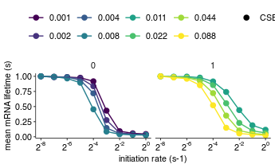

Analyze simulation results
================
rasi
09 May, 2019

-   [Load libraries](#load-libraries)
-   [Read protein count data](#read-protein-count-data)
-   [Read mRNA lifetime data](#read-mrna-lifetime-data)
-   [Read mRNA lifetime data](#read-mrna-lifetime-data-1)
-   [Read simulation parameters](#read-simulation-parameters)
-   [Combine all data into a single table](#combine-all-data-into-a-single-table)
-   [mRNA lifetime as a function of initiation rate for different rates of premature termination](#mrna-lifetime-as-a-function-of-initiation-rate-for-different-rates-of-premature-termination)
-   [mRNA lifetime as a function of initiation rate for different rates of premature termination, Reviewer response figure](#mrna-lifetime-as-a-function-of-initiation-rate-for-different-rates-of-premature-termination-reviewer-response-figure)
-   [PSR as a function of initiation rate](#psr-as-a-function-of-initiation-rate)
-   [PSR as a function of initiation rate for different rates of premature termination, Reviewer response figure](#psr-as-a-function-of-initiation-rate-for-different-rates-of-premature-termination-reviewer-response-figure)
-   [PSR / mRNA lifetime as a function of initiation rate](#psr-mrna-lifetime-as-a-function-of-initiation-rate)
-   [PSR / mRNA lifetime normalized to maximum as a function of initiation rate for different rates of premature termination, Reviewer response figure](#psr-mrna-lifetime-normalized-to-maximum-as-a-function-of-initiation-rate-for-different-rates-of-premature-termination-reviewer-response-figure)

Load libraries
--------------

``` r
library(tidyverse)
library(rasilabRtemplates)
# disable scientific notation
options(scipen=999)

cleave_model_names <- c(
  "hit5" = "CSEC",
  "simple" = "SEC",
  "trafficjam" = "TJ"
)
```

Read protein count data
=======================

``` r
psr_data <- read_tsv("tables/psr_stats.tsv") %>% 
  print()
```

    ## # A tibble: 72 x 6
    ##    sim_id mean_p_per_m sd_p_per_m total_p total_time     psr
    ##     <int>        <int>      <int>   <int>      <int>   <dbl>
    ##  1      0            3          2    3503     999910 0.00350
    ##  2      1            3          2    3412     999785 0.00341
    ##  3     10            6          4    6754     999640 0.00676
    ##  4     11            6          4    6346     999916 0.00635
    ##  5     12            7          4    6795     999862 0.00680
    ##  6     13            6          3    6443     999944 0.00644
    ##  7     14            6          4    6745     999994 0.00674
    ##  8     15            6          3    6457     999777 0.00646
    ##  9     16           13          7   13801     999927 0.0138 
    ## 10     17           13          6   12730     999994 0.0127 
    ## # ... with 62 more rows

Read mRNA lifetime data
=======================

``` r
lifetime_data <- read_tsv("tables/mrna_lifetime_stats.tsv") %>% 
  mutate(se_lifetime = sd_lifetime / sqrt(n_mrna)) %>% 
  print()
```

    ## # A tibble: 72 x 5
    ##    sim_id mean_lifetime sd_lifetime n_mrna se_lifetime
    ##     <int>         <int>       <int>  <int>       <dbl>
    ##  1      0          2121         285    983        9.09
    ##  2      1          2117         281   1076        8.57
    ##  3     10          2092         291    987        9.26
    ##  4     11          2096         277    942        9.03
    ##  5     12          2081         295    979        9.43
    ##  6     13          2084         303    982        9.67
    ##  7     14          2103         307    999        9.71
    ##  8     15          2058         340   1012       10.7 
    ##  9     16          2094         280   1006        8.83
    ## 10     17          2107         281    966        9.04
    ## # ... with 62 more rows

Read mRNA lifetime data
=======================

``` r
collision_data <- read_tsv("tables/collision_stats.tsv") %>% 
  print()
```

    ## # A tibble: 72 x 6
    ##    sim_id mean_p_per_m sd_p_per_m total_collision total_time collision_freq
    ##     <int>        <int>      <int>           <int>      <int>          <dbl>
    ##  1      0            6          5             505     990677       0.00051 
    ##  2      1            2          3             150     985548       0.000152
    ##  3     10            7          8            1770     998777       0.00177 
    ##  4     11            3          3             630     998489       0.000631
    ##  5     12            9         11            1979     992290       0.00199 
    ##  6     13            3          3             708     997810       0.00071 
    ##  7     14            7          7            1583     996334       0.00159 
    ##  8     15            2          3             627     999233       0.000627
    ##  9     16           13         14            7092     999927       0.00709 
    ## 10     17            5          5            2700     999994       0.0027  
    ## # ... with 62 more rows

Read simulation parameters
==========================

``` r
sim_params <- read_tsv("sim.params.tsv") %>% 
  rename(sim_id = X1) %>% 
  mutate(k_elong_stall = str_split(k_elong_stall, ",")) %>%
  mutate(k_elong_stall = map(k_elong_stall, as.numeric)) %>%
  mutate(k_elong_stall = map(k_elong_stall, function(x) unique(x))) %>%
  unnest() %>%
  mutate(x_stall = stringr::str_split(x_stall, ',')) %>%
  mutate(k_stall = round(k_elong_stall / as.numeric(n_stall), 2)) %>%
  select(sim_id, cleave_rate, cleave_model, k_stall, preterm_intact_rate, preterm_intact_model) %>%
  print()
```

    ## # A tibble: 72 x 6
    ##    sim_id cleave_rate cleave_model k_stall preterm_intact_…
    ##     <int>       <dbl> <chr>          <dbl>            <int>
    ##  1      0       0.001 hit5             0.1                0
    ##  2      1       0.011 hit5             0.1                1
    ##  3      2       0.002 hit5             0.1                0
    ##  4      3       0.022 hit5             0.1                1
    ##  5      4       0.004 hit5             0.1                0
    ##  6      5       0.044 hit5             0.1                1
    ##  7      6       0.008 hit5             0.1                0
    ##  8      7       0.088 hit5             0.1                1
    ##  9      8       0.001 hit5             0.1                0
    ## 10      9       0.011 hit5             0.1                1
    ## # ... with 62 more rows, and 1 more variable: preterm_intact_model <chr>

``` r
annotations <- list.files("output/", pattern = "params.tsv.gz$", full.names = T) %>%
  enframe("sno", "file") %>%
  mutate(sim_id = str_extract(file, "(?<=tasep_)[[:digit:]]+")) %>%
  mutate(data = map(file, read_tsv)) %>%
  select(-file, -sno) %>%
  unnest() %>%
  type_convert() %>%
  # retain only parameters that are varied, the others are for checking
  group_by(parameter) %>%
  mutate(vary = if_else(length(unique(value)) > 1, T, F)) %>%
  ungroup() %>%
  filter(vary == T) %>%
  select(-vary) %>%
  spread(parameter, value) %>%
  left_join(sim_params, by = "sim_id") %>%
  print()
```

    ## # A tibble: 72 x 11
    ##    sim_id k_cleave_5_hit k_cleave_both_h…  k_init k_preterm_5_hit…
    ##     <int>          <dbl>            <dbl>   <dbl>            <dbl>
    ##  1      0          0.001            0.001 0.00391                0
    ##  2      1          0.011            0.011 0.00391                1
    ##  3      2          0.002            0.002 0.00391                0
    ##  4      3          0.022            0.022 0.00391                1
    ##  5      4          0.004            0.004 0.00391                0
    ##  6      5          0.044            0.044 0.00391                1
    ##  7      6          0.008            0.008 0.00391                0
    ##  8      7          0.088            0.088 0.00391                1
    ##  9      8          0.001            0.001 0.00781                0
    ## 10      9          0.011            0.011 0.00781                1
    ## # ... with 62 more rows, and 6 more variables:
    ## #   k_preterm_both_hit_intact <dbl>, cleave_rate <dbl>,
    ## #   cleave_model <chr>, k_stall <dbl>, preterm_intact_rate <int>,
    ## #   preterm_intact_model <chr>

Combine all data into a single table
====================================

``` r
data <- annotations %>% 
  left_join(psr_data, by = "sim_id") %>% 
  left_join(lifetime_data, by = "sim_id") %>% 
  left_join(collision_data, by = "sim_id") %>% 
  print()
```

    ## # A tibble: 72 x 25
    ##    sim_id k_cleave_5_hit k_cleave_both_h…  k_init k_preterm_5_hit…
    ##     <int>          <dbl>            <dbl>   <dbl>            <dbl>
    ##  1      0          0.001            0.001 0.00391                0
    ##  2      1          0.011            0.011 0.00391                1
    ##  3      2          0.002            0.002 0.00391                0
    ##  4      3          0.022            0.022 0.00391                1
    ##  5      4          0.004            0.004 0.00391                0
    ##  6      5          0.044            0.044 0.00391                1
    ##  7      6          0.008            0.008 0.00391                0
    ##  8      7          0.088            0.088 0.00391                1
    ##  9      8          0.001            0.001 0.00781                0
    ## 10      9          0.011            0.011 0.00781                1
    ## # ... with 62 more rows, and 20 more variables:
    ## #   k_preterm_both_hit_intact <dbl>, cleave_rate <dbl>,
    ## #   cleave_model <chr>, k_stall <dbl>, preterm_intact_rate <int>,
    ## #   preterm_intact_model <chr>, mean_p_per_m.x <int>, sd_p_per_m.x <int>,
    ## #   total_p <int>, total_time.x <int>, psr <dbl>, mean_lifetime <int>,
    ## #   sd_lifetime <int>, n_mrna <int>, se_lifetime <dbl>,
    ## #   mean_p_per_m.y <int>, sd_p_per_m.y <int>, total_collision <int>,
    ## #   total_time.y <int>, collision_freq <dbl>

mRNA lifetime as a function of initiation rate for different rates of premature termination
===========================================================================================

``` r
plot_data <- data %>% 
  mutate(model = cleave_model_names[cleave_model]) %>%
  mutate(preterm_intact_rate = as.factor(preterm_intact_rate)) %>%
  mutate(cleave_rate = as.factor(cleave_rate)) %>%
  group_by(cleave_rate, preterm_intact_rate, model) %>% 
  mutate(mean_lifetime = mean_lifetime / max(mean_lifetime)) %>% 
  mutate(psr = psr / max(psr)) %>% 
  ungroup() %>% 
  print()
```

    ## # A tibble: 72 x 26
    ##    sim_id k_cleave_5_hit k_cleave_both_h…  k_init k_preterm_5_hit…
    ##     <int>          <dbl>            <dbl>   <dbl>            <dbl>
    ##  1      0          0.001            0.001 0.00391                0
    ##  2      1          0.011            0.011 0.00391                1
    ##  3      2          0.002            0.002 0.00391                0
    ##  4      3          0.022            0.022 0.00391                1
    ##  5      4          0.004            0.004 0.00391                0
    ##  6      5          0.044            0.044 0.00391                1
    ##  7      6          0.008            0.008 0.00391                0
    ##  8      7          0.088            0.088 0.00391                1
    ##  9      8          0.001            0.001 0.00781                0
    ## 10      9          0.011            0.011 0.00781                1
    ## # ... with 62 more rows, and 21 more variables:
    ## #   k_preterm_both_hit_intact <dbl>, cleave_rate <fct>,
    ## #   cleave_model <chr>, k_stall <dbl>, preterm_intact_rate <fct>,
    ## #   preterm_intact_model <chr>, mean_p_per_m.x <int>, sd_p_per_m.x <int>,
    ## #   total_p <int>, total_time.x <int>, psr <dbl>, mean_lifetime <dbl>,
    ## #   sd_lifetime <int>, n_mrna <int>, se_lifetime <dbl>,
    ## #   mean_p_per_m.y <int>, sd_p_per_m.y <int>, total_collision <int>,
    ## #   total_time.y <int>, collision_freq <dbl>, model <chr>

``` r
plot_data %>%
  ggplot(aes(x = k_init, y = mean_lifetime, color = cleave_rate, shape = model, group = cleave_rate)) +
  facet_wrap(~ preterm_intact_rate) +
  geom_point(size = 2) +
  geom_line() +
  scale_x_continuous(trans = "log2",
                     labels = scales::trans_format("log2", scales::math_format(2^.x)),
                     breaks = 2^(seq(-8,0,2))) +
  # scale_color_manual(values = cbPalette[c(3,2)]) +
  viridis::scale_color_viridis(discrete = T) +
  scale_shape_manual(values = c(19, 17)) +
  labs(x = "initiation rate (s-1)", y = "mean mRNA lifetime (s)", color = "", shape = "") +
  theme(legend.position = "top")
```



``` r
# ggsave("figures/mrna_lifetime_vs_initiation_rate.pdf", width = 1.7, height = 2)
```

mRNA lifetime as a function of initiation rate for different rates of premature termination, Reviewer response figure
=====================================================================================================================

``` r
plot_data <- data %>% 
  mutate(model = cleave_model_names[cleave_model]) %>%
  mutate(preterm_intact_rate = as.factor(preterm_intact_rate)) %>%
  mutate(cleave_rate = as.factor(cleave_rate)) %>%
  filter(cleave_rate %in% c(0.002, 0.022)) %>% 
  print()
```

    ## # A tibble: 18 x 26
    ##    sim_id k_cleave_5_hit k_cleave_both_h…  k_init k_preterm_5_hit…
    ##     <int>          <dbl>            <dbl>   <dbl>            <dbl>
    ##  1      2          0.002            0.002 0.00391                0
    ##  2      3          0.022            0.022 0.00391                1
    ##  3     10          0.002            0.002 0.00781                0
    ##  4     11          0.022            0.022 0.00781                1
    ##  5     18          0.002            0.002 0.0156                 0
    ##  6     19          0.022            0.022 0.0156                 1
    ##  7     26          0.002            0.002 0.0312                 0
    ##  8     27          0.022            0.022 0.0312                 1
    ##  9     34          0.002            0.002 0.0625                 0
    ## 10     35          0.022            0.022 0.0625                 1
    ## 11     42          0.002            0.002 0.125                  0
    ## 12     43          0.022            0.022 0.125                  1
    ## 13     50          0.002            0.002 0.25                   0
    ## 14     51          0.022            0.022 0.25                   1
    ## 15     58          0.002            0.002 0.5                    0
    ## 16     59          0.022            0.022 0.5                    1
    ## 17     66          0.002            0.002 1                      0
    ## 18     67          0.022            0.022 1                      1
    ## # ... with 21 more variables: k_preterm_both_hit_intact <dbl>,
    ## #   cleave_rate <fct>, cleave_model <chr>, k_stall <dbl>,
    ## #   preterm_intact_rate <fct>, preterm_intact_model <chr>,
    ## #   mean_p_per_m.x <int>, sd_p_per_m.x <int>, total_p <int>,
    ## #   total_time.x <int>, psr <dbl>, mean_lifetime <int>, sd_lifetime <int>,
    ## #   n_mrna <int>, se_lifetime <dbl>, mean_p_per_m.y <int>,
    ## #   sd_p_per_m.y <int>, total_collision <int>, total_time.y <int>,
    ## #   collision_freq <dbl>, model <chr>

``` r
plot_data %>%
  ggplot(aes(x = k_init, y = mean_lifetime, color = preterm_intact_rate, shape = preterm_intact_rate, group = preterm_intact_rate)) +
  geom_point(size = 2) +
  geom_line() +
  scale_x_continuous(trans = "log2",
                     labels = scales::trans_format("log2", scales::math_format(2^.x)),
                     breaks = 2^(seq(-8,0,2))) +
  scale_color_manual(values = cbPalette[c(1,3)]) +
  scale_shape_manual(values = c(16, 17)) +
  labs(x = "initiation rate (s-1)", y = "mean mRNA lifetime (s)", color = "", shape = "") +
  theme(legend.position = "top")
```


``` r
# ggsave("figures/mrna_lifetime_vs_initiation_rate.pdf", width = 1.7, height = 2)
```

PSR as a function of initiation rate
====================================

``` r
plot_data <- data %>% 
  mutate(model = cleave_model_names[cleave_model]) %>%
  mutate(preterm_intact_rate = as.factor(preterm_intact_rate)) %>%
  mutate(cleave_rate = as.factor(cleave_rate)) %>%
  group_by(cleave_rate, preterm_intact_rate, model) %>% 
  mutate(mean_lifetime = mean_lifetime / max(mean_lifetime)) %>% 
  mutate(psr = psr / max(psr)) %>% 
  ungroup() %>% 
  print()
```

    ## # A tibble: 72 x 26
    ##    sim_id k_cleave_5_hit k_cleave_both_h…  k_init k_preterm_5_hit…
    ##     <int>          <dbl>            <dbl>   <dbl>            <dbl>
    ##  1      0          0.001            0.001 0.00391                0
    ##  2      1          0.011            0.011 0.00391                1
    ##  3      2          0.002            0.002 0.00391                0
    ##  4      3          0.022            0.022 0.00391                1
    ##  5      4          0.004            0.004 0.00391                0
    ##  6      5          0.044            0.044 0.00391                1
    ##  7      6          0.008            0.008 0.00391                0
    ##  8      7          0.088            0.088 0.00391                1
    ##  9      8          0.001            0.001 0.00781                0
    ## 10      9          0.011            0.011 0.00781                1
    ## # ... with 62 more rows, and 21 more variables:
    ## #   k_preterm_both_hit_intact <dbl>, cleave_rate <fct>,
    ## #   cleave_model <chr>, k_stall <dbl>, preterm_intact_rate <fct>,
    ## #   preterm_intact_model <chr>, mean_p_per_m.x <int>, sd_p_per_m.x <int>,
    ## #   total_p <int>, total_time.x <int>, psr <dbl>, mean_lifetime <dbl>,
    ## #   sd_lifetime <int>, n_mrna <int>, se_lifetime <dbl>,
    ## #   mean_p_per_m.y <int>, sd_p_per_m.y <int>, total_collision <int>,
    ## #   total_time.y <int>, collision_freq <dbl>, model <chr>

``` r
plot_data %>%
  ggplot(aes(x = k_init, y = psr, color = cleave_rate, shape = model, group = cleave_rate)) +
  facet_wrap(~ preterm_intact_rate) +
  geom_point(size = 2) +
  geom_line() +
  scale_x_continuous(trans = "log2",
                     labels = scales::trans_format("log2", scales::math_format(2^.x)),
                     breaks = 2^(seq(-8,0,2))) +
  # scale_color_manual(values = cbPalette[c(3,2)]) +
  viridis::scale_color_viridis(discrete = T) +
  scale_shape_manual(values = c(19, 17)) +
  labs(x = "initiation rate (s-1)", y = "protein synthesis rate (s-1)", color = "", shape = "") +
  theme(legend.position = "top")
```


``` r
# ggsave("figures/mrna_lifetime_vs_initiation_rate.pdf", width = 1.7, height = 2)
```

PSR as a function of initiation rate for different rates of premature termination, Reviewer response figure
===========================================================================================================

``` r
plot_data <- data %>% 
  mutate(model = cleave_model_names[cleave_model]) %>%
  mutate(preterm_intact_rate = as.factor(preterm_intact_rate)) %>%
  mutate(cleave_rate = as.factor(cleave_rate)) %>%
  filter(cleave_rate %in% c(0.002, 0.022)) %>% 
  print()
```

    ## # A tibble: 18 x 26
    ##    sim_id k_cleave_5_hit k_cleave_both_h…  k_init k_preterm_5_hit…
    ##     <int>          <dbl>            <dbl>   <dbl>            <dbl>
    ##  1      2          0.002            0.002 0.00391                0
    ##  2      3          0.022            0.022 0.00391                1
    ##  3     10          0.002            0.002 0.00781                0
    ##  4     11          0.022            0.022 0.00781                1
    ##  5     18          0.002            0.002 0.0156                 0
    ##  6     19          0.022            0.022 0.0156                 1
    ##  7     26          0.002            0.002 0.0312                 0
    ##  8     27          0.022            0.022 0.0312                 1
    ##  9     34          0.002            0.002 0.0625                 0
    ## 10     35          0.022            0.022 0.0625                 1
    ## 11     42          0.002            0.002 0.125                  0
    ## 12     43          0.022            0.022 0.125                  1
    ## 13     50          0.002            0.002 0.25                   0
    ## 14     51          0.022            0.022 0.25                   1
    ## 15     58          0.002            0.002 0.5                    0
    ## 16     59          0.022            0.022 0.5                    1
    ## 17     66          0.002            0.002 1                      0
    ## 18     67          0.022            0.022 1                      1
    ## # ... with 21 more variables: k_preterm_both_hit_intact <dbl>,
    ## #   cleave_rate <fct>, cleave_model <chr>, k_stall <dbl>,
    ## #   preterm_intact_rate <fct>, preterm_intact_model <chr>,
    ## #   mean_p_per_m.x <int>, sd_p_per_m.x <int>, total_p <int>,
    ## #   total_time.x <int>, psr <dbl>, mean_lifetime <int>, sd_lifetime <int>,
    ## #   n_mrna <int>, se_lifetime <dbl>, mean_p_per_m.y <int>,
    ## #   sd_p_per_m.y <int>, total_collision <int>, total_time.y <int>,
    ## #   collision_freq <dbl>, model <chr>

``` r
plot_data %>%
  ggplot(aes(x = k_init, y = psr, color = preterm_intact_rate, shape = preterm_intact_rate, group = preterm_intact_rate)) +
  geom_point(size = 2) +
  geom_line() +
  scale_x_continuous(trans = "log2",
                     labels = scales::trans_format("log2", scales::math_format(2^.x)),
                     breaks = 2^(seq(-8,0,2))) +
  scale_y_continuous(limits = c(0, NA)) +
  scale_color_manual(values = cbPalette[c(1,3)]) +
  scale_shape_manual(values = c(16, 17)) +
  labs(x = "initiation rate (s-1)", y = "protein synthesis rate (s)", color = "", shape = "") +
  theme(legend.position = "top")
```


``` r
# ggsave("figures/mrna_lifetime_vs_initiation_rate.pdf", width = 1.7, height = 2)
```

PSR / mRNA lifetime as a function of initiation rate
====================================================

``` r
plot_data <- data %>% 
  mutate(model = cleave_model_names[cleave_model]) %>%
  mutate(preterm_intact_rate = as.factor(preterm_intact_rate)) %>%
  mutate(cleave_rate = as.factor(cleave_rate)) %>%
  group_by(cleave_rate, preterm_intact_rate, model) %>% 
  mutate(mean_lifetime = mean_lifetime / max(mean_lifetime)) %>% 
  mutate(psr = psr / max(psr)) %>% 
  ungroup() %>% 
  print()
```

    ## # A tibble: 72 x 26
    ##    sim_id k_cleave_5_hit k_cleave_both_h…  k_init k_preterm_5_hit…
    ##     <int>          <dbl>            <dbl>   <dbl>            <dbl>
    ##  1      0          0.001            0.001 0.00391                0
    ##  2      1          0.011            0.011 0.00391                1
    ##  3      2          0.002            0.002 0.00391                0
    ##  4      3          0.022            0.022 0.00391                1
    ##  5      4          0.004            0.004 0.00391                0
    ##  6      5          0.044            0.044 0.00391                1
    ##  7      6          0.008            0.008 0.00391                0
    ##  8      7          0.088            0.088 0.00391                1
    ##  9      8          0.001            0.001 0.00781                0
    ## 10      9          0.011            0.011 0.00781                1
    ## # ... with 62 more rows, and 21 more variables:
    ## #   k_preterm_both_hit_intact <dbl>, cleave_rate <fct>,
    ## #   cleave_model <chr>, k_stall <dbl>, preterm_intact_rate <fct>,
    ## #   preterm_intact_model <chr>, mean_p_per_m.x <int>, sd_p_per_m.x <int>,
    ## #   total_p <int>, total_time.x <int>, psr <dbl>, mean_lifetime <dbl>,
    ## #   sd_lifetime <int>, n_mrna <int>, se_lifetime <dbl>,
    ## #   mean_p_per_m.y <int>, sd_p_per_m.y <int>, total_collision <int>,
    ## #   total_time.y <int>, collision_freq <dbl>, model <chr>

``` r
plot_data %>%
  ggplot(aes(x = k_init, y = psr / mean_lifetime * 1, color = cleave_rate, shape = model, group = cleave_rate)) +
  facet_wrap(~ preterm_intact_rate) +
  geom_point(size = 2) +
  geom_line() +
  scale_x_continuous(trans = "log2",
                     labels = scales::trans_format("log2", scales::math_format(2^.x)),
                     breaks = 2^(seq(-8,0,2))) +
  scale_y_continuous(trans = "log2",
                     labels = scales::trans_format("log2", scales::math_format(2^.x))) +
  # coord_trans(y = "log2", x = "identity") +
  # scale_color_manual(values = cbPalette[c(3,2)]) +
  viridis::scale_color_viridis(discrete = T) +
  scale_shape_manual(values = c(19, 17)) +
  labs(x = "initiation rate (s-1)", y = "protein synthesis rate / mRNA lifetime", color = "", shape = "") +
  theme(legend.position = "top")
```


PSR / mRNA lifetime normalized to maximum as a function of initiation rate for different rates of premature termination, Reviewer response figure
=================================================================================================================================================

``` r
plot_data <- data %>% 
  mutate(model = cleave_model_names[cleave_model]) %>%
  mutate(preterm_intact_rate = as.factor(preterm_intact_rate)) %>%
  mutate(cleave_rate = as.factor(cleave_rate)) %>%
  filter(cleave_rate %in% c(0.002, 0.022)) %>% 
  group_by(cleave_rate, preterm_intact_rate, model) %>% 
  mutate(mean_lifetime = mean_lifetime / max(mean_lifetime)) %>% 
  mutate(psr = psr / max(psr)) %>% 
  ungroup() %>% 
  print()
```

    ## # A tibble: 18 x 26
    ##    sim_id k_cleave_5_hit k_cleave_both_h…  k_init k_preterm_5_hit…
    ##     <int>          <dbl>            <dbl>   <dbl>            <dbl>
    ##  1      2          0.002            0.002 0.00391                0
    ##  2      3          0.022            0.022 0.00391                1
    ##  3     10          0.002            0.002 0.00781                0
    ##  4     11          0.022            0.022 0.00781                1
    ##  5     18          0.002            0.002 0.0156                 0
    ##  6     19          0.022            0.022 0.0156                 1
    ##  7     26          0.002            0.002 0.0312                 0
    ##  8     27          0.022            0.022 0.0312                 1
    ##  9     34          0.002            0.002 0.0625                 0
    ## 10     35          0.022            0.022 0.0625                 1
    ## 11     42          0.002            0.002 0.125                  0
    ## 12     43          0.022            0.022 0.125                  1
    ## 13     50          0.002            0.002 0.25                   0
    ## 14     51          0.022            0.022 0.25                   1
    ## 15     58          0.002            0.002 0.5                    0
    ## 16     59          0.022            0.022 0.5                    1
    ## 17     66          0.002            0.002 1                      0
    ## 18     67          0.022            0.022 1                      1
    ## # ... with 21 more variables: k_preterm_both_hit_intact <dbl>,
    ## #   cleave_rate <fct>, cleave_model <chr>, k_stall <dbl>,
    ## #   preterm_intact_rate <fct>, preterm_intact_model <chr>,
    ## #   mean_p_per_m.x <int>, sd_p_per_m.x <int>, total_p <int>,
    ## #   total_time.x <int>, psr <dbl>, mean_lifetime <dbl>, sd_lifetime <int>,
    ## #   n_mrna <int>, se_lifetime <dbl>, mean_p_per_m.y <int>,
    ## #   sd_p_per_m.y <int>, total_collision <int>, total_time.y <int>,
    ## #   collision_freq <dbl>, model <chr>

``` r
plot_data %>%
  ggplot(aes(x = k_init, y = psr / mean_lifetime, color = preterm_intact_rate, shape = preterm_intact_rate, group = preterm_intact_rate)) +
  geom_point(size = 2) +
  geom_line() +
  scale_x_continuous(trans = "log2",
                     labels = scales::trans_format("log2", scales::math_format(2^.x)),
                     breaks = 2^(seq(-8,0,2))) +
  # scale_y_continuous(limits = c(0, NA)) +
  scale_y_continuous(trans = "log2",
                     labels = scales::trans_format("log2", scales::math_format(2^.x))) +
  scale_color_manual(values = cbPalette[c(1,3)]) +
  scale_shape_manual(values = c(16, 17)) +
  labs(x = "initiation rate (s-1)", y = "protein synthesis rate / mRNA lifetime", color = "", shape = "") +
  theme(legend.position = "top")
```


``` r
# ggsave("figures/mrna_lifetime_vs_initiation_rate.pdf", width = 1.7, height = 2)
```
