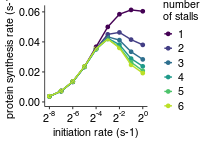

Analyze simulation results
================
rasi
30 July, 2019

-   [Load libraries](#load-libraries)
-   [Read protein count data](#read-protein-count-data)
-   [Read simulation parameters](#read-simulation-parameters)
-   [Combine all data into a single table](#combine-all-data-into-a-single-table)
-   [How does PSR vary as a function of initiation rate and number of stall sites with low stall elongation rate and medium preterm\_intact\_rate?](#how-does-psr-vary-as-a-function-of-initiation-rate-and-number-of-stall-sites-with-low-stall-elongation-rate-and-medium-preterm_intact_rate)
-   [Source data for Fig. 3C](#source-data-for-fig.-3c)

Load libraries
--------------

``` r
library(tidyverse)
library(rasilabRtemplates)
# disable scientific notation
options(scipen=999)
```

Read protein count data
-----------------------

``` r
psr_data <- read_tsv("tables/psr_stats.tsv") %>% 
  print()
```

    ## # A tibble: 90 x 6
    ##    sim_id mean_p_per_m sd_p_per_m total_p total_time     psr
    ##     <int>        <int> <chr>        <int>      <int>   <dbl>
    ##  1      0         3723 <NA>          3723     999853 0.00372
    ##  2      1         7280 <NA>          7280     999973 0.00728
    ##  3     10         7134 <NA>          7134     999900 0.00714
    ##  4     11        13648 <NA>         13648     999993 0.0136 
    ##  5     12        23481 <NA>         23481     999985 0.0235 
    ##  6     13        35552 <NA>         35552     999983 0.0356 
    ##  7     14        45035 <NA>         45035     999997 0.0450 
    ##  8     15        46326 <NA>         46326     999996 0.0463 
    ##  9     16        41519 <NA>         41519     999999 0.0415 
    ## 10     17        28391 <NA>         28391     746837 0.0380 
    ## # ... with 80 more rows

Read simulation parameters
--------------------------

``` r
annotations  <- read_tsv('sim.params.tsv', 
                         col_types = cols(x_stall = col_character(),
                                          k_elong_stall = col_character())) %>%
  mutate(preterm_intact_model = if_else(preterm_intact_rate == 0, 
                                        "trafficjam", 
                                        preterm_intact_model)) %>% 
  rename(sim_id = X1) %>%
  mutate(k_elong_stall = str_split(k_elong_stall, ",")) %>%
  mutate(k_elong_stall = map(k_elong_stall, as.numeric)) %>%
  mutate(k_elong_stall = map(k_elong_stall, function(x) unique(x))) %>%
  unnest() %>%
  mutate(x_stall = stringr::str_split(x_stall, ',')) %>%
  mutate(k_stall = as.factor(k_elong_stall / as.numeric(n_stall))) %>%
  filter(n_stall <= 6) %>% 
  mutate(n_stall = factor(n_stall)) %>%
  select(sim_id, k_init, k_elong_stall, k_stall, x_stall, n_stall,
         preterm_intact_model, preterm_intact_rate) %>%
  print()
```

    ## # A tibble: 54 x 8
    ##    sim_id  k_init k_elong_stall k_stall x_stall n_stall preterm_intact_…
    ##     <int>   <dbl>         <dbl> <fct>   <list>  <fct>   <chr>           
    ##  1      0 0.00391           0.1 0.1     <chr [… 1       hit5            
    ##  2      1 0.00781           0.1 0.1     <chr [… 1       hit5            
    ##  3      2 0.0156            0.1 0.1     <chr [… 1       hit5            
    ##  4      3 0.0312            0.1 0.1     <chr [… 1       hit5            
    ##  5      4 0.0625            0.1 0.1     <chr [… 1       hit5            
    ##  6      5 0.125             0.1 0.1     <chr [… 1       hit5            
    ##  7      6 0.25              0.1 0.1     <chr [… 1       hit5            
    ##  8      7 0.5               0.1 0.1     <chr [… 1       hit5            
    ##  9      8 1                 0.1 0.1     <chr [… 1       hit5            
    ## 10      9 0.00391           0.2 0.1     <chr [… 2       hit5            
    ## # ... with 44 more rows, and 1 more variable: preterm_intact_rate <int>

Combine all data into a single table
------------------------------------

``` r
data <- annotations %>% 
  left_join(psr_data, by = "sim_id") %>% 
  print()
```

    ## # A tibble: 54 x 13
    ##    sim_id  k_init k_elong_stall k_stall x_stall n_stall preterm_intact_…
    ##     <int>   <dbl>         <dbl> <fct>   <list>  <fct>   <chr>           
    ##  1      0 0.00391           0.1 0.1     <chr [… 1       hit5            
    ##  2      1 0.00781           0.1 0.1     <chr [… 1       hit5            
    ##  3      2 0.0156            0.1 0.1     <chr [… 1       hit5            
    ##  4      3 0.0312            0.1 0.1     <chr [… 1       hit5            
    ##  5      4 0.0625            0.1 0.1     <chr [… 1       hit5            
    ##  6      5 0.125             0.1 0.1     <chr [… 1       hit5            
    ##  7      6 0.25              0.1 0.1     <chr [… 1       hit5            
    ##  8      7 0.5               0.1 0.1     <chr [… 1       hit5            
    ##  9      8 1                 0.1 0.1     <chr [… 1       hit5            
    ## 10      9 0.00391           0.2 0.1     <chr [… 2       hit5            
    ## # ... with 44 more rows, and 6 more variables: preterm_intact_rate <int>,
    ## #   mean_p_per_m <int>, sd_p_per_m <chr>, total_p <int>, total_time <int>,
    ## #   psr <dbl>

How does PSR vary as a function of initiation rate and number of stall sites with low stall elongation rate and medium preterm\_intact\_rate?
---------------------------------------------------------------------------------------------------------------------------------------------

``` r
plot_data <- data %>% 
  filter(preterm_intact_rate == 1 & k_stall == 0.1)

plot_data %>% 
  ggplot(aes(x = k_init, y = psr, color = n_stall, group = n_stall)) +
  geom_point(size = 1) + geom_line(size = 0.5) +
  scale_x_continuous(trans = "log2",
                     breaks = scales::trans_breaks("log2", function(x) 2^x),
                     labels = scales::trans_format("log2", scales::math_format(2^.x)),
                     limits = c(2^-8, 2^0)) +
  scale_y_continuous(limits = c(0, NA)) +
  guides(color = guide_legend(
                 keywidth=0.1,
                 keyheight=0.15,
                 default.unit="inch")
      )  + 
  viridis::scale_color_viridis(discrete = T, end = 0.9) +
  # scale_shape_manual(values = c(0, 1, 2, 5, 6)) +                                                  
  labs(x = "initiation rate (s-1)", y = "protein synthesis rate (s-1)",
       color = "number\nof stalls", shape = "") +
  theme(legend.key.height = unit(0.2, "in"))                     
```



``` r
ggsave('figures/psr_csat_effect_of_num_stalls.pdf') 
```

Source data for Fig. 3C
=======================

``` r
plot_data %>% 
  select(n_stall, k_init, psr) %>% 
  knitr::kable()
```

| n\_stall |    k\_init|       psr|
|:---------|----------:|---------:|
| 1        |  0.0039062|  0.003724|
| 1        |  0.0078125|  0.007280|
| 1        |  0.0156250|  0.013378|
| 1        |  0.0312500|  0.023417|
| 1        |  0.0625000|  0.036739|
| 1        |  0.1250000|  0.049985|
| 1        |  0.2500000|  0.058442|
| 1        |  0.5000000|  0.061305|
| 1        |  1.0000000|  0.060412|
| 2        |  0.0039062|  0.003783|
| 2        |  0.0078125|  0.007135|
| 2        |  0.0156250|  0.013648|
| 2        |  0.0312500|  0.023481|
| 2        |  0.0625000|  0.035553|
| 2        |  0.1250000|  0.045035|
| 2        |  0.2500000|  0.046326|
| 2        |  0.5000000|  0.041519|
| 2        |  1.0000000|  0.038015|
| 3        |  0.0039062|  0.003649|
| 3        |  0.0078125|  0.007297|
| 3        |  0.0156250|  0.013465|
| 3        |  0.0312500|  0.023318|
| 3        |  0.0625000|  0.035354|
| 3        |  0.1250000|  0.043345|
| 3        |  0.2500000|  0.041182|
| 3        |  0.5000000|  0.033440|
| 3        |  1.0000000|  0.028347|
| 4        |  0.0039062|  0.003722|
| 4        |  0.0078125|  0.007153|
| 4        |  0.0156250|  0.013363|
| 4        |  0.0312500|  0.023306|
| 4        |  0.0625000|  0.035036|
| 4        |  0.1250000|  0.042452|
| 4        |  0.2500000|  0.038158|
| 4        |  0.5000000|  0.028869|
| 4        |  1.0000000|  0.023725|
| 5        |  0.0039062|  0.003750|
| 5        |  0.0078125|  0.007219|
| 5        |  0.0156250|  0.013525|
| 5        |  0.0312500|  0.023497|
| 5        |  0.0625000|  0.035256|
| 5        |  0.1250000|  0.041879|
| 5        |  0.2500000|  0.036454|
| 5        |  0.5000000|  0.026476|
| 5        |  1.0000000|  0.020762|
| 6        |  0.0039062|  0.003779|
| 6        |  0.0078125|  0.007300|
| 6        |  0.0156250|  0.013627|
| 6        |  0.0312500|  0.023620|
| 6        |  0.0625000|  0.035599|
| 6        |  0.1250000|  0.041983|
| 6        |  0.2500000|  0.035981|
| 6        |  0.5000000|  0.024722|
| 6        |  1.0000000|  0.019223|
