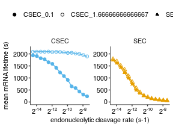

Analyze simulation results
================
rasi
01 January, 2019

-   [Load libraries](#load-libraries)
-   [Read protein count data](#read-protein-count-data)
-   [Read mRNA lifetime data](#read-mrna-lifetime-data)
-   [Read simulation parameters](#read-simulation-parameters)
-   [Combine all data into a single table](#combine-all-data-into-a-single-table)
-   [mRNA lifetime as a function of endonucleolytic cleavage rate](#mrna-lifetime-as-a-function-of-endonucleolytic-cleavage-rate)

Load libraries
--------------

``` r
library(tidyverse)
library(rasilabRtemplates)
# disable scientific notation
options(scipen=999)

cleave_model_names <- c(
  "hit5" = "CSEC",
  "simple" = "SEC",
  "trafficjam" = "TJ"
)
```

Read protein count data
=======================

``` r
psr_data <- read_tsv("tables/psr_stats.tsv") %>% 
  print()
```

    ## # A tibble: 60 x 6
    ##    sim_id mean_p_per_m sd_p_per_m total_p total_time    psr
    ##     <int>        <int>      <int>   <int>      <int>  <dbl>
    ##  1      0           92         50   94349     999999 0.0943
    ##  2      1           98         41   93545     999999 0.0935
    ##  3     10           47         41   47172    1000000 0.0472
    ##  4     11           76         37   79117     999998 0.0791
    ##  5     12           36         35   35494     999999 0.0355
    ##  6     13           72         37   67725     999999 0.0677
    ##  7     14           25         24   25745     998585 0.0258
    ##  8     15           63         37   60955     999992 0.0610
    ##  9     16           20         17   19614     999999 0.0196
    ## 10     17           56         36   55675     999987 0.0557
    ## # ... with 50 more rows

Read mRNA lifetime data
=======================

``` r
lifetime_data <- read_tsv("tables/mrna_lifetime_stats.tsv") %>% 
  mutate(se_lifetime = sd_lifetime / sqrt(n_mrna)) %>% 
  print()
```

    ## # A tibble: 60 x 5
    ##    sim_id mean_lifetime sd_lifetime n_mrna se_lifetime
    ##     <int>         <int>       <int>  <int>       <dbl>
    ##  1      0          1735         652   1018       20.4 
    ##  2      1          1937         499    948       16.2 
    ##  3     10           740         633    978       20.2 
    ##  4     11          1587         757   1030       23.6 
    ##  5     12           488         466    978       14.9 
    ##  6     13          1421         805    931       26.4 
    ##  7     14           351         319    991       10.1 
    ##  8     15          1228         811    950       26.3 
    ##  9     16           265         230    978        7.35
    ## 10     17          1080         819    991       26.0 
    ## # ... with 50 more rows

Read simulation parameters
==========================

``` r
sim_params <- read_tsv("sim.params.tsv") %>% 
  rename(sim_id = X1) %>% 
  mutate(k_elong_stall = str_split(k_elong_stall, ",")) %>%
  mutate(k_elong_stall = map(k_elong_stall, as.numeric)) %>%
  mutate(k_elong_stall = map(k_elong_stall, function(x) unique(x))) %>%
  unnest() %>%
  mutate(x_stall = stringr::str_split(x_stall, ',')) %>%
  mutate(k_stall = k_elong_stall / as.numeric(n_stall)) %>%
  select(sim_id, cleave_rate, cleave_model, k_stall) %>% 
  print()
```

    ## # A tibble: 60 x 4
    ##    sim_id cleave_rate cleave_model k_stall
    ##     <int>       <dbl> <chr>          <dbl>
    ##  1      0   0.0000440 simple         0.100
    ##  2      1   0.0000440 hit5           0.100
    ##  3      2   0.0000620 simple         0.100
    ##  4      3   0.0000620 hit5           0.100
    ##  5      4   0.0000880 simple         0.100
    ##  6      5   0.0000880 hit5           0.100
    ##  7      6   0.000125  simple         0.100
    ##  8      7   0.000125  hit5           0.100
    ##  9      8   0.000177  simple         0.100
    ## 10      9   0.000177  hit5           0.100
    ## # ... with 50 more rows

``` r
annotations <- list.files("output/", pattern = "params.tsv.gz$", full.names = T) %>% 
  enframe("sno", "file") %>% 
  mutate(sim_id = str_extract(file, "(?<=tasep_)[[:digit:]]+")) %>% 
  mutate(data = map(file, read_tsv)) %>% 
  select(-file, -sno) %>% 
  unnest() %>% 
  type_convert() %>%
  # retain only parameters that are varied, the others are for checking
  group_by(parameter) %>%
  mutate(vary = if_else(length(unique(value)) > 1, T, F)) %>%
  ungroup() %>%
  filter(vary == T) %>%
  select(-vary) %>%
  spread(parameter, value) %>%
  left_join(sim_params, by = "sim_id") %>% 
  print()
```

    ## # A tibble: 60 x 13
    ##    sim_id k_cleave_5_hit k_cleave_both_hit k_cleave_no_hit k_elong_stall_1
    ##     <int>          <dbl>             <dbl>           <dbl>           <dbl>
    ##  1      0      0.0000440         0.              0.0000440           0.600
    ##  2      1      0.0000440         0.0000440       0.                  0.600
    ##  3      2      0.0000620         0.              0.0000620           0.600
    ##  4      3      0.0000620         0.0000620       0.                  0.600
    ##  5      4      0.0000880         0.              0.0000880           0.600
    ##  6      5      0.0000880         0.0000880       0.                  0.600
    ##  7      6      0.000125          0.              0.000125            0.600
    ##  8      7      0.000125          0.000125        0.                  0.600
    ##  9      8      0.000177          0.              0.000177            0.600
    ## 10      9      0.000177          0.000177        0.                  0.600
    ## # ... with 50 more rows, and 8 more variables: k_elong_stall_2 <dbl>,
    ## #   k_elong_stall_3 <dbl>, k_elong_stall_4 <dbl>, k_elong_stall_5 <dbl>,
    ## #   k_elong_stall_6 <dbl>, cleave_rate <dbl>, cleave_model <chr>,
    ## #   k_stall <dbl>

Combine all data into a single table
====================================

``` r
data <- annotations %>% 
  left_join(psr_data, by = "sim_id") %>% 
  left_join(lifetime_data, by = "sim_id") %>% 
  print()
```

    ## # A tibble: 60 x 22
    ##    sim_id k_cleave_5_hit k_cleave_both_hit k_cleave_no_hit k_elong_stall_1
    ##     <int>          <dbl>             <dbl>           <dbl>           <dbl>
    ##  1      0      0.0000440         0.              0.0000440           0.600
    ##  2      1      0.0000440         0.0000440       0.                  0.600
    ##  3      2      0.0000620         0.              0.0000620           0.600
    ##  4      3      0.0000620         0.0000620       0.                  0.600
    ##  5      4      0.0000880         0.              0.0000880           0.600
    ##  6      5      0.0000880         0.0000880       0.                  0.600
    ##  7      6      0.000125          0.              0.000125            0.600
    ##  8      7      0.000125          0.000125        0.                  0.600
    ##  9      8      0.000177          0.              0.000177            0.600
    ## 10      9      0.000177          0.000177        0.                  0.600
    ## # ... with 50 more rows, and 17 more variables: k_elong_stall_2 <dbl>,
    ## #   k_elong_stall_3 <dbl>, k_elong_stall_4 <dbl>, k_elong_stall_5 <dbl>,
    ## #   k_elong_stall_6 <dbl>, cleave_rate <dbl>, cleave_model <chr>,
    ## #   k_stall <dbl>, mean_p_per_m <int>, sd_p_per_m <int>, total_p <int>,
    ## #   total_time <int>, psr <dbl>, mean_lifetime <int>, sd_lifetime <int>,
    ## #   n_mrna <int>, se_lifetime <dbl>

mRNA lifetime as a function of endonucleolytic cleavage rate
============================================================

``` r
plot_data <- data %>% 
  mutate(model = cleave_model_names[cleave_model]) %>% 
  mutate(model_stall = paste0(model, "_", k_stall))

plot_data %>%
  ggplot(aes(x = cleave_rate, y = mean_lifetime, color = model, shape = model_stall)) +
  facet_wrap(~model, ncol = 2, scales = "free") +
  scale_y_continuous(limits = c(0, 2200)) +
  geom_line() +
  geom_point(size = 1.5) +
  scale_x_continuous(trans = "log2",
                     labels = scales::trans_format("log2", scales::math_format(2^.x)),
                     breaks = scales::trans_breaks("log2", function(x) 2^x, n = 5)) +
  scale_color_manual(values = cbPalette[c(3,2)]) +
  scale_shape_manual(values = c(19, 1, 17, 2)) +
  labs(x = "endonucleolytic cleavage rate (s-1)", 
       y = "mean mRNA lifetime (s)", color = "", shape = "") +
  theme(legend.position = "top")
```




``` r
ggsave("figures/mrna_lifetime_vs_cleavage_rate.pdf", width = 3, height = 2.2)
```
