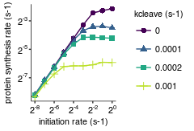

Analyze simulation results
================
rasi
30 July, 2019

-   [Load libraries](#load-libraries)
-   [Read protein count data](#read-protein-count-data)
-   [Read mRNA lifetime data](#read-mrna-lifetime-data)
-   [Read mRNA lifetime data](#read-mrna-lifetime-data-1)
-   [Read simulation parameters](#read-simulation-parameters)
-   [Combine all data into a single table](#combine-all-data-into-a-single-table)
-   [mRNA lifetime as a function of initiation rate](#mrna-lifetime-as-a-function-of-initiation-rate)
-   [Source data for Fig. 4B](#source-data-for-fig.-4b)
-   [PSR as a function of initiation rate](#psr-as-a-function-of-initiation-rate)
-   [Source data for Fig. 4C](#source-data-for-fig.-4c)
-   [PSR as a function of initiation rate for different cleavage rates in SEC model](#psr-as-a-function-of-initiation-rate-for-different-cleavage-rates-in-sec-model)
-   [Source data for S3 Fig panel A](#source-data-for-s3-fig-panel-a)

Load libraries
--------------

``` r
library(tidyverse)
library(rasilabRtemplates)
# disable scientific notation
options(scipen=999)

cleave_model_names <- c(
  "hit5" = "CSEC",
  "simple" = "SEC",
  "trafficjam" = "TJ"
)
```

Read protein count data
=======================

``` r
psr_data <- read_tsv("tables/psr_stats.tsv") %>% 
  print()
```

    ## # A tibble: 270 x 6
    ##    sim_id mean_p_per_m sd_p_per_m total_p total_time     psr
    ##     <int>        <int>      <int>   <int>      <int>   <dbl>
    ##  1      0            3          2    3333     999764 0.00333
    ##  2      1            3          2    3298     999793 0.00330
    ##  3     10            3          2    3409     999929 0.00341
    ##  4    100           26         13   27414     999976 0.0274 
    ##  5    101           25         13   25862     999997 0.0259 
    ##  6    102           23         13   24638     995388 0.0248 
    ##  7    103           12         10   13504     999411 0.0135 
    ##  8    104            3          2    3239     997123 0.00325
    ##  9    105           26         13   27416     999966 0.0274 
    ## 10    106           26         13   26896     999998 0.0269 
    ## # ... with 260 more rows

Read mRNA lifetime data
=======================

``` r
lifetime_data <- read_tsv("tables/mrna_lifetime_stats.tsv") %>% 
  mutate(se_lifetime = sd_lifetime / sqrt(n_mrna)) %>% 
  print()
```

    ## # A tibble: 270 x 5
    ##    sim_id mean_lifetime sd_lifetime n_mrna se_lifetime
    ##     <int>         <int>       <int>  <int>       <dbl>
    ##  1      0          2104         277   1004        8.74
    ##  2      1          2069         347    973       11.1 
    ##  3     10          2105         269   1043        8.33
    ##  4    100          2096         275   1019        8.61
    ##  5    101          1874         568    999       18.0 
    ##  6    102          1738         670   1063       20.5 
    ##  7    103           700         605   1051       18.7 
    ##  8    104           152         128    962        4.13
    ##  9    105          2080         281   1026        8.77
    ## 10    106          2105         294   1001        9.29
    ## # ... with 260 more rows

Read mRNA lifetime data
=======================

``` r
collision_data <- read_tsv("tables/collision_stats.tsv") %>% 
  print()
```

    ## # A tibble: 270 x 6
    ##    sim_id mean_p_per_m sd_p_per_m total_collision total_time collision_freq
    ##     <int>        <int>      <int>           <int>      <int>          <dbl>
    ##  1      0            8          9            1855     999764       0.00186 
    ##  2      1            7          7            1701     999793       0.00170 
    ##  3     10            6          7             474     999203       0.000474
    ##  4    100           35         42           31140     999976       0.0311  
    ##  5    101           37         42           31755     999997       0.0318  
    ##  6    102           35         42           31058     995388       0.0312  
    ##  7    103           29         31           23034     999411       0.0230  
    ##  8    104           13         14            6282     995477       0.00631 
    ##  9    105           37         44           32709     999966       0.0327  
    ## 10    106           35         40           30169     999998       0.0302  
    ## # ... with 260 more rows

Read simulation parameters
==========================

``` r
sim_params <- read_tsv("sim.params.tsv") %>% 
  rename(sim_id = X1) %>% 
  mutate(k_elong_stall = str_split(k_elong_stall, ",")) %>%
  mutate(k_elong_stall = map(k_elong_stall, as.numeric)) %>%
  mutate(k_elong_stall = map(k_elong_stall, function(x) unique(x))) %>%
  unnest() %>%
  mutate(x_stall = stringr::str_split(x_stall, ',')) %>%
  mutate(k_stall = round(k_elong_stall / as.numeric(n_stall), 2)) %>%
  select(sim_id, cleave_rate, cleave_model, k_stall) %>%
  print()
```

    ## # A tibble: 270 x 4
    ##    sim_id cleave_rate cleave_model k_stall
    ##     <int>       <dbl> <chr>          <dbl>
    ##  1      0      0      simple          0.02
    ##  2      1      0.0001 simple          0.02
    ##  3      2      0.0002 simple          0.02
    ##  4      3      0.001  simple          0.02
    ##  5      4      0.005  simple          0.02
    ##  6      5      0.0001 hit5            0.02
    ##  7      6      0.0002 hit5            0.02
    ##  8      7      0.001  hit5            0.02
    ##  9      8      0.005  hit5            0.02
    ## 10      9      0.01   hit5            0.02
    ## # ... with 260 more rows

``` r
annotations <- list.files("output/", pattern = "params.tsv.gz$", full.names = T) %>%
  enframe("sno", "file") %>%
  mutate(sim_id = str_extract(file, "(?<=tasep_)[[:digit:]]+")) %>%
  mutate(data = map(file, read_tsv)) %>%
  select(-file, -sno) %>%
  unnest() %>%
  type_convert() %>%
  # retain only parameters that are varied, the others are for checking
  group_by(parameter) %>%
  mutate(vary = if_else(length(unique(value)) > 1, T, F)) %>%
  ungroup() %>%
  filter(vary == T) %>%
  select(-vary) %>%
  spread(parameter, value) %>%
  left_join(sim_params, by = "sim_id") %>%
  print()
```

    ## # A tibble: 270 x 14
    ##    sim_id k_cleave_5_hit k_cleave_both_h… k_cleave_no_hit k_elong_stall_1
    ##     <int>          <dbl>            <dbl>           <dbl>           <dbl>
    ##  1      0         0                0               0                 0.12
    ##  2      1         0.0001           0               0.0001            0.12
    ##  3      2         0.0002           0               0.0002            0.12
    ##  4      3         0.001            0               0.001             0.12
    ##  5      4         0.005            0               0.005             0.12
    ##  6      5         0.0001           0.0001          0                 0.12
    ##  7      6         0.0002           0.0002          0                 0.12
    ##  8      7         0.001            0.001           0                 0.12
    ##  9      8         0.005            0.005           0                 0.12
    ## 10      9         0.01             0.01            0                 0.12
    ## # ... with 260 more rows, and 9 more variables: k_elong_stall_2 <dbl>,
    ## #   k_elong_stall_3 <dbl>, k_elong_stall_4 <dbl>, k_elong_stall_5 <dbl>,
    ## #   k_elong_stall_6 <dbl>, k_init <dbl>, cleave_rate <dbl>,
    ## #   cleave_model <chr>, k_stall <dbl>

Combine all data into a single table
====================================

``` r
data <- annotations %>% 
  left_join(psr_data, by = "sim_id") %>% 
  left_join(lifetime_data, by = "sim_id") %>% 
  left_join(collision_data, by = "sim_id") %>% 
  print()
```

    ## # A tibble: 270 x 28
    ##    sim_id k_cleave_5_hit k_cleave_both_h… k_cleave_no_hit k_elong_stall_1
    ##     <int>          <dbl>            <dbl>           <dbl>           <dbl>
    ##  1      0         0                0               0                 0.12
    ##  2      1         0.0001           0               0.0001            0.12
    ##  3      2         0.0002           0               0.0002            0.12
    ##  4      3         0.001            0               0.001             0.12
    ##  5      4         0.005            0               0.005             0.12
    ##  6      5         0.0001           0.0001          0                 0.12
    ##  7      6         0.0002           0.0002          0                 0.12
    ##  8      7         0.001            0.001           0                 0.12
    ##  9      8         0.005            0.005           0                 0.12
    ## 10      9         0.01             0.01            0                 0.12
    ## # ... with 260 more rows, and 23 more variables: k_elong_stall_2 <dbl>,
    ## #   k_elong_stall_3 <dbl>, k_elong_stall_4 <dbl>, k_elong_stall_5 <dbl>,
    ## #   k_elong_stall_6 <dbl>, k_init <dbl>, cleave_rate <dbl>,
    ## #   cleave_model <chr>, k_stall <dbl>, mean_p_per_m.x <int>,
    ## #   sd_p_per_m.x <int>, total_p <int>, total_time.x <int>, psr <dbl>,
    ## #   mean_lifetime <int>, sd_lifetime <int>, n_mrna <int>,
    ## #   se_lifetime <dbl>, mean_p_per_m.y <int>, sd_p_per_m.y <int>,
    ## #   total_collision <int>, total_time.y <int>, collision_freq <dbl>

mRNA lifetime as a function of initiation rate
==============================================

``` r
plot_data <- data %>% 
  filter(cleave_rate == 0.001 & k_stall == 0.1) %>%
  mutate(model = cleave_model_names[cleave_model]) %>%
  print()
```

    ## # A tibble: 18 x 29
    ##    sim_id k_cleave_5_hit k_cleave_both_h… k_cleave_no_hit k_elong_stall_1
    ##     <int>          <dbl>            <dbl>           <dbl>           <dbl>
    ##  1     13          0.001            0               0.001             0.6
    ##  2     17          0.001            0.001           0                 0.6
    ##  3     43          0.001            0               0.001             0.6
    ##  4     47          0.001            0.001           0                 0.6
    ##  5     73          0.001            0               0.001             0.6
    ##  6     77          0.001            0.001           0                 0.6
    ##  7    103          0.001            0               0.001             0.6
    ##  8    107          0.001            0.001           0                 0.6
    ##  9    133          0.001            0               0.001             0.6
    ## 10    137          0.001            0.001           0                 0.6
    ## 11    163          0.001            0               0.001             0.6
    ## 12    167          0.001            0.001           0                 0.6
    ## 13    193          0.001            0               0.001             0.6
    ## 14    197          0.001            0.001           0                 0.6
    ## 15    223          0.001            0               0.001             0.6
    ## 16    227          0.001            0.001           0                 0.6
    ## 17    253          0.001            0               0.001             0.6
    ## 18    257          0.001            0.001           0                 0.6
    ## # ... with 24 more variables: k_elong_stall_2 <dbl>,
    ## #   k_elong_stall_3 <dbl>, k_elong_stall_4 <dbl>, k_elong_stall_5 <dbl>,
    ## #   k_elong_stall_6 <dbl>, k_init <dbl>, cleave_rate <dbl>,
    ## #   cleave_model <chr>, k_stall <dbl>, mean_p_per_m.x <int>,
    ## #   sd_p_per_m.x <int>, total_p <int>, total_time.x <int>, psr <dbl>,
    ## #   mean_lifetime <int>, sd_lifetime <int>, n_mrna <int>,
    ## #   se_lifetime <dbl>, mean_p_per_m.y <int>, sd_p_per_m.y <int>,
    ## #   total_collision <int>, total_time.y <int>, collision_freq <dbl>,
    ## #   model <chr>

``` r
plot_data %>%
  ggplot(aes(x = k_init, y = mean_lifetime, color = model, shape = model)) +
  geom_point(size = 2) +
  geom_line() +
  scale_x_continuous(trans = "log2",
                     labels = scales::trans_format("log2", scales::math_format(2^.x)),
                     breaks = 2^(seq(-8,0,2))) +
  scale_color_manual(values = cbPalette[c(3,2)]) +
  scale_shape_manual(values = c(19, 17)) +
  labs(x = "initiation rate (s-1)", y = "mean mRNA lifetime (s)", color = "", shape = "") +
  theme(legend.position = "top")
```


``` r
ggsave("figures/mrna_lifetime_vs_initiation_rate.pdf", width = 1.7, height = 2)
```

Source data for Fig. 4B
=======================

``` r
plot_data %>% 
  select(model, k_init, mean_lifetime) %>% 
  knitr::kable()
```

| model |    k\_init|  mean\_lifetime|
|:------|----------:|---------------:|
| SEC   |  0.0039062|            1823|
| CSEC  |  0.0039062|            2121|
| SEC   |  0.0078125|            1625|
| CSEC  |  0.0078125|            2107|
| SEC   |  0.0156250|            1224|
| CSEC  |  0.0156250|            2094|
| SEC   |  0.0312500|             700|
| CSEC  |  0.0312500|            2071|
| SEC   |  0.0625000|             337|
| CSEC  |  0.0625000|            1946|
| SEC   |  0.1250000|             181|
| CSEC  |  0.1250000|             916|
| SEC   |  0.2500000|             127|
| CSEC  |  0.2500000|             196|
| SEC   |  0.5000000|             104|
| CSEC  |  0.5000000|             121|
| SEC   |  1.0000000|              91|
| CSEC  |  1.0000000|              96|

PSR as a function of initiation rate
====================================

``` r
plot_data <- data %>% 
  filter(cleave_rate == 0.001 & k_stall == 0.1) %>% 
  mutate(model = cleave_model_names[cleave_model]) 

plot_data %>%
  ggplot(aes(x = k_init, y = psr, color = model, shape = model)) +
  geom_point(size = 2) +
  geom_line() +
  scale_x_continuous(trans = "log2",
                     labels = scales::trans_format("log2", scales::math_format(2^.x)),
                     breaks = 2^(seq(-8,0,2))) +
  scale_y_continuous(limits = c(0, NA)) +
  scale_color_manual(values = cbPalette[c(3,2)]) +
  scale_shape_manual(values = c(19,17)) +
  labs(x = "initiation rate (s-1)", y = "protein synthesis rate (s-1)", color = "", shape = "") +
  theme(legend.position = "top")
```


``` r
ggsave("figures/psr_vs_initiation_rate.pdf", width = 1.6, height = 2)
```

Source data for Fig. 4C
=======================

``` r
plot_data %>% 
  select(model, k_init, psr) %>% 
  knitr::kable()
```

| model |    k\_init|       psr|
|:------|----------:|---------:|
| SEC   |  0.0039062|  0.003098|
| CSEC  |  0.0039062|  0.003503|
| SEC   |  0.0078125|  0.005745|
| CSEC  |  0.0078125|  0.006808|
| SEC   |  0.0156250|  0.009386|
| CSEC  |  0.0156250|  0.013802|
| SEC   |  0.0312500|  0.013512|
| CSEC  |  0.0312500|  0.027153|
| SEC   |  0.0625000|  0.013941|
| CSEC  |  0.0625000|  0.050775|
| SEC   |  0.1250000|  0.013965|
| CSEC  |  0.1250000|  0.045152|
| SEC   |  0.2500000|  0.014688|
| CSEC  |  0.2500000|  0.020907|
| SEC   |  0.5000000|  0.016598|
| CSEC  |  0.5000000|  0.019538|
| SEC   |  1.0000000|  0.016410|
| CSEC  |  1.0000000|  0.020357|

PSR as a function of initiation rate for different cleavage rates in SEC model
==============================================================================

``` r
plot_data <- data %>% 
  filter(k_stall == 0.1 & cleave_rate <= 0.001) %>% 
  filter(cleave_model == "simple")

plot_data %>%
  ggplot(aes(x = k_init, y = psr, color = as.factor(cleave_rate), shape = as.factor(cleave_rate))) +
  geom_point(size = 2) +
  geom_line() +
  scale_x_continuous(trans = "log2",
                     labels = scales::trans_format("log2", scales::math_format(2^.x)),
                     breaks = 2^(seq(-8,0,2))) +
  scale_y_continuous(trans = "log2",
                     labels = scales::trans_format("log2", scales::math_format(2^.x))) +
  viridis::scale_color_viridis(discrete = T, end = 0.9) +
  labs(x = "initiation rate (s-1)", y = "protein synthesis rate (s-1)", 
       color = "kcleave (s-1)", shape = "kcleave (s-1)") +

ggsave("figures/psr_vs_initiation_rate_vary_cleave_rate.pdf", 
       width = 2.5, height = 1.7)
```



Source data for S3 Fig panel A
==============================

``` r
plot_data %>% 
  select(cleave_rate, k_init, psr) %>% 
  knitr::kable()
```

|  cleave\_rate|    k\_init|       psr|
|-------------:|----------:|---------:|
|        0.0000|  0.0039062|  0.003409|
|        0.0001|  0.0039062|  0.003451|
|        0.0002|  0.0039062|  0.003329|
|        0.0010|  0.0039062|  0.003098|
|        0.0000|  0.0078125|  0.006711|
|        0.0001|  0.0078125|  0.006934|
|        0.0002|  0.0078125|  0.006451|
|        0.0010|  0.0078125|  0.005745|
|        0.0000|  0.0156250|  0.013443|
|        0.0001|  0.0156250|  0.013153|
|        0.0002|  0.0156250|  0.012798|
|        0.0010|  0.0156250|  0.009386|
|        0.0000|  0.0312500|  0.027415|
|        0.0001|  0.0312500|  0.025862|
|        0.0002|  0.0312500|  0.024752|
|        0.0010|  0.0312500|  0.013512|
|        0.0000|  0.0625000|  0.053354|
|        0.0001|  0.0625000|  0.049005|
|        0.0002|  0.0625000|  0.040060|
|        0.0010|  0.0625000|  0.013941|
|        0.0000|  0.1250000|  0.102953|
|        0.0001|  0.1250000|  0.077481|
|        0.0002|  0.1250000|  0.056156|
|        0.0010|  0.1250000|  0.013965|
|        0.0000|  0.2500000|  0.183772|
|        0.0001|  0.2500000|  0.094418|
|        0.0002|  0.2500000|  0.056458|
|        0.0010|  0.2500000|  0.014688|
|        0.0000|  0.5000000|  0.205912|
|        0.0001|  0.5000000|  0.095976|
|        0.0002|  0.5000000|  0.055083|
|        0.0010|  0.5000000|  0.016598|
|        0.0000|  1.0000000|  0.226629|
|        0.0001|  1.0000000|  0.089002|
|        0.0002|  1.0000000|  0.053578|
|        0.0010|  1.0000000|  0.016410|
