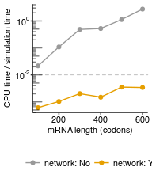
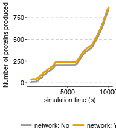

Analyze simulation results
================
rasi
02 January, 2019

-   [Goal](#goal)
-   [Strategy](#strategy)
-   [Load libraries](#load-libraries)
-   [Read `rxns.tsv.gz` log files](#read-rxns.tsv.gz-log-files)
-   [Read the simulation parameters](#read-the-simulation-parameters)
-   [Get the CPU time / simulation time for each simulation](#get-the-cpu-time-simulation-time-for-each-simulation)
-   [Plot CPU time / simulation time as a function of mRNA length for different simulation strategies](#plot-cpu-time-simulation-time-as-a-function-of-mrna-length-for-different-simulation-strategies)
-   [Plot number of proteins vs. time with and without network](#plot-number-of-proteins-vs.-time-with-and-without-network)

Goal
====

See how simulation time changes depending on whether we consider polymeric nature of mRNA and whether we infer the dependency graph before simulation.

Strategy
========

I am going to parse the simulation times straight from the `rxn.tsv.gz` files that record the simulations.

Load libraries
==============

``` r
library(tidyverse)
library(rasilabRtemplates)
```

Read `rxns.tsv.gz` log files
============================

``` r
data <- list.files("output/", pattern = "rxns.tsv$", full.names = T) %>% 
  enframe("sno", "file") %>% 
  mutate(sim.id = str_extract(file, "(?<=tasep_)[[:digit:]]+"),
         network = str_detect(file, "connect")) %>% 
  mutate(data = map(file, read_tsv)) %>% 
  select(-file, -sno) %>% 
  unnest() %>% 
  type_convert() %>% 
  print()
```

    ## # A tibble: 371,943 x 8
    ##    sim.id network  line  cputime  time rxn                    mol   mol_id
    ##     <int> <lgl>   <int>    <dbl> <dbl> <chr>                  <chr>  <int>
    ##  1      0 FALSE       1 0.000249  491. transcription          mrna       4
    ##  2      0 FALSE       2 0.000573  492. initiation             mrna       4
    ##  3      0 FALSE      39 0.00759   495. initiation             mrna       4
    ##  4      0 FALSE      74 0.0190    496. initiation             mrna       4
    ##  5      0 FALSE     141 0.0500    499. initiation             mrna       4
    ##  6      0 FALSE     150 0.0555    499. preterm_no_hit_intact… mrna       4
    ##  7      0 FALSE     192 0.0751    501. initiation             mrna       4
    ##  8      0 FALSE     218 0.0910    501. collision_48           mrna       4
    ##  9      0 FALSE     246 0.108     502. initiation             mrna       4
    ## 10      0 FALSE     251 0.112     502. collision_55           mrna       4
    ## # ... with 371,933 more rows

Read the simulation parameters
==============================

Subset to `l_mrna` which is the only parameter that was varied.

``` r
annotations <- list.files("output/", pattern = "params.tsv.gz$", full.names = T) %>% 
  enframe("sno", "file") %>% 
  mutate(sim.id = str_extract(file, "(?<=tasep_)[[:digit:]]+"),
         network = str_detect(file, "connect")) %>% 
  mutate(data = map(file, read_tsv)) %>% 
  select(-file, -sno) %>% 
  unnest() %>% 
  type_convert() %>% 
  filter(parameter == "l_mrna") %>% 
  spread(parameter, value) %>% 
  print()
```

    ## # A tibble: 12 x 3
    ##    sim.id network l_mrna
    ##     <int> <lgl>    <dbl>
    ##  1      0 FALSE     100.
    ##  2      0 TRUE      100.
    ##  3      1 FALSE     200.
    ##  4      1 TRUE      200.
    ##  5      2 FALSE     300.
    ##  6      2 TRUE      300.
    ##  7      3 FALSE     400.
    ##  8      3 TRUE      400.
    ##  9      4 FALSE     500.
    ## 10      4 TRUE      500.
    ## 11      5 FALSE     600.
    ## 12      5 TRUE      600.

Get the CPU time / simulation time for each simulation
======================================================

``` r
plot_data <- data %>% 
  group_by(sim.id, network) %>% 
  filter(cputime == max(cputime)) %>% 
  ungroup() %>% 
  left_join(annotations, by = c("sim.id", "network")) %>% 
  mutate_if(is.logical, funs(if_else(., "Yes", "No"))) %>% 
  mutate(strategy = paste0("network: ", network)) %>% 
  group_by(strategy) %>% 
  mutate(plot_order = max(cputime / time)) %>% 
  ungroup() %>% 
  mutate(strategy = fct_reorder(strategy, desc(plot_order))) %>% 
  select(-network, -plot_order) %>% 
  print()
```

    ## # A tibble: 12 x 9
    ##    sim.id   line cputime   time rxn         mol   mol_id l_mrna strategy  
    ##     <int>  <int>   <dbl>  <dbl> <chr>       <chr>  <int>  <dbl> <fct>     
    ##  1      0 183388  217.    9994. term_no_hi… mrna   18444   100. network: …
    ##  2      0 183388    6.09  9994. term_no_hi… mrna   18444   100. network: …
    ##  3      1 210631 1088.   10000. collision_… mrna   18443   200. network: …
    ##  4      1 210631   10.4  10000. collision_… mrna   18443   200. network: …
    ##  5      2 387560 4854.   10000. collision_0 mrna   17930   300. network: …
    ##  6      2 387560   20.2  10000. collision_0 mrna   17930   300. network: …
    ##  7      3 321475 5909.   11264. transcript… mrna   17166   400. network: …
    ##  8      3 321475   16.8  11264. transcript… mrna   17166   400. network: …
    ##  9      4 181858 6000.    5300. collision_… mrna       5   500. network: …
    ## 10      4 528160   37.8  10711. transcript… mrna   19467   500. network: …
    ## 11      5 119416 6000.    2183. collision_0 mrna       5   600. network: …
    ## 12      5 528068   35.9  10523. transcript… mrna   17932   600. network: …

Plot CPU time / simulation time as a function of mRNA length for different simulation strategies
================================================================================================

``` r
plot_data %>% 
  ggplot(aes(x = l_mrna, y = cputime / time, color = strategy, group = strategy)) +
  geom_point() +
  scale_color_manual(values = cbPalette) +
  labs(x = "mRNA length (codons)", y = "CPU time / simulation time",
       color = "") +
  scale_x_continuous(breaks = scales::pretty_breaks(n=3)) +
  scale_y_continuous(trans = "log10",
                     labels = scales::trans_format("log10", scales::math_format(10^.x)),
                     breaks = scales::trans_breaks("log2", function(x) 10^x, n = 8)) +
  annotation_logticks(sides = "l", alpha = 0.5) +
  theme(legend.position = "bottom", 
        panel.grid.major.y = element_line(color = "grey", linetype = "dashed")) +
  guides(color = guide_legend(title = "")) +
  geom_line()
```



``` r
ggsave("figures/cputime_per_simulation_time.pdf")
```

Plot number of proteins vs. time with and without network
=========================================================

``` r
plot_data <- data %>% 
  left_join(annotations, by = c("sim.id", "network")) %>% 
  filter(l_mrna == 300) %>% 
  filter(str_detect(rxn, "^term")) %>% 
  select(network, time) %>% 
  group_by(network) %>% 
  mutate(n_protein = 1:n()) %>% 
  ungroup() %>% 
  mutate(n_protein = if_else(network == T, n_protein + 30, as.numeric(n_protein))) %>% 
  mutate_if(is.logical, funs(if_else(., "Yes", "No"))) %>% 
  mutate(strategy = paste0("network: ", network)) %>% 
  print()
```

    ## # A tibble: 1,686 x 4
    ##    network  time n_protein strategy   
    ##    <chr>   <dbl>     <dbl> <chr>      
    ##  1 No       529.        1. network: No
    ##  2 No       546.        2. network: No
    ##  3 No       550.        3. network: No
    ##  4 No       558.        4. network: No
    ##  5 No       584.        5. network: No
    ##  6 No       590.        6. network: No
    ##  7 No       597.        7. network: No
    ##  8 No       609.        8. network: No
    ##  9 No       610.        9. network: No
    ## 10 No       625.       10. network: No
    ## # ... with 1,676 more rows

``` r
plot_data %>% 
  ggplot(aes(x = time, y = n_protein, color = strategy)) +
  geom_line(size = 1) +
  scale_color_manual(values = cbPalette) +
  labs(x = "simulation time (s)", y = "Number of proteins produced",
       color = "") +
  scale_x_continuous(breaks = scales::pretty_breaks(n=3)) +
  theme(legend.position = "bottom",
        panel.grid.major.y = element_line(color = "grey", linetype = "dashed")) +
  guides(color = guide_legend(title = "")) +
  geom_line()
```



``` r
ggsave("figures/n_proteins_vs_simulation_time.pdf")
```
