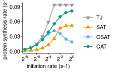
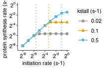
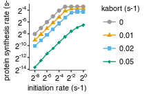
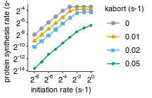
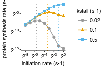
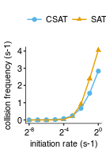
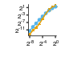

Analyze simulation results
================
rasi
01 January, 2019

-   [Load libraries](#load-libraries)
-   [Read protein count data](#read-protein-count-data)
-   [Read collision data](#read-collision-data)
    -   [Read simulation parameters](#read-simulation-parameters)
    -   [Combine all data into a single table](#combine-all-data-into-a-single-table)
    -   [How does PSR vary as a function of initiation rate in all models with low stall elongation rate and medium preterm\_intact\_rate?](#how-does-psr-vary-as-a-function-of-initiation-rate-in-all-models-with-low-stall-elongation-rate-and-medium-preterm_intact_rate)
-   [Change in maximal protein synthesis as a function of stall elongation rate in TJ model](#change-in-maximal-protein-synthesis-as-a-function-of-stall-elongation-rate-in-tj-model)
-   [Change in protein synthesis as a function of abort rate in SAT model](#change-in-protein-synthesis-as-a-function-of-abort-rate-in-sat-model)
-   [Change in protein synthesis as a function of stall elongation rate in SAT model](#change-in-protein-synthesis-as-a-function-of-stall-elongation-rate-in-sat-model)
-   [Change in protein synthesis as a function of stall elongation rate in CSAT model](#change-in-protein-synthesis-as-a-function-of-stall-elongation-rate-in-csat-model)
-   [Collision rate as a function of initiation rate](#collision-rate-as-a-function-of-initiation-rate)
-   [Same as above but with log Y-scale](#same-as-above-but-with-log-y-scale)

Load libraries
--------------

``` r
library(tidyverse)
library(rasilabRtemplates)
# disable scientific notation
options(scipen=999)

model_names <- c(
  "hit3" = "CAT",
  "hit5" = "CSAT",
  "simple" = "SAT",
  "trafficjam" = "TJ"
 )
```

Read protein count data
=======================

``` r
psr_data <- read_tsv("tables/psr_stats.tsv") %>% 
  print()
```

    ## # A tibble: 405 x 6
    ##    sim_id mean_p_per_m sd_p_per_m total_p total_time     psr
    ##     <int>        <int> <chr>        <int>      <int>   <dbl>
    ##  1      0         3851 <NA>          3851     999918 0.00385
    ##  2      1         1275 <NA>          1275     999668 0.00128
    ##  3     10         3245 <NA>          3245     999981 0.00324
    ##  4    100         8886 <NA>          8886     999945 0.00889
    ##  5    101         7613 <NA>          7613     999983 0.00761
    ##  6    102         8844 <NA>          8844     999817 0.00885
    ##  7    103         7412 <NA>          7412     999992 0.00741
    ##  8    104         8673 <NA>          8673     999939 0.00867
    ##  9    105        15427 <NA>         15427     999988 0.0154 
    ## 10    106         7207 <NA>          7207     999956 0.00721
    ## # ... with 395 more rows

Read collision data
===================

``` r
collision_data <- read_tsv("tables/collision_stats.tsv") %>% 
  print()
```

    ## # A tibble: 405 x 6
    ##    sim_id mean_p_per_m sd_p_per_m total_collision total_time
    ##     <int>        <int> <chr>                <int>      <int>
    ##  1      0         3754 <NA>                  3754     999918
    ##  2      1         1258 <NA>                  1258     999668
    ##  3     10          965 <NA>                   965     999981
    ##  4    100        11022 <NA>                 11022     999945
    ##  5    101        11178 <NA>                 11178     999983
    ##  6    102         9936 <NA>                  9936     999817
    ##  7    103         9298 <NA>                  9298     999992
    ##  8    104         7737 <NA>                  7737     999939
    ##  9    105        15350 <NA>                 15350     999988
    ## 10    106         7637 <NA>                  7637     999956
    ## # ... with 395 more rows, and 1 more variable: collision_freq <dbl>

Read simulation parameters
--------------------------

``` r
annotations  <- read_tsv('sim.params.tsv', 
                         col_types = cols(x_stall = col_character(),
                                          k_elong_stall = col_character())) %>%
  mutate(preterm_intact_model = if_else(preterm_intact_rate == 0, 
                                        "trafficjam", 
                                        preterm_intact_model)) %>% 
  rename(sim_id = X1) %>%
  mutate(k_elong_stall = str_split(k_elong_stall, ",")) %>%
  mutate(k_elong_stall = map(k_elong_stall, as.numeric)) %>%
  mutate(k_elong_stall = map(k_elong_stall, function(x) unique(x))) %>%
  unnest() %>%
  mutate(x_stall = stringr::str_split(x_stall, ',')) %>%
  mutate(k_stall = k_elong_stall / as.numeric(n_stall)) %>%
  mutate(n_stall = factor(n_stall)) %>%
  select(sim_id, k_init, k_elong_stall, k_stall, x_stall, n_stall,
         preterm_intact_model, preterm_intact_rate) %>%
  print()
```

    ## # A tibble: 405 x 8
    ##    sim_id  k_init k_elong_stall k_stall x_stall  n_stall preterm_intact_m…
    ##     <int>   <dbl>         <dbl>   <dbl> <list>   <fct>   <chr>            
    ##  1      0 0.00391         0.120  0.0200 <chr [6… 6       trafficjam       
    ##  2      1 0.00391         0.120  0.0200 <chr [6… 6       simple           
    ##  3      2 0.00391         0.120  0.0200 <chr [6… 6       simple           
    ##  4      3 0.00391         0.120  0.0200 <chr [6… 6       hit5             
    ##  5      4 0.00391         0.120  0.0200 <chr [6… 6       hit3             
    ##  6      5 0.00391         0.120  0.0200 <chr [6… 6       simple           
    ##  7      6 0.00391         0.120  0.0200 <chr [6… 6       simple           
    ##  8      7 0.00391         0.120  0.0200 <chr [6… 6       hit5             
    ##  9      8 0.00391         0.120  0.0200 <chr [6… 6       hit3             
    ## 10      9 0.00391         0.120  0.0200 <chr [6… 6       hit5             
    ## # ... with 395 more rows, and 1 more variable: preterm_intact_rate <dbl>

Combine all data into a single table
------------------------------------

``` r
data <- annotations %>% 
  left_join(psr_data, by = "sim_id") %>% 
  left_join(collision_data, by = "sim_id") %>% 
  print()
```

    ## # A tibble: 405 x 18
    ##    sim_id  k_init k_elong_stall k_stall x_stall  n_stall preterm_intact_m…
    ##     <int>   <dbl>         <dbl>   <dbl> <list>   <fct>   <chr>            
    ##  1      0 0.00391         0.120  0.0200 <chr [6… 6       trafficjam       
    ##  2      1 0.00391         0.120  0.0200 <chr [6… 6       simple           
    ##  3      2 0.00391         0.120  0.0200 <chr [6… 6       simple           
    ##  4      3 0.00391         0.120  0.0200 <chr [6… 6       hit5             
    ##  5      4 0.00391         0.120  0.0200 <chr [6… 6       hit3             
    ##  6      5 0.00391         0.120  0.0200 <chr [6… 6       simple           
    ##  7      6 0.00391         0.120  0.0200 <chr [6… 6       simple           
    ##  8      7 0.00391         0.120  0.0200 <chr [6… 6       hit5             
    ##  9      8 0.00391         0.120  0.0200 <chr [6… 6       hit3             
    ## 10      9 0.00391         0.120  0.0200 <chr [6… 6       hit5             
    ## # ... with 395 more rows, and 11 more variables:
    ## #   preterm_intact_rate <dbl>, mean_p_per_m.x <int>, sd_p_per_m.x <chr>,
    ## #   total_p <int>, total_time.x <int>, psr <dbl>, mean_p_per_m.y <int>,
    ## #   sd_p_per_m.y <chr>, total_collision <int>, total_time.y <int>,
    ## #   collision_freq <dbl>

How does PSR vary as a function of initiation rate in all models with low stall elongation rate and medium preterm\_intact\_rate?
---------------------------------------------------------------------------------------------------------------------------------

``` r
plot_data <- data %>% 
  mutate(k_stall = round(k_stall, 1)) %>%
  filter(k_stall == 0.1) %>%
  filter(((preterm_intact_rate == 0 | preterm_intact_rate == 0.02) 
          & preterm_intact_model == "simple") |
        ((preterm_intact_rate == 0 | preterm_intact_rate == 1) 
                & preterm_intact_model != "simple")) %>% 
  mutate(model = forcats::fct_rev(model_names[preterm_intact_model]))

plot_data %>% 
  ggplot(aes(x = k_init, y = psr, shape = model, fill = model, color = model)) +
  geom_point(size = 1.5) + geom_line(size = 0.5) +
  scale_x_continuous(trans = "log2",
                     breaks = scales::trans_breaks("log2", function(x) 2^x),
                     labels = scales::trans_format("log2", scales::math_format(2^.x)),
                     limits = c(2^-8, 2^0)) +
  scale_y_continuous(breaks = seq(0,0.09, 0.03)) +
  scale_fill_manual(values = cbPalette) +
  scale_color_manual(values = cbPalette) +
  scale_shape_manual(values = c(25, 24, 21, 23)) +                                                  
  labs(x = "initiation rate (s-1)", y = "protein synthesis rate (s-1)",
       fill = "", shape = "", color = "") +
  theme(legend.key.height = unit(0.2, "in"))                     
```




``` r
ggsave('figures/psr_all_models_medium_stall_medium_pretermintact.pdf') 
```

Change in maximal protein synthesis as a function of stall elongation rate in TJ model
======================================================================================

``` r
plot_data <- data %>% 
  filter(preterm_intact_rate == 0)

plot_data %>% 
  ggplot(aes(x = k_init, y = psr, color = as.factor(k_stall), shape = as.factor(k_stall))) +
  geom_point(size = 1.5) + geom_line(size = 0.5) +
  scale_x_continuous(trans = "log2",
                     breaks = scales::trans_breaks("log2", function(x) 2^x),
                     labels = scales::trans_format("log2", scales::math_format(2^.x)),
                     limits = c(2^-8.5, 2^0)) +
  scale_y_continuous(trans = "log2",
                     breaks = scales::trans_breaks("log2", function(x) 2^x),
                     labels = scales::trans_format("log2", scales::math_format(2^.x)),
                     limits = c(2^-8.5, 2^0)) +
  scale_color_manual(values = cbPalette) +
  scale_shape_manual(values = c(19,17,15)) +
  labs(x = "initiation rate (s-1)", y = "protein synthesis rate (s-1)",
       shape = "kstall (s-1)", color = "kstall (s-1)") +
  theme(legend.key.height = unit(0.2, "in")) +
  geom_vline(aes(xintercept = k_stall, color = as.factor(k_stall)), 
             show.legend = F, linetype = "dotted")
```




``` r
ggsave('figures/psr_tj_model_vary_stall_strength.pdf') 
```

Change in protein synthesis as a function of abort rate in SAT model
====================================================================

``` r
plot_data <- data %>% 
  mutate(k_stall = round(k_stall, 1)) %>%
  filter(k_stall == 0.1) %>% 
  filter(preterm_intact_rate < 0.1) %>% 
  mutate(preterm_intact_model = if_else(preterm_intact_rate == 0, "simple",
                                        preterm_intact_model)) %>% 
  filter(preterm_intact_model == "simple") %>% 
  mutate(model = forcats::fct_rev(model_names[preterm_intact_model]))

plot_data %>% 
  ggplot(aes(x = k_init, y = psr, color = as.factor(preterm_intact_rate), 
             shape = as.factor(preterm_intact_rate))) +
  geom_point(size = 1.5) + geom_line(size = 0.5) +
  scale_x_continuous(trans = "log2",
                     breaks = scales::trans_breaks("log2", function(x) 2^x),
                     labels = scales::trans_format("log2", scales::math_format(2^.x)),
                     limits = c(2^-8.5, 2^0)) +
  scale_y_continuous(trans = "log2",
                     breaks = scales::trans_breaks("log2", function(x) 2^x),
                     labels = scales::trans_format("log2", scales::math_format(2^.x))
                     ) +
  scale_color_manual(values = cbPalette) +
  scale_shape_manual(values = c(19,17,15,18,16)) +
  labs(x = "initiation rate (s-1)", y = "protein synthesis rate (s-1)",
       shape = "kabort (s-1)", color = "kabort (s-1)") +
  theme(legend.key.height = unit(0.2, "in")) +
                         
ggsave('figures/psr_sat_model_vary_abort_rate.pdf', width = 2.25, height = 1.45) 
```




Change in protein synthesis as a function of stall elongation rate in SAT model
===============================================================================

``` r
plot_data <- data %>% 
  filter(preterm_intact_rate == 0.02) %>% 
  filter(preterm_intact_model == "simple") %>% 
  mutate(model = forcats::fct_rev(model_names[preterm_intact_model]))

plot_data %>% 
  ggplot(aes(x = k_init, y = psr, color = as.factor(k_stall), 
             shape = as.factor(k_stall))) +
  geom_point(size = 1.5) + geom_line(size = 0.5) +
  scale_x_continuous(trans = "log2",
                     breaks = scales::trans_breaks("log2", function(x) 2^x),
                     labels = scales::trans_format("log2", scales::math_format(2^.x)),
                     limits = c(2^-8.5, 2^0)) +
  scale_y_continuous(trans = "log2",
                     breaks = scales::trans_breaks("log2", function(x) 2^x),
                     labels = scales::trans_format("log2", scales::math_format(2^.x))
                     ) +
  scale_color_manual(values = cbPalette) +
  scale_shape_manual(values = c(19,17,15,18,16)) +
  labs(x = "initiation rate (s-1)", y = "protein synthesis rate (s-1)",
       shape = "kstall (s-1)", color = "kstall (s-1)") +
  theme(legend.key.height = unit(0.2, "in")) +
  geom_vline(aes(xintercept = k_stall, color = as.factor(k_stall)), 
             show.legend = F, linetype = "dotted")
```




``` r
ggsave('figures/psr_sat_model_vary_stall_rate.pdf', width = 2.25, height = 1.45) 
```

Change in protein synthesis as a function of stall elongation rate in CSAT model
================================================================================

``` r
plot_data <- data %>% 
  filter(preterm_intact_rate == 1) %>% 
  filter(preterm_intact_model == "hit5") %>% 
  mutate(model = forcats::fct_rev(model_names[preterm_intact_model]))

plot_data %>% 
  ggplot(aes(x = k_init, y = psr, color = as.factor(k_stall), 
             shape = as.factor(k_stall))) +
  geom_point(size = 1.5) + geom_line(size = 0.5) +
  scale_x_continuous(trans = "log2",
                     breaks = scales::trans_breaks("log2", function(x) 2^x),
                     labels = scales::trans_format("log2", scales::math_format(2^.x)),
                     limits = c(2^-8.5, 2^0)) +
  scale_y_continuous(trans = "log2",
                     breaks = scales::trans_breaks("log2", function(x) 2^x, n = 4),
                     labels = scales::trans_format("log2", scales::math_format(2^.x))
                     ) +
  scale_color_manual(values = cbPalette) +
  scale_shape_manual(values = c(19,17,15,18,16)) +
  labs(x = "initiation rate (s-1)", y = "protein synthesis rate (s-1)",
       shape = "kstall (s-1)", color = "kstall (s-1)") +
  theme(legend.key.height = unit(0.2, "in")) +
  geom_vline(aes(xintercept = k_stall, color = as.factor(k_stall)), 
             show.legend = F, linetype = "dotted")
```




``` r
ggsave('figures/psr_csat_model_vary_stall_rate.pdf', width = 2.25, height = 1.45) 
```

Collision rate as a function of initiation rate
===============================================

``` r
plot_data <- data %>% 
  mutate(k_stall = round(k_stall, 1)) %>%
  filter(k_stall == 0.1) %>%
  filter((preterm_intact_rate == 0.05 & preterm_intact_model == "simple") |
        (preterm_intact_rate == 1 & preterm_intact_model == "hit5")) %>% 
  mutate(model = model_names[preterm_intact_model])

plot_data %>%
  ggplot(aes(x = k_init, y = collision_freq, color = model, shape = model)) +
  geom_point(size = 1.5) +
  geom_line() +
  scale_x_continuous(trans = "log2",
                     labels = scales::trans_format("log2", scales::math_format(2^.x)),
                     breaks = 2^(seq(-8,0,4))) +
  # scale_y_continuous(trans = "log2",
  #                    labels = scales::trans_format("log2", scales::math_format(2^.x))) +
  scale_color_manual(values = cbPalette[c(3,2)]) +
  scale_shape_manual(values = c(19, 17,  16)) +
  labs(x = "initiation rate (s-1)", y = "collision frequency (s-1)", color = "", shape = "") +
  theme(legend.position = "top")
```




``` r
ggsave("figures/collision_rate_vs_initiation_rate.pdf")
```

Same as above but with log Y-scale
==================================

``` r
plot_data <- data %>% 
  mutate(k_stall = round(k_stall, 1)) %>%
  filter(k_stall == 0.1) %>%
  filter((preterm_intact_rate == 0.05 & preterm_intact_model == "simple") |
        (preterm_intact_rate == 1 & preterm_intact_model == "hit5")) %>% 
  mutate(model = model_names[preterm_intact_model])

plot_data %>%
  ggplot(aes(x = k_init, y = collision_freq, color = model, shape = model)) +
  geom_point(size = 1, show.legend = F) +
  geom_line(show.legend = F) +
  theme(axis.text = element_text(size = 6)) +
  scale_x_continuous(trans = "log2",
                     labels = scales::trans_format("log2", scales::math_format(2^.x)),
                     breaks = 2^(seq(-8,0,4))) +
  scale_y_continuous(trans = "log2",
                     labels = scales::trans_format("log2", scales::math_format(2^.x))) +
  scale_color_manual(values = cbPalette[c(3,2)]) +
  scale_shape_manual(values = c(19, 17,  16)) +
  labs(x = "", y = "", color = "", shape = "") +

ggsave("figures/collision_rate_vs_initiation_rate_log_scale.pdf", width=0.8, height=0.8)
```



