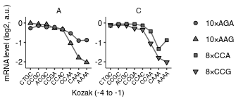

Analyze initiation codon pair mRNA levels
================
rasi
07 August, 2018

-   [Load libraries and define analysis-specific parameters](#load-libraries-and-define-analysis-specific-parameters)
-   [Read annotations](#read-annotations)
-   [Read count data](#read-count-data)
-   [Analyze PCR template switching between initiation mutation and codon mutation](#analyze-pcr-template-switching-between-initiation-mutation-and-codon-mutation)
-   [Look at codon repeats and initiation mutations only](#look-at-codon-repeats-and-initiation-mutations-only)

Load libraries and define analysis-specific parameters
------------------------------------------------------

``` r
# standard analysis and plotting functions, includes dplyr, ggplot2 
library(tidyverse)
# loads lab default ggplot2 theme and provides color-blind friendly palette
library(rasilabRtemplates)

codonmutation_order <- seq(1,4)
names(codonmutation_order) <- c('AAG', 'AGA', 'CCG', 'CCA')
# intiiation sites are arranged in this order
initiationmutation_order <- seq(1,9)
names(initiationmutation_order) <- toupper(c( 'ctg', 'ctgc', 'ccgc', 
                              'acgc', 'ccga', 'ccac', 'ccaa', 'caaa', 'aaaa'))
```

Read annotations
----------------

``` r
annotations <- read_tsv("../../../data/htseq/initiation_pgk1_aag_ccg/sampleannotations.tsv") %>% 
  print()
```

    ## # A tibble: 8 x 4
    ##   type  primer barcode replicate
    ##   <chr> <chr>  <chr>       <int>
    ## 1 gdna  oas112 CGTGAT          1
    ## 2 gdna  oas113 ACATCG          2
    ## 3 gdna  oas114 GCCTAA          3
    ## 4 gdna  oas115 TGGTCA          4
    ## 5 cdna  oas116 CACTGT          1
    ## 6 cdna  oas117 ATTGGC          2
    ## 7 cdna  oas118 GATCTG          3
    ## 8 cdna  oas119 TCAAGT          4

Read count data
---------------

``` r
count_data <- list.files("../../../tables/htseq/initiation_pgk1_aag_ccg/", 
                         pattern = "init_codon_pairs.tsv",
                         full.names = T) %>% 
  enframe("sno", "file") %>% 
  mutate(barcode = str_extract(file, "(?<=/)[ACTG]{6}")) %>% 
  mutate(data = map(file, read_tsv)) %>% 
  unnest() %>% 
  select(-sno, -file, -index) %>% 
  left_join(annotations %>% select(-primer), by = "barcode") %>% 
  filter(count > 100) %>% 
  arrange(desc(count)) %>% 
  print()
```

    ## # A tibble: 9,947 x 6
    ##    barcode codon         count init    type  replicate
    ##    <chr>   <chr>         <int> <chr>   <chr>     <int>
    ##  1 TCAAGT  TCAGAAAAGAAA 640012 CAAAATG cdna          4
    ##  2 CGTGAT  AGTGAAAAGAAA 598538 CAAAATG gdna          1
    ##  3 GCCTAA  TCGGAAAAGAAA 549840 CAAAATG gdna          3
    ##  4 TCAAGT  CCGCCGCCGCCG 432441 CTGCATG cdna          4
    ##  5 ATTGGC  AGCGAAAAGAAA 414185 CAAAATG cdna          2
    ##  6 ATTGGC  TCCGAAAAGAAA 357102 CAAAATG cdna          2
    ##  7 TGGTCA  AGTGAAAAGAAA 353748 CAAAATG gdna          4
    ##  8 TCAAGT  CCACCACCACCA 298442 CCGCATG cdna          4
    ##  9 TCAAGT  CCGCCGCCGCCG 293714 ACGCATG cdna          4
    ## 10 TCAAGT  CCACCACCACCA 288654 CTGCATG cdna          4
    ## # ... with 9,937 more rows

Analyze PCR template switching between initiation mutation and codon mutation
-----------------------------------------------------------------------------

The wild-type PGK1 gene has a serine codon at the 4th position 5' to the end of PGK1. These were cloned with only the CAAA Kozak sequence. This should not occur with any other initiation mutation. By looking at the frequency of these codons with non-CAAA initiation region, we can get an estimate of template-switching frequency.

It looks like at most 12% of reads come from template switching.

``` r
count_data %>% 
  filter(type == "cdna" & replicate == 2) %>% 
  mutate(codon = substr(codon, 1, 3)) %>% 
  filter(codon %in% c("AGC", "AGT", "TCA", "TCC", "TCG", "TCT")) %>% 
  mutate(init = if_else(str_detect(init, "^CAAA"), "correct", "wrong")) %>% 
  group_by(codon, init) %>% 
  summarize(fraction = sum(count)) %>% 
  ungroup() %>% 
  group_by(codon) %>% 
  mutate(fraction = as.integer(100 * fraction / sum(fraction))) %>% 
  ungroup() %>% 
  print()
```

    ## # A tibble: 12 x 3
    ##    codon init    fraction
    ##    <chr> <chr>      <int>
    ##  1 AGC   correct       94
    ##  2 AGC   wrong          5
    ##  3 AGT   correct       92
    ##  4 AGT   wrong          7
    ##  5 TCA   correct       89
    ##  6 TCA   wrong         10
    ##  7 TCC   correct       93
    ##  8 TCC   wrong          6
    ##  9 TCG   correct       87
    ## 10 TCG   wrong         12
    ## 11 TCT   correct       92
    ## 12 TCT   wrong          7

Look at codon repeats and initiation mutations only
---------------------------------------------------

``` r
plot_data <- count_data %>% 
  # look for a trinucleotide repeated 1 + 3 times
  filter(str_detect(codon, '([ACTG]{3})\\1{3}')) %>% 
  # extract codon
  mutate(codon_mutation = substr(codon, 1, 3)) %>% 
  # get the initiation mutation as either CTG at start or the -4 to -1 preceding ATG
  mutate(init_mutation = str_extract(init, '(?<=CAAA)CTG|[ACTG]{4}(?=ATG)')) %>% 
  # get only initiation mutations that we cloned 
  filter(init_mutation %in% names(initiationmutation_order)) %>% 
  # get only codon mutations that we cloned 
  filter(codon_mutation %in% names(codonmutation_order)) %>% 
  # arrange init_mutation in correct_order
  mutate(init_mutation = fct_reorder(
    init_mutation, initiationmutation_order[init_mutation])) %>% 
  # arrange codon_mutation in correct_order
  mutate(codon_mutation = fct_reorder(
    codon_mutation, codonmutation_order[codon_mutation])) %>% 
  # get rid of unwanted cols
  select(-barcode, -codon, -init) %>% 
  # spread cdna and gdna counts to adjacent columns
  spread(type, count) %>% 
  # calculate log2 fold change cdna / gdna
  mutate(lfc = log2(cdna)-log2(gdna)) %>% 
  mutate(codon_group = substr(codon_mutation, 1, 1)) %>% 
  # set the maximum lfc to be zero to see fold changes clearly
  group_by(codon_group, replicate) %>% 
  mutate(lfc = lfc - max(lfc)) %>% 
  ungroup() %>% 
  # average across 4 replicates
  group_by(codon_mutation, init_mutation, codon_group) %>% 
  summarize(avg_lfc = mean(lfc), std_lfc = sd(lfc) / sqrt(n())) %>% 
  ungroup() %>% 
  mutate(codon_mutation = if_else(codon_group == "A", 
                                  paste0("10×", codon_mutation),
                                  paste0("8×", codon_mutation))) %>% 
  mutate(codon_mutation = fct_relevel(codon_mutation, "10×AGA"))
                                  

plot_data %>% 
  # exclude the mutated start codon since this will be shown in previous panel
  filter(init_mutation != "CTG") %>% 
  ggplot(aes(x = init_mutation, y = avg_lfc, group = codon_mutation, shape = codon_mutation)) +
  facet_wrap(~codon_group, ncol = 2, scales = "free_y") +
  geom_line(color = "dimgrey") +
  geom_point(fill = "dimgrey") +
  # geom_errorbar(aes(ymin = avg_lfc - std_lfc, ymax = avg_lfc + std_lfc),
  #               width = 0.5) +
  scale_color_manual(values = cbPalette) +
  scale_shape_manual(values = c(21, 24, 22, 25)) +
  theme(axis.text.x = element_text(angle = 45, hjust = 1, size = 6)) +
  scale_y_continuous(limits = c(-2.2, +0.2), breaks = -2:0) +
  labs(x = "Kozak (-4 to -1)", y = "mRNA level (log2, a.u.)", shape = "")
```



``` r
ggsave("../../../figures/mrna_stability_vs_initiation_rate_4codons_wt.pdf")
```
