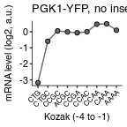

Analyze counts
================
rasi
07 August, 2018

-   [Load libraries and define analysis-specific variables](#load-libraries-and-define-analysis-specific-variables)
-   [Read annotations](#read-annotations)
-   [Read in data](#read-in-data)
-   [Plot of median-normalized cDNA and gDNA counts for concordance between varying PCR cycles](#plot-of-median-normalized-cdna-and-gdna-counts-for-concordance-between-varying-pcr-cycles)

Load libraries and define analysis-specific variables
-----------------------------------------------------

``` r
library(tidyverse)
library(rasilabRtemplates)

initiationmutation_order <- seq(1,9)
names(initiationmutation_order) <- toupper(c('ctg', 'ctgc', 'ccgc', 
                              'acgc', 'ccga', 'ccac', 'ccaa', 'caaa', 'aaaa'))
```

Read annotations
----------------

``` r
sampleannotations <- read_tsv("../../../data/htseq/initiation_pgk1_no_insert/sampleannotations.tsv") %>% 
  print()
```

    ## # A tibble: 2 x 7
    ##   sample barcode type  row   column cycles primer
    ##   <chr>  <chr>   <chr> <chr> <chr>   <int> <chr> 
    ## 1 hp13   CGAAAC  gdna  <NA>  <NA>       22 oAS132
    ## 2 hp14   CGTACG  cdna  <NA>  <NA>       22 oAS133

Read in data
------------

``` r
data <- "../../../tables/htseq/initiation_pgk1_no_insert/" %>% 
  list.files(pattern = ".tsv", full.names = T) %>% 
  enframe("sno", "file") %>% 
  mutate(barcode = str_extract(file, "(?<=/)[ACTG]{6}")) %>% 
  mutate(data = map(file, read_tsv)) %>% 
  left_join(sampleannotations, by = "barcode") %>% 
  filter(is.na(row) & is.na(column)) %>%
  select(-sno, -file, -barcode) %>% 
  unnest() %>% 
  print()
```

    ## # A tibble: 8,417 x 9
    ##    sample type  row   column cycles primer  count gene        init   
    ##    <chr>  <chr> <chr> <chr>   <int> <chr>   <int> <chr>       <chr>  
    ##  1 hp13   gdna  <NA>  <NA>       22 oAS132 357901 his3        CAAACTG
    ##  2 hp13   gdna  <NA>  <NA>       22 oAS132 201241 his3        TTGCATG
    ##  3 hp13   gdna  <NA>  <NA>       22 oAS132 179557 his3        GGATATG
    ##  4 hp13   gdna  <NA>  <NA>       22 oAS132 177094 his3        TGGCATG
    ##  5 hp13   gdna  <NA>  <NA>       22 oAS132 144612 his3        CAATATG
    ##  6 hp13   gdna  <NA>  <NA>       22 oAS132 141188 his3        CAGGATG
    ##  7 hp13   gdna  <NA>  <NA>       22 oAS132 134211 his3        TGGTATG
    ##  8 hp13   gdna  <NA>  <NA>       22 oAS132 119295 his3        TAATATG
    ##  9 hp13   gdna  <NA>  <NA>       22 oAS132 109715 optmkate2   GTCAATG
    ## 10 hp13   gdna  <NA>  <NA>       22 oAS132  95868 deoptmkate2 GGTAATG
    ## # ... with 8,407 more rows

Plot of median-normalized cDNA and gDNA counts for concordance between varying PCR cycles
-----------------------------------------------------------------------------------------

``` r
flag_data <- data %>% 
  filter(gene == "flag") %>% 
  # get the initiation mutation as either CTG at start or the -4 to -1 preceding ATG
  mutate(init_mutation = str_extract(init, '(?<=CAAA)CTG|[ACTG]{4}(?=ATG)')) %>% 
  # get only initiation mutations that we cloned 
  filter(init_mutation %in% names(initiationmutation_order)) %>% 
  # arrange init_mutation in correct_order
  mutate(init_mutation = forcats::fct_reorder(
    init_mutation, initiationmutation_order[init_mutation]))

plot_data <- flag_data %>% 
  group_by(init_mutation, type) %>% 
  summarize(count = sum(count)) %>% 
  ungroup() %>% 
  # spread cdna and gdna counts to adjacent columns
  spread(type, count) %>% 
  # calculate log2 fold change cdna / gdna
  mutate(lfc = log2(cdna)-log2(gdna)) %>% 
  # median normalize lfc 
  mutate(lfc = lfc - median(lfc)) 

plot_data %>% 
  ggplot(aes(x = init_mutation, y = lfc, group = NA)) +
  geom_line(color = "dimgrey") +
  geom_point(shape = 21, fill = "dimgrey") +
  theme(axis.text.x = element_text(angle = 45, hjust = 1, size = 6)) +
  labs(x = "Kozak (-4 to -1)", y = "mRNA level (log2, a.u.)",
       title = "PGK1-YFP, no insert") +
  NULL
```



``` r
ggsave("../../../figures/mrna_stability_vs_initiation_rate_pgk1_no_insert.pdf")
```
