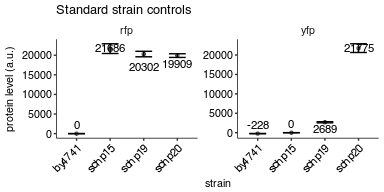
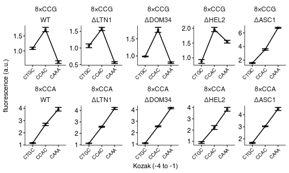

Flow analysis of PGK1 constructs with 8xCCG / 8xCCA inserts and varying Kozak
================
rasi
02 September, 2018

-   [Import libraries and analysis specific parameters](#import-libraries-and-analysis-specific-parameters)
-   [Read data into a single data frame](#read-data-into-a-single-data-frame)
-   [Read annotations](#read-annotations)
-   [Rename and calculate average values of fluorescence channels](#rename-and-calculate-average-values-of-fluorescence-channels)
-   [Calculate mean and standard deviation](#calculate-mean-and-standard-deviation)
-   [Plot the raw values for the 4 control samples used across all experiments](#plot-the-raw-values-for-the-4-control-samples-used-across-all-experiments)
-   [Plot mean YFP / RFP ratio as a function of initiation codon](#plot-mean-yfp-rfp-ratio-as-a-function-of-initiation-codon)

Import libraries and analysis specific parameters
-------------------------------------------------

``` r
# loads lab default ggplot2 theme and provides color-blind friendly palette
library(rasilabRtemplates)
# standard analysis and plotting functions, includes dplyr, ggplot2 
library(tidyverse)

# intiiation sites are arranged in this order
initiationmutation_order <- seq(1,8)
names(initiationmutation_order) <- toupper(c( 'ctgc', 'ccgc', 
                              'acgc', 'ccga', 'ccac', 'ccaa', 'caaa', 'aaaa'))

# bad wells that had zero or abnormal signals. These are excluded from analysis.
bad_wells <- list(
  list('strain' = 'schp774', 'replicate' = 1),
  list('strain' = 'schp777', 'replicate' = 2),
  list('strain' = 'schp780', 'replicate' = 2),
  list('strain' = 'schp781', 'replicate' = 2)
) %>% 
  bind_rows()
```

Read data into a single data frame
----------------------------------

``` r
flowdata  <- '../data/flow/initiation_lowmedhigh_pgk1_8xccg_4ko_wt/' %>% 
  # get all fcs files
  list.files(full.names = T, pattern = '.fcs$') %>% 
  enframe("sno", "filename") %>% 
  # get data from each file
  mutate(data = map(filename, . %>% 
                      flowCore::read.FCS(transformation = F, alter.names = T) %>% 
                      flowCore::exprs() %>% 
                      as_tibble())) %>% 
  # extract file name without .fcs extension and parent folder name
  mutate(file = str_extract(filename, '[^/]+(?=.fcs$)')) %>% 
  # get rid of unwanted columns
  select(-sno, -filename) %>% 
  # expand data out
  unnest() %>% 
  print()
```

    ## # A tibble: 1,560,000 x 6
    ##    file                       FSC.A    SSC.A FITC.A PE.Texas.Red.A  Time
    ##    <chr>                      <dbl>    <dbl>  <dbl>          <dbl> <dbl>
    ##  1 Specimen_001_B10_B10_009   8889.     3.67  -70.1           46.3  3.14
    ##  2 Specimen_001_B10_B10_009 108084.    85.2   109.           -44.8  3.23
    ##  3 Specimen_001_B10_B10_009  37340. 33517.    286.         16562.   3.28
    ##  4 Specimen_001_B10_B10_009  25670. 25193.    306.         11521.   3.39
    ##  5 Specimen_001_B10_B10_009  27334.    21.1   -43.4           11.4  3.40
    ##  6 Specimen_001_B10_B10_009  28838. 29725.    206.          4751.   3.50
    ##  7 Specimen_001_B10_B10_009  42177.    39.1    28.4          -27.4  3.54
    ##  8 Specimen_001_B10_B10_009  75328. 41145.    557.         27291.   3.54
    ##  9 Specimen_001_B10_B10_009  68649.    95.6    32.5           91.6  3.56
    ## 10 Specimen_001_B10_B10_009  45710. 47615.    533.         22502.   3.59
    ## # ... with 1,559,990 more rows

Read annotations
----------------

``` r
annotations <- '../data/flow/initiation_lowmedhigh_pgk1_8xccg_4ko_wt/sampleannotations.tsv' %>% 
                        read_tsv(col_types = list('plate' = col_integer())) %>% 
  # the default initiation mutation is CAAA
  mutate(initiationmutation = if_else(is.na(initiationmutation), "CAAA", 
                                      initiationmutation)) %>% 
  mutate(initiationmutation = toupper(initiationmutation)) %>% 
  # arrange initiationmutation in this order 
  mutate(initiationmutation = fct_reorder(
      initiationmutation, 
      initiationmutation_order[initiationmutation])) %>% 
  # remove leading 0 in strain number
  mutate(strain = str_replace(strain, "schp0", "schp")) %>%
  print()
```

    ## # A tibble: 156 x 18
    ##    plate file           strain  codonmutation numberofcodonrep… stallsites
    ##    <int> <chr>          <chr>   <chr>         <chr>             <chr>     
    ##  1     1 Specimen_001_… by4741  na            na                na        
    ##  2     1 Specimen_001_… schp15  na            na                na        
    ##  3     1 Specimen_001_… schp19  cgg           6                 1         
    ##  4     1 Specimen_001_… schp20  aga           6                 na        
    ##  5     1 Specimen_001_… scas011 na            na                na        
    ##  6     1 Specimen_001_… scas012 na            na                na        
    ##  7     1 Specimen_001_… scas017 na            na                na        
    ##  8     1 Specimen_001_… schp498 na            na                na        
    ##  9     1 Specimen_001_… schp520 na            na                na        
    ## 10     1 Specimen_001_… schp747 cca           8                 na        
    ## # ... with 146 more rows, and 12 more variables: initiationmutation <fct>,
    ## #   genes <chr>, gpdmkate2 <chr>, citrine <chr>, replicate <int>,
    ## #   knockoutgenes <chr>, taggene <chr>, tag <chr>, genewithtag <chr>,
    ## #   parent <chr>, note <chr>, initimut <chr>

Rename and calculate average values of fluorescence channels
------------------------------------------------------------

``` r
by_file <- flowdata  %>% 
  # group by  each file (well)
  group_by(file) %>% 
  select(FITC.A, PE.Texas.Red.A) %>% 
  # calculate mean
  summarise_all(mean) %>% 
  # rename
  rename('yfp' = FITC.A, 'rfp' = PE.Texas.Red.A) %>% 
  # ratios
  mutate('yfp_rfp_ratio' = yfp / rfp * 10) %>% 
  # join annotations
  left_join(annotations, by = 'file') %>% 
  print()
```

    ## # A tibble: 156 x 21
    ##    file                yfp    rfp yfp_rfp_ratio plate strain codonmutation
    ##    <chr>             <dbl>  <dbl>         <dbl> <int> <chr>  <chr>        
    ##  1 Specimen_001_B…   347.  2.45e4         0.142     1 schp5… na           
    ##  2 Specimen_001_B… 14237.  2.44e4         5.83      1 schp7… cca          
    ##  3 Specimen_001_B…    33.3 1.17e1        28.4       1 by4741 na           
    ##  4 Specimen_001_B…   334.  2.52e4         0.133     1 schp15 na           
    ##  5 Specimen_001_B…  3367.  2.21e4         1.53      1 schp19 cgg          
    ##  6 Specimen_001_B… 24584.  2.06e4        11.9       1 schp20 aga          
    ##  7 Specimen_001_B…  1640.  5.01e4         0.328     1 scas0… na           
    ##  8 Specimen_001_B…   338.  2.46e4         0.137    NA <NA>   <NA>         
    ##  9 Specimen_001_B…   350.  2.16e4         0.162     1 scas0… na           
    ## 10 Specimen_001_B…   418.  2.60e4         0.161     1 schp4… na           
    ## # ... with 146 more rows, and 14 more variables:
    ## #   numberofcodonrepeats <chr>, stallsites <chr>,
    ## #   initiationmutation <fct>, genes <chr>, gpdmkate2 <chr>, citrine <chr>,
    ## #   replicate <int>, knockoutgenes <chr>, taggene <chr>, tag <chr>,
    ## #   genewithtag <chr>, parent <chr>, note <chr>, initimut <chr>

Calculate mean and standard deviation
-------------------------------------

``` r
avg_data  <- by_file %>% 
  # strain is used to get replicates
  group_by(strain) %>% 
  # calculate mean and std.err
  mutate(mean_yfp = mean(yfp), 
         mean_rfp = mean(rfp)) %>% 
  ungroup() %>% 
  print()
```

    ## # A tibble: 156 x 23
    ##    file                yfp    rfp yfp_rfp_ratio plate strain codonmutation
    ##    <chr>             <dbl>  <dbl>         <dbl> <int> <chr>  <chr>        
    ##  1 Specimen_001_B…   347.  2.45e4         0.142     1 schp5… na           
    ##  2 Specimen_001_B… 14237.  2.44e4         5.83      1 schp7… cca          
    ##  3 Specimen_001_B…    33.3 1.17e1        28.4       1 by4741 na           
    ##  4 Specimen_001_B…   334.  2.52e4         0.133     1 schp15 na           
    ##  5 Specimen_001_B…  3367.  2.21e4         1.53      1 schp19 cgg          
    ##  6 Specimen_001_B… 24584.  2.06e4        11.9       1 schp20 aga          
    ##  7 Specimen_001_B…  1640.  5.01e4         0.328     1 scas0… na           
    ##  8 Specimen_001_B…   338.  2.46e4         0.137    NA <NA>   <NA>         
    ##  9 Specimen_001_B…   350.  2.16e4         0.162     1 scas0… na           
    ## 10 Specimen_001_B…   418.  2.60e4         0.161     1 schp4… na           
    ## # ... with 146 more rows, and 16 more variables:
    ## #   numberofcodonrepeats <chr>, stallsites <chr>,
    ## #   initiationmutation <fct>, genes <chr>, gpdmkate2 <chr>, citrine <chr>,
    ## #   replicate <int>, knockoutgenes <chr>, taggene <chr>, tag <chr>,
    ## #   genewithtag <chr>, parent <chr>, note <chr>, initimut <chr>,
    ## #   mean_yfp <dbl>, mean_rfp <dbl>

``` r
yfp_background <- avg_data %>% 
  filter(strain == "schp15") %>% 
  pull(mean_yfp)

rfp_background <- avg_data %>% 
  filter(strain == "by4741") %>% 
  pull(mean_rfp)

avg_data <- avg_data %>% 
  anti_join(bad_wells) %>%
  mutate(yfp = yfp - yfp_background, 
         rfp = rfp - rfp_background, 
         yfp_rfp_ratio = yfp / rfp) %>% 
  # calculate mean and std.err
  group_by(strain) %>% 
  mutate(mean_yfp = mean(yfp), 
         mean_rfp = mean(rfp), 
         mean_ratio = mean(yfp_rfp_ratio), 
         se_yfp = sd(yfp)/sqrt(n()), 
         se_rfp = sd(rfp)/sqrt(n()),
         se_ratio = sd(yfp_rfp_ratio)/sqrt(n())) %>% 
  slice(1) %>% 
  ungroup()

normalization <- avg_data %>% 
  filter(strain == "schp19")
```

Plot the raw values for the 4 control samples used across all experiments
-------------------------------------------------------------------------

``` r
plot_data <- avg_data %>% 
  filter(strain %in% c("schp15", "schp19", "schp20", "by4741")) %>% 
  select(strain, mean_yfp, mean_rfp, se_yfp, se_rfp) %>% 
  gather(qty, value, -strain) %>% 
  separate(qty, into = c("measure", "channel"), sep = "_") %>% 
  spread(measure, value) %>% 
  print()
```

    ## # A tibble: 8 x 4
    ##   strain channel      mean     se
    ##   <chr>  <chr>       <dbl>  <dbl>
    ## 1 by4741 rfp      1.78e-15   11.2
    ## 2 by4741 yfp     -2.28e+ 2   17.7
    ## 3 schp15 rfp      2.17e+ 4 1238. 
    ## 4 schp15 yfp     -1.42e-14   13.2
    ## 5 schp19 rfp      2.03e+ 4  699. 
    ## 6 schp19 yfp      2.69e+ 3  147. 
    ## 7 schp20 rfp      1.99e+ 4  464. 
    ## 8 schp20 yfp      2.18e+ 4 1122.

``` r
plot_data %>%
  ggplot(aes(x = strain, y = mean,
             ymin = mean - se, ymax = mean + se)) +
  facet_wrap(~channel, ncol = 2, scales = "free") +
  geom_point(size = 1, height = 0, width = 0.1, alpha = 0.5) +
  geom_line() +
  ggrepel::geom_text_repel(aes(label = as.integer(mean), y = mean), 
                           size = 3, direction = "y") +
  geom_errorbar(width = 0.5) +
  labs(y = 'protein level (a.u.)',
       x = 'strain',
       title = "Standard strain controls") +
  theme(axis.text.x = element_text(angle = 45, hjust = 1))
```



Plot mean YFP / RFP ratio as a function of initiation codon
-----------------------------------------------------------

``` r
plot_data <- avg_data %>% 
  mutate(mean_ratio = mean_ratio / normalization[[1, "mean_ratio"]]) %>% 
  mutate(se_ratio = se_ratio / normalization[[1, "mean_ratio"]]) %>% 
  filter(codonmutation == "cca" | codonmutation == "ccg") %>%
  filter(initiationmutation != "CTG") %>%
  filter(numberofcodonrepeats == 8) %>%   
  mutate(codonmutation = forcats::fct_rev(paste0("8×", toupper(codonmutation)))) %>% 
  mutate(knockoutgenes = if_else(knockoutgenes == "na", "WT", paste0("Δ", toupper(knockoutgenes)))) %>% 
  mutate(knockoutgenes = forcats::fct_relevel(knockoutgenes, "WT", "ΔLTN1", "ΔDOM34", "ΔHEL2", "ΔASC1"))

plot_data %>% 
  ggplot(aes(x = initiationmutation, y = mean_ratio, 
             ymin = mean_ratio - se_ratio, ymax = mean_ratio + se_ratio,
             group = codonmutation)) +
  geom_point(size = 1, height = 0, width = 0.1, alpha = 0.5) +
  geom_line() +
  geom_errorbar(width = 0.5) +
  facet_wrap(codonmutation ~ knockoutgenes, ncol = 5, scales = "free") + 
  labs(y = 'fluorescence (a.u.)',
       x = 'Kozak (-4 to -1)') +
  theme(legend.title = element_text(size = 8),
        axis.text.x = element_text(angle = 45, hjust = 1, size = 6)) +
  scale_y_continuous(breaks = scales::pretty_breaks(n=4))
```



``` r
ggsave('../figures/initiation_pgk1_lowmed_highccg_4ko_wt_flow.pdf')
```
