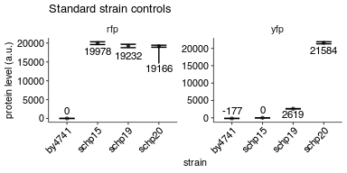
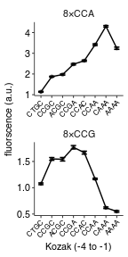

Flow analysis of PGK1 constructs with 8xCCG / 8xCCA inserts and varying Kozak
================
rasi
06 August, 2018

-   [Import libraries and analysis specific parameters](#import-libraries-and-analysis-specific-parameters)
-   [Read data into a single data frame](#read-data-into-a-single-data-frame)
-   [Read annotations](#read-annotations)
-   [Rename and calculate average values of fluorescence channels](#rename-and-calculate-average-values-of-fluorescence-channels)
-   [Calculate mean and standard deviation](#calculate-mean-and-standard-deviation)
-   [Plot the raw values for the 4 control samples used across all experiments](#plot-the-raw-values-for-the-4-control-samples-used-across-all-experiments)
-   [Plot mean YFP / RFP ratio as a function of initiation codon](#plot-mean-yfp-rfp-ratio-as-a-function-of-initiation-codon)

Import libraries and analysis specific parameters
-------------------------------------------------

``` r
# standard analysis and plotting functions, includes dplyr, ggplot2 
library(tidyverse)
# loads lab default ggplot2 theme and provides color-blind friendly palette
library(rasilabRtemplates)

# intiiation sites are arranged in this order
initiationmutation_order <- seq(1,8)
names(initiationmutation_order) <- toupper(c( 'ctgc', 'ccgc', 
                              'acgc', 'ccga', 'ccac', 'ccaa', 'caaa', 'aaaa'))
```

Read data into a single data frame
----------------------------------

``` r
flowdata  <- '../data/flow/initiation_pgk1_8xccg/' %>% 
  # get all fcs files
  list.files(full.names = T, pattern = '.fcs$') %>% 
  enframe("sno", "filename") %>% 
  # get data from each file
  mutate(data = map(filename, . %>% 
                      flowCore::read.FCS(transformation = F, alter.names = T) %>% 
                      flowCore::exprs() %>% 
                      as_tibble())) %>% 
  # extract file name without .fcs extension and parent folder name
  mutate(file = str_extract(filename, '[^/]+(?=.fcs$)')) %>% 
  # get rid of unwanted columns
  select(-sno, -filename) %>% 
  # expand data out
  unnest() %>% 
  print()
```

    ## # A tibble: 1,920,000 x 6
    ##    file                      FSC.A  SSC.A FITC.A PE.Texas.Red.A  Time
    ##    <chr>                     <dbl>  <dbl>  <dbl>          <dbl> <dbl>
    ##  1 Specimen_001_B10_B10_009 49345. 53625. 10432.         16650.  3.01
    ##  2 Specimen_001_B10_B10_009 38518. 24503.  6054.         10228.  3.02
    ##  3 Specimen_001_B10_B10_009 90689. 82742. 15706.         35931.  3.03
    ##  4 Specimen_001_B10_B10_009 37548. 26168.  5287.         11544.  3.07
    ##  5 Specimen_001_B10_B10_009 39889. 27324.  6971.         13016.  3.08
    ##  6 Specimen_001_B10_B10_009 34592. 35675.  7923.         18660.  3.09
    ##  7 Specimen_001_B10_B10_009 81660. 92508. 16746.         33584.  3.09
    ##  8 Specimen_001_B10_B10_009 69554. 46281. 12438.         22019.  3.09
    ##  9 Specimen_001_B10_B10_009 31835. 38506.  4795.         15942.  3.10
    ## 10 Specimen_001_B10_B10_009 47060. 40122.  9663.         24745.  3.12
    ## # ... with 1,919,990 more rows

Read annotations
----------------

``` r
annotations <- '../data/flow/initiation_pgk1_8xccg/sampleannotations.tsv' %>% 
                        read_tsv(col_types = list('plate' = col_integer())) %>% 
  # the default initiation mutation is CAAA
  mutate(initiationmutation = if_else(is.na(initiationmutation), "CAAA", 
                                      initiationmutation)) %>% 
  mutate(initiationmutation = toupper(initiationmutation)) %>% 
  # arrange initiationmutation in this order 
  mutate(initiationmutation = fct_reorder(
      initiationmutation, 
      initiationmutation_order[initiationmutation])) %>% 
  print()
```

    ## # A tibble: 192 x 16
    ##    plate file  strain codonmutation numberofcodonre… stallsites
    ##    <int> <chr> <chr>  <chr>         <chr>            <chr>     
    ##  1     1 Spec… by4741 na            na               na        
    ##  2     1 Spec… schp15 na            na               na        
    ##  3     1 Spec… schp19 cgg           6                1         
    ##  4     1 Spec… schp20 aga           6                na        
    ##  5     1 Spec… schp76 aga           5                na        
    ##  6     1 Spec… schp91 cgg           5                5         
    ##  7     1 Spec… schp6… cca           8                na        
    ##  8     1 Spec… schp6… cca           8                na        
    ##  9     1 Spec… schp6… cca           8                na        
    ## 10     1 Spec… schp6… cca           8                na        
    ## # ... with 182 more rows, and 10 more variables: initiationmutation <fct>,
    ## #   genes <chr>, gpdmkate2 <chr>, citrine <chr>, replicate <int>,
    ## #   knockoutgenes <chr>, taggene <chr>, tag <chr>, genewithtag <chr>,
    ## #   note <chr>

Rename and calculate average values of fluorescence channels
------------------------------------------------------------

``` r
by_file <- flowdata  %>% 
  # group by  each file (well)
  group_by(file) %>% 
  select(FITC.A, PE.Texas.Red.A) %>% 
  # calculate mean
  summarise_all(mean) %>% 
  # rename
  rename('yfp' = FITC.A, 'rfp' = PE.Texas.Red.A) %>% 
  # ratios
  mutate('yfp_rfp_ratio' = yfp / rfp * 10) %>% 
  # join annotations
  left_join(annotations, by = 'file') %>% 
  print()
```

    ## # A tibble: 192 x 19
    ##    file     yfp    rfp yfp_rfp_ratio plate strain codonmutation
    ##    <chr>  <dbl>  <dbl>         <dbl> <int> <chr>  <chr>        
    ##  1 Spec… 1.04e4 2.25e4         4.63      1 schp6… cca          
    ##  2 Spec… 8.42e3 2.34e4         3.61      1 schp6… cca          
    ##  3 Spec… 5.71e1 2.26e1        25.3       1 by4741 na           
    ##  4 Spec… 2.19e2 2.16e4         0.101     1 schp15 na           
    ##  5 Spec… 2.96e3 2.14e4         1.38      1 schp19 cgg          
    ##  6 Spec… 2.26e4 1.98e4        11.4       1 schp20 aga          
    ##  7 Spec… 1.33e4 2.17e4         6.10      1 schp76 aga          
    ##  8 Spec… 4.86e3 2.37e4         2.05     NA <NA>   <NA>         
    ##  9 Spec… 1.24e4 2.16e4         5.75      1 schp6… cca          
    ## 10 Spec… 6.08e3 2.35e4         2.59      1 schp6… cca          
    ## # ... with 182 more rows, and 12 more variables:
    ## #   numberofcodonrepeats <chr>, stallsites <chr>,
    ## #   initiationmutation <fct>, genes <chr>, gpdmkate2 <chr>, citrine <chr>,
    ## #   replicate <int>, knockoutgenes <chr>, taggene <chr>, tag <chr>,
    ## #   genewithtag <chr>, note <chr>

Calculate mean and standard deviation
-------------------------------------

``` r
avg_data  <- by_file %>% 
  # strain is used to get replicates
  group_by(strain) %>% 
  # calculate mean and std.err
  mutate(mean_yfp = mean(yfp), 
         mean_rfp = mean(rfp)) %>% 
  ungroup() %>% 
  print()
```

    ## # A tibble: 192 x 21
    ##    file     yfp    rfp yfp_rfp_ratio plate strain codonmutation
    ##    <chr>  <dbl>  <dbl>         <dbl> <int> <chr>  <chr>        
    ##  1 Spec… 1.04e4 2.25e4         4.63      1 schp6… cca          
    ##  2 Spec… 8.42e3 2.34e4         3.61      1 schp6… cca          
    ##  3 Spec… 5.71e1 2.26e1        25.3       1 by4741 na           
    ##  4 Spec… 2.19e2 2.16e4         0.101     1 schp15 na           
    ##  5 Spec… 2.96e3 2.14e4         1.38      1 schp19 cgg          
    ##  6 Spec… 2.26e4 1.98e4        11.4       1 schp20 aga          
    ##  7 Spec… 1.33e4 2.17e4         6.10      1 schp76 aga          
    ##  8 Spec… 4.86e3 2.37e4         2.05     NA <NA>   <NA>         
    ##  9 Spec… 1.24e4 2.16e4         5.75      1 schp6… cca          
    ## 10 Spec… 6.08e3 2.35e4         2.59      1 schp6… cca          
    ## # ... with 182 more rows, and 14 more variables:
    ## #   numberofcodonrepeats <chr>, stallsites <chr>,
    ## #   initiationmutation <fct>, genes <chr>, gpdmkate2 <chr>, citrine <chr>,
    ## #   replicate <int>, knockoutgenes <chr>, taggene <chr>, tag <chr>,
    ## #   genewithtag <chr>, note <chr>, mean_yfp <dbl>, mean_rfp <dbl>

``` r
yfp_background <- avg_data %>% 
  filter(strain == "schp15") %>% 
  pull(mean_yfp)

rfp_background <- avg_data %>% 
  filter(strain == "by4741") %>% 
  pull(mean_rfp)

avg_data <- avg_data %>% 
  mutate(yfp = yfp - yfp_background, 
         rfp = rfp - rfp_background, 
         yfp_rfp_ratio = yfp / rfp) %>% 
  # calculate mean and std.err
  group_by(strain) %>% 
  mutate(mean_yfp = mean(yfp), 
         mean_rfp = mean(rfp), 
         mean_ratio = mean(yfp_rfp_ratio), 
         se_yfp = sd(yfp)/sqrt(n()), 
         se_rfp = sd(rfp)/sqrt(n()),
         se_ratio = sd(yfp_rfp_ratio)/sqrt(n())) %>% 
  slice(1) %>% 
  ungroup()

normalization <- avg_data %>% 
  filter(strain == "schp19")
```

Plot the raw values for the 4 control samples used across all experiments
-------------------------------------------------------------------------

``` r
plot_data <- avg_data %>% 
  filter(strain %in% c("schp15", "schp19", "schp20", "by4741")) %>% 
  select(strain, mean_yfp, mean_rfp, se_yfp, se_rfp) %>% 
  gather(qty, value, -strain) %>% 
  separate(qty, into = c("measure", "channel"), sep = "_") %>% 
  spread(measure, value) %>% 
  print()
```

    ## # A tibble: 8 x 4
    ##   strain channel      mean     se
    ##   <chr>  <chr>       <dbl>  <dbl>
    ## 1 by4741 rfp     -1.33e-15   1.52
    ## 2 by4741 yfp     -1.78e+ 2   1.85
    ## 3 schp15 rfp      2.00e+ 4 362.  
    ## 4 schp15 yfp     -1.07e-14   4.77
    ## 5 schp19 rfp      1.92e+ 4 449.  
    ## 6 schp19 yfp      2.62e+ 3  34.1 
    ## 7 schp20 rfp      1.92e+ 4 265.  
    ## 8 schp20 yfp      2.16e+ 4 294.

``` r
plot_data %>%
  ggplot(aes(x = strain, y = mean,
             ymin = mean - se, ymax = mean + se)) +
  facet_wrap(~channel, ncol = 2, scales = "free") +
  geom_point(size = 1, height = 0, width = 0.1, alpha = 0.5) +
  geom_line() +
  ggrepel::geom_text_repel(aes(label = as.integer(mean), y = mean), 
                           size = 3, direction = "y") +
  geom_errorbar(width = 0.5) +
  labs(y = 'protein level (a.u.)',
       x = 'strain',
       title = "Standard strain controls") +
  theme(axis.text.x = element_text(angle = 45, hjust = 1))
```



Plot mean YFP / RFP ratio as a function of initiation codon
-----------------------------------------------------------

``` r
plot_data <- avg_data %>% 
  mutate(mean_ratio = mean_ratio / normalization[[1, "mean_ratio"]]) %>% 
  mutate(se_ratio = se_ratio / normalization[[1, "mean_ratio"]]) %>% 
  filter(codonmutation == "cca" | codonmutation == "ccg") %>%
  filter(initiationmutation != "CTG") %>%
  filter(numberofcodonrepeats == 8) %>%   
  mutate(codonmutation = paste0("8×", toupper(codonmutation)))

plot_data %>% 
  ggplot(aes(x = initiationmutation, y = mean_ratio, 
             ymin = mean_ratio - se_ratio, ymax = mean_ratio + se_ratio,
             group = codonmutation)) +
  geom_point(size = 1, height = 0, width = 0.1, alpha = 0.5) +
  geom_line() +
  geom_errorbar(width = 0.5) +
  facet_wrap(~codonmutation, ncol = 1, scales = "free") + 
  labs(y = 'fluorscence (a.u.)',
       x = 'Kozak (-4 to -1)') +
  theme(legend.title = element_text(size = 8),
        axis.text.x = element_text(angle = 45, hjust = 1, size = 6)) +
  scale_y_continuous(breaks = scales::pretty_breaks(n=4))
```



``` r
ggsave('../figures/initiation_pgk1_ccg_flow.pdf')
```
