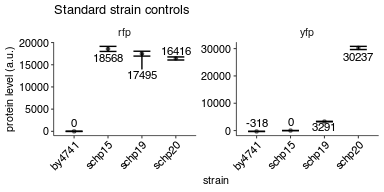
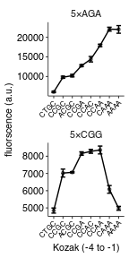
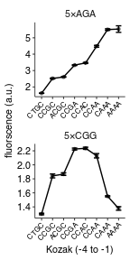

Flow analysis of PGK1 constructs with varying locations and number of CGG rare codons
================
rasi
06 August, 2018

-   [Import libraries and analysis specific parameters](#import-libraries-and-analysis-specific-parameters)
-   [Read data into a single data frame](#read-data-into-a-single-data-frame)
-   [Read annotations](#read-annotations)
-   [Rename and calculate average values of fluorescence channels](#rename-and-calculate-average-values-of-fluorescence-channels)
-   [Calculate mean and standard deviation](#calculate-mean-and-standard-deviation)
-   [Plot the raw values for the 4 control samples used across all experiments](#plot-the-raw-values-for-the-4-control-samples-used-across-all-experiments)
-   [Plot mean YFP as a function of initiation codon](#plot-mean-yfp-as-a-function-of-initiation-codon)

Import libraries and analysis specific parameters
-------------------------------------------------

``` r
# standard analysis and plotting functions, includes dplyr, ggplot2 
library(tidyverse)
# loads lab default ggplot2 theme and provides color-blind friendly palette
library(rasilabRtemplates)

# bad wells that had zero or abnormal signals. These are excluded from analysis.
bad_wells <- list(
  # this strain had an abnormally high RFP signal
  list("strain" = "schp281", "replicate" = 3),
  list("strain" = "schp307", "replicate" = 1)
) %>% 
  bind_rows()

# this is the strain used for background subtraction of the yfp channel
background_strain <- "schp15"


# intiiation sites are arranged in this order
initiationmutation_order <- seq(1,8)
names(initiationmutation_order) <- toupper(c( 'ctgc', 'ccgc', 
                              'acgc', 'ccga', 'ccac', 'ccaa', 'caaa', 'aaaa'))
```

Read data into a single data frame
----------------------------------

``` r
flowdata  <- '../data/flow/initiation_pgk1_cgg_position_number/' %>% 
  # get all fcs files
  list.files(full.names = T, pattern = '.fcs$') %>% 
  enframe("sno", "filename") %>% 
  # get data from each file
  mutate(data = map(filename, . %>% 
                      flowCore::read.FCS(transformation = F, alter.names = T) %>% 
                      flowCore::exprs() %>% 
                      as_tibble())) %>% 
  # extract file name without .fcs extension and parent folder name
  mutate(file = str_extract(filename, '[^/]+(?=.fcs$)')) %>% 
  # get rid of unwanted columns
  select(-sno, -filename) %>% 
  # expand data out
  unnest() %>% 
  print()
```

    ## # A tibble: 2,720,000 x 6
    ##    file                       FSC.A   SSC.A FITC.A PE.Texas.Red.A  Time
    ##    <chr>                      <dbl>   <dbl>  <dbl>          <dbl> <dbl>
    ##  1 Specimen_001_B10_B10_009  79033.  69339.  9174.         18690.  3.02
    ##  2 Specimen_001_B10_B10_009 101337.  87574. 13184.         29887.  3.04
    ##  3 Specimen_001_B10_B10_009  51737.  56161.  3083.         18324.  3.06
    ##  4 Specimen_001_B10_B10_009  79904.  45085.  9957.         18100.  3.08
    ##  5 Specimen_001_B10_B10_009 124491.  97306. 15740.         28731.  3.09
    ##  6 Specimen_001_B10_B10_009  54360.  45015.  6175.         11918.  3.11
    ##  7 Specimen_001_B10_B10_009  64616.  88990. 11907          32413.  3.13
    ##  8 Specimen_001_B10_B10_009 109593.  64133. 12562.         18825.  3.15
    ##  9 Specimen_001_B10_B10_009  58504. 116384. 11592.         27630.  3.19
    ## 10 Specimen_001_B10_B10_009  38635.  51511.  7201.         21931.  3.21
    ## # ... with 2,719,990 more rows

Read annotations
----------------

``` r
annotations <- '../data/flow/initiation_pgk1_cgg_position_number/sampleannotations.tsv' %>% 
                        read_tsv(col_types = list('plate' = col_integer())) %>% 
  # rename col
  rename(gene = genes) %>% 
  # replace all 'na' ny NA
  mutate_all(funs(ifelse(. == 'na', NA, .))) %>% 
  # extract number of stall sites
  mutate(numberofstallsites = 
         ifelse(is.na(stallsites),
                0,
                str_count(stallsites, ',') + 1)) %>% 
  # if there are no stall sites, there are no codon repeats
  mutate(numberofcodonrepeats = ifelse(numberofstallsites == 0,
                                       "–", numberofcodonrepeats)) %>% 
  # the default initiation mutation is CAAA
  mutate(initiationmutation = if_else(is.na(initiationmutation), "CAAA", 
                                      initiationmutation)) %>% 
  mutate(initiationmutation = toupper(initiationmutation)) %>% 
  # arrange initiationmutation in this order 
  mutate(initiationmutation = fct_reorder(
      initiationmutation, 
      initiationmutation_order[initiationmutation])) %>% 
  print()
```

    ## # A tibble: 268 x 13
    ##    plate file  strain codonmutation numberofcodonre… stallsites
    ##    <int> <chr> <chr>  <chr>         <chr>            <chr>     
    ##  1     1 Spec… schp15 <NA>          –                <NA>      
    ##  2     1 Spec… schp19 cgg           –                <NA>      
    ##  3     1 Spec… schp20 aga           –                <NA>      
    ##  4     1 Spec… schp0… aga           –                <NA>      
    ##  5     1 Spec… schp2… cgg           5                1         
    ##  6     1 Spec… schp2… cgg           5                2         
    ##  7     1 Spec… schp2… cgg           5                3         
    ##  8     1 Spec… schp2… cgg           5                4         
    ##  9     1 Spec… schp2… cgg           5                5         
    ## 10     1 Spec… schp2… cgg           5                1         
    ## # ... with 258 more rows, and 7 more variables: initiationmutation <fct>,
    ## #   gene <chr>, gpdmkate2 <chr>, citrine <chr>, replicate <int>,
    ## #   note <chr>, numberofstallsites <dbl>

Rename and calculate average values of fluorescence channels
------------------------------------------------------------

``` r
by_file <- flowdata  %>% 
  # group by  each file (well)
  group_by(file) %>% 
  select(FITC.A, PE.Texas.Red.A) %>% 
  # calculate mean
  summarise_all(mean) %>% 
  # rename
  rename('yfp' = FITC.A, 'rfp' = PE.Texas.Red.A) %>% 
  # ratios
  mutate('yfp_rfp_ratio' = yfp / rfp * 10) %>% 
  # join annotations
  left_join(annotations, by = 'file') %>% 
  print()
```

    ## # A tibble: 272 x 16
    ##    file     yfp    rfp yfp_rfp_ratio plate strain codonmutation
    ##    <chr>  <dbl>  <dbl>         <dbl> <int> <chr>  <chr>        
    ##  1 Spec…  8641. 19610.         4.41      1 schp2… cgg          
    ##  2 Spec…  7606. 19659.         3.87      1 schp2… cgg          
    ##  3 Spec…   470. 17841.         0.264     1 schp15 <NA>         
    ##  4 Spec…  3585. 17445.         2.06      1 schp19 cgg          
    ##  5 Spec… 31806. 16912.        18.8       1 schp20 aga          
    ##  6 Spec… 21822. 20724.        10.5       1 schp0… aga          
    ##  7 Spec…  8060. 19944.         4.04      1 schp2… cgg          
    ##  8 Spec…  9939. 19714.         5.04      1 schp2… cgg          
    ##  9 Spec…  8472. 20219.         4.19      1 schp2… cgg          
    ## 10 Spec…  8967. 20124.         4.46      1 schp2… cgg          
    ## # ... with 262 more rows, and 9 more variables:
    ## #   numberofcodonrepeats <chr>, stallsites <chr>,
    ## #   initiationmutation <fct>, gene <chr>, gpdmkate2 <chr>, citrine <chr>,
    ## #   replicate <int>, note <chr>, numberofstallsites <dbl>

Calculate mean and standard deviation
-------------------------------------

``` r
avg_data  <- by_file %>% 
  # anti_join(bad_wells) %>% 
  # strain is used to get replicates
  group_by(strain) %>% 
  # calculate mean and std.err
  mutate(mean_yfp = mean(yfp), 
         mean_rfp = mean(rfp)) %>% 
  ungroup() %>% 
  print()
```

    ## # A tibble: 272 x 18
    ##    file     yfp    rfp yfp_rfp_ratio plate strain codonmutation
    ##    <chr>  <dbl>  <dbl>         <dbl> <int> <chr>  <chr>        
    ##  1 Spec…  8641. 19610.         4.41      1 schp2… cgg          
    ##  2 Spec…  7606. 19659.         3.87      1 schp2… cgg          
    ##  3 Spec…   470. 17841.         0.264     1 schp15 <NA>         
    ##  4 Spec…  3585. 17445.         2.06      1 schp19 cgg          
    ##  5 Spec… 31806. 16912.        18.8       1 schp20 aga          
    ##  6 Spec… 21822. 20724.        10.5       1 schp0… aga          
    ##  7 Spec…  8060. 19944.         4.04      1 schp2… cgg          
    ##  8 Spec…  9939. 19714.         5.04      1 schp2… cgg          
    ##  9 Spec…  8472. 20219.         4.19      1 schp2… cgg          
    ## 10 Spec…  8967. 20124.         4.46      1 schp2… cgg          
    ## # ... with 262 more rows, and 11 more variables:
    ## #   numberofcodonrepeats <chr>, stallsites <chr>,
    ## #   initiationmutation <fct>, gene <chr>, gpdmkate2 <chr>, citrine <chr>,
    ## #   replicate <int>, note <chr>, numberofstallsites <dbl>, mean_yfp <dbl>,
    ## #   mean_rfp <dbl>

``` r
yfp_background <- avg_data %>% 
  filter(strain == "schp15") %>% 
  pull(mean_yfp)

rfp_background <- avg_data %>% 
  filter(strain == "by4741") %>% 
  pull(mean_rfp)

avg_data <- avg_data %>% 
  anti_join(bad_wells) %>% 
  mutate(yfp = yfp - yfp_background, 
         rfp = rfp - rfp_background, 
         yfp_rfp_ratio = yfp / rfp) %>% 
  # calculate mean and std.err
  group_by(strain) %>% 
  mutate(mean_yfp = mean(yfp), 
         mean_rfp = mean(rfp), 
         mean_ratio = mean(yfp_rfp_ratio), 
         se_yfp = sd(yfp)/sqrt(n()), 
         se_rfp = sd(rfp)/sqrt(n()),
         se_ratio = sd(yfp_rfp_ratio)/sqrt(n())) %>% 
  slice(1) %>% 
  ungroup()

normalization <- avg_data %>% 
  filter(strain == "schp19")
```

Plot the raw values for the 4 control samples used across all experiments
-------------------------------------------------------------------------

``` r
plot_data <- avg_data %>% 
  filter(strain %in% c("schp15", "schp19", "schp20", "by4741")) %>% 
  select(strain, mean_yfp, mean_rfp, se_yfp, se_rfp) %>% 
  gather(qty, value, -strain) %>% 
  separate(qty, into = c("measure", "channel"), sep = "_") %>% 
  spread(measure, value) %>% 
  print()
```

    ## # A tibble: 8 x 4
    ##   strain channel      mean     se
    ##   <chr>  <chr>       <dbl>  <dbl>
    ## 1 by4741 rfp     -1.07e-14  29.8 
    ## 2 by4741 yfp     -3.19e+ 2  16.6 
    ## 3 schp15 rfp      1.86e+ 4 569.  
    ## 4 schp15 yfp      1.42e-14   1.78
    ## 5 schp19 rfp      1.75e+ 4 550.  
    ## 6 schp19 yfp      3.29e+ 3  91.4 
    ## 7 schp20 rfp      1.64e+ 4 346.  
    ## 8 schp20 yfp      3.02e+ 4 578.

``` r
plot_data %>%
  ggplot(aes(x = strain, y = mean,
             ymin = mean - se, ymax = mean + se)) +
  facet_wrap(~channel, ncol = 2, scales = "free") +
  geom_point(size = 1, height = 0, width = 0.1, alpha = 0.5) +
  geom_line() +
  ggrepel::geom_text_repel(aes(label = as.integer(mean), y = mean), 
                           size = 3, direction = "y") +
  geom_errorbar(width = 0.5) +
  labs(y = 'protein level (a.u.)',
       x = 'strain',
       title = "Standard strain controls") +
  theme(axis.text.x = element_text(angle = 45, hjust = 1))
```



Plot mean YFP as a function of initiation codon
-----------------------------------------------

``` r
plot_data <- avg_data %>% 
  mutate(mean_ratio = mean_ratio / normalization[[1, "mean_ratio"]]) %>% 
  filter(gene == "pgk1") %>% 
  filter(codonmutation == "cgg" & stallsites == 5 | 
           codonmutation == "aga" & is.na(stallsites)) %>% 
  filter(initiationmutation != "CTG") %>%
  mutate(codonmutation = paste0("5×", toupper(codonmutation)))

plot_data %>% 
  ggplot(aes(x = initiationmutation, y = mean_yfp, 
             ymin = mean_yfp - se_yfp, ymax = mean_yfp + se_yfp,
             group = codonmutation)) +
  geom_point(size = 1, height = 0, width = 0.1, alpha = 0.5) +
  geom_line() +
  geom_errorbar(width = 0.5) +
  facet_wrap(~codonmutation, ncol = 1, scales = "free") + 
  labs(y = 'fluorscence (a.u.)',
       x = 'Kozak (-4 to -1)') +
  theme(legend.title = element_text(size = 8),
        axis.text.x = element_text(angle = 45, hjust = 1, size = 6))
```

 \#\# Plot mean YFP / RFP ratio as a function of initiation codon

``` r
plot_data <- avg_data %>% 
  mutate(mean_ratio = mean_ratio / normalization[[1, "mean_ratio"]]) %>% 
  mutate(se_ratio = se_ratio / normalization[[1, "mean_ratio"]]) %>% 
  filter(gene == "pgk1") %>% 
  filter(codonmutation == "cgg" & stallsites == 5 | 
           codonmutation == "aga" & is.na(stallsites)) %>% 
  filter(initiationmutation != "CTG") %>%
  mutate(codonmutation = paste0("5×", toupper(codonmutation)))

plot_data %>% 
  ggplot(aes(x = initiationmutation, y = mean_ratio, 
             ymin = mean_ratio - se_ratio, ymax = mean_ratio + se_ratio,
             group = codonmutation)) +
  geom_point(size = 1, height = 0, width = 0.1, alpha = 0.5) +
  geom_line() +
  geom_errorbar(width = 0.5) +
  facet_wrap(~codonmutation, ncol = 1, scales = "free") + 
  labs(y = 'fluorscence (a.u.)',
       x = 'Kozak (-4 to -1)') +
  theme(legend.title = element_text(size = 8),
        axis.text.x = element_text(angle = 45, hjust = 1, size = 6)) +
  scale_y_continuous(breaks = scales::pretty_breaks(n=4))
```



``` r
ggsave('../figures/initiation_pgk1_cgg.pdf')
```
