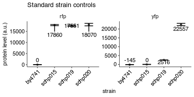
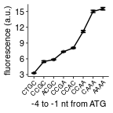

Flow analysis of PGK1 constructs with no rare codon inserts and varying Kozak
================
rasi
06 August, 2018

-   [Import libraries and analysis specific parameters](#import-libraries-and-analysis-specific-parameters)
-   [Read data into a single data frame](#read-data-into-a-single-data-frame)
-   [Read annotations](#read-annotations)
-   [Rename and calculate average values of fluorescence channels](#rename-and-calculate-average-values-of-fluorescence-channels)
-   [Calculate mean and standard deviation](#calculate-mean-and-standard-deviation)
-   [Plot the raw values for the 4 control samples used across all experiments](#plot-the-raw-values-for-the-4-control-samples-used-across-all-experiments)
-   [Plot background subtracted and normalized YFP/RFP ratio as a function of initiation codon](#plot-background-subtracted-and-normalized-yfprfp-ratio-as-a-function-of-initiation-codon)

Import libraries and analysis specific parameters
-------------------------------------------------

``` r
# standard analysis and plotting functions, includes dplyr, ggplot2 
library(tidyverse)
# loads lab default ggplot2 theme and provides color-blind friendly palette
library(rasilabRtemplates)

# # bad wells that had zero or abnormal signals. These are excluded from analysis.
# bad_wells <- list(
#   list("strain" = "schp281", "replicate" = 3),
#   list("strain" = "schp307", "replicate" = 1)
# ) %>% 
#   bind_rows()

# intiiation sites are arranged in this order
initiationmutation_order <- seq(1,8)
names(initiationmutation_order) <- toupper(c( 'ctgc', 'ccgc', 
                              'acgc', 'ccga', 'ccac', 'ccaa', 'caaa', 'aaaa'))
```

Read data into a single data frame
----------------------------------

``` r
flowdata  <- '../data/flow/initiation_pgk1_no_insert/' %>% 
  # get all fcs files
  list.files(full.names = T, pattern = '.fcs$') %>% 
  enframe("sno", "filename") %>% 
  # get data from each file
  mutate(data = map(filename, . %>% 
                      flowCore::read.FCS(transformation = F, alter.names = T) %>% 
                      flowCore::exprs() %>% 
                      as_tibble())) %>% 
  # extract file name without .fcs extension and parent folder name
  mutate(file = str_extract(filename, '[^/]+(?=.fcs$)')) %>% 
  # get rid of unwanted columns
  select(-sno, -filename) %>% 
  # expand data out
  unnest() %>% 
  print()
```

    ## # A tibble: 1,860,000 x 6
    ##    file                      FSC.A  SSC.A FITC.A PE.Texas.Red.A  Time
    ##    <chr>                     <dbl>  <dbl>  <dbl>          <dbl> <dbl>
    ##  1 Specimen_001_B10_B10_009 32544. 32173. 14525.          6771.  3.02
    ##  2 Specimen_001_B10_B10_009 75715. 97547. 32507.         18091.  3.04
    ##  3 Specimen_001_B10_B10_009 58853. 59289. 24074.         12498.  3.04
    ##  4 Specimen_001_B10_B10_009 45562. 40830. 12983.          6981.  3.04
    ##  5 Specimen_001_B10_B10_009 62411. 64592. 22877.         11384.  3.04
    ##  6 Specimen_001_B10_B10_009 26348. 24270.  8126.          4776.  3.05
    ##  7 Specimen_001_B10_B10_009 30727. 28565.  9842.          5716.  3.06
    ##  8 Specimen_001_B10_B10_009 44781. 40857. 16668.          8475.  3.07
    ##  9 Specimen_001_B10_B10_009 39938. 40284. 16554.          8870.  3.07
    ## 10 Specimen_001_B10_B10_009 32820. 24154.  9252.          4408.  3.07
    ## # ... with 1,859,990 more rows

Read annotations
----------------

``` r
annotations <- '../data/flow/initiation_pgk1_no_insert/sampleannotations.tsv' %>% 
                        read_tsv(col_types = list('plate' = col_integer())) %>% 
  # rename col
  rename(gene = genes) %>%
  # replace all 'na' ny NA
  mutate_all(funs(ifelse(. == 'na', NA, .))) %>%
  # extract number of stall sites
  mutate(numberofstallsites =
         ifelse(is.na(stallsites),
                0,
                str_count(stallsites, ',') + 1)) %>%
  # if there are no stall sites, there are no codon repeats
  mutate(numberofcodonrepeats = ifelse(numberofstallsites == 0,
                                       "–", numberofcodonrepeats)) %>%
  # the default initiation mutation is CAAA
  mutate(initiationmutation = if_else(is.na(initiationmutation), "CAAA",
                                      initiationmutation)) %>%
  mutate(initiationmutation = toupper(initiationmutation)) %>%
  # arrange initiationmutation in this order
  mutate(initiationmutation = fct_reorder(
      initiationmutation,
      initiationmutation_order[initiationmutation])) %>%
  print()
```

    ## # A tibble: 186 x 19
    ##    plate file  strain codonmutation numberofcodonre… stallsites
    ##    <int> <chr> <chr>  <chr>         <chr>            <chr>     
    ##  1     1 Spec… by4741 <NA>          –                <NA>      
    ##  2     1 Spec… schp0… <NA>          –                <NA>      
    ##  3     1 Spec… schp0… cgg           6                1         
    ##  4     1 Spec… schp0… aga           –                <NA>      
    ##  5     1 Spec… schp9… <NA>          –                <NA>      
    ##  6     1 Spec… schp9… <NA>          –                <NA>      
    ##  7     1 Spec… schp9… <NA>          –                <NA>      
    ##  8     1 Spec… schp9… <NA>          –                <NA>      
    ##  9     1 Spec… schp9… <NA>          –                <NA>      
    ## 10     1 Spec… schp9… <NA>          –                <NA>      
    ## # ... with 176 more rows, and 13 more variables: initiationmutation <fct>,
    ## #   gene <chr>, gpdmkate2 <chr>, citrine <chr>, replicate <int>,
    ## #   knockoutgenes <lgl>, taggene <lgl>, tag <lgl>, genewithtag <lgl>,
    ## #   parent <chr>, note <lgl>, initimut <chr>, numberofstallsites <dbl>

Rename and calculate average values of fluorescence channels
------------------------------------------------------------

``` r
by_file <- flowdata  %>% 
  # group by  each file (well)
  group_by(file) %>% 
  select(FITC.A, PE.Texas.Red.A) %>% 
  # calculate mean
  summarise_all(mean) %>% 
  # rename
  rename('yfp' = FITC.A, 'rfp' = PE.Texas.Red.A) %>% 
  # join annotations
  left_join(annotations, by = 'file') %>% 
  print()
```

    ## # A tibble: 186 x 21
    ##    file     yfp    rfp plate strain codonmutation numberofcodonre…
    ##    <chr>  <dbl>  <dbl> <int> <chr>  <chr>         <chr>           
    ##  1 Spec… 1.60e4 8.21e3     1 schp9… <NA>          –               
    ##  2 Spec… 1.13e4 7.56e1     1 schp9… <NA>          –               
    ##  3 Spec… 6.22e1 3.46e1     1 by4741 <NA>          –               
    ##  4 Spec… 2.55e2 1.75e4     1 schp0… <NA>          –               
    ##  5 Spec… 2.89e3 1.73e4     1 schp0… cgg           6               
    ##  6 Spec… 2.23e4 1.64e4     1 schp0… aga           –               
    ##  7 Spec… 2.89e2 1.78e2     1 schp9… <NA>          –               
    ##  8 Spec… 1.49e4 4.52e3    NA <NA>   <NA>          <NA>            
    ##  9 Spec… 1.83e4 9.60e3     1 schp9… <NA>          –               
    ## 10 Spec… 1.37e4 7.09e3     1 schp9… <NA>          –               
    ## # ... with 176 more rows, and 14 more variables: stallsites <chr>,
    ## #   initiationmutation <fct>, gene <chr>, gpdmkate2 <chr>, citrine <chr>,
    ## #   replicate <int>, knockoutgenes <lgl>, taggene <lgl>, tag <lgl>,
    ## #   genewithtag <lgl>, parent <chr>, note <lgl>, initimut <chr>,
    ## #   numberofstallsites <dbl>

Calculate mean and standard deviation
-------------------------------------

``` r
avg_data  <- by_file %>% 
  # anti_join(bad_wells) %>% 
  # strain is used to get replicates
  group_by(strain) %>% 
  # calculate mean and std.err
  mutate(mean_yfp = mean(yfp), 
         mean_rfp = mean(rfp)) %>% 
  ungroup() %>% 
  print()
```

    ## # A tibble: 186 x 23
    ##    file     yfp    rfp plate strain codonmutation numberofcodonre…
    ##    <chr>  <dbl>  <dbl> <int> <chr>  <chr>         <chr>           
    ##  1 Spec… 1.60e4 8.21e3     1 schp9… <NA>          –               
    ##  2 Spec… 1.13e4 7.56e1     1 schp9… <NA>          –               
    ##  3 Spec… 6.22e1 3.46e1     1 by4741 <NA>          –               
    ##  4 Spec… 2.55e2 1.75e4     1 schp0… <NA>          –               
    ##  5 Spec… 2.89e3 1.73e4     1 schp0… cgg           6               
    ##  6 Spec… 2.23e4 1.64e4     1 schp0… aga           –               
    ##  7 Spec… 2.89e2 1.78e2     1 schp9… <NA>          –               
    ##  8 Spec… 1.49e4 4.52e3    NA <NA>   <NA>          <NA>            
    ##  9 Spec… 1.83e4 9.60e3     1 schp9… <NA>          –               
    ## 10 Spec… 1.37e4 7.09e3     1 schp9… <NA>          –               
    ## # ... with 176 more rows, and 16 more variables: stallsites <chr>,
    ## #   initiationmutation <fct>, gene <chr>, gpdmkate2 <chr>, citrine <chr>,
    ## #   replicate <int>, knockoutgenes <lgl>, taggene <lgl>, tag <lgl>,
    ## #   genewithtag <lgl>, parent <chr>, note <lgl>, initimut <chr>,
    ## #   numberofstallsites <dbl>, mean_yfp <dbl>, mean_rfp <dbl>

``` r
yfp_background <- avg_data %>% 
  filter(strain == "schp015") %>% 
  pull(mean_yfp)

rfp_background <- avg_data %>% 
  filter(strain == "by4741") %>% 
  pull(mean_rfp)

avg_data <- avg_data %>% 
  mutate(yfp = yfp - yfp_background, 
         rfp = rfp - rfp_background, 
         yfp_rfp_ratio = yfp / rfp) %>% 
  # calculate mean and std.err
  group_by(strain) %>% 
  mutate(mean_yfp = mean(yfp), 
         mean_rfp = mean(rfp), 
         mean_ratio = mean(yfp_rfp_ratio), 
         se_yfp = sd(yfp)/sqrt(n()), 
         se_rfp = sd(rfp)/sqrt(n()),
         se_ratio = sd(yfp_rfp_ratio)/sqrt(n())) %>% 
  slice(1) %>% 
  ungroup()

normalization <- avg_data %>% 
  filter(strain == "schp019")
```

Plot the raw values for the 4 control samples used across all experiments
-------------------------------------------------------------------------

``` r
plot_data <- avg_data %>% 
  filter(strain %in% c("schp015", "schp019", "schp020", "by4741")) %>% 
  select(strain, mean_yfp, mean_rfp, se_yfp, se_rfp) %>% 
  gather(qty, value, -strain) %>% 
  separate(qty, into = c("measure", "channel"), sep = "_") %>% 
  spread(measure, value)

plot_data %>%
  ggplot(aes(x = strain, y = mean,
             ymin = mean - se, ymax = mean + se)) +
  facet_wrap(~channel, ncol = 2, scales = "free") +
  geom_point(size = 1, height = 0, width = 0.1, alpha = 0.5) +
  ggrepel::geom_text_repel(aes(label = as.integer(mean), y = mean), 
                           size = 3, direction = "y") +
  geom_errorbar(width = 0.5) +
  labs(y = 'protein level (a.u.)',
       x = 'strain',
       title = "Standard strain controls") +
  theme(axis.text.x = element_text(angle = 45, hjust = 1))
```



Plot background subtracted and normalized YFP/RFP ratio as a function of initiation codon
-----------------------------------------------------------------------------------------

``` r
plot_data <- avg_data %>% 
  mutate(mean_ratio = mean_ratio / normalization[[1, "mean_ratio"]]) %>% 
  mutate(se_ratio = se_ratio / normalization[[1, "mean_ratio"]]) %>% 
  filter(initiationmutation != "CTG") %>%
  filter(gene == "pgk1")

plot_data %>% 
  ggplot(aes(x = initiationmutation, y = mean_ratio, 
             ymin = mean_ratio - se_ratio, ymax = mean_ratio + se_ratio,
             group = codonmutation)) +
  geom_point(size = 1, height = 0, width = 0.1, alpha = 0.5) +
  geom_line() +
  geom_errorbar(width = 0.5) +
  labs(y = 'fluorescence (a.u.)',
       x = 'Kozak (-4 to -1)') +
  theme(legend.title = element_text(size = 8),
        axis.text.x = element_text(angle = 45, hjust = 1, size = 6)) +
  scale_y_continuous(breaks = seq(3,15, 3))
```



``` r
ggsave("../figures/initiation_pgk1_no_insert_flow.pdf")
```
